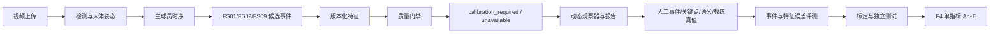

# RallyMate 产品说明书（当前态）

> 文档版本：1.7.0  
> 状态：当前产品事实基线  
> 更新日期：2026-09-05  
> 适用对象：产品负责人、教练、业务负责人、测试负责人、项目管理者  
> 当前机器注册表：`pose-wave-2026-08-22.17`  
> 当前人体姿态估计（Pose）部署注册表：`pose-deployment-presets-2026-09-04.1`  
> 配套技术文档：`docs/RallyMate技术架构与实现说明书_当前态_v1.0.md`  
> 本次修订：补充面向独立读者的评分概念、五项证据边界与验收示例；未变更产品运行逻辑或接口字段。

**推荐阅读路径：**首次阅读时，先看“独立读者导读”和第1章确认当前可交付能力；再看第2～3章理解首批指标；涉及采购、交付承诺或验收时，必须继续阅读第6.3节的五条正式评分边界。第7章以后用于产品管理、研发和验收追溯，可按职责查阅。

## 阅读指南：指标注册、Beta 反馈与正式评分的边界

RallyMate 的长期评分清单包含两个业务域：GS（底线基础事件）248项，FS（步伐事件）50项，合计298项。
这里的“纳入清单”或“可在能力矩阵中查看”，只表示系统已经登记指标名称、业务含义和所需输入，便于逐项审计；
它不表示298项都已有算法，更不表示已经能够给出正式分数。

当前进入用户侧闭环的只有 FS01、FS02、FS09 三类步伐事件中的13项。这13项只使用人体姿态估计得到的
身体关键点，因此称为 Pose-only（仅依赖人体姿态）指标。Demo v1.2 会基于可测覆盖、骨架置信信息、
重复动作的一致程度和证据完整性，给出“动作表现参考分（Beta）”以及自然语言观察和训练建议。
Beta 表示该反馈仍处于验证阶段；它帮助用户复盘本次视频，不是教练标定的技术等级，也不是298项正式评分的缩略版。

正式评分必须逐项完成五条证据链：人工确认动作发生的时间；人工校正评分所依赖的身体关键点；
多名教练独立给出 A～E 并在未参与开发的视频上测试；在单项可靠后另行定义跨事件、跨指标的总分；
依赖球、球拍或场地的指标还必须完成对应专项能力。任何一条缺失，都只能保持参考反馈或“暂无法评价”，
不能用 Beta 分、模型置信度、静态能力矩阵或人工经验阈值代替正式结论。

## 1. 当前产品结论

RallyMate 现在可以把一段网球视频拆成动作片段，持续跟住画面中的主球员，画出全身骨架，并计算身体下沉、膝盖弯曲、移动方向、减速和重新稳定等数据。用户可以直接回到视频中的具体时刻，看到系统为什么算出这个结果，以及为什么某一次结果不能使用。

但它目前还不能替代教练给出正式 A～E。原因不是系统完全没有结果，而是“什么样的数值属于 A、B、C、D、E”还没有经过多名教练标注和独立视频验证。当前最准确的产品定位是：**已经跑通动作观察和数据计算，尚未完成正式等级标定。**

当前产品已经做到：

- 用户可以在本地 Demo 首页选择一个或多个网球视频，让后台按选择顺序逐个分析，并在同一页面看到任务进度、每段视频的简要结果和可切换的详细结果；
- 默认人体模型从原来的17点升级为26点，对脚踝、脚跟和脚趾的观察更细；
- 可以在固定机位、单个主球员条件下寻找分腿垫步、第一步启动和制动稳定三段动作；
- 当前13个动作指标都已经可以计算相应的身体数据；
- 每个结果都能回到原视频、具体动作时间和证据帧；
- 已有动态观察器，可同步查看视频、骨架、动作片段、身体数据和不能评分的原因；
- 已有人工事件、关键点、语义、多教练标签和独立裁决的采集/编译接口；
- 已实现负责人放行后的 A/B 独立事件/阶段标注、C 裁决和私有入库代码；
- 已有阈值规则、序数回归、排序学习、独立测试、成熟度证据和可信发布的完整工程接口。

“上传视频 → 轮询任务 → 获取用户结果”的用户链路当前为 Demo v1.2；用户结果协议
`schema_version=1.2.0`，结果版本为 `rallymate-user-demo-result-v1.2.0`。普通用户首先看到
`training_evaluation` 的**动作表现参考分（Beta）**。它根据本视频重复动作的可测比例、必需特征覆盖、
骨架置信信息、跨片段重复性和评分证据质量生成，用于训练复盘，不是教练标定分、动作或识别准确率，
也不是正式 A～E。

结果页严格只呈现 FS01 4 项、FS02 4 项和 FS09 5 项共 13 项指标。每项指标都有分数或 `null`、自然语言
观察、证据摘要、训练建议和限制说明；每类动作另有 `performance_assessment`。若某项证据不足，页面显示
“暂无法评价”，不会把 `unavailable` 或 `null` 显示为 0。页面还明确显示图形处理器（GPU）或中央处理器
（CPU）、设备名称和 RTMPose 运行档位。骨架标注视频在普通用户页面默认关闭，以减少 CPU 编码开销；
需要时可以显式开启。

用户仍可一次选择多个视频，页面按顺序为每段视频创建一个原有单任务作业，显示“第 X/Y 个”，保留已完成
视频的简要结果并允许切换详情。刷新后可恢复已经提交的作业；浏览器 `localStorage` 只保存非敏感任务
通用唯一标识符（UUID）和批次状态，不保存访问口令、Authorization、文件、文件名、视频内容或结果载荷。刷新前尚未提交的
本地文件仍需重新选择。用户也可通过 `/?job_id=<UUID>` 直接恢复一个已有任务；页面只接受 UUID，仍不把
token、文件名、视频或结果正文写入 URL/localStorage。静态层叠样式表（CSS）和 JavaScript 脚本使用
`?v=1.2.0` 避免旧缓存。

`formal_scoring.available` 继续固定为 `false`，正式教练标定分和 grade 均为 `null`，不会由 Beta 分代填或
冒充。v1.1 的 `final_demo_score`、`analysis_quality`、`display_score`、`formation_assessment` 与
`summary_zh` 仍保留在响应中，供旧客户端兼容和历史追溯；普通用户页不再把“动作信息成型参考分”
当作技术表现主分。成功状态的旧任务如果缺少 `indicator-features.jsonl`，用户结果接口仍返回可操作的
超文本传输协议（HTTP）状态码 409，提示重新选择原视频分析，而不是报 500。

当前本机真实成功任务 `d7c617d6-89d2-44f2-83e5-de25cb24b689` 已用 v1.2 适配器重放：Beta 总分
78/100，13/13 项形成评价，FS01/FS02/FS09 分别为 78/77/78，运行于 GPU NVIDIA GeForce RTX 5070 Ti；
正式教练标定分和 A～E 仍为 `null`。该任务生成时尚未写入 CPU 线程字段，所以
`runtime.cpu_thread_limit=null`；新任务才会记录默认 4。该任务曾显式生成标注视频，不代表当前用户页
默认开启。上述数字只证明真实产物能形成 Beta 训练反馈，不是准确率、教练标定或候选晋级结论。

系统还登记了一个同为 Halpe26 的更大规格离线候选 RTMPose-X 384×288，并已在本机真实加载：三段开发视频
各抽取一个冻结检测帧，共 4 个球员感兴趣区域（Region of Interest，ROI），全部返回 26 点有限值。这个结果只证明候选能运行，
不证明它比当前模型更准。默认模型仍是 RTMPose-M 256×192。与此同时，项目已经补齐严格的微调
就绪审计、MMPose 数据集导出和 RTMPose-X 试运行（dry-run）/训练入口；但当前接受的人工关键点仍是 0 帧、
0 个关节值，所以系统会拒绝数据导出和训练，不会用模型预测伪造“已微调”。
X 候选注册表是运行检查前冻结的输入清单，检查后的状态保存在独立机器报告和字段记录中；系统不会
为了更新一句状态而回写已被烟测报告绑定的旧输入文件。

三种模型规格还在 3 个开发视频的 45 个同帧单人 ROI 上接受了一致输入比较：姿态返回率均为 1.0，
置信度≥0.5 的关键点覆盖率依次为 0.734188、0.747863、0.769231，单 ROI 耗时中位数（P50）依次为
9.1244、10.6427、11.7265 毫秒。这些只是相同画面上的输出覆盖、模型置信度和本机耗时，**没有人工
关键点真值，不能解释为准确率排名**。

最近一次残差帧复核在 3 个开发视频、258 个固定疑难帧上比较 X384 与两个既有基线的可测量恢复：X 为
2,331/2,366，两个基线分别为 2,327/2,366 和 2,333/2,366。X 相对前者新增 4、丢失 0；相对
后者新增 1 个不同项、但丢失 3 个既有可测项。因此 X 没有晋级，也没有替换默认模型；当前默认
仍是 RTMPose-M Halpe26 256×192。该比较只回答固定门禁下的可观测性，不是关键点、事件、技术动作
或教练评分准确率。

项目还冻结了一份仅用于评测、不允许用于训练的 Halpe26 人工评测试点：3 个开发视频、每个 8 帧，共 24 帧，
每帧 26 点，共 624 个关节点任务。当前人工填写行数仍为 0，准确率为 `null`。历史严格关键点包中的
1,976 个任务只是待标注任务计数，不是可直接用于训练的样本清单；真实治理字段、A/B 独立人工标注和
C 裁决均未完成，因此训练、数据集导出、准确率声明和候选晋级继续关闭。

人工事件/阶段标注设有本地负责人放行：负责人核对冻结的三视频计划后，才可允许独立标注者 A、独立标注者 B
和裁决者 C 开始工作。计划本身不能证明负责人身份或填写时间，不等于真实标签，也不允许直接
标定、发布或产生正式 A～E。当前计划已经冻结，但尚未创建实际放行记录，因此首次标注写入
仍保持关闭。后续三角色执行工作台、提交核对和私有事件/阶段入库已经实现为代码并通过相应软件测试，
但没有绕过这道前提，也没有创建任何实际执行包、裁决包、提交或正式接收记录。现有三视频技术包
仍只是可播放、可逐帧查看的技术交接，真实标签仍为 0。

当前产品还没有做到：

- 没有足够的人工事件真值，因此不能声明事件检测准确率；
- 没有人工校正关键点，因此不能声明脚踝、膝、髋等特征的真实误差；
- 没有多教练 A～E 真值和独立测试，因此不能产生正式等级或评分阈值；
- 没有定义跨事件、跨指标总分；
- 没有把 Ball、Racket、Court 或全部298项纳入本轮正式评分闭环。

因此当前结果只会出现以下三种情况：

- `calibration_required`：身体数据已经算出，但还不知道它对应 A、B、C、D 还是 E；
- `unavailable`：这次画面、动作片段或关键身体部位不足以支持可靠判断；
- `scored`：未来完成教练标定和独立验证后才会出现的正式等级状态，当前真实数据中没有。

## 2. 首批步伐指标的动作链与术语

最早选定的六个评分标准，实际上描述的是一条连续的脚步动作链：

```text
准备时先下沉蓄力
  → 分腿垫步落地后把身体重新放回可启动位置
  → 身体中心真正向目标方向移动
  → 到位后用下肢吸收移动惯性
  → 身体中心回到双脚能够支撑的区域
  → 最终恢复到可以再次移动或击球的可控状态
```

对应六项标准：

1. FS01-M02：重心预加载；
2. FS01-M05：重心重新分配并准备启动；
3. FS02-M02：重心向目标方向转换；
4. FS09-M03：下肢吸收身体惯性；
5. FS09-M04：重心重新稳定；
6. FS09-M05：身体进入稳定控制状态。

它们不是六个互不相关的分数。前两项看“准备得好不好”，第三项看“启动方向是否形成”，后三项看“移动后能否有效减速并恢复控制”。

### 2.1 核心术语及产品边界

| 文档术语 | 面向产品与交付的定义 | 当前系统采用的实现边界 |
|---|---|---|
| 重心 / 身体中心 | 身体重量大致集中在哪里 | 普通视频看不到真实力学重心，系统用肩、髋等骨架点构成的二维中心做代理 |
| 支撑区域 | 双脚之间能够承托身体的区域 | 系统主要看髋中心在左右脚踝之间的位置，不代表足底压力分布 |
| 预加载 | 启动前先把腿和身体调整到可发力状态 | 观察身体下沉、膝盖弯曲、站距和身体是否偏离双脚支撑 |
| 目标方向 | 教练希望球员移动的方向 | 不能从球员已经走出的路线倒推，必须由训练任务、来球或人工标注提供 |
| 吸收惯性 | 不是突然硬停，而是用屈膝、下沉逐步减速 | 观察身体速度下降、膝盖继续弯曲、髋部下降和躯干是否乱晃 |
| 稳定 | 身体不再持续冲出去，并重新可控 | 观察身体速度是否在一段时间内保持较低、身体中心是否回到双脚附近、上身摆动是否减小 |
| 骨架点 | 模型在肩、髋、膝、踝等位置画出的点 | 是模型估计位置，不是人工真值；遮挡时可能跳动、左右互换或缺失 |
| 动作片段 | 一次准备、启动或制动发生的时间范围 | 当前由规则自动寻找，是候选区间，需要教练真值评测 |
| 身体数据 | 从一段骨架变化计算出的角度、距离、速度或持续时间 | 技术文档称为“特征”；产品使用时应优先展示中文解释和单位 |
| F2 | 系统已经能计算该项所需身体数据 | 不代表数据已经能可靠区分 A～E |
| 标定 | 用教练给出的等级，学习身体数据和 A～E 的关系 | 当前真实教练标签为0，因此尚未完成 |

### 2.2 早期 A～E 文字标准的使用边界

最早指标卡已经给出了 A～E 的文字方向，例如“明显、连续、时序合理”“基本完成”“观察到但一般”“很小或失衡”“未观察到”。这些文字可以帮助教练和产品理解评价维度，但目前不能直接变成机器阈值。

原因是“明显”“略有不足”“一般”仍需要教练用大量真实视频说明其边界。当前文档保留这些文字作为**原始评分语义**，不把它们冒充已经验证的自动评分规则。

## 3. 首批六项评分标准的产品定义

### 3.1 FS01-M02：重心预加载

#### 动作阶段

发生在分腿垫步开始阶段。球员还没有真正向左或向右启动，先通过轻微下沉和屈膝，让身体从直立或放松状态进入可以快速反应的状态。

#### 评分表原始定义

“身体中心下压，双膝和踝关节进入弹性准备状态，为垫步离地和快速启动蓄力。”

#### 观测方法

- 身体是否在启动前自然下沉，而不是始终直立；
- 两侧膝盖是否进入有弹性的弯曲状态；
- 双脚站距是否能够支撑后续向两侧启动；
- 上半身是否保持可控，没有因为下沉而大幅前栽或后仰；
- 下沉是否连续地衔接后面的垫步，而不是“蹲一下—停住—再启动”。

#### 指标的产品含义

可以把它理解成弹簧被轻轻压缩。重点不是蹲得越低越好，而是球员是否及时、连续地进入可以向任何方向启动的弹性状态。

#### 系统测量方法

- 髋部中心在画面中是否下降；
- 左右膝弯曲角度；
- 两脚之间的宽度；
- 髋部是否仍位于双脚可以支撑的位置附近。

对应机器字段主要是：`hip_center_y_body`、左右膝屈曲角、`stance_width_body` 和髋部相对双踝支撑位置。

#### 原始等级语义

| 等级 | 原始语义 |
|---|---|
| A | 重心预加载明显、连续、时序合理，且无明显失衡 |
| B | 重心预加载基本完成，幅度、速度或节奏略有不足 |
| C | 观察到重心预加载，但连续性、协调性或稳定性一般 |
| D | 重心预加载很小、方向不清或出现明显停顿/失衡 |
| E | 未观察到重心预加载 |

#### 示例反馈表述

- 正向：垫步前已经完成明显而连续的下沉预加载；
- 改进：垫步前身体下沉不足，可以先屈膝降低身体中心，再完成轻微弹跳。

#### 证据边界

系统不能从二维画面测出肌肉是否真正蓄力、踝关节弹性或地面反作用力；也不能在没有教练标定时判断某个下沉幅度属于 A 还是 B。

### 3.2 FS01-M05：重心重新分配并准备启动

#### 动作阶段

发生在分腿垫步落地之后、第一步启动之前。它关注的不是“有没有落地”，而是落地后身体是否重新回到一个可以向来球方向立即启动的位置。

#### 评分表原始定义

“双脚落地后，身体中心回到支撑区域并形成可向来球方向启动的稳定状态。”

#### 观测方法

- 落地后身体中心是否落在双脚能够控制的区域，而不是偏在一侧；
- 身体是否迅速结束多余的上下或左右晃动；
- 膝盖是否仍然保持弹性，而不是完全站直；
- 球员是否可以直接进入第一步，而不是落地后再调整一次脚步；
- 落地稳定和下一步启动之间是否衔接顺畅。

#### 指标的产品含义

分腿垫步不是“跳一下”就结束。真正有用的是落地后身体处在一个随时可以往左或往右走的位置。若落地后还要重新找平衡，垫步就没有完成其准备价值。

#### 系统测量方法

- 身体移动速度在落地后是否降低并趋于稳定；
- 髋部中心相对双脚支撑位置是否合理；
- 躯干倾斜是否可控；
- 肩和髋的旋转变化是否逐步收住。

当前系统可以观察落地后的身体重新分配，但“已经完全准备好启动”仍需要结合后续第一步和人工阶段标注验证。

#### 原始等级语义

| 等级 | 原始语义 |
|---|---|
| A | 重心重新分配明显、连续、时序合理，且无明显失衡 |
| B | 重心重新分配基本完成，幅度、速度或节奏略有不足 |
| C | 观察到重心重新分配，但连续性、协调性或稳定性一般 |
| D | 重心重新分配很小、方向不清或出现明显停顿/失衡 |
| E | 未观察到重心重新分配 |

#### 示例反馈表述

- 正向：落地后身体中心很快重新进入支撑区域，已经具备启动条件；
- 改进：落地后身体仍偏离支撑区域，可以先控制住身体，再向来球方向启动。

#### 证据边界

系统不能通过脚踝点确认真实足底压力，也不能只凭某一帧判断“准备完成”。如果落地后的尾部画面不足、脚踝被遮挡或后续启动事件没有找到，应输出不可用而不是猜测。

### 3.3 FS02-M02：重心向目标方向转换

#### 动作阶段

发生在分腿垫步完成后到第一步启动的过程中。重点是身体中心是否真正开始向需要到达的位置移动，而不只是脚先跨出去或上半身先晃动。

#### 评分表原始定义

早期指标卡名称为“重心向来球方向转换”，定义是：“身体中心由中性准备位置向目标方向产生持续位移。”当前系统使用更谨慎的名称“重心向目标方向转换”，因为实际训练目标不一定只由来球方向决定。

#### 观测方法

- 髋部和身体中心是否向目标方向形成持续移动；
- 肩部与髋部的整体方向是否协调；
- 第一步之前是否出现反向晃动或多余的预摆；
- 身体是否真正“送向”移动方向，而不是只伸脚够位置；
- 方向转换是否紧接分腿垫步落地发生。

#### 指标的产品含义

脚迈向右边不代表身体已经向右启动。如果髋部仍留在原地或先向左晃一下，第一步会慢。这个标准看的是身体主体是否及时跟上正确方向。

#### 系统测量方法

- 身体中心的移动速度；
- 髋部相对双脚的位置；
- 躯干倾斜；
- 髋部在画面中的移动方向；
- 实际移动方向与外部目标方向之间的夹角。

目标方向必须来自训练任务、来球语义或人工标注。系统不能把球员已经走出的方向直接当成“正确方向”，否则无论走向哪里都会被判定为正确。

#### 原始等级语义

| 等级 | 原始语义 |
|---|---|
| A | 重心方向转换明显、连续、时序合理，且无明显失衡 |
| B | 重心方向转换基本完成，幅度、速度或节奏略有不足 |
| C | 观察到重心方向转换，但连续性、协调性或稳定性一般 |
| D | 重心方向转换很小、方向不清或出现明显停顿/失衡 |
| E | 未观察到重心方向转换 |

#### 示例反馈表述

- 正向：垫步落地后身体中心迅速向目标方向转换，启动主动；
- 改进：身体中心转换不明显或出现反向晃动，应先让身体主体进入移动方向。

#### 证据边界

没有外部目标方向时，系统只能描述“球员实际向哪里移动”，不能评价“方向是否正确”。明显移动相机、透视变化或髋部遮挡也会影响二维方向判断。

### 3.4 FS09-M03：下肢吸收身体惯性

#### 动作阶段

发生在球员高速移动后开始制动的阶段。球员需要通过膝盖弯曲、髋部下沉和稳定躯干，让身体速度逐渐降低。

#### 评分表原始定义

“制动后双膝屈曲、髋中心下降，身体速度明显降低。”

#### 观测方法

- 制动时膝盖是否保持弹性，而不是腿部僵直地硬顶；
- 髋部是否配合下沉；
- 身体速度是否在制动动作中明显下降；
- 上半身是否仍然可控，没有大幅向前冲或左右甩动；
- 左右腿是否共同完成稳定吸收，而不是一侧明显塌陷。

#### 指标的产品含义

可以把它理解成汽车减震。好的制动不是突然锁死，而是下肢逐步把移动速度“吃掉”，让身体没有明显冲击和失控。

#### 系统测量方法

- 髋部减速强度和速度下降量；
- 左右膝弯曲变化；
- 髋部高度变化；
- 躯干倾斜在制动过程中的波动。

#### 原始等级语义

| 等级 | 原始语义 |
|---|---|
| A | 下肢吸收惯性明显、连续、时序合理，且无明显失衡 |
| B | 下肢吸收惯性基本完成，幅度、速度或节奏略有不足 |
| C | 观察到下肢吸收惯性，但连续性、协调性或稳定性一般 |
| D | 下肢吸收惯性很小、方向不清或出现明显停顿/失衡 |
| E | 未观察到下肢吸收惯性 |

#### 示例反馈表述

- 正向：下肢屈曲吸收惯性充分，身体减速平稳；
- 改进：制动时膝部过直或身体冲击明显，可以通过屈膝下沉更平稳地吸收惯性。

#### 证据边界

二维 Pose 只能观察身体动作，不能测出膝关节受力、肌肉负荷、地面反作用力或受伤风险。髋部“减速度”使用身体尺度单位，也不是物理传感器测得的米每二次方秒。

### 3.5 FS09-M04：重心重新稳定

#### 动作阶段

发生在主要减速动作之后。此时球员可能已经明显慢下来，但身体中心仍可能继续向外冲、左右摇摆或需要反复调整脚步。该项关注重心是否真正回到双脚可控范围。

#### 评分表原始定义

“制动后身体中心重新进入双脚支撑区域，速度和摆动趋于稳定。”

#### 观测方法

- 髋部中心是否回到双脚之间或合理支撑位置；
- 身体速度是否继续下降；
- 双脚站距是否能提供稳定支撑；
- 肩部与髋部的旋转、摆动是否逐渐减小；
- 是否需要多次碎步或上身补偿才能维持平衡。

#### 指标的产品含义

“慢下来”和“稳下来”不是同一件事。球员可能速度已经不快，但身体还在向一侧倒。这个标准看的是身体是否重新回到脚下，停止持续失衡。

#### 系统测量方法

- 髋部相对左右脚踝的位置；
- 髋部速度下降；
- 两脚支撑宽度；
- 低速状态维持了多久；
- 肩部和髋部旋转速度是否下降；
- 双脚是否同时处于低移动速度状态。

#### 原始等级语义

| 等级 | 原始语义 |
|---|---|
| A | 重心重新稳定明显、连续、时序合理，且无明显失衡 |
| B | 重心重新稳定基本完成，幅度、速度或节奏略有不足 |
| C | 观察到重心重新稳定，但连续性、协调性或稳定性一般 |
| D | 重心重新稳定很小、方向不清或出现明显停顿/失衡 |
| E | 未观察到重心重新稳定 |

#### 示例反馈表述

- 正向：制动后身体中心快速回到支撑区域，稳定恢复较好；
- 改进：制动后身体仍持续偏移，可以先把身体中心稳定在双脚附近，再进入下一步。

#### 证据边界

系统使用双脚低速和髋部位置作为支撑代理，不能确认双脚真实承重比例。原始标准中的“速度低于阈值持续若干帧”仍需要教练真值确定阈值和持续时间，当前没有正式数值标准。

### 3.6 FS09-M05：身体进入稳定控制状态

#### 动作阶段

发生在制动动作末端。它不是只看某一帧“站住了”，而是看球员是否已经从移动惯性中恢复，可以继续回位、再次启动或进入下一次击球准备。

#### 评分表原始定义

“身体速度降低、双脚重新形成支撑，并可进入回位、再次启动或下一动作。”

#### 观测方法

- 身体低速和稳定是否保持了一段时间；
- 双脚是否重新形成可控支撑；
- 躯干和肩髋旋转是否收住；
- 球员是否在稳定后自然进入下一动作；
- 是否出现“还没有稳住就急着再次启动”的情况。

#### 指标的产品含义

FS09-M04 看“重心有没有回到脚下”，FS09-M05 看“整个人是不是已经重新可用”。前者偏向位置恢复，后者偏向持续控制和下一动作准备。

#### 系统测量方法

- 低速稳定维持时间；
- 身体速度下降；
- 双脚同时低速的持续时间；
- 躯干波动；
- 肩部与髋部旋转变化；
- 减速高点到双脚稳定代理之间的时间关系。

原始指标还希望观察后续回位或再次启动的连续性；当前 F2 实现主要测量 FS09 事件内部的稳定尾部，尚不能独立证明下一动作质量。

#### 原始等级语义

| 等级 | 原始语义 |
|---|---|
| A | 稳定控制状态明显、连续、时序合理，且无明显失衡 |
| B | 稳定控制状态基本完成，幅度、速度或节奏略有不足 |
| C | 观察到稳定控制状态，但连续性、协调性或稳定性一般 |
| D | 稳定控制状态很小、方向不清或出现明显停顿/失衡 |
| E | 未观察到稳定控制状态 |

#### 示例反馈表述

- 正向：身体已经从惯性状态恢复到可控、可再次启动的状态；
- 改进：身体尚未完全稳定就开始下一动作，应先完成制动和控制，再进入下一步。

#### 证据边界

若视频在稳定形成前结束，或者没有后续动作，系统不能确认完整的“可再次启动”能力。当前也没有经教练标定的稳定持续时间或 A～E 分界。

### 3.7 六项标准的边界区分

| 容易混淆的两项 | 区别 |
|---|---|
| FS01-M02 与 FS01-M05 | M02看落地前是否完成下沉蓄力；M05看落地后是否重新处于可启动位置 |
| FS01-M05 与 FS02-M02 | M05是“准备好了”；M02是“身体已经真正向目标方向走了” |
| FS09-M03 与 FS09-M04 | M03看下肢怎样减速吸收；M04看减速后身体中心是否重新回到支撑区域 |
| FS09-M04 与 FS09-M05 | M04偏向重心位置和摆动恢复；M05偏向稳定是否持续并能够衔接下一动作 |

### 3.8 正式 A～E 的必要前提

六项早期文字标准都使用了“明显”“基本完成”“一般”“很小”等词。这些词需要教练回答：

- 多大的下沉才算明显；
- 多快的方向转换才算及时；
- 膝屈曲、髋下降和速度下降应如何综合；
- 稳定需要保持多久；
- 不同身高、水平、机位和动作速度是否使用同一边界；
- 多名教练意见不一致时怎样处理。

当前系统已经能够提供回答这些问题所需的身体数据，但目前没有真实教练样本来确定答案。因此产品必须先显示数据和证据，不能擅自把某个数值写成 A 或 B。

## 4. 产品愿景

### 4.1 产品目标

把网球教练对运动员动作的观察过程转化为可复核、可量化、可迭代的运动智能分析流程：

1. 系统先从视频中定位主球员与动作事件；
2. 再计算与教练评分语义对应的运动学证据；
3. 对证据质量进行门禁，不把低质量观测伪装成评分；
4. 使用教练真值完成标定和独立测试；
5. 最终对单个指标、单个事件输出可解释的 A～E 或 unavailable。

### 4.2 禁止替代正式证据链的做法

RallyMate 不把以下现象等同于评分能力：

- 检测到“人”不等于理解动作；
- 骨架点更多不等于关键点更准确；
- 帧覆盖率高不等于事件或评分准确；
- 特征能算出不等于能区分 A～E；
- 规则阈值能运行不等于阈值经过教练验证；
- 单段视频效果好不等于通过独立测试；
- 报告里展示更多指标不等于形成评分闭环。

## 5. 目标用户与核心诉求

### 5.1 教练

核心诉求：快速定位动作片段，查看运动员在预加载、启动、制动和稳定阶段的身体证据，并理解系统为什么给出或不给出结果。

当前可获得：

- 动作候选时间轴；
- 全身骨架和指标依赖关节；
- 事件阶段、特征数值、有效性、证据帧；
- 质量阻断原因；
- 人工事件、关键点、语义和评分标签工作台。

当前不可获得：未经真值标定的正式 A～E。

### 5.2 运动员

核心诉求：直观看到动作发生在哪里、系统观察到了什么、哪些部位存在可测量变化。

当前可获得：Demo v1.2 的多视频顺序分析、动作表现参考分（Beta）、严格 13 项自然语言观察/证据/训练
建议、每类动作参考和幅度摘要，以及动态观察器和候选特征证据。Beta 结果只用于当前视频的训练复盘，
不能解释为动作或识别准确率、正式教练标定分或 A～E；证据不足时显示“暂无法评价”，不显示伪 0 分。

### 5.3 算法与数据团队

核心诉求：知道每个指标处于 F0～F4 的哪一层、缺什么真值、怎样评测、怎样避免数据泄漏、怎样安全发布。

当前可获得：机器可读成熟度注册表、人工真值包、误差评测、标定数据集、独立测试和可信发布契约。

### 5.4 产品与运营团队

核心诉求：能够准确区分当前已经上线的能力、实验能力和未来承诺，避免向用户展示虚假评分。

当前可获得：统一状态模型、产品验收口径和当前三视频实测数据。

## 6. 当前产品范围

### 6.1 本阶段正式范围

- 固定机位；
- 单个主球员；
- 单目二维视频；
- COCO-17 公共人体骨架或具备显式映射的超集拓扑；
- 当前默认 RTMPose-M/Halpe26；
- FS01、FS02、FS09；
- 13项 Pose-only 指标；
- 单指标、单事件的特征和未来等级输出；
- 人工真值、误差评测和标定发布闭环。

### 6.2 明确不在当前范围

- 全部298项的正式评分；
- Ball、Racket、Court 驱动的评分；
- 多球员自动身份识别；
- 移动相机、自由拍摄和多机位三维重建；
- 足底接触、地面反作用力、肌肉发力等无法由普通二维 Pose 直接观测的物理量；
- 自动生成 A～E 经验阈值；
- 跨指标总分或运动员综合评级；
- 把 WholeBody133 的脸部、手部点数直接转化为评分指标数量。

### 6.3 五条正式评分边界：定义、影响与验收

本节供没有评分表背景、也不了解计算机视觉的产品、交付和验收人员独立阅读。正式评分的最小单位是：
**在一个经过人工确认的动作事件中，对一个已完成标定和独立测试的指标给出 A～E 或“无法评价”。**
当前13项 Beta 反馈还没有满足这个定义。它们已经能把人体运动转换为可复查的数据和训练提示，成熟度为 F2；
只有逐项通过以下证据链，才可能成为正式评分。Beta 结果不能反过来充当任何一条证据链的人工答案。

#### 6.3.1 人工事件真值：先确认“动作何时发生”

**正式定义。** 人工事件真值是由标注人员完整观看原视频、独立判断某类网球动作是否发生，并记录动作
开始、结束和必要阶段时刻后，经冲突裁决形成的参考答案。这里的“真值”是按冻结规范接受的人工参考，
不是模型输出，也不是只确认模型已经圈出的候选片段。完整观看全视频非常重要，因为模型没有圈出的动作
也必须被计入漏检。

旧材料若使用“人工时间真值”，本版统一规范为“人工事件真值（含人工时间边界和关键阶段）”。其中“时间”
指动作在视频时间轴上的位置，不是标注人员的操作时长，也不是任务处理耗时。

**网球视频示例。** 假设球员在第12秒完成一次分腿垫步。系统候选区间是 12.10～12.68 秒；标注者 A
独立记录 12.04～12.74 秒，标注者 B 独立记录 12.09～12.70 秒，裁决者最终接受 12.06～12.72 秒，
并确认落地发生在 12.33 秒。后续“落地后是否及时启动”必须围绕人工接受的落地时刻计算。如果视频
第28秒还有一次分腿垫步而系统完全漏掉，完整时间线审阅会把它记录下来；只复核系统候选则永远发现不了
这次漏检。以上数字仅说明验收方法，不是当前数据结果。

**当前已具备。** 系统可以自动生成 FS01、FS02、FS09 的候选区间、关键阶段和证据帧；也已经具备负责人
放行、两名标注者隔离作业、第三人裁决、完整视频确认和私有接收的工作台与校验接口。现有三视频技术包
可以播放和逐帧查看。

**尚缺与缺失影响。** 当前尚无实际负责人放行、角色执行包、人工提交、裁决结果或被接收的人工事件行，
真实事件标签仍为0。因而系统不能声明事件查准率、事件查全率或边界准确率。事件边界一旦偏早或偏晚，
膝角、身体下沉、启动方向和制动速度就可能取到错误帧；即使公式完全正确，所得特征也不代表教练所看的
那次动作。当前13项 Beta 使用自动候选事件，只能用于视频内参考，不能证明事件识别准确。

**未来验收方式。** 每个验收视频至少由两名互相独立的标注者完整审阅，界面不向其显示模型分数或候选
答案；差异由独立裁决者处理，并保留原始意见和边界不确定度。团队应在评测前按事件类型和机位冻结通过
标准，再计算事件 F1（同时反映误报与漏报的综合指标）、Segment IoU（Intersection over Union，事件
时间区间的交并比）和 Boundary MAE（Mean Absolute Error，开始/结束边界的平均绝对误差）。只有预先
约定的覆盖、误差和分视角要求全部通过，该事件层才可作为后续正式评分输入。详细采集规范保留在
`docs/SCORING_TRUTH_COLLECTION.md`。

#### 6.3.2 人工校正关键点：再确认“身体位置是否测准”

**正式定义。** 人工校正关键点真值是在原始视频帧上，由人员按运动员自身的左、右解剖位置标出肩、髋、
膝、踝、脚跟和脚趾等评分所需位置，并明确记录遮挡或不可见状态；两份独立标注经过裁决后，形成每一帧、
每一关节唯一接受的参考坐标。模型画出的骨架只是一种预测，不能复制为人工答案；不可见点也不能用0坐标
或模型估计补齐。

**网球视频示例。** 球员向右急停时，左脚踝被右腿遮住，模型把左脚踝跳到了右鞋附近。人工标注者应把
该点标为不可见，或者在确实可辨认时点击解剖学左踝，而不是沿用骨架覆盖层的位置。随后可在同一裁决帧上
比较模型踝点与人工踝点，并重新计算膝屈曲和身体中心位置。这样才能判断误差来自模型关键点，还是来自
后面的特征公式。

**当前已具备。** 当前默认 RTMPose-M/Halpe26 能输出26个人体点，系统也具备关键点采集、双人隔离标注、
第三人裁决和误差计算接口。现有仅评测试点冻结了3个开发视频、每个8帧，共24帧×26点=624个关节点任务。
历史严格包中的1,976个记录也是待标注任务计数。三种模型规格还完成过同帧输出覆盖和耗时比较。

**尚缺与缺失影响。** 上述试点当前人工填写行数为0，真实治理信息、两份独立提交和裁决均未完成；
1,976个待办也没有变成可接受训练样本。因此不能声明踝、膝、髋等点的真实误差，不能把“输出点更多”或
“模型置信度更高”解释为更准确，也不能据此晋级模型或启动有效微调。关键点偏移会继续传递到角度、速度、
方向和稳定性，当前13项 Beta 的数值只能视为模型观测下的训练参考。

**未来验收方式。** 先补齐授权、运动员、拍摄场次、用途和保留周期等治理字段，再由两名人员完成独立
标注并由第三人裁决。数据必须按运动员、视频、场次和机位隔离，避免同一人的近似画面同时进入开发集与
测试集。模型比较至少应按关节和视角报告 PCK（Percentage of Correct Keypoints，在约定距离容差内的
关键点比例）、平均绝对误差、第95百分位误差和系统性偏差，并单列遮挡、远景、快速移动等条件；容差和
通过线须在查看候选结果前冻结。未显式标注的位置保持缺失，不允许用模型预测补齐。只有关键点误差足够小，
且不会掩盖指标等级间差异，相关人体特征才具备进入正式标定的资格。

#### 6.3.3 多教练 A～E 真值与独立测试：确认“什么表现属于哪个等级”

**正式定义。** 多教练 A～E 真值是多名合格教练针对同一个人工事件、同一个指标，在看不到模型分数和
候选阈值的条件下独立给出的有序等级。A～E 只表示从较高到较低的顺序，不天然等于等距的5、4、3、2、1。
原始意见、分歧和裁决都必须保留，系统不能通过简单多数投票制造虚假的一致意见。独立测试是指：把未参与
规则编写、阈值拟合和候选选择的视频、运动员与拍摄场次提前封存；先冻结评测协议和候选版本，再一次性
运行并报告所有合格样本与排除原因。

**网球视频示例。** 对同一次分腿垫步的“重心预加载”，三名教练可能分别给出 A、B、B。产品不能直接把
多数票 B 当作无争议答案，也不能先让教练看到系统给出的78分再询问等级。应保留三份原始标签，检查分歧
是否来自动作定义、机位遮挡或等级边界，并按预先规定的流程裁决。用于拟合 A～E 边界的视频不能再被当作
最终考试题；最终考试应使用开发过程中没有查看过的运动员和视频。

**当前已具备。** 系统已经具备教练等级或相对排序的采集结构、标定数据编译、阈值规则、序数回归、排序
候选、封存独立评测、成熟度证据和受控发布接口。这些工程能力能够拒绝缺字段、数据串集、来源被替换或
质量门禁失败的输入。

**尚缺与缺失影响。** 当前真实教练 A～E 标签数为0，生产阈值数为0，没有真实独立测试报告或达到 F4 的
生产资产。最早评分表中的“明显”“一般”“不足”等文字仍只是评分语义，尚未由真实样本界定边界。因此
任何自动 A～E 都会是未经证实的经验判断，既不能声称与教练一致，也不能声称在新运动员、新机位或新视频
上有效。当前13项 Beta 不参与拟合正式等级，Beta 78/100 也不对应 A、B 或任何正式技术水平。

**未来验收方式。** 每个拟标定指标都要在相同人工事件上获得至少两名教练的重叠标签，按指标和视角报告
覆盖率与一致性。等级一致性可使用 QWK（Quadratic Weighted Kappa，二次加权一致性系数），排序一致性可
使用 Kendall tau（衡量两个排序接近程度的系数）；采用何种指标、最低样本覆盖和通过线必须预先登记，
不能在看到结果后调整。训练集用于拟合，验证集用于选择候选，封存独立测试集只在候选、误差预算和排除
规则冻结后启用。报告必须列出全部封存样本、实际评价样本、有效率、排除数量和原因；通过后仍需人工审批、
版本冻结和运行环境绑定，才允许该单项输出 `scored` 与 A～E。编译、拟合和成熟度证据分别见
`docs/CALIBRATION_DATASET_COMPILER.md`、`docs/CALIBRATION_CANDIDATE_FITTING.md` 和
`docs/MATURITY_EVIDENCE_BUNDLE.md`。

#### 6.3.4 跨事件、跨指标总分：确认“哪些分可以合并以及如何合并”

**正式定义。** 跨事件汇总是把同一指标在多次动作中的结果合成为一个结论，例如把一段训练中的多次
分腿垫步汇总为稳定性表现；跨指标汇总是把不同指标、动作阶段或业务域组合成更高层分数。正式总分必须
明确评价对象、用途、权重、重复动作处理、缺失值处理、最低覆盖、置信度、版本和可比范围。A～E 是有序
等级，未经验证不能直接换算成等距数字后相加。

**网球视频示例。** 一段视频包含两次质量较好的分腿垫步、一次方向转换不足的第一步，以及一次因球员被
遮挡而“暂无法评价”的制动。直接平均可测项会忽略制动，给遮挡较多的视频虚高结果；把不可评价项记0又会
把拍摄问题错误惩罚为技术问题。即使四项都可评价，还必须先决定是看平均表现、最差动作、最好动作还是
稳定程度，以及步伐准备与制动是否应具有相同权重。

**当前已具备。** 系统保留事件级指标实例、动作类别和证据质量，可分别展示 FS01、FS02、FS09 的动作参考。
Demo v1.2 的 `training_evaluation` 会在严格13项范围内综合可测覆盖、必要特征、骨架置信信息、跨片段重复性
和证据质量，形成当前视频的 Beta 训练参考。这一聚合用于帮助用户浏览结果，不是已经定义的跨事件或跨指标
正式技术总分。

**尚缺与缺失影响。** 当前没有经教练和独立测试确认的正式聚合目的、权重、缺失策略、重复动作策略或版本
可比规则，`formal_scoring` 的总分和等级均为 `null`。因此不能用 Beta 排名运动员、比较不同机位和不同
可测覆盖的视频，也不能把一次视频的参考分解释为长期水平变化。对未知项补0和忽略未知项都会产生方向
不同但同样不可信的偏差。

**未来验收方式。** 先让每个被纳入的单事件、单指标达到 F4；再由教练、产品和测量负责人共同预注册总分
用途及计算合同，包括权重来源、重复动作取值、不可评价项处理、最低覆盖和跨版本换算。候选总分要在独立
视频上验证重复测量稳定性、对教练整体判断的关联、不同水平和机位下的公平性，以及缺失场景下不会系统性
抬高或压低结果。发布报告应能从事件级证据逐层重算至总分。完成这些工作前，只能展示单次动作、单项证据
和明确标注的 Beta 参考，不输出正式综合评级。

#### 6.3.5 Ball、Racket、Court 与全部298项：确认“每项依赖是否真正可用”

**正式定义。** Ball、Racket、Court 分别指比赛用球的连续轨迹、球拍及拍头/拍柄/拍面等结构、场地线与
真实尺度映射；它们与人体 Pose 是不同证据源。298项是评分注册表中的静态业务清单，其中 GS（底线基础
事件）248项、FS（步伐事件）50项。清单中291项依赖人体 Pose、116项依赖球、106项依赖球拍关键点，
依赖可以重叠，因此这些数量不能相加为指标总数。静态注册只说明系统知道某项需要什么，不说明依赖已经
测准，更不说明该项已完成正式评分。

**网球视频示例。** 若要评价一次正手击球的触球位置与拍面控制，仅有人体手腕骨架并不够。系统还要区分
画面中的活动球与场边其他球，连续跟踪高速小球，确定触拍帧，把球拍绑定到持拍手，定位拍头和拍面方向，
并在需要落点或移动距离时把像素位置换算到真实场地尺度。任一分支不可靠，就不能判断是否在甜区附近触球、
拍面是否稳定或落点是否达到训练目标。相对地，当前首批脚步指标只依赖人体运动，可先形成 Pose-only Beta。

**当前已具备。** 系统能输出球员、通用球类和球拍检测框及基础轨迹编号，能给出自动场地区域提示，也有
固定机位手工四点场地标定接口；298项注册表能够逐项显示依赖是已有、部分具备还是缺失。当前真正进入用户
闭环的只有 FS01、FS02、FS09 共13项 Pose-only Beta 指标，且这13项仍全部是 F2。298项中正式可评分数量
仍为0。

**尚缺与缺失影响。** 当前通用球检测不能稳定筛选活动球、重连高速轨迹或确定精确触拍时刻；通用球拍框
没有拍头、拍柄、拍面和甜区关键点，也没有足够稳定的持拍手关联；自动场地区域不是带真实米制尺度的场地
标定。其余指标还缺少相应事件、特征、教练标签和独立测试。因而页面或能力矩阵中出现 Ball、Racket、
Court 或某个指标 ID，不代表可以生成对应技术分；当前13项 Beta 也不能外推为剩余285项的覆盖证明。

**未来验收方式。** 扩展必须按指标分批进行，而不是一次宣布298项完成。每批先冻结指标定义和依赖图；
再分别建立活动球检测与连续轨迹真值、球拍结构与持拍手关联真值、场地线和米制标定真值，验收漏检、误检、
轨迹身份连续性、触拍时间误差、球拍关键点误差和场地重投影误差。依赖通过后，仍需重复前四条证据链：
人工事件、人工关键点或对象真值、教练标定、封存独立测试，以及必要时正式聚合。只有某一指标的全部依赖
和发布条件均通过，才能把该项从静态注册表提升为正式评分；一项通过不自动授权同域其他指标。298项结构
与逐项依赖审计说明保留在 `docs/视频上传与评分颗粒度开发指南.md`。

## 7. 产品状态语言

### 7.1 能力成熟度 F0～F4

| 等级 | 产品含义 | 当前是否可给正式等级 |
|---|---|---:|
| F0 | 数据结构和观测拓扑可以承载指标 | 否 |
| F1 | 相关动作事件能够被定位并可评测 | 否 |
| F2 | 指标所需特征能够计算并给出有效性 | 否 |
| F3 | 特征经真值证明具有区分度并可标定 | 否 |
| F4 | 经封存独立测试通过并获准生产发布 | 未来才可能 |

当前13项全部为 F2。F2 的准确含义是“系统能够输出可审计特征”，不是“系统已经知道好坏”。

### 7.2 单次输出状态

| 状态 | 含义 | grade |
|---|---|---:|
| `unavailable` | 当前事件无法形成可信测量或不允许评分 | `null` |
| `calibration_required` | 特征有效，但没有可信生产标定资产 | `null` |
| `scored` | F4、质量门禁、标定资产和运行环境绑定全部满足 | A～E |

### 7.3 “完成”在本项目中的四种不同含义

- 已开发：代码和契约存在；
- 已跑通：真实或合成输入可以端到端生成产物；
- 已评测：有独立人工真值，可以计算误差；
- 已生产验证：通过预注册独立测试、成熟度证据和可信发布。

当前评分闭环已开发、已在真实视频上跑通 F2，但尚未完成真实准确率评测和生产 A～E 验证。

## 8. 产品能力地图



| 产品模块 | 当前状态 | 用户可见结果 |
|---|---|---|
| 用户 Demo v1.2 | 已实现 | 单个或多个视频顺序分析、逐视频进度、Beta 训练表现分、严格 13 项自然语言观察/建议、运行设备和可切换结果 |
| 视频上传与任务队列 | 已实现 | 单任务 job 状态、进度、产物下载；前端批次不改变后端单任务 API |
| Player/Ball/Racket 检测 | 已实现 | 逐帧检测和 Track |
| RTMPose-M/Halpe26 | 默认路径 | 26点人体姿态、COCO-17兼容 |
| WholeBody133 | 分析候选 | 133点动态对比，不代表更准确 |
| M/L/X 同帧诊断 | M96 开发集诊断完成 | 45 个相同 ROI 的覆盖、置信度、连续性、重复性和耗时；没有真值，不代表准确率 |
| X384 残差帧验证 | M97 开发集诊断完成，不晋级 | 258 个固定残差帧上的 operational 恢复；默认仍为 M256 |
| 主球员稳定选择 | 已实现 | `primary_player_id=1` 的稳定时间线与诊断 |
| FS01/FS02/FS09 事件 | 规则候选已实现 | 区间、关键阶段、置信度、不确定性 |
| 13项指标特征 | F2 | 数值、单位、有效性、证据帧 |
| 质量门禁 | 已实现 | measurement 与 scoring 两层状态 |
| 动态评分观察器 | 已实现 | 视频、骨架、事件、指标联动 |
| 人工真值工作台 | M93 A/B/C 执行与私有入库代码已实现；开始标注须负责人放行 | M89 技术包可播放；当前无实际放行、执行包或标签 |
| Halpe26 人工评测 pilot | M96 evaluation-only 空白包已验证 | 24 帧 × 26 点 = 624 个任务；human rows=0，不能训练或声明准确率 |
| 事件/特征误差 | 接口已实现 | 有真值时输出 F1/IoU/MAE/P95/Bias |
| A～E 标定 | 接口已实现 | 当前无真实标定资产，不输出等级 |
| 排序标定 | 已实现为相对排序 | 只输出 relative order，不输出 A～E |
| 正式生产发布 | 安全链已实现 | 当前无 F4 资产，保持关闭 |

## 9. 标准用户流程

### 9.1 普通视频分析流程

1. 用户打开本地 Demo 首页，选择一个或多个视频；
2. 浏览器按选择顺序逐个以 `POST /v1/jobs` 创建异步任务，每次仍只提交一个视频，不新增批量后端接口；
3. 页面显示当前“第 X/Y 个”，并保留已经完成的视频摘要，用户可以切换回任一已完成结果；
4. 系统检查格式、亮度、清晰度和尺寸；
5. Worker 逐帧运行对象检测与 RTMPose；CUDA 可用时走 GPU，回退 CPU 时计算池默认限制为 4 线程；
6. 系统选择主球员并形成稳定时间线；
7. 系统输出 FS01、FS02、FS09 候选事件，并计算适用指标的版本化特征；
8. 质量门禁判断特征是否可测、是否允许进入未来评分链；
9. 浏览器轮询 `GET /v1/jobs/{job_id}`，成功后读取 `GET /v1/jobs/{job_id}/demo-result`；
10. 用户先看 `training_evaluation` 的“动作表现参考分（Beta）”，再查看三类动作的
    `performance_assessment` 以及严格 13 项的自然语言观察、证据摘要、训练建议和真实特征幅度；
11. Beta 分只用于训练复盘，不代表教练标定分、动作/识别准确率或正式 A～E；某项分数为 `null` 或
    `available=false` 时，页面显示“暂无法评价”，不得补成 0；
12. 刷新后，页面使用 `localStorage` 中的非敏感 job UUID 和批次状态恢复已提交任务。访问口令、文件和
    结果载荷不会保存；未提交的本地文件必须重新选择；也可用 `/?job_id=<UUID>` 恢复一个已有任务；
13. 成功的旧任务若缺少 `indicator-features.jsonl`，接口返回 HTTP 409 和重新上传分析提示，不返回 500；
14. 当前无标定时正式评分仍输出 `calibration_required` 或 `unavailable`，`score_0_to_100` 与 grade 均为
    `null`，不会因 Beta 分而生成或冒充正式等级；
15. 页面默认不生成骨架标注视频，以减少 CPU 编码开销；用户显式开启后才提供“观看骨架视频”。

幅度只来自记录级 `measured` 数据并按动作事件去重；`unavailable`、measurement hard-failed 和未知指标
ID 均不展示，也不能抬高参考分。v1.1 的信息成型与分析完成度字段继续留在接口中作为兼容历史，
但不再是普通用户页的技术表现主分。

### 9.2 人工真值采集与裁决流程

本流程依次建立第6.3节定义的事件、关键点、业务语义和教练等级真值，任何一步都不能由模型结果自动补齐：

1. 负责人先核对冻结的视频清单、用途、访问范围和保留规则，并留下与该批次精确匹配的放行记录；
2. 两名相互隔离的事件标注者完整观看每段视频，独立记录 FS01、FS02、FS09 的事件边界与关键阶段；
   即使没有发现某类事件，也必须对整段视频明确确认；
3. 系统核对两份提交的完整性后，才向第三名裁决者提供差异清单；裁决者处理每项冲突并确认全部视频；
4. 在裁决后的人工事件内，两名标注者独立校正指定帧的人体关键点，第三人处理坐标或可见性分歧；
5. 教练补充目标方向、支撑侧、启动侧、制动侧、稳定区间和不可观测原因等业务语义；
6. 多名教练在看不到模型分数的条件下，对相同事件和指标独立填写 A～E 或相对排序；
7. 中央操作人员冻结原始提交、裁决结果和来源材料，编译训练集、验证集与封存独立测试集。

事件/阶段工作台、三角色提交核对和私有接收代码已经具备，但当前没有实际放行记录、执行包、提交、裁决
结果或真实事件标签。关键点评测试点固定为3个开发视频、每视频8帧、每帧26点，共624个任务；当前人工
填写行数仍为0，历史1,976个待标注任务也不是训练样本。工作台和任务清单证明流程可执行，不证明真值已经
存在。只有治理信息、独立提交和裁决全部完成后，数据才可进入误差评测；此时仍不会自动产生正式 A～E。

### 9.3 正式标定、独立测试与发布流程

1. 使用裁决后的人工事件、人工关键点和人工语义，计算事件定位误差与指标特征误差；
2. 只有测量误差显著小于预先登记的等级间差异要求，单项指标才可能从 F2 进入可标定的 F3；
3. 使用训练集拟合阈值规则、序数回归或排序候选，使用验证集选择候选；
4. 在查看独立测试结果前，冻结指标要求、候选版本、误差预算、合格条件、排除规则和通过标准；
5. 对封存独立测试集执行一次完整评测，逐项列出封存样本数、具备评价资格的样本数、实际完成评价的
   样本数、有效率、排除数量和结构化原因；所有具备资格的样本都必须产生结果；
6. 评测系统从原始特征状态、质量门禁、人工语义和来源证据重新推导样本资格，不接受手工修改的“已就绪”
   标记，也不把报告自称“通过”当作验收结论；
7. 通过独立测试后，由负责人审批并冻结候选、完整协议、评测报告、人工决定、成熟度证据和生产注册表，
   形成只读、可追溯的发布资产；
8. 生产运行时再次核对模型、人体点位定义、事件规则、主球员策略、质量策略、机位和文件内容摘要；只有
   全部匹配的单事件、单指标才可以输出 `scored` 与 A～E。

文件路径只用于说明材料来自哪里，不能单独证明内容未变或仍获授权；每次正式发布都必须重新读取本次冻结
输入、核对内容并重跑独立评测。旧六指标注册表和旧测量计划只用于明确的历史回放，普通上传任务或输出目录
不能替代生产发布清单。

当前工程接口已经能拒绝缺输入、样本不合格、来源被替换或运行环境不匹配的发布请求；这些软件测试只证明
门禁按合同工作，不是网球动作准确率。当前仍没有真实独立测试报告或 F4 生产资产，13项保持 F2，正式
A～E 标签、生产阈值和正式评分均为0；Demo v1.2 的 Beta 结果不改变这一状态。

## 10. 当前13项指标

### 10.1 FS01 准备与预加载

| 指标 | 当前观测 | 关键特征 | 语义边界 |
|---|---|---|---|
| FS01-M02 重心预加载 | 髋中心高度、膝屈曲、站距、髋相对支撑 | `hip_center_y_body`、双膝角、`stance_width_body` | 只能描述二维姿态预加载 |
| FS01-M03 双脚轻微离地 | 双足同步上抬代理 | 双足上抬量、同步时间、持续时间、髋垂直速度 | 不等于真实腾空或足底离地 |
| FS01-M04 双脚分开落地 | 双足低速稳定代理 | 双足减速时差、稳定后站距、髋横向波动 | 不等于真实触地或落地冲击 |
| FS01-M05 重心重新分配并准备启动 | 身体速度、髋相对支撑、躯干变化 | 身体中心速度、支撑比、躯干倾斜、肩髋角速度 | 只描述启动前运动学变化 |

### 10.2 FS02 启动与方向转换

| 指标 | 当前观测 | 关键特征 | 语义边界 |
|---|---|---|---|
| FS02-M02 重心向目标方向转换 | 身体运动方向与外部目标方向的关系 | 身体速度、髋支撑、躯干倾斜、启动方向、方向误差 | 目标方向必须由人工或可信上下文提供 |
| FS02-M03 支撑脚发力 | 支撑侧伸展与身体加速代理 | 启动方向、支撑侧、膝伸展速度、髋方向加速度、时序差 | 不能声称蹬地力、功率或冲量 |
| FS02-M04 启动脚离地 | 启动侧足部运动起点代理 | 启动侧、足速度峰值、相对位移、持续时间 | 不能声称真实离地或失去接触 |
| FS02-M05 第一步落地并建立移动方向 | 第一步足部减速与身体方向稳定代理 | 足速度下降、位移、髋方向一致性、站距 | 不能声称真实触地或方向正确性 |

### 10.3 FS09 制动与稳定

| 指标 | 当前观测 | 关键特征 | 语义边界 |
|---|---|---|---|
| FS09-M01 判断身体惯性方向 | 髋中心速度、方向和趋势 | 髋速度、运动方向、髋踝相对位置、速度趋势 | 二维图像平面方向，不是三维惯性 |
| FS09-M02 制动脚落地 | 双踝速度变化和制动侧代理 | 双踝速度/下降量、制动侧、膝变化、髋减速度、时序差 | 不等于真实触地或地面反力 |
| FS09-M03 下肢吸收身体惯性 | 身体减速、膝屈曲和髋高度变化 | 髋减速度/速度下降、双膝变化、髋高度、躯干波动 | 只能描述吸收动作的二维运动学证据 |
| FS09-M04 重心重新稳定 | 髋相对支撑、速度下降和稳定持续 | 髋踝关系、站距、稳定持续、肩髋角速度变化、双支撑代理 | 双支撑仍是低足速代理 |
| FS09-M05 身体进入稳定控制状态 | 稳定持续和身体波动 | 稳定持续、速度下降、双支撑代理、躯干波动、时序差 | 需要人工稳定区间才能验证 |

## 11. 模型产品策略

### 11.1 YOLO 的当前位置

YOLO26n 继续承担 Player/Ball/Racket 检测；YOLO26n-Pose 的17点骨架不再是默认评分 Pose。它保留为：

- 故障回滚；
- 粗粒度基线；
- 动态 A/B 对照。

### 11.2 当前默认 Pose

`rtmpose-m-halpe26-online` 是当前 F2 特征测量默认方案：

- 26个关键点；
- 保留 COCO-17 公共点顺序；
- 增加头、脚跟和脚趾等细粒度观测；
- 输入尺寸 256×192；
- 已接入上传服务和持久化 GPU Worker。

### 11.3 分析候选

- `rtmpose-m-halpe26-analysis`：384×288，高分辨率离线候选；
- `rtmpose-m-wholebody133-analysis`：133点全身细节候选。
- `rtmpose-l-halpe26-analysis-shadow`（底层 M71 candidate：`rtmpose-l-halpe26-384x288`）：当前最值得继续做真人真值验证的 shadow 候选；M71 在固定三视频残差帧、
  固定事件边界和既有门禁下，相对 M70 增加 6 个 operational measured 实例，回退为 0。
- `rtmpose-x-halpe26-384x288-m95-shadow`：M95 新增的独立离线候选；官方同表 PCK/AUC 高于 M/L，
  本机最小烟测已通过，但没有加入线上 preset，也没有 RallyMate 真人准确率结论。

这些候选目前只用于观测覆盖与实验，不是自动生产升级。M96 在 3 个开发视频上冻结 45 个相同的单人
ROI，以统一 `realtime`、no-flip 口径对 M/L/X 做同帧比较：

| 模型 | 姿态返回率 | 置信度≥0.5 关键点覆盖率 | 单 ROI P50 延迟 |
|---|---:|---:|---:|
| RTMPose-M | 1.0 | 0.734188 | 9.1244 ms |
| RTMPose-L | 1.0 | 0.747863 | 10.6427 ms |
| RTMPose-X | 1.0 | 0.769231 | 11.7265 ms |

这 45 帧没有人工 Halpe26 真值。覆盖率是模型置信度达到 0.5 的输出比例，置信度是模型自身刻度；更高
覆盖不能解释为关键点更准确。延迟也只适用于本机、固定 ROI 和这次统一调用口径，不包含完整线上链路。

M97 随后把 X384 放到 M70/M71 已冻结的 3 个开发视频、258 个残差帧中，保持 source frame、时间戳、
track、ROI 和门禁不变，得到以下 operational-measured 计数：

| 方案 | operational measured / 总实例 | 与 X 的关系 |
|---|---:|---|
| M70 | 2,327 / 2,366 | X 相对它新增 4，丢失 0 |
| M71 | 2,333 / 2,366 | X 相对它新增 1 个不同项，但丢失 3 个已恢复项 |
| M97 X384 | 2,331 / 2,366 | 高于 M70，低于 M71 |

因此 X384 不保留 M71 的全部恢复，不满足无回退晋级条件。M71 的历史 `+6/0 regression`、M95 的
3 帧/4 ROI 烟测、M96 的 45 帧同帧覆盖和 M97 的 258 残差帧 operational 计数都只是可观测性结果，
不是人工关键点 MAE/P95/PCK、事件准确率、动作技术分或教练评分改善。当前没有真人关键点真值，也没有
进行或声称任何有效微调；X 不晋级，默认仍是 RTMPose-M Halpe26 256×192。

为避免“页面写的是一个模型、后台实际跑的是另一个模型”，当前请求会把非空 preset 当作完整部署身份，
模型文件、运行后端、档位、配置和关键点格式必须全部匹配，任何错配都会在推理前拒绝。API 和 Worker
分开启动时也必须选择同一个 preset；省略参数时两端都保持默认 M256，Shadow 不会在后台自动启用。

### 11.4 Halpe26 人工评测 pilot 与训练边界

M96 建立了一个严格限定为 evaluation-only 的人工关键点评测 pilot，用于未来在相同 24 帧上比较
M256、L384 和 X384：

- 3 个开发视频，每个视频 8 帧，共 24 帧；
- 每帧完整标注 Halpe26 的 26 个点，共 624 个关节点任务；
- A、B 使用隔离角色包独立填写，只有两份完整提交通过核验后才能生成 C 裁决入口；
- 当前人工填写行数为 0，准确率为 `null`；
- consent、subject、session、split、usage scope、retention policy 等真实治理值尚未填写；
- 因此 `training_allowed=false`、`dataset_export_allowed=false`、`promotion_allowed=false`。

历史两个严格关键点包合计 1,976 个待标注任务，但“任务存在”不等于“已有训练样本”。这些任务目前没有
接受帧、接受关节值或完整治理，不能当作训练清单、准确率真值或模型晋级证据。M96 pilot 也不能绕过
真实治理、A/B 双人独立标注和 C 裁决；三者未完成前，训练、数据集导出、准确率比较和默认模型变更均关闭。

## 12. 当前三视频真实结果

动态观察器使用三段完整真实视频的当前 Halpe26 产物：

| 视频 | 帧数 | 候选事件 | 指标实例 | 特征 measured / unavailable | 评分 calibration_required / unavailable |
|---|---:|---:|---:|---:|---:|
| 视频1：近景移动 | 1,441 | 81 | 351 | 325 / 26 | 163 / 188 |
| 视频2：97秒完整动作 | 2,911 | 102 | 442 | 403 / 39 | 176 / 266 |
| 视频3：长时训练片段 | 11,516 | 363 | 1,573 | 1,563 / 10 | 495 / 1,078 |
| 合计 | 15,868 | 546 | 2,366 | 2,291 / 75 | 834 / 1,532 |

解释：

- 2,291条 `measured` 说明大部分事件实例能够形成所需特征；
- 1,532条评分 `unavailable` 主要反映严格的身份、关键阶段、Pose诊断或语义上下文门禁，不等同于1,532条特征失败；
- 834条 `calibration_required` 表示特征和评分质量条件允许进入标定，但当前没有可信 A～E 资产；
- 当前 grade=0、threshold=0。

## 13. 产品入口与产物

### 13.1 推荐入口

- 用户上传与结果 Demo：`http://127.0.0.1:8000/`（单个/多个视频顺序分析、Beta 训练表现分、严格 13 项自然语言观察/建议、动作幅度和可选骨架视频）
- 直接恢复已有任务：`http://127.0.0.1:8000/?job_id=<UUID>`（只携带不敏感 job ID；若启用 Bearer 仍需用户输入 token）
- 当前文档中心：运行 `scripts/serve_current_docs.ps1` 后打开
  `http://127.0.0.1:8765/reports/rallymate-current-docs/index.html`；服务只放行当前文档中心目录
- 当前接口与端到端链路：`docs/RallyMate接口与端到端链路_当前态_v1.0.md`
- 可编辑五页系统架构图：`docs/diagrams/RallyMate完整系统架构_当前态_v1.0.drawio`
- RTMPose-L shadow 候选说明：`docs/RTMPOSE_L_SHADOW_CANDIDATE_M94.md`
- M94 字段与验证记录：`reports/m94-api-demo-model-shadow/field-change-record.json`
- RTMPose-X 与微调就绪说明：`docs/RTMPOSE_X_AND_FINETUNE_READINESS_M95.md`
- M95 字段与验证记录：`reports/m95-model-candidate-finetune-readiness/field-change-record.json`
- Demo v1.2 精确合同与字段留存：`reports/user-demo-v1.2/demo-contract.json`、
  `reports/user-demo-v1.2/field-change-record.json`
- M96 Demo v1.1 历史实现与字段契约：`reports/m96-user-demo-v1.1/summary.md`、
  `reports/m96-user-demo-v1.1/demo-contract.json`
- M96 M/L/X 同帧诊断：`reports/m96-rtmpose-same-frame-diagnostic/summary.md`
- M96 Halpe26 evaluation-only 人工 pilot：`reports/m96-pose-pilot/summary.md`；当前 human rows=0，
  A/B/C 和治理均未完成，不是训练入口
- M97 X384 残差帧 operational 报告：`reports/measurement-recovery-m97/summary/summary.md`
- 动态评分观察器文件：`reports/scoring-visual-observer-m81/index.html`；需要单独以该目录为 allowlist
  启动报告服务，不能与占用同一端口的当前文档服务同时启动
- API 文档：`http://127.0.0.1:8000/docs`
- 三视频 event/phase 技术交接：`data/annotations/scoring-truth-event-handoff-m89-v1/review.html`（仅播放、seek、逐帧；不是授权标注入口）
- M93 event/phase 执行：当前没有实际入口或可分发 bundle；构建器为 `scripts/build_scoring_truth_event_execution.py` 和 `scripts/build_scoring_truth_event_adjudication.py`，只有负责人放行通过后生成的包内 `review.html` 才是对应角色入口
- 人工评分私有权威模板：`data/annotations/scoring-truth-pack-v1/review.html`（含候选信息，不得分发或直接标注）
- Pose诊断裁决台：`data/annotations/pose-diagnostic-clip-truth-m80-v1.2.2/adjudicate.html`

### 13.2 用户可下载产物

当前下载白名单恰好包含 18 种产物：

- 基础输出：`summary.json`、`frames.jsonl`、`annotated.mp4`、`preview.jpg`；
- 初始颗粒度审计：`scoring-readiness.json`、`analysis-report.html`；
- 主球员：`primary-player.jsonl`、`primary-player-summary.json`；
- 动作与特征：`events.jsonl`、`features.jsonl`、`indicator-features.jsonl`；
- 评分循环：`scores.jsonl`、`event-feature-errors.json`、`scoring-loop-summary.json`、
  `scoring-loop-report.html`；
- 组合测量：`calculation-readiness.json`、`indicator-measurement-portfolio.json`、
  `scoring-cycle-measurement.json`。

其中 `annotated.mp4`、`analysis-report.html`、`scoring-loop-report.html` 在 API 层会以内联方式返回；其余
15 项作为附件下载。Demo v1.2 普通用户页只在实际生成时提供“观看骨架视频”，不再展示内部报告或原始
JSON 链接；页面默认关闭标注视频生成，以减少 CPU 编码开销。这个界面收口不改变 18 项 API 白名单、
文件内容或评分边界；API 表单为兼容旧客户端仍保留原默认值，调用方可显式传 `false`。

并非每个任务都会生成全部文件。`demo-result` 是从成功任务的真实 summary 和指标特征即时生成的用户视图，
不是第 19 个可下载产物，也不会改写任何评分文件。Demo v1.2 的 `training_evaluation` 聚合严格 13 项 Beta
评价；各动作的 `performance_assessment` 与各指标的 `indicator_evaluations` 提供自然语言观察、证据和建议。
`formal_scoring` 固定不可用，正式教练标定分与 A～E 保持 `null`。分数缺失时页面显示“暂无法评价”，不以
0 代替。v1.1 的 `final_demo_score`、`analysis_quality`、`display_score`、`formation_assessment` 继续作为
兼容历史字段，但不再充当普通用户页主分。幅度摘要仍只采纳记录级 `measured` 数据，排除
`unavailable`、measurement hard-failed 和未知指标 ID，并按 `event_id + feature_name` 去重后汇总。

旧成功任务若没有 `indicator-features.jsonl`，`demo-result` 返回 HTTP 409 和重新上传分析指引，不会以
500 掩盖兼容性原因。多视频只是浏览器顺序编排多个单任务；服务端可下载产物白名单仍为上述 18 项。

## 14. 原始验收目标完成度

| 验收目标 | 当前状态 | 说明 |
|---|---|---|
| FS01/FS02/FS09 输出可评测区间 | 工程完成，准确率待真值 | 区间、阶段、置信度、不确定性和质量标记已输出 |
| 六项指标输出版本化特征 | 完成并扩展至13项 | 数值、单位、有效性、原因、证据帧齐全 |
| 对人工真值计算事件/特征误差 | 接口和合成闭环完成 | 当前真实人工真值为0，因此没有真实误差结论 |
| 无真值保持 calibration_required | 完成 | 当前没有伪阈值或伪等级 |
| 有标定数据后输出 A～E 或 unavailable | 契约完成 | 生产必须同时满足F4、独立测试和可信发布 |
| F0～F4逐级推进 | 完成 | 13项当前全部F2，阻断项机器可读 |
| 全链路可追溯 | 完成 | 视频、Track、事件、特征、模型、registry和哈希均绑定 |

## 15. 非功能需求

### 15.1 可解释性

每个指标结果必须至少显示：事件、特征值、单位、置信度、有效性、原因、证据帧、质量门禁、模型版本和成熟度。

### 15.2 安全失败

缺失或不可信数据必须输出 null、`unavailable` 或 `calibration_required`，不得用0补缺失，也不得猜测阈值。

### 15.3 可追溯性

关键 JSON/JSONL 产物通过 SHA-256、版本字段和跨层校验连接；篡改坐标、状态或来源后验证必须失败。

### 15.4 性能与可用性

当前优先使用 GPU 运行 RTMPose，CUDA 不可用时回退 CPU；CPU 计算池默认限制为 4 线程。RTX 5070 Ti、
1080p/25fps、单人逐帧分析的历史实测约为每 1 分钟视频等待 1.5～2 分钟，具体受人数、编码、分辨率、
模型配置和是否生成标注视频影响。普通用户页默认关闭标注视频，以减少 CPU 编码开销。

### 15.5 隐私与运营

视频和人工标注应按用户授权、保留周期和访问权限管理。生产标定资产和可信账本必须只读挂载，不能放在普通任务可写目录。

## 16. 当前风险

### 16.1 最大产品风险：把 F2 当成评分

目前最需要避免的不是“算不出更多指标”，而是错误地把运动学代理包装成教练结论。所有界面必须持续展示成熟度和状态。

### 16.2 二维观测边界

脚离地、落地、支撑、制动等词在指标名称中存在，但普通视频只能提供足部位移和速度代理。没有接触传感器时，产品文案不得声称真实触地、地面反力、功率或冲量。

### 16.3 真值成本

从 F2 到 F3/F4 的主要成本是人工事件、关键点、语义和多教练标注，不是继续堆模型或页面。

### 16.4 机位泛化

当前仅覆盖固定机位。视角改变可能改变二维方向、角度和遮挡分布，必须分视角评测并绑定运行机位证据。

### 16.5 模型许可证和生产运维

生产使用前必须完成模型许可证、依赖许可证、数据授权和运维审批。开发环境可运行不等于商业发布条件已经满足。

### 16.6 Beta 训练表现分被误读为正式教练分

Demo v1.2 主展示 `training_evaluation` 的“动作表现参考分（Beta）”。它只综合本视频中严格 13 项的可测
比例、必需特征覆盖、骨架置信信息、跨片段重复性和评分证据质量，用于训练复盘。它不是教练标定分、
动作或识别准确率、正式总分或 A～E。`formal_scoring` 始终独立，当前 `available=false`，正式分和 grade
均为 `null`，不能由 Beta 分代填。

界面、接口和对外说明必须保留“参考分（Beta）”与训练复盘边界；某项为 `unavailable` 或分数为 `null`
时必须显示“暂无法评价”，不得显示 0。v1.1 的 `final_demo_score`（动作信息成型参考分）、
`analysis_quality` 和其兼容别名 `display_score` 仍用于旧客户端和历史追溯，但普通用户页不再把这些字段
当成技术表现主分。

其中“可测指标”不是只看某个子特征是否有数值。用于 `measured_indicator_ids`、动作卡已测数量和分析完成度
对应分量的记录，必须满足与幅度相同的资格：`feature_status=measured`；旧记录缺少该字段时才回退
`scoring_feature_status=measured`；`quality_gate.measurement_allowed=false` 时一律排除。

## 17. 推荐产品路线图

### 阶段P0：建立真实证据

- 完成三视频 FS01/FS02/FS09 全时间线事件真值；
- 完成关键阶段标注；
- 完成评分相关关节的双人独立关键点标注和第三方裁决；
- 完成51项语义任务及目标方向、侧别、稳定区间等上下文；
- 完成多教练重叠 A～E 或排序标签。

退出条件：能够对每个指标给出真实 Event F1、Segment IoU、Boundary MAE、特征 MAE/P95/Bias/有效率和分视角结果。

### 阶段P1：F2→F3

- 预注册每项指标的误差预算和等级间差异判据；
- 证明特征误差显著小于可用的等级间差异；
- 验证多教练一致性；
- 编译无泄漏的标定数据集；
- 拟合阈值规则或序数回归候选。

退出条件：至少一个指标具备完整 F3 成熟度证据，但仍不对外生产评分。

### 阶段P2：F3→F4

- 封存独立测试集；
- 执行预注册独立评测；
- 生成成熟度证据链；
- 双人审批生产资产；
- 绑定运行模型、registry、机位和质量策略；
- 小流量上线并监控。

退出条件：单个指标、单个事件可以稳定输出 A～E 或 unavailable；仍不自动产生总分。

### 阶段P3：扩大指标范围

仅在首批指标完成 F4 后，再评估：

- 当前三事件剩余 Pose-only 指标；
- 新事件类型；
- Ball/Racket/Court 证据；
- 多机位或三维方案；
- 298项的分批成熟度路线，而非一次性静态覆盖。

## 18. 发布验收原则

任何“已经可以评分”的发布说明必须同时回答：

1. 是哪个 `indicator_id`；
2. 使用哪个事件和哪些特征；
3. 特征误差和分视角结果是什么；
4. 教练一致性如何；
5. 标定协议和候选版本是什么；
6. 独立测试是否封存、何时解封、结果如何；
7. 成熟度是否按 F0→F4 连续推进；
8. 生产资产是否通过可信账本和运行 Profile 绑定；
9. 当前视频的质量门禁是否允许评分；
10. 是否明确没有跨指标总分。

少一项都不能把 `calibration_required` 改为正式 A～E。

## 19. 常见问题

### 19.1 模型已经替换，为什么还没有评分？

模型替换解决的是“能否观察到更细的人体和足部运动”。评分还需要事件真值、特征误差、教练等级、独立测试和生产授权，是另一条证据链。

### 19.2 WholeBody133点更多，为什么不直接设为默认？

点数更多只增加观测候选。必须证明评分所需关节在真实视频上的误差和稳定性更好，并确认速度、部署成本和许可证，才能升级默认模型。

### 19.3 为什么很多结果是 unavailable？

`unavailable` 是安全机制，可能来自事件关键阶段缺失、Pose覆盖不足、身份连续性不确定、跳点/左右交换影响必需关节、目标方向缺失或特征无效。它不等同于系统崩溃。

### 19.4 能否先写一套经验阈值展示 A～E？

不能。未经教练真值和独立测试的阈值会把演示效果伪装成标准，直接破坏后续标定数据和产品可信度。

### 19.5 现在最有价值的下一步是什么？

先用当前 Demo 验证用户上传和结果解释是否顺畅；模型侧按已经冻结的三段开发视频和完整 Halpe26
协议，在 M96 evaluation-only pilot 的 24 帧/624 个关节点任务上完成双人独立关键点标注与第三人裁决，
再对 M256、L384、X384 做同帧、同框、同门禁的真人真值比较。
只有训练集 26 点覆盖、视频/运动员/session 隔离和许可证信息都通过就绪审计，才导出数据并讨论微调；
候选与配置冻结后再开启保留视频。评分侧仍应使用现有工作台完成真实事件、阶段、语义和多教练标签。

### 19.6 动作表现参考分（Beta）80 分，是否代表正式技术水平 80 分？

不代表。Beta 80 分只表示本视频在当前 13 项的可测覆盖、置信信息、重复性和评分证据质量上形成了较好的
训练复盘参考。它不是教练标定分、识别准确率或正式总分。动作属于哪个正式等级仍需人工真值、标定和
独立测试；当前正式 A～E 数量仍为 0。若证据不足，界面显示“暂无法评价”，也不会用 0 冒充评价。

## 20. 相关文档

- 当前技术真源：`docs/RallyMate技术架构与实现说明书_当前态_v1.0.md`
- 当前接口与端到端链路：`docs/RallyMate接口与端到端链路_当前态_v1.0.md`
- 可编辑五页系统架构图：`docs/diagrams/RallyMate完整系统架构_当前态_v1.0.drawio`
- M95 RTMPose-X 与微调就绪：`docs/RTMPOSE_X_AND_FINETUNE_READINESS_M95.md`
- M95 字段与验证记录：`reports/m95-model-candidate-finetune-readiness/field-change-record.json`
- Demo v1.2：`reports/user-demo-v1.2/summary.md`、`reports/user-demo-v1.2/demo-contract.json`、
  `reports/user-demo-v1.2/field-change-record.json`
- M96 Demo v1.1 历史记录：`reports/m96-user-demo-v1.1/summary.md`、
  `reports/m96-user-demo-v1.1/demo-contract.json`、`reports/m96-user-demo-v1.1/field-change-record.json`
- M96 M/L/X 同帧诊断：`reports/m96-rtmpose-same-frame-diagnostic/summary.md`
- M96 Halpe26 人工评测 pilot：`reports/m96-pose-pilot/summary.md`
- M97 X384 operational 恢复验证：`reports/measurement-recovery-m97/summary/summary.md`
- 当前文档服务入口：`scripts/serve_current_docs.ps1`
- 文档导航：`docs/RallyMate当前项目文档导航.md`
- 动态观察器说明：`docs/DYNAMIC_SCORING_OBSERVER_M81.md`
- 真值采集：`docs/SCORING_TRUTH_COLLECTION.md`
- 标定数据编译：`docs/CALIBRATION_DATASET_COMPILER.md`
- 标定候选拟合：`docs/CALIBRATION_CANDIDATE_FITTING.md`
- 成熟度证据：`docs/MATURITY_EVIDENCE_BUNDLE.md`
- 历史详细维护记录：`docs/RallyMate推理评分系统技术设计与维护手册_v1.0.md`
