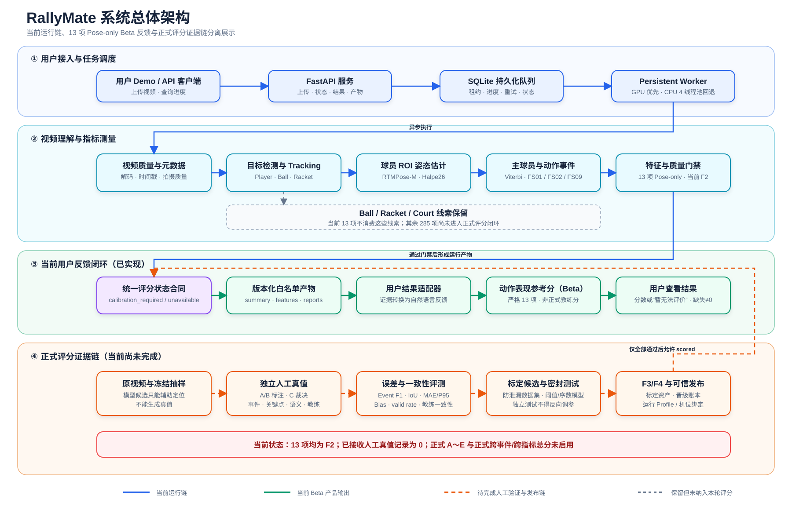
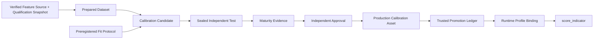

# RallyMate 技术架构与实现说明书（当前态）

> 文档版本：1.7.1  
> 状态：当前技术事实基线  
> 更新日期：2026-09-05  
> 适用对象：算法、后端、数据、测试、前端、DevOps、技术负责人  
> 项目根目录：`<仓库根目录>`（下文相对路径与命令均以该目录为基准）  
> 配套产品文档：`docs/RallyMate产品说明书_当前态_v1.0.md`  
> 本次修订：补充人工真值、独立测试、正式聚合与 298 项范围的自包含技术定义，并将系统总体架构改为可直接阅读的矢量流程图；未变更运行时字段或评分实现。

## 1. 文档定位与事实优先级

本文是 RallyMate 当前技术路径的整合说明，目标是让新研发不需要依次阅读80多个里程碑即可理解现状。它描述当前默认链路、已实现模块、数据契约、真实运行产物、安全边界和维护方式。

发生冲突时，事实优先级为：

1. 机器可读注册表和 JSON Schema；
2. 当前代码常量和验证器；
3. 当前真实运行产物及 SHA-256；
4. 本文；
5. 历史计划、实验报告和旧维护记录。

当前关键版本：

| 组件 | 当前版本 |
|---|---|
| Registry lifecycle authority | `registry-lifecycle-2026-08-30.1` |
| 指标成熟度注册表 | `pose-wave-2026-08-22.17` |
| 默认 Pose 部署注册表 | `pose-deployment-presets-2026-09-04.1` |
| M90 事件/阶段标注计划 | `scoring-truth-event-annotation-plan-v2.0.0` |
| M90 本地负责人放行记录 | `scoring-truth-operator-reviewed-local-release-v1.0.0` |
| M90 事件/阶段放行 binding | `scoring-truth-event-authorization-binding-v2.0.0` |
| M93 A/B 事件/阶段执行包 | `scoring-truth-event-execution-bundle-v1.0.0` |
| M93 A/B 标注提交 | `scoring-truth-event-annotation-submission-v1.0.0` |
| M93 C 裁决包 | `scoring-truth-event-adjudication-bundle-v1.0.0` |
| M93 C 裁决提交 | `scoring-truth-event-adjudication-submission-v1.0.0` |
| M93 私有事件/阶段 intake | `scoring-truth-event-phase-intake-v1.0.0` |
| HTTP 服务 | `RallyMate Vision API 1.2.0` |
| 当前用户 Demo 结果 | `rallymate-user-demo-result-v1.2.0`（Schema `1.2.0`） |
| 当前 Beta 训练评价 | `rallymate-training-evaluation-beta-v1.0.0` |
| 当前 Demo 精确合同 | `rallymate-user-demo-contract-v1.2.0` |
| 当前 Demo 字段留存 | `rallymate-user-demo-field-change-record-v1.2.0` |
| M96 用户 Demo 历史合同 | `m96-user-demo-contract-v1.1.0` |
| M96 M/L/X 同帧诊断协议 | `rtmpose-same-frame-diagnostic-2026-09-04.1` |
| M96 Halpe26 pilot 审计 | `m96-pose-pilot-audit-v1.0.0` |
| M97 X384 operational 协议 | `rtmpose-x-operational-extension-2026-09-04.1` |
| M97 X384 三视频汇总 | `multivideo-rtmpose-x-operational-extension-v1.0.0` |
| M95 Pose shadow registry | `rtmpose-shadow-candidates-2026-09-04.1` |
| M95 Pose 微调就绪审计 | `pose-finetune-readiness-v1.2.0` |
| M95 MMPose 数据集 manifest | `rallymate-mmpose-halpe26-dataset-v1.0.0` |
| M95 RTMPose 微调运行计划 | `rallymate-rtmpose-finetune-plan-v1.0.0` |
| 独立测试正式报告 Schema | `1.2.0` |
| 标定数据集编译器 | `rallymate-calibration-dataset-v1.2.0` |
| 标定数据集正式 sample Schema | `1.1.0` |
| 特征资格快照 | `calibration-feature-qualification-v1.0.0` |
| Promotion lineage/report Schema | `1.3.0` |
| Trusted promotion ledger Schema | `1.2.0` |
| 主球员算法 | `primary-player-v0.3.0` |
| 事件检测器 | `pose-motion-bout-v0.4.1` |
| 事件阶段代理 | `pose-event-phase-proxies-v0.3.0` |
| 基础特征库 | `rallymate-features-v0.1.0` |
| FS01/FS02 代理特征 | `fs01-fs02-pose-proxies-v0.5.0` |
| FS09 代理特征 | `fs09-pose-proxies-v0.2.0` |
| 质量策略 | `indicator-event-quality-v1.6.0` |
| 最小评分循环 | `minimum-scoring-loop-v0.7.0` |
| 动态观察器 | `dynamic-scoring-observer-v1.1.0` |

## 2. 技术目标和约束

### 2.1 当前技术目标

在固定机位、单个主球员、二维 Pose 范围内构建最小可行评分闭环：

- 能稳定形成主球员 Pose 时间序列；
- 能输出 FS01、FS02、FS09 候选区间和关键阶段；
- 能计算13项指标依赖的版本化特征；
- 能区分测量质量和评分质量；
- 能接入人工事件、关键点、语义和教练标签；
- 能评测事件和特征误差；
- 能拟合但不擅自发布标定资产；
- 能在 F4 和可信运行绑定完成后输出单指标 A～E；
- 所有结果可以从视频追溯到模型、Track、事件、特征和标定资产。

### 2.2 强约束

- 所有速度和加速度使用 `timestamp_ms`，不假设固定 FPS；
- 缺失值使用 null/NaN 语义，不允许以0代替缺失；
- 事件规则阈值与 A～E 评分阈值严格分离；
- 无人工真值时不得生成评分阈值；
- F2 特征可测量不等于 F3/F4 可评分；
- 生产标定不能相信资产自声明，必须经过可信账本和运行 Profile 绑定；
- 单个指标事件等级不能被聚合为未定义的总分。

## 3. 系统总体架构



图 1 将系统分成四条职责清晰的链路：用户接入与任务调度、视频理解与指标测量、当前已经实现的 Beta
用户反馈，以及尚未完成的正式评分证据链。蓝色和绿色实线表示当前运行路径；橙色虚线表示需要人工真值、
独立测试、F3/F4 证据和可信发布后才能启用的正式路径；灰色虚线表示已经保留观测线索、但尚未进入当前
13 项正式评分范围的 Ball、Racket、Court 与其余 285 项。矢量源文件为
[`docs/diagrams/RallyMate系统总体架构流程图_当前态_v1.0.svg`](diagrams/RallyMate系统总体架构流程图_当前态_v1.0.svg)，
PNG 预览为
[`docs/diagrams/RallyMate系统总体架构流程图_当前态_v1.0.png`](diagrams/RallyMate系统总体架构流程图_当前态_v1.0.png)。

## 4. 运行时拓扑

### 4.1 本地服务

服务由两个进程组成：

- FastAPI：提供用户 Demo、接收上传、鉴权、创建/查询任务、转换用户结果和下载产物；
- Worker：轮询 SQLite 队列，持久化复用检测和 Pose 模型；CUDA 可用时在单 GPU 上执行任务，回退
  CPU 时默认将 Torch/OpenCV/OpenMP/MKL/OpenBLAS/NumExpr 计算池限制为 4 线程。

分进程模式下 API 与 Worker 必须使用同一个 `-PosePreset`。API 会将该 preset 及其模型配置固化到新任务
请求，Worker 按自身 preset 预载模型；两端不同会因模型身份不一致而失败。省略参数时两端都默认
`rtmpose-m-halpe26-online`；运行 L384 shadow 时，两个终端都必须显式传入
`rtmpose-l-halpe26-analysis-shadow`。

任务状态：`queued → running → succeeded | failed`。数据库使用 SQLite WAL，包含租约、尝试次数、进度、摘要和错误字段。

### 4.2 容器拓扑

`deploy/docker-compose.yml` 提供 `api` 和 `worker` 两个服务：

- `service_data` 可写，存放上传、请求、任务和运行产物；
- `models` 只读挂载；
- `calibration` 只读挂载；
- worker 申请 GPU；
- API 通过 `/health/live` 和 `/health/ready` 提供健康状态；
- 正式标定账本不得位于 uploads、requests 或 runs 等任务可写目录。

### 4.3 启动方式

```powershell
# 本地一体化开发
.\scripts\run_local_inference.ps1

# 分进程
.\scripts\run_api.ps1 -PosePreset rtmpose-m-halpe26-online
.\scripts\run_worker.ps1 -PosePreset rtmpose-m-halpe26-online

# Docker
Copy-Item .\deploy\.env.example .\deploy\.env
docker compose --env-file .\deploy\.env -f .\deploy\docker-compose.yml up --build
```

默认入口：

- 用户上传与结果 Demo：`http://127.0.0.1:8000/`
- OpenAPI：`http://127.0.0.1:8000/docs`
- 当前文档中心：`http://127.0.0.1:8765/reports/rallymate-current-docs/index.html`

### 4.4 当前 HTTP 与用户 Demo 链路

当前代码有 9 个显式业务路由：`GET /health/live`、`GET /health/ready`、`GET /`、
`GET /v1/model-capabilities`、`GET /v1/jobs`、`POST /v1/jobs`、`GET /v1/jobs/{job_id}`、
`GET /v1/jobs/{job_id}/demo-result` 和 `GET /v1/jobs/{job_id}/artifacts/{artifact_name}`。
`/assets/*` 是静态挂载，`/docs`、`/redoc`、`/openapi.json` 是框架自动路由，不计入这 9 个。

根页通过 `/assets/user-demo.css?v=1.2.0` 和 `/assets/user-demo.js?v=1.2.0` 加载当前静态资源，缓存版本查询
参数不新增路由。`/?job_id=<UUID>` 会在严格 UUID 格式校验后，把该不敏感 ID 放入单任务恢复状态并立即
查询；token、文件名、视频和结果 payload 不进入 URL 或 localStorage。

浏览器以 multipart 上传视频后轮询任务详情；只有任务成功才读取 `demo-result`。适配器严格读取真实
`summary` 和 `indicator-features.jsonl`，生成 FS01/FS02/FS09 动作卡、动作段数、测量覆盖和中位幅度。
幅度、`measured_indicator_ids`、动作卡 `measured_indicator_count` 以及结果分中的已测量唯一指标分量共用
`_is_measured_record`：优先要求记录级 `feature_status="measured"`；只有该状态字段缺失时才回退要求
`scoring_feature_status="measured"`；`quality_gate.measurement_allowed` 显式为 `false` 时一律排除。幅度通过
该资格后优先读取 `features`，仅在 `features` 缺失时兼容回退 `scoring_features`；缺少有效 `event_id` 的
记录也不能贡献幅度。
同一事件跨指标重复携带的同名特征按 `(event_id, feature_name)` 去重，先取事件内中位数，再取跨事件中位数。
Demo v1.2 的 `training_evaluation` 在界面中固定标为“动作表现参考分（Beta）”，严格从 FS01 4 项、
FS02 4 项和 FS09 5 项共 13 项评价聚合。每项 `indicator_evaluations[]` 提供自然语言观察、证据摘要、训练
建议和限制，各动作另有 `performance_assessment`；未知指标不会进入用户卡片。`null` 或 unavailable 在页面
显示“暂无法评价”，不得转换为 0。Beta 分用于训练复盘，不是关键点/事件准确率、正式技术分、教练标定
分或 A～E。`formal_scoring.available` 固定为 `false`，正式分和 grade 固定为 `null`；v1.1 的信息成型与
分析完成度字段只作为兼容历史保留。结果适配器不写回运行产物，也不绕过正式评分门禁。完整字段、运行
设备、批量上传恢复和旧任务 409 合同见 22.4。

接口逐字段合同、状态码、完整上传示例、18 项产物白名单和 M89～M93 本地 Python API 见
`docs/RallyMate接口与端到端链路_当前态_v1.0.md`；可编辑的五页 Draw.io 图见
`docs/diagrams/RallyMate完整系统架构_当前态_v1.0.drawio`。

## 5. 视频感知链路

### 5.1 请求解析

请求契约为 `contracts/request.schema.json`，Python 数据类位于 `src/rallymate_vision/contracts.py`。主要配置包括：

- 视频路径和输出目录；
- detect/pose 模型；
- device；
- Pose backend/runtime/profile/preset/native format；
- `frame_stride`、最大球员数、场地检测频率；
- 自动或人工场地区域；
- 评分成熟度注册表和可选评分上下文。

相对路径以请求文件所在目录解析。`models.pose_preset` 非空时，Python 契约从
`models/rtmpose/deployment-presets.json` 解析权威预设，并逐项要求解析后的 Pose 模型绝对路径、backend、
runtime、profile、config（包括 `None`）和 native keypoint format 与请求完全一致。任何错配都直接抛出
`ContractError`，不进入推理；无 preset 的旧请求仍走原有独立字段校验。生产服务会使用 operator 配置
覆盖关键模型和信任资产，避免普通请求改变信任根。

### 5.2 视频质量

`rallymate_vision.quality` 在处理前后记录：

- 分辨率、FPS、时长；
- 亮度、对比度、模糊度；
- 可处理性和提示；
- 逐帧与汇总质量信息。

质量信息是诊断，不直接等同于模型准确率。

### 5.3 对象检测

默认对象检测为 `yolo26n.pt`，类别为：

- `player`；
- `ball`；
- `racket`。

本阶段评分只消费 player 和 Pose；Ball/Racket 输出保留在感知产物中，但不进入13项评分。

### 5.4 基础 Tracking

`SimpleMultiClassTracker` 按类别独立跟踪，使用 IoU 和归一化中心距离组合成本。它是确定性基础实现，输出 `track_id`，并为 player/racket/ball 设置不同的最大丢失帧数。

该 Tracker 不是身份识别器。跨片段 source track 的断裂和切换由后续主球员层诊断。

### 5.5 Detect + ROI Pose

链路保持级联契约：

```text
整帧目标检测
  → 同类重复框去重
  → 基础 Track ID
  → player bbox 扩展并裁剪 ROI
  → 每个 ROI 运行 Pose
  → 关键点映射回原图归一化坐标
  → pose.person_track_id = player.track_id
```

这一结构允许替换 Pose backend，而不改帧级检测、Track 外键和下游 JSON 契约。

## 6. Pose 模型路径

### 6.1 当前部署 Preset

机器注册表：`models/rtmpose/deployment-presets.json`。

| preset | 角色 | 拓扑 | 输入 | 当前状态 |
|---|---|---|---:|---|
| `yolo-baseline` | 回滚和粗基线 | COCO-17 | 640×640 | 非默认 |
| `rtmpose-m-halpe26-online` | 在线 F2 主路径 | Halpe26 | 256×192 | 默认 |
| `rtmpose-m-halpe26-analysis` | 离线高分辨率候选 | Halpe26 | 384×288 | 未晋级 |
| `rtmpose-l-halpe26-analysis-shadow` | 离线 shadow 候选 | Halpe26 | 384×288 | 可显式选择，未作准确率验证，未晋级 |
| `rtmpose-m-wholebody133-analysis` | 离线精细全身候选 | WholeBody133 | 256×192 | 未晋级 |

### 6.2 为什么从 YOLO Pose 替换

YOLO17 只能提供 COCO-17 公共关节，无法直接提供脚跟、脚趾等足部细节。Halpe26 在保持前17点兼容的同时增加足部和头部点，能够为脚踝—小腿—足方向、足部中心和脚部代理特征提供更细证据。

替换解决的是观测颗粒度，不解决：

- 事件标签缺失；
- 关键点误差未知；
- 教练等级缺失；
- A～E 标定；
- 独立测试。

### 6.3 WholeBody133 的定位

WholeBody133 包含17 body、6 foot、68 face、21 left hand、21 right hand。当前已完成真实 GPU 推理和动态对比，但默认评分指标主要消费身体、膝、踝及足部点，脸/手增加的点数不会自动增加评分能力。

模型晋级必须使用同视频、同事件边界和人工关键点真值比较 MAE/P95/Bias/有效率，不能只看视觉点数。

### 6.4 M94 模型决策：L384 保持 shadow 候选

已登记的 `rtmpose-l-halpe26-analysis-shadow`（底层 candidate `rtmpose-l-halpe26-384x288`）是当前
最值得继续验证的 shadow 候选。它只能由操作者显式选择，不参与默认路由。M71 在三视频
258 个冻结残差帧上，以固定事件边界、Track、时间戳、特征函数和质量门禁做严格超集路由：相对 M70，
feature-complete 从 2,338 增至 2,344，operational measured 从 2,327 增至 2,333，即增加 6 条，
丢失既有恢复为 0；增益只发生在三段视频中的两段。

这项结果证明的是候选模型在当前样本上的可观测性补充，不是人工关键点 MAE/P95/PCK、事件准确率、
动作判断准确率或评分质量改善。当前没有真人关键点真值，亦未执行可以据此验收的训练/微调，因此不做
“已微调”声明，不把 L384 提升为默认。生产/在线默认继续是 RTMPose-M Halpe26 256×192。下一步应对
差异帧完成双人独立标注与裁决，再在未参与候选筛选的视频上做预注册验证。

### 6.5 M95 模型决策：X384 完成烟测，默认仍不变

M95 新增独立注册表 `models/rtmpose/m95-shadow-candidates.json`，登记
`rtmpose-x-halpe26-384x288-m95-shadow`。候选 checkpoint 大小为 200,397,852 bytes，SHA-256 为
`7FB6E239601082A06CA8442FEB7A9774B8D77A1C37911B2AD0F27C1E84BE4D21`；它绑定 MMPose 官方
RTMPose-X Halpe26 384×288 config 的 SHA-256
`961E5704E4983F27173BC008C17F08E8C2C5907FDB104EA8669AD06C4C68B678`。

官方同一 Body8 表中 X384 的 PCK@0.1/AUC 为 95.74/74.82，高于 L384 的 95.56/74.38，但 FLOPs
为 17.29G，相对 L384 的 9.40G 约为 1.84 倍。这些只是外部模型表背景。M95 本机烟测只在三段开发
视频各取一个冻结检测帧，共处理 4 个 ROI；4 个结果均满足 Halpe26 形状和有限值，密封保留视频未打开。
3 次调用的均值/P50/P95 为 26.646167/20.7584/37.90988 ms，样本太少且 ROI 数不同，不能作为
M/L/X 的延迟基准，更不能作为准确率结论。

X384 不写入 M94 部署 preset，不是 HTTP 请求可选值，不参与自动路由。默认仍为 M256；烟测报告明确
`RallyMate_accuracy_improved=false`、`candidate_promoted=false`、`production_default_changed=false`。
M95 shadow registry 是烟测前冻结的输入/协议快照，其中 `promotion_status` 保存注册时的“尚未烟测”状态；
烟测后状态以绑定该 registry SHA 的 smoke report 为准，M95 字段记录同时保留两者。为保持实验可重放，
不能在报告生成后原地改写它所绑定的 registry。

## 7. 帧级数据契约

`frames.jsonl` 每行遵循 `contracts/frame-observation.schema.json`，主要包含：

- frame：源帧序号、处理序号、`timestamp_ms`、宽高；
- detections：类别、置信度、bbox、track_id；
- poses：`person_track_id`、模型信息、关键点；
- court：场地结果；
- quality：帧级质量；
- 版本和来源。

关键点包含归一化坐标、像素坐标、confidence 和 `in_frame`。Schema 容量支持到133点。

跨层强不变量：

- Pose 的 `person_track_id` 必须指向同帧 player detection；
- 坐标必须位于契约范围；
- 不允许 orphan pose；
- 摘要数量必须与 JSONL 重放一致；
- 派生层特征和值必须与源特征精确匹配。

## 8. 主球员时序

### 8.1 目标

基础 Tracker 的最大框策略无法保证一个动作事件内始终选择同一人。`rallymate_tracking.primary_player` 在完整时间段上生成稳定的逻辑主球员 `primary_player_id=1`，同时保留实际 `source_track_id`。

### 8.2 选择算法

当前版本 `primary-player-v0.3.0`：

- 对每帧 player 候选按 track_id 和 bbox 规范排序；
- 使用 Track 存在长度、检测置信度、框面积、Pose 有效率等先验；
- 使用相邻帧位置/框连续性形成转移成本；
- 通过全段动态规划/Viterbi 选择路径；
- 输出最佳与次优 max-marginal 分数及 margin；
- 数值等分时标记 `identity_ambiguous`，不把 margin 当身份概率。

### 8.3 输出与诊断

`primary-player.jsonl` 主要字段：

- `processed_index`、`source_frame_index`、`timestamp_ms`；
- `primary_player_id=1`；
- `source_track_id`；
- bbox、Pose存在、关键点有效比例；
- 候选数量、最佳/次优分数、margin；
- 竞争 source track 和歧义状态；
- 算法版本。

事件内诊断包含：

- Track 覆盖率；
- source track switch 候选；
- confirmed ID switch，当前无身份真值时为 null；
- 关键点有效比例；
- 左右点交换候选及具体关节对；
- 跳点候选及具体关节；
- 最长 Pose 缺失帧数和毫秒。

Registry 声明所需主球员版本，评分循环会校验时间线实际版本；旧版或混合版本会在输出前失败。

## 9. Pose-only 事件层

### 9.1 事件契约

`events.jsonl` 遵循 `contracts/events.schema.json`，字段包括：

- `video_id`、`event_id`；
- `person_track_id`；
- `event_code`；
- `start_ms`、`end_ms`；
- `key_phases_ms`；
- `confidence`；
- `boundary_uncertainty_ms`；
- `quality_flags`；
- Track/Pose诊断；
- detector、信号和阶段 provenance。

### 9.2 候选生成

当前事件检测器是可解释规则基线，不训练 Transformer。主要过程：

1. 从主球员 Pose 计算身体中心，缺失时使用经过对齐的髋中心回退；
2. 使用时间戳平滑并计算运动速度；
3. 通过事件内自适应活动阈值形成运动 bout；
4. 使用持续位移、路径效率和方向一致性过滤微小抖动；
5. 从每个有效 bout 输出 FS01、FS02、FS09 候选子区间；
6. 计算各事件关键阶段；
7. 记录规则参数、信号覆盖和“不属于 A～E 阈值”的语义。

当前噪声防护参数例如最小持续位移0.10 body、最小路径效率0.20、最小方向一致性0.80。这些是候选事件噪声过滤参数，必须通过事件真值评测，不是评分标准。

### 9.3 关键阶段

FS01：

- `preload_ms`；
- `takeoff_proxy_ms`；
- `landing_proxy_ms`；
- `redistribution_ms`；
- `initiation_ms`。

FS02：

- `direction_conversion_ms`；
- `support_extension_proxy_ms`；
- `lead_foot_motion_onset_proxy_ms`；
- `first_step_slowdown_proxy_ms`。

FS09：

- `peak_speed_ms`；
- `deceleration_peak_ms`；
- `restabilization_onset_ms`；
- `stable_control_onset_ms`。

名称中的 takeoff、landing、support、stable 均带 proxy 语义；二维 Pose 不提供真实足底接触或力学测量。

### 9.4 事件评测

`rallymate_events.evaluation` 按 `video_id + event_code + person_track_id` 分组，使用全局一对一匹配，优先最大匹配数，再最大总 Segment IoU。输出：

- Event Precision/Recall/F1；
- Segment IoU；
- start/end/center/duration 边界误差；
- Boundary MAE/P95；
- 关键阶段 MAE/P95和覆盖率。

当前真实人工事件为0，因此事件检测器只有候选输出，没有真实准确率结论。

## 10. 坐标、有效性和平滑

### 10.1 坐标

Pose 原始坐标使用原图归一化二维坐标。特征库提供：

- 肩中心、髋中心、身体中心；
- 踝支撑中点；
- 身体尺度；
- 角度、距离、方向和相对位置。

`body_scale` 每帧从肩宽、髋宽、肩髋中心距离中的有效值取中位数，用于把像素/归一化图像距离转换为 `body` 单位，降低人物远近变化影响。

### 10.2 有效性

默认关键点 confidence 下限为0.25。一个点只有坐标、置信度均为有限数且达到下限才有效。组合特征要求其必需关节联合有效。

所有缺失保留为 NaN/null，结果通过 `valid` 和 `reason` 明确说明。数值0只在其物理/代理语义确实为0时出现。

### 10.3 平滑

当前平滑流程：

1. 仅对时间跨度不超过160ms的内部短缺口插值；
2. 使用100ms半径的时间加权窗口；
3. 至少需要2个有效样本；
4. 权重按实际 `timestamp_ms` 距离计算；
5. 原始和处理后序列同时进入结果，便于反事实误差审计。

## 11. 特征库

### 11.1 目录和职责

```text
src/rallymate_features/
├── coordinates.py        坐标、中心、身体尺度
├── validity.py           有效性、最长缺失
├── smoothing.py          时间戳插值和平滑
├── geometry.py           距离、角度、投影
├── kinematics.py         不规则时间速度和加速度
├── event_features.py     基础事件特征和统一注册表
├── fs01_fs02_features.py FS01/FS02代理特征
├── fs09_features.py      FS09代理特征
└── schemas.py            PoseSequence、EventInterval、FeatureResult
```

### 11.2 函数契约

每个特征函数是可单测纯函数，输入：

- 关键点序列；
- `timestamp_ms`；
- 置信度；
- 事件区间和阶段。

输出 `FeatureResult`：

- `feature_name`、`feature_version`；
- `value`、`unit`；
- `confidence`；
- `valid`、`reason`；
- `source_frames`；
- `raw_value`、`smoothed_value`；
- `provenance`。

### 11.3 当前规模

- `FEATURE_DEFINITIONS` 共58个特征函数；
- 13项指标共有72个 required feature 引用；
- 去重后52个 required feature 名称；
- 其中51个由 Pose 特征库计算；
- `target_direction_alignment_error_deg` 来自外部人工/可信目标方向上下文；
- 另有左右脚踝—小腿—足角等补充诊断，不进入 A～E 阈值。

### 11.4 单位

| 单位 | 含义 |
|---|---|
| `body` | 经身体尺度归一化的二维距离 |
| `body/s` | 基于实际时间戳的身体尺度速度 |
| `body/s2` | 基于实际时间戳的身体尺度加速度 |
| `deg` | 图像平面角度 |
| `deg/s` | 图像平面角速度 |
| `ms` | 毫秒时间或时序差 |
| `ratio` | 无量纲比例/一致性 |
| `code` | 左/右/不确定等离散代理编码 |

## 12. 指标与技术依赖

| 指标 | required events | required features |
|---|---|---|
| FS01-M02 | FS01.preload | 髋中心高度、双膝屈曲、站距、髋相对踝支撑 |
| FS01-M03 | FS01.takeoff_proxy | 双足上抬量、同步时间、持续时间、髋垂直速度 |
| FS01-M04 | FS01.landing_proxy | 双足垂直减速时差、减速后站距、髋横向波动 |
| FS01-M05 | FS01.redistribution/initiation | 身体中心速度、髋支撑比、躯干倾斜、肩髋角速度 |
| FS02-M02 | FS02.direction_conversion | 身体速度、髋支撑比、躯干倾斜、启动方向、目标方向误差 |
| FS02-M03 | FS02.support_extension/lead-foot onset | 启动方向、支撑侧、支撑膝伸展速度、髋方向加速度、阶段时序 |
| FS02-M04 | FS02.lead-foot onset | 启动方向/侧、足速度峰值、相对位移、运动持续 |
| FS02-M05 | FS02.first-step slowdown | 启动侧、足速度下降、第一步位移、髋方向一致性、时序、站距 |
| FS09-M01 | FS09 | 髋速度、方向、髋踝相对位置、速度趋势 |
| FS09-M02 | FS09 | 双踝速度/下降、制动侧、膝变化、髋减速度、阶段时序 |
| FS09-M03 | FS09.peak/deceleration | 髋减速度/速度下降、双膝变化、髋高度、躯干波动 |
| FS09-M04 | FS09.restabilization | 髋踝关系、速度下降、站距、稳定持续、肩髋变化、双支撑代理 |
| FS09-M05 | FS09.stable_control | 稳定持续、速度下降、双支撑代理、躯干波动、肩髋变化、阶段时序 |

权威完整名称以 `metric-feasibility-pose-wave-v2.json` 为准，不应在业务代码中再维护一份硬编码指标列表。

## 13. 质量门禁

### 13.1 两层门禁

质量策略把“能否保留测量”和“能否给正式等级”分开：

- `measurement_allowed`：是否允许将特征记为 measured；
- `scoring_allowed`：即使特征有效，是否允许进入标定评分。

这是当前大量特征 measured、评分 unavailable 的主要原因。

### 13.2 典型 hard fail

- 必需关键阶段缺失；
- 主 Track 覆盖率过低；
- 已确认 ID Switch；
- 指标要求的稳定阶段完全缺失；
- 必需特征无效。

hard fail 会使测量和评分均 unavailable。

### 13.3 典型 score-only block

- 主球员身份存在未确认 source track switch；
- 身份选择分数严格歧义；
- 影响 required joints 的关键点跳变或左右交换；
- 事件边界覆盖风险；
- FS02 缺少可信目标方向；
- 指标依赖的阶段只能使用边界截断/低样本代理。

这些情况下可保留 F2 特征值用于诊断和真值评测，但不能给正式等级。

### 13.4 advisory

不影响该指标依赖关节的异常、候选级提示和未知诊断会保留为 advisory，不会被静默丢弃。

## 14. 最小评分循环

`src/rallymate_scoring/loop.py` 的核心过程：

1. 加载并验证成熟度 registry；
2. 读取 `frames.jsonl` 与主球员时间线；
3. 校验 registry 要求的主球员版本；
4. 构建主球员 PoseSequence；
5. 运行候选事件检测；
6. 对每个事件计算该事件族需要的特征；
7. 处理外部目标方向上下文；
8. 按 indicator required features 形成紧凑向量；
9. 结合事件和 Pose 诊断执行质量策略；
10. 调用统一评分接口；
11. 无标定时输出 `calibration_required`/`unavailable`；
12. 写入事件、特征、指标、评分、误差和汇总产物；
13. 对跨文件外键、值、状态和哈希进行验证。

统一 `score-result` 契约包含：

- `status`；
- `grade`；
- `confidence`；
- `feature`；
- `threshold_version`；
- `model_versions`；
- `evidence`；
- `reason_codes`；
- `feedback`；
- 可选 `scoring_context`。

当前没有生产标定时，grade 和 threshold_version 必须为 null。

### 14.1 离线生产重评分的来源绑定（M82）

`scripts/score_calibrated_indicators.py` 的生产路径不能只信任可编辑的
`indicator-features.jsonl`。只要输入中包含生产 calibration，CLI 就必须：

1. 从 `scoring-loop-summary.json` 解析并校验精确的
   `indicator_features_jsonl` 与同目录 `events_jsonl` 路径；
2. 对两个输入重新计算 SHA-256，并与 summary 的 `artifact_sha256` 完全匹配；
3. 从当前 feasibility registry 读取指标定义；
4. 按 `event_id` 精确连接事件，并校验 `video_id`、`event_code`、
   `person_track_id`、事件族与成熟度；
5. 从事件和指标定义重新计算 `indicator_event_quality_flags`，要求输入记录中的
   flags 与完整 gate 完全一致；
6. 仅允许已经过上下文验证的 FS02-M02 目标方向证据移除对应缺失标记；
7. 任一来源、哈希、身份或 gate 不一致时，在写出 score/report 前失败。

这关闭了仅修改指标特征文件并重算“自洽”质量门禁的绕过路径。M82 单独使用时仍不能
阻止 summary、events 和 indicator-features 被协同重写；下节 M83 已用独立的运维账本
把 scoring summary 原始文件 SHA 和五件套 bundle root 固定到普通 run 目录之外。

### 14.2 运维控制的重评分输入账本（M83）

M83 在 M82 之上增加独立的 `trusted_scoring_run_bundles` 信任层。它不属于 calibration
promotion、runtime profile 或 view evidence，也不改变指标成熟度和评分状态。只要 CLI
加载生产 calibration，就必须额外提供 `--trusted-scoring-run-bundles`，并满足：

1. 运维账本对每个视频最多存在一个 active 条目，且精确绑定 summary 原始文件字节
   SHA、视频 ID/SHA、scoring-loop 版本和五个评分产物 SHA；替换 run 必须先撤销旧条目；
2. `scoring_summary.file_sha256` 是原始文件字节 SHA，`bundle_root_sha256` 是规范化
   `bundle_identity` 的 canonical JSON SHA，两者不得混用；
3. summary、events 和 indicator-features 均以同一份内存字节快照完成哈希与解析，
   防止“先验哈希、后换文件”；
4. features、原始 scores 和 event-feature-errors 虽不直接参与重评分，也必须实际复核
   文件 SHA，保证“完整五件套”语义真实；
5. 账本视频身份必须与 runtime view evidence 和每条指标记录完全一致；
6. 新 output/report 不能互相重叠，也不能覆盖 summary、五个 bundle 产物、calibration、
   registry、view evidence 或任何可信账本；
7. score/report 记录 ledger、entry、authority、review、summary SHA 和 bundle root。

实际账本的可信性来自运维选择的只读路径和文件 ACL，而不是普通 run/report 目录中的
自报 JSON。仓库只提供故意不可加载的模板
`calibration/trusted-scoring-run-bundles.template.json`。当前项目没有 production
calibration，M78/M81 仍是 F2 可观测性证据，因此没有预先创建或暗中授权任何 active
真实账本条目。账本 SHA 不是数字签名；版本回滚防护、双人审批和签名属于后续发布治理。

### 14.3 评分上下文证据的逐项视频身份（M84）

生产 runtime-view 门禁要求 `score-result.evidence` 中的每一项都匹配获准视频的
`video_id` 和 `video_sha256`。旧实现把已验证的 FS02-M02 目标方向 context 直接追加为第二项
证据，但 resolved context 本身不重复视频头，导致合法生产评分被误判为
`runtime_view_video_mismatch`。M84 没有放宽评分器的逐项检查，而是在可信构造点补齐直接身份：

1. 原始 scoring-reference-context 先精确校验视频 ID/SHA，并从同一份内存字节同时完成
   JSON 解析和 SHA-256，避免“解析后换文件再哈希”；
2. resolved context 保持身份无关的事件级对象，但必须具有精确字段集合、来源 SHA、版本、
   语义键、观察事件、独立 observer/reviewer，以及可重算的方向、误差、置信度和证据帧；
   任意本地 grade、threshold、video 字段或未知字段都会被拒绝；
3. online loop 从 canonical video/provenance、offline batch 从 record/provenance 生成
   `scoring_reference_context` evidence wrapper；context 内同名的非可信字段不能覆盖权威身份；
4. batch 只允许 FS02-M02 携带 scoring context，其他指标直接失败；
5. `minimum-scoring-loop-v0.7.0` 的产物验证器精确重建 wrapper，并拒绝缺失、错配或重复的
   context evidence；v0.1–v0.6 已知历史版本继续按旧 wrapper 形状验证，避免把既有 F2 快照
   追溯判废；
6. 评分器自身的“每项证据都匹配 runtime view”规则保持不变。

合成 F4 契约回归使用当前 FS02-M02 五项完整 scoring vector，走 promotion ledger、registry、
runtime profile/view 和 authoritative-event batch 链，合法上下文得到 `scored/C`，任一主证据或
context 证据缺失/错配视频 ID/SHA 均保持 `calibration_required`。这是安全合同测试，不是实际
教练标定或真实视频准确率证据；当前仓库仍没有 production calibration，也没有真实正式等级。

本地 `validate_run_artifacts` 只证明 bundle 内部一致性，生产真实性仍由 M83 外部运维账本提供。
后续还应把每条 resolved `source_sha256` 与 summary/provenance 的 context SHA 做跨层相等校验，
并通过新版本 JSON Schema 收紧当前开放的 indicator context / score evidence 结构。resolved
数据目前没有单列 reference confidence，因此只能验证结果置信度不超过 launch confidence，不能
脱离原始 context 文件独立重算 `min(launch, reference)`。

## 15. 真值与误差评测

### 15.1 真值类型

当前代码与数据合同支持以下真值类型，但真实 accepted 人工记录仍为 0：

- 人工事件边界和关键阶段；
- 人工校正关键点及不可见原因；
- 指标语义上下文，例如目标方向、支撑/启动/制动侧、接触/稳定区间或不可观测原因；
- 多教练 A～E；
- 多教练排序；
- 双人独立标注和第三方裁决。

### 15.2 工作台

`data/annotations/scoring-truth-pack-v1/review.html` 是含候选信息和私有源谱系的中央权威模板。
它是私有模板，不能直接分发给标注者；没有 M90 本地负责人放行记录时，写入、导入和导出
控件默认禁用。其代码结构支持：

- 完整视频事件/阶段标注；
- 逐帧关键点点击或不可见标记；
- 语义 observable/value/null_reason；
- localStorage 草稿；
- CSV 导入/导出；
- File System Access API 原位写回或下载回退。

M89 的 `data/annotations/scoring-truth-event-handoff-m89-v1/` 另提供三段全片的可移动
技术交接，只含播放、seek、逐帧和禁用的 event/phase 字段预览；公开字节不含候选 ID、
候选边界、候选阶段、质量标记、模型绑定或本机源路径。M89 保持技术交接属性；只有 M90
对精确计划和放行记录的检查通过后，另建的标注工作流才可导出 A/B/C 的人工记录。

M93 已实现这条“另建工作流”的代码、Schema、角色工作台和私有 intake，但没有创建实际实例。
`src/rallymate_annotation/assets/scoring-truth-event-collection-*` 只是经摘要固定的源模板，空 bootstrap
本身不能开始标注；只有构建器在同一进程中重新核对实际放行记录和 M89 后生成的角色包才可执行。

`rallymate_annotation.scoring_truth_intake` 可以把未来收到的五份私有 CSV、来源与编译树
用 staging + 单次 rename 冻结成精确拓扑会话，但该会话明确包含候选内容、不可标定/晋级/生产。
工作台和 intake 都不会生成 grade/threshold。

### 15.2.1 M90 本地负责人放行：只开启标注

M90 使用 `scoring-truth-event-annotation-plan-v2.0.0` 与
`scoring-truth-operator-reviewed-local-release-v1.0.0`。验证器读取计划、放行记录和 M89
manifest 的同一份原始字节，并建立
`scoring-truth-event-authorization-binding-v2.0.0`。记录至少固定以下字段：

- `plan.plan_id`、`plan.plan_version`、`plan.raw_sha256`；
- M89 的 `manifest_raw_sha256`、`bundle_id`、`content_root_sha256`、`source_projection_sha256`；
- `scope_digest_sha256` 和 `role_protocol_digest_sha256`；
- `reviewed_by.reviewer_id`、`reviewed_by.role=annotation_release_operator`、`released_at` 与固定 decision；
- `attestations` 的四项核对，以及 `safety` 的六项限制。

它只允许三段 M89 完整视频的 FS01/FS02/FS09 事件/阶段标注。A、B 必须独立，C 只有在两份
提交后才能裁决；缺失不能补为 0。放行记录不是身份认证或时间证明，不确认之后的 CSV/JSONL
真实有效，也不代表标定、晋级或生产允许。计划与记录都明确
`calibration_authorized=false`、`promotion_authorized=false`、`production_scoring_authorized=false`。
当前零标签计划已冻结为
`data/analysis-plans/scoring-truth-event-m89-operator-plan-v2.json`，原始 SHA-256 为
`BE1A8BDB73DB48982F3737C53EBD5C116A2B413CDA05B5EBD057163B112BDC3F`；仓库没有实际放行记录，
因此首次写入仍保持关闭。M89 本身仍是技术交接，无真实人工标签、教练等级、阈值或正式 A～E。
完整字段迁移表见 `docs/M90_SCORING_RELEASE_CONTRACT.md`。

### 15.2.2 M93 角色锁定执行、裁决与事件/阶段 intake

M93 调用 `verify_scoring_truth_event_authorization(...)` 在构建时重新读取计划、实际负责人放行记录和
完整 M89 包；不接受序列化的旧 binding 作为替代。公开 Python API 为：

```text
build_scoring_truth_event_execution_bundle
validate_scoring_truth_event_execution_bundle
validate_scoring_truth_event_annotation_submission
build_scoring_truth_event_adjudication_bundle
validate_scoring_truth_event_adjudication_bundle
validate_scoring_truth_event_adjudication_submission
scoring_truth_event_manifest_binding_sha256
ingest_scoring_truth_event_phase
validate_scoring_truth_event_phase_intake
```

对应 CLI 为 `scripts/build_scoring_truth_event_execution.py`、
`scripts/build_scoring_truth_event_adjudication.py`、`scripts/serve_scoring_truth_event_execution.py` 和
`scripts/ingest_scoring_truth_event_phase.py`。前两个构建器不会创建负责人放行记录；最后一个只接受
已经验证的 A/B/C 全套输入并创建新的 `PRIVATE` 目录。

A/B execution manifest v1.0 的顶层字段精确为：

```text
schema_version, bundle_version, bundle_id, execution_id, generated_at, status,
role, event_authorization, source_files, scope, revision_contract, entrypoint,
server_launcher, artifacts, content_root_sha256, manifest_binding_sha256, safety
```

其中 `role={slot,kind}`；`source_files` 精确包含 plan、operator release 和 technical handoff；
`scope={event_codes,phase_keys_by_event,tasks}`，每个 task 精确保存
`task_id,video_id,video_sha256,media_path,frame_rate,frame_count,duration_ms,full_video_review_required`。
C adjudication manifest 使用相同公共字段，但把 `source_files` 换成
`execution_sources,annotation_submissions`：前者逐项保存 role、路径、manifest 原始摘要、bundle/execution ID、
manifest binding 和 content root；后者保存 role、路径、提交原始摘要、submission/revision、annotator 和
submitted/exported 时间。

`manifest_binding_sha256` 是 manifest 去掉 `artifacts`、`content_root_sha256` 和自身后，对剩余规范 JSON
投影计算的 SHA-256。页面 bootstrap 和各提交中的 bundle ref 因此严格只有
`{bundle_id,manifest_binding_sha256}`，不会把 manifest 的原始摘要或 content root 注回 `review.html` 造成
自引用。完整目录仍由包外校验快照中的 manifest 原始摘要、manifest 声明的每个 artifact 和 content root
共同核对。A/B 包精确为 16 个 artifact 加 `execution-manifest.json`：authority 区 11 个文件（plan、release、
完整 M89 九文件）和根目录五个工作台/服务文件。C 包精确为 20 个 artifact 加
`adjudication-manifest.json`，即在同一 16 项上增加 A/B execution manifest 和 A/B 原始提交各两项；
声明外或未声明的文件都会被拒绝。

工作台 bootstrap 公共字段固定为：

```text
schema_version, workbench_version, bundle_version, execution_id, bundle_status,
authorization_status, authorization_binding_sha256, role_slot,
annotation_execution_authorized, operator_release_record_verified,
mutation_enabled, import_enabled, export_enabled, full_video_only,
machine_event_boundaries_embedded, phase_values_embedded, machine_keypoints_embedded,
grades_or_thresholds_supported, calibration_authorized, promotion_authorized,
production_enabled, maturity_promoted, event_codes, phase_keys_by_event,
required_annotator_slots, reviewer_slot, tasks
```

A/B 另有 `execution_bundle`；C 另有 `adjudication_bundle`、`source_execution_bundles={A,B}` 和
`expected_source_submissions={A,B}`。空 bootstrap HTML 模板本身也有固定摘要；构建后 Python 和包内
便携服务都会从 manifest 重建 bootstrap 并要求逐字段全等。工作台不嵌入机器事件边界、阶段值、
关键点、等级或阈值。

A/B submission v1.0 的顶层字段精确为：

```text
schema_version, submission_version, status, artifact_scope, execution_id,
execution_bundle, authorization_binding_sha256, submission_id, role_slot,
annotator_id, videos, submitted_at, submission_revision_sha256, exported_at
```

每个 video 是 `task_id,video_id,full_video_review,events,video_revision_sha256`；full review 是
`completed,notes,reviewed_at,review_revision_sha256`；event 是
`annotation_id,event_id,event_code,start_ms,end_ms,phase_observations,confidence_milli,
boundary_uncertainty_ms,notes,annotated_at,annotation_revision_sha256`。每个 phase 固定为
`{status,timestamp_ms,reason}`：observed 必须有事件内整数时间且 reason 为空，unobservable 必须时间为 null
且给出非空原因。三段视频均须完成 full review；完整观看后确认零事件是合法提交。

C submission v1.0 的顶层字段精确为：

```text
schema_version, adjudication_version, status, artifact_scope, execution_id,
adjudication_bundle, authorization_binding_sha256, reviewer_slot, reviewer_id,
source_submissions, video_adjudications, decisions, adjudicated_at,
adjudication_submission_revision_sha256, exported_at
```

每个 `video_adjudications` 固定为
`task_id,video_id,completed,notes,adjudicated_at,review_revision_sha256`，必须按任务顺序恰好 3 项；
即使 A/B 都提交零事件也不能省略。每个 decision 固定为
`adjudication_id,video_id,decision_status,source_video_revisions,source_annotation_revisions,event,
decision_reason,adjudicated_at,adjudication_revision_sha256`。状态只允许 `accepted_event`、
`rejected_sources`、`c_added_event`；来源关系只允许 `supports`、`merge_source`、`split_source`、
`rejected_source`，并要求 A/B 的每个来源 event 都恰好得到合法处理。来源视频 revision 改变会清除
该视频完成确认并使对应 decision 过期。A、B、C 参与者 ID 在 trim + NFKC + casefold 后必须三者互异。

所有提交都是“规范 JSON 对象 + 一个换行”；重复键、非 UTF-8、非有限数、非规范键序/数值或孤立
Unicode surrogate 都会被拒绝。跨 Python/JavaScript 的整数上限为 `9007199254740991`，
`confidence_milli` 为 0～1000；事件和裁决的并列排序使用与区域设置无关的 Unicode codepoint 顺序，
不依赖浏览器 locale。revision SHA 从排除自身 revision 和最终 export 时间后的规范对象重算；
原始文件 SHA 独立保存。顺序规则覆盖 release、A/B bundle、逐事件、逐视频 review、提交、C bundle、
C review/decision 和最终 export；浏览器时间与本地生成时间只作链内一致性字段，不是身份或受信时间证明。

M93 intake manifest 版本为 `scoring-truth-event-phase-intake-v1.0.0`，状态为
`private_event_phase_intake_finalized_annotation_only`，分类固定 `PRIVATE`。顶层精确字段为：

```text
schema_version, intake_version, intake_id, generated_at, status, classification,
event_authorization, source_bundles, revision_lineage, raw_submissions, compilation,
directories, artifacts, content_root_sha256, safety
```

`source_bundles={execution:[A,B],adjudication:C}`；`revision_lineage` 精确保存 revision ID、三名参与者 ID、
A/B export roots、C adjudication root、`roles_distinct` 和 `revision_finalized`；`raw_submissions` 按 A/B/C
顺序保存路径、原始 SHA、参与者、revision 和 export 时间。生成时间至少等于 A/B/C manifest 和三份提交
export 时间，重放时再次核对，但仍不是外部时间证明。

intake 目录精确保存 `authority/` 下的 plan、release 与完整 M89 树，`sources/` 下三份 bundle manifest，
`raw-submissions/A.json,B.json,C.json`，以及 `compiled/manual-events.jsonl`、
`event-annotations.csv`、`full-video-review-completion.csv`、`validation-report.json`。目录先在 staging 中完整
生成，再以单次 rename 发布；回放会重建编译结果并核对全部字节、目录和 content root。manual JSONL
只投影 C 最终接受的事件/阶段；unobservable phase 转为 null 并留下原因标记。兼容旧 CSV 所需的
`person_track_id=1` 与 `view_group=source-view-unclassified` 明确标为 projection default，不是人工观察；
A/B full-video CSV 恰好 6 行，C 的 3/3 确认保存在原始 C 提交并进入 validation report 计数。

包内服务只在 loopback 上提供内存冻结后的 manifest 声明文件，支持 GET、HEAD 和单 Range；动态端口
可用于测试，其他写方法返回 405。它不接收远程提交。所有 execution、adjudication 和 intake safety
均固定不允许 calibration、promotion、production、grade、threshold 或 maturity promotion。

M93 execution/UI/intake 定向回归为 37/37（13.242 秒）；连同 M90 authorization 和 M89 handoff 的联合回归为
63/63（21.427 秒，0 跳过）；M93 新增 5 份 Schema，全仓 Draft 2020-12 Schema 为 125/125；最终冻结
字节的全仓回归为 909/909（779.863 秒，0 失败/错误）。当前仓库没有实际负责人放行记录、实际 M93
bundle、A/B/C 提交或 intake；真实人工标签仍为 0，13 项仍为 F2，正式 A～E 仍为 0。字段快照位于
`reports/m93-event-phase-execution/field-change-record.json`。

### 15.3 特征误差

`rallymate_evaluation.feature_errors` 可输出：

- MAE；
- P95 absolute error；
- Bias；
- valid rate；
- 分视角结果；
- 逐样本 details；
- 平滑反事实。

误差预算区分：

- Pose 误差；
- 事件边界误差；
- 平滑误差；
- 缺失值影响。

只有外部预注册协议证明这些误差明显小于等级间差异，指标才具备 F2→F3 条件。

### 15.4 自包含评测合同：从人工真值到正式等级

本节给出不依赖原始评分表也可理解和复核的技术定义。核心原则是把“模型输出”“人工真值”“教练标签”
和“产品展示分”分开：模型输出是待验证的预测，人工真值是按协议独立标注并裁决后的参照，教练标签是
特定事件和指标上的专业序数判断；当前 Demo 的 Beta 分则是训练复盘用的证据质量与重复性参考。四者不能
相互代替，也不能因为取值范围同为 0～100 或 A～E 就视为同一种量。

#### 15.4.1 术语与评价对象

- **预测（prediction）**：当前模型或规则链产生的人物框、主球员轨迹、二维关键点、候选事件、关键阶段、
  特征值或等级。预测在与独立人工参照比较之前没有“正确”属性。
- **候选事件（candidate event）**：规则在视频时间轴上提出的 FS01、FS02 或 FS09 区间及阶段时间。候选
  区间用于检索和计算，不是人工事件真值；候选数量、可播放性或视觉上“看起来合理”都不是 Event F1。
- **人工事件真值（manual event ground truth）**：标注者完整观看原视频后给出的事件类型、起止时间和
  关键阶段，经过独立 A/B 标注及 C 裁决后状态为 accepted。完整视频确认“没有该事件”也是有效真值，
  因为只标注机器候选窗口会系统性漏掉假阴性，无法计算 recall。
- **人工校正关键点（manual corrected keypoint）**：在指定原视频帧上，由人工给出的关节可见性和二维
  归一化坐标。不可见点使用 `visible=false`、坐标 `null` 和原因，不得填 0；未标注帧/关节保持 NaN，
  不得由模型预测补成真值。accepted 记录要求独立 reviewer。
- **语义真值（semantic ground truth）**：仅靠人体二维点不能可靠推出的上下文，例如目标方向、支撑侧、
  启动侧、制动侧、接触/稳定时刻或区间。每条记录显式区分 `observable=true + value` 与
  `observable=false + null_reason`，并绑定事件、指标、标注者和裁决者。
- **教练标签（coach label）**：教练对一个已裁决事件中的一个指标给出的 A～E 等级，或同一比较组内的
  排序。它是序数监督信号，不是关键点坐标或事件边界真值。原始意见必须保留；当前正式解析只接受至少
  两名独立教练完全一致，或显式外部裁决，不能用单教练意见、简单多数票或中位数伪造共识。
- **标定样本（calibration sample）**：对同一 `(video_id, event_id, indicator_id)` 精确连接人工事件、
  必需语义、完整特征向量、质量资格快照和已解析教练标签所得的一行数据。正式等级模型的最小学习和评测
  单位是“事件 × 单指标”，不是整段视频，也不是球员总分。
- **独立测试（independent test）**：在候选模型、特征版本、阈值和接受协议冻结后才打开的来源独立保留
  集。其 sample ID、分组和内容摘要预先密封，标签对拟合器保持 withheld；测试结果不能再反向用于调参。
- **Beta 训练表现分**：Demo v1.2 根据当前视频中 13 项的可测比例、必需特征覆盖、骨架置信信息、跨片段
  重复性和评分证据质量生成的复盘参考。它不是人工标签的预测值，不能作为教练标定伪标签，也不能直接
  转换为正式 A～E。
- **正式等级（formal grade）**：某一版本化事件级单指标模型在质量门禁通过、生产标定资产受信、运行
  Profile 精确绑定时输出的 A～E；否则必须是 `calibration_required` 或 `unavailable`。正式等级仍不是
  跨事件或跨指标总分。

#### 15.4.2 数据结构与最小标注单位

事件真值以一个完整事件区间为最小单位。当前 A/B 标注提交、C 裁决和 accepted 事件文件分层保存；进入
评测前必须确定性展开为下面的逻辑字段集合（尖括号表示实例值，不是可省略字段）：

```text
schema_version=<事件真值合同版本> + annotation_revision_sha256=<64位摘要>
+ video_id=<原视频身份> + person_track_id=<主球员/Player身份>
+ event_id=<事件实例身份> + event_code=<FS01|FS02|FS09>
+ start_ms=<事件开始> + end_ms=<事件结束>
+ phase_observations.<phase>={status:<observed|unobservable>, timestamp_ms:<整数|null>, reason:<字符串>}
+ boundary_uncertainty_ms + view_group + annotator_id
+ reviewer_id + adjudication_status=accepted
```

其中 `phase_observations.<phase>.status` 是阶段可见性/可观测性字段：`observed` 必须带时间戳，
`unobservable` 必须带 `null` 时间戳和非空原因。它比单个事件级 `visibility=true/false` 更精确。事件整体无法
确认时不得生成 accepted 事件；完整视频复核中的“无该事件”记录承担负例语义。编译为 `events.schema.json`
后，已观测阶段进入 `key_phases_ms`，但编译器仍须通过源修订摘要保留不可观测状态和原因，不能把 `null`
解释为时间 0 或“阶段不存在”。

关键点真值在文件中可按帧聚合多个关节，但最小可比较单位是一个“帧 × 关节”观察：

```text
schema_version=<关键点真值合同版本> + video_id + source_frame_index=<帧> + timestamp_ms
+ primary_player_id=1 + joint_name=<关节>
+ visible=<true|false> + (x_normalized=<x>, y_normalized=<y> | null, null)
+ visibility_reason + view_group + annotator_id
+ reviewer_id + adjudication_status=accepted
```

例如可见左膝是一条 `(source_frame_index=42, joint_name=left_knee, visible=true,
x_normalized=0.438, y_normalized=0.617)` 观察；被遮挡左膝必须写成 `visible=false`、`x/y=null` 并给出
`visibility_reason=occluded`。帧对象可以容纳多个关节，但计数、去重、误差和裁决均以“帧 × 关节”为单位。

语义真值的最小单位是一个“事件 × 指标 × 语义键”观察：

```text
video_id + event_id + indicator_id + semantic_key + semantic_type
+ observable + (value | null_reason)
+ annotation_confidence + annotator_id + reviewer_id + accepted
```

教练标签的最小单位是一个“事件 × 指标 × 教练”判断：

```text
annotation_id + video_id + event_id + indicator_id + annotator_id
+ label_type=(grade | ranking) + (grade=A..E | rank_group_id, rank)
```

编译后的正式样本还必须带 `sample_id`、`dataset_version`、`split`、完整且版本化的 `feature_vector`、
`qualification_snapshot`、分组键和来源哈希。分组至少覆盖 player、session、video、view 和
`leakage_group_id`；同一球员、场次或视频的连通样本必须进入同一 split，避免同源动作同时出现在训练和
测试中。`video_id` 或路径名称本身不是来源真实性证明，原视频、预测产物、人工提交、编译结果和协议都要
绑定原始或 canonical SHA-256。

#### 15.4.3 预测与真值的逐层对齐

对齐按身份、时间、语义和版本四层执行，不能仅按数组位置或文件名连接。

1. **视频与人物身份对齐。** 预测和真值必须绑定同一原视频身份及来源摘要；事件比较还要求相同
   `event_code` 和 `person_track_id`。主球员 ID 或来源 Track 存在未裁决切换时，相关样本不能进入正式
   评分。不同机位保留 `view_group`，不能在聚合时静默混合。
2. **事件区间对齐。** 当前事件评测在
   `(resolved_video_id, event_code, person_track_id)` 内做确定性一对一二分匹配：先最大化匹配数量，再在
   这些解中最大化总 Segment IoU。默认 `IoU >= 0.5` 只定义预测与真值的关联关系，不是模型验收阈值或
   A～E 阈值。未匹配预测计为 false positive，未匹配真值计为 false negative；匹配后才计算起止边界和
   同名关键阶段的时间误差。
3. **帧与关节对齐。** 人工关键点按 `source_frame_index` 和关节名称连接到同一视频的模型输出；当前通用
   校验要求该帧时间戳与 Pose 序列时间戳相差不超过 2 ms。只在人工标为 visible 且模型点有效时计算定位
   距离。人工不可见、模型缺失和未标注是三种不同状态，均不能用 `(0, 0)` 或相邻预测替代。
4. **事件内特征对齐。** 在 accepted 人工事件边界及关键阶段上，使用同一版本纯函数分别从模型 Pose 和
   annotation-only 校正 Pose 重算特征；需要目标方向、接触或侧别的指标还必须连接 accepted 语义真值。
   比较键至少包含 `event_id + feature_name + feature_version + unit`。缺少任一必需真值、单位/版本不一致、
   质量门禁失败或人工特征本身无效时，该样本记为不具备误差评测资格，而不是误差 0。
5. **等级样本对齐。** 同一事件和指标的完整特征向量只能连接该事件/指标上的教练标签。等级解析状态为
   `single_annotator`、`conflict` 或 `missing` 时不得拟合；只有 `unanimous` 或 `adjudicated` 且其他资格
   条件完整的样本可以进入标定。模型、数据集、指标 requirements、质量策略和运行 Profile 版本必须全部
   固定，禁止因特征名相同而跨指标复用阈值。

这条关系可概括为：

```text
原视频/身份哈希
  ├─ 人工事件与阶段 ─┐
  ├─ 人工帧×关节点 ─┼─ exact join → 事件×指标标定样本 → 单指标候选模型
  ├─ 人工语义上下文 ┤                                  ↓
  └─ 多教练标签 ────┘                         密封独立测试与显式晋级
```

#### 15.4.4 可计算的验证指标及其适用边界

人工事件真值非空且覆盖完整时间轴后，可以计算 overall、按事件类型和按视角的事件指标。Precision
`=TP/(TP+FP)` 证明已报事件中有多少能匹配真值，主要揭示误报；Recall `=TP/(TP+FN)` 证明完整真值事件中
有多少被找回，主要揭示漏报；F1 `=2PR/(P+R)` 只是在同一关联合同下平衡两者，不能说明边界有多精确。
Temporal/Segment IoU `=|预测区间∩真值区间|/|预测区间∪真值区间|` 证明已配对区间的时间重叠程度；它会
混合起止两端偏差，不能替代边界诊断。对已匹配事件分别计算 `|pred_start-truth_start|`、
`|pred_end-truth_end|` 后，Boundary MAE 证明典型平均边界偏差，P95 证明 95% 分位的尾部偏差；二者均不包含
未匹配事件，因此必须与 TP/FP/FN 同时报告。还应报告关键阶段 MAE/P95、有效率和分阶段缺失率。上述事件
指标只验证事件检出和时间定位，不证明关键点、动作特征或 A～E 等级正确。事件关联 IoU 与最终接受门槛
必须分别记录，避免在同一批数据上选择最有利阈值。

人工关键点真值完整后，可以按 overall、关节、视角和人物框尺寸层报告：可见真值数、模型有效点数、
valid rate、像素欧氏误差均值/P95、按人物框长边归一化的误差均值/P95，以及 x/y 方向 bias。四类常用
量的适用语义不同：PCK@τ 是归一化距离不超过预注册阈值 τ 的可见关节比例，证明“阈值内命中率”，但会
隐藏阈值外尾部；OKS 是按人物尺度和预声明的逐关节容差 `κ_j` 对距离指数衰减后求平均，证明该尺度/容差
合同下的整个人体姿态相似度，未验证的 COCO 容差不能直接套用于 Halpe26 网球动作；NME 是关节欧氏距离
除以预注册参考尺度后取均值，证明平均相对定位误差，其数值随 bbox 长边、躯干长或头部尺度等分母定义而
变化；关节角误差是在同帧同关节链上比较预测角与真值角的绝对差（方向角采用环形差），证明二维派生几何
对关键点误差的敏感程度，不证明三维解剖角度或生物力学正确性。当前实现直接报告像素误差和以人物框长边
归一化的误差（NME 型量）；PCK 保持 `null` 直到外部协议预注册 τ，OKS/正式命名的 NME 尚未成为当前报告
合同，不能从同一评测集反推 `τ`、`κ_j` 或归一化尺度。关键点覆盖率、模型间坐标差或重复推理稳定度只
描述可观测性/一致性，不能替代人工真值定位误差。

事件内特征以 `prediction - truth` 为有符号误差，按特征及其单位报告 MAE、绝对误差 P95、Bias、
eligible/valid count、valid rate、逐样本明细和分视角结果；角度或离散侧别等非普通线性量必须采用其预注册
的环形或分类度量。误差预算应同时分解 Pose、事件边界、平滑、语义上下文和缺失值影响。只在误差相对
于相邻教练等级的真实分离尺度足够小且稳定时，特征才可能支持等级拟合。

教练等级预测使用有序 E、D、C、B、A 空间，独立测试至少报告 accuracy、mean absolute grade error、
bias grade steps、quadratic weighted kappa 和 5×5 confusion matrix，并分 view、player、session 重算。
还应单独报告教练间一致性；高模型准确率不能弥补低教练一致性，教练一致也不自动证明某项技术定义具有
外部效度。正式报告必须列出 sealed、evaluation-eligible、evaluated、excluded 数量和排除原因；所有
eligible 样本必须完成预测，不能通过排除困难样本抬高指标。

上述每类接受标准都必须来自候选冻结前的外部预注册协议。训练集用于拟合，validation 用于选择候选，
密封 independent test 只用于一次性泛化评测；报告通过后仍需显式人工发布审核和受信资产/运行绑定，
不能由测试程序自动升级生产状态。

#### 15.4.5 跨事件与跨指标聚合的正式数学合同

正式聚合必须先区分两个层级。设 `x_ei` 为事件 `e` 上指标 `i` 的、已经独立标定到同一有意义数值尺度的
单项值，`q_ei∈{0,1}` 为资格门禁，`p_ei∈{0,1}` 表示该事件是否属于冻结抽样计划，`w_ei` 为预注册事件
权重。若合同选择加权均值，则同一指标跨事件值为：

```text
S_i = Σ_e(q_ei · w_ei · x_ei) / Σ_e(q_ei · w_ei)
C_i = Σ_e(q_ei · w_ei) / Σ_e(p_ei · w_ei)
```

合同也可以预先选择中位数、截尾均值、最佳/最差分位等 `A_i`，但不能在看到结果后更换。A～E 只有顺序
没有等距含义，不能直接令 A=5、B=4 后代入；若输入是等级，必须先用独立教练整体判断或外部结局识别并
验证版本化映射 `x_ei=g_i(grade_ei)`。跨指标总分若选择加权均值，形式为：

```text
S_total = Σ_i(r_i · W_i · S_i) / D
C_total = Σ_i(r_i · W_i) / Σ_i(W_i)
```

其中 `r_i` 表示指标是否满足覆盖和可比性门禁，`W_i` 是冻结的指标权重；分母 `D` 必须预先声明为固定
全集权重 `Σ_i W_i`，或允许缺失时重归一化的 `Σ_i r_iW_i`，两者语义不同，不得运行时切换。

可执行合同至少还要冻结：目标人群与时间窗、事件抽样及重复动作规则、每项最少事件数、`C_i/C_total`
门槛、指标方向和量纲映射、事件/指标权重的来源、同源依赖和重复计权限制、缺失/unavailable/冲突处理、
机位可比或分层规则、异常值规则、不确定度和置信区间传播、版本迁移及旧分失效规则。聚合器必须以独立的
教练整体分/排名或外部结局作为新真值，在分组 train/validation/密封测试上验证；连续总分报告 MAE、Bias
和校准，整体等级报告 QWK/混淆矩阵，排名用途报告预注册的等级相关，并按 player/session/view 报告稳定性。
这些验证只支持已定义的目标用途，不能用单指标准确率替代。

当前上述 `g_i`、`A_i`、`W_i`、分母、覆盖门槛和聚合真值均未建立，因此
`aggregate_score_defined=false`。Beta 的非空项平均值只是产品复盘算法，不是该正式数学合同。

#### 15.4.6 当前不能声明的结论

截至本文当前态，accepted 人工事件、人工校正关键点、语义真值和多教练标签均为 0。M96 的 24 帧 × 26
关节 pilot 只建立任务和工作台，人工标注行、裁决行仍为 0。因此：

- 事件 precision/recall/F1、边界 MAE/P95 和阶段误差没有分母或配对参照，必须保持 `null`；
- Pose 可见率、模型间差异、同帧重复性和运行成功率不能推出关键点定位准确率，PCK 也没有可用真值和
  预注册阈值；
- 没有 annotation-only Pose 与 accepted 事件/语义，就不能计算 13 项特征相对人工参照的真实
  MAE/P95/Bias，也不能说明特征误差足以区分相邻等级；
- 没有多教练重叠 A～E 或裁决标签，就不能识别阈值、cutpoints、序数模型参数或等级含义；
- 没有来源独立、标签 withheld 的非空密封测试，就不能声明泛化准确率、真实等级误差或生产可靠性；
- 当前没有正式跨事件或跨指标聚合合同，所以即使未来某个单指标达到 F4，也只能输出该事件的该指标
  A～E 或 unavailable，不能自动得到视频总分、球员综合分或排名。

Demo v1.2 的 `training_evaluation` 可以在上述人工数据为 0 时产生 Beta 参考，是因为它衡量的是现有视频
证据覆盖、置信信息和重复性，而不是与教练真值的一致程度。Beta 总分对非空单项取平均的实现合同，不是
正式评分的跨指标权重设计；其 0～100 数值不得被解释为“准确率百分比”“正式技术分”或 A～E 的连续映射。

#### 15.4.7 298 项与 Ball/Racket/Court 的范围边界

权威静态指标卡包含 298 项，其中 GS 248 项、FS 50 项。依赖声明允许一张卡同时依赖多个模态：当前卡片
中 291 项声明 Pose、116 项声明 Ball、106 项声明 Racket、9 项声明 Court、2 项声明 Tracking，因此这些
数量不能相加为 298。它们描述长期结构需求，不代表相应模型、真值、事件、特征或标定已经完成。

当前可运行的 Beta 闭环只覆盖 FS01 的 4 项、FS02 的 4 项和 FS09 的 5 项，共 13 项 Pose 主导指标；
其余 285 项不在本轮评价范围。即使底层运行产物中出现球或球拍候选框，也不能直接用于正式评分：Ball
层需要活动球身份、连续轨迹、弹跳/触球与球员关联的人工真值；Racket 层需要球拍身份、位置/朝向、挥拍
阶段和触球关系的人工真值；Court 层需要场线检测、单应性/坐标系、机位适用性和位置误差真值。标准人体
RTMPose 关键点不能替代这三类观测，二维图像方向也不能在无场地标定时冒充场地坐标。

因此，298 项“存在于评分卡注册表”、结构审计中的 supported/partial 状态、以及当前 13 项可以 measured，
分别是结构覆盖、依赖可行性和机器测量状态；它们都不等于 `score_ready`。新增 Ball/Racket/Court 管线后，
仍须对依赖这些模态的每个事件和指标分别完成真值、误差、教练标定和独立测试，不能把 13 项 Pose Beta 的
证据横向外推到其他 285 项。

#### 15.4.8 从 13 项 Beta 到正式体系的工程路径

1. 冻结当前视频、事件/阶段定义、关键点拓扑、13 项 required features、质量策略和外部接受协议；所有
   版本与原始内容以 SHA-256 绑定，避免边标注边改规则。
2. 对完整视频执行 A/B 独立事件与阶段标注，再由独立 C 处理合并、拆分、拒绝和新增事件；只有 accepted
   结果进入评测。先报告事件 F1、IoU 和边界/阶段误差，不根据同一结果回调事件规则后继续冒充独立结论。
3. 在固定抽样框内完成独立关键点标注与裁决，并补齐目标方向、侧别、接触/稳定区间等语义真值；按关节、
   视角和人物尺寸报告定位误差，再用 accepted 边界和 annotation-only Pose 重算 13 项特征误差预算。
4. 仅对误差、覆盖和视角条件满足预注册门槛的指标收集多教练重叠标签。保留每位教练原始 A～E/排序，
   量化一致性；冲突样本进入裁决或保持不可用于标定，不把缺失、冲突或 unavailable 写成最低等级 E。
5. 以 player/session/video/view/leakage group 分组建立 train、validation 和密封 independent-test；每个指标
   独立拟合版本化 threshold rule 或 ordinal regression，使用 validation 选择后冻结候选。
6. 对密封测试逐样本重放并执行预注册 coverage、误差、QWK、等级覆盖和视角门槛。通过者先形成 F3/F4
   证据，再经显式人工批准、可信晋级账本、生产标定资产和运行 Profile 精确绑定，才允许该指标输出事件级
   A～E；其他指标继续 `calibration_required` 或 `unavailable`。
7. 按依赖批次扩展到其余 285 项：先补对应事件和 Pose 真值，再分别建设 Ball、Racket、Court/Tracking
   观测与真值。每个指标独立推进成熟度，不能以“298 项注册表已存在”一次性宣告全部可评分。
8. 如果产品确实需要跨事件或跨指标总分，须在单项 F4 之后另立版本化聚合合同，预先定义指标权重来源、
   多次动作取值规则、unavailable/缺失处理、最低覆盖、视角可比性、置信度传播和版本迁移，并使用独立的
   教练整体判断或外部结局验证。聚合器本身也要经过 train/validation/密封测试和发布审核；在此之前
   `aggregate_score_defined=false`，不得把 Beta 平均分或 A～E 序号的简单平均包装成正式总分。

## 16. 标定数据集

### 16.1 编译器

`rallymate_scoring.calibration_dataset` 对人工事件、语义、教练标签和指标特征做 exact join。主要输出：

```text
reports/calibration-dataset-*/
├── samples.jsonl
├── split-manifest.json
├── readiness-report.json
├── manifest.json
└── prepared/by-indicator/<indicator_id>.json
```

### 16.2 防数据泄漏

分组字段包括：

- player_id；
- session_id；
- video_id；
- view_group；
- leakage_group_id。

同一视频、球员或场次通过连通分量绑定到同一 split。所有指标共享一次 split，禁止每个指标单独随机切分导致泄漏。

### 16.3 多教练标签解析

原始教练标签完整保留。当前自动可用等级只接受：

- 至少两名独立教练完全一致；或
- 明确外部第三方裁决。

系统不使用多数投票或中位数伪造共识。冲突和单教练样本不能进入 A～E 拟合。

### 16.4 独立测试封存与特征资格来源

prepared dataset 只包含 train/validation 完整记录。independent test 只暴露：

- seal_id；
- record count；
- groups；
- sample IDs；
- canonical content SHA-256；
- `labels_withheld=true`。

拟合器不能读取测试特征或标签。

正式 `calibration_input` 的每条 sample 使用 `schema_version=1.1.0`，并新增精确的
`qualification_snapshot`：

- `snapshot_version`、`source_status`、`feature_record_present`、`feature_status`；
- `quality_policy_version` 与完整 `quality_gate`；
- `resolved_target_direction`、`source_feature_canonical_sha256`；
- `source_metadata`。

其中 source metadata 绑定 indicator-features JSONL 与 scoring summary 的原始 SHA、记录数、video ID，
以及可信 run-bundle ledger 的 bundle root、entry、ledger ID/version/canonical SHA 和 authority ID。
`verify_indicator_feature_source_metadata(...)` 从同一份 summary/JSONL bytes 解析并计算摘要，核对 summary
声明的 indicator-features 路径/SHA，再调用 run-bundle verifier；成功结果是不可 JSON 序列化的进程内对象。
真实编译必须为 `indicator_feature_paths` 中每个输入提供一个这样的对象，并在原子提交前再次核对 summary 和
JSONL bytes 未变化。run-bundle 只证明本地评分产物的身份和来源；真实编译仍同时要求 M90 真值授权链。

资格不是读取 `readiness` 自报字段。编译器和 independent evaluator 会从 snapshot、完整 feature vector 和
质量策略 v1.6 重新推导：记录必须存在且为 `measured`，全部必需特征必须是带单位/版本的有限有效数值，
quality gate 不得 hard fail 或禁止 measurement/scoring；FS02-M02 的缺目标方向 flag 只有在人工语义已解析
出有效目标方向特征时才可解除。正式评测拒绝 v1.0 sample 或未验证 source；v1.0 只兼容 synthetic/test-only。

### 16.5 独立测试报告 v1.2 的完整性

正式 report 必须是 `schema_version=1.2.0`、`artifact_scope=independent_test_report`。报告内的
`protocol` 只是摘要；production promotion 必须额外收到评测所用的完整协议对象，并重新比对
`protocol_id`、`protocol_version`、内容 SHA、来源 SHA 和登记时间。

验证器从行级数据重新计算，而不相信自报汇总：seal 中每个 sample ID 必须恰好出现在
`predictions` 或 `exclusions`；但所有 `evaluation_eligible` sample 必须进入 `predictions`，只有非资格
sample 可以以 `classification=not_evaluation_eligible` 和非空结构化 `reason_codes` 进入 `exclusions`。
coverage 固定为 `sealed_record_count`、`evaluation_eligible_record_count`、`evaluated_record_count`、
`valid_rate`、`evaluation_eligible_rate`、`eligible_evaluation_completion_rate`、`excluded_record_count`、
`exclusion_reason_counts` 八字段：三个比率依次是 `evaluated/sealed`、
`eligible/sealed`、`evaluated/eligible`（零分母均为 `0.0`）。overall、view、player、session 的指标必须
可重算。`acceptance.checks` 必须刚好
八项，并全部来自原协议：最少记录数、最少泄漏组数、最小有效率、最大 MAE、最大绝对 bias、
最小 quadratic weighted kappa、必需等级覆盖和必需视角组。

source replay 中的 `source_path` 仅是追溯说明，不是权限或真实性根。正式晋级仅信任本次进程从冻结
文件 bytes 解析得到的 raw/canonical SHA 绑定、写出前原始 bytes 复核和 evaluator 重放；之后仅拿
lineage 中的路径不能再次授权。对应的 `independent_test_source_replay` 只保存本次重放来源摘要；
production CLI 必须提供 `--independent-test-samples` 与 `--indicator-requirements`，缺少任一即拒绝。

production 还要求 sealed、evaluation eligible、evaluated 都非零，`evaluated == evaluation_eligible`、
完成率为 `1.0` 且至少存在一条 prediction。它还必须读取精确的 sealed samples 与 indicator requirements，
重新调用 evaluator；重算报告与提交报告必须 `canonical_sha256` 相等（规范化 JSON 语义相同，原始键序或空白不影响）。空报告、只有汇总没有明细、遗漏
sample、协议漂移、统计不一致或少于八项检查，都会在生成资产、报告或账本前拒绝。v1.0/v1.1 都只供明确的
synthetic/test-only 回归使用，不能进入 formal 或 production 路径。

M91 报告覆盖字段的历史机器快照位于
`reports/m91-independent-test-coverage/field-change-record.json`；M92 新增资格来源与晋级输入快照记录位于
`reports/m92-qualification-promotion-snapshots/field-change-record.json`，不会覆盖 M90/M91 记录。

## 17. 标定后端

### 17.1 版本化阈值规则

阈值后端接受外部预注册协议和人工真值数据，拟合单指标有序边界。任何阈值都必须记录：

- indicator_id；
- primary feature；
- unit/direction；
- 阈值数组；
- dataset/protocol hash；
- train/validation 诊断；
- 独立测试封存信息。

仓库没有内置经验阈值。

### 17.2 序数回归

序数模型支持多特征向量、系数、截距和有序 cutpoints。只使用 train 拟合、validation 选择；独立测试结果不写入 candidate。

### 17.3 排序标注

`calibration_ranking.py` 使用 Bradley–Terry pairwise logistic 处理逐教练排序，输出 `relative_order_only` 候选和特征贡献。

排序路径严格：

- `grade=null`；
- `threshold_version=null`；
- 不包含 thresholds/cutpoints；
- 不能进入现有 A～E production loader；
- 独立测试通过也只说明相对排序能力。

若未来要把排序映射成 A～E，必须新增独立的等级锚点和验证协议。

## 18. F0→F4 成熟度证据

`maturity-evidence-bundle` 要求连续记录：

- F0：结构和拓扑支持；
- F1：人工事件评测；
- F2：特征误差、分视角和误差预算；
- F3：等级区分、多教练一致性、内部验证；
- F4：封存独立测试和发布审核。

生产 scope 强制：

- 人工/外部来源类型；
- 预注册协议；
- reviewer 和时间戳；
- 每段 payload/source SHA；
- registry 前后版本、hash 和成熟度连续链；
- final transition hash。

手工把 registry 中的 F2 改成 F4 不能形成合法生产评分。

### 18.1 Registry lifecycle authority

生产入口先读取根目录 `registry-lifecycle.json`，再按固定角色 `runtime_feasibility` 解析唯一
当前成熟度 registry。Manifest 和目标文件均绑定 raw SHA-256、内嵌版本与来源版本；解析器在
同一次 bytes 快照上完成哈希、JSON 和语义校验，下游直接消费该 payload。请求中的 registry
路径只能断言与当前角色的精确路径相同，不能改变选择；历史文件、未登记文件和其他路径的
同字节副本均在写入前拒绝。

Manifest 还把旧六指标 `metric-feasibility.json` 标为 `historical`，把仍绑定 `.8` 的
`metric-measurement-plans.json` 标为 `planning_only`。它们无法通过生产角色 API 解析；四个
旧基线脚本仅在显式 `--historical-replay` 下运行并固定旧文件 raw SHA，复用/报告还必须验证
事件、指标、版本和无等级语义。生产标定晋升与离线重评分也使用同一当前角色；服务会拒绝
manifest 解析到 job 可写目录，容器中的 authority 文件保持 root-owned。完整运维契约见
`docs/REGISTRY_LIFECYCLE.md`。这项门禁只证明 registry 身份，不改变当前 13 项仍为 F2 的事实。
当前正式 A～E 为 0。

## 19. 生产标定信任链

### 19.1 为什么 SHA 不等于信任

SHA-256 只能证明链内内容一致，不能证明谁签发、何时预注册、谁批准或 F4 是否真实。生产依赖 operator 控制的只读信任根。

### 19.2 晋级链



M92 使 production promotion 的每一类对象输入都留下不可变来源绑定。lineage/report 升为 v1.3，
并以相同值写入 production-only `promotion_input_snapshots`，顶层固定为 `candidate`、
`independent_test_report`、`independent_test_protocol`、`decision`、`maturity_evidence` 和
`registry_lifecycle_authority`。前五项来自文件时保存 `source_path/raw_sha256/canonical_sha256`；direct API
内存对象保存 canonical SHA。registry 文件来源保存 lifecycle manifest 与被授权 artifact 的 raw/canonical
SHA、authority version、固定 `roles.runtime_feasibility` 槽位和 embedded version。sealed samples 与
indicator requirements 继续只在 `independent_test_source_replay` 中绑定，不重复存储。

CLI 不新增晋级参数，但 candidate/report/protocol/decision/maturity 的 JSON 输入现在与 samples/requirements
一样使用同一次严格 UTF-8 读取，拒绝重复键和 NaN/Infinity；production registry 继续由 lifecycle manifest
唯一解析。写出 production asset、promotion report 或 ledger 前复核所有实际输入 bytes，并重新解析 lifecycle
authority。trusted promotion ledger Schema 同步升为 v1.2。synthetic promotion 不持久化这些生产快照，
但实际提供的文件仍执行提交前 bytes 复核。

严格解析还拒绝指数溢出后成为非有限值的普通数字（例如 `1e309`/`1e9999`）、非 UTF-8 bytes 和 JSON
转义产生的孤立 Unicode surrogate；错误统一转为领域错误，CLI 以退出码 2 停止且不打印 traceback。
synthetic/test-only 明确禁止提交 samples、requirements、source replay 或 `promotion_input_snapshots`；synthetic
report Schema 也禁止后两项。ledger v1.2 的每个 entry 必须完整内嵌并验证 lineage v1.3，因此 replay 和
六输入 snapshots 不能从账本副本中裁掉。

### 19.3 运行时精确绑定

正式评分不仅要求资产在账本中，还要求当前运行精确匹配：

- feasibility registry version/hash；
- indicator_id 和 F4；
- required events/features；
- Pose backend/runtime/profile；
- pose model SHA；
- native topology；
- event detector/phase版本；
- primary player版本；
- quality policy版本；
- feature contract版本；
- 当前视频 SHA 和已接受 view evidence。

不匹配时 fail closed，返回 `calibration_required` 或 `unavailable`，不能降级为不受控评分。

## 20. 主要数据契约

| 契约 | 用途 | 关键文件 |
|---|---|---|
| Request | 视频分析请求 | `contracts/request.schema.json` |
| Registry Lifecycle | 当前/历史/规划工件角色与 raw SHA | `registry-lifecycle.schema.json` |
| Frame Observation | 逐帧检测/Pose | `frame-observation.schema.json` |
| Primary Player | 主球员时间线 | `primary-player.schema.json` |
| Events | 候选/人工事件 | `events.schema.json` |
| Feature Result | 单特征完整结果 | `feature-result.schema.json` |
| Indicator Feature | 指标紧凑向量和门禁 | `indicator-feature.schema.json` |
| Score Result | 单事件单指标评分状态 | `score-result.schema.json` |
| Scoring Summary | 最小评分循环汇总 | `scoring-loop-summary.schema.json` |
| Feasibility Registry | F0～F4成熟度 | `metric-feasibility-v2.schema.json` |
| Ground Truth | 事件/关键点/语义/教练标签 | 对应四类 schema |
| Calibration Dataset | 分组数据集与封存测试 | `calibration-*.schema.json` |
| Maturity Evidence | F0→F4证据链 | `maturity-evidence-bundle.schema.json` |
| Promotion/Ledger | 生产晋级和信任根 | `calibration-promotion-*`、`trusted-*` |
| Run Bundle Ledger | 离线生产重评分输入信任根 | `trusted-scoring-run-bundles.schema.json` |
| Observer | 动态观察器数据 | `scoring-visual-observer-*.schema.json` |

仓库当前有100余份机器契约，新增跨层产物应同时提供 Python validator 和 JSON Schema；二者必须保持一致。

## 21. 产物目录和追溯链

当前 HTTP 下载白名单包含 18 种产物；典型成功运行目录为：

```text
run/
├── summary.json
├── frames.jsonl
├── annotated.mp4
├── preview.jpg
├── scoring-readiness.json
├── analysis-report.html
├── primary-player.jsonl
├── primary-player-summary.json
├── events.jsonl
├── features.jsonl
├── indicator-features.jsonl
├── scores.jsonl
├── event-feature-errors.json
├── scoring-loop-summary.json
├── scoring-loop-report.html
├── calculation-readiness.json
├── indicator-measurement-portfolio.json
└── scoring-cycle-measurement.json
```

产物端点按用途设置 `Content-Disposition`：`annotated.mp4`、`analysis-report.html`、
`scoring-loop-report.html` 为 `inline`，支持 Demo 在新标签页直接播放或查看；其余 15 项为 `attachment`。
该响应差异不扩大 allowlist，也不改变文件生成、完整性校验或授权边界。

核心外键：

```text
video SHA
  → frame.index / timestamp_ms
  → detection.track_id
  → pose.person_track_id
  → primary_player.source_track_id
  → event.person_track_id + event_id
  → feature.event_id + feature_name
  → indicator.event_id + indicator_id
  → score.event_id + indicator_id
  → model_versions + registry + calibration lineage
```

`validate_run_artifacts` 会重放和交叉验证：

- 文件数量；
- 外键集合；
- feature value/unit/version/valid/source_frames；
- indicator required feature 完整性；
- score 与 indicator 状态/门禁一致性；
- summary 声明和 artifact SHA；
- 无等级时 grade/threshold 必须为空。

## 22. 报告与可视化

### 22.1 单次报告

`scoring-loop-report.html` 展示每个事件实例：

- event_id、区间和关键阶段；
- indicator_id、成熟度；
- feature status 与 score status；
- 原始/平滑特征；
- 证据帧；
- 质量门禁；
- 若未来F4，展示事件级 grade，但不生成总分。

### 22.2 模型比较

`reports/pose-scoring-ab/index.html` 汇总：

- YOLO17、Halpe26、WholeBody133 动态对比；
- 固定边界特征 A/B；
- 事件分歧；
- 多视频可测量性和阻断审计；
- 实验候选及其非生产声明。

### 22.3 M81 动态观察器

`reports/scoring-visual-observer-m81/index.html` 按需加载三视频数据，实现：

- 原视频与 Halpe26 canvas 同步；
- FS01/FS02/FS09 三轨时间轴；
- 事件和关键阶段跳转；
- 指标 required joints 高亮；
- 最近6帧关节轨迹；
- 特征值、单位、置信度、有效性、证据帧；
- measurement/scoring 分层状态；
- 客户端数据文件 SHA 校验。

观察器不改变算法产物，也不把模型 Pose/事件当真值。当前 v1.1.0 已从
`reports/scoring-candidate-multivideo-m78/runs` 显式重建；builder 不再设置历史 run root
默认值，manifest 逐视频记录并校验 M78 scoring summary 原始文件 SHA。三份 SHA 分别为
`5204067F…`、`278F599C…` 和 `C438DABE…`。

这条链能阻止观察器无意回退到外观与计数相同的旧 M59 数据，但 M78/M81 都位于普通可写
`reports` 目录，不是运维信任根、签名、准确率证明或 F3/F4 晋级记录。生产重评分只能使用
14.2 节的独立账本；未来还应以不可变 run-set manifest 同时固定 frames、主球员时间线、
registry 和 measurement-source manifest，再由观察器引用该清单。

### 22.4 用户 Demo v1.2、M96 历史合同、接口文档与可编辑架构图

FastAPI 根页是面向普通用户的同源 Demo。它完成上传、任务状态轮询、成功结果获取和可选骨架视频跳转，
不要求用户理解原始 JSON。普通用户页不展示任务/结果 raw JSON，也不提供 scoring-loop 或 analysis 内部报告
入口。`GET /v1/jobs/{job_id}/demo-result` 仍从真实 `summary` 和 `indicator-features.jsonl` 派生用户视图，
不会写回推理产物。

当前结果为 `schema_version=1.2.0`、`result_version=rallymate-user-demo-result-v1.2.0`，
`result_kind=real_video_training_feedback_preview`。顶层 `training_evaluation` 使用
`rallymate-training-evaluation-beta-v1.0.0`，字段包括 `available`、`label_zh`、可空
`score_0_to_100`、`level_zh`、`summary_zh`、`meaning_zh`、已评价/总指标数、优势、优先训练项、动作/指标
评价、组件权重、`formal_grade=null` 和 `is_formal_coach_score=false`。总指标固定为 FS01 4 项、FS02 4 项、
FS09 5 项共 13 项，输入中的未知指标不会进入用户评价。

单项 `indicator_evaluations[]` 固定包含指标身份、可空分数、等级、摘要、`observation_zh`、
`suggestion_zh`、实测/总实例数、组件、代表性测量和限制。单项分的权重为实测实例比例 30%、必需特征
覆盖 20%、中位特征置信 15%、跨片段重复性 25%、评分证据比例 10%；没有足够可测记录或有效特征时分数
保持 `null`。动作 `performance_assessment` 和总分只平均已有的非空单项分；没有非空分时也保持 `null`。
前端统一显示“暂无法评价”，不得把 `null` 或 unavailable 渲染成 0。

`training_evaluation` 的 Beta 分只用于本视频训练复盘，不是关键点/事件准确率、正式技术分、教练标定分
或 A～E。`formal_scoring.available=false`、`score_0_to_100=null`、`grade=null`、
`status=calibration_required` 继续独立存在，不能从 Beta 分代填。M96 v1.1 的 `final_demo_score`、
`analysis_quality`、`display_score`、动作 `formation_assessment`、`summary_zh` 和幅度字段仍保留在响应中，
供旧客户端兼容与历史重放；普通用户页不再把“动作信息成型参考分”作为技术表现主分。

每个结果新增 `runtime`：`accelerator`、`device_name`、`device_used`、`pose_backend`、`pose_profile`、
`cpu_thread_limit` 和 `annotated_video_generated`。默认链为 GPU 上的 RTMPose-M Halpe26 realtime；CUDA
不可用时回退 CPU。Worker 启动器优先采用显式 `-CpuThreads`，其次读取
`RALLYMATE_CPU_THREADS`，否则默认为 4，并在加载模型前设置 Torch intra/inter-op、OpenCV、OpenMP、
MKL、OpenBLAS 与 NumExpr 计算池。该限制不等价于整个进程（尤其 FFmpeg）的绝对线程总数。
旧成功任务的 summary 可能早于 `cpu_thread_limit` 落盘，因此 v1.2 适配结果允许该字段为 `null`；新任务
才会记录实际配置，默认应为 4。客户端不得把历史 `null` 猜成 4。

前端允许按用户选择顺序选取多个视频，但仍逐个调用既有单任务 `POST /v1/jobs`，显示 X/Y 进度并保留、
切换已完成摘要；后端没有新增 batch API。普通用户页面默认不勾选标注视频，以减少 CPU 编码开销，用户
显式开启且产物实际存在时才显示骨架视频链接。API 的 `write_annotated_video` 表单默认值为兼容旧客户端
仍保持 `true`。刷新恢复只保存已提交 job ID 与批次序号，不持久化 token/Authorization、文件、文件名或
结果 payload。历史 succeeded job 若缺少 `indicator-features.jsonl`，结果端点返回 HTTP 409、
`code=legacy_job_requires_reanalysis`、`action=reupload_and_reanalyze`。
页面另支持 `/?job_id=<UUID>` 直接恢复已有任务；CSS/JavaScript 的 `?v=1.2.0` 用于切断 v1.1 浏览器缓存。

独立接口文档为 `docs/RallyMate接口与端到端链路_当前态_v1.0.md`。v1.2 没有改变既有 9 个显式 HTTP
路由或 18 项产物下载白名单。可编辑系统图为
`docs/diagrams/RallyMate完整系统架构_当前态_v1.0.drawio`，包含五页：系统全景、在线上传时序、数据与
信任链、M89～M93 人工流程、模型 shadow 决策。M96 Demo v1.1 合同和字段记录作为冻结历史保留，其
SHA-256 分别为 `99038A13A015AE67861F3D988297660222DEC66318CF0A80919FAA266E3E80BD` 和
`6D2F8763DEEB595EEB3DA9EC7D455DF093878B026A3BB27BE18883A0C689B731`，不得当作当前 v1.2 主合同。
当前 v1.2 精确合同与字段留存位于 `reports/user-demo-v1.2/`；两者 SHA-256 分别为
`C8D1F87B940D2EF880D1E6B426B3565CD98B19B43EF3C08A7D920FD92E4FD88D` 和
`D5F1A6FEABBA1381BA670F99D33306F4F38DFDDC1C9C9AFC18818CC33A30748C`。

### 22.5 M95 关键点真值、数据集导出与 RTMPose-X 训练门禁

M95 将原先文档中的微调路径实现为三层、默认关闭的本地链路：

1. `pose_finetune_readiness.py` 重新构造双标注者 + 独立裁决者 lineage，校验 compiled/source SHA、
   完整任务覆盖、Halpe26 拓扑、源视频、治理 CSV 和 train/val 隔离；
2. `mmpose_dataset.py` 只接受 `ready_for_dataset_export`，二次审计输入 fingerprint 后精确抽帧，生成
   版本化 COCO train/val、JPEG、image manifest 和 artifact SHA 清单；
3. `mmpose_finetune.py` 只接受固定 manifest 版本，重放所有 artifact、拓扑、治理、split、base config、
   X checkpoint 和模板 SHA；默认仅 dry-run，显式 `--execute` 才可能调用 `mmengine.Runner`。

门禁不是只信任输入文件里的布尔字段。相同源视频不能借助不同 `video_id` 跨 train/val；隔离同时检查
resolved path、源视频 SHA、subject 和 session。M95 shadow registry 作为哈希绑定输入，密封保留视频按
ID、路径和内容 SHA 拒绝进入开发数据。训练集自身必须为 26 个关节分别提供人工可见坐标监督，不能由
val 补齐。开发导出没有 test split，训练配置的 test loader 只显式复用 val，不能悄悄打开 holdout。
治理 split 只允许精确小写 `train/val`；源 path/SHA 对所有 `video_id` 全局唯一，即使位于同一 split；
同一 video/frame 也不能跨多个 truth pack 拆分标注后再合并。

COCO 可见点写 `v=2`；人工明确不可见和未标注点写 `v=0`。扩展状态字段的精确 wire value 为
`adjudicated_visible_coordinate`、`adjudicated_invisible_no_coordinate`、`not_annotated`。task bbox 仅用于 top-down crop，manifest 固定
`bbox_ground_truth_claim=false`。路径逃逸、重复帧/关节、非有限值、输入漂移、已有输出目录和任何门禁
失败都会在 Runner 之前拒绝。

readiness 还要求每个 compiled report 的状态精确为 `ready_for_keypoint_error_evaluation`、每个候选导出帧
至少有一个人工可见点，且可见归一化坐标位于 `[0,1)`。exporter 再使用不可变帧尺寸映射像素，采用
`< width/height` 半开边界并检查 task bbox；adapter 对导出结果再次复核。真实 export→adapter dry-run 串联测试会确保 exporter 的
`ready_for_mmpose_training` 与适配器入口含义一致。
抽帧后还同时比较 train/val JPEG 原始字节 SHA 与按 MMPose 三通道解码规则得到的像素 SHA，防止同一
画面以相同文件或不同编码跨 split。

当前真实报告 `reports/m95-pose-finetune-readiness/readiness.json` 为 `annotation_required`：两个历史残差
评测包分别含 1,834 和 142 个任务，合计 1,976 个任务，接受帧 0、接受关节值 0，且未提供七字段治理
CSV。它们存在跨包同帧重叠并只覆盖 14/26 点，是历史评测队列，不是训练清单或训练数据集；即使补完，
也不能绕过去重、完整 26 点监督和真实 subject/session train/val 隔离。因此没有真实 COCO dataset、
没有 dry-run 训练计划、没有启动训练、没有新 checkpoint，也没有准确率或晋级声明。

### 22.6 M96/M97 Pose 诊断、人工 pilot 与 operational 重放

M96 先在 3 段开发视频上冻结完全相同的 45 个解码帧和单人 ROI，以统一 `realtime`/no-flip、0.15 ROI
margin 和 32 px 最小 ROI 串行比较 M256、L384、X384；三者都返回 45/45 组 Halpe26 Pose。置信度不低于
0.5 的关键点覆盖依次为 0.734188、0.747863、0.769231，单 ROI P50 延迟依次为 9.1244、10.6427、
11.7265 ms，连续帧归一位移 P50 依次为 0.006323、0.006017、0.006166，同输入重复坐标差 P50 均为 0。
这些是无真值运行诊断，不是准确率排名。报告和字段记录 SHA-256 分别为
`B6361C909CF483C06B19B7EDA62DB1221D29BE1004E8F4FFF046FE7C5A0CCF71` 与
`EBAA52D305B963719093BE2663240C11F32146D1AEDA347E3D2977A0225ED1DD`。

配套 `data/annotations/m96-halpe26-development-pilot-v1` 从每段开发视频确定性选择 8 帧，共 24 帧 ×
26 点 = 624 个关节任务，采用 A/B 独立盲标、完整输入后才创建 C 分歧裁决。它只用于评测，禁止训练、
dataset export 和晋级；当前人工标注行 0、裁决行 0、accuracy=`null`，治理模板中的真实 consent、subject、
session、split、usage scope 和 retention 仍待填写。合同和字段记录 SHA-256 分别为
`B8472CEF9F622FBF21A4ABEFB3D6F36A872BA5237D5503027A836CBD8C5B682F` 与
`877851936E18B03A8088AD0E4DDE9BA6B5C0D11B516FAF0893D586EBDB6DD465`。

M97 又复用 M68/M70/M71 的同 3 段开发视频、同 258 个残差帧和逐帧相同 ROI/上下文，以 X384
`analysis` + flip-test 执行 M70 锚定的 required-joint strict superset/no-regression 路由和 fixed-boundary
重算。X 返回 254 个 Pose，路由选中 56 帧；2,366 个指标实例中的 feature complete / operational
measured 为 2,342 / 2,331。相对 M68 分别恢复 13 / 11、回归均为 0；相对 M70 两类恢复各新增 4、
丢失 0；相对 M71 两类各新增 1、丢失 3，净少 2。因此状态是
`experimental_x_extension_regression_free_to_m70_but_does_not_preserve_m71_recovery`，不能把 X 解释为
取代 M71、准确率提升或晋级。M68/M70/M71 对应总数依次为 2,329/2,320、2,338/2,327、
2,344/2,333；M97 汇总报告、协议和 62 项字段记录 SHA-256 分别为
`46A3D690C73C827BE1B143A75F9192A513ED37B66268FBF808FD896C2DA2160E`、
`FEA766D88E0D2072B2A2859E4FF144FD8CE9DDE4CD9FA154493BC1DB938C42F1`、
`87647B58D804CBF280C7C293CF20F3A5EA1126EC29AB9CBF6C89A63DE802C2BA`。

M97 的 255 次 GPU 同步 PoseEstimator 调用只代表 X384 `analysis` + flip-test：P50 21.1203 ms、P95
25.57492 ms；它没有同轮 M/L 延迟 comparator。M96 的 45 帧数字才是统一 `realtime`/no-flip 的 M/L/X
横向诊断。两种 profile、flip 和样本范围不同，不计算跨 scope 速度倍率。密封 `c235…` holdout 未打开或
重新哈希，默认仍为 `rtmpose-m-halpe26-online`，生产部署注册表、9 条路由和 18 项白名单均未改变。

## 23. 当前真实运行基线

三视频当前汇总：

- 15,868 frames；
- 546 candidate events；
- 2,366 indicator-event records；
- feature measured/unavailable = 2,291/75；
- scoring calibration_required/unavailable = 834/1,532；
- grade count = 0；
- threshold count = 0。

当前 Pose 模型信息：

- backend：RTMPose；
- runtime：PyTorch；
- profile：`rtmpose-m-halpe26-256x192`；
- native format：Halpe26；
- native point count：26；
- model SHA-256：`4D3E73DDD31222B7B0DB36CAEDA396AF1D7630C3B5A60451BDFA99A79E8DBB90`。

这些计数证明链路可运行和状态可重放，不证明事件或 Pose 准确率。

当前本机成功任务 `d7c617d6-89d2-44f2-83e5-de25cb24b689` 已通过 v1.2 适配器真实重放：
`training_evaluation=78/100`，已评价 13/13；FS01/FS02/FS09 的
`performance_assessment` 分别为 78/77/78；runtime 为 GPU、NVIDIA GeForce RTX 5070 Ti、
RTMPose/realtime。`formal_scoring.available=false`，正式分和 grade 均为 `null`。该任务生成时尚未记录
`cpu_thread_limit`，所以适配结果为 `null`；新任务会写入默认 4。该任务曾显式生成标注视频，不代表当前
用户页默认开启。该快照只验证 v1.2 能从真实产物形成 Beta 训练反馈，不证明准确率、正式教练分或晋级。

M93 当前实际人工事件/阶段标签仍为 0；没有负责人放行实例、A/B/C 提交或 intake。M94 改善用户入口、
结果解释、接口/架构文档和模型验证决策；M95 增加 X384 烟测与受门禁保护的微调软件入口；M96/M97
历史里程碑增加 Demo v1.1、无真值同帧诊断、24 × 26 评测 pilot 和 X384 operational 重放。当前 Demo
v1.2 在这条 F2 链上新增 Beta 训练反馈和自然语言建议，但不改变真人标签基线，不产生准确率结论、
F3/F4、正式 A～E 或默认模型变更。

## 24. 测试策略

### 24.1 单元测试

- 坐标、角度、速度、加速度纯函数；
- 不规则时间戳；
- 缺失/null；
- 短缺口插值和长缺口拒绝；
- 左右镜像；
- 平移和尺度不变性；
- 事件边界和阶段；
- 主球员候选顺序不变性；
- quality gate 组合；
- 标定和安全失败。

### 24.2 契约测试

- JSON Schema Draft 2020-12；
- Python validator；
- Schema/validator 一致性；
- 非法字段、状态和版本拒绝；
- 当前真实产物重放。

### 24.3 防篡改测试

- 修改 Pose 坐标后 hash 失败；
- 修改 feature 或 indicator value 后跨层校验失败；
- 修改 score 状态或 grade 后失败；
- 离线生产重评分修改 summary 原始字节、五件套产物、视频身份或 quality gate 后失败且不写输出；
- output/report 不能覆盖 bundle 或可信输入，也不能经硬链接别名绕过；
- 修改 registry、模型或 promotion lineage 后失败；
- 修改 qualification snapshot、scoring summary、indicator-features 或 run-bundle binding 后失败；
- 修改 candidate/report/protocol/decision/maturity 任一来源文件，或 lifecycle manifest/registry 后，
  在 production asset/report/ledger 写出前失败；
- 自报 F4、passed 或 approved 不被信任；
- test-only 资产不能进入生产账本。

### 24.4 当前回归结果

```text
Ran 909 tests in 779.863s
OK
```

以上是 M93 于 2026-09-02 冻结的历史基线：125 份 Draft 2020-12 Schema 通过 meta-validation，
全仓测试无失败或错误，Python compileall 同步通过。M92 核心资格/晋级组合仍为 79/79，关联运行时仍为 40/40；
M93 execution/UI/intake 为 37/37，连同 M90 authorization 与 M89 handoff 为 63/63。除既有视频、
Pose、事件、特征、注册表、运行时与历史回放覆盖外，M90/M91/M92/M93 新增回归会验证
本地负责人放行边界、真实标定输入授权、独立测试 v1.2 的 sealed/eligible/evaluated/excluded 语义、
完整协议八项重算、生产晋级的 sealed samples + indicator requirements 来源重放、重复 JSON 字段和
非有限数字拒绝、v1.1 sample 的 qualification/source/run-bundle 绑定、promotion 全输入 snapshot、
synthetic 与 production 字段隔离、A/B/C 角色锁定、三视频完整复核、revision 与时间顺序、跨语言
codepoint 排序、C 来源全覆盖，以及来源读取后变化时在 bundle/intake/dataset/asset/report/ledger 写出前停止。
测试通过只证明实现与契约
一致，不证明事件、Pose、特征或 A～E 的真实准确率；当前正式 A～E 仍为 0。

M94 新增 Demo 适配、路由、L shadow preset 和文档构建并完成本轮终审修复后，`scripts/run_tests.ps1`
全仓回归为 924/924 通过，耗时 692.680 秒。另有一次真实本地 HTTP 上传与 GPU Worker 验收：120 帧处理成功，
接口返回分析完成度 84、FS01/FS02/FS09 各 2 个候选片段，正式等级仍为 `null`。精确命令、字段、
18 项运行产物摘要和本轮文件摘要冻结在
`reports/m94-api-demo-model-shadow/field-change-record.json`；测试通过不构成准确率证明。

M95 的聚焦测试新增验证：0 真值不能启动、compiled/source/hash 漂移拒绝、双人标注与独立裁决 lineage、
训练集 26 点监督、同源视频别名和 subject/session 跨 split 泄漏、密封 holdout 的 ID/path/SHA 别名、
COCO visibility 三态、不可覆盖导出、固定 X checkpoint/config/template、真实 MMPose config 解析和
Runner 仅在全部门禁通过后调用。M95 最终全仓回归数量、耗时和完整字段哈希冻结在
`reports/m95-model-candidate-finetune-readiness/field-change-record.json`；同样不构成准确率证明。

M96 历史 Demo v1.1 聚焦 20 项测试通过，Python compile 与前端 Node 语法检查通过；M96 M/L/X 同帧诊断聚焦
17 项通过且 Python 编译通过。M97 X384 operational 重放聚焦 20/20 通过且相关 Python 编译通过。这里没有
运行新的全仓回归；专项通过只证明合同、路由、重算和拒绝边界一致，不证明 Pose 或评分准确率。

## 25. 运行和验证命令

### 25.1 全仓测试

```powershell
.\scripts\run_tests.ps1
```

### 25.2 单次 CLI 推理

```powershell
$env:PYTHONPATH = "$PWD\src"
python -m rallymate_vision --request .\examples\request.json
```

### 25.2.1 API 与 Worker 分进程启动

默认 M256：

```powershell
.\scripts\run_api.ps1 -PosePreset rtmpose-m-halpe26-online
.\scripts\run_worker.ps1 -PosePreset rtmpose-m-halpe26-online -CpuThreads 4
```

L384 Shadow：

```powershell
.\scripts\run_api.ps1 -PosePreset rtmpose-l-halpe26-analysis-shadow
.\scripts\run_worker.ps1 -PosePreset rtmpose-l-halpe26-analysis-shadow -CpuThreads 4
```

同一队列的 API 与 Worker 必须使用完全相同的 preset；切换前先停止两端，再成对重启。

### 25.3 验证运行产物

```powershell
$env:PYTHONPATH = "$PWD\src"
python .\scripts\validate_run.py .\runs\<job-id>
```

### 25.4 构建动态观察器

```powershell
$env:PYTHONPATH = "$PWD\src"
python .\scripts\build_scoring_visual_observer_m81.py `
  --runs-root "$PWD\reports\scoring-candidate-multivideo-m78\runs" `
  --replace
```

### 25.5 启动静态报告服务

```powershell
python .\scripts\range_http_server.py --directory . --bind 127.0.0.1 --port 8765 `
  --allow reports/scoring-visual-observer-m81 `
  --allow FULL-TEST
```

使用支持 Range 的服务可以避免较长 MP4 在浏览器中无法拖动。该脚本只允许 loopback bind/Host、禁用目录列表，只服务显式 `--allow` 的观察器与源视频路径；请求只解码一次，链接/重解析点、密封候选及其他未授权仓库文件均返回 404。不得用通用目录服务器替代，也不得把私有包或 intake session 放入允许目录。

### 25.6 重新生成产品/技术/API 文档浏览器版

```powershell
.\scripts\build_current_product_technical_docs.ps1
```

脚本使用仓库中的产品、技术和 API 三份当前态 Markdown 作为正文来源，生成
`reports/rallymate-current-docs/product.html`、`technical.html` 和 `api.html`；入口页和公共样式分别为
`index.html` 与 `assets/docs.css`。Draw.io 保持可编辑 XML 原文件，由文档中心直接提供下载。

### 25.7 用 allowlist launcher 打开当前文档中心

```powershell
.\scripts\serve_current_docs.ps1
```

launcher 默认打开 `http://127.0.0.1:8765/reports/rallymate-current-docs/index.html`，底层使用支持 Range 的
本地服务，但 allowlist 只包含 `reports/rallymate-current-docs`。脚本会检查端口和进程归属、HTTP 200 以及
`X-RallyMate-Range-Server=allowlist-v1`，并以隐藏进程启动；它只负责安全提供已经生成的文档中心，不会
替代 25.6 的构建步骤。脚本 SHA-256 为
`D77A00B8F7D680EF9B4645A857A8B59D1B03AA4A7BC9022DE71409A502ED4D58`。

## 26. 关键环境配置

| 环境变量 | 用途 |
|---|---|
| `RALLYMATE_DATA_ROOT` | 服务数据根目录 |
| `RALLYMATE_DATABASE_PATH` | SQLite 数据库 |
| `RALLYMATE_DETECT_MODEL` | Detect 模型 |
| `RALLYMATE_POSE_PRESET` | Pose部署preset |
| `RALLYMATE_DEVICE` | GPU/CPU |
| `RALLYMATE_CPU_THREADS` | Worker 计算池线程上限；默认 4，可由 `-CpuThreads` 优先覆盖 |
| `RALLYMATE_API_KEY` | Bearer token |
| `RALLYMATE_MAX_UPLOAD_BYTES` | 上传限制 |
| `RALLYMATE_MODEL_LICENSE_ACK` | 模型许可证状态 |
| `RALLYMATE_SCORING_REGISTRY_LIFECYCLE_MANIFEST` | 运维只读 registry lifecycle authority |
| `RALLYMATE_SCORING_FEASIBILITY_REGISTRY` | 当前角色目标的可选精确路径 pin |
| `RALLYMATE_SCORING_CALIBRATION_ASSETS` | 生产标定资产 |
| `RALLYMATE_SCORING_TRUSTED_PROMOTION_LEDGER` | 可信晋级账本 |
| `RALLYMATE_SCORING_TRUSTED_RUNTIME_PROFILE_BINDINGS` | 运行Profile allow-list |
| `RALLYMATE_SCORING_RUNTIME_VIEW_EVIDENCE_DIR` | 视频机位证据目录 |

当前没有生产标定资产时，`RALLYMATE_SCORING_CALIBRATION_ASSETS` 应保持为空。

## 27. 安全、许可证与信任假设

### 27.1 API 安全

- 可配置 Bearer token；
- 上传扩展名和大小限制；
- 产物下载使用白名单；
- 文件名安全化；
- 普通请求不能指定运维可信账本。

### 27.2 标定资产安全

- 生产资产和账本只读；
- canonical asset hash 与完整 lineage 精确匹配；
- 每个指标仅允许一个 active entry；
- 缺 ledger、重复 entry、资产篡改、registry漂移均拒绝；
- 运行 Profile 和 view evidence 再次绑定。

### 27.3 信任边界

当前 CLI 不提供密码学签名者身份或可信时间戳验证。生产仍依赖：

- OS ACL；
- 只读/不可变制品库；
- 独立审核；
- 双人审批或外部签名系统；
- 受控发布账号。

### 27.4 许可证

生产部署前必须核对 Ultralytics、OpenMMLab、模型权重和数据的许可证。`development` 许可证确认不能用于商业生产声明。

## 28. 已知限制

### 28.1 事件语义

当前同一运动 bout 会衍生 FS01/FS02/FS09 候选子区间，是可解释基线，不是经人工标签训练的动作分类器。真实 Event F1 仍未知。

### 28.2 二维 Pose

- 深度方向不可直接观测；
- 图像方向受机位影响；
- 遮挡和出画影响足部；
- ground contact、force、power、impulse 不可直接测；
- `body` 单位不是米，`body/s2` 不是物理加速度单位。

### 28.3 身份连续性

主球员算法提高时序稳定性，但没有人工身份真值。未确认 source track switch 会阻断正式评分。

### 28.4 目标方向

FS02-M02 需要外部目标方向。系统不能从运动员实际移动方向反推“正确目标”，否则会形成循环论证。

### 28.5 标定数据

当前人工事件、校正关键点、语义和教练真值均为 0。24 × 26 的 M96 Halpe26 development pilot 已创建，
但人工标注行和裁决行仍为 0，accuracy 为 `null`，且只允许评测、不允许训练或导出数据集。历史 1,976
项残差任务也不是训练清单。真实 calibration dataset 仍为 `annotation_required`，不存在可发布 A～E 资产。

### 28.6 性能

当前为单节点 Worker，不是水平扩展集群；默认用 GPU 运行 RTMPose，CUDA 不可用时回退 CPU。Worker 在
模型加载前把 Torch intra/inter-op、OpenCV 及常见数值计算池按 `RALLYMATE_CPU_THREADS` 配置，默认上限
为 4；该设置不保证 FFmpeg 等外部组件的整个进程总线程数。长视频逐帧推理需要异步任务体验。普通用户
页面默认不生成标注视频，以减少 CPU 编码开销。

## 29. 维护与扩展规范

### 29.1 新增指标

1. 在机器 registry 新增 indicator；
2. 声明 required events/features/view constraints/truth requirements/blockers；
3. 确保 required feature 在统一定义表中存在；
4. 添加纯函数测试和不规则时间/缺失测试；
5. 更新 indicator requirements snapshot；
6. 更新 JSON Schema 和 validator；
7. 生成 F0/F1/F2 证据；
8. 无真值时保持 `calibration_required`。

### 29.2 替换 Pose 模型

1. 新增明确 preset，不覆盖旧版本；
2. 记录模型 SHA、配置、原生拓扑和输入尺寸；
3. 验证 COCO-17 公共点映射；
4. 在同一 ROI、同一事件边界上生成 A/B；
5. 使用人工关键点比较误差，而不是比较点数；
6. 验证 required-joint 有效率和下游特征回归；
7. 只有预注册门禁通过后才升级默认；
8. 正式 F4 还需重新绑定 runtime profile。

### 29.3 修改事件规则

1. 提升 detector/phase版本；
2. 保留旧产物不可变；
3. 增加静止、低幅抖动、缺失、边界截断和真实动作测试；
4. 重跑事件真值；
5. 评估 boundary counterfactual 对全部相关特征的影响；
6. 更新 registry 和成熟度证据。

### 29.4 修改特征

1. 特征函数保持纯函数；
2. 版本升级；
3. 保留 raw/smoothed/source frames；
4. 禁止改变缺失为0；
5. 增加旧版/新版固定输入回归；
6. 重跑真实 bundle 和特征误差；
7. 更新依赖该特征的所有 indicator contract。

### 29.5 修改质量门禁

1. 区分 measurement 与 scoring；
2. 输出 typed flag 和受影响关节/指标；
3. 不能用单一泛化原因掩盖真实阻断；
4. batch、CLI、pipeline 和 report 必须同时消费同一 gate；
5. 需要人工诊断真值和预注册接受协议；
6. 不允许通过降低门禁制造“可评分率提升”。

## 30. 故障排查

### 30.1 视频无法播放

- 使用带最小显式 `--allow` 的 `range_http_server.py`，不要直接双击较大的 file:// MP4，也不要把仓库根或人工真值包整体公开；
- 检查 H.264 编码；
- 检查 HTTP 206 Range 响应；
- 查看浏览器 `readyState` 和 media error。

### 30.2 Pose 全部缺失

- 检查 preset 模型和 config 是否存在；
- 检查 native keypoint format；
- 检查 MMPose 运行环境；
- 检查 ROI 是否小于 size guard；
- 检查 CUDA/CPU fallback 日志。

### 30.3 特征 measured 但评分 unavailable

查看 `quality_gate.scoring_block_flags`，常见原因是身份连续性、required-joint jump/swap、事件边界或目标方向缺失。这是预期的两层门禁行为。

### 30.4 calibration_required 一直没有 grade

检查：

- 指标是否 F4；
- 是否存在生产 calibration asset；
- asset 是否被可信 ledger 授权；
- runtime registry 是否与晋级时完全一致；
- runtime profile 和 view evidence 是否匹配；
- 当前事件 quality gate 是否允许评分。

当前真实项目在第一项即为 F2，因此无 grade 是正确状态。

### 30.5 产物验证失败

不要手工同步修改多层 JSON 规避错误。应重新运行权威上游生成器。验证失败通常意味着：

- 上游文件变更而派生文件未重建；
- registry 或模型版本漂移；
- event/feature/score 外键不一致；
- 静态报告引用过期产物；
- 文件被手工改动。

## 31. 目录导航

```text
src/rallymate_vision/        视频、检测、Pose、基础Track、Pipeline、验证
src/rallymate_service/       API、SQLite队列、Worker、配置
src/rallymate_tracking/      主球员时序与诊断
src/rallymate_events/        事件规则、Schema、评测和跨模型分歧
src/rallymate_features/      坐标、有效性、平滑、几何、运动学、事件特征
src/rallymate_scoring/       成熟度、质量、评分、标定、发布和报告
src/rallymate_evaluation/    事件/特征/Pose误差和实验审计
src/rallymate_annotation/    真值包、工作台和行动清单
src/rallymate_visualization/ 动态评分观察器
contracts/                   JSON Schema
docs/                        当前态、专项和历史技术文档
docs/diagrams/               可编辑 Draw.io 系统图
scripts/                     构建、运行、评测、验证和渲染脚本
examples/                    请求、协议和发布模板
models/                      模型与部署preset
reports/                     不可变报告和实验产物
runs/                        Pipeline运行产物
data/annotations/            人工真值包
deploy/                      Docker和环境配置
```

## 32. 当前最重要的下一技术任务

工程架构已经能够承载完整评分闭环。下一阶段的关键路径是：

1. 用用户 Demo v1.2 做多视频本地真实上传链验收，确认普通用户能理解 X/Y 进度、Beta 训练表现分、
   严格 13 项自然语言观察/建议、`null` 的“暂无法评价”、运行设备、标注视频默认关闭、刷新恢复和正式
   教练标定分仍为空的边界；
2. 用现有动态观察器筛选并理解三视频候选；
3. 完成人工事件与关键阶段真值；
4. 在现有 24 × 26 M96 pilot 上完成 A/B 独立盲标、C 分歧裁决和真实治理字段，使当前 0 行人工输入形成
   可评测真值；
5. 对 RTMPose-M256、L384 与 X384 做同帧、同框、同门禁的人工关键点和下游特征误差比较，并将
   `realtime`/no-flip 与 `analysis` + flip-test 分开报告；
6. 候选与训练过程冻结后，只开启一次密封保留视频，并报告精度、稳定性、速度、显存和失败率；
7. 完成其余语义真值并计算真实事件/特征误差和分视角误差预算；
8. 完成多教练重叠标签；
9. 选择至少一个指标执行真实 F2→F3；
10. 封存来源独立视频执行 F3→F4，并只对该指标开启可信生产评分。

在第4步前继续更换更大 Pose 模型只能形成实验候选，不能回答“是否更准确”；在第8步前增加评分规则只能形成未标定逻辑，不能回答“动作属于哪个等级”。

## 33. 相关文档

- 产品基线：`docs/RallyMate产品说明书_当前态_v1.0.md`
- 接口与端到端链路：`docs/RallyMate接口与端到端链路_当前态_v1.0.md`
- 可编辑五页系统架构：`docs/diagrams/RallyMate完整系统架构_当前态_v1.0.drawio`
- M94 模型 shadow 决策：`docs/RTMPOSE_L_SHADOW_CANDIDATE_M94.md`
- M94 字段与验证记录：`reports/m94-api-demo-model-shadow/field-change-record.json`
- M95 RTMPose-X 与微调就绪：`docs/RTMPOSE_X_AND_FINETUNE_READINESS_M95.md`
- M95 字段与验证记录：`reports/m95-model-candidate-finetune-readiness/field-change-record.json`
- Demo v1.2 精确合同与字段留存：`reports/user-demo-v1.2/demo-contract.json`、
  `reports/user-demo-v1.2/field-change-record.json`
- M96 M/L/X 同帧无真值诊断：`docs/RTMPOSE_MLX_SAME_FRAME_DIAGNOSTIC_M96.md`
- M96 Halpe26 development pilot 摘要：`reports/m96-pose-pilot/summary.md`
- M97 X384 operational 同范围验证：`docs/RTMPOSE_X_OPERATIONAL_COMPARISON_M97.md`
- M97 字段与验证记录：`reports/measurement-recovery-m97/field-change-record.json`
- 文档导航：`docs/RallyMate当前项目文档导航.md`
- 成熟度计划：`SCORING_FEASIBILITY_PLAN.md`
- 最小闭环验收：`docs/MINIMUM_SCORING_LOOP_ACCEPTANCE.md`
- Pose部署：`docs/POSE_DEPLOYMENT_PROFILES.md`
- 模型对比：`docs/POSE_SCORING_MODEL_COMPARISON.md`
- 真值采集：`docs/SCORING_TRUTH_COLLECTION.md`
- 标定数据：`docs/CALIBRATION_DATASET_COMPILER.md`
- 候选拟合：`docs/CALIBRATION_CANDIDATE_FITTING.md`
- 排序路径：`docs/CALIBRATION_RANKING_ONLY.md`
- 成熟度证据：`docs/MATURITY_EVIDENCE_BUNDLE.md`
- 运行绑定：`docs/RUNTIME_SCORING_PROFILE_BINDING.md`
- 历史维护日志：`docs/RallyMate推理评分系统技术设计与维护手册_v1.0.md`
