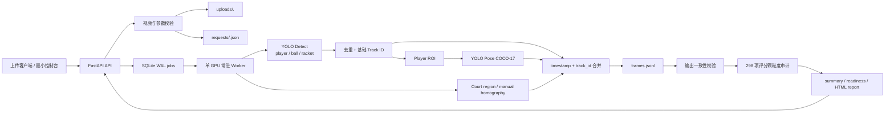
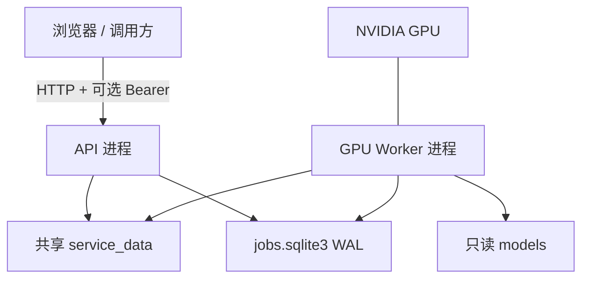
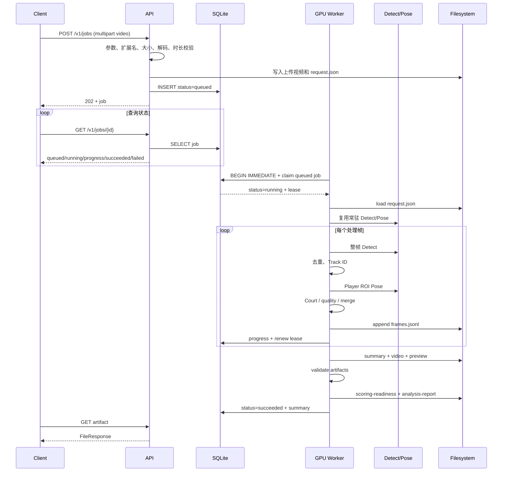
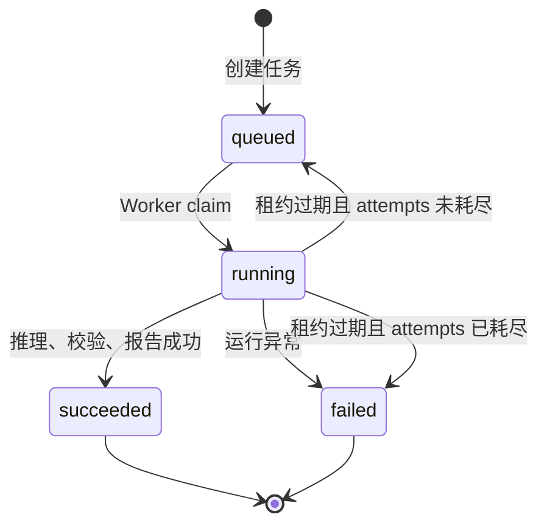
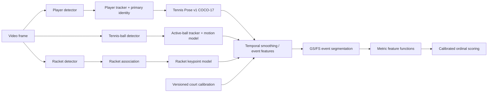
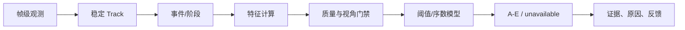

# RallyMate 视频推理与 GS/FS 评分系统技术设计及维护手册

> **历史 / 已被替代（2026-09-04 复核）**：本文是追加式演进记录，包含互相矛盾的旧
> “当前”结论、版本和测试计数，不能作为现行事实入口。当前技术权威是
> `RallyMate技术架构与实现说明书_当前态_v1.0.md`；机器 registry、Schema、代码和最新
> 运行产物优先级更高。本文保留用于追溯，不删除原历史内容。

文档版本：1.0  
代码基线：`rallymate-vision-demo 0.2.0`  
契约版本：`1.0.0`  
评分卡注册表版本：`2026-08-10-demo.1`  
基线日期：2026-08-10  
适用对象：高级后端工程师、计算机视觉算法工程师、时序建模工程师、MLOps/运维工程师、技术负责人、外部评审人员  
项目根目录：`<仓库根目录>`

> 本手册同时承担“技术设计文档”和“运行维护文档”的职责。文档以当前仓库代码和真实运行产物为事实基线；所有内容均使用“已实现”“已有接口/尚未闭环”“建议设计”三种状态标识，避免将工程链路可运行误写成专业评分已达标。

---

## 0. 文档状态、结论和阅读方法

### 0.1 状态标识

| 标识 | 含义 |
|---|---|
| **已实现** | 当前代码中已有实现，且能在本机环境运行或被测试覆盖。 |
| **已有接口/未闭环** | 已有字段、输出或框架，但缺少算法、真值、阈值或生产机制，不能作为最终能力承诺。 |
| **建议设计** | 本手册给出的下一阶段设计规范，尚未全部进入当前代码。 |

### 0.2 高层结论

1. **视频上传、持久队列、GPU Worker、整帧检测、人员 ROI Pose、基础 Track ID、场地区域、逐帧 JSON、标注视频、评分颗粒度审计、HTML 报告下载已经跑通。**
2. **当前真实数据输出的是“视觉观测证据”，不是已经验证的 GS/FS 专业评分。** `ready_for_final_scoring` 现在由运行时状态决定：只有指标达到 F4、加载的生产标定资产通过运维受信晋级账本校验，并且当前任务实际产生事件级 `scored` 记录时才为 `true`；当前无人工真值与正式标定资产，因此仍为 `false`。该字段不表示存在跨事件或跨指标总分。
3. **当前默认 Pose 已从早期 COCO-17 基线切换为 RTMPose-M Halpe26 256×192。** 26 点拓扑提供脚跟、脚趾等更细观测，但“关节可映射”仍不等于关键点精度、几何可计算性和时序稳定性达标。
4. **YOLO26n-Pose/COCO-17 只保留为显式 `yolo-baseline` 回滚基线。** 当前优化重点是主球员连续 Track、遮挡/远景低置信和真人真值评测；RTMPose-L Halpe26 384×288 仅为离线 shadow 候选，未验证为更高准确率，也未替换默认模型。
5. **球拍不能只依赖人体 Pose。** 应建设独立球拍关键点模型，至少输出拍头、拍喉、握把端和拍面/甜区代理点。
6. **球不能继续只使用通用 `sports ball` 框和简单最近邻 Track。** 接触事件和轨迹指标需要网球专项小目标检测、活动球筛选、运动模型、遮挡重连和时序一致性。
7. **当前最大评分阻断项不是 Web 页面，而是真值、标定和独立测试。** FS01/FS02/FS09 的 13 项已完成候选事件与 F2 特征测量；人工事件/关键点/语义真值、教练标注与独立测试仍为 0，因此不得输出正式 A～E。其余 285 项不在本轮评分闭环。
8. **当前真实长视频结果进一步证明了上述判断。** 在 11,516 帧任务上，普通 Pose 帧覆盖为 98.30%，但最长主 Pose Track 仅覆盖 42.09%；球最长单轨迹仅覆盖 2.65%，球拍最长单轨迹仅覆盖 1.11%。帧覆盖率高不能替代轨迹稳定性和人工真值准确率。

### 0.3 评审者建议阅读顺序

- 技术负责人：第 1、2、4、12、18、24、31 章。
- 后端工程师：第 3、5、6、7、8、19、20、25、28 章。
- 算法工程师：第 9～18、21～24、29、30 章。
- 运维/MLOps：第 19、20、25～28、32 章。
- 外部验收人员：第 2、12、18、23、24、29、31 章。

---

## 目录

1. 项目目标、范围与术语
2. 当前成熟度和可行性结论
3. 代码与资产总览
4. 总体系统架构
5. 端到端推理链路
6. 任务状态机、持久队列与失败恢复
7. HTTP API 详细设计
8. 输入输出契约与产物说明
9. 当前模型架构
10. 目标检测、去重与跟踪逻辑
11. 场地识别与固定机位标定
12. 评分卡结构、依赖和匹配度
13. 人体关键点架构与 J 系统映射
14. 坐标系、置信度与几何有效性
15. 人体夹角、姿态和空间特征定义
16. 速度、加速度、平滑和时序特征
17. GS/FS 事件切分设计
18. 评分引擎、证据门禁和可解释输出
19. 配置、环境变量和运行方式
20. 文件系统、数据库和容量设计
21. 数据标注与数据集治理
22. 模型训练、评测、登记和导出
23. 性能基线和容量评估
24. 测试、验收和质量门禁
25. 部署架构、扩展和回滚
26. 安全、隐私与许可证
27. 可观测性、告警和审计
28. 日常维护 SOP
29. 故障排查手册
30. 已知限制和技术债
31. 建议实施路线与优先级
32. 发布检查表和评审清单
33. 附录

---

# 1. 项目目标、范围与术语

## 1.1 项目最终目标

RallyMate 的最终目标是接收网球视频，识别球员动作、脚步、球、球拍和场地信息，将连续动作切分为业务事件，计算可解释的运动学特征，并依据 GS/FS 评分卡输出等级、证据、置信度和训练建议。

当前纳入注册表的评分域为：

- `GS`：底线基础事件，共 248 项指标；
- `FS`：步伐事件，共 50 项指标；
- 合计 298 项指标。

项目长期可能继续扩展 RS、DS、NS、SS、TS 等域，但它们不属于当前 298 项注册表基线。

## 1.2 当前代码负责的范围

**已实现：**

- 接收视频及推理参数；
- 校验扩展名、大小、时长、解码能力和参数范围；
- 检测 `player / ball / racket`；
- 为三类对象分配基础跨帧 `track_id`；
- 对球员 ROI 执行 COCO-17 Pose；
- 将 ROI 关键点还原到原图坐标；
- 使用 `person_track_id` 关联人体骨架和球员检测框；
- 输出场地区域提示或手工四点单应矩阵；
- 输出逐帧观测、任务汇总、标注视频、预览图；
- 对 298 项评分指标进行模型结构和本视频证据覆盖审计；
- 生成供人工查看的完整 HTML 分析报告；
- 提供训练数据准备、微调、评测、导出和模型登记框架。

**尚未闭环：**

- 主球员业务身份锁定；
- 生产级人员、球和球拍跟踪；
- 比赛中“当前活动球”识别；
- 球拍拍头、拍面、握把和甜区关键点；
- GS 五类动作和 50 个动作阶段的自动切分；
- FS 十类步伐事件的自动切分；
- 夹角、速度、节奏、位移等正式特征计算模块；
- 每项指标 A～E 的经过真值标定的判级逻辑；
- 最终专业评分和教练级结论；
- 业务层用户、场馆、配额、订单和多租户能力。

## 1.3 核心术语

| 术语 | 本项目中的含义 |
|---|---|
| Frame coverage / 帧覆盖率 | 某类预测至少在多少比例的处理帧中出现。它不是 Precision、Recall 或 mAP。 |
| Track coverage / 轨迹覆盖率 | 某一 `track_id` 出现帧数占全部处理帧的比例。最长 Track 能反映连续性，但仍不证明身份正确。 |
| Structural support / 结构支持 | 当前输出字段在形式上包含评分卡所需信息，不代表精度、事件切分和阈值已通过。 |
| Observed evidence / 观测证据 | 本次视频中实际观察到的依赖信号覆盖程度。 |
| Score ready / 可评分 | 依赖、事件、特征、阈值、真值和质量门禁均满足，可以输出正式评分。当前为 0/298。 |
| Keypoint / 关键点 | 模型预测的人体或球拍语义点。 |
| Joint / 关节 | 业务 J 系统中的身体位置编号。当前 COCO 点映射到 17 个 J 编号。 |
| Event / 事件 | 例如正手、双反、切削、分腿垫步。 |
| Stage / 阶段 | 一个事件内部的时序区间，例如转肩引拍、转髋、击球、收拍。 |
| Feature / 特征 | 从关键点、球、球拍、场地和时间序列计算出的角度、速度、位移或节奏。 |
| Calibration / 标定 | 包括场地几何标定和评分阈值标定，两者不能混用。 |

---

# 2. 当前成熟度和可行性结论

## 2.1 能力成熟度矩阵

| 能力层 | 当前状态 | 可用于 Demo | 可用于正式评分 | 主要缺口 |
|---|---|---:|---:|---|
| 视频上传与任务查询 | 已实现 | 是 | 作为基础设施可用 | 缺少取消、限流、多租户、对象存储 |
| 单 GPU 常驻推理 | 已实现 | 是 | 试点可用 | 缺少多 GPU 调度和完整监控 |
| Player 检测 | 通用模型基线 | 是 | 否 | 缺少独立真值指标和主球员身份 |
| Ball 检测 | 通用 `sports ball` 基线 | 部分 | 否 | 小目标、误检、活动球筛选、轨迹重连 |
| Racket 检测 | 通用框基线 | 部分 | 否 | 拍面/拍头/握把关键点和连续性 |
| COCO-17 Pose | 通用模型基线 | 是 | 仅能做研究性特征 | 网球域微调、低置信点、Track 稳定性 |
| Court region | 自动提示或手工区域 | 是 | 区域事件部分可用 | 自动结果不等于米制标定 |
| Metric court | 手工四点接口已实现 | 条件可用 | 试点可用 | 标定版本、点序约束、重投影误差、机位移动检测 |
| 事件切分 | 未实现 | 否 | 否 | GS/FS 时序标签和事件模型 |
| 几何/时序特征 | 仅设计，未正式实现 | 否 | 否 | 统一计算库、缺失值策略、验证集 |
| A～E 评分 | 未实现 | 否 | 否 | 教练真值、阈值/模型、校准版本 |
| 分析报告 | 已实现颗粒度审计报告 | 是 | 不是最终评分报告 | 目前只陈述证据与缺口 |

## 2.2 与两个评分文档的匹配度

评分卡注册表包含以下统计：

| 维度 | 数量 |
|---|---:|
| 总指标 | 298 |
| GS | 248 |
| FS | 50 |
| Pose 依赖指标 | 291 |
| 显式 J 编号均能映射到 COCO-17 的 Pose 指标 | 291 |
| 当前结构判断为 `supported` | 117 |
| 当前结构判断为 `partial` | 75 |
| 当前结构判断为 `unsupported` | 106 |
| 依赖球 | 116 |
| 依赖球拍关键点而被阻断 | 106 |
| 依赖米制场地 | 9 |
| 明确依赖生产级 Tracking | 2 |

评分卡源状态分布：

| 源状态 | 数量 |
|---|---:|
| 可评分 | 156 |
| 部分可评分 | 93 |
| 条件可评分 | 35 |
| 暂不可评分 | 14 |

需要强调四个不同层次：

1. `requiredPoints` 中出现的 J 编号能映射，说明当前拓扑可作为第一版基础；
2. 该点在视频中被模型输出，不等于位置准确；
3. 三个点存在，不一定足以计算业务语义要求的角度；
4. 特征可计算，不等于 A～E 阈值已经得到教练真值支持。

### 2.2.1 重要的语义匹配风险

当前颗粒度引擎只检查 `requiredPoints` 中的 J 编号集合是否属于 COCO-17 映射集合。高级算法评审必须额外检查“几何语义是否完整”。例如：

- 评分卡出现踝点，不代表能计算踝屈伸角；踝角至少还需要足跟、前脚掌或脚尖方向；
- 出现腕点，不代表能计算手腕角度或握拍方式；需要手掌/手指或球拍轴；
- 左右肩和左右髋能给出二维线段，但无法在任意相机视角下恢复真实三维转肩/转髋；
- 球拍框中心不能可靠替代拍头、拍面法向或甜区；
- 鼻、眼、耳只能给出头部朝向代理，不能判断真实视线是否盯球。

因此，`117 supported` 应解释为“当前规则下结构初步支持”，不能解释为 117 项已经能正式计分。

## 2.3 Pose 模型调整决策

### 当前建议

保留 COCO-17 作为 `tennis-pose-v1` 的拓扑起点，先执行网球域微调和时序稳态验证，不建议立即从零训练全新身体骨架。

### 需要优先做的调整

1. 对发球、正手、反手、切削、开放式/闭合式支撑、交叉步、制动等网球姿态分布进行微调；
2. 强化远端球员、运动模糊、肢体遮挡和拍体重叠场景；
3. 用独立球员/场次/机位测试集测 PCK、OKS 和逐关节误差；
4. 将主球员选择与 Pose Track 稳定性从简单面积排序升级为业务身份 Track；
5. 对左右点交换、瞬时跳点、长缺失和抖动建立视频级指标。

### 何时必须扩展身体拓扑

当通过评分特征审查确认下列指标不可由 COCO-17 稳定近似时，再建设 `tennis-pose-v2`：

- 足部朝向、踝角、前脚掌着地、脚尖外展；
- 骨盆中心和更稳定的身体中心；
- 颈、胸、腰椎或躯干分段弯曲；
- 手掌中心、手指或握拍类型；
- 更准确的头顶/下巴/面部朝向。

建议新增点不应直接塞入旧 `coco17` 契约；应更改 `keypoint_format`、契约版本和映射表，并保留向后兼容转换。

---

# 3. 代码与资产总览

## 3.1 代码模块

| 模块 | 文件 | 责任 |
|---|---|---|
| API | [`src/rallymate_service/api.py`](../src/rallymate_service/api.py) | 上传、鉴权、任务查询、能力查询、产物下载、最小控制台 |
| 配置 | [`src/rallymate_service/config.py`](../src/rallymate_service/config.py) | 环境变量、目录、模型、上传限制、许可证门禁 |
| 数据库 | [`src/rallymate_service/database.py`](../src/rallymate_service/database.py) | SQLite WAL 任务队列、租约、重试、状态与进度 |
| Worker | [`src/rallymate_service/worker.py`](../src/rallymate_service/worker.py) | 模型常驻、领取任务、执行推理、失败回写 |
| 服务入口 | [`src/rallymate_service/cli.py`](../src/rallymate_service/cli.py) | API、Worker、本机一体化启动 |
| 请求契约 | [`src/rallymate_vision/contracts.py`](../src/rallymate_vision/contracts.py) | 请求 JSON 解析、路径解析、参数校验 |
| 模型适配 | [`src/rallymate_vision/inference.py`](../src/rallymate_vision/inference.py) | YOLO Detect、ROI Pose、坐标回映、J 映射 |
| 主流水线 | [`src/rallymate_vision/pipeline.py`](../src/rallymate_vision/pipeline.py) | 视频循环、各分支编排、统计、落盘、报告 |
| Tracking | [`src/rallymate_vision/tracking.py`](../src/rallymate_vision/tracking.py) | 基础 IoU/中心距离匹配 |
| Court | [`src/rallymate_vision/court.py`](../src/rallymate_vision/court.py) | 自动区域提示和手工四点单应性 |
| 视频质量 | [`src/rallymate_vision/quality.py`](../src/rallymate_vision/quality.py) | 元数据、亮度、对比度、模糊度、规格告警 |
| 标注渲染 | [`src/rallymate_vision/render.py`](../src/rallymate_vision/render.py) | 检测框、骨架、场地和状态叠加 |
| 输出校验 | [`src/rallymate_vision/validation.py`](../src/rallymate_vision/validation.py) | 坐标、时间戳、外键和数量一致性 |
| 颗粒度引擎 | [`src/rallymate_scoring/granularity.py`](../src/rallymate_scoring/granularity.py) | 298 项结构/证据审计 |
| HTML 报告 | [`src/rallymate_scoring/report.py`](../src/rallymate_scoring/report.py) | 人类可读报告和逐项筛选 |
| 评分卡注册表 | [`src/rallymate_scoring/data/metric_cards.json`](../src/rallymate_scoring/data/metric_cards.json) | 298 项指标的机器可读主表 |
| 数据准备 | [`src/rallymate_training/dataset.py`](../src/rallymate_training/dataset.py) | 授权清单、标签审计、防泄漏切分 |
| 训练引擎 | [`src/rallymate_training/engine.py`](../src/rallymate_training/engine.py) | Ultralytics 训练、评测、ONNX/TensorRT 导出 |
| 模型登记 | [`src/rallymate_training/registry.py`](../src/rallymate_training/registry.py) | SHA-256、质量门禁、不可变版本和生产别名 |

## 3.2 正式契约

- [`contracts/request.schema.json`](../contracts/request.schema.json)
- [`contracts/frame-observation.schema.json`](../contracts/frame-observation.schema.json)
- [`contracts/summary.schema.json`](../contracts/summary.schema.json)

注意：当前运行时主要由 Python 自定义校验器执行校验，并未在所有入口处完整执行 Draft 2020-12 JSON Schema。JSON Schema 是公开契约文档，运行时校验覆盖范围比 Schema 更窄，这是需要补齐的技术债。

## 3.3 模型资产

> **当前态修订（M94）**：下表前两项源自最初 0.2.0 基线；其中 YOLO26n-Pose 已不再是无配置默认。当前服务以 `models/rtmpose/deployment-presets.json` 为部署真源，默认 preset 是 `rtmpose-m-halpe26-online`。

| 文件 | 大小 | SHA-256 | 当前定位 |
|---|---:|---|---|
| `models/yolo26n.pt` | 5,544,453 B | `9B09CC8BF347F0FC8A5F7657480587F25DB09B34BF33B0652110FB03A8AD4FEF` | 通用检测基线 |
| `models/yolo26n-pose.pt` | 7,878,574 B | `EB3BB8268828AEAF515CEC23A4BFAFD793944A86FE9AF94BA7823609C14522A9` | 历史通用 COCO-17 Pose 基线；仅显式 `yolo-baseline` 回滚 |
| `models/rtmpose/rtmpose-m_halpe26_256x192.pth` | 55,897,557 B | 以部署注册表和文件摘要校验为准 | **当前默认** RTMPose-M Halpe26 256×192，F2 测量用途，不是 F4 评分模型 |

当前 `model_registry` 没有正式专项版本；`training/generated` 没有正式训练数据产物。因此当前模型不应命名为“RallyMate 专项生产模型”。

## 3.4 当前运行环境

| 项目 | 实测值 |
|---|---|
| 操作系统 | Windows |
| Python | 3.10.18 |
| PyTorch | 2.11.0+cu128 |
| Ultralytics | 8.4.21 |
| OpenCV | 4.13.0 |
| FastAPI | 0.135.1 |
| GPU | NVIDIA GeForce RTX 5070 Ti |
| 设备参数 | `0` |

---

# 4. 总体系统架构

## 4.1 逻辑架构



## 4.2 部署拓扑



当前架构适合一台 GPU 主机和一个 Worker。多 Worker 并不是越多越好：同一 GPU 上并发加载多个模型会争抢显存并放大尾延迟；SQLite 也只被设计为单节点持久队列。

## 4.3 关键设计原则

1. API 和 GPU 推理解耦，上传请求不等待整段视频处理完成；
2. Worker 启动时只加载一次 Detect/Pose 权重，在任务之间复用；
3. 模型内部张量不直接暴露给下游，统一转换为版本化 JSON 契约；
4. Detect 和 Pose 独立版本化，Pose 通过球员 ROI 与 `track_id` 关联；
5. 所有分支共享源视频 `timestamp_ms`；
6. 覆盖率、结构支持、评分就绪分层表达；
7. 没有事件与真值时不生成伪评分。

---

# 5. 端到端推理链路

## 5.1 时序流程



## 5.2 上传阶段

`POST /v1/jobs` 执行以下步骤：

1. 校验 `court_mode`、手工多边形、点角色、`max_players`、起止时间和最大帧数；
2. 清洗原始文件名，只保留安全的文件名字符；
3. 只接受 `.mp4`、`.mov`、`.m4v`、`.avi`、`.mkv`；
4. 以 1 MiB 块流式写入 `service_data/uploads/<job_id>.<ext>`；
5. 超过 `RALLYMATE_MAX_UPLOAD_BYTES` 时返回 413，并删除未入库的临时视频；
6. 空文件返回 422；
7. OpenCV 无法解码或元数据非法时返回 422；
8. 视频时长超过限制时返回 413；
9. 生成完整 `request.json`；
10. 在 SQLite 中插入 `queued` 任务；
11. 返回 HTTP 202。

## 5.3 Worker 领取阶段

Worker 使用 `BEGIN IMMEDIATE` 保证同一任务不会被多个 Worker 同时领取。领取时：

- 检查过期 `running` 任务；
- 未超过重试次数的任务退回 `queued`；
- 达到重试上限的任务转为 `failed`；
- 按 `created_at` 领取最早任务；
- 设置 `worker_id`、`lease_expires_at`；
- `attempts += 1`；
- 初始化进度。

## 5.4 模型加载阶段

`PersistentVisionRunner` 在 Worker 启动时执行：

```text
resolve device
  -> load YOLO detect weights
  -> load YOLO pose weights
  -> cache model objects
  -> enter polling loop
```

任务请求中的模型绝对路径必须和预加载模型路径一致，否则 `run_pipeline` 会拒绝运行。这可以防止一个常驻 Worker 在未重启的情况下悄悄使用与任务声明不一致的权重。

## 5.5 视频帧循环

对每个选中的源视频帧，处理顺序为：

1. 计算源帧 `timestamp_ms = int(frame_index / fps * 1000)`；
2. 计算亮度、对比度、Laplacian 模糊分；
3. 对整帧运行 Detect；
4. 对同类重复框执行抑制；
5. 为检测对象分配 Track ID；
6. 选择面积最大的前 `max_players` 个球员；
7. 将人员框四周扩大 15%，最小 ROI 为 32×32；
8. 批量对人员 ROI 运行 Pose；
9. 每个 ROI 选择最高置信的人体结果；
10. 将关键点加回 ROI 偏移，恢复到原图坐标；
11. 按策略刷新 Court 结果；
12. 构造帧记录并立即执行逻辑校验；
13. 追加写入 `frames.jsonl`；
14. 可选写入 `annotated.mp4`，第一处理帧同时写 `preview.jpg`；
15. 定期写任务进度并续租。

## 5.6 汇总和评分颗粒度阶段

视频循环结束后：

1. 聚合视频质量；
2. 计算对象帧覆盖率；
3. 计算阶段一能力检查；
4. 写入初版 `summary.json`；
5. 逐行重新读取 `frames.jsonl`，校验 JSON、坐标、时间戳、Pose 外键和数量；
6. 扫描 Track 连续性和关键点有效率；
7. 将 298 张指标卡逐项与依赖覆盖和结构能力匹配；
8. 写 `scoring-readiness.json`；
9. 写 `analysis-report.html`；
10. 回写包含验证和评分审计摘要的最终 `summary.json`；
11. 数据库任务状态转为 `succeeded`。

## 5.7 进度阶段和百分比

| `phase` | 百分比逻辑 | 说明 |
|---|---:|---|
| `loading_models` | 1 | 仅非预加载模式会在任务内出现 |
| `inference` | 3～96 | 按已处理帧/计划帧线性估算 |
| `finalizing` | 98 | 汇总和产物校验 |
| `scoring_readiness` | 99 | 298 项审计和报告生成 |
| `completed` | 100 | 数据库成功回写 |
| `failed` | 0 | 失败信息写入 `error` |

进度回调失败不会中断有效推理；这是有意的降级策略，但也意味着数据库暂时不可写时，前端可能看到过期进度。

---

# 6. 任务状态机、持久队列与失败恢复

## 6.1 状态机



当前没有 `cancelled`、`deleting`、`expired` 或 `paused` 状态。

## 6.2 数据库表 `jobs`

| 字段 | 类型/语义 |
|---|---|
| `id` | 文本主键，UUID |
| `status` | `queued/running/succeeded/failed` |
| `original_filename` | 清洗后的原文件名 |
| `video_path` | 本地上传视频路径 |
| `request_path` | 请求 JSON 路径 |
| `output_dir` | 任务产物目录 |
| `created_at/updated_at` | UTC ISO 8601 |
| `started_at/completed_at` | UTC ISO 8601，可空 |
| `lease_expires_at` | Worker 租约截止时间 |
| `attempts` | 已领取次数 |
| `worker_id` | 主机名 + 随机后缀 |
| `progress_json` | 当前进度 JSON |
| `summary_json` | 成功任务的汇总 JSON |
| `error` | 最大保留 4,000 字符 |

数据库连接启用：

- `PRAGMA journal_mode=WAL`；
- `PRAGMA foreign_keys=ON`；
- 30 秒连接超时；
- `status, created_at` 复合索引。

## 6.3 默认租约和重试

| 参数 | 默认值 |
|---|---:|
| 租约 | 3,600 秒 |
| 最大尝试次数 | 2 |
| Worker 空闲轮询 | 独立模式 2 秒；本机一体模式 0.5 秒 |

Worker 每次写进度时续租。如果 Worker 进程崩溃，后续 Worker 调用 `claim_next` 时才会处理过期租约；没有独立调度器主动扫描。

## 6.4 幂等性和残留文件

当前任务创建不是面向客户端幂等键设计：客户端重复上传会生成不同 UUID 和不同任务。输出目录按 UUID 隔离，能避免互相覆盖，但失败重试会复用同一输出目录。`frames.jsonl` 使用 `w` 重写，视频 Writer 也会重建；因此重试一般会覆盖本任务的部分产物。

生产化建议：

- 增加客户端 `idempotency_key`；
- 每次尝试写入临时 attempt 目录；
- 全部校验通过后原子切换 `current` 清单；
- 失败 attempt 保留有限时间供诊断；
- 不直接让下载接口读取尚未完成的 attempt。

---

# 7. HTTP API 详细设计

## 7.1 通用约定

- 基础地址：本机默认 `http://127.0.0.1:8000`；
- API 版本前缀：业务接口使用 `/v1`；
- 内容类型：上传为 `multipart/form-data`，其他接口返回 JSON 或文件；
- 鉴权：若配置 `RALLYMATE_API_KEY`，使用 `Authorization: Bearer <token>`；
- `/health/live` 不鉴权；其余业务接口按代码依赖鉴权；
- FastAPI 自动提供 `/docs` 和 `/openapi.json`；
- 当前 API 返回字典但未定义强类型 response model，OpenAPI 的响应结构约束不足，建议补 Pydantic 模型。

## 7.2 `GET /health/live`

用途：只判断 API 进程是否存活。

成功响应：

```json
{"status":"ok"}
```

此接口不检查模型、数据库、许可证和 Worker，不应被用作业务就绪探针。

## 7.3 `GET /health/ready`

用途：检查 API 侧配置、模型文件、数据库和许可证门禁。

成功响应示例：

```json
{
  "status": "ready",
  "reasons": [],
  "queue": {"queued": 0, "running": 1, "succeeded": 4},
  "environment": "development",
  "model_license_ack": "development"
}
```

如果模型缺失或许可证配置不合法，HTTP 仍可能为 200，但 `status` 为 `not_ready` 并在 `reasons` 中说明原因。部署健康检查如果只看 HTTP 状态码会漏报，生产探针应同时解析 JSON。

该接口没有直接证明 Worker 已启动或 GPU 可用；当前 Worker 健康状态不在数据库中，这是可观测性缺口。

## 7.4 `GET /v1/model-capabilities`

用途：返回与具体视频无关的静态评分卡/模型结构审计。

核心字段：

```json
{
  "schema_version": "1.0.0",
  "registry_version": "2026-08-10-demo.1",
  "indicator_count": 298,
  "domains": {"GS": 248, "FS": 50},
  "model_granularity": {
    "supported": 117,
    "partial": 75,
    "unsupported": 106
  },
  "pose_assessment": {
    "pose_dependent_indicators": 291,
    "explicit_joint_mapping_complete_indicators": 291,
    "recommendation": "retain_COCO17_topology_and_tennis_finetune_first"
  },
  "capability_matrix": []
}
```

该接口不读取视频，不代表某个任务的证据质量。

## 7.5 `POST /v1/jobs`

用途：上传一个视频并创建异步任务。

### 7.5.1 Form 参数

| 参数 | 类型 | 默认值 | 限制/语义 |
|---|---|---|---|
| `video` | file | 必填 | `.mp4/.mov/.m4v/.avi/.mkv`，必须可解码 |
| `court_mode` | string | `auto` | `auto/manual/disabled` |
| `manual_polygon_normalized` | JSON string | 空 | 四个 `[x,y]`，每个坐标在 0～1 |
| `manual_polygon_role` | string | `court_outer_doubles_corners` | `visible_region` 或 `court_outer_doubles_corners` |
| `write_annotated_video` | bool | `true` | 是否生成 MP4；关闭时通常也没有 preview |
| `max_players` | int | 2 | API 限制 1～4 |
| `start_ms` | int | 0 | 非负 |
| `end_ms` | int/null | null | 必须大于 `start_ms` |
| `max_frames` | int/null | null | 至少 1；仅建议调试使用 |

注意：上传 API 当前没有暴露 `frame_stride`、模型路径、输入尺寸、置信度和 Court 刷新策略，这些会在服务器生成的请求中使用固定值。这样能减少客户端误配置，但也使 API 与底层请求 Schema 的能力不完全对称。

### 7.5.2 成功响应

HTTP 202：

```json
{
  "id": "6d6bd08a-6cfd-4cdf-b15c-77db7627520b",
  "status": "queued",
  "original_filename": "video.mp4",
  "created_at": "2026-08-10T...+00:00",
  "updated_at": "2026-08-10T...+00:00",
  "started_at": null,
  "completed_at": null,
  "attempts": 0,
  "progress": {"phase": "queued", "percent": 0},
  "error": null,
  "summary": null,
  "artifact_urls": {}
}
```

### 7.5.3 典型错误

| HTTP | 条件 |
|---:|---|
| 401 | Bearer 缺失或不匹配 |
| 413 | 文件大小或视频时长超过配置 |
| 415 | 扩展名不支持 |
| 422 | 参数非法、文件为空、视频无法解码、手工模式缺四点 |
| 500 | 文件系统、数据库或未捕获的服务器错误 |

### 7.5.4 PowerShell 调用示例

```powershell
$Form = @{
  video = Get-Item 'C:\video\tennis.mp4'
  court_mode = 'auto'
  write_annotated_video = 'true'
  max_players = '2'
}

Invoke-RestMethod `
  -Method Post `
  -Uri 'http://127.0.0.1:8000/v1/jobs' `
  -Form $Form
```

如果启用 Token：

```powershell
$Headers = @{ Authorization = 'Bearer <token>' }
Invoke-RestMethod -Headers $Headers -Method Get `
  -Uri 'http://127.0.0.1:8000/health/ready'
```

## 7.6 `GET /v1/jobs`

查询最近任务。

参数：`limit`，默认 20，数据库层钳制到 1～100。

响应：

```json
{
  "items": ["<public job objects>"],
  "count": 1
}
```

当前没有分页游标、状态过滤、创建时间过滤和租户隔离。

## 7.7 `GET /v1/jobs/{job_id}`

查询单个任务。不存在返回 404。

`succeeded` 时 `artifact_urls` 只列出实际存在且在白名单中的文件；其他状态为空。

`summary` 来自数据库中的 `summary_json`，不是每次实时读取磁盘 `summary.json`。如果人工修改磁盘文件，状态接口与下载文件可能不一致。

## 7.8 `GET /v1/jobs/{job_id}/artifacts/{artifact_name}`

允许下载的白名单：

- `summary.json`
- `frames.jsonl`
- `annotated.mp4`
- `preview.jpg`
- `scoring-readiness.json`
- `analysis-report.html`

行为：

- 文件名不在白名单：404；
- 任务不存在：404；
- 任务未成功：409；
- 白名单文件未生成：404；
- 成功：`FileResponse`，下载名为 `<job_id>-<artifact_name>`。

该白名单策略阻止任意路径遍历，但当前没有签名 URL、下载限速或大文件分段代理策略。

## 7.9 用户上传与结果 Demo `GET /`（M94 历史基线；当前 v1.2 见 34.69）

> 本节保留 M94 当时替代“最小开发控制台”的历史状态。当前根页仍是面向普通用户的本地 Demo，但展示
> 合同已升级为 v1.2；以 34.69 和当前接口文档为准。

Demo 承担：

- 选择视频；
- 选择 `court_mode`；
- 可选限制调试帧数；
- 可选 Bearer；
- 是否写标注视频；
- 轮询任务状态；
- 完成后读取 `GET /v1/jobs/{job_id}/demo-result`，展示当时的分析完成度、FS01/FS02/FS09 动作卡和可信可测幅度；
- 打开当时的完整报告和原始产物。

幅度、`measured_indicator_ids`、动作卡已测数量和分析完成度的已测量唯一指标分量共用记录资格：优先要求
`feature_status="measured"`，该字段缺失时才回退 `scoring_feature_status="measured"`，并要求
`quality_gate.measurement_allowed` 不能显式为 `false`。幅度通过资格后从 `features` 提取，仅在该字段缺失
时兼容回退 `scoring_features`。未通过资格或无有效 `event_id` 的记录不展示；同一事件跨
指标重复出现的同名特征按 `(event_id, feature_name)` 去重并取中位数。该历史 Demo v1 不暴露正式总分或 A～E，
`formal_scoring.available=false`，总分和等级均为 `null`。

---

# 8. 输入输出契约与产物说明

## 8.1 服务器生成的请求 JSON

当前长视频任务的请求形态如下。下例已替代早期只写 `yolo26n-pose.pt`、固定 COCO-17 的旧示例；
Pose preset 是完整部署身份，不能只改权重路径而保留不匹配的 backend/profile/config/native topology：

```json
{
  "schema_version": "1.0.0",
  "job_id": "<uuid>",
  "source": {"video_path": "<absolute path>"},
  "output": {"directory": "<absolute path>"},
  "models": {
    "detect": "<yolo26n.pt>",
    "pose": "<rtmpose-m_halpe26_256x192.pth>",
    "device": "0",
    "detect_imgsz": 960,
    "pose_imgsz": 640,
    "detect_confidence": 0.15,
    "pose_confidence": 0.25,
    "pose_backend": "rtmpose",
    "pose_runtime": "pytorch",
    "pose_profile": "realtime",
    "pose_config": "<rtmpose-m_halpe26_256x192.py>",
    "pose_preset": "rtmpose-m-halpe26-online",
    "pose_native_keypoint_format": "halpe26"
  },
  "processing": {
    "start_ms": 0,
    "end_ms": null,
    "frame_stride": 1,
    "max_frames": null,
    "max_players": 2,
    "court_every_n_frames": 25,
    "write_annotated_video": true
  },
  "court": {
    "mode": "auto",
    "manual_polygon_normalized": null,
    "manual_polygon_role": "court_outer_doubles_corners",
    "refresh_policy": "until_usable"
  },
  "upstream_metadata": {
    "original_filename": "video.mp4",
    "content_type": "video/mp4",
    "upload_bytes": 24195384,
    "source_ip": "127.0.0.1"
  }
}
```

### 8.1.1 路径规则

通过 CLI 直接提交的相对路径，以请求 JSON 所在目录为基准解析；API 生成的是绝对路径。

### 8.1.2 处理范围

- `start_frame = int(start_ms / 1000 * fps)`；
- `end_frame = min(int(end_ms / 1000 * fps), total_frames)` 或总帧数；
- 只有满足 `(source_index - start_frame) % frame_stride == 0` 的帧被处理；
- 标注视频帧率为 `source_fps / frame_stride`；
- `max_frames` 在已选帧计数上生效。

## 8.2 `frames.jsonl`

每一行是一个独立 JSON 对象，适合流式处理。下游必须按 `timestamp_ms + track_id` 组织序列，不能依赖数组顺序。

### 8.2.1 顶层结构

```json
{
  "schema_version": "1.0.0",
  "job_id": "<uuid>",
  "frame": {},
  "quality": {},
  "detections": [],
  "poses": [],
  "court": {},
  "handoff": {}
}
```

### 8.2.2 `frame`

| 字段 | 含义 |
|---|---|
| `index` | 源视频帧号 |
| `processed_index` | 本任务处理序号，从 0 开始 |
| `timestamp_ms` | 源视频时间戳 |
| `width/height` | 原图尺寸 |
| `coordinate_origin` | 固定为 `top_left` |

### 8.2.3 `quality`

| 字段 | 当前计算 |
|---|---|
| `brightness` | 灰度均值 |
| `contrast` | 灰度标准差 |
| `blur_score` | Laplacian 方差 |
| `status` | 有告警为 `warning`，否则 `ok` |
| `warnings` | `too_dark/overexposed/low_contrast/blurry` |

当前阈值：亮度 `<45` 过暗、`>220` 过曝、对比度 `<25`、模糊分 `<45`。

### 8.2.4 `detections[]`

```json
{
  "class_name": "player",
  "source_class_name": "person",
  "class_id": 0,
  "confidence": 0.89531,
  "bbox_px": [606.279, 235.803, 654.167, 331.431],
  "bbox_normalized": [0.631541, 0.433461, 0.681424, 0.609248],
  "center_px": [630.223, 283.617],
  "center_normalized": [0.656482, 0.521355],
  "downstream_systems": ["J", "S01", "S07"],
  "track_id": 1
}
```

类别与下游标识：

| 类别 | 源通用类别 | 下游系统 |
|---|---|---|
| `player` | `person` | `J`, `S01`, `S07` |
| `ball` | `sports ball` | `BALL`, `S02` |
| `racket` | `tennis racket` | `RK`, `S03` |

### 8.2.5 `poses[]`

```json
{
  "person_track_id": 2,
  "confidence": 0.57517,
  "roi_bbox_px": [501, 185, 554, 390],
  "coordinate_space": "original_frame",
  "keypoint_format": "coco17",
  "keypoints": [
    {
      "index": 0,
      "name": "nose",
      "downstream_joint_id": "J004",
      "x_px": 519.044,
      "y_px": 223.495,
      "x_normalized": 0.540671,
      "y_normalized": 0.410836,
      "confidence": 0.96647
    }
  ]
}
```

每个 Pose 必须恰好有 17 个关键点；`person_track_id` 必须引用同帧 `player` 检测的 `track_id`。

### 8.2.6 `court`

| 字段 | 说明 |
|---|---|
| `status` | `disabled/absent/uncertain/detected/calibrated` |
| `method` | 自动 Hough 提示或手工多边形方式 |
| `confidence` | Court 分支置信度 |
| `region_usable` | 可否用于区域过滤 |
| `calibration_usable` | 可否作为米制标定基础 |
| `polygon_px/normalized` | 区域或四点 |
| `line_segments_px` | 自动检测的候选线段 |
| `homography_image_to_court_normalized` | 只有有效手工外侧双打角点时存在 |
| `observed_at_frame/age_frames` | 本帧使用的 Court 结果年龄 |

### 8.2.7 `handoff`

记录下游约定：

```json
{
  "pose_player_link": "poses[].person_track_id -> detections[].track_id",
  "coordinate_space": "original_frame_pixels_and_normalized_0_1",
  "timebase": "source_video_timestamp_ms",
  "downstream_taxonomy": {
    "pose": "J joint system",
    "ball": "BALL + S02",
    "racket": "RK + S03",
    "court": "S05"
  }
}
```

## 8.3 `summary.json`

主要区块：

- `input.video`：分辨率、FPS、总帧、时长；
- `models`：模型路径、目标类别、Pose 格式、J 映射、Court 方法；
- `processing`：处理范围、帧数、耗时、有效 FPS、阶段耗时；
- `quality`：全视频质量聚合；
- `counts`：检测数、含类帧数、Pose 帧数、Court 状态帧数；
- `coverage`：帧覆盖率；
- `next_stage`：阶段一能力声明；
- `runtime`：Python、Torch、Ultralytics、设备和 CUDA；
- `artifacts`：产物相对/绝对路径；
- `validation`：逐帧产物校验结果；
- `scoring_readiness`：298 项审计摘要；
- `pose_assessment`：Pose 拓扑决策。

## 8.4 `scoring-readiness.json`

顶层结构：

```text
schema_version
generated_at
job_id
registry_version
summary
pose_assessment
capability_matrix
observed_model_evidence
indicator_results[298]
```

每项 `indicator_results[]` 包含：

- 指标 ID、名称、域、事件、阶段；
- 源状态；
- 依赖列表、强制/可选依赖；
- 所需 J 编号；
- J 映射是否完整；
- 各依赖证据覆盖；
- 聚合证据值和证据状态；
- 模型结构颗粒度；
- `score_ready=false`；
- 阻断原因；
- 原评分卡计算契约和点位要求。

## 8.5 `analysis-report.html`

它是“当前模型推理与评分颗粒度报告”，不是最终评分报告。内容包括：

- 视频和运行环境；
- 主 Pose Track、球、球拍、Court 连续性；
- 117/75/106 结构统计；
- 17 个 J 点有效率；
- 298 项逐项可筛选审计；
- 阻断项和研发优先级；
- 原始产物链接。

## 8.6 输出一致性校验

当前校验器检查：

- `schema_version`；
- 正尺寸、非负且严格递增的时间戳；
- 同一帧 Track ID 不重复；
- 框、中心和归一化坐标范围；
- Pose 必须关联同帧 Player；
- 17 个关键点及其 J 映射；
- Court 归一化点范围；
- 只有 `calibrated` 才能设 `calibration_usable=true`；
- `summary.processing.processed_frames` 与 JSONL 行数一致；
- 至少有一帧；
- 汇总检测/Pose 数量。

未覆盖但应补齐：

- 用正式 JSON Schema 校验全部字段；
- `job_id` 在每行与任务一致；
- `frame.index/processed_index` 连续性；
- 检测 `source_class_name/class_id` 合法性；
- 数值 NaN/Infinity；
- 关键点索引、名称和 J 映射逐项固定；
- MP4 可解码、帧数和时长；
- 预览图尺寸；
- 产物哈希和原子发布。

# 9. 当前模型架构

## 9.1 模型组合

当前不是一个端到端多任务模型，而是两个 Ultralytics YOLO 模型级联：

```text
整帧 YOLO Detect
  ├─ person       -> player
  ├─ sports ball  -> ball
  └─ tennis racket-> racket

player detection + track_id
  -> 扩大 15% 的人员 ROI
  -> YOLO Pose COCO-17
  -> 选 ROI 内最高置信人体
  -> 坐标恢复到原始画面
  -> pose.person_track_id = player.track_id
```

## 9.2 当前推理参数

| 参数 | 值 | 影响 |
|---|---:|---|
| Detect 输入尺寸 | 960 | 速度和小目标召回折中 |
| Pose 输入尺寸 | 640 | ROI 内姿态分辨率 |
| Detect 置信度 | 0.15 | 偏低，保召回但增加误检和 Track 碎片 |
| Pose 置信度 | 0.25 | Ultralytics 人体结果阈值 |
| Player ROI margin | 0.15 | 防止肢体落在框外 |
| Player ROI 最小尺寸 | 32×32 | 更小 ROI 跳过 Pose |
| 最大 Pose 人数 | API 默认 2，允许 1～4 | 按检测框面积排序 |
| Court 检查间隔 | 25 处理帧 | 只在刷新策略要求时真正执行 |

## 9.3 Detect 适配器

`Yolo26Perception.detect` 执行：

1. 从模型类别名中筛选 `person/sports ball/tennis racket`；
2. 调用 `predict`，传入图像、输入尺寸、置信度、类别 ID 和设备；
3. 将 `xyxy` 限制在图像范围；
4. 输出像素框、归一化框、中心、置信度和下游系统；
5. 同类去重；
6. Track ID 由后续 Tracker 写入。

### 9.3.1 风险

- `sports ball` 是通用类别，可能把静止网球、标识、灯光或白点识别成比赛球；
- 小球在远景中像素极少，960 输入可能不足；
- 低阈值 0.15 增加候选，也增加后续关联负担；
- 球和球拍没有按网球语义重新训练；
- 没有将“当前击打球”和场地中其他球区分。

## 9.4 Pose 适配器

对每个选中球员：

1. 框面积从大到小排序；
2. 选前 `max_players`；
3. 框各方向扩大原宽高的 15%；
4. 多个 ROI 作为批次传入 Pose；
5. 每个 ROI 选最高置信人物；
6. 输出 17 个点；
7. ROI 坐标加左上角偏移，恢复为原图坐标；
8. 坐标限制在画面范围；
9. 写入 COCO 名称和 RallyMate J ID；
10. Pose 关联当前 Player 的 Track ID。

### 9.4.1 风险

- 面积最大不一定是需要评分的主球员；
- 同一 ROI 若包含重叠人员，最高置信 Pose 可能属于另一人；
- 当前没有用上一帧骨架约束左右肢体和身份；
- 点落在图像边界不代表真实可见；
- 置信度是模型置信，不是像素误差或校准概率；
- COCO-17 缺少足部、脊柱、手掌和球拍轴。

## 9.5 为什么保留级联架构

级联方式有以下工程优势：

- Detect 和 Pose 可独立训练、替换和回滚；
- 对远端人员裁剪后再做 Pose，像素利用率更高；
- 多人场景中能用 `person_track_id` 表达骨架归属；
- 下游只依赖统一 JSON，不依赖 Ultralytics 内部对象；
- 可单独扩展球、球拍和 Court 分支。

代价是：检测漏人会直接导致 Pose 缺失；检测框抖动会影响 ROI 和关键点稳定性；跨模型端到端优化不可用。

## 9.6 推荐的下一版模型拓扑



身体 Pose 和球拍关键点应保持独立模型，因为一个是人体可变形骨架，一个是细长刚体；它们的标注、尺度、遮挡和增强策略不同。

---

# 10. 目标检测、去重与跟踪逻辑

## 10.1 同类去重

检测结果按置信度从高到低遍历。若与已保留同类框满足阈值，则丢弃当前框。

| 类别 | IoU 去重阈值 |
|---|---:|
| Player | 0.82 |
| Racket | 0.85 |
| Ball | 0.92 |

Player 还有嵌套框规则：较小框与较大框的交集面积除以较小框面积达到 0.90，也判为重复。

定义：

```text
IoU(A,B) = area(A ∩ B) / area(A ∪ B)

IoMin(A,B) = area(A ∩ B) / min(area(A), area(B))
```

当前去重是每帧静态规则，不使用类别概率校准或 Track 历史。

## 10.2 基础 Tracker

每类独立匹配，Track 记录：

- `track_id`；
- `class_name`；
- 最近框；
- 连续未匹配帧数 `missed`。

候选门控：

```text
如果 IoU < 0.01 且归一化中心距离 > distance_gate，则不能匹配。
```

`distance_gate`：

- Ball：0.28；
- 其他：0.16。

候选代价：

```text
cost = 0.65 × (1 - IoU) + 0.35 × normalized_center_distance
```

按检测置信度从高到低贪心分配最低代价 Track。没有可用 Track 时创建新 ID。

最大丢失帧：

| 类别 | 默认最大 `missed` |
|---|---:|
| Player | 30 |
| Racket | 12 |
| Ball | 8 |

## 10.3 当前 Tracker 的边界

该 Tracker 是输出契约桥接实现，不是生产级多目标跟踪器：

- 没有卡尔曼滤波或运动状态；
- 没有外观 Re-ID；
- 没有匈牙利算法全局匹配；
- 没有轨迹置信度和生命周期状态；
- 没有遮挡重连；
- 没有 Camera Motion Compensation；
- 人员、球、球拍共用大体相同的匹配框架；
- Ball 的高速位移不能由普通中心距离稳定描述；
- Racket 没有绑定到持拍手和球员身份。

## 10.4 推荐升级

### Player

- ByteTrack/BoT-SORT 类 Track 管线；
- 外观特征仅作为辅助，避免服装相似时误关联；
- Court 位置、人体尺度和主要活动区作为几何先验；
- 建立 `primary_player_id`，而不是用最大框替代；
- 记录 ID switch/min、Fragmentation、IDF1、HOTA。

### Ball

- 状态向量至少包括位置和速度；
- 候选使用时序预测门控，而不是只看前一框；
- 允许短时遮挡、出画和再入画；
- 排除长期静止候选；
- 利用 Court 区域、飞行速度、轨迹平滑、球拍邻近和击球方向变化；
- 输出多候选概率，事件层再确定活动球。

### Racket

- 先将拍框与球员/持拍腕关联；
- 独立球拍关键点；
- 遮挡时由腕、肘、上一帧拍轴和运动模型预测；
- 记录拍头轨迹和拍轴方向，而不是只记录框中心。

---

# 11. 场地识别与固定机位标定

## 11.1 三种模式

| 模式 | 当前行为 | 能力 |
|---|---|---|
| `disabled` | 返回空 Court | 不支持区域/米制指标 |
| `auto` | 表面颜色 + Hough 线 + 保守验证 | 只产生可见区域提示，不产生米制标定 |
| `manual` | 使用四个归一化点 | `visible_region` 仅区域；`court_outer_doubles_corners` 产生单应矩阵 |

## 11.2 自动区域算法

自动分支不是神经网络 Court 模型，主要步骤为：

1. 在画面下方中央区域采样 Lab 颜色中位数；
2. 根据 Lab 加权距离生成球场表面候选 Mask；
3. 开闭运算清理 Mask；
4. 选择与画面下方连通、面积和重心合理的主表面；
5. CLAHE、Gaussian Blur、Canny；
6. `HoughLinesP` 检测线段；
7. 要求线段大部分落在表面 Mask 附近；
8. 检查白线亮度和局部对比度；
9. 对候选端点求凸包或最小外接矩形；
10. 计算线数量、面积、方向族、位置、对比度和球员遮挡因子；
11. 所有验证通过且综合置信度至少 0.58，才输出 `detected`；否则 `uncertain/absent`。

自动结果始终：

```text
calibration_usable = false
```

## 11.3 手工四点单应性

当：

```text
court_mode = manual
manual_polygon_role = court_outer_doubles_corners
```

当前代码把输入四点按给定顺序映射到：

```text
(0,0), (1,0), (1,1), (0,1)
```

并用 `cv2.getPerspectiveTransform` 得到 `H_image_to_court_normalized`。

齐次坐标变换：

```text
[u' v' w']ᵀ = H [x y 1]ᵀ
u = u' / w'
v = v' / w'
```

如果点语义固定为标准双打场地外侧四角，可进一步转换为米：

```text
X_m = u × 10.97
Y_m = v × 23.77
```

当前代码只输出归一化单应矩阵和场地尺寸元数据，没有把每个对象中心直接写成米制坐标。

## 11.4 点序要求

当前代码不会自动重排四点，也没有方向合法性验证。因此输入顺序错误会得到数学上存在、业务上错误的矩阵。

建议正式定义：

```text
P0 = far-left outer doubles corner
P1 = far-right outer doubles corner
P2 = near-right outer doubles corner
P3 = near-left outer doubles corner
```

这里的 left/right 从相机观察方向定义。若产品采用场上球员视角，应另定义并固化，不能混用。

## 11.5 固定机位生产设计

建议引入：

```text
venue_id
court_id
camera_id
camera_setup_version
source_resolution
rotation
crop
corner_points_px
corner_semantics
homography
reprojection_error_px
created_at
created_by
status
model/schema version
```

每个任务引用不可变 `camera_setup_version`。摄像机移动、变焦、裁剪、旋转或分辨率变化必须创建新版本。

## 11.6 标定验收

仅四个角点能精确拟合这四点本身，不能用四点自身误差证明整体正确。应额外标注球场白线交点作为验证点，计算：

```text
e_i = ||project_H(image_point_i) - reference_court_point_i||
RMSE = sqrt(mean(e_i²))
P95 = percentile(e_i, 95)
```

同时检查：

- 映射后线段平行/垂直关系；
- 场地长宽比例；
- 球员脚点是否落在合理区域；
- 相机移动前后静态特征漂移；
- 不同日期、光照和遮挡下稳定性。

---

# 12. 评分卡结构、依赖和匹配度

## 12.1 注册表字段

每张指标卡包含：

| 字段 | 说明 |
|---|---|
| `id` | 唯一指标编号，如 `GS01-M01-01` |
| `domain` | `GS/FS` |
| `eventCode` | 事件编号 |
| `stageCode/stageName/stageOrder` | 阶段编号、名称和顺序 |
| `startAction/endAction` | 阶段边界语义 |
| `name/definition` | 指标名称和定义 |
| `sourceKey/reuseSource` | 来源追溯 |
| `currentPoints` | 当前可观察内容 |
| `requiredPoints` | 所需 J/BALL/RK/Court 等点位 |
| `sourceStatus` | 原始可评分状态 |
| `calculation` | 建议计算契约 |
| `dependencies` | `pose/ball/racket/court/tracking` |
| `grades` | A～E 文本标准 |
| `unavailable` | 不可评分条件 |
| `positiveFeedback/improvementFeedback` | 反馈文本 |

## 12.2 GS 事件和阶段

GS 共五类事件、50 个阶段、248 项指标：

| 事件 | 指标数 | 十阶段摘要 |
|---|---:|---|
| `GS01` | 51 | 盯球准备、启动移动、转肩引拍、主动蹬地、转髋、转胸、手臂加速与挥拍、击球、收拍、恢复准备 |
| `GS02` | 49 | 双反准备、启动移动、转肩引拍、主动蹬地、转髋、转胸、双手加速与挥拍、击球、收拍、恢复准备 |
| `GS03` | 49 | 单反准备、启动移动、转肩引拍、蹬地、转髋、转胸、单手加速挥拍、击球、展翅收拍、恢复准备 |
| `GS04` | 49 | 切削准备、启动移动、转肩引拍、重心支撑、高位引拍、拍面打开、单手切削挥拍、切削击球、切削收拍、恢复准备 |
| `GS05` | 50 | 正手切削准备、启动移动、转肩引拍、重心支撑、高位引拍、拍面打开、正手切削挥拍、切削击球、切削收拍、恢复准备 |

## 12.3 FS 事件

FS 共十类事件，每类 5 项，共 50 项：

1. `FS01` 分腿垫步；
2. `FS02` 第一步启动；
3. `FS03` 交叉步移动；
4. `FS04` 并步移动；
5. `FS05` 小碎步调整；
6. `FS06` 开放式支撑；
7. `FS07` 闭合式支撑；
8. `FS08` 跨步支撑；
9. `FS09` 制动急停/稳定；
10. `FS10` 击球后回位。

## 12.4 依赖组合分布

| 依赖组合 | 指标数 |
|---|---:|
| `pose` | 117 |
| `ball + pose` | 66 |
| `pose + racket` | 59 |
| `ball + pose + racket` | 42 |
| `court + pose` | 4 |
| `ball + racket` | 4 |
| `ball + court + pose` | 3 |
| `court + tracking` | 1 |
| `ball + court + tracking` | 1 |
| `racket` | 1 |

## 12.5 当前静态颗粒度规则

对每张卡：

- 所需 J 不在 COCO 集合：`unsupported`；
- 依赖 Racket：因为缺少球拍关键点，`unsupported`；
- 依赖 Ball、Tracking 或 Court：`partial`；
- 以上均无：`supported`。

这是一个保守但粗粒度的结构检查。它不会解析 `calculation` 文本来验证一个指标是否真的能从当前点位计算。

## 12.6 当前视频证据规则

依赖覆盖：

```text
pose = 主 Pose Track 覆盖率，并受所有 required J 点最小有效率约束
ball = min(ball 帧覆盖率, ball 最长 Track 覆盖率)
racket = min(racket 帧覆盖率, racket 最长 Track 覆盖率)
court = court_calibrated_fraction
tracking = 主 Pose Track 覆盖率
```

当前关键点有效置信度：`>= 0.25`。

证据状态：

| 状态 | 聚合证据 |
|---|---:|
| `ready` | `>= 0.75` |
| `partial` | `>= 0.40 and < 0.75` |
| `blocked` | `< 0.40` |

可选依赖由 `requiredPoints` 中的中文规则识别。证据聚合：

```text
mandatory_evidence = 所有强制依赖覆盖的最小值
optional_evidence = 可选依赖覆盖平均值；无可选依赖时等于 mandatory
observed_evidence = 0.85 × mandatory + 0.15 × optional
```

无论证据多高，当前都追加：

```text
event_segmentation_not_implemented
metric_feature_calibration_not_implemented
score_ready = false
```

## 12.7 本视频证据审计的解释边界

`ready/partial/blocked` 只描述当前视频原始信号覆盖，不代表模型准确率。特别是：

- 错误检测也会增加帧覆盖；
- Track 数量过多可能是误检和 ID 碎片；
- 最长 Track 可能跟错对象；
- 关键点置信度不等于实际像素误差；
- 自动 Court 区域不计入米制 Court 依赖。

---

# 13. 人体关键点架构与 J 系统映射

## 13.1 左右语义

COCO 的 `left/right` 始终指被拍摄者自身的左/右，不是观看画面时观察者的左/右。所有特征名和评分逻辑必须保持该约定。

## 13.2 COCO-17 到 J 系统完整映射

| Index | COCO 名称 | J ID | 中文解剖位置 | 主要可派生信息 |
|---:|---|---|---|---|
| 0 | `nose` | `J004` | 鼻部中心代理 | 头部位置、面向代理 |
| 1 | `left_eye` | `J008` | 左眼 | 面部线、头部朝向代理 |
| 2 | `right_eye` | `J009` | 右眼 | 面部线、头部朝向代理 |
| 3 | `left_ear` | `J006` | 左耳 | 头部方向和侧倾代理 |
| 4 | `right_ear` | `J007` | 右耳 | 头部方向和侧倾代理 |
| 5 | `left_shoulder` | `J033` | 左肩 | 肩线、躯干、左肩角 |
| 6 | `right_shoulder` | `J034` | 右肩 | 肩线、躯干、右肩角 |
| 7 | `left_elbow` | `J101` | 左肘 | 左肘角、上/前臂方向 |
| 8 | `right_elbow` | `J121` | 右肘 | 右肘角、上/前臂方向 |
| 9 | `left_wrist` | `J103` | 左腕 | 手部轨迹代理、左肘角 |
| 10 | `right_wrist` | `J123` | 右腕 | 手部轨迹代理、右肘角 |
| 11 | `left_hip` | `J071` | 左髋 | 髋线、左髋角、骨盆中心代理 |
| 12 | `right_hip` | `J072` | 右髋 | 髋线、右髋角、骨盆中心代理 |
| 13 | `left_knee` | `J141` | 左膝 | 左膝角、支撑腿状态 |
| 14 | `right_knee` | `J161` | 右膝 | 右膝角、支撑腿状态 |
| 15 | `left_ankle` | `J143` | 左踝 | 左小腿端点、脚点代理 |
| 16 | `right_ankle` | `J163` | 右踝 | 右小腿端点、脚点代理 |

## 13.3 当前骨架连线

标注视频只绘制以下连接：

```text
left_shoulder  -- right_shoulder
left_shoulder  -- left_elbow -- left_wrist
right_shoulder -- right_elbow -- right_wrist
left_shoulder  -- left_hip
right_shoulder -- right_hip
left_hip       -- right_hip
left_hip       -- left_knee -- left_ankle
right_hip      -- right_knee -- right_ankle
```

渲染时连接两端置信度都必须至少 0.2。此阈值仅控制可视化，不应直接作为评分特征门禁。

## 13.4 派生虚拟点

以下点不是模型原生输出，建议由特征层计算并明确标记 `derived=true`：

```text
shoulder_center = (left_shoulder + right_shoulder) / 2
hip_center      = (left_hip + right_hip) / 2
face_center     = 可用眼/耳/鼻的置信加权中心
body_center_2d  = α × hip_center + (1-α) × shoulder_center
```

推荐第一版 `α=0.60` 仅作为视觉身体中心代理，并通过真值验证后固定。它不是人体真实质心。

派生点置信度建议使用源点置信度最小值或几何平均值。为了保守，默认使用最小值：

```text
c(shoulder_center) = min(c(left_shoulder), c(right_shoulder))
```

## 13.5 COCO-17 无法直接提供的结构

- 头顶、下巴、颈、胸、腰椎；
- 骨盆中心原生点；
- 手掌、手指、拇指和握拍细节；
- 脚跟、脚尖、前脚掌、足弓和足部方向；
- 球拍关键点；
- 深度坐标、身体真实三维旋转；
- 球的高度、旋转和三维速度。

不得通过把已有点改名来伪造这些位置。若使用中点，只能称为“代理点”。

---

# 14. 坐标系、置信度与几何有效性

## 14.1 原图像素坐标

```text
origin = top-left
x increases to the right
y increases downward
unit = pixel
```

原图像素适合可视化和像素误差评测，但无法直接跨分辨率或跨远近尺度比较速度/距离。

## 14.2 归一化图像坐标

```text
x_n = x_px / width
y_n = y_px / height
```

它消除了分辨率差异，但透视仍然存在；同样的真实距离在远端和近端像素比例不同。

## 14.3 数学坐标转换

二维有符号角度计算前建议转为 y 轴向上的数学坐标：

```text
p_math = (x_normalized, -y_normalized)
```

或者保持图像坐标但在叉积符号中显式修正。全项目必须只选一种约定，否则左/右旋转符号会反转。

## 14.4 身体局部归一化

建议计算鲁棒身体尺度：

```text
shoulder_width = ||right_shoulder - left_shoulder||
hip_width      = ||right_hip - left_hip||
torso_length   = ||shoulder_center - hip_center||
body_scale     = median(valid(shoulder_width, hip_width, torso_length))
```

位置相对骨盆中心：

```text
p_body = (p - hip_center) / max(body_scale, ε)
```

它适合身体内部相对位移和速度，但不能替代米制 Court 坐标。

## 14.5 Court 坐标

有合格手工单应矩阵时：

```text
p_court_norm = project(H, p_px)
p_court_m = (u × 10.97, v × 23.77)
```

人体接地点建议使用双踝中点或支撑脚踝代理，但未含脚底点时会存在系统偏差。远端遮挡和跳跃阶段需要置信度门禁。

## 14.6 置信度层次

必须区分：

1. 检测框置信度；
2. Pose 人体框置信度；
3. 每个关键点置信度；
4. Track 连续性置信度；
5. Event 边界置信度；
6. Feature 有效性置信度；
7. Grade/评分置信度。

当前代码只原生输出前 3 类，颗粒度引擎用 Track 覆盖近似连续性。后续不能把一个单帧关键点置信度直接当作最终评分置信度。

## 14.7 建议的特征有效性门禁

以下是建议默认值，必须在验证集上调整：

```text
feature_keypoint_confidence_min = 0.35
short_gap_interpolation_max = 3 frames at 30fps
event_required_valid_fraction = 0.70
segment_length_min = 0.03 × body_scale
```

一个三点夹角 `A-B-C` 的有效条件：

- A、B、C 均存在；
- 三点置信度均达到阈值；
- `||A-B||` 和 `||C-B||` 不接近 0；
- Track ID 在当前事件内稳定；
- 画面视角适合该特征；
- 没有跨长缺失插值。

建议特征置信度：

```text
c_feature = min(c_A, c_B, c_C) × c_track × c_view × c_smoothing
```

其中后 3 项需要下一阶段显式定义。

---

# 15. 人体夹角、姿态和空间特征定义

> 本章保留 2026-08-10 的原始特征设计规范。当前仓库已实现 `src/rallymate_features/` 版本化纯函数库，并让本轮 13 项进入 F2；本章未被当前 `FEATURE_DEFINITIONS` 注册的公式仍只能视为设计，不代表现有系统已经输出。

## 15.1 三点无符号夹角

给定 A、B、C，B 为顶点：

```text
u = A - B
v = C - B
cosθ = clamp((u · v) / (||u|| ||v||), -1, 1)
θ = arccos(cosθ) × 180 / π
```

输出范围 `[0°,180°]`。`clamp` 用于避免浮点误差使 `arccos` 输入越界。

推荐函数契约：

```python
angle_3pt(a, b, c, *, coordinate_space, min_confidence) -> {
  "value_deg": float | null,
  "confidence": float,
  "valid": bool,
  "reason": str | null
}
```

## 15.2 二维有符号角

计算从向量 `u` 旋转到 `v` 的有符号角：

```text
θ_signed = atan2(cross2d(u,v), dot(u,v)) × 180 / π
```

输出 `(-180°,180°]`。必须在 y 轴向上的数学坐标中计算，或统一修正图像 y 轴方向。

线段方向具有 180° 等价性时，用：

```text
wrap180(δ) = ((δ + 90) mod 180) - 90
```

得到 `[-90°,90°)` 的最短线方向差。

## 15.3 关节角定义

| 特征名 | 三点定义 A-B-C | 业务含义 | 当前可行性 |
|---|---|---|---|
| `left_elbow_flexion_deg` | 左肩-左肘-左腕 | 左肘屈伸 | COCO-17 可计算 |
| `right_elbow_flexion_deg` | 右肩-右肘-右腕 | 右肘屈伸 | COCO-17 可计算 |
| `left_knee_flexion_deg` | 左髋-左膝-左踝 | 左膝屈伸 | COCO-17 可计算 |
| `right_knee_flexion_deg` | 右髋-右膝-右踝 | 右膝屈伸 | COCO-17 可计算 |
| `left_hip_angle_2d_deg` | 左肩-左髋-左膝 | 左侧躯干/大腿二维夹角 | 可计算但视角敏感 |
| `right_hip_angle_2d_deg` | 右肩-右髋-右膝 | 右侧躯干/大腿二维夹角 | 可计算但视角敏感 |
| `left_shoulder_arm_deg` | 左髋-左肩-左肘 | 左上臂相对躯干 | 可计算但非三维肩关节角 |
| `right_shoulder_arm_deg` | 右髋-右肩-右肘 | 右上臂相对躯干 | 可计算但非三维肩关节角 |
| `left_ankle_flexion_deg` | 左膝-左踝-左脚尖 | 踝屈伸 | 当前缺脚尖，不可计算 |
| `right_ankle_flexion_deg` | 右膝-右踝-右脚尖 | 踝屈伸 | 当前缺脚尖，不可计算 |
| `wrist_flexion_deg` | 肘-腕-手掌/指根 | 手腕角 | 当前缺手部点，不可计算 |

注意：膝角接近 180° 表示较伸展，数值变小表示屈曲增加。若业务希望“屈曲量”，可定义：

```text
knee_flexion_amount = 180° - knee_internal_angle
```

两种定义不能在指标间混用。

## 15.4 躯干和线段方向

定义：

```text
S = shoulder_center
H = hip_center
torso_vector = S - H
```

躯干相对画面竖直的有符号倾角，在数学坐标中可定义：

```text
torso_lean_deg = atan2(torso_vector.x, torso_vector.y) × 180 / π
```

- `0°`：画面中竖直；
- 正负分别表示向画面左右倾斜，具体正方向必须写入契约；
- 它不是相对重力的三维躯干倾角，镜头 Roll 会直接污染结果。

建议在固定机位标定中保存相机 Roll 校正。

## 15.5 肩线、髋线和二维分离角

```text
shoulder_axis = right_shoulder - left_shoulder
hip_axis      = right_hip - left_hip
φ_s = atan2(shoulder_axis.y_math, shoulder_axis.x)
φ_h = atan2(hip_axis.y_math, hip_axis.x)
shoulder_hip_separation_2d = abs(wrap180(φ_s - φ_h))
```

该值可作为二维“肩髋分离”代理，但不能直接等同生物力学三维 X-factor。侧视、正视、背视和镜头透视会使同一真实旋转产生不同二维值。

正式评分前必须：

- 限定机位类型；
- 以人工/三维系统建立校准集；
- 明确是峰值、接触时值还是阶段变化量；
- 报告为代理指标，不冒充真实三维角。

## 15.6 肩线/髋线倾斜

```text
shoulder_tilt_deg = orientation(right_shoulder - left_shoulder)
hip_tilt_deg      = orientation(right_hip - left_hip)
```

线方向需用 180° 周期处理。用于比较阶段内变化时，应先做相位展开，避免从 `179°` 跳到 `-179°` 形成假速度。

## 15.7 头部朝向代理

可用点：鼻、双眼、双耳。建议分层：

1. 双眼都有效：眼线方向 + 鼻相对眼中点偏移；
2. 双耳都有效：耳线方向 + 鼻相对耳中点偏移；
3. 仅鼻/单侧点：只报告头部位置，不报告朝向；
4. 不输出“真实视线”“盯球成功”这种超出证据的结论。

头部稳定度可定义为事件内头部代理角速度和方差，但“持续盯球”仍需要球方向、头部方向和视角校准共同支持。

## 15.8 身体中心和重心降低代理

当前只有二维点，不能直接求真实人体质心。可定义：

```text
hip_center_y_body = hip_center.y / body_scale
body_center_y_body = body_center_2d.y / body_scale
```

在同一 Track 和相对固定镜头中，阶段内差值可作为“降低重心”代理：

```text
Δcenter_y = center_y(t_end) - center_y(t_start)
```

由于图像 y 向下，正值通常表示画面中下降。若球员同时前后移动，透视会改变身体像素尺度，因此应优先使用身体局部尺度归一化，或使用 Court 坐标/相机标定补偿。

## 15.9 支撑宽度和步幅

图像代理：

```text
stance_width_body = ||left_ankle - right_ankle|| / body_scale
```

有 Court 标定时：

```text
stance_width_m = ||project(left_ankle) - project(right_ankle)||
```

踝点不是实际足底接触点；跨步、脚尖着地、透视遮挡时误差较大。需要 tennis-pose-v2 足部点后，改用脚跟/前脚掌接触点。

## 15.10 身体对称和左右差

对左右对应特征：

```text
symmetry_error = |feature_left - feature_right|
normalized_asymmetry = |L-R| / max((|L|+|R|)/2, ε)
```

只能在业务要求对称的事件/阶段使用；正手本身是非对称动作，不能把非对称简单判为错误。

## 15.11 球员移动方向

优先级：

1. 有 Court 标定：使用脚点/骨盆中心的米制轨迹；
2. 固定视角无标定：使用归一化图像坐标并标记为视觉代理；
3. 镜头运动或变焦：不可直接比较，需相机运动补偿。

方向角：

```text
movement_heading = atan2(ΔY_court, ΔX_court)
```

## 15.12 球拍相关几何

当前球拍只有框：

- 框中心不能确定拍轴；
- 框长边在遮挡和旋转时不稳定；
- 无法确定拍头和握把端；
- 无法得到拍面法向或甜区。

建议球拍关键点：

| 点 | 作用 |
|---|---|
| `racket_head_top` | 拍头轨迹和拍轴 |
| `racket_head_left/right` | 拍面宽度、二维拍面方向 |
| `racket_throat` | 拍头与握把连接 |
| `racket_handle_end` | 拍轴和握把端 |
| `racket_sweet_spot_proxy` | 击球距离代理 |

二维拍轴：

```text
racket_axis = racket_head_top - racket_handle_end
```

拍面方向只能是二维投影代理，真实拍面法向需要更丰富的点或 3D/多视角。

---

# 16. 速度、加速度、平滑和时序特征

## 16.1 时间基准

所有导数必须使用 `timestamp_ms`，不能假设恒定 30fps。即使视频元数据给出 FPS，变帧率、解码误差或 `frame_stride` 都可能使实际时间间隔不同。

```text
t_seconds = timestamp_ms / 1000
```

## 16.2 位置速度

中央差分：

```text
v_i = (p_{i+1} - p_{i-1}) / (t_{i+1} - t_{i-1})
```

边界帧使用前向/后向差分。位置可以是：

- `px/s`：仅调试；
- `normalized-frame/s`：跨分辨率但受透视；
- `body-scale/s`：身体局部动作；
- `m/s`：需要合格 Court/相机几何。

## 16.3 加速度

对非均匀时间间隔，建议先计算相邻速度，再对速度做时间差分。均匀间隔近似：

```text
a_i = (p_{i+1} - 2p_i + p_{i-1}) / Δt²
```

二阶导数对抖动非常敏感，必须先平滑并设置置信门禁。

## 16.4 角速度和角加速度

先对角度做相位展开：

```text
φ_unwrapped = unwrap(φ, period=180° or 360°)
ω_i = dφ_unwrapped/dt
α_i = dω/dt
```

关节内角范围 0～180°，通常不需要 360° 展开；线方向和有符号旋转必须按其周期处理。

## 16.5 平滑策略

### 离线分析推荐

- 对连续且无大缺失的关键点：Savitzky–Golay 或置信加权平滑；
- 对有运动模型的球：Kalman/IMM/样条 + 物理门控；
- 对实时低延迟：One Euro Filter；
- 对事件边界：保留原始和滤波两套时间，避免滤波引入相位延迟。

### 不建议

- 对所有点使用大窗口移动平均；
- 跨长缺失直接线性插值；
- 对角度不做周期处理；
- 先求导再强平滑并忽略边界偏移；
- 用平滑后的曲线掩盖真实模型跳点而不记录质量。

## 16.6 缺失值策略

建议每个样本保留：

```text
raw_value
smoothed_value
observed/interpolated flag
source_confidence
gap_length
```

短缺失可插值的建议上限为 3 帧@30fps；高速球在 3 帧内已可能跨越很大距离，Ball 应使用运动模型而不是普通线性插值。

长缺失必须把相关特征标为 unavailable，不能用 0 填充。0 可能是合法角度或速度，不能代表缺失。

## 16.7 事件内统计

每项指标应明确使用哪个统计量：

- 事件起点值；
- 接触时值；
- 峰值和峰值时刻；
- 起止差；
- 均值/中位数；
- 变异系数；
- 达到阈值的有效帧比例；
- 左右差；
- 相对事件持续时间的归一化时刻。

不能仅写“计算角度”，必须写成例如：

```text
metric = min(right_elbow_internal_angle_deg)
window = GS01-M07 start to contact
validity = right shoulder/elbow/wrist valid >= 70% frames
aggregation = 5th percentile after smoothing
view = rear-oblique camera only
```

## 16.8 动作节奏

阶段持续时间：

```text
duration_stage = end_timestamp - start_timestamp
duration_ratio = duration_stage / duration_event
```

相邻峰值时差：

```text
kinetic_sequence_delay = t_peak_distal - t_peak_proximal
```

例如髋、肩、肘、腕的速度峰值顺序可以作为动力链代理，但当前 2D 关键点和缺少球拍点只能提供初步证据，必须对机位和动作类型校准。

---

# 17. GS/FS 事件切分设计

> 本章保留 2026-08-10 的事件层设计。当前仓库已实现 FS01/FS02/FS09 的 Pose-only 规则候选层、人工真值导入和事件误差评测；其他事件族仍未实现，三类候选也未因工程实现而获得准确率结论。

## 17.1 为什么事件层是 P0

同一个角度在准备、引拍、接触和收拍阶段含义不同。没有事件边界，无法确定：

- 在哪一帧计算指标；
- 峰值属于哪个动作；
- 哪个球员/哪次击球被评分；
- A～E 标准对应的阶段区间；
- 缺失发生在关键帧还是非关键帧。

因此不能直接对整段视频全局求角度均值后评分。

## 17.2 建议的事件输出契约

建议新增 `events.jsonl`：

```json
{
  "schema_version": "1.0.0",
  "job_id": "<uuid>",
  "event_id": "evt-000123",
  "person_track_id": 17,
  "domain": "GS",
  "event_code": "GS01",
  "event_label": "forehand",
  "start_ms": 12500,
  "end_ms": 13920,
  "contact_ms": 13340,
  "confidence": 0.86,
  "boundary_uncertainty_ms": 40,
  "source": "temporal-model-v1",
  "stages": [
    {
      "stage_code": "GS01-M03",
      "start_ms": 12700,
      "end_ms": 12980,
      "confidence": 0.81
    }
  ],
  "quality_flags": []
}
```

## 17.3 第一版事件策略

建议分两层：

### 层 A：候选事件

- 主球员腕/肘/肩速度峰；
- 球拍或腕与球的接近；
- 球轨迹速度/方向变化；
- 身体中心移动和支撑转换；
- 时间去重和最小间隔。

### 层 B：事件分类和阶段切分

- 正手、双反、单反、反手切削、正手切削；
- GS 每类十阶段；
- FS 十类动作可与 GS 重叠出现；
- 输出边界和不确定性。

## 17.4 击球接触候选

只有球拍关键点和活动球轨迹可用时，接触证据可组合：

```text
d_rb(t) = distance(ball(t), racket_sweet_spot(t))
v_ball_before / v_ball_after
Δdirection_ball
v_racket_head(t)
wrist/racket temporal consistency
```

候选接触通常在 `d_rb(t)` 局部最小、拍头速度较高、球速度或方向发生显著变化的位置。正式概率可写为：

```text
P(contact_t) = f(
  normalized_distance,
  ball_direction_change,
  ball_speed_change,
  racket_head_speed,
  track_confidence,
  visibility
)
```

阈值必须从逐帧人工接触真值中标定。不能凭经验固定一个像素距离用于所有分辨率和机位。

## 17.5 Pose-only 事件基线

在 Ball/Racket 尚未完成时，可以先训练 Pose-only 粗切分模型，用于研发推进：

- 输入：身体局部归一化关键点、角度、速度、有效 Mask；
- 模型：TCN、BiLSTM、Transformer Encoder 或规则+分类器；
- 输出：事件类别、阶段序列、边界概率；
- 限制：接触帧只能近似，不能作为正式 Ball/Racket 接触真值。

Pose-only 基线可优先验证 117 个 Pose-only 指标的事件输入，但仍要保持最终评分门禁。

## 17.6 事件标签规范

人工标注至少应包含：

- 主球员 ID；
- 事件类型；
- 事件起止帧；
- 每个阶段起止帧；
- 接触帧或接触区间；
- 左/右手和正/反手；
- 是否完整、遮挡、出画、镜头切换；
- 标注者和复核者；
- 边界不确定区间。

相邻阶段边界很难精确到单帧时，允许软标签或容忍窗口，避免把主观边界当绝对真值。

## 17.7 事件评测

| 指标 | 说明 |
|---|---|
| Event Precision/Recall/F1 | 事件是否检出和分类正确 |
| Segment IoU | 预测区间与真值区间重叠 |
| Boundary MAE/P95 | 起点、终点、接触的毫秒误差 |
| Edit score | 阶段序列顺序和过分切分 |
| False events/min | 无动作片段误报 |
| Missed contacts | 接触漏检 |
| Per-view/per-player breakdown | 机位和人群泛化 |

---

# 18. 评分引擎、证据门禁和可解释输出

## 18.1 正确的评分分层



缺少任意一层时，输出应为 `unavailable/blocked`，而不是使用默认分数填充。

## 18.2 当前颗粒度引擎与正式评分引擎的区别

| 当前颗粒度引擎 | 正式评分引擎 |
|---|---|
| 检查依赖和覆盖 | 计算事件内运动学特征 |
| 结构上 `supported/partial/unsupported` | 业务上 `A/B/C/D/E/unavailable` |
| 无人工阈值 | 使用版本化阈值或序数模型 |
| 所有 `score_ready=false` | 通过门禁后才可评分 |
| 用 Track 覆盖近似质量 | 使用检测、Track、Event、Feature 多层置信度 |

## 18.3 建议的单指标结果契约

```json
{
  "indicator_id": "GS01-M07-03",
  "event_id": "evt-000123",
  "person_track_id": 17,
  "status": "scored",
  "grade": "B",
  "numeric_score": null,
  "confidence": 0.82,
  "feature": {
    "name": "right_elbow_min_angle_deg",
    "value": 132.4,
    "unit": "deg",
    "window": [13020, 13340],
    "aggregation": "p05",
    "valid_fraction": 0.94
  },
  "threshold_version": "GS01-M07-03@1.2.0",
  "model_versions": {
    "detect": "...",
    "pose": "...",
    "event": "...",
    "racket": "..."
  },
  "evidence": {
    "source_frames": [312, 313, 314],
    "source_track_ids": [17],
    "quality_flags": []
  },
  "explanation": "...",
  "feedback": "..."
}
```

如果不可评分：

```json
{
  "status": "unavailable",
  "grade": null,
  "confidence": 0.0,
  "reason_codes": [
    "event_boundary_low_confidence",
    "right_wrist_valid_fraction_below_threshold"
  ]
}
```

## 18.4 A～E 映射策略

评分卡已有 A～E 文本描述，但多数是定性语言。落地有两条路径：

### 路径一：每指标可解释阈值

```text
feature -> calibrated intervals -> A/B/C/D/E
```

优点：可解释、容易审计；缺点：高维协调类指标难用一个阈值表达。

### 路径二：序数学习模型

输入多项特征，训练 Ordinal Regression/Ranking 模型。要求：

- 教练多标注者真值；
- 标注一致性分析；
- 概率校准；
- 保留特征贡献和反事实解释；
- 独立测试集验证。

建议第一版优先阈值/规则，对复杂协调类指标再用序数模型。不可将 A～E 直接固定换算为任意 100 分制，除非产品规则正式批准。

## 18.5 阈值标定

每项指标至少记录：

- 特征定义版本；
- 适用事件/阶段；
- 适用机位；
- 最低有效帧比例；
- 视角限制；
- A～E 阈值或模型版本；
- 教练标注集版本；
- 样本数和分布；
- 交叉验证结果；
- 已知偏差。

建议用独立校准集确定阈值，用完全独立测试集报告性能。不能在同一批样本上反复调整阈值并把结果当泛化性能。

## 18.6 评分置信度

建议组合：

```text
c_score = calibrate(
  c_detection,
  c_track,
  c_pose_or_object,
  c_event,
  feature_valid_fraction,
  view_quality,
  distance_to_grade_boundary
)
```

最终置信度也需要校准，例如可靠性图、ECE/Brier Score。简单相乘会导致过度保守，简单平均会掩盖关键依赖失败。

## 18.7 聚合评分

在单项 A～E 可靠之前，不应先设计总分。正式聚合必须明确：

- 指标权重来源；
- 缺失指标处理；
- 是否按事件、阶段、域聚合；
- 多次动作取最佳、平均还是稳定度；
- 不同机位可评分项不一致时如何比较；
- 版本升级后历史分数是否可比。

推荐先输出“单次事件单项证据”，再输出阶段摘要，最后才做总分。

# 19. 配置、环境变量和运行方式

## 19.1 环境变量

| 环境变量 | 默认值 | 说明 |
|---|---|---|
| `RALLYMATE_DATA_ROOT` | `<workspace>/service_data` | 上传、请求、运行产物根目录 |
| `RALLYMATE_DATABASE_PATH` | `<data_root>/jobs.sqlite3` | SQLite 数据库 |
| `RALLYMATE_DETECT_MODEL` | `<workspace>/models/yolo26n.pt` | Detect 权重 |
| `RALLYMATE_POSE_PRESET` | 注册表默认 `rtmpose-m-halpe26-online` | 当前 Pose 部署选择；默认解析为 RTMPose-M Halpe26 256×192 |
| `RALLYMATE_POSE_MODEL` | 旧兼容回退项 | 当前有效 preset 会确定权重路径；不能用该变量单独覆盖 preset |
| `RALLYMATE_POSE_BACKEND/RUNTIME/PROFILE/CONFIG/NATIVE_KEYPOINT_FORMAT` | 旧兼容回退项 | 当前有效 preset 会成组确定这些字段；不得与 preset 混搭 |
| `RALLYMATE_API_KEY` | 空 | 空表示不鉴权，仅适合本机开发 |
| `RALLYMATE_ENVIRONMENT` | `development` | 环境标识 |
| `RALLYMATE_MODEL_LICENSE_ACK` | `development` | 许可证门禁状态 |
| `RALLYMATE_DEVICE` | `auto` | `auto/0/cpu/...` |
| `RALLYMATE_MAX_UPLOAD_BYTES` | 2 GiB | 上传最大字节数 |
| `RALLYMATE_MAX_VIDEO_DURATION_SECONDS` | 1,800 | 最大 30 分钟 |
| `RALLYMATE_JOB_LEASE_SECONDS` | 3,600 | Worker 租约 |
| `RALLYMATE_MAX_ATTEMPTS` | 2 | 最大尝试次数 |

许可证确认只接受：

- `development`
- `enterprise`
- `agpl-compliant`
- `alternative-backend`

`RALLYMATE_ENVIRONMENT=production` 时不允许 `development`。

## 19.2 本机一体化运行

```powershell
Set-Location '<仓库根目录>'
.\scripts\run_local_inference.ps1 -Port 8000 -Device 0
```

该脚本当前：

1. 默认使用 `runtime\rtmpose\.venv\Scripts\python.exe`；若环境不存在，先运行 `prepare_rtmpose_runtime.ps1`；只有显式 `-PosePreset yolo-baseline` 才使用项目虚拟环境 `.\.venv\Scripts\python.exe`；
2. 安装当前项目的 service 依赖；
3. 设置设备和 `RALLYMATE_POSE_PRESET`；默认值是 `rtmpose-m-halpe26-online`；
4. 在同一进程内启动 API 和一个后台 GPU Worker 线程；
5. Worker 常驻模型，API 使用单进程。

适用：本机开发、演示和算法联调。不要用开发线程模式替代正式进程监管。

## 19.3 API 与 Worker 分离运行

终端 1：

```powershell
.\scripts\run_api.ps1 -PosePreset rtmpose-m-halpe26-online
```

终端 2：

```powershell
.\scripts\run_worker.ps1 -PosePreset rtmpose-m-halpe26-online
```

两个进程必须显式使用同一个 preset：API 将其固化到任务请求，Worker 按该值预载模型。运行 L384 Shadow
时，两条命令都把值改为 `rtmpose-l-halpe26-analysis-shadow`；不能把默认 M256 API 与 Shadow Worker
混用。省略参数时两端都默认 `rtmpose-m-halpe26-online`，切换档位应停止两端后成对重启。

优点：

- API 重启不必重启 GPU Worker；
- Worker 崩溃不会直接终止 API；
- 更接近容器部署；
- 更容易分别监控日志。

## 19.4 Docker Compose

`deploy/docker-compose.yml` 定义 API 和 Worker：

- 基础镜像：CUDA 12.8.1 + cuDNN Runtime + Ubuntu 24.04；
- 安装 Python、FFmpeg、OpenCV 运行库；
- PyTorch 2.11.0 cu128；
- 以 UID 10001 非 root 用户运行；
- API 暴露 8000；
- 模型目录只读挂载；
- `service_data` 共享挂载；
- Worker 请求所有 GPU；
- API 健康检查只调用 `/health/live`。

生产部署应把健康检查升级为：

- liveness：进程活着；
- API readiness：数据库和模型路径有效；
- Worker readiness：模型已加载且 GPU 可用；
- end-to-end canary：周期性短任务可完成。

## 19.5 命令行推理

底层视觉 CLI 允许直接读取请求 JSON，适合离线回归和绕过服务调试。下游应优先使用请求契约，而不是修改代码常量。

## 19.6 配置变更原则

- 模型路径变化后必须重启 Worker，因为模型对象常驻；
- 置信度、输入尺寸等当前由 API 写死到请求，修改需要代码发布；
- 环境变量变更只在进程启动时读取；
- 生产环境不得通过人工修改运行中的 `request.json` 改变任务；
- 所有模型和阈值配置应记录版本并进入 `summary.json`。

---

# 20. 文件系统、数据库和容量设计

## 20.1 当前目录结构

```text
service_data/
  jobs.sqlite3
  jobs.sqlite3-wal
  jobs.sqlite3-shm
  uploads/
    <job_id>.mp4
  requests/
    <job_id>.json
  runs/
    <job_id>/
      frames.jsonl
      summary.json
      scoring-readiness.json
      analysis-report.html
      annotated.mp4          # 可选
      preview.jpg            # 通常随标注视频生成
```

## 20.2 产物大小实例

11,516 帧任务：

| 文件 | 大小 |
|---|---:|
| `frames.jsonl` | 92,612,545 B |
| `annotated.mp4` | 209,180,317 B |
| `scoring-readiness.json` | 397,648 B |
| `analysis-report.html` | 343,806 B |
| `preview.jpg` | 153,432 B |
| `summary.json` | 6,089 B |

这说明长期运行的主要存储开销是标注视频和逐帧 JSON。当前没有自动保留/清理策略。

## 20.3 容量估算方法

不要只按输入视频大小估算。应分别建模：

```text
daily_storage = uploads + frames_jsonl + annotated_video + reports + failed_attempts
```

建议上线前采集：

- 每分钟视频的 JSONL P50/P95；
- 标注视频与原视频体积比例；
- 不同人数、分辨率和 FPS 的输出大小；
- 失败任务残留；
- 下载流量和缓存命中。

## 20.4 保留策略建议

示例策略，需业务和合规批准：

| 数据 | 建议 |
|---|---|
| 原上传视频 | 根据用户协议保留 7/30/90 天，支持立即删除 |
| `frames.jsonl` | 研发/评分重算需要，可比视频保留更久；应压缩或转列式存储 |
| 标注视频 | 仅质检需要，可设置较短保留期或按需生成 |
| 报告 | 与用户结果生命周期一致 |
| 失败任务 | 短期保留供诊断，随后清理 |
| 数据库元数据 | 先匿名化，再按审计要求保留 |

当前没有安全清理工具。增加清理功能时必须：

- 只选择终态任务；
- 校验解析后的绝对路径在 `data_root` 内；
- 删除前写审计记录；
- 处理 DB、上传、请求和产物的一致性；
- 支持 dry-run；
- 不使用宽泛递归路径或未验证变量。

## 20.5 SQLite 备份

SQLite 使用 WAL 时，不能假设只复制 `jobs.sqlite3` 就一定得到一致备份。推荐：

1. 停止 API/Worker 后复制数据库和数据目录；或
2. 使用 SQLite 在线 Backup API/`.backup`；
3. 备份后执行完整性检查；
4. 记录备份时间和代码/契约版本；
5. 定期做恢复演练。

文件产物和数据库应处于同一备份时间点。只恢复数据库而缺少运行目录，会导致成功任务下载 404。

## 20.6 多机演进

| 当前单机 | 生产多机 |
|---|---|
| SQLite WAL | PostgreSQL |
| 本地共享目录 | S3/MinIO/对象存储 |
| 单 GPU Worker | GPU Worker 池和队列 |
| 本地模型文件 | 模型制品仓库 |
| API 中转上传 | 预签名分片上传 |
| 本地下载 | 预签名下载/CDN |

任务领取在 PostgreSQL 中建议使用 `FOR UPDATE SKIP LOCKED`；产物先写临时前缀，校验后发布不可变 Manifest。

---

# 21. 数据标注与数据集治理

## 21.1 当前训练框架状态

代码已实现数据清单、授权校验、标签检查和防泄漏切分，但当前没有正式数据集、专项 `best.pt` 或生产模型版本。

## 21.2 CSV 清单必填字段

| 字段 | 作用 |
|---|---|
| `image_path` | 图片路径 |
| `label_path` | 标签路径，可按 `images -> labels` 推断 |
| `session_id` | 连续拍摄/比赛标识 |
| `subject_id` | 匿名球员标识 |
| `camera_id` | 机位标识 |
| `consent` | 明确授权 |
| `license` | 数据权利来源 |
| `split` | 可选固定 `train/val/test` |

未明确授权的行会被拒绝。图片路径必须包含 `images` 目录，标签必须镜像到 `labels` 并使用 `.txt`。

## 21.3 防泄漏切分

当前代码将 session 和 subject 建成连通分组，同一球员或场次不能跨集合。默认：

```text
train 70%
val   15%
test  15%
seed  42
```

哈希分配保证同一清单和 Seed 可复现。显式 Split 冲突、空集合、Session 泄漏、Subject 泄漏都会被拒绝。

相邻视频帧随机拆分会导致严重数据泄漏，禁止采用。

## 21.4 Detect 标签

第一版建议三类：

```text
0 player
1 ball
2 racket
```

但正式训练应评估把三类放在一个模型是否最佳：Player 尺度大，Ball 极小，Racket 细长，损失和增强需求不同。可以保留一个整合基线，同时对 Ball/Racket 建专项模型做对照。

## 21.5 Pose 标签

第一版 `kpt_shape=[17,3]`，每点为 `x, y, visibility`，归一化范围：

- `x/y`：0～1；
- visibility：0～2。

标注规范必须定义遮挡、截断、左右语义、运动模糊和球拍遮挡时如何标。只检查数值合法不能保证语义一致。

## 21.6 Ball 标注规范

至少区分或记录：

- 当前活动球；
- 场地静止球；
- 手中球/球筐球；
- 模糊球；
- 部分遮挡；
- 出画边界；
- 与白线/灯光/标识易混淆负样本。

如果检测标签只写所有网球，后续活动球识别必须由 Track/Event 层完成；如果只标活动球，则标注成本和时序语义要求更高。两种方案必须在数据规范中选定。

## 21.7 Racket 标注规范

框标签之外，关键点建议定义固定顺序和可见性：

```text
head_top
head_left
head_right
throat
handle_end
sweet_spot_proxy
```

需要明确左右侧是相对拍面局部坐标还是画面坐标；推荐用拍面局部语义，避免旋转后名称交换。

## 21.8 事件和评分真值

至少两类标注者：

- 动作边界标注者；
- 评分/教练标注者。

应测：

- 多标注者一致性；
- 争议样本复核；
- 同一教练重复标注稳定性；
- A～E 类别分布；
- 球员水平、性别、年龄、惯用手、机位和场地覆盖；
- 隐私和知情同意。

## 21.9 建议数据量

| 阶段 | Detect 标注帧 | Pose 人体实例 | 目标 |
|---|---:|---:|---|
| 可用性验证 | 5,000～8,000 | 3,000～5,000 | 找主要失败模式 |
| 单场馆试点 | 20,000～30,000 | 10,000～15,000 | 固定场景稳定性 |
| 商业泛化 | 50,000～100,000 | 25,000～50,000 | 跨场馆/球员/环境 |

数据量不是验收标准；独立性、难例覆盖、标注质量和业务指标更重要。

---

# 22. 模型训练、评测、登记和导出

## 22.1 当前训练配置

### Detect

| 参数 | 值 |
|---|---:|
| Base | `yolo26n.pt` |
| Epochs | 120 |
| Image size | 1280 |
| Batch | 8 |
| Patience | 25 |
| Seed | 42 |
| Quality gates | mAP50-95 ≥0.42, Precision ≥0.80, Recall ≥0.75 |

### Pose（历史 YOLO 训练模板，非当前 RTMPose 默认训练路径）

| 参数 | 值 |
|---|---:|
| Base | `yolo26n-pose.pt`（仅历史/回滚基线） |
| Epochs | 150 |
| Image size | 960 |
| Batch | 8 |
| Patience | 30 |
| Seed | 42 |
| Quality gates | mAP50-95 ≥0.48, Precision ≥0.82, Recall ≥0.78 |

这些门禁是早期 Ultralytics 训练框架默认值，不是已通过的实测结果，也不适用于当前 RTMPose-M 默认权重的微调验收。当前仓库尚无 RTMPose 微调适配器和真人关键点真值，不得把本表当作当前训练方案或准确率证据。

## 22.2 训练命令

准备 Detect 数据：

```powershell
$Python = '.\.venv\Scripts\python.exe'
$env:PYTHONPATH = "$PWD\src"

& $Python -m rallymate_training.cli prepare `
  --manifest '.\training\manifests\detect.csv' `
  --output '.\training\generated\detect' `
  --task detect `
  --classes player,ball,racket
```

训练和评测：

```powershell
& $Python -m rallymate_training.cli train `
  --config '.\training\configs\detect.yaml'

& $Python -m rallymate_training.cli evaluate `
  --config '.\training\configs\detect.yaml' `
  --weights '.\runs\training\rallymate-detect-v1\weights\best.pt' `
  --split test
```

当前没有正式 `detect.csv` 和数据集 YAML，因此这些命令是操作接口，不表示现在可以直接开始合格训练。

## 22.3 必须增加的模型指标

### Detect

- 每类 Precision/Recall/AP；
- Ball 小目标尺寸分桶；
- 白线、灯光、静止球 Hard Negative；
- 每分钟 False Ball；
- 活动球召回；
- Racket 遮挡/远景召回。

### Pose

- PCK@阈值、OKS/mAP；
- 每个关键点误差；
- 左右交换次数；
- 关键点抖动；
- 事件关键帧误差；
- 远近、视角和遮挡分组指标。

### Tracking

- IDF1、HOTA、MOTA；
- ID Switch/min；
- Fragmentation；
- Longest Track Fraction；
- 最大连续丢失；
- 活动球 Track Precision/Recall。

### Event

- Event F1；
- Segment IoU；
- Boundary MAE/P95；
- Contact frame tolerance accuracy；
- False events/min。

### Scoring

- A～E Macro-F1、Weighted Kappa；
- 相邻等级容忍准确率；
- 置信度校准；
- 与教练一致性；
- 分人群、机位和场馆公平性。

## 22.4 模型登记

登记 Manifest 包含：

- 不可变模型名和版本；
- 任务类型；
- 创建时间；
- 权重文件名和 SHA-256；
- 基座模型；
- 数据集路径和指纹；
- 指标；
- 质量门禁明细；
- 许可证；
- `candidate/production` 状态。

`--promote` 在任一门禁不通过时拒绝生产晋级；同一版本目录不能覆盖。

## 22.5 数据集指纹边界

当前指纹包含 Dataset YAML 和其中 train/val/test 列表文件的内容，但不包含所有图片和标签文件字节。它能检测清单变化，不能完整证明底层样本未被替换。生产应构建包含样本路径、大小、标签哈希和媒体哈希的 Manifest/Merkle Root。

## 22.6 导出

支持：

- ONNX：Dynamic、Simplify；
- TensorRT Engine：FP16、Workspace 4 GiB。

导出后必须做一致性回归：

- 检测数量、类别和置信度；
- 框 IoU；
- Pose 关键点像素误差；
- 空画面、多人、远端小球；
- FP32/FP16 差异；
- P50/P95 性能；
- 目标部署 GPU 的 Engine 兼容性。

---

# 23. 性能基线和容量评估

## 23.1 FULL-TEST 四视频旧基线

全部 `frame_stride=1`：

| 视频 | 帧数 | 耗时(s) | FPS | Player | Pose | Ball | Racket | Court region | Metric calibration |
|---|---:|---:|---:|---:|---:|---:|---:|---:|---:|
| `3ae77...` | 1,441 | 55.077 | 26.163 | 97.15% | 96.46% | 86.68% | 45.25% | 0% | 0% |
| `850cb...` | 2,911 | 146.849 | 19.823 | 99.66% | 88.94% | 42.77% | 41.77% | 100% | 0% |
| `8d775...` | 11,516 | 491.944 | 23.409 | 99.97% | 98.30% | 28.65% | 34.99% | 100% | 0% |
| `c235...` | 6,523 | 272.581 | 23.931 | 99.10% | 98.39% | 84.35% | 79.70% | 100% | 0% |

总计 22,391 帧、966.451 秒，综合约 23.17 fps。

## 23.2 当前服务长视频实测

任务 `6d6bd08a-6cfd-4cdf-b15c-77db7627520b`：

| 指标 | 值 |
|---|---:|
| 处理帧 | 11,516 |
| 总耗时 | 409.728 s |
| 有效速度 | 28.106 fps |
| Detect 阶段 | 139.790 s |
| Pose 阶段 | 153.270 s |
| Court 阶段 | 0.106 s |
| Player 帧覆盖 | 99.97% |
| Pose 帧覆盖 | 98.30% |
| 主 Pose Track 覆盖 | 42.09% |
| Pose Track 数量 | 33 |
| Ball 帧覆盖 | 28.65% |
| Ball 最长 Track | 2.65% |
| Ball Track 数量 | 400 |
| Ball 最大连续缺失 | 275 帧 |
| Racket 帧覆盖 | 34.99% |
| Racket 最长 Track | 1.11% |
| Racket Track 数量 | 482 |
| Racket 最大连续缺失 | 219 帧 |
| Court region | 100% |
| Metric calibration | 0% |

设备：NVIDIA GeForce RTX 5070 Ti。

## 23.3 关键解释

- 新服务长任务 28.106 fps 比旧同视频 23.409 fps 快，但不应在没有严格环境对齐的情况下归因于某一项优化；
- `Pose 98.30%` 与 `主 Track 42.09%` 同时存在，证明帧级“有人体”不等于同一主球员连续；
- 400 条 Ball Track 和 482 条 Racket Track 表明当前跟踪碎片非常严重；
- 0% Court calibration 意味着不能输出可信米制位移、落点和速度；
- 当前性能适合离线接近实时 Demo，不适合承诺稳定 30fps 实时评分。

## 23.4 延迟构成

用户总等待：

```text
upload time
+ queue wait
+ model warm-up (冷启动)
+ video decode
+ detect
+ tracking
+ pose
+ court
+ JSON serialization / disk IO
+ annotated video encode
+ validation
+ 298-card audit / report
```

`processing.elapsed_seconds` 主要记录任务内流水线，不包含上传和排队。

## 23.5 优化顺序

1. 常驻模型与预热；
2. 关闭非必要标注视频；
3. ONNX/TensorRT FP16；
4. 检测和 Pose 输入尺寸 A/B；
5. 视频解码与 GPU 推理解耦；
6. ROI 动态批处理；
7. JSON 压缩/列式特征存储；
8. 单 GPU 任务串行，多 GPU 横向扩容；
9. 只有事件召回验证通过后，才考虑抽帧模式。

球拍接触可能只持续少量帧，不能为了速度默认 `frame_stride>1`。

---

# 24. 测试、验收和质量门禁

## 24.1 当前自动测试

2026-08-10 当前代码实测：28 项单元测试全部通过，耗时约 0.55 秒。

覆盖：

- 请求路径和参数；
- 手工 Court 和自动 Court 保守判断；
- 298 卡静态颗粒度；
- 不伪造评分；
- API 上传、队列、Worker、状态、产物；
- Bearer 鉴权；
- 生产许可证门禁；
- 去重、Track ID 和跨类别隔离；
- 数据集防泄漏；
- 模型登记门禁；
- 输出 Pose 外键和坐标范围。

## 24.2 当前测试不能证明什么

- 通用模型在真实网球上的 Precision/Recall/mAP；
- 关键点 PCK/OKS；
- 主球员身份正确；
- Ball/Racket Track 正确；
- 事件切分准确；
- A～E 评分与教练一致；
- 长时间并发稳定性；
- Docker 镜像在目标主机完整运行；
- 数据删除、备份和恢复；
- 安全渗透和隐私合规。

## 24.3 分层验收

### L0 工程链路

- API 接受合法视频；
- 非法视频返回正确错误；
- Worker 常驻模型；
- 任务状态正确；
- 所有产物可下载；
- Schema/逻辑校验通过；
- 报告生成；
- 重启后过期任务可恢复。

### L1 单帧模型

- 独立测试集；
- 每类检测指标；
- 每关键点指标；
- 分辨率、距离、遮挡和光照分组；
- 不以帧覆盖替代准确率。

### L2 视频时序

- IDF1/HOTA；
- 主球员 Track；
- Ball/Racket 连续性；
- 最大缺失；
- 左右点交换和抖动；
- 完整视频无崩溃。

### L3 事件

- Event F1；
- 阶段 Segment IoU；
- 接触边界误差；
- False events/min；
- Pose-only 与全模态对照。

### L4 单项评分

- 298 项逐项列出可评分/不可评分；
- 每项特征定义冻结；
- 教练标注一致性；
- A～E 测试指标；
- 不可用门禁准确；
- 证据可追溯到帧和 Track。

### L5 系统验收

- 上传到报告的端到端 SLA；
- 多任务排队；
- 存储/备份/恢复；
- 鉴权、限流和审计；
- 模型灰度与回滚；
- 隐私删除；
- 线上漂移监控。

## 24.4 建议的评分项目验收表

每个指标必须具备：

```text
[ ] 唯一 ID 和来源
[ ] 事件/阶段定义
[ ] 所需观测点
[ ] 几何可计算性审查
[ ] 特征公式
[ ] 坐标系和单位
[ ] 平滑/缺失策略
[ ] 最低质量门禁
[ ] 适用机位
[ ] 真值数据量和标注一致性
[ ] A-E 阈值/模型版本
[ ] 独立测试结果
[ ] 置信度校准
[ ] 失败原因码
[ ] 可解释证据
[ ] 回归测试
```

缺任一关键项时，不应把指标标为正式 `score_ready`。

---

# 25. 部署架构、扩展和回滚

## 25.1 单机试点

适用：固定场馆、低并发、离线分析。

建议组件：

- HTTPS 反向代理；
- 1 个 API；
- 1 个 GPU Worker；
- SQLite WAL；
- 本地加密磁盘/受控数据卷；
- 系统服务或容器重启策略；
- 日志轮转；
- 每日备份；
- 磁盘告警。

## 25.2 多机生产

触发条件：

- 单 GPU 队列等待超过 SLA；
- 需要多租户；
- 本地磁盘容量和可靠性不足；
- 需要跨节点弹性或灾备。

演进原则：API 和产物契约保持兼容，替换队列、存储和调度基础设施。

## 25.3 模型升级步骤

1. 新权重以新版本进入 Registry；
2. 记录 SHA-256、数据指纹、配置和指标；
3. 独立测试集通过；
4. 导出格式一致性通过；
5. 对历史固定视频回归；
6. 影子运行新旧模型；
7. 比较模型层、事件层和评分层指标；
8. 更新部署别名/环境变量；
9. 重启 Worker；
10. 验证 Worker 已加载新哈希；
11. 小流量灰度；
12. 全量后保留旧版本回滚窗口。

## 25.4 回滚

回滚不是把新文件覆盖成旧文件，而是将生产别名指回已登记的旧不可变版本，然后重启 Worker。回滚后：

- 新任务使用旧模型；
- 已完成任务保留原模型版本；
- 报告必须能追溯到原模型；
- 不重写历史评分，除非显式创建重算任务。

## 25.5 契约版本

兼容变更：新增可选字段。  
不兼容变更：关键点数量/顺序、字段语义、单位、状态枚举、ID 语义变化。

不兼容变更应升级 `schema_version`，并提供迁移器或双写期。`keypoint_format=coco17` 变为扩展骨架时尤其不能静默替换。

---

# 26. 安全、隐私与许可证

## 26.1 当前安全能力

- 可选静态 Bearer Token；
- `secrets.compare_digest` 比较；
- 文件扩展名白名单；
- 上传大小、时长和解码检查；
- 下载产物白名单；
- 文件名清洗；
- 生产环境许可证门禁；
- 容器非 root 用户。

## 26.2 当前不足

- API Key 默认可为空；
- 没有 HTTPS 内建终止；
- 没有限流、配额和暴力尝试防护；
- 没有租户隔离；
- 没有用户级授权校验；
- 没有病毒/恶意媒体扫描；
- 没有内容类型和扩展名强一致性；
- 没有数据静态加密策略；
- 没有隐私删除 API；
- `source_ip` 被写入请求元数据，需要纳入隐私政策；
- 没有正式审计日志和密钥轮换。

## 26.3 生产建议

- 反向代理终止 TLS；
- OAuth/JWT 或短期访问令牌；
- 上传/下载使用短期签名 URL；
- 租户 ID 写入任务并在所有查询强制过滤；
- 对原视频和生物特征数据执行最小化、加密和保留策略；
- 将密钥放入 Secret Manager；
- 上传文件隔离解析，设置 CPU/内存/时长限制；
- 日志中不输出 Token、完整路径和可识别个人信息；
- 提供导出、删除和审计流程；
- 对训练数据授权和肖像权留存证据。

## 26.4 模型许可证

当前基线依赖 Ultralytics 实现。闭源商业部署前必须完成以下之一：

- 获取适用商业/企业许可；
- 满足适用开源许可义务；
- 使用法律审查通过的替代后端/模型；
- 将许可状态写入模型 Registry 和部署门禁。

技术文档不能替代法律意见。

---

# 27. 可观测性、告警和审计

## 27.1 当前可观察信息

- DB 中的队列状态和任务进度；
- `summary.json` 中的运行版本、设备、阶段耗时和覆盖率；
- Worker 标准日志；
- `/health/live`、`/health/ready`；
- 产物校验结果；
- 评分颗粒度阻断项。

## 27.2 建议服务指标

### API

- 请求量、错误率、P50/P95/P99；
- 上传字节和时长分布；
- 401/413/415/422 分类；
- 活跃连接和下载流量。

### Queue

- queued/running/failed 数量；
- 最老排队时间；
- queue wait P95；
- retry/lease expired；
- jobs/hour。

### Worker/GPU

- Worker ready；
- GPU 利用率、显存、温度；
- 模型加载时长；
- frames/sec；
- 每阶段耗时；
- CUDA OOM；
- 任务失败类型。

### Model evidence

- Player/Pose/Ball/Racket/Court 覆盖分布；
- 主 Pose Track Fraction；
- Track Count 和最大缺失；
- 每 J 点有效率；
- 自动 Court `uncertain/absent` 比例；
- 分场馆/机位漂移。

### Scoring

- Event 置信度；
- unavailable 原因分布；
- 每指标可评分率；
- 等级分布漂移；
- 低置信和人工纠正率。

## 27.3 告警建议

| 告警 | 示例条件 |
|---|---|
| Worker 不可用 | API ready 但无 Worker 心跳 |
| 队列积压 | 最老 queued 超 SLA |
| GPU OOM | 任一任务出现 CUDA OOM |
| 磁盘不足 | 可用空间低于预计 24h 产量 |
| Track 碎片 | Ball/Racket Track Count 按分钟异常上升 |
| Pose 身份不稳 | 主 Pose Track Fraction 低于阈值 |
| Court 失效 | 固定机位 calibration 不可用或漂移 |
| 模型漂移 | 覆盖/置信度分布持续偏移 |
| 报告缺失 | succeeded 但 `analysis-report.html` 不存在 |

阈值应根据真实基线和场馆分组，不应全局硬编码同一个值。

## 27.4 审计日志

建议记录：

- 谁上传、查询、下载、删除；
- 任务创建参数；
- 模型/阈值/标定版本；
- 状态转换和 Worker ID；
- 失败堆栈的安全摘要；
- 模型发布和回滚；
- 人工评分修改；
- 数据保留和删除。

---

# 28. 日常维护 SOP

## 28.1 每日检查

1. `/health/live` 和业务就绪；
2. Worker 是否已加载模型；
3. queued/running/failed 数量；
4. 最老排队时间；
5. GPU、显存、温度；
6. 数据盘剩余空间；
7. 过去 24h 失败原因；
8. 成功任务产物完整率；
9. Ball/Racket/Pose Track 指标是否漂移；
10. 备份是否成功。

## 28.2 每周检查

- 失败样本抽检；
- 低置信和高 Track 碎片视频归档；
- 固定机位画面是否移动；
- 数据保留策略执行；
- 依赖安全更新评估；
- 回归测试；
- 许可证和模型版本清单；
- 标注/训练数据新增授权核对。

## 28.3 启动 SOP

1. 检查数据盘和模型文件；
2. 核对模型 SHA-256；
3. 核对环境变量和许可证状态；
4. 启动数据库依赖/共享目录；
5. 启动 Worker，等待模型 ready；
6. 启动 API；
7. 调用 liveness/readiness；
8. 提交一个固定短视频 Canary；
9. 检查 6 类产物；
10. 才对用户开放。

## 28.4 停机 SOP

当前没有优雅排空 API。正式停机建议：

1. 停止接收新上传；
2. 等待 `running` 任务完成，或记录将在租约后重试；
3. 停止 Worker；
4. 停止 API；
5. 进行 SQLite 一致备份；
6. 记录未完成任务；
7. 重启后验证租约恢复。

不要直接在 GPU 推理中强杀进程后删除任务目录；这会损失诊断证据，并可能造成 DB/文件不一致。

## 28.5 模型文件更换

1. 新文件进入不可变版本目录；
2. 校验哈希和许可；
3. 固定测试集通过；
4. 更新环境变量/生产别名；
5. 排空 Worker；
6. 重启 Worker；
7. 从运行摘要确认模型路径、运行时和设备；
8. Canary；
9. 观察灰度；
10. 保留回滚版本。

## 28.6 数据库维护

- 定期在线备份和恢复演练；
- 监控 WAL 大小；
- 在维护窗口执行完整性检查；
- 不手工修改 `status` 绕过状态机；
- 如果必须修复，先备份并记录审计；
- 数据库迁移必须版本化，当前 `initialize` 只包含极简列补丁。

## 28.7 产物重建

`analysis-report.html` 可由 `summary.json + scoring-readiness.json` 重建。`scoring-readiness.json` 可由 `summary.json + frames.jsonl` 重算。标注视频当前需要重新跑帧渲染，缺少独立重渲染工具。

重建后应：

- 更新 `summary.artifacts`；
- 明确报告生成器版本；
- 不更改原始模型观测；
- 记录重建时间和原因。

## 28.8 依赖升级

升级 PyTorch、Ultralytics、OpenCV、CUDA 或驱动前：

1. 冻结旧环境；
2. 新环境跑 28 项单测；
3. 固定视频逐帧回归；
4. 比较检测框、关键点、Track、Court 和性能；
5. 比较导出兼容；
6. 检查许可证变化；
7. 灰度；
8. 保留回滚镜像。

---

# 29. 故障排查手册

## 29.1 服务无法启动

| 症状 | 可能原因 | 检查 | 处理 |
|---|---|---|---|
| 端口占用 | 已有实例 | 查看 8000 监听进程 | 使用其他端口或停止旧实例 |
| 模型缺失 | 路径错误 | `/health/ready` reasons | 恢复模型或修正环境变量 |
| 生产许可证拒绝 | `production + development` | 查看启动错误 | 完成许可决策并使用合法状态 |
| Python 包缺失 | 环境不正确 | 核对 yolo 环境 | 在正确环境安装项目依赖 |
| CUDA 不可用 | CPU Torch/驱动问题 | 检查 `torch.cuda.is_available()` | 修复驱动/CUDA/PyTorch |

## 29.2 API 存活但任务一直 queued

可能原因：

- Worker 未启动；
- Worker 模型加载失败；
- Worker 连接到不同数据库路径；
- Worker 因许可证门禁退出；
- GPU OOM 后进程退出。

检查顺序：

1. Worker 进程和日志；
2. API/Worker 的 `RALLYMATE_DATABASE_PATH` 是否相同；
3. 模型路径是否相同；
4. GPU 和显存；
5. 数据库 `queued` 数量；
6. 用固定短任务验证。

## 29.3 任务 running 但进度不动

可能原因：

- 长帧或解码阻塞；
- GPU 内核/驱动异常；
- 磁盘写入慢；
- 进度数据库写失败但推理仍继续；
- 标注视频编码卡住。

检查：GPU 利用率、Worker 日志、输出文件大小是否增长、`updated_at`、磁盘延迟。不要仅凭前端百分比断定推理停止。

## 29.4 任务 failed

查看任务 `error`，再查 Worker 完整日志。常见：

- `FileNotFoundError`：视频或模型缺失；
- `ContractError`：请求 JSON 不合法；
- `RuntimeError no frames`：起止时间、Stride 或解码问题；
- MP4 Writer 初始化失败：编码器/路径/权限；
- CUDA OOM：分辨率、人数、并发或显存；
- 输出校验错误：坐标、Track 外键、时间戳或 Summary 不一致。

修复后不要直接把 DB 状态手改为 queued。应提供正式 retry/requeue 管理接口；当前没有时，先保留现场并在受控环境创建新任务。

## 29.5 HTTP 错误

| HTTP | 解释 | 处理 |
|---:|---|---|
| 401 | Bearer 缺失/错误 | 核对 Token，不在日志输出明文 |
| 404 job | UUID 不存在或数据库不同 | 核对数据根和环境 |
| 404 artifact | 白名单外或文件缺失 | 查看 `artifact_urls` 和产物目录 |
| 409 artifact | 任务尚未成功 | 等待或查看失败原因 |
| 413 | 文件/时长超限 | 调整业务限制或压缩/裁剪视频 |
| 415 | 扩展名不支持 | 转为支持格式 |
| 422 | 参数或视频解码失败 | 查看 detail，验证四点/时间范围/文件 |

## 29.6 推理成功但没有完整报告

当前成功任务应包含 `analysis-report.html`。如果缺失：

1. 检查任务是否由旧代码生成；
2. 检查 `summary.json` 和 `scoring-readiness.json`；
3. 用报告生成入口重建；
4. 更新 `summary.artifacts`；
5. 确认 API 白名单已包含报告；
6. 增加 succeeded 产物完整性告警。

## 29.7 Pose 帧覆盖高，但分析仍差

典型原因：主球员 Track 碎片。检查：

- `primary_pose_track_fraction`；
- `pose_track_count`；
- 每 J 点有效率；
- 画面多人和检测框重叠；
- 主球员是否一直是最大框；
- Track ID 是否频繁切换。

不要只看 `pose_frame_fraction`。

## 29.8 Ball/Racket Track 数量异常大

原因：低阈值误检、静止球、白点、跟踪门控不适合高速球、遮挡、框抖动。处理优先级：

1. 人工抽检；
2. 统计误检类型；
3. 网球专项 Detect；
4. Hard Negative；
5. 活动球筛选；
6. 运动模型和轨迹重连；
7. Racket 绑定球员/腕；
8. 不要仅通过提高阈值掩盖漏检。

## 29.9 Court region 100%，calibration 0%

这是正常且重要的能力区分：自动 Hough 只提供区域提示。需要正式米制指标时，应使用手工四角 `court_outer_doubles_corners`，并建立标定版本和误差验收。

## 29.10 标注视频缺失

可能是 `write_annotated_video=false`。此时 `frames.jsonl`、Summary 和报告仍可存在；`preview.jpg` 也通常不会生成，因为当前预览来自第一张标注帧。

## 29.11 输出巨大或磁盘不足

优先：

- 对不需要人工质检的任务关闭标注视频；
- 对 JSONL 使用压缩归档；
- 执行经批准的保留策略；
- 不删除 running 任务；
- 增加配额和磁盘前置检查；
- 生产使用对象存储。

## 29.12 数据库锁或 WAL 问题

- 确认 API/Worker 使用同一受支持本地/共享存储；
- 不把 SQLite 放在不支持正确锁语义的网络文件系统；
- 检查是否有长事务或手工工具占用；
- 备份后执行完整性检查；
- 并发扩大时迁移 PostgreSQL，不继续堆 SQLite Worker。

---

# 30. 已知限制和技术债

## 30.1 P0：影响评分可信度

1. 无人工真值的 Detect/Pose/Track/Event/Score 评测；
2. 事件和阶段切分未实现；
3. 特征计算库未实现；
4. A～E 阈值/序数模型未标定；
5. 主球员 Track 不稳定；
6. Ball/Racket 严重碎片；
7. 球拍关键点缺失；
8. 自动 Court 不是米制标定；
9. COCO 点映射检查未验证几何语义；
10. 2D Pose 对三维旋转和深度存在不可消除歧义。

## 30.2 P0：影响可复现性

1. 当前 Git 仓库没有正式提交，文件均为未跟踪状态；
2. 模型、视频、运行产物尚未建立 Git LFS/制品存储策略；
3. 专项数据集和模型 Registry 为空；
4. 评分阈值、Court 标定和事件模型尚无版本资产；
5. 运行环境未以锁文件/镜像摘要完全冻结。

## 30.3 P1：工程技术债

- API 没有强类型响应模型；
- JSON Schema 未被完整运行时执行；
- 无取消、暂停、用户重试和幂等键；
- 无 Worker 心跳/就绪接口；
- 无原子 attempt 发布；
- 无自动清理；
- 无多租户、限流、配额；
- 无集中指标、追踪和结构化错误码；
- 无 PostgreSQL/对象存储；
- 无标定管理服务；
- 无报告版本字段；
- 无特征和事件正式 Schema；
- 无完整批量回归脚本的当前源码基线。

## 30.4 当前实现中的细节风险

- API 的 `manual_polygon_role` 默认是外侧双打角点，即使 `court_mode=auto` 时也写入请求；自动模式不会使用该多边形，但字段容易造成阅读误解；
- 手工四点顺序无自动校验；
- `max_players` 在 API 有 1～4 限制，底层请求解析只限制最小值；
- `summary.json` 的部分结构由自定义校验器校验，未完整校验全部 Schema；
- `ready_for_hit_event_detection` 只依据覆盖阈值，不代表事件模型存在；字段名称可能被误读；
- Worker 过期任务只在下一次 `claim_next` 时处理；
- API 侧 readiness 不证明 Worker/GPU readiness；
- `analysis-report.html` 中“证据就绪”仍不等于可评分，需要继续保留显著说明。

---

# 31. 建议实施路线与优先级

## 31.1 总体策略

目标不是继续增加页面，而是把“可上传并有观测”推进到“可验证、可解释、可迭代的评分”。正确顺序：

```text
可复现基线
  -> 真值和标注规范
  -> 主球员/球/拍连续性
  -> 事件切分
  -> 特征函数
  -> 单项阈值标定
  -> 逐项验收
  -> 总分和产品报告
```

## 31.2 P0-A：冻结基线和真值评测

交付：

- 首个可回滚 Git/制品版本；
- 固定测试视频清单；
- 模型哈希和环境锁定；
- Player/Ball/Racket/Pose 标注规范；
- 独立测试集；
- 当前模型真实 Precision/Recall/mAP/PCK；
- Track 基线。

验收：不再只用帧覆盖率描述模型精度。

## 31.3 P0-B：主球员和时序 Track

交付：

- Player 生产级 Tracker；
- `primary_player_id` 选择策略；
- Pose Track 稳定；
- Ball 活动球 Track 基线；
- Racket 与球员/腕关联；
- IDF1/HOTA/最大缺失报告。

验收：长视频主 Pose Track 显著提升，Ball/Racket Track 数量和碎片受控。

## 31.4 P0-C：Pose-only GS/FS 事件 Demo

交付：

- `events.jsonl` Schema；
- GS 五类事件和 50 阶段的标注子集；
- FS 十类事件标注；
- Pose-only TCN/Transformer 或规则基线；
- Event F1 和 Boundary Error；
- 报告可展示事件时间轴。

这样能先让 117 个 Pose-only 指标进入特征研发，但仍不直接开放正式评分。

## 31.5 P0-D：特征计算库

建议新增模块：

```text
src/rallymate_features/
  coordinates.py
  validity.py
  smoothing.py
  geometry.py
  kinematics.py
  racket.py
  ball.py
  event_features.py
  schemas.py
```

每个特征函数必须纯函数化、版本化、可单测，并输出值、单位、置信度、有效状态和原因。

## 31.6 P0-E：逐项评分标定

不要一次性声称 298 项都能评分。建议按批次：

1. 先选 10～20 个 Pose-only、几何语义明确、机位影响小的指标；
2. 完成教练真值和阈值；
3. 端到端逐项验收；
4. 扩到 117 个 Pose-only；
5. 再接 Ball；
6. 再接 Racket Keypoints；
7. 最后做 Court/Tracking 条件指标。

## 31.7 P1：网球专项模型

- Detect 微调，重点 Ball/Racket；
- Tennis Pose 微调，保留 COCO-17；
- Racket Keypoint 独立模型；
- 需要时扩展 Tennis Pose v2 足部/骨盆/脊柱；
- ONNX/TensorRT；
- Registry、灰度和回滚。

## 31.8 P1：固定场地产品化

- 标定 Schema；
- 场馆/球场/机位/版本；
- 额外验证点和重投影误差；
- 机位移动检测；
- 任务引用标定版本；
- 米制坐标输出。

## 31.9 P1：服务产品化

- PostgreSQL、对象存储；
- 任务取消/幂等；
- Worker 心跳；
- 限流/配额/租户；
- 保留/删除；
- 监控/告警/审计；
- HTTPS 和密钥管理。

## 31.10 对“完整 Demo”的可执行定义

下一版可验收 Demo 不必先做漂亮 UI，但至少应包含：

1. 上传真实视频；
2. 常驻 GPU 模型推理；
3. 主球员、Ball、Racket、Pose 和 Court 产物；
4. 至少一种 GS 和两种 FS 的事件时间轴；
5. 至少 10 个经过真值定义的指标；
6. 每项输出特征值、单位、阈值版本、等级、置信度、证据帧；
7. 不可评分原因；
8. 标注视频和事件回放；
9. 自动测试和固定测试集指标；
10. 模型/阈值/标定可回滚。

这个定义比“页面能上传并生成报告”更接近真正的模型 Demo。

---

# 32. 发布检查表和评审清单

## 32.1 代码发布

- [ ] Git 工作树范围已审查；
- [ ] 视频、模型和大产物未误提交；
- [ ] 28 项及新增测试通过；
- [ ] 固定视频回归通过；
- [ ] 契约兼容性审查；
- [ ] 依赖和许可证审查；
- [ ] 迁移脚本和回滚方案；
- [ ] 变更日志；
- [ ] 文档更新。

## 32.2 模型发布

- [ ] 不可变版本；
- [ ] SHA-256；
- [ ] 数据集指纹；
- [ ] 授权和隐私；
- [ ] 独立测试集；
- [ ] 每类/每点指标；
- [ ] 视频时序指标；
- [ ] 导出一致性；
- [ ] 影子/灰度；
- [ ] 回滚版本；
- [ ] Summary 可追溯。

## 32.3 Court 发布

- [ ] 点序和语义；
- [ ] 分辨率/旋转/裁剪；
- [ ] 额外验证点；
- [ ] 重投影 RMSE/P95；
- [ ] 机位版本；
- [ ] 移动检测；
- [ ] 历史版本不可覆盖。

## 32.4 评分指标发布

- [ ] 评分卡来源可追溯；
- [ ] 几何语义审查；
- [ ] 事件阶段；
- [ ] 特征函数和单位；
- [ ] 缺失/插值/平滑；
- [ ] 适用机位；
- [ ] A～E 真值；
- [ ] 阈值/模型版本；
- [ ] 教练一致性；
- [ ] 独立测试；
- [ ] 置信度校准；
- [ ] 证据帧；
- [ ] 不可用原因；
- [ ] 回归测试。

## 32.5 外部高级评审问题

评审者应重点回答：

1. 当前各模型输出能否支持每项特征的真实几何语义，而不仅是字段存在？
2. 哪些指标受 2D 视角根本限制，必须换机位、3D 或多视角？
3. 主球员、活动球和球拍的身份关联是否稳定？
4. Event/Stage 标注是否可复现？
5. A～E 是否有足够教练一致性和样本量？
6. Score Confidence 是否经过校准？
7. 版本更新后历史分数是否可比？
8. 失败时系统是否宁可 unavailable，而不是输出错误分数？
9. 数据、模型、阈值和 Court 是否完整可追溯？
10. 单机场馆试点到多机生产的基础设施升级是否保持契约稳定？

---

# 33. 附录

## 33.1 当前关键阈值总表

| 阈值 | 当前值 | 所在层 |
|---|---:|---|
| Detect confidence | 0.15 | 模型推理 |
| Pose confidence | 0.25 | 模型推理 |
| Pose joint valid | 0.25 | 颗粒度审计 |
| Render keypoint | 0.20 | 标注视频 |
| Evidence ready | 0.75 | 颗粒度审计 |
| Evidence partial | 0.40 | 颗粒度审计 |
| Player capability coverage | 0.75 | Summary |
| Pose capability coverage | 0.75 | Summary |
| Ball capability coverage | 0.50 | Summary |
| Racket capability coverage | 0.50 | Summary |
| Court region coverage | 0.50 | Summary |
| Court calibration coverage | 0.50 | Summary |
| Player dedup IoU | 0.82 | Detect 后处理 |
| Racket dedup IoU | 0.85 | Detect 后处理 |
| Ball dedup IoU | 0.92 | Detect 后处理 |
| Player nested overlap | 0.90 | Detect 后处理 |
| Tracker IoU weight | 0.65 | Tracking |
| Tracker distance weight | 0.35 | Tracking |
| Player/Racket distance gate | 0.16 | Tracking |
| Ball distance gate | 0.28 | Tracking |
| Auto Court detected | confidence ≥0.58 且验证全通过 | Court |
| Auto Court invalid cap | 0.49 | Court |

这些是当前工程常量，不是已经通过业务真值验证的最佳参数。

## 33.2 阻断原因码

| 原因码 | 中文解释 |
|---|---|
| `event_segmentation_not_implemented` | 缺少 GS/FS 事件切分 |
| `metric_feature_calibration_not_implemented` | 缺少特征函数和真值阈值 |
| `dedicated_ball_trajectory_missing` | 缺少网球专项球轨迹 |
| `racket_keypoints_missing` | 缺少球拍关键点 |
| `metric_court_calibration_required` | 缺少米制 Court 标定 |
| `production_temporal_tracker_missing` | 缺少生产级 Tracking |
| `pose_joint_not_in_coco17` | 所需 J 点不在 COCO-17 |
| `observed_evidence_below_threshold` | 本视频证据覆盖不足 |

## 33.3 真实长任务审计摘要

```json
{
  "indicator_count": 298,
  "observed_evidence": {
    "blocked": 189,
    "partial": 109
  },
  "model_granularity": {
    "supported": 117,
    "partial": 75,
    "unsupported": 106
  },
  "score_ready": 0,
  "score_blocked": 298,
  "primary_blockers": {
    "metric_feature_calibration_not_implemented": 298,
    "event_segmentation_not_implemented": 298,
    "observed_evidence_below_threshold": 298,
    "dedicated_ball_trajectory_missing": 116,
    "racket_keypoints_missing": 106,
    "metric_court_calibration_required": 9,
    "production_temporal_tracker_missing": 2
  }
}
```

## 33.4 推荐新增契约

```text
contracts/
  court-calibration.schema.json
  events.schema.json
  feature-observation.schema.json
  indicator-score.schema.json
  model-manifest.schema.json
  report-manifest.schema.json
```

## 33.5 推荐产物目录

```text
runs/<job_id>/
  manifest.json
  observations/
    frames.jsonl.zst
  events/
    events.jsonl
  features/
    event-features.parquet
  scores/
    indicator-scores.jsonl
    score-summary.json
  media/
    annotated.mp4
    preview.jpg
  reports/
    analysis-report.html
  diagnostics/
    validation.json
    model-evidence.json
```

## 33.6 建议特征命名规范

```text
<side>_<body_part>_<quantity>_<unit>
right_elbow_flexion_deg
left_knee_angular_velocity_deg_s
hip_center_speed_body_s
stance_width_m
shoulder_hip_separation_2d_deg
racket_head_speed_px_s
ball_speed_court_m_s
```

名称必须包含单位或在 Schema 中强制单位，避免像素、归一化和米制数据混用。

## 33.7 推荐不可用原因分类

```text
input_quality.*
detection.*
tracking.*
pose.*
ball.*
racket.*
court.*
event.*
feature.*
calibration.*
policy.*
```

例如：

```text
pose.right_wrist.low_confidence
tracking.primary_player.id_switch
ball.active_track.missing
racket.sweet_spot.unavailable
court.metric_calibration.invalid
event.contact.boundary_low_confidence
feature.left_ankle_angle.missing_toe_keypoint
```

## 33.8 代码基线验证记录

本手册生成前已完成：

- 当前服务、视觉、评分、训练和部署代码逐文件复核；
- 298 项注册表统计复核；
- 当前长任务 Summary/Readiness/产物复核；
- 模型 SHA-256 和运行环境复核；
- 28 项单元测试全部通过。

## 33.9 最终技术判断

当前系统已经完成“专业视频推理平台的第一阶段工程骨架”，并且输出契约足以支持下一阶段算法研发。它尚未完成“专业评分模型”。继续投入的最优路径不是重做前端或立即更换 Pose 拓扑，而是：

1. 建立真值；
2. 稳定主球员、Ball 和 Racket Track；
3. 独立建设 Racket Keypoints；
4. 落地 GS/FS Event/Stage；
5. 实现版本化几何与时序特征；
6. 逐项标定 A～E；
7. 用严格门禁把 `score_ready` 从 0 有控制地提升。

只有完成上述闭环，RallyMate 才能从“可运行的模型推理 Demo”升级为“可由高级工程师审计、可由教练验证、可在生产中维护的专业评分系统”。

## 33.10 评分卡来源与追溯

本手册中的 GS/FS 统计、事件、阶段、点位要求、计算契约和 A～E 文本标准，追溯到用户提供的两份评分文档，并以机器可读注册表作为当前运行基线：

- `<原始评分表目录>\GS底线基础事件评分指标卡_正确版.docx`；
- `<原始评分表目录>\FS步伐事件评分指标卡_第二版.docx`；
- `src/rallymate_scoring/data/metric_cards.json`，注册表版本 `2026-08-10-demo.1`。

后续如果原始 Word 评分卡更新，不能直接覆盖注册表。应执行：

1. 新旧卡片逐项 Diff；
2. 检查 ID、事件、阶段、点位、计算契约和等级标准变化；
3. 提升 `registryVersion`；
4. 更新受影响的 Feature/Threshold 版本；
5. 跑 298 项静态审计和固定视频回归；
6. 保留旧注册表，保证历史报告可重现。

---

# 34. v1.2 维护增补：最小可行评分闭环与 Pose Wave v2

本节记录 2026-08-13 在不扩展 298 项静态覆盖、不开发 Ball/Racket/Court 评分、不伪造 A～E 的前提下新增的 Pose-only 闭环。第 30 章中“事件/特征未实现”的描述是 v1.0 审计时点事实；v1.1 最初打通六项，当前 v1.2 Pose Wave 注册表已扩展为 FS01/FS02/FS09 范围内 13 项 F2，但仍不是正式评分模型。

## 34.1 Pose Backend 与默认模型

- Pose 已从 `Yolo26Perception` 内的硬编码调用拆为可替换 Backend；Detect + Player ROI 契约保持不变。
- YOLO COCO-17、RTMPose Halpe26 都输出统一原图归一化坐标和版本化模型元数据。
- 已评测 RTMPose-s Halpe26 256×192、RTMPose-m 256×192、RTMPose-m 384×288。三者在当前无 RallyMate 人工关键点/事件/特征真值的条件下均未晋级。
- 默认和单配置回滚继续是 `yolo/pytorch/realtime`；不能用官方数据集指标、覆盖率或定性叠图替代 RallyMate 真值门禁。

## 34.2 新任务产物

每次 Pipeline 在 `frames.jsonl` 之后新增：

```text
primary-player.jsonl
primary-player-summary.json
events.jsonl
features.jsonl
indicator-features.jsonl
scores.jsonl
event-feature-errors.json
scoring-loop-summary.json
scoring-loop-report.html
```

`primary_player_id=1` 是稳定业务身份；`source_track_id` 仍指向原始逐帧 Track。每个事件包含事件内 Track 覆盖、来源 Track 切换候选、confirmed ID Switch（无真值为 null）、关键点有效率、疑似左右交换/跳变和最长 Pose 缺失。

## 34.3 事件和特征版本

- 事件基线：`pose-motion-bout-v0.4.1`，阶段代理为 `pose-event-phase-proxies-v0.3.0`。它使用视频内自适应图像平面运动分布找候选 bout，再派生 FS01、FS02、FS09 区间和关键阶段；每个子事件在自身闭区间独立计算 Pose 运动学覆盖率。候选运动参考优先使用 body center；肩部暂时缺失但双髋可见时，仅以直接重叠帧估计的 robust offset 对齐 hip center，不插值、不回填特征关键点。右边界速度峰只有在后续两个实测样本时间戳有效且严格递减时才保留为右截断减速代理，后续样本不进入事件特征。所有阈值都标记为“事件候选分割/信号质量参数”，不是 A～E。
- 特征库总版本仍为 `rallymate-features-v0.1.0`，扩展组为 `fs09-pose-proxies-v0.2.0` 和 `fs01-fs02-pose-proxies-v0.4.0`；当前 `FEATURE_DEFINITIONS` 共 58 个版本化定义。所有时序特征使用 `timestamp_ms` 求导，缺失写 `null`；只有在双脚序列完整且明确观测不到同步上抬区间时，持续时间才输出带 `observed_absence_not_missing` 语义的合法 `0 ms`。FS02 步后特征锚定事件声明的 `first_step_slowdown_proxy_ms`，而不是在特征层另选晚峰。每项保留 value/unit/confidence/valid/reason/source_frames/raw_value/smoothed_value/provenance。定义数量不是精度或评分能力证明。
- `stability_duration_ms` 的包络为事件内自适应研发基线，版本明确包含 `provisional`；未有真值验证前不能解释为评分阈值。

Pose Wave v2 新增的五项为 FS01-M03/M04、FS02-M03/M04/M05。它们只使用固定机位 2D Pose 运动学代理：双足参考点上移/减速、减速后站距、支撑膝伸展、髋加速度、动足速度/位移和图像平面方向。细足点来自 Halpe26/WholeBody133 原生输出；点缺失时允许按契约回退到踝点，但必须保留 provenance 和质量原因。上述代理不能直接确认离地、落地、地面接触、支撑力、冲量或战术方向正确性。

## 34.4 F0～F4 与安全评分

成熟度当前由根目录 `metric-feasibility-pose-wave-v2.json` 管理，共 13 项：FS01-M02/M03/M04/M05、FS02-M02/M03/M04/M05、FS09-M01/M02/M03/M04/M05，当前均为 F2。旧 `metric-feasibility.json` 只保留为最初六项历史注册表；`metric-measurement-plans.json` 的当前 F2 集合必须从 v2 注册表派生。F2 只表示事件候选上能测量版本化特征：

- 无标定、特征有效：`calibration_required`、`grade=null`；
- 特征无效：`unavailable`、`grade=null`；
- 只有显式传入且通过契约校验的 `coach_ground_truth_calibration` 资产，单指标才能进入 `scored`；
- F3 必须证明特征误差明显小于潜在等级间差异，并有教练区分度/一致性；F4 必须通过独立测试。

仓库不附带生产阈值或序数模型参数。评分资产契约 `1.2.0` 要求阈值规则具有四个严格递增切点、方向、单位、主特征版本、真值数据版本和阈值版本；序数回归必须有特征顺序、逐特征单位/版本、系数、四个切点、模型版本和真值数据版本。评分入口逐项核对单位与特征版本，不能把旧标尺套用到语义已变化的新特征。

## 34.5 真值导入和评测

```powershell
python scripts/evaluate_scoring_truth.py `
  --frames runs/<job>/frames.jsonl `
  --primary-timeline runs/<job>/primary-player.jsonl `
  --predicted-events runs/<job>/events.jsonl `
  --manual-events data/annotations/manual-events.jsonl `
  --manual-keypoints data/annotations/manual-keypoints.jsonl `
  --output reports/event-feature-evaluation.json
```

人工事件必须 `annotation_source=manual` 且有 `annotator_id`；不可见关键点坐标必须为 `null`。评测输出 Event F1、mean Segment IoU、Boundary MAE，以及每特征 MAE/P95/Bias/有效率和分视角结果。评分误差预算使用单因素反事实差分区分 Pose、事件边界、平滑和缺失影响；它不是可加的 Shapley 分解。

没有真值参数时命令输出 `ground_truth_required` 和 null 指标，不能输出 0 或 1 冒充性能。

## 34.6 运维和回归

发布前至少执行：

1. 全量 Python 测试；
2. `examples/request-scoring-loop-smoke.json` 的 120 帧真实 GPU 烟测；
3. 检查 `scores.jsonl` 在无标定时所有 grade/threshold version 为空；
4. 检查报告事件时间轴、注册表 13 项 F 状态、特征单位/有效性、阻断和证据帧；
5. 检查 Summary 中 video/frames SHA、Pose SHA、Track、事件/特征/注册表版本；
6. RTMPose 或评分资产晋级时，保留 YOLO/旧资产回滚并单独登记独立测试证据。

验收记录见 `docs/MINIMUM_SCORING_LOOP_ACCEPTANCE.md`；冻结三视频报告见 `reports/minimum-scoring-loop-report.html`。

## 34.7 当前 13 项同窗证据与门禁

Halpe26 与 WholeBody133 已在同一 `primary-player-v0.3.0` 主球员时间线、同一 600 帧（31,000–50,966 ms）窗口运行当前 13 项。该时间线由全片 Halpe frames 确定性选择后按 processed index 切片；两模型同窗的帧元数据、检测 Track 与 bbox 已 600/600 逐行相同，Pose 输出保持模型独立。机器事实见 `reports/fs09-pose-wave-v2-halpe26-vs-wholebody133-same-window.json`：

- Halpe26：FS01/FS02/FS09 各 10 个候选事件，130 条指标实例；特征测量为 130 `measured` / 0 `unavailable`，正式评分状态为 69 `calibration_required` / 61 `unavailable`；
- WholeBody133：FS01/FS02/FS09 各 11 个候选事件，143 条指标实例；特征测量为 143 / 0，正式评分状态为 44 / 99；
- 两边均为 0 个 grade、0 个 threshold version，且比较契约显式登记 `accuracy_claim=false`。

这些统计只能证明当前候选事件、特征函数、质量门禁和安全评分状态可运行，不能证明 WholeBody133 或 Halpe26 更准确，也不能证明 13 项已可输出 A～E。评分 `unavailable` 多于特征不可用，是因为关键点跳变/左右交换候选、必需阶段、身份连续性和 FS02 目标方向等正式评分门禁有意比 F2 测量更严格；不得把评分门禁计数误写成模型特征失败率。跨模型候选事件比较和固定公共边界特征 A/B 已分别产出 `reports/event-disagreement-halpe26-vs-wholebody133-same-window.json`、`reports/fixed-boundary-pose-ab-halpe-candidates-930-1530.json` 和反向 WholeBody 边界报告；这些报告显式设置 `accuracy_claim=false`，用于暴露切分和特征分歧，不替代人工真值。

真实 Event F1、人工真值下的 Segment IoU/Boundary MAE、真实特征 MAE/P95/Bias、教练一致性和独立测试仍缺失，因此 F3/F4 继续阻断。当前真值包 `scoring-truth-pack-v0.3.0` 已为 13 项生成 51 条语义空白任务和 39 行 `video × indicator` readiness 矩阵；人工事件、裁决关键点、语义真值、教练标签和生产阈值均为 0。无真值时必须保持 `calibration_required` 或 `unavailable`。

## 34.8 v1.3 真值采集、标定数据集与资产晋级

真值包的 `review.html` 已升级为离线人工标注工作台：第一阶段从完整原视频独立建立 FS01/FS02/FS09 事件、边界和必需 phase；第二阶段逐帧点击试点区间的人工关节点或显式标记不可见；第三阶段裁决方向、侧别、接触/稳定时刻、区间和相机审计语义。工作台不显示或预填模型坐标，不编辑教练标签，也不生成 grade/threshold。浏览器草稿必须显式导出四份 CSV，并由 Python 编译器作最终校验。

人工事件与候选事件严格分离。`scripts/build_manual_event_features.py` 不调用事件检测器，只使用 accepted 人工 `event_id/start/end/key_phases/person_track_id` 在同一 Pose frames/timeline 上重算 v2 注册表全部 required features。多视频输入、候选专用 quality flag 或不存在的主球员身份会拒绝。输出保留人工事件、frames、timeline、注册表、Pose/特征版本和 SHA-256；标定数据集只允许 `video_id + manual event_id + indicator_id` 精确关联，禁止按时间重叠或候选 ID 模糊关联。

`scripts/compile_calibration_dataset.py` 将人工事件、语义、教练原始标签和上述特征编译为不可变目录：

```text
samples.jsonl
split-manifest.json
readiness-report.json
prepared/by-indicator/<indicator_id>.json
manifest.json
```

同一球员、场次或视频通过连通分量绑定到一个 leakage group；没有身份元数据时保守视为不可拆分。split policy 必须显式版本化，train/validation/independent_test 的分组不能重叠。教练冲突不做多数票、均值或中位数，只允许至少两名独立教练完全一致，或未来另行提供显式人工裁决。拟合输入只包含 train/validation；独立测试保存完整 sample 数量、ID、group 和 canonical SHA-256 seal，标签对拟合器封存。事件质量 hard-fail 或 `feature_status=unavailable` 时，即使保留了诊断数值，也不能进入拟合或独立评测。

阈值规则和序数回归候选由 `scripts/fit_calibration_candidate.py` 生成。样本数、等级覆盖、一致性和优化参数全部来自预注册 fit protocol，仓库没有默认经验门槛。candidate 同时绑定数据集、协议、label resolution、特征单位/版本和 test seal，只能输出 `candidate_prediction_not_scored`。`scripts/evaluate_calibration_independent_test.py` 使用另一份预注册协议打开 seal 并计算 confusion、grade MAE/Bias、QWK 和分视角/球员/场次结果；报告即使通过仍为 `approved_for_scoring=false`。

最后的 `scripts/promote_calibration_candidate.py` 还需要显式人工 decision 与 `--maturity-evidence`，并逐项验证 candidate、prepared dataset、fit protocol、test seal、独立测试报告/协议、F0→F4 连续证据、注册表和时间顺序。maturity evidence 的 F1 必须绑定人工事件评测，F2 必须绑定人工关键点特征 MAE/P95/Bias、分视角结果和误差预算，F3 必须绑定教练一致性、等级区分度与内部验证，F4 必须绑定封存独立测试；required events/features 与注册表必须精确一致，不能通过缩小自报需求绕过。真实 production 资产只有在这些证据齐全且指标已受控登记为 F4 时才能生成；工具不修改注册表，也不估计或改写切点、系数、cutpoint 或验收门槛。合成候选最多生成 `test_only` 资产。生产 Pipeline 可从请求 `scoring.calibration_assets` 或服务环境变量 `RALLYMATE_SCORING_CALIBRATION_ASSETS` 加载 1.2.0 资产，并在 GPU 工作开始前校验受信账本、maturity evidence、运行时注册表版本/哈希、指标和完整 feature contract；任一不一致或指标不是 F4 时仍保持 `calibration_required`。

M14 当时与 registry `.14`、`primary-player-v0.3.0`、event v0.4.1、phase v0.3、quality v1.6、`minimum-scoring-loop-v0.4.1` 全片 Halpe 产物绑定的真实空包 `reports/calibration-dataset-pose-wave-2026-08-21.14-primary-v0.3-event-v0.4.1-quality-v1.6-loop-v0.4.1-empty`（dataset ID `rallymate-calibration-21535d0a03c52856`）为 `annotation_required`。它现在只保留为历史审计快照，不得当作当前输入；当前 `.15` 数据集见第 34.31 节。

只提供同指标内相对排序时，使用隔离的 `calibration_ranking` 链路，而不是把名次强制映射为 A～E。该链路保留每名教练的原始 ranking、按 leakage group 拆分并对 independent test 做 canonical seal，可拟合 Bradley–Terry 成对偏好模型；无真值或预注册协议不满足时不得落 candidate。其输出语义固定为 `relative_order_only`，`grade/confidence/threshold_version` 均为 null，Schema 禁止 thresholds/cutpoints，现有 A～E calibration loader 与 production promotion 也必须拒绝。只有另行获得等级真值和完成相应成熟度证据后，才可进入阈值规则或序数回归 A～E 路径。

## 34.10 v1.4 候选事件、主球员与运行产物完整性加固

事件候选器 `pose-motion-bout-v0.3.0` 增加了与 A～E 完全分离的噪声门禁。完全静止 Pose 不再用全局峰值回退制造一组三事件；只有全骨架共模随机抖动、缺乏足-髋相对结构运动和持续方向位移的序列也返回空事件。门禁参数记录在事件 provenance 的 `adaptive_thresholds`，只表示候选 bout 的最低可解释运动形态，仍必须用人工完整视频事件标注评测召回，不能称为正式评分阈值。

主球员选择当前为 `primary-player-v0.3.0`：保留 v0.2 的确定性候选排序、全段 Viterbi max-marginal 最优/次优分数、margin、竞争 Track 和 selector ambiguity，并新增逐关节 jump 帧与逐左右关节对 swap 帧。`primary_identity_ambiguous` 是选择器证据歧义，不是身份准确率；source Track switch 和 jump/swap 候选仍须真值确认。v0.3 与 v0.2 在当前全片和同窗除版本字段外逐行选择结果 0 差异。评分循环从实际 `primary-player.jsonl` 逐行解析算法版本，要求全文件唯一且与可行性注册表精确匹配；legacy、混合或伪报版本会在写评分产物前 fail closed。当前同窗 timeline 由全片 Halpe frames 只选择一次并切出 930–1529 processed index，两模型帧元数据、Detection/Track/bbox 已 600/600 相同，因此共享身份输入但各自计算 Pose 特征和诊断。

质量策略 `indicator-event-quality-v1.6.0` 从 registry 的 `required_events` 动态派生每指标必需 phase，并从 required features 的版本化 `required_joints` 计算指标实际关节依赖。真正不可观测值必须是 null 并带原因。confirmed ID switch、主球员 Track 覆盖不足、必需 phase 缺失和适用的 restabilization 缺失仍阻断测量；`pose_kinematic_coverage_low` 与事件级 `primary_pose_coverage_low` 只表示自动边界或 Pose 观测覆盖不足：若 required feature 完整则保留 F2 测量，同时令 `scoring_allowed=false`。选择歧义、source Track switch、缺少 FS02 战术目标方向及与指标关节依赖相交的 jump/swap 候选同样保留 F2 特征审计但阻断正式等级。只有关节级 provenance 完整且异常关节与指标依赖集合无交集时，才降级为 `*_outside_indicator_joints` 审计告警；旧或畸形 provenance 保持 fail-closed。

评分循环 `minimum-scoring-loop-v0.4.1` 增加并发阻断完整性和完整类型解释：required feature 缺失或 hard fail 即使已经足以使结果 `unavailable`，仍必须保留所有活动的 score-only flags，并分别映射身份连续性、关键点跳变、左右分配、战术目标方向、右边界截断阶段、两样本阶段与启动脚侧别歧义的标准 reason code 和反馈。v0.4+ Bundle validator 检查每个原始 flag 都未从 `reason_codes` 消失；v0.4.1 当前三套真实产物的泛化 context reason 为 0。该补丁只改进可解释性和修复队列，不修改事件、特征、质量门禁、A～E 参数或成熟度。

Pose 诊断复核工具 `pose-diagnostic-review-queue-v1.0.0` 将 jump、swap、identity ambiguity 与 source Track switch 按源帧和具体关节证据跨重叠事件去重。队列绑定 frames/timeline/events/scores/summary 与显示视频的 SHA-256，记录受影响指标及候选帧前/中/后三帧模型坐标；HTML 使用连续视频精确 seek，不以单张截图代替动态检查。浏览器只导出带 task ID、annotator、reviewed_at 和决定的 CSV；Python 校验结果即使完成也固定为 `not_adjudicated`，不能直接修改 quality policy。诊断 precision/recall、门禁放行或成熟度证据仍要求独立人工复核、冲突裁决和版本化协议。当前入口和操作命令见 `docs/POSE_DIAGNOSTIC_REVIEW.md`。

运行产物 Summary 现在绑定 `events/features/indicator-features/scores/event-feature-errors` 的 SHA-256。校验器以 `features.jsonl` 为权威，要求压缩指标特征的名称、版本、值、单位、有效性、confidence、原因和证据帧精确一致；`scores.jsonl` 的 feature evidence 和 quality gate 还必须与 indicator record 一致。同步篡改多个 JSONL、跨模型拼接或 Summary hash 过期都会被拒绝。无动作视频可以合法生成空事件/空特征 bundle，但状态必须为 `unavailable_no_pose_motion_event_candidate`，不能误报成评测通过或零分。

## 34.9 预注册协议、人工批准与 F4 注册表的生产信任模型

标定链中的 SHA-256、canonical seal、lineage 和时间顺序校验用于确认当前提供的 candidate、数据集、协议、独立测试报告、decision、注册表和 production 资产在内容上相互一致。它们不认证签发者，不证明人工标签或批准真实，不证明协议确实在结果揭示前预注册，也不证明某个 F4 条目来自有权发布的人。若同一操作者能够改写整条链，就可以同时替换对象和引用哈希，使链内校验仍然通过。因此 hash 只能作为已有可信锚点之后的完整性证据，不能充当身份、授权或科学有效性证明。

预注册必须由工作区之外的可信登记形成可审计事实：

- fit protocol 在任何拟合、候选比较或参数选择前冻结；
- independent-test protocol 在独立测试标签、预测和结果对评测者揭示前冻结；
- 登记至少绑定协议 ID、版本、内容 SHA-256、可信登记时间、负责人和审批状态；
- 修改协议必须创建新版本并重新执行所有受影响步骤，禁止看到结果后原地覆盖；
- JSON 自带的 `created_at`/`approved_at` 与内部 hash 只能参与一致性检查，不能自行证明预注册时间或签发者身份。

人工批准与 F4 发布采用以下信任边界：

1. 独立测试报告通过后仍不得自动评分。promotion decision 必须记录批准者、角色、时间、决定、理由以及 candidate、协议、报告、注册表和目标资产的哈希。
2. 发布授权至少实行双人独立审批，或使用数字签名并通过独立维护的可信签发者/公钥登记验证；组织可按风险同时要求两者。待发布 JSON 内的姓名、角色或布尔字段不能自证授权。
3. F4 是受控注册表中的人工成熟度发布决定。只有从配置好的可信只读来源读取、且与独立测试证据和批准记录一致的 F4 条目才可用于生产；任意副本或手工改为 F4 的 JSON 都没有发布效力。
4. 当前仓库工具验证 Schema、hash、seal、lineage 和时间顺序，但尚不验证数字签名者身份、可信时间戳或外部审批系统状态。这些不是当前代码已经具备的安全能力。

生产运维必须补足外部可信锚：

- 将预注册协议、测试 seal/报告、批准记录、F4 注册表和 production 资产放在受控只读目录、不可变制品库或可信发布登记中；不得从普通工作区、上传目录、临时报告目录或调用方任意路径直接信任资产。
- 评分服务和 GPU Worker 账号仅拥有读取权限；只有独立发布角色拥有最小写权限。使用 OS ACL、目录所有权和部署策略阻止运行时账号修改这些对象。
- 对发布、替换、回滚、撤销、权限变更和读取敏感独立测试材料进行审计，记录操作者、时间、原因、审批凭证和对象 hash；审计日志不得由评分服务账号改写。
- 数字签名尚未落地时，必须以受控只读存储、OS 权限/审计和双人审批作为最低运维门禁；签名落地后仍需维护可信签发者/公钥登记和吊销机制。
- 任一协议预注册凭证、受控来源、审批/签名、F4 登记或 lineage 无法确认时 fail closed：隔离资产、停止晋级，不输出 A～E，保持 `calibration_required` 或 `unavailable`。

运维验收不能只记录“hash 校验通过”，还必须记录“可信来源已验证、预注册时点已见证、批准者授权已验证、F4 注册表来源受控、运行账号无写权限、审计记录已落地”。这才构成 production 资产的完整信任链。

## 34.11 生产运行配置、模型拓扑与视角绑定

通过 maturity evidence、独立测试和可信 promotion ledger 的标定资产，仍不能自动适用于任意 Pose 模型、输入分辨率、关键点拓扑、事件版本或拍摄视角。生产评分现在要求额外的两层运维侧证据：

1. `runtime-scoring-profile` 精确记录 Pose backend/runtime/profile、模型 SHA-256、原生关键点格式与数量、关键点 Schema、事件/阶段/主球员/质量策略版本，以及逐指标 indicator definition 和 feature contract；
2. `runtime-view-evidence` 逐视频记录视频 SHA-256、固定机位/单主球员、允许的视角组、遮挡和相机运动审计，并由人工 reviewer 明确 `accepted`。

管理员维护的 `trusted-runtime-profile-bindings` 将 production calibration ID、晋级 lineage、F4 registry SHA、上述运行配置和允许的 view protocol 绑定为一个只读信任记录。Pipeline、Service Worker 和离线批量评分在加载 production 资产时必须同时提供 promotion ledger、当前 feasibility registry、运行配置绑定登记和当前视频的 view evidence；任一模型 SHA、拓扑、版本、视频 SHA、视角组、review 状态或指标合同不一致时均 fail closed。普通上传请求不能提供或覆盖这些信任根，Service 配置还拒绝把它们放进 uploads、requests 或 runs 等任务可写目录。

这项门禁不影响当前无标定的 F2 特征计算；它只防止未来把某个已验证模型/视角上的 A～E 资产无审计地套用到 YOLO、另一 RTMPose 权重、不同拓扑、不同事件规则或未经接受的新机位。当前仓库没有任何 F4 production calibration、accepted runtime view evidence 或有效 trusted runtime binding；因此正式等级仍保持 `calibration_required / unavailable`。

## 34.12 Pose 诊断全时间线真值与漏检评测

`pose-diagnostic-review-queue-v1.0.0` 是候选审查工具，不是完整检测评测集。若只把模型报告的 jump/swap/identity/Track 候选交给人工判断，最多能估计候选 precision，无法知道未被模型报告的异常，因此不得计算或宣称 recall。

`pose-diagnostic-truth-pack-v1.0.0` 采用“覆盖域 + 稀疏真阳性”契约补足负样本：coverage CSV 按诊断类型和源帧区间声明已完整审阅 `all_model_relevant_scopes`；positives CSV 记录人工确认的具体帧与 joint/joint pair。只有 accepted coverage 内缺少 positive 才表示显式负样本。v1 的匹配协议固定为 exact source frame；jump 同时要求 exact joint，swap 同时要求 exact ordered left/right joint pair，identity ambiguity 和 source Track continuity failure 按 exact frame。该匹配协议不包含 A～E 阈值，也不假设固定 FPS。

每个 accepted 输入要求至少两名唯一标注者和一名独立裁决者；裁决者不能与标注者重复。编译/评测时重新校验 queue 及其 frames、primary timeline、events、scores、summary、review media、source video SHA-256，并拒绝未知 Pose joint、越界帧、重叠 accepted coverage、真阳性落在未覆盖区间或被改写的来源。评测器按诊断类型输出 reviewed frames、coverage fraction、TP/FP/FN、precision/recall/F1 及 metric scope；部分覆盖只能称 `accepted_coverage_only`，四类全部覆盖完整时间线后才称 `evaluated_full_timeline`。

annotator/adjudicator ID、时间和 SHA 只能证明提供对象的链内一致性，不能自行证明真人身份、复核独立性或预注册时点；生产门禁调整仍需受控账号/签名/外部审计登记作为可信锚。

当前 Halpe26 与 WholeBody133 的 31–51 秒同窗各有 600 帧工作台，入口位于 `reports/pose-diagnostic-truth/`。两套真实包均为 0 accepted coverage、0 accepted positive、`annotation_required`，因此所有 precision/recall/F1 为 null。评测完成也不会自动放宽质量门禁或晋级 F3/F4；任何门禁调整必须另有预注册接受协议、人工审查、maturity evidence 和独立测试。

## 34.13 Pose 诊断接受协议与质量策略发布边界

`pose-diagnostic-gate-acceptance-protocol-v1.0.0` 是独立于诊断算法和 A～E 标定的外部预注册协议。协议必须在绑定评测结果生成前登记，明确 quality policy、evaluation、exact matching 版本，列全 jump、swap、identity ambiguity、source Track switch 四类诊断，并逐范围绑定 truth-pack manifest canonical SHA、source queue SHA 与运行产物 binding SHA。每类诊断的最小范围数、人工真阳性数、precision、recall、F1 条件均由外部协议提供；代码和模板不内置经验值，模板占位符本身不可执行。

`pose-diagnostic-quality-gate-review-v1.0.0` 会从 manifest 找回 coverage 与 positives 文件并重新评测，只有重算报告与输入 evaluation 完全相同才继续。多范围统计按 TP/FP/FN 原始计数汇总，禁止平均各视频比例。协议晚于结果、缺少登记范围、出现未登记范围、版本/哈希不符、CSV 后改或自报指标伪造均 fail closed。

通过全部协议条件的状态仅为 `eligible_for_human_policy_review`。它不生成下一版策略、不自动解除 scoring block、不创建 A～E 阈值、不晋级 F3/F4。策略发布仍需独立人工决定、版本化 quality policy 变更、maturity evidence、封存独立测试和 production promotion/ledger/runtime profile 信任链。当前两个同窗范围没有人工覆盖和外部协议，真实审查状态为 `annotation_and_protocol_required`；审查产物已绑定 quality v1.6，但不会自动发布任何后续策略。

## 34.14 事件局部 Pose 运动学覆盖率

`pose-motion-bout-v0.3.1` 修正了父 bout 与子事件之间的质量作用域。FS01、FS02、FS09 可以来自同一个 pre/active/post motion bout，但它们的时间范围不同；旧实现把父 bout 的平均 coverage 复制到三个子事件，既会让局部完整的 FS02/FS09 被前后缺失误伤，也会漏掉局部自身证据不足的事件。

v0.3.1 对每条最终写出的事件闭区间独立计算 `event_kinematic_coverage`：起止索引、总样本数、有效样本数、覆盖率、沿用的最低覆盖要求、`sufficient/low` 状态和“仅检测信号质量、不是 A～E 阈值”的语义全部进入 provenance。`pose_kinematic_coverage_low` 必须与该状态一一对应。Python validator 和 JSON Schema 要求 v0.3.1 记录含此对象；Python 还重算计数、比例、状态与 flag，篡改或相互矛盾即拒绝。

M25 当时的 2,911 帧 Halpe 全片中，旧父区间口径与事件局部口径有 15 个事件不一致。无 GPU 重放后，96 个候选事件、416 条指标实例的特征测量由 319 提升到 368（+49），评分层由 149 `calibration_required` / 267 `unavailable` 变为 167 / 249；两个覆盖完整的 600 帧同窗计数不变。该里程碑的 registry `.9`、运行 bundles、固定边界 A/B、事件分歧、诊断真值包、真值 source binding、不可变空标定数据集和主报告均完成重绑定；当时全仓回归为 390 tests OK（2 skipped）。这些数字是 M25 历史基线，当前结果见 34.15。人工事件、人工关键点、人工语义与教练标签仍为 0，所以 Event/feature accuracy 仍不可计算，13 项继续 F2，grade 与 threshold 全为空。

## 34.15 对齐髋中心事件参考与 FS02 版本化相位锚点

`pose-motion-bout-v0.4.0` 解决了“下肢证据存在但肩部短暂缺失”被事件层整体判为低覆盖的问题。事件候选运动参考仍优先使用双肩/双髋 body center；在 body center 不可用且双髋直接可见的帧，使用所有 body/hip 同时可见帧的 robust median `(body_center - hip_center)` 偏移进行对齐，再把已观测 hip center 映射到同一参考坐标。若整段从未观察到 body center，则允许直接 hip center 作为候选分割信号；静止 hip-only 负例仍不得产生事件。该回退不跨时间插值、不生成缺失肩点、不改变各指标 required joints，也不声称生物力学质心。

每条 v0.4.0 事件在 `provenance.event_motion_reference` 记录模式、事件闭区间、body-center/hip-fallback/missing 样本数、全序列计数、对齐方法、重叠帧数、二维偏移和安全语义。Python validator 与 `events.schema.json` 同时要求该对象，并验证事件内三类证据计数之和等于样本数；删除对象、修改计数或语义都会 fail closed。`event_kinematic_coverage` 仍独立记录检测信号最终有效率，0.75 仍只是事件信号质量要求，不是等级阈值。

`fs01-fs02-pose-proxies-v0.4.0` 修复了 FS02-M05 的特征层相位漂移。`post_step_hip_direction_consistency`、`launch_foot_slowdown_to_post_hip_direction_ms` 与 `post_step_stance_width_body` 必须优先锚定事件层声明的 `first_step_slowdown_proxy_ms`；特征层可以保留自行计算的速度峰作诊断，但不能再用另一个更晚的全局峰覆盖版本化阶段。事件阶段与源 timestamp 的最近对齐误差超过 160 ms 时保持 unavailable，不选择替代峰，也不以 0 填缺失。

真实无 GPU 全片重放中，与 v0.3.1 一一匹配的指标实例有 11 条从 unavailable 恢复为 measured，未出现 matched 实例退化。v0.4.0 还暴露两组新的候选 bout，因此总量从每类 32 段变为 34 段；这不是召回率结论。最终 102 个候选事件形成 442 条指标实例，特征层 392 measured / 50 unavailable，评分层 176 calibration_required / 266 unavailable。两个 600 帧同窗保持 Halpe 130/130 与 WholeBody 143/143 特征可测。registry `.11`、运行 bundles、固定边界 A/B、候选事件分歧、诊断队列与真值包、真值 source binding、空标定数据集 `rallymate-calibration-629d087e6e42e8d3` 和主报告均已重新绑定；全仓回归为 395 tests OK（2 skipped）。人工真值仍为 0，所有 grade/threshold 仍为空，13 项保持 F2。

## 34.16 F2 特征测量与事件边界评分证据解耦

M27 将“required feature 是否实际可测”和“自动事件边界是否足以支持正式评分”拆成两个独立门禁。过去 `pose_kinematic_coverage_low` 与主球员覆盖不足一起列为 hard fail，会把已经完整计算出的 required feature 也写成 `feature_status=unavailable`。这混淆了特征误差评测和生产评分安全，导致报告无法区分特征缺失与候选边界证据不足。

`indicator-event-quality-v1.5.0` 将该 flag 改为全指标 score-only block：`measurement_allowed=true`、`scoring_allowed=false`，并输出标准 reason `event_boundary_evidence_low`。真正的主球员 Pose/Track 覆盖不足、confirmed ID switch、必需阶段缺失、适用的稳定阶段缺失以及 required feature 自身无效仍保持 measurement hard fail。这个改动没有调整事件的 0.75 证据要求，没有降低任何关键点有效性要求，也没有修改 A～E、阈值或模型参数。

使用同一 2,911 帧 Halpe 输入无 GPU 重放后，102 个候选事件和 442 条指标实例不变；特征层由 392 measured / 50 unavailable 变为 400 / 42，恢复的 8 条都具备完整 required feature。评分层精确保持 176 calibration_required / 266 unavailable，44 条受边界诊断影响的 score 都保留 `event_boundary_evidence_low`，grade 和 threshold 仍为 0。两个同窗仍为 130/130 与 143/143 特征可测，评分状态仍为 69/61 与 44/99。registry `.12`、运行 bundles、固定边界 A/B、诊断队列/真值包、真值 source binding、空标定数据集 `rallymate-calibration-6f6506b09724c0fd`、三套服务烟测和主报告均已重新绑定；全仓 396 tests OK（2 skipped）。人工真值仍为 0，13 项保持 F2。

## 34.17 右边界减速阶段确认与缺失值边界

M28 对全片 42 条 feature `unavailable` 做了逐条审计。39 条包含无效 required feature，其中两条 FS01-M03 的双脚上抬持续时间缺少完整双脚观测，不能把“未观察到”伪写成 `0 ms`；另有两条虽特征完整但主球员 Pose 覆盖 hard fail；仅一条 FS02-M05 是速度峰恰落在事件右边界，而事件后已有两个连续减速实测样本。除最后一条外，其余 41 条继续保持 unavailable。

`pose-motion-bout-v0.4.1` / `pose-event-phase-proxies-v0.3.0` 新增一个严格右截断确认分支：既有事件内规则和两样本回退都未得到候选、速度峰恰为事件最后一帧、后续恰取两个已存在样本、每个时间间隔不超过 160 ms、数值有限且速度严格逐样本下降时，才把事件边界峰保留为 `first_step_slowdown_proxy_ms`。后续样本只证明边界峰后确有下降趋势，不被复制到事件特征、不延长事件、不跨 gap 插值，也不声称触地、落地、制动力或真实第一步完成。plateau、NaN、过大 gap 或样本不足均返回 null。

恢复阶段带 `phase_proxy_right_censored_peak:first_step_slowdown_proxy_ms` 和完整 confirmation provenance。现有 quality policy 将其作为正式评分阻断，因此该记录虽然 `feature_status=measured`，score 仍为 `unavailable`，原因是 `event_phase_proxy_right_censored_unverified`。这正是 F2 测量与 F4 评分证据分离的预期行为。

真实 2,911 帧 Halpe 无 GPU 重放中，102 个事件及全部边界不变，只有 FS02-031 的该阶段从 null 恢复为 88,600 ms。442 条指标实例的 feature measured 从 400 增至 401，41 条继续 unavailable；score 精确保持 176 `calibration_required` / 266 `unavailable`。两个同窗仍为 130/130 与 143/143 feature measured，score 为 69/61 与 44/99。registry `.13`、三套 bundle、固定边界 A/B、候选分歧、诊断队列和空白真值评测、truth source binding、空标定数据集 `rallymate-calibration-1595a0ef86737cc5`、三套 Worker 烟测和主报告均已重建。全仓 397 tests OK（2 skipped）。人工事件、关键点、语义和教练标签仍为 0，所有 grade/threshold 为空，13 项保持 F2。

## 34.18 主球员 Pose 覆盖的 F2 测量与正式评分双门禁

M29 对 M28 剩余 41 条 feature `unavailable` 再次逐条核验。39 条确有 required feature 或必需阶段无效，必须继续不可用；另外两条 FS01-M02/FS01-M05 的 required features 全部有效，只是同一事件 `fs01-008-f45ea4c72b18` 的主球员 Pose 覆盖率为 0.419355。该事件已观测 Pose 的关键点有效比例为 0.980769，Track 覆盖率为 0.806452。用事件级 Pose 缺帧抹掉已经测得的完整特征，会再次混淆“能否做 F2 特征误差评测”和“能否正式评分”。

`indicator-event-quality-v1.6.0` 因此将 `primary_pose_coverage_low` 从 measurement hard fail 改为 score-only block。required features 自身有效时，输出 `measurement_allowed=true`、`scoring_allowed=false`，特征保留 `measured`，score 则以 `primary_pose_observation_coverage_low` 返回 `unavailable`。本改动不插值、不回填关键点、不改变 value/raw/smoothed/source frames，不降低特征函数自己的有效率、最大缺失或时间间隔门槛，也不生成任何阈值。

主球员 Track 覆盖不足、confirmed ID switch、必需阶段缺失、适用的 restabilization 缺失和 required feature 无效仍是 measurement hard fail；身份连续性、事件边界、关键点诊断、战术语义、教练标定、maturity evidence、独立测试和可信 promotion/ledger 仍共同约束正式 A～E。也就是说，v1.6 只允许完整 F2 测量进入误差评测，不允许低覆盖事件绕过生产评分安全边界。

真实 2,911 帧 Halpe 无 GPU 重放中，事件数量、边界和全部特征数值不变，只有上述两条从 `feature_status=unavailable` 恢复为 `measured`。全片特征层由 401/442 变为 403/442，评分层精确保持 176 `calibration_required` / 266 `unavailable`；两个同窗保持 130/130 与 143/143 feature measured，评分状态保持 69/61 与 44/99。三套均为 grade=0、threshold=0。registry `.14`、运行 bundles、同窗/固定边界对照、事件分歧、诊断队列与空白真值评测、truth source binding、空标定数据集 `rallymate-calibration-21535d0a03c52856`、三套 Worker 烟测和主报告已重新绑定。全仓 399 tests OK（2 skipped）；人工事件、关键点、语义与教练标签仍为 0，13 项继续 F2。

## 34.19 Pose 模型路由必须隔离事件边界混杂

比较 Pose 配置时，不能只比较每个模型各自运行后得到的 `feature_status=measured` 数量。Pose 输出会改变运动信号，从而改变 motion bout、FS01/FS02/FS09 边界和阶段；“可测更多”可能只是事件变短、变长、拆分或合并，而不是关键点更准确。

M30 对同一 2,911 帧视频真实运行 Halpe26 256×192、Halpe26 384×288 与 WholeBody133 256×192。三者有 Pose 的帧集合完全相同，均为 2,673 帧。模型各自切分时，Halpe384 为 415/442，表面高于 Halpe256 的 403/442；但把三者强制放到 Halpe256 的同一 102 个事件 ID、Track、边界和阶段后，Halpe384 只有 399/442，WholeBody133 为 369/442。384 与 256 的自动候选在 IoU≥0.3 时只匹配 90/102，中心边界平均绝对差为 64.26 ms，说明独立切分结果确有显著边界混杂。

`pose-profile-routing-audit-v1.0.0` 固化以下规则：固定边界测量覆盖可用于保守的运行配置选择，但不是准确率；各自切分覆盖只作诊断；不允许逐事件、逐指标或逐特征从不同模型中择优拼接；未取得人工事件和人工关键点真值前不得自动晋级或 fallback 到另一模型。当前继续使用 Halpe256 作为评分主配置，Halpe384 为分析候选，WholeBody133 为精细可视化及未来拓扑证据。该决定不修改 registry、F2、评分状态或 A～E 门禁。

机器报告为 `reports/pose-profile-routing-audit-full.json`，并绑定两份 fixed-boundary 与两份 event-disagreement 原始报告 SHA-256。下一次模型切换必须在同一人工事件边界上计算分视角 feature MAE/P95/Bias，并单独评估 Event F1、Segment IoU 和 Boundary MAE；覆盖率不能替代这些误差指标。

本里程碑新增路由报告/动态报告定向测试 15 项，完整 `scripts/run_tests.ps1` 为 402 tests OK（2 skipped）；路由 JSON 通过 Draft 2020-12 Schema 校验。没有新增或修改任何 A～E 参数。

## 34.20 评分不可用必须拆成测量缺口与正式评分证据缺口

score 的 `unavailable` 不能直接解释为“Pose 模型没有算出指标”。评分接口先检查事件 hard fail 和 required feature validity，再检查 score-only evidence gate；同一个最终状态可能有完全不同的修复路径。报告若只显示一个 unavailable 总数，会把模型缺点、自动事件边界、身份连续性、关键点诊断、战术语义和阶段真值混在一起。

`scoring-blocker-audit-v1.0.0` 读取每条 score 的完整 feature items 与 quality gate，并进行互斥归因。当前全片 442 条指标事件中，176 条特征完整且没有 score-only block，安全停在 `calibration_required`；227 条特征完整但存在一个或多个 score-only block；3 条只缺 required feature；33 条既缺 feature 又有 score-only block；3 条是 hard fail。分类总和精确为 442，后四类精确为 266 条 unavailable。

审计器同时验证原始 flag 与 typed reason 的一致性：`source_track_switch_candidates_present` 才映射身份连续性，jump、swap、target direction、event boundary coverage、primary pose coverage、lead-foot side 与两类 phase proxy 分别使用独立 reason。当前全片身份 reason 43 条与 source Track switch flag 43 条逐条一致，没有把 199 条 jump 或 34 条 target direction 错算成身份问题。

人工真值优先级按“该 flag 是完整特征记录的唯一 score-only 阻断”排序：jump 100、swap 19、target direction 14、event motion coverage 3、landing/first-step 右截断阶段代理各 1。该数字不能当诊断 precision、recall 或准确率；多 flag 记录也不能重复相加。只有人工真值、预注册接受协议、独立复核和版本化 quality policy 发布后，相关记录才可能恢复到 `calibration_required`；教练标定与独立测试没有完成时仍不能输出 A～E。

机器报告 `reports/scoring-blocker-audit-halpe256-full.json` 绑定 scores 和 summary 原始 SHA-256。报告本身固定声明不修改质量门禁、不生成 grade/threshold、不晋级 maturity，并已在动态 HTML 中显示互斥分解和人工工作优先级。

本里程碑定向测试 16/16、全仓 405 tests OK（2 skipped）；JSON Schema Draft 2020-12 校验通过。

## 34.21 从评分阻断审计生成视频真值工作清单

统计优先级只有落实到可定位的视频任务才具有操作价值。`scoring-truth-priority-worklist-v1.0.0` 读取与 M31 审计完全相同的 scores/summary，并再次验证 blocker audit、events、Pose diagnostic queue 和 97 秒 review video 的 SHA-256。任何一项来源不匹配都会拒绝生成，避免在新 scores 上复用旧任务。

生成器只选择 `status=unavailable`、required feature items 全部 `valid=true`、没有 hard fail、且至少有一个 score-only flag 的记录。当前为 227 条。按 `event_id × flag` 分组后形成 129 个工作项；每项保留所有受影响 `event_id::indicator_id`、其中 flag 为唯一阻断的实例、并发 flags、事件时间和人工真值类型。

Pose 类 flag 使用现有 queue 反向链接 task ID 和候选视频时刻。当前 jump/swap/source Track 共 80 个工作项，全部有 task，缺失为 0。目标方向、事件运动学覆盖、主 Pose 覆盖、启动脚侧别和阶段代理不是同一种 Pose 诊断，分别保持 `event_or_semantic_truth`，不得为了复用 UI 伪装成关键点任务。

工作台页面内嵌现有 97 秒 H.264 对比视频，提供逐项 seek、JSON 和 UTF-8 CSV，并链接到真正写入人工结果的 Pose 诊断/评分真值工作台。该页面不保存裁决，不替代至少两名标注者、独立裁决、Python 编译、外部接受协议和受控策略发布。

安全契约固定：状态 `annotation_required`、accepted annotations=0、候选不是真值、优先级不是准确率、单项完成不会自动改变 score、无标定时最大可能状态为 `calibration_required`。任何生成过程都不能修改 quality policy、grade、threshold 或 maturity。

## 34.22 特征不可测与评分证据不足必须分别审计

M31/M32 处理的是 required features 已完整、但身份、跳点、左右点、边界或战术语义尚不足以支持正式评分的 227 条实例。M33 处理另一条独立路径：全片 442 条指标事件中真正 `feature_status=unavailable` 的 39 条。二者不能合并成“模型失败率”，否则既会把可进入特征误差评测的记录错误抹掉，也会诱导通过降低门槛来追求表面覆盖。

`feature-observation-gap-audit-v1.0.0` 先对照当前 registry 逐指标验证 required feature 的名称和顺序，再把 indicator-level compact feature 与源 `features.jsonl` 的 name、version、value、unit、confidence、valid、reason 和 source frames 做完全比对。审计输入还绑定 events、scoring-loop summary 和全部文件 SHA-256；因此不能通过同时修改报告层数值来掩盖源特征漂移。

当前 39 条 unavailable 分布在 11 个候选事件，包含 178 次指标内 required-feature 失败；同一个 event feature 可被多个指标复用，去重后是 138 个 `event_id × feature_name`。其中 134 个 reason 为 `valid_fraction_below_quality_gate`，影响 37 条指标实例和 9 个事件；另有两条 `bilateral_rise_proxy_not_observable`，以及各一条 variability 与速度/角速度有效样本不足。这些结果证明当前最大测量缺口来自局部 Pose 观测完整性，不是缺少更多与现有 13 项无关的静态关键点。不可观察值继续为 null/invalid，不能写成 0。

审计同时读取两份使用同一 102 个 Halpe256 候选边界的 profile 对照。Halpe384 只把当前 39 条中的 2 条变为 measured，同时让 6 条当前 measured 变 unavailable；WholeBody133 没有恢复当前缺口，并让 34 条当前 measured 变 unavailable。该差异仅是同边界可观测性，不是关键点或指标准确率。生产路由因此继续禁止逐事件、逐指标或逐特征 cherry-picking，也不允许把多个模型拼成一个没有真值验证的“更完整”特征向量。

机器报告 `reports/feature-observation-gap-audit-halpe256-full.json` 为每个事件提供 seek 时间、无效特征、有效率、实际所需关节、raw 时序样本计数、受影响指标、替代 profile 状态和人工恢复动作。它只能指导人工关键点/事件审阅和重新计算，不修改 measurement/scoring gate，不生成阈值或 A～E，也不改变 13 项 F2 成熟度。

M33 新增审计、Schema、跨层篡改回归与动态报告安全断言后，全仓 `scripts/run_tests.ps1` 为 411 tests OK（2 skipped），真实审计实例通过 Draft 2020-12 Schema 校验。

## 34.23 小 ROI 只能先作为可观测性实验，不能直接替换生产保护

M33 的 138 个唯一 `event_id × feature_name` 缺口中有 134 个来自事件内有效 Pose 覆盖不足。进一步逐帧追溯发现，11 个相关候选事件共涉及 312 个源帧：171 帧已有主球员 Pose，131 帧在既有 `max_players=2` 调度内但被 32px 最小 ROI 尺寸保护跳过，9 帧没有主检测，另 1 帧不在原调度范围。现有 `PoseEstimator` 因此把最小 ROI 改为显式参数，但生产默认仍固定为 32px。

`small-roi-pose-recovery-v1.0.0` 只对上述 131 帧用 8px 最小 ROI 重跑同一 RTMPose-M Halpe26 256×192 权重；视频、检测、Track、主球员 timeline、事件 ID/边界/阶段和 registry 均不变。131/131 帧产生 Pose 输出，有效点数分布仍逐帧保留。固定 102 个候选事件重算 442 条指标实例后，403 条原 measured 保持 measured、20 条由 unavailable 变为 measured、19 条仍 unavailable、0 条回归；因此实验 feature observability 为 423/442。

该结果只证明“小裁剪不必然导致模型无输出”，不能证明远场、小目标或遮挡关键点准确。尤其部分目标框只有十几到二十余像素宽，模型即使输出 26 点也可能存在系统几何误差。系统没有据此修改 quality/scoring gate、自动路由或生产默认，没有生成 grade/threshold，也没有晋级 F3/F4。正式启用 8px 前，必须在人工校正关键点上按 bbox 尺寸、视角、遮挡和事件阶段分别计算 MAE/P95/Bias/valid rate，并在独立视频上验证误差预算。

动态证据位于 `reports/experiments/small-roi-pose-recovery-halpe256-full-v1/small-roi-pose-recovery-comparison-browser.mp4`：H.264、1920×720、390 帧、13 秒，左侧为当前 32px，右侧为实验 8px，并同时显示整帧、主球员放大、有效点数和候选源时间。`report.json`、`fixed-boundary-comparison.json`、`frames.experimental.jsonl` 与 `video-validation.json` 提供完整 SHA-256 lineage；报告安全字段明确 `accuracy_claim=false`、`production_enabled=false`。

M34 的实验 Schema 实例通过 Draft 2020-12 校验，动态视频首/中/末帧均可解码并完成画面抽查；`PoseEstimator` 默认保护、实验选择器、报告安全语义和渲染范围共纳入全仓 417 tests OK（2 skipped）。

## 34.24 小 ROI 模型输出必须经过独立关键点真值才能改变生产路由

M34 已证明 8px 最小 ROI 能让原先被 32px 保护跳过的 131 帧产生 Pose，但“有 26 个点”与“点的位置足够准确”是两个不同命题。M35 因此没有继续降低门槛，而是将这 131 帧冻结成 `small-roi-keypoint-truth-pack-v1.0.0`：每帧覆盖左右肩、髋、膝、踝、大脚趾、小脚趾和脚跟 14 个评分相关关节，共 1,834 个任务。bbox 长边经验四分位只用于分层报告，不是接受阈值。

工作台位于 `data/annotations/small-roi-keypoint-truth-halpe256-v1/review.html`。页面只播放无骨架的原视频，并用检测框对远场球员作像素级放大；HTML bootstrap 不包含模型 keypoint 坐标。两名独立标注者必须分别完成同一任务集并导出原始 CSV，独立 reviewer 导入两份人工结果后逐点裁决。Python 编译器再次验证唯一 annotator、source annotation ID、reviewer 独立性、可见/不可见语义、任务成员关系和全部来源哈希。partial annotation 不会进入运行时，也不会改变 production route。

完整裁决后，`small-roi-keypoint-error-v1.0.0` 才会将实验 Pose 与人工点比较，输出 Euclidean mean/P95 pixel error、bbox 长边归一化 mean/P95、x/y Bias、prediction valid rate，以及 per-joint 和 per-bbox-quartile 结果。它不会自行生成 PCK threshold；PCK value/threshold 在外部协议预注册前保持 null。即使误差报告生成，也必须在独立视频、视角分组和既定接受协议下通过，才能讨论生产 ROI 路由变更。

当前真实包 raw annotation=0、accepted adjudication=0，编译与误差报告均为 `annotation_required`；MAE/P95/Bias、分关节和分框尺寸结果全部为 null，routing switch=false。评测器逐项复核 manifest、tasks、annotations、adjudications 和 compiled keypoints 的路径与 SHA，CSV 改动后未重编译会直接拒绝。三份机器 Schema 和真实空包实例通过 Draft 2020-12 校验；双人裁决正例、reviewer 身份冲突、task 哈希篡改与空包安全回归纳入全仓 423 tests OK（2 skipped）。生产最小 ROI 继续为 32px，13 项继续为 F2，不生成 grade、threshold 或 maturity promotion。

## 34.25 指标“可计算”必须按 required-feature 合同证明，残余不可观察继续 fail closed

M36 不再用单一“覆盖率”概括模型效果，而是逐项构建 `residual-indicator-computability-v1.0.0` 证书。对每个 registry 指标，审计必须找到至少一个来自真实视频候选事件的 measured 实例，并逐个核对所有 required feature：value 非 null、`valid=true`、unit 与 `FEATURE_DEFINITIONS` 一致、feature version 一致、confidence 存在、`source_frames` 非空。只有记录名称但没有完整证据帧或值的实例不能计入。

在 M34 实验 8px Pose、相同 102 个固定候选事件上，13/13 个指标均满足这一条件；每项有 30～34 个 measured 实例，合计 423/442。该结论是“所有 13 项在合格观测上可以执行版本化特征计算”，不是“所有事件都必须输出数值”，更不是事件准确率、关键点准确率或教练等级准确率。

剩余 19 条 unavailable 集中在 6 个事件，并按源证据互斥分类：12 条事件中主球员检测框触及图像边界，实际身体关节位于画面外或被截断；6 条跨两个 source Track，缺少身份连续性真值；1 条事件从视频 0 ms 开始，缺少事件前置上下文。对于第一类，继续放大现有图像不能恢复画面外关节；对于后两类，必须取得人工身份/事件真值或重新采集包含前后文的视频。

`reports/pose-scoring-ab/residual-computability-evidence-browser.mp4` 将四段残余范围合并为 4.766667 秒 H.264 视频，逐帧显示 Track、有效 Pose 点、边界框、分类和受影响实例数。首、中、末帧已解码与目视核对。机器审计与视频验证分别为 `reports/residual-indicator-computability-small-roi-v1.json` 和 `reports/residual-computability-video-validation.json`。

该里程碑明确禁止三种“提高覆盖”的错误做法：不得把缺失值写成 0，不得降低既有特征质量门禁，不得从不同模型按事件或特征挑选结果拼接。审计安全字段同时强制 production route、grade、threshold 和 maturity 均不改变。因此 19 条保持 `unavailable` 是安全闭环的一部分；M35 人工关键点误差、人工事件边界、教练标定和独立测试仍然是 F3/F4 的必要条件。

M36 的 computability Schema 定义与真实实例通过 Draft 2020-12；主报告 49 个去重本地引用为 0 缺失，HTML、MP4、审计 JSON 和小 ROI 盲标工作台均由本地 HTTP 返回 200。新增可计算性审计、报告安全断言与视频范围测试后，全仓 `scripts/run_tests.ps1` 为 428 tests OK（2 skipped）。

## 34.26 默认模型替换必须在正常 Worker 路径上验证

离线 RTMPose 报告可运行不等于用户上传后真的使用了替换模型。M37 因此将 Pose 配置收敛到 `models/rtmpose/deployment-presets.json`：默认 preset 为 `rtmpose-m-halpe26-online`，Service、`PersistentVisionRunner`、本地启动脚本、Docker Compose 和通用请求示例共同消费这项配置。YOLO person detection 继续负责人物框；只将 ROI Pose 默认从 COCO-17 替换为 RTMPose-M Halpe26。`yolo-baseline` 仍可由运维显式选择用于回滚，但不再是无配置时的隐式默认。

实际烟测先清除 `RALLYMATE_POSE_PRESET`，并省略烟测 CLI 的 `--preset`。Worker 通过 `JobDatabase -> PersistentVisionRunner -> process_one -> run_pipeline` 处理 120 帧，耗时 3.893 秒、有效吞吐 30.822 FPS；产物记录 `preset_source=deployment_registry_default`、backend=RTMPose、native topology=Halpe26/26 点、input=256×192，bundle validator 通过。当前 13 项共 26 条记录，7 条为 `calibration_required`、19 条为 `unavailable`，非空 grade 和 threshold version 均为 0。

`default-pose-routing-audit-v1.0.0` 不只读取配置文件，还把默认 preset、真实 Worker 烟测、当前 feasibility registry、97 秒全片固定边界比较、全片 scoring summary 和 M36 可计算性证书用 SHA-256 绑定。验证器要求烟测没有显式 preset override、实际模型权重与全片证据完全相同、指标集合精确等于注册表、bundle passed、无 grade/threshold。任一条件不满足都拒绝发布“默认模型已替换”的结论。

在生产仍保持 32px 最小 ROI 的前提下，97 秒全片 102 个模型候选事件产生 442 条指标实例，其中 403 条 required-feature 合同完整。13/13 指标都至少有一个真实 measured 实例，每项 28～33 条。该结果已经足够证明默认 RTMPose F2 测量路径能覆盖当前指标集合，但候选事件不是人工真值，二维 Pose 不是校正关键点，403/442 也不是准确率。实验 8px 的 423/442 仍是单独实验，未被服务默认采用。

因此运维语义必须保持两层：`rtmpose-m-halpe26-online` 是正常上传的 Pose/F2 测量默认；正式 A～E 仍必须满足人工事件和关键点误差、教练一致性、预注册标定、封存独立测试、maturity evidence、F4 注册表以及可信 promotion ledger。当前机器审计位于 `reports/default-pose-routing-audit-m37.json`，真实 Worker 产物位于 `runs/rtmpose-m-halpe26-default-m37-smoke/`。

## 34.27 逐上传计算就绪必须与正式评分就绪分离

服务默认采用 RTMPose 后，用户仍需要知道某个具体上传视频中的每项指标是否真正得到完整特征，而不能只看注册表静态支持。`indicator-calculation-readiness-v1.0.0` 因此在 Pipeline 的事件、特征和 score 产物完成后生成 `calculation-readiness.json`，以本次运行实际 feasibility registry 为成员真源，并精确关联 `event_id × indicator_id`。

逐指标状态分为三类：至少一个候选具有完整 required-feature 与非空证据帧；存在候选但全部特征不可测；或本视频没有所需候选事件。报告同时列出 feature failure、measurement hard flag 和 scoring-only flag，避免将“模型没有算出特征”与“特征已算出但身份、边界、关键点、战术语义或标定证据不足”混为一谈。所有修复建议固定禁止自动放宽门禁。

真实默认 GPU Worker 的 120 帧短烟测生成 6 个候选事件与 26 条指标记录，11/13 项至少有一个 measured 候选、17/26 条特征实例 measured；FS01-M03 与 FS02-M05 没有被伪造为数值或等级。相同生产 32px ROI 的 97 秒全片为 13/13 项至少有一个 measured 候选、403/442 条 measured、39 条 unavailable。前者说明短窗口不一定覆盖完整动作，后者说明当前 13 项都能在合格真实候选上执行特征合同；两者都不是事件或等级准确率。

报告自身绑定 registry、events、indicator-features 与 scores 的路径和 SHA-256，Python validator 与 Draft 2020-12 Schema 验证成员、计数、证据和安全语义。Stage-1 Summary Schema 已移除历史六项上限，允许由运行时注册表声明正整数目标数。`formal_scoring_ready`、accuracy/truth/grade/threshold/maturity 均保持 false；人工事件、人工关键点、多教练标定、独立测试、F4 与可信 promotion/ledger 未完成前，运行结果仍只能是 `calibration_required` 或 `unavailable`。

M38 全仓回归为 440 tests OK（3 skipped）；真实 M38 bundle 通过 `validate_run.py`，两份计算报告及 13 项 Stage-1 Summary 通过 Draft 2020-12。主动态报告 54 个去重本地引用均存在，页面和两份报告由本地 HTTP 返回 200。Service 产物白名单已包含 `calculation-readiness.json`，因此报告内的逐指标链接不会因 API 路由缺失而返回 404。

## 34.28 代表性测量组合不得按运动表现挑选

逐上传计算就绪回答“某项是否至少有一个完整候选”，但调用方还需要一条结构稳定、可直接消费的特征向量。`indicator-measurement-portfolio-v1.0.0` 因此为每个 registry 指标最多选择一个 measured 事件实例，完整保留 required feature 的值、单位、版本、置信度、有效性、原因、证据帧，以及视频、Track、事件和模型版本。

代表实例不是最佳动作、最高分动作或全视频汇总。`observation-quality-only-v1.0.0` 只比较 required-feature 最低/平均置信度、事件置信度和质量状态，再使用时间与事件 ID 确定性打破平局；特征值、grade、threshold 和运动表现均不参与选择，且禁止跨模型拼接。不存在 measured 候选时必须输出 unavailable 诊断，禁止以 0 或较弱门禁补齐。

真实 M39 默认 RTMPose Worker 的 120 帧短片为 11/13 项有代表测量、17/26 条指标实例 measured；FS01-M03 与 FS02-M05 因该短窗口没有完整观测而保持 unavailable。97 秒全片为 13/13 项、403/442 条实例 measured。所有代表测量均保持 grade=null、threshold_version=null，因此只证明当前 F2 合同在合格候选上能产出可追溯数值，不证明候选事件、关键点、特征误差或等级准确率。

Pipeline Summary 和 Service API 同时声明 `calculation-readiness.json` 与 `indicator-measurement-portfolio.json`。运行校验器对两份派生报告的结构、Summary 镜像和 registry/events/indicator-features/scores SHA-256 逐项核验；任一文件缺失、声明不完整或来源哈希不一致均 fail closed。

M39 全仓回归为 445 tests OK（4 skipped）；真实 M39 bundle 通过 `validate_run.py`，短片/全片 portfolio 通过 Python validator 与 Draft 2020-12。主动态报告 57 个去重本地引用均存在，页面、Worker 报告和两份 portfolio 由本地 HTTP 返回 200。

## 34.29 同周期闭合优先于跨动作逐指标拼接

逐指标 portfolio 能保证每项都有一个可测实例，但不同指标可能来自不同动作，不能直接作为同一次移动的完整技术画像。`scoring-cycle-measurement-v1.0.0` 因此在事件层之上建立显式周期：同一视频、同一主球员 Track、同一 detector source 的 FS01、FS02、FS09 必须以 initiation 和 peak phase 精确连接，且 FS09 必须从 FS02 内部速度峰开始并覆盖其结束。

周期内按 registry 将 FS01 四项、FS02 四项和 FS09 五项精确映射到三段事件。选择代表周期时先最大化同周期 measured 指标数，再最大化通过评分上下文门禁的指标数，最后比较 required-feature 最低/平均置信度和事件置信度；特征数值、动作表现、grade 和 threshold 不参与。缺失指标不得从另一周期或另一模型补入。

真实 97 秒全片的 102 个事件可闭合为 34 个周期，unmatched event=0；其中 25 个周期能在同一次动作内完成 13/13 项 required-feature 合同，代表周期为 13/13 特征完整、12/13 评分上下文通过。真实默认 M40 Worker 的 120 帧短片有 2 个周期，最佳为 11/13 特征完整、5/13 评分上下文通过，完整周期为 0，因此报告保持 `partial_cycle_only`。这证明系统已能输出不跨动作拼接的完整 F2 技术周期，但规则候选仍需人工 Event F1/IoU/Boundary MAE，所有 A～E 继续等待 F3/F4。

Pipeline、Stage-1 Summary、Service artifact API、分析 HTML 和 `validate_run.py` 已接入 `scoring-cycle-measurement.json`。Schema 与 Python validator 重算 event phase/time 关系、13 项成员、required-feature 顺序和安全声明；运行校验器还验证 registry/events/indicator-features/scores 的 SHA-256，篡改必须 fail closed。

M40 全仓回归为 451 tests OK（5 skipped）；真实 M40 bundle 通过跨产物校验，短片/全片周期报告通过 Python validator 与 Draft 2020-12。主动态报告 60 个去重本地引用均存在，页面、Worker 报告和两份周期 JSON 由本地 HTTP 返回 200。

## 34.30 目标方向是外部评分参考，不能用人体移动方向代替

FS02-M02“重心向目标方向转换”包含两个不同事实：Pose 可以测到人体在图像平面的移动方向，但“目标方向”是训练意图或人工裁决语义。此前系统正确地用 `tactical_target_direction_not_observed` 阻断正式评分，但运行时没有消费该语义的标准入口。`scoring-reference-context-v1.0.0` 现在将其做成独立、版本化输入。

参考文件绑定视频 ID/SHA-256，并按 FS02 event ID、事件码和起止边界记录每条方向。已接受记录只能使用 `0°=图像向右、90°=图像向上` 的 image-plane 坐标，必须包含观察者与不同身份 reviewer。若重新运行导致 event ID 变化，accepted 参考只能在事件码和起止边界完全一致且唯一时重映射；边界漂移、重复映射、视频哈希变化或自审都会拒绝。pending/unobservable 没有评分作用，若边界变化只会被忽略并要求从当前运行重新生成，不会静默变成 accepted。未提供或不可观察的方向保持 null，禁止用 0 表示缺失。

运行时将已接受目标与版本化 `launch_direction_deg` 比较，输出 `target_direction_alignment_error_deg`、有符号误差、置信度、方向约定、证据帧和来源 SHA。只有这个上下文特征有效时，FS02-M02 才可移除目标方向 score-only flag；其他身份、Pose、边界或阶段门禁仍独立生效。该层不输出等级、不携带阈值，也不改变 F2 成熟度。

当前 97 秒视频已生成 34 条目标方向工作项，但全部为 pending，accepted=0。因此真实报告继续将 FS02-M02 标为 unavailable，代表完整周期仍为 13/13 Pose 特征、12/13 评分上下文通过。合成 accepted 回归仅验证最短角差、独立复核和完整数据链，不能当作教练真值或模型准确率。

M41 还沿真实 Worker 路径运行两次 120 帧 GPU 推理。当前事件层稳定输出 3 个 FS02；以第一次当前事件生成的 3 条 pending 参考在第二次运行中全部精确绑定。Pipeline Summary 记录 input=3、applied=3、pending=3、available=0，Stable video ID 来自上下文的视频哈希绑定而不是临时 job ID。13/13 指标都有 measured 候选，Bundle validator passed，但 FS02-M02 仍因没有 accepted 目标而 unavailable，且所有 grade/threshold 为 0。

最终验证为 458 tests OK（6 skipped）；`validate_run.py` 独立验证当前 Worker 包与 97 秒全片包，主报告 65 个本地引用缺失 0。校验器对评分上下文采用延迟导入，并有全新 Python 解释器回归，避免独立验证 CLI 因包导入顺序产生循环依赖。

## 34.31 Pose 测量合同与完整评分合同必须分离

M41 虽然已经把目标方向做成版本化外部上下文，但 FS02-M02 的 registry `required_features` 仍只列 Pose 特征；这会让标定数据集、独立测试或离线 batch 在没有目标方向误差时误以为输入向量完整。M42 将合同语义收敛为两层：`required_features` 是完整标定/评分向量，可选 `measurement_features` 是 Pose/传感器可独立计算的子集；未声明 measurement 子集的指标默认两者相同。

当前 `pose-wave-2026-08-22.17` 中，FS02-M02 的 measurement vector 依次为 `body_center_speed_body_s`、`hip_center_relative_to_ankle_support`、`torso_lean_deg`、`launch_direction_deg`；required scoring vector 在末尾追加 `target_direction_alignment_error_deg`。该特征是 `target-direction-alignment-v1.0.0` 纯函数、单位 deg，使用最短有符号角差的绝对值。真实 0° 对齐必须保留数值 0；上下文缺失必须是 null，禁止复用 0 表示 missing。

`indicator-features.jsonl` 因此同时保存 `feature_status/features` 与 `scoring_feature_status/scoring_features`。前者回答“Pose 测量是否完整”，后者回答“进入标定/评分的完整向量是否完整”。Loop 只把 scoring vector 传给 `score_indicator`；batch 重评分验证已有 quality gate 和 scoring vector，不能丢弃 context-only feature；Bundle validator 对 event/indicator/feature 顺序、值、单位、版本、validity 和 score evidence 做跨层一致性检查。

人工事件路径也使用同一语义。`build_manual_event_features.py` 只重算 Pose measurement vector，并为尚未提供的 target alignment 输出显式无效占位；`compile_calibration_dataset.py` 从 accepted `manual-semantics.jsonl.target_direction` 与同一人工 event 的 `launch_direction_deg` 派生第 5 项。只接受 image-plane；court-plane 没有版本化变换时继续 unavailable。pending、unobservable、边界不匹配或不完整 lineage 都不能进入 prepared vector。独立 test 和 synthetic 13×2 后端回归读取 registry 精确的完整向量；synthetic 仅验证契约，不生成 production 阈值。

M42 实际 GPU Pipeline 处理 120 帧，耗时 10.788 秒，生成 9 个候选事件、39 条指标实例；36/39 Pose 测量完整，13/13 指标至少有一个 measured 候选，3 个闭合周期中 1 个为同周期 13/13 Pose 测量，最佳周期 8/13 评分上下文通过。三个 FS02 target 均 pending，所以 FS02-M02 三条 scoring vector 均 unavailable。97 秒全片无 GPU 回放生成 102 个候选事件、442 条指标实例；403/442 measurement 完整，评分状态 176 calibration_required / 266 unavailable，34 个 FS02 target 全 pending。两套产物均 grade=0、threshold=0，并通过 `validate_run.py`。

真值包已重新编译并绑定 registry `.17`、当前 M53 全片 indicator-features 和 loop v0.6.0；人工事件、accepted keypoint、semantic truth 和 coach label 仍全部为 0。当前多视频标定组合为 `reports/scoring-truth-calibration-portfolio/m53-empty-registry-17-three-video-v1/`，状态 annotation_required、samples=0、13 个 prepared 文件均 non-ready、F3=false，未生成阈值、模型或 production 资产；旧组合只保留为不可变历史快照。

该里程碑只修复评分输入完整性和可追溯性，不证明目标方向、事件、Pose 或 A～E 的准确率。`target_direction_alignment_error_deg` 的人工误差预算仍需用校正启动方向与人工 target 单独评测；在结果小于预注册等级间差异且完成独立测试前，FS02-M02 仍停留 F2。

## 34.32 类型化原因双向审计与评分上下文特征误差

M43 修复两个容易造成误读的接口缺口。第一，旧 blocker audit 只检查“活动 quality flag 是否有对应 reason”，不能发现一条结果在没有身份 flag 时额外携带身份原因。当前审计对稳定类型化 reason 做双向验证：每个活动 flag 必须产生正确 reason，每个类型化 reason 也必须至少由一个对应活动 flag 支撑；阶段右截断与低样本 reason 按前缀同样验证。任何少报或多报都会拒绝生成审计产物。

当前全片 M42 scores 的 442 条记录均通过该不变量。`event_identity_continuity_unverified` 精确为 43 条，与 source Track/身份 flag 支撑数相等；`keypoint_jump_diagnostic_unverified` 201 条、`left_right_assignment_unverified` 69 条、`tactical_target_direction_required` 34 条、`event_boundary_evidence_low` 44 条、`primary_pose_observation_coverage_low` 22 条、`lead_foot_side_assignment_unverified` 18 条也逐项相等。它们可以重叠，不能相加当失败总数，更不能把 jump、swap 或 target 缺失统称为身份问题。

M42 加入 context-only 特征后，完整 scoring vector 的当前互斥拆分是：176 条完整且 gate clean、194 条完整但 score-only blocked、3 条不完整且无 score-only block、66 条不完整且同时 blocked、3 条 hard fail。34 条目标方向 pending 属于 scoring vector 不完整，但 Pose measurement vector 仍可完整；所以它们不能被称为 Pose 推理失败。Pose 测量层依旧是 403/442 measured，这两个口径必须在报告中分列。

第二，`evaluate_feature_errors` 过去只对 Pose 特征构造模型值、人工真值和反事实。现在 `target_direction_alignment_error_deg` 也进入同一评测链：模型值使用预测事件边界、模型 Pose 启动方向和人工 target；人工真值使用人工事件边界、人工校正 Pose 启动方向和同一人工 target；边界反事实使用人工校正 Pose配预测边界；平滑反事实从人工启动方向的 raw 序列重算。输出包含 MAE、P95、Bias、有效率、分视角结果，以及 Pose、事件边界、平滑和缺失影响四类预算。

人工 target semantic 必须按人工 event ID 精确绑定，状态为 accepted、坐标系为 image-plane、方向和置信度有限，且 annotator 与 reviewer 独立。缺失、pending、unobservable、自审或不支持坐标系均输出 null/invalid，真实 0° 对齐则保留为数值 0。`evaluate_scoring_truth.py` 报告额外记录所需 context feature 列表、semantic 记录数和 `context_feature_truth_complete`，因此“传入一个空 semantic 文件”不会被解释为已经有真值。

当前 `reports/truth-pack-empty-evaluation.json` 的人工 semantic 记录仍为 0，`context_feature_truth_complete=false`、`feature_truth_complete=false`，Event/feature 状态均为 `ground_truth_required`。合成 0°/90° 与校正 Pose 测试只证明数学和契约可执行；不构成模型效果、教练真值、等级间差异或 F3/F4 证据。系统继续不生成阈值或 A～E。

M43 全仓回归为 464 tests OK（6 skipped）。当前 2,911 帧全片和实际 120 帧 GPU Worker bundle 均通过 `validate_run.py`；M43 审计的 scores/summary SHA-256 复算一致；主报告 63 个去重本地引用缺失 0，主页、审计、空真值评测与人工标注工作台均由本地 HTTP 返回 200。

## 34.33 当前评分失败必须形成穷尽且可执行的真值行动图

M31 的视频工作清单建立在目标方向尚未进入 required scoring vector 的旧合同上，只覆盖当时 227 条“旧向量完整但 score-only blocked”记录。继续使用它会漏掉当前 context-only feature 缺失、measurement feature 缺失和 hard fail，也会把历史计数误当现在时事实。M44 因此新增 `scoring-truth-action-worklist-v2.0.0`，保留 v1 仅作历史对照。

v2 生成器同时读取当前 scores、events、summary、M43 blocker audit、feasibility registry、M42 Pose diagnostic queue、目标方向文件和连续审阅视频。summary 必须精确绑定 scores/events，audit 必须绑定 scores/summary 且类型化原因一致，queue 必须绑定同一 scores/events/video，reference context 必须与 summary 中的来源 SHA 相同，registry version 必须等于运行时记录。任一不一致都在创建 JSON/CSV/HTML 前 fail closed。

每条 unavailable 先按 registry 将完整 scoring vector 分成 measurement 与 context。无效 measurement features 在同一事件内合并为人工关键点/事件特征真值任务；`target_direction_alignment_error_deg` 单独进入目标方向参考任务；score-only flags 分流到跳点、左右交换、身份、事件边界、阶段或启动脚侧别；hard-fail phase/restabilization 也保留独立人工要求。相同 `event_id × truth_requirement` 去重，但所有受影响指标实例和并发要求不丢失。

当前全片 266/266 条 unavailable 均至少有一个动作，共 168 个工作项和 481 条实例×动作关联。按 review type 为 Pose 诊断 92、人工关键点/特征 11、目标方向 34、事件/阶段/其他语义 31；92 个 Pose 项全部关联当前 queue task，缺失 0。176 条 calibration_required 没有被伪装成模型故障，它们等待多教练标定和独立测试。

validator 重算 item union、实例×动作总数、类型/要求分布、唯一 event×requirement、连续 priority、affected/sole 子集和 Pose 队列链接。安全合同固定候选不是真值、不修改 quality/scoring state、不生成 grade/threshold、不晋级 maturity、不把覆盖率当准确率；完成一个动作也不会自动改变 score。浏览器入口 `reports/scoring-truth-action-worklist-halpe256-full-m44/index.html` 使用连续视频并链接三类真实标注入口，CSV/JSON 仅供分派和审计。

M44 全仓回归为 470 tests OK（7 skipped）。当前全片 bundle 再次通过 `validate_run.py`，真实行动清单通过 Draft 2020-12 Schema；主报告、行动清单和当前 Pose 队列的 64/6/1 个本地引用均无缺失，四个 HTTP 入口返回 200。

## 34.34 人工行动完成度必须由原始证据重算，不能靠状态字段自报

M44 解决了“每条 unavailable 应去哪里标”的问题，但 worklist 本身不是证据，也不能安全地把人工勾选转换为可评分状态。M45 新增 `scoring-truth-action-readiness-v1.0.0`，把每个工作项严格划分为 `evidence_satisfied`、`review_in_progress_not_adjudicated` 或 `annotation_required`，并从绑定的原始 CSV/JSONL、人工编译报告和评测器输出重算状态。

Pose 诊断采用完整时间线 coverage 与稀疏 positive 分离的真值合同。浏览器队列导出的决定仍明确为 `review_complete_not_adjudicated`；只有两名不同标注者覆盖全时间线，再由未参与标注的 reviewer 裁决，才形成 accepted truth。当前 `reports/pose-diagnostic-truth/halpe26-full-m42-v1/` 绑定 2,911 帧主时间线和 261 个诊断任务，accepted coverage 与 accepted positives 均为 0。身份连续性项必须同时覆盖 `primary_identity_ambiguity` 和 `source_track_switch`，不能仅审一个候选帧就放行整段。

事件与阶段项按 canonical video、event code 和 Track 分组，执行一对一全局匹配；Segment IoU 0.5 只定义预测事件与人工事件的关联，不是评分阈值或准确率门槛。阶段项还必须在匹配事件中具有所需人工时间点。密集关键点/特征项必须使用人工事件边界和人工校正关键点重算误差，并精确命中当前 prediction event 与无效 feature；目标方向项必须绑定当前 FS02 事件、image-plane direction、独立 annotator/reviewer 和 accepted 状态。

生成器不信任外部报告的自报结论：它从绑定原始证据重新执行事件、特征和 Pose 诊断评测，核对 worklist、truth validation、source bundle、registry、timeline 和各输入 SHA-256。validator 还会重算工作项/实例状态、分类计数和 481 条实例×动作关联；伪造 `evidence_satisfied` 或同步篡改下游摘要仍会失败。

当前真实 M45 报告为 `annotation_required`：168/168 工作项与 266/266 指标实例均未满足；manual event、accepted keypoint frame、accepted semantic、完整时间线 Pose diagnostic type、accepted target direction 全为 0。证据满足也只表示可以显式重跑评分，不会自动修改 quality/scoring state、生成 grade/threshold 或推进成熟度；没有教练标定时最高仍为 `calibration_required`。M45 全仓回归为 477 tests OK（8 skipped）；真实报告通过 Python validator 与 Draft 2020-12 Schema，当前全片 bundle 通过跨产物校验，主报告/M44 清单/全片 Pose 真值页的 67/6/1 个本地引用缺失 0，四个 HTTP 入口均返回 200。

## 34.35 人工 work item 必须按共享原始证据折叠，而不是重复标注

M44/M45 中的 168 个 work item 是评分实例到真值要求的逻辑节点，不等于 168 份独立人工材料。例如完整时间线的一份 accepted `keypoint_jump` 真值会同时影响许多事件和指标。若逐 work item 复制标注，不仅浪费人力，还可能让同一事实出现互相矛盾的副本。

M46 新增 `scoring-truth-evidence-acquisition-plan-v1.0.0`。构建器读取 hash-bound M45 readiness 与 M44 worklist，把相同证据目标折叠为稳定 `deduplication_key`，再反向保存全部 work item 和指标实例链接。当前 168 个 work item / 266 个 unavailable 实例折叠为 87 个单元和 211 条 work-item→unit 依赖；原来的 481 条 instance→work-item 关联仍由 M44/M45 保留，两个数字不能混为一谈。

完整时间线 Pose 只产生 4 个单元：`keypoint_jump` 支撑 54 个 work item / 201 个指标实例，`left_right_swap` 支撑 28/69，`primary_identity_ambiguity` 和 `source_track_switch` 各支撑 10/43。身份连续性 work item 同时链接后两个单元，只有两类覆盖均达到 accepted full timeline 才满足。其余单元为 21 个事件边界、9 个阶段、2 个事件族密集关键点、11 个特征真值、6 个支撑/启动侧语义和 34 个目标方向；多依赖 work item 不因去重而降低门槛。

排序键依次考虑未满足状态、受影响实例数、work item 数和视频时间，仅用于提高采集复用率。它不能解释为准确率、风险、动作优劣或工时估算。JSON/CSV/HTML 均固定 safety：不改 quality/scoring state、不生成 grade/threshold、不推进 maturity，完成证据后必须重跑 M45 和评分闭环。

静态 validator 重算 unit ID、dedup key、排序、全量覆盖、计数和 safety；source replay validator 还从绑定 M45 文件重新生成整个计划，因此即使同步修改状态、计数和优先级也会被拒绝。当前 `reports/scoring-truth-evidence-plan-halpe256-full-m46/` 为 `annotation_required`，87/87 单元未完成。M46 全仓回归为 484 tests OK（9 skipped）；真实计划通过 Draft 2020-12 Schema 与 source replay。主报告/M44 清单/全片 Pose 真值/M46 计划的 68/6/1/3 个本地引用缺失 0，五个 HTTP 入口均返回 200。

## 34.36 人工真值更新必须作为不可变事务发布

在 M47 之前，真值编译、事件/特征误差、Pose 诊断误差、M45、M46 和总报告需要分别执行。任一步遗漏都可能让页面继续显示旧状态；直接覆盖多个 JSON 又无法区分“已完成的旧快照”和“中途失败的新运行”。

`scoring-truth-evidence-refresh-v1.0.0` 将这些步骤收敛到一个入口。编排器先把真值包复制到临时目录运行 `compile_truth_pack`；无 annotation error 后才编译 canonical truth。随后在唯一 `reports/scoring-truth-refresh/<refresh_id>/` 中快照 compiled JSONL/validation、Pose coverage/positives/manifest、registry、M44 worklist 和目标方向，再用同一个 library API 构建事件/特征评测。CLI `evaluate_scoring_truth.py` 也改为调用该 API，避免两套计算逻辑漂移。

M45 与 M46 都针对 refresh 目录中的稳定路径运行，因此它们记录的 path/SHA 在发布后不因下一轮人工 CSV 修改而改变。运行目录先写 `.inprogress.json`；全部 artifact 和 source replay 通过后才写 `refresh-manifest.json`，再用临时 latest 文件与 `os.replace` 原子更新 `latest.json`。预检失败不创建运行目录；后续失败只留下明确 `.failed.json`，不修改 latest。

manifest 精确列出 18 个 artifact、原始人工 CSV 和模型输入 SHA。strong validator 重新计算每个哈希，从 compiled truth、Pose truth、事件/特征报告完整重放 M45，再从 M45 重放 M46；因此单纯同步修改下游状态、计数、依赖和 manifest hash 仍不能通过。总报告只读取通过此验证的 latest manifest，输入改变却未刷新时会 fail closed，而不是静默展示过期证据。

当前权威快照 `m47-empty-v2` 已完整跑通，并在 manifest source 中单独绑定原始 Pose coverage/positives CSV，而不是只依赖 Pose manifest：truth=`annotation_required`、事件/特征=`ground_truth_required`、Pose/M45/M46=`annotation_required`；人工事件/关键点帧/语义/教练标签为 0/0/0/0，满足 work item、指标实例和证据单元为 0/168、0/266、0/87。它证明刷新架构可执行，不证明事件或评分准确。编排器不调用 A～E scoring backend、不生成阈值、不改 quality gate、不推进成熟度。M47 全仓回归为 490 tests OK（10 skipped）；真实 manifest 通过 Draft 2020-12 Schema、18 个 artifact SHA、source fingerprint 与强 source replay且无失败 marker，全片 bundle 通过校验。主报告/M47 首页/M47 共享计划/M44 清单/全片 Pose 真值页的 69/5/3/6/1 个本地引用缺失 0，最新四个 HTTP 入口均为 200。

## 34.37 真值刷新与标定编译之间必须有不可变、可重放的交接

M47 解决“所有真值评测是否来自同一人工输入快照”，但若运维人员随后手工选择旧候选 `indicator-features.jsonl` 运行 calibration compiler，仍可能绕过人工边界重算。M48 新增 `scoring-truth-calibration-handoff-v1.0.0`，将该连接固定为一个单向事务：validated M47 latest → accepted manual-boundary feature build → exact-ID calibration dataset → per-indicator fit-readiness audit。

交接器复制 M47 的 registry、人工事件、语义、教练标签、truth validation 和 truth manifest；frames 与 primary timeline 继续引用 M47 绑定的不可变模型源并复核 SHA。它从全局人工事件中只筛选当前 measurement video，调用 `build_manual_event_features`；该函数不运行 event detector。其他视频事件若没有各自 frames/timeline，只能形成缺测量源 blocker，不允许借用当前视频或按 IoU 关联候选事件。

编译完成后，13 份 prepared 文件分别先执行结构校验，再以 `require_fit_ready=true` 重放拟合前门禁。这里“执行门禁”不等于“运行拟合”：M48 固定 `fit_executed=false`、`candidate_written=false`、`thresholds_generated=false`、`model_trained=false`、`grades_generated=false`。只有将来外部版本化 fit protocol、真实多教练标签、无泄漏拆分和封存测试全部就绪后，才允许另行调用候选拟合入口。

当前 `reports/scoring-truth-calibration-handoff/m48-m47-empty-v2/` 绑定 M47 `m47-empty-v2`：accepted manual event=0、manual feature=0、sample=0；13/13 prepared 合同结构有效，fit-ready=0/13，状态为 `annotation_required`。强 validator 复算上游 refresh、全部哈希、filtered event、manual-feature lineage、dataset source、prepared 与 fit-readiness，伪造下游状态不能通过。全仓为 497 tests OK（11 skipped）；真实 Schema 校验通过，主报告/M48 本地链接 121/4 均无缺失，三个 HTTP 入口返回 200。该里程碑完成的是数据交接闭环，不是评分标定；13 项仍为 F2。

## 34.38 多视频真值必须使用同一测量合同进入一个标定组合

M48 的单视频交接会诚实阻断其他视频的 accepted event，但生产真值包包含三段视频；如果运维人员分别手工挑选 frames/timeline，就可能引入主球员版本、模型权重或拓扑不一致。M49 新增 `calibration-measurement-sources-v1.0.0`，将 truth manifest 作为视频集合真源，要求 source spec 的 video ID 精确覆盖全集，并逐段验证源视频 SHA、Pose summary、frame index/timestamp、模型与配置 SHA、原生 topology、timeline 对齐和 registry 要求的 primary-player version。

真实 source set `halpe26-m256-primary-v0.3-three-video-v1` 复用三段已存在的 RTMPose-M Halpe26 256×192 全片输出：1,441 / 2,911 / 11,516 帧，共 15,868 帧；模型 SHA 为 `4D3E73…DBB90`，主球员算法统一为 `primary-player-v0.3.0`。构建时不运行 GPU，也不运行候选事件检测。source fingerprint 绑定 truth manifest、registry、每段 frames、Pose summary 和新 timeline；缺视频、混模型、混拓扑、旧 timeline 或文件漂移都会拒绝。

`scoring-truth-calibration-portfolio-v1.0.0` 读取通过强校验的 M47 latest 与 measurement source latest，要求它们绑定同一 truth manifest 与 registry。组合器按 video ID 过滤 accepted manual events，使用原 event ID、人工边界、phase 与 Track 调用 `build_manual_event_features`，再把每段 indicator-features 作为独立来源交给 calibration compiler。它不会把候选边界当真值、不会跨视频借用事件，也不会通过 IoU 模糊关联人工和模型 event ID。

当前组合 `reports/scoring-truth-calibration-portfolio/m49-m47-empty-v2-halpe26-three-video-v1/` 覆盖 3/3 视频和 15,868 帧，人工 event/manual feature/sample 为 0/0/0；13/13 prepared 合同结构有效，fit-ready 0/13，状态为 `annotation_required`。强 validator 重放 M47、measurement sources、快照 SHA、逐视频 manual-feature lineage、dataset source/output、prepared 和 fit readiness。M49 只把多视频数据通路补齐；人工事件/关键点/语义/教练标签仍为空，所以不生成 candidate、阈值、模型、grade 或 F3/F4，13 项继续保持 F2。

M49 定向回归 9/9，通过；全仓 `scripts/run_tests.ps1` 为 506 tests OK（13 skipped optional jsonschema）。measurement source 与 portfolio 的真实实例均通过系统 Python Draft 2020-12 Schema；主报告/M49 页面本地引用 69/3、缺失 0，主页、M49、portfolio latest 和 measurement-source latest 四个 HTTP 入口均返回 200。

## 34.39 多视频计算覆盖必须与准确率和评分结论隔离

M49 的统一测量源和标定组合在没有人工事件时不会运行候选事件检测器，这是正确的真值边界，但它不能单独验证 13 项特征代码在三段完整视频上是否实际可执行。M50 新增 `multivideo-indicator-calculation-coverage-v1.0.0`，只在 F2 可观测性层回答这个问题。构建器从 M49 已验证的 measurement source manifest 取得精确视频全集，分别消费已有 RTMPose-M Halpe26 256×192 frames 和当前 `primary-player-v0.3.0` timeline，运行当前 registry 的事件、特征与质量门禁；不重新进行 GPU 推理。

每段评分运行包先通过 `validate_run_artifacts`，组合 validator 再校验 report/summary/events/indicator-features/scores 的 SHA、视频/模型/拓扑/主球员 lineage、event×indicator×feature 关联、状态和汇总计数。最终真实结果覆盖 3 段、15,868 帧、546 个候选事件和 2,366 条指标实例；Pose measurement vector 为 2,276 measured / 90 unavailable，13/13 指标在每段视频都至少有一条完整向量。可视化证据按最早事件选择，禁止按特征值、动作表现、grade 或模型结果 cherry-pick。

这些候选事件没有人工事件真值，因此 546 不能解释为真实动作数量，2,276/2,366 不能解释为准确率。M50 不计算 Event F1、Segment IoU、Boundary MAE、特征 MAE/P95/Bias 或等级区分度；评分输出仍为 828 `calibration_required` / 1,538 `unavailable`，grade 和 threshold 均为 0。组合产物的安全字段强制 event/feature accuracy、formal score、自动 F3/F4 与“measurement success 等于 accuracy”全部为 false。入口为 `reports/multivideo-indicator-calculation-coverage/m50-halpe26-three-video-current-v1/index.html`。

M50 新增 6 项定向回归；联合动态报告为 25/25 通过。全仓 `scripts/run_tests.ps1` 为 512 tests OK（14 skipped optional jsonschema）。真实 coverage 通过 Python 强 validator 和系统 Python Draft 2020-12 Schema（0 errors）；主报告/M50 页面本地引用为 70/0、缺失 0，主页、M50 页面与 latest JSON 均由本地 HTTP 返回 200。

## 34.40 `unavailable` 不是单一的模型计算失败状态

M50 中 `feature_status=unavailable` 可能来自原始 measurement feature 无效，也可能来自事件级 measurement hard fail；`score.status=unavailable` 还可能来自完整评分上下文缺失或评分证据门禁。若把这些状态合并为“模型失败”，工程优化就可能错误地降低关键点、身份、阶段或目标方向门禁。M51 新增 `multivideo-scoring-readiness-decomposition-v1.0.0`，按 `features → measurement gate → scoring_features → scoring gate → calibration` 的固定顺序决定每条记录的最先阻断层。

三段真实 M50 输入共 2,366 条指标实例：2,282 条原始 Pose measurement vector 完整，2,276 条同时通过 measurement gate；2,102 条完整 scoring vector，839 条通过 scoring gate，828 条二者同时成立。互斥结果为 18 measurement hard fail、72 measurement vector incomplete、180 scoring context incomplete、1,268 scoring evidence blocked 和 828 calibration-only missing。该顺序保持运行时安全语义：hard fail 优先于向量缺失，measurement 缺失优先于 scoring context，context 缺失优先于 score-only evidence，只有全部满足后才进入 calibration-required。

审计器验证每个 indicator/score key、quality gate 一致性和 grade/threshold 为空，再按视频、指标、无效特征原因、hard-fail flag、scoring-block flag 与 flag 组合汇总。强 validator 重新验证 M50 coverage 及其三套 run bundle，并完整重算 M51；同步伪造下游分类和总数仍不能通过。M51 不修改任何特征函数或门禁，因为现阶段大多数不可评分记录缺的是外部真值证据，而不是需要用经验代理强行补数。机器入口为 `reports/multivideo-scoring-readiness/m51-halpe26-three-video-current-v1/index.html`。

M51 新增 6 项定向测试和 1 项动态报告安全测试，联合回归 26/26；全仓 `scripts/run_tests.ps1` 为 519 tests OK（15 skipped optional jsonschema）。真实 audit 通过 Python 强 source replay 与系统 Python Draft 2020-12 Schema（0 errors）；主报告/M51 页面本地引用 71/0、缺失 0，主页、M51 页面与 latest JSON 均由本地 HTTP 返回 200。

## 34.41 FS09-M02 必须把“动作未形成净制动”与“系统没有观测”分开

旧 `fs09-pose-proxies-v0.1.0` 只在某侧 event-edge 踝速度下降为正时选择候选制动侧。三视频回放中 15 条 FS09-M02 因此缺少 selected-side 两个特征；逐条查看原始和平滑序列后确认，14 条左右踝输入都完整，只是事件末速度高于事件初速度，而事件内仍有严格为正的局部减速峰；另 1 条才是真正的边界/有效率缺测。前 14 条是“可观察到但未形成净制动”的运动表现证据，不是系统故障。

v0.2 的选择顺序固定为：先比较正净速度下降；若两侧均不为正，再比较正局部减速峰；局部峰相同才以较不负的净变化确定性解平局，完全相同则保持 code 0。被选侧的净速度变化不截断、不取绝对值，因此可以为负或 0；局部峰到髋中心减速峰的时差仍按实际 `timestamp_ms` 计算。全部诊断写入 provenance，语义固定为 ankle kinematics only，不得写成真实落地、接触、承重或受力。

为避免每个事件重复对全片求导，左右踝和髋中心 slowdown 序列按 PoseSequence 缓存一次；缓存前保持原来的两级平滑和不规则时间导数，短片运行时间从临时实现的约 10 秒回到约 4 秒，11,516 帧长片最终为约 78 秒。优化前后 value/valid/reason/source_frames 完全相同，只有内部复用方式改变。

registry 升为 `pose-wave-2026-08-22.16`，FS09 feature contract 为 `fs09-pose-proxies-v0.2.0`。同一 15,868 帧、546 个候选事件和 2,366 条实例重算得到 2,290 feature measured / 76 unavailable；评分证据门禁没有放宽，结果为 833 calibration_required / 1,533 unavailable。恢复的 14 条中 9 条仍被独立评分证据阻断，只有 5 条进入“仅缺标定”状态。当前仍无人工事件/关键点/语义/教练真值，Event/feature error 仍不可计算，grade/threshold 为 0，13 项成熟度保持 F2。

M52 最终全仓回归为 520 tests OK（15 skipped optional jsonschema）。三套真实候选 run bundle 均通过逐帧、逐事件、逐特征、逐指标和逐评分记录强校验；M52 coverage/readiness、权威 indicator requirements、truth refresh 与 calibration handoff 均通过 Draft 2020-12 Schema。主报告和四个 M52 工作页共复核 138 个本地链接，缺失 0。

## 34.42 FS02-M03 的非正膝伸展是动作证据，不是缺失值

旧 `fs01-fs02-pose-proxies-v0.4.0` 只在左右膝至少一侧出现正向峰值伸展速度时，为 `support_knee_extension_velocity_deg_s` 和 `support_drive_to_moving_foot_rise_proxy_ms` 选择运动学候选侧。三视频 M52 剩余缺口审计定位到一条输入完整的 FS02-M03：左右峰值分别为 −1.76885 和 −0.74599 deg/s。该记录表达“事件内没有形成正向膝伸展”，符合指标卡低等级动作可能出现的负向表现，不应被归为关键点缺测。

`fs01-fs02-pose-proxies-v0.5.0` 的选择协议为：正向峰值候选保持原优先级；只有左右输入都完整、两侧峰值都不为正且不存在精确平局时，才选择数值较大的非正峰作为测量候选。`drive_side_code` 仍输出 0，避免把测量候选侧伪装成真实支撑脚；速度保留原符号，时差按实际 `timestamp_ms` 计算，诊断写明 `nonpositive_candidate_does_not_assert_support_or_force=true`。缺侧、平局或阶段时序不可用时仍 fail closed。

同一 15,868 帧既有 Pose/Track 无 GPU 重放后，546 个候选事件和 2,366 条指标实例保持不变。raw measurement vector 完整/不完整为 2,297/69，运行时 feature measured/unavailable 为 2,291/75；评分状态为 834 `calibration_required` / 1,532 `unavailable`。互斥分解为 18 measurement hard fail、57 measurement vector incomplete、180 scoring context incomplete、1,277 scoring evidence blocked 和 834 calibration-only missing。仅长视频事件 `fs02-119-df73ac9d7ea1` 的 FS02-M03 恢复为 measured，输出 −0.74599 deg/s 与 250 ms；没有任何等级或阈值。

registry 升为 `pose-wave-2026-08-22.17`，FS01/FS02 feature contract 升为 v0.5.0。三视频 measurement source、coverage/readiness、truth refresh、handoff、portfolio、requirements 与总报告重新绑定当前 SHA。剩余 75 条 feature unavailable 继续由真实观测/阶段缺口解释，不补 0、不跨事件借帧、不降低质量门禁。人工事件、关键点、语义和教练标签仍为 0，所以 Event/feature accuracy 不能计算，13 项仍是 F2，A～E 继续保持 unavailable/calibration_required。

M53 最终全仓回归为 521 tests OK（15 skipped optional jsonschema）。三套真实 run bundle 均通过跨产物 validator；总报告 129 个本地引用缺失 0，主页、coverage、readiness 和 portfolio 四个本地 HTTP 入口均返回 200。该验证证明实现和追溯合同闭合，不替代人工事件/特征误差与教练标定。

## 34.43 平滑影响必须先证明可重放，不能把无法重建写成 0

特征误差预算中的 smoothing 项比较生产平滑值与同一序列化 raw evidence 的“无额外平滑”反事实。该计算只有在 raw/smoothed 序列能按明确语义匹配、且聚合规则可从 payload 无歧义重放时才有效；禁止从 dict 中猜第一个序列，禁止把无法重建写成 0。它是单因素反事实差异，不是 Pose 真值误差，也不是四类误差之和可直接相加的 Shapley 分解。

M54 修正了 FS09 v0.2 的一处评测漂移。生产特征在左右踝 event-edge 净速度下降均不为正时，会比较严格为正的局部减速峰来选择运动学候选侧；旧误差评测仍只看净下降，导致合法的负/零制动证据被误报为无法重建。当前评测直接复用 `braking_side_from_speed_drops`，并对序列化 raw 踝速度按实际 `timestamp_ms` 求不规则时间导数；诊断码 0 保持合法数值，不作为缺失。三视频中 `braking_side_code` 与 `braking_ankle_speed_drop_body_s` 均达到 178/178 反事实可重放。

新增 `smoothing-counterfactual-coverage-v1.0.0` 审计器、Schema 与 CLI。报告精确绑定 registry `.17` 和三份 M53 `features.jsonl` SHA，只消费 52 个 registry required feature 中的 51 个 Pose 特征，并显式排除需要人工战术上下文的 `target_direction_alignment_error_deg`。真实输入共 10,192 条 required Pose feature 记录，其中 9,971 条为有效数值；5,695 条可重放无平滑对照，覆盖率 57.115635%。27/51 个特征为全量可重放，24/51 因复合足部参考、方向组合或派生时序 payload 不足而保持不可重建；没有特征在三视频中完全未观察到。

两个峰值时序差 `braking_ankle_slowdown_to_hip_deceleration_ms` 和 `hip_deceleration_to_double_support_proxy_ms` 仍明确返回 `derived_timing_series_counterfactual_not_reconstructable`，没有从摘要猜时点。审计不提供人工关键点或事件真值，不输出 MAE/P95/Bias，不修改 quality gate、F2 成熟度、grade 或 threshold。机器入口为 `reports/smoothing-counterfactual-coverage-m54.json`。

M54 相关回归 51/51、全仓 527 tests OK（15 skipped optional jsonschema）；机器报告通过 Python 强 validator 与 Draft 2020-12 Schema（0 errors）。

## 34.44 FS02-M03 平滑反事实必须与生产侧别语义完全一致

M55 将 FS02-M03 的三个复合特征纳入可验证反事实。`drive_side_code` 和所选膝伸展速度均从 raw 左右膝屈曲序列按实际 `timestamp_ms` 求负导数峰，再分别调用生产 `drive_side_from_knee_extension_peaks` 与 `drive_measurement_candidate_side`。膝伸展到移动脚上抬的时差使用同一 raw 膝峰和 raw 脚部垂直速度峰时间；不假设固定 FPS，不以 0 填补缺失，也不复制另一套侧别启发式。

三视频中 `drive_side_code`、`support_knee_extension_velocity_deg_s`、`support_drive_to_moving_foot_rise_proxy_ms` 均为 179/179 可重放。相反，`hip_acceleration_along_launch_direction_body_s2` 缺少重算 raw 启动方向所需的髋位置/速度原语，因此继续 null；使用生产平滑方向会破坏反事实定义，禁止作为替代。

审计契约升为 `smoothing-counterfactual-coverage-v1.1.0`。除可重建性外，每个特征现在记录单位、比较类型、可比数量，以及 code agreement 或数值 mean/P95/signed/max difference和最大差异事件。总覆盖为 6,232/9,971（62.501254%），30/51 特征全量可重放。drive side 一致 144/179；膝伸展速度平均绝对差/P95 为 98.28672910/321.77548943 deg/s；时差平均绝对差/P95 为 229.73743017/963.10 ms。

这些差异回答“平滑会在多大程度上改变当前代理特征”，不回答“哪一个更接近真实动作”。只有人工校正关键点、人工事件边界和分视角误差评测才能给出 Pose/事件/特征准确率；只有外部等级差异、教练一致性、标定和独立测试才能晋级 F3/F4。M55 不修改生产特征、事件、quality gate、registry 成熟度或评分输出，13 项仍为 F2，grade/threshold 为 0。定向回归 34/34、全仓 530 tests OK（15 skipped）；M55 source validator 会重放绑定 registry 和三份 features 并逐字段校验，当前与历史报告均通过 Draft 2020-12 Schema。

## 34.45 启动方向的平滑反事实必须使用环形角度合同

FS02-M02 的 `launch_direction_deg` 来自二维向量，不是普通线性标量。M56 从 feature payload 的 raw `hip_position` 读取每个样本的二维坐标与 `timestamp_ms`，再调用生产 `launch_direction_from_hip_motion`：先用 event-edge robust median 求位移，再对不规则时间求导取得中位速度，并按真实事件时长合成方向。任何维数、时间或有限性检查失败都会返回 unavailable，不能用 summary 中的 production 方向倒填 raw 结果。

平滑前后方向比较采用最短有符号环形差 `(production - raw + 180) mod 360 - 180`。审计契约升为 `smoothing-counterfactual-coverage-v1.2.0`，为环形角特征输出 `comparison_kind=circular_difference_deg`；跨界回归固定 −179° 与 179° 的绝对差为 2°。这避免在 0/360 或 ±180° 边界制造虚假的巨大差异。

三视频 `launch_direction_deg` 为 182/182 可重放，整体反事实覆盖为 6,414/9,971（64.326547%），31/51 个 Pose required feature 全量覆盖。启动方向 mean/P95 absolute circular difference 为 4.57920293°/10.74166982°，最大 160.51513435°，其证据定位到视频 `850cb0006b406c7176eeda8d711cd065` 的 `fs02-005-df7ae55d5371`。大差异仅说明该事件对平滑高度敏感，必须由人工关键点和事件边界裁决，不能宣称 raw 或 smoothed 更准确。

这一改动同时使未来的 `target_direction_alignment_error_deg` 真值评测可以从 raw launch direction 计算平滑预算；但当前没有 accepted 人工 target，所以完整 FS02-M02 评分仍 unavailable。髋加速度方向投影缺少 raw 方向原语，旧 `stability_duration_ms` payload 的 raw 字段实际保存已平滑量，两者均不进入反事实覆盖。M56 不改生产特征、quality gate、F2、grade 或 threshold；联合定向 46/46、全仓 533 tests OK（15 skipped），三代报告均通过 Schema，M56 通过 source replay。

## 34.46 稳定持续时间的生产值与反事实必须共享同一时间序列合同

`stability_duration_ms` 不是静态几何量。它先从髋中心速度与肩髋绝对角速度构造事件内自适应稳定包络，再按实际 `timestamp_ms` 找最长连续满足区间。旧特征 payload 虽有 `raw_value` 字段，但其中速度已经经过生产平滑，无法代表 no-extra-smoothing 输入。M57 因此将版本升为 `0.2.0-provisional-envelope-evidence`，同时冻结 raw 和 smoothed 两套逐样本序列、稳定掩码、自适应上限及来源帧。

生产特征和评测器现在统一调用 `stability_duration_from_series`。纯函数校验一维对齐、严格递增时间戳和至少三个有效样本；连续区间时长由首末时间与中位采样间隔计算，不能用帧数除固定 FPS。评测器只在 raw 两序列均可无歧义对齐时重放，否则返回明确 unavailable reason，禁止猜 dict 中第一条序列或把缺失写成 0。

三视频既有 RTMPose/主球员输入无 GPU 重放后，10,920 条 feature 记录的 value、valid、reason、source_frames 和 unit 与 M53 一致，只有 182 条稳定持续时间的 feature version 和证据 payload 更新。177 条有效稳定持续时间全部可以构造 raw 反事实；平滑差 mean/P95/signed/max 为 34.05084746/124.2/13.85875706/251.0 ms。总覆盖为 6,591/9,971（66.101695%），32/51 个 Pose required feature 全量覆盖。

M57 还重新发布三视频 calculation coverage/readiness，计数保持 2,291 measured / 75 unavailable、834 calibration_required / 1,532 unavailable；这证明证据合同升级没有改变既有评分门禁。当前人工关键点、事件边界、语义和教练标签仍为 0，所以这些差异不能称为特征 MAE、准确率或等级间差异，也不能生成 A～E、阈值或 F3/F4 晋级。

## 34.47 启动方向加速度反事实不能复用平滑后的方向

`hip_acceleration_along_launch_direction_body_s2` 同时包含方向估计和二阶导数。生产链先从 smoothed 髋中心二维位置的事件边缘位移与不规则时间速度组合启动方向，再把 smoothed 二维髋加速度投影到该方向并取事件内 peak。若 raw 反事实只替换加速度、方向仍使用 production smoothed 结果，得到的不是完整 no-extra-smoothing 对照。

M58 新增 `hip_acceleration_along_launch_direction_from_series` 纯函数，将方向组成、投影和 peak 选择固定为同一实现。feature payload 现在以 `raw_and_smoothed_hip_position_acceleration_series_v1` 同时保存 raw/smoothed 髋位置、body-normalized 二维加速度和 production 投影。评测器校验两条 raw 序列的 timestamp/source-frame key 精确一致，并要求对应 smoothed 同名序列存在；它不猜测序列、不沿用 summary 方向，也不填 0。

三视频重放证明 10,920 条 feature 的 value/valid/reason/source_frames/unit/feature_version 相对 M57 全部不变，只有 182 条目标特征的 evidence payload 扩展。目标特征 182/182 可重放，整体覆盖达到 6,773/9,971（67.926988%）和 33/51 全量特征。平滑差 mean/P95/signed/max 为 121.24764438/107.12051454/−115.07786512/9,311.43901824 body/s²；最大个例位于 `850cb0006b406c7176eeda8d711cd065/fs02-029-3ee8dec71927`。

该极端差异证明二阶运动学对关键点噪声和平滑高度敏感，而不是证明 raw 或 smoothed 更准确。M58 没有人工关键点、事件边界或教练真值，不修改 F2、quality gate、grade 或 threshold；三视频 coverage/readiness 仍为 2,291/75 feature 状态和 834/1,532 score 状态。

M58 验收执行全仓 540 tests OK（15 skipped optional jsonschema）；五代平滑报告、当前多视频 coverage/readiness 均通过 Draft 2020-12 Schema，主报告 130 个本地引用缺失 0，HTTP 入口返回 200，`compileall` 与 `git diff --check` 通过。

## 34.48 FS09 阶段时差的证据序列必须与生产公式一致

FS09-M02/M05 的两个时差特征原本已经使用真实 `timestamp_ms`，但旧 evidence payload 存在语义不一致：生产峰值从 `hip_slowdown` 取得，序列化却提供另一条 `hip_deceleration`；制动时差缺少左右踝 slowdown，稳定控制时差缺少组成低运动代理的左右踝 prepared speed。评测器因此正确地拒绝重建，而不能从 summary 中抄录峰时点。

M59 新增 `braking_ankle_slowdown_to_hip_deceleration_from_series` 与 `hip_deceleration_to_double_support_proxy_from_series` 两个纯函数。第一项以 event-edge 踝速度变化和局部 slowdown 选择运动学候选侧，再计算髋 slowdown 峰减踝 slowdown 峰；第二项用左右踝事件中位速度包络生成同步低运动 mask，再计算 mask 最长区间起点减髋 slowdown 峰。输入长度、维数、时间严格递增和索引都必须一致；任一不满足即返回 unavailable。两个函数只描述 2D Pose 运动学代理，不观察地面接触、支撑力或真实制动因果。

生产路径把缓存的 prepared/smoothed speed 与 slowdown 交给同一纯函数；误差评测从序列化 raw speed 按实际时间戳求无额外平滑导数，再调用同一聚合函数。`fs09_phase_timing_raw_speed_and_prepared_series_v1` 同时保存 raw 三条 speed、生产左右踝 speed/slowdown、hip slowdown 和 low-motion mask。特征值版本继续为 `fs09-pose-proxies-v0.2.0`，因为数值定义没有改变；新字段是证据合同。

M58→M59 的 10,920 条真实 feature 记录在 value、valid、reason、source_frames、unit、feature_version 和 raw_value 上完全一致；只有两项共 364 条 smoothed/evidence payload 修正。三视频有效记录中，制动踝→髋时差 178/178、髋→低运动代理时差 176/176 可重放，整体反事实覆盖达到 7,127/9,971（71.477284%），35/51 个 required Pose feature 全覆盖。两项 P95 差为 1,137.45/916.25 ms，最大为 2,791/2,125 ms；这些值量化平滑敏感性，不是人工事件边界 MAE。

M59 继续输出 2,291 measured / 75 unavailable feature vectors、834 calibration_required / 1,532 unavailable scores，grade 和 threshold 均为 0。人工事件、阶段、关键点和教练标签仍为 0，因此 F2/F3/F4、质量策略和正式评分状态不变。

M59 验收为全仓 546 tests OK（15 skipped optional jsonschema）；三套真实 run bundle、smoothing/coverage/readiness Schema、主页 130 个本地引用和 HTTP 入口全部通过。该工程验证证明公式、证据和追溯一致，不替代 Event F1、Segment IoU、Boundary MAE、特征 MAE/P95/Bias 或教练标定。

## 34.49 FS01-M03 的完整指标误差入口必须覆盖全部四个必需特征

FS01-M03 的 2D Pose 代理由四项共同组成：双脚事件内最小上抬幅度、左右脚上抬速度峰时差、同步半峰上抬持续时间、髋中心 image-up 速度。它们不能各自采用一套近似公式，也不能只保存最终 summary；否则即使生产值存在，也无法把平滑误差与 Pose/边界误差分开评估。

M60 将四个聚合提取为公开纯函数。双脚幅度与持续时间共享 event-local early-y envelope；同步时差从左右二维脚速度的 image-up 分量取峰并使用真实 `timestamp_ms`；髋速度从二维髋位置调用不规则时间导数。输入必须共享严格时间网格和有序事件索引。持续时间的合法 0 只表示“在完整观测的事件内没有同时超过各自半峰的区间”，绝不表示真实腾空时间为 0；观测不完整或时间间隙超过 160 ms 时仍返回 null。

`fs01_m03_raw_and_prepared_kinematic_series_v1` 证据合同同时保存 raw 与 production prepared 的同名位置/速度序列，以及派生 excursion、image-up velocity 或 simultaneous mask。误差评测先核对 timestamp/source-frame key 精确一致，再以 raw 序列调用同一纯函数；不读取 summary 数值、不猜 dict 第一项，也不复用 production smoothed 中间量。

M59→M60 三视频 10,920 条记录的数值语义全部保持不变。四项有效实例分别为 176、176、173、175，均 100% 可构造 raw 对照；总覆盖为 7,827/9,971（78.497643%），39/51 个 required Pose feature 全覆盖。四项 P95 平滑差分别为 0.45801831 body、625 ms、84 ms 和 6.21942596 body/s。幅度最大差 14.04118835 body 与髋速度最大差 37.96129254 body/s 提醒维护者优先检查小 body scale、关键点噪声和事件边界，而不是把这些分布直接写成评分阈值。

M60 没有人工校正关键点、人工事件边界或教练标签，因此这些统计仍不是准确率或等级区分度。三视频 feature/score/readiness 计数与 M59 完全相同，grade 和 threshold 均为 0，FS01-M03 与其余 12 项继续为 F2；不得据此宣称真实双脚离地、触地、腾空高度或正式 A～E 可评分。

M60 验收为全仓 553 tests OK（15 skipped optional jsonschema）；三套真实 run bundle、三类当前报告 Draft 2020-12 Schema、主页 130 个引用、HTTP 入口、`compileall` 与 `git diff --check` 全部通过。该验证只证明代码、证据载荷和跨产物追溯一致。

## 34.50 FS01-M04 的三项特征必须共享同一个双脚减速锚点

FS01-M04 的 `bilateral_foot_vertical_slowdown_time_offset_ms`、`post_slowdown_stance_width_body` 与 `hip_center_lateral_variability_body` 描述的是同一候选事件中双脚速度降低及其后的姿态稳定代理。若三个特征各自从不同摘要或不同窗口猜测锚点，平滑误差无法单因素重放，跨特征时序也不可解释。M61 将共同计算拆为纯函数：输入为严格对齐的左右脚二维位置、髋位置、真实 `timestamp_ms`、事件索引与 body scale；脚位置先按不规则时间求垂直速度，再得到左右局部减速锚点与共同后段起点。

站距在共同锚点后的有效左右脚样本上取 body-normalized 中位数；髋横向波动在同一窗口计算 body-normalized population standard deviation。若共同锚点后只有一个有效髋样本，只有最近事件内前样本存在且间隔不超过 160 ms 时才允许构成右边界截断双样本窗口；该诊断不跨界、不插值、不补 0。输入缺失、时间戳不递增、网格错位、body scale 非法或原始序列不能形成减速锚点时必须返回 unavailable。

`fs01_m04_raw_and_prepared_slowdown_series_v1` 同时序列化 raw 与 production prepared 的左右脚位置、髋位置，以及对应垂直速度、站距或髋 x 序列。误差评测必须先核对 raw/smoothed 的 timestamp/source-frame 网格，再调用生产纯函数；不得从 summary 复制生产锚点。M60→M61 的 10,920 条真实记录没有任何数值、有效性、原因、来源帧或版本变化，只有目标三项的证据 payload 扩展。

三视频有效实例中，双脚减速时差 176/176、髋横向波动 175/175 可重放；减速后站距为 175/176，唯一一条 raw 序列无法形成减速锚点，因此诚实保留反事实 unavailable。总覆盖为 8,353/9,971（83.772942%），41/51 个 required Pose feature 全覆盖、1 个部分覆盖、9 个未覆盖。三项 P95 平滑差分别为 440 ms、0.20364359 body 和 1.10408142 body；它们不是人工特征 MAE、动作优劣或评分阈值。

M61 不改变事件检测、质量策略、13 项 F2 状态或评分输出。三视频 feature 状态仍为 2,291/75 measured/unavailable，score 仍为 834 calibration_required / 1,532 unavailable，grade 与 threshold 均为 0。全仓 560 tests OK（15 skipped）；三套运行包、当前三类机器报告 Schema、主页链接、HTTP、编译与 diff 检查全部通过。F3/F4 仍等待人工事件、校正关键点、分视角误差、教练标定和独立测试。

## 34.51 FS02-M04 四项特征必须共享同一个启动脚运动学合同

FS02-M04 的启动侧、启动脚峰值速度、相对另一只脚的位移和运动持续时间是同一事件运动学解释的四个投影。若每个特征独立选择侧别，或者 raw 对照借用 production 平滑后的侧别，平滑误差就不再是单因素反事实。M62 将共同逻辑收敛到 `launch_foot_event_kinematics_from_series`：输入严格对齐的髋中心、左右脚二维位置与速度、真实 `timestamp_ms`、事件索引和 body scale，先计算髋启动方向及两脚沿方向的事件边缘位移，再选择启动侧，并由同一选中脚计算峰值速度、相对位移、半峰正向运动 mask 和持续时间。

`fs02_m04_raw_and_prepared_launch_kinematics_v1` 为四项都保存 `hip_position`、`left_foot_position`、`right_foot_position`、`left_foot_velocity` 和 `right_foot_velocity`。评测器只有在 raw/smoothed 的 timestamp 与 source-frame key 完全一致时才重放同一纯函数；缺序列、二维形状错误、时间不递增、事件索引非法或 body scale 非正时返回 unavailable。raw 轨迹无法形成正向启动侧时不能借 production side 回填。这些量是 2D Pose 运动学代理，不观测真实离地、触地、支撑力或蹬地因果。

M61→M62-v2 的 10,920 条真实记录没有改变 value、valid、reason、source_frames、unit 或 feature_version；raw 与 smoothed/evidence 分别只扩展四个目标特征的 728 条记录。启动侧 179/179 可重放，raw/production 一致率为 172/179；峰值速度、相对位移和持续时间分别为 179/180、178/179、179/180。总反事实覆盖由 8,353/9,971 提升到 9,068/9,971（90.943737%），42/51 个 required Pose feature 全覆盖、4 个部分覆盖、5 个尚不可重建。

峰值速度、相对位移和持续时间的 P95 平滑差为 47.70210309 body/s、0.69326041 body 和 171 ms。它们只表示当前模型序列对平滑的敏感性，不是人工关键点误差、事件边界误差、动作质量或等级差异。M62 保持三视频 2,291/75 feature measured/unavailable、834/1,532 score calibration_required/unavailable，grade/threshold 为 0，13 项均为 F2；全仓 567 tests OK（15 skipped optional jsonschema）。人工真值、教练标定和独立测试未完成前仍不得输出正式 A～E。

## 34.52 FS02-M05 五项特征必须冻结同一个第一步候选阶段

FS02-M05 的启动脚速度下降、第一步位移、步后髋方向一致性、启动脚减速到髋方向建立时差和步后站距属于同一第一步候选阶段的五个投影。若 raw 反事实在换用未平滑序列时重新寻找减速阶段，结果会同时混入“平滑变化”和“事件阶段变化”，不再是单因素误差预算。M63 将共同逻辑收敛到 `first_step_phase_kinematics_from_series`：输入严格对齐的髋位置/速度、左右脚二维位置/速度、真实 `timestamp_ms`、事件索引、body scale 与 `first_step_slowdown_proxy_ms`，先复用 FS02-M04 的启动方向和侧别运动学，再在冻结阶段上计算五项输出。

`fs02_m05_raw_and_prepared_first_step_phase_kinematics_v1` 为五项都保存 `hip_position`、`hip_velocity`、`left_foot_position`、`right_foot_position`、`left_foot_velocity` 和 `right_foot_velocity`。误差评测只有在 raw/smoothed timestamp 与 source-frame key 完全一致、且生产阶段证据存在时才重放；缺序列、形状错误、时间不递增、索引越界、scale 非正或阶段无法对齐都必须返回 unavailable。不得从 summary 复制生产值、从字典猜序列或用平滑轨迹的 side 填补 raw 侧别。

M62-v2→M63 的 10,920 条真实记录没有改变 value、valid、reason、source_frames、unit 或 feature_version；raw 与 smoothed/evidence 各自只扩展五项共 910 条记录，非目标 payload 变化为 0。五项可重放计数依次为 179/180、179/180、180/180、180/180、179/179；速度下降和第一步位移共享一条 raw 无正向启动侧的诚实 unavailable。总反事实覆盖由 9,068/9,971 提升到 9,965/9,971（99.939825%），45/51 个 required Pose feature 全覆盖、6 个部分覆盖、0 个完全不可重建。

五项 P95 raw-vs-smoothed 差为 50.75936567 body/s、0.52313353 body、0.22365749、84.75 ms 和 0.41392841 body。它们只表示当前 2D 运动学代理的平滑敏感性，不能解释为真实落地、触地、受力、动作优劣、人工真值误差或等级差异。M63 保持三视频 2,291/75 feature measured/unavailable、834/1,532 score calibration_required/unavailable，grade/threshold 为 0，13 项均为 F2；全仓 574 tests OK（15 skipped）。人工事件、关键点、目标语义、教练标定和独立测试未完成前仍不得输出正式 A～E。

## 34.53 平滑反事实完整不能替代真值条件评分误差预算

特征 raw/smoothed 可重放只证明工程链能执行单因素反事实，不证明 raw 或 smoothed 更接近真实动作。F2→F3 必须同时回答四类问题：人工校正 Pose 下特征误差多大、人工事件边界替换后误差多大、在同一真值下平滑造成的误差变化多大、缺失值使有效率损失多少；随后还要由外部预注册协议判断这些误差是否显著小于潜在等级间距。任何单一 coverage、P95 平滑差或 measured 比例都不能代替上述判断。

M64 新增 `f2_error_budget_readiness.py` 和 `f2-error-budget-readiness.schema.json`。构建器同时加载 registry、M63 smoothing coverage、M63 multivideo calculation coverage、三套当前 run 和三类人工真值文件；它先重放上游报告，再分别调用三次 `build_scoring_truth_evaluation`。报告为每个指标列出 calculation、平滑反事实、事件误差、feature MAE/P95/Bias、Pose error、event-boundary error、truth-conditioned smoothing error、missing-value impact、grade-gap assessment 与 blocker。来源视频、指标、特征集合或 SHA 不一致时必须 fail closed。

当前 51 个 Pose required feature 中 45 个全量可重放、6 个部分可重放；折算到指标为 10/13 smoothing complete、3/13 partial。人工 events/keypoints/semantics 均为 0，因此 13/13 的 Event F1/IoU/Boundary MAE、特征误差和四分量误差预算均为 ground-truth required，外部 grade-gap assessment 为 required，F2→F3 ready 为 0/13。这个结果不是失败回退，而是把“模型已经能计算”和“模型已经能评分”之间的最后证据边界机器化。

生产与报告代码不得把 M64 作为 promotion asset。真正的晋级仍须由当前 registry 精确绑定的人工真值评测、外部等级间距报告和 `maturity-evidence` 顺序证据链完成。M64 安全字段强制候选事件不是真值、measurement/smoothing coverage 不是准确率、grade/threshold/automatic promotion 均为 false，最大成熟度声明为 F2。

## 34.54 评分证据阻断的优化必须从精确归因和全时间线真值开始

大量 `scoring_status=unavailable` 不等于特征没有计算。维护者必须先按互斥层级区分 measurement hard fail、Pose 测量向量不完整、评分上下文不完整、评分证据未验证和仅缺标定；只有完整评分向量且 measurement 允许、但 scoring flag 未清除的记录，才可以进入“评分证据阻断”的人工复核收益分析。

M65 将三视频多实例报告升级到 `multivideo-scoring-readiness-decomposition-v1.1.0`。加载器除状态和 quality gate 外，还要求 indicator 与 score 的完整特征和 reason codes 精确相同。类型化原因必须逐条由原始 flag 支撑：关键点跳变不能写成身份连续性，左右交换不能写成目标方向，phase fallback 也必须保留具体阶段 flag。验证器在不重放来源时检查计数和安全声明，在 source replay 时重新读取全部 JSONL 并精确比较派生表。

对当前 2,366 条三视频实例，1,277 条属于完整评分向量但证据门禁未验证。关键点跳变参与 1,025 条、唯一阻断 645 条；左右交换参与 482 条、唯一阻断 173 条。这里的“唯一阻断”是反事实任务优先级：它假设该 flag 经真值和受控新版策略解除，只能说明记录将回到 `calibration_required`，不能说明当前诊断是误报，更不能直接产生 grade。

为获取能评测 precision/recall/F1 的证据，M65 为三段完整视频生成 1,516 个去重候选复核任务，并为每段生成全时间线 coverage 区间与稀疏 positive 的空白真值包。候选复核页面只负责定位；只审核正候选不能测漏检。当前接受 coverage 为 0、所有诊断指标为 null，聚合审查状态为 `annotation_and_protocol_required`。质量策略发布还必须绑定结果揭示前冻结的外部协议、双人独立标注和裁决；系统不会根据候选数量自动降低门禁。

M65 最终全仓回归为 581 tests OK（16 个可选依赖跳过）。11 份机器文档通过 Draft 2020-12 Schema，三条 review queue、三份 truth pack 与多视频拆解通过来源 SHA 重放；主页与 4 个 M65 HTML 页面共 140 个本地引用缺失 0，6 个本地 HTTP 入口返回 200，`compileall` 与 `git diff --check` 通过。

## 34.55 小 ROI 恢复必须区分 Pose 向量完整与 operational measurement

ROI 尺寸保护是推理调度策略，不是评分阈值。维护者可以在严格隔离的实验中降低最小 ROI 来判断远场人体是否能够产生 Pose 输出，但不能据此自动替换生产路由。实验目标必须在运行前由源数据确定：主球员检测存在、候选仍属于原最大球员调度范围、当前 Pose 缺失且生产路径明确记录为 ROI size guard skip。没有检测、超出调度或已存在 Pose 的帧不能补进实验样本。

M66 的三视频审计证明两个状态层不能合并。2,366 条指标实例中有 2,297 条 Pose required-feature 向量完整，但原事件/身份 measurement gate 后只有 2,291 条 measured。小 ROI 实验恢复 22 条向量；其中两条仍受原 hard gate 阻断，因此 operational gain 只有 20。聚合器必须从固定边界 A/B 重新计算 feature-vector transition，再用原 indicator record 的 quality gate 计算 operational transition；禁止用实验报告自报计数、禁止重算或清除原 gate。

三段视频中只有两段存在合格的 ROI size-guard 目标，共 149 帧。相同 RTMPose-M Halpe26 权重在 8px 实验门槛下都产生 Pose，得到 2,311/2,366 的 experimental measured projection；当前生产仍为 2,291/2,366，32px 默认和 18 条 measurement hard fail 均不变。视频 1 的缺口帧没有可用主球员检测，目标数为 0；系统不得凭空构造 crop。

每段实验必须输出完整受影响事件窗口的动态双栏 H.264：左侧生产 32px，右侧实验 8px；画面必须标明 candidate boundary、no truth、experiment only。动态视频有助于肉眼确认“原路径没输出、实验路径有输出”，仍不能证明关节点位置准确，特别不能证明远场脚趾、脚跟、膝或踝角满足评分误差预算。生产启用前仍需双人独立小框关键点标注、裁决、分视角 MAE/P95/Bias/PCK、预注册接受协议和独立发布审核。

M66 报告强制 `production_enabled=false`、`automatic_fallback_enabled=false`、measurement/scoring gate 未修改、grade/threshold/maturity promotion 均 false。机器真源位于 `reports/measurement-recovery-m66/multivideo-small-roi-v1/`；最终工程验证为全仓 588 tests OK（16 个可选依赖跳过）。人工真值仍为 0，13 项继续保持 F2。

## 34.56 M76 必须在真值坐标条件下重算特征，不能把插值可计算性当准确率

M74 只证明事件内双侧真实端点夹住、观测跨度不超过 160 ms 的缺口可以做有界 timestamp 线性插值，并在反事实上使 7/13 个残余指标实例的特征向量完整。M75 把去重后的 142 个 `event×joint×frame` 候选冻结为两名标注者盲标与第三方裁决任务。两者都不能单独回答插值误差是否会改变评分特征。

M76 新增 `event_gap_feature_truth.py`，将 M75 裁决坐标以评测专用 Pose sequence 的形式接回现有版本化 feature functions。重放只替换 M74 列出的缺口点；非缺口 Pose、候选事件边界、Track、timestamp 和 feature version 均保持不变。人工可见点冻结候选端点置信度，用于隔离坐标/可见性影响；这不是人工置信度。人工不可见点必须恢复为 NaN，不得用 0 表示缺失。

固定评测集含 11 个有插值点的指标实例、47 条 required-feature 记录和 25 个唯一特征，覆盖 FS01-M03/M04/M05 与 FS02-M03/M04/M05。两个 FS09-M05 残差缺失 required phase proxy，没有可插值点，必须保持排除和 unavailable。数值特征输出 MAE/P95 及 `candidate - truth-conditioned` Bias；`launch_direction_deg` 使用 360° 环形差；`unit=code` 只计算精确一致率，不伪造数值误差。

评测器会从绑定 M74 报告重放任务、插值点、候选 feature value/validity 和 7 个候选完整向量，并重新编译 M75 真值；仅重算 JSON/SHA 不能绕过来源重放。该报告度量的是“固定候选事件内的缺口坐标条件特征误差”，不是整个 Pose 模型误差、Event F1/IoU/Boundary MAE、身份准确率或等级间差异。

当前 M75 人工 annotation/adjudication 均为 0，所以 `reports/measurement-recovery-m76/event-gap-feature-error-empty.json` 状态为 `annotation_required`，metrics/per-feature/per-indicator 均为 null。真值完成后仍必须使用结果揭示前冻结的外部接受协议，才能判断误差是否允许后续试验。M76 本身不启用生产插值、不修改 quality gate、不生成 A～E/threshold，也不推进 F3/F4。

M76 专项验证为 5/5，包括真实空包、synthetic-only 全量零差重放、不可见点、角度环形差和来源篡改。全仓 647 tests OK（16 skipped）；真实 M76 JSON 通过 Draft 2020-12 Schema，主报告 214 个本地引用/110 个唯一目标缺失 0。

## 34.57 FS09 稳定控制的人工阶段不能冒充双踝低运动 Pose 代理

M74 剩余的两个 FS09-M05 实例与短缺口 Pose 无关。事件内左右髋和踝均有 100% 有效观测；`hip_deceleration_to_double_support_proxy_ms` 之所以 invalid，是因为左右踝速度分别低于各自事件中位包络的 mask 没有同时为 true 的区间，因此没有 low-motion proxy start。这个结果不能通过补 0、外推、降低门禁或增加足部拓扑改成 valid。

M77 将两个实例冻结为视频盲标任务。annotation UI 不加载候选 event_id/start/end/key phases 或 Pose 骨架，只显示由候选位置派生的 padded 审阅窗口。为消除长视频浏览器随机 seek 的不确定性，窗口被物化为两段 H.264/faststart 短片；manifest 绑定源视频、M74、ffmpeg、短片 SHA、首/中/末解码和原视频时间 offset。UI 只按短片播放，但写入的时间始终是 `offset + local_ms` 的原视频绝对 timestamp。两名标注者各自判断 FS09 是否存在，并标注事件边界、peak speed、deceleration peak、restabilization onset 和 stable-control onset；第三名 reviewer 独立裁决。事件或阶段未出现/不可观测时需使用显式 status/reason/null，不使用 0。

评测器对事件输出 Segment IoU 和 Boundary MAE/Bias，对四阶段输出候选可用性与 timestamp MAE/Bias。它还使用同一 M73 Pose 在人工 event interval 下重算 FS09-M05 的六项 required feature，用于分离 event-boundary sensitivity。这个差异不是总特征误差，因为 Pose 坐标并没有被人工点替换。

人工 stable-control onset 仅表示画面可见的身体稳定控制，不能被声称为双支撑、足底接触、压力或负荷转移真值。评测报告可将人工 `deceleration→stable control` 时差与 Pose low-ankle-motion proxy 并列为不同 observable 的诊断差，但不计入同名 feature MAE。人工边界下依然没有 low-motion proxy 时，必须保留 unavailable。

当前 M77 真实包为 0 annotation/0 adjudication，Event/phase/feature metrics 均为 null。synthetic-only 对照证明候选=真值时 Event IoU=1 且边界/阶段误差为 0，同时目标 Pose 代理仍 0/2 valid；这正是禁止语义偷换的契约验证。工作台为 `data/annotations/fs09-phase-truth-m77-v1/review.html`，机器报告为 `reports/measurement-recovery-m77/fs09-phase-truth-empty.json`。

M77 验收为专项 8/8、全仓 655 tests OK（16 skipped）。媒体来源重放会实际重解码并拒绝重哈希伪造的 probe。两段短片为 3.875/3.542 秒，应用内浏览器均 `readyState=4` 且无媒体错误；短片起点分别回写原视频 331458/450083 ms，候选 ID 与候选时间没有进入可见页面。

## 34.58 评分阻断解释必须从原始 flag 可逆追溯，不能用单一兜底原因覆盖

M78 新增 `scoring-blocker-taxonomy-v1.0.0`，将评分运行时、三视频 readiness、单视频 blocker audit 和人工真值工作清单统一到同一 flag→reason→truth requirement→group 映射。身份连续性只解释 source Track 切换候选和主球员选择歧义；关键点跳变、左右点交换、目标方向缺失、事件阶段代理、Pose 覆盖和启动脚侧别分别使用独立原因。未知 flag 不进行语义猜测，转入外部人工复核。

运行时 `scoring_block_details()` 保留稳定的反馈顺序，并在 reason codes 中同时保留 typed reason 与原始 flag。审计器执行双向不变量：每个活动 flag 必须有对应 typed reason，每个已知 typed reason 也必须由当前记录中的活动 flag 支撑。机器 taxonomy 与 Python `taxonomy_document()` 必须逐字段一致；任何消费者不得维护复制表。

M78 复用 M63 三段 Halpe26 输入做无 GPU 重放。546 个事件、2,366 个指标实例的非 confidence 载荷和 score status/grade/reason/feedback/quality gate 逐条一致；confidence 仅存在最大 0.000001 的序列化末位差。状态保持 834 calibration_required / 1,532 unavailable，grade 和 threshold 都是 0。分类与优先级只说明当前需要哪类人工证据，不是诊断 precision/recall，不修改质量门禁，也不推动 F3/F4。

M78 验收为全仓 663 tests OK（16 skipped）；三套重放 bundle、taxonomy Schema、replay audit Schema 和主报告来源绑定均通过。主报告包含 222 个本地引用/114 个唯一目标，缺失 0。

## 34.59 Pose 诊断真值必须分离独立盲标与候选裁决，并保证动态视频可定位

M65 队列可以显示候选帧和相邻坐标，适合工程排查，但不能作为独立盲标的唯一入口：候选内容提前泄露，而且旧单行合同只写两个 annotator ID 与一个 reviewer ID，没有保存两份原始观察。M79 将流程拆成互不相同的页面和 CSV。第一阶段只显示无骨架动态视频，两个 annotator 各自保存 clip×diagnostic coverage 与人工 positives；第二阶段才由第三名 reviewer 导入两套原始文件、查看密封候选并裁决。不能把三个 ID 写在同一行来模拟独立性。

当前任务源是 M78 绑定的三份 M65 queue。仅保留确实参与评分阻断且受影响指标集合非空的 jump/swap：总计 1,371 项，其中 jump 1,017、swap 354，覆盖 1,336 个去重指标实例。重叠窗口合并为 103 个片段、9,636 帧。每个窗口单独编码为 H.264/yuv420p/faststart MP4；切换片段只更换短视频 URL，不再要求在 8 分钟长文件中随机 seek。

本地 `python -m http.server` 不返回 byte ranges。它允许视频从头播放，却会让 `video.seekable` 退化为 `[0,0]`，逐帧按钮和候选帧定位看似存在但实际停在 0 秒。`scripts/range_http_server.py` 实现单 range 206 响应、`Content-Range` 与 `Accept-Ranges: bytes`，并要求显式 `--allow`；`serve_pose_scoring_ab.ps1` 只服务 `reports/pose-scoring-ab/`，不得用来托管任何人工真值包。应用内浏览器验收必须同时检查媒体 `readyState=4/error=null`、seekable 覆盖 duration、逐帧源帧实际变化，以及最长视频末片段直接加载。

M79 的信任边界不能只依赖文件 SHA。manifest 会绑定 M78 审计、taxonomy、三份 queue、源视频、主球员 timeline、103 个媒体及密封候选；validator 随后从 queue 重新调用 clip planner，删除生成时间与媒体派生字段后比较完整 plan，并逐项比较重建 sealed candidates。这样即使攻击者同时改候选、canonical hash 和文件 SHA，也会因不匹配权威 queue 而拒绝。

裁决要求恰好两条不同 annotator 的同 clip/type coverage，reviewer 必须独立，引用的 positive ID 必须等于从两份 raw CSV 重新匹配候选帧和 joint/pair 得到的精确集合。任一 coverage 为 unobservable 时不能输出 observable true/false；confirmed true 至少要有一条匹配的 raw positive。部分裁决不产指标；全部 1,371 项完成后只计算 candidate precision。候选触发窗口不包含全时间线负例，recall/F1 必须保持 null。

当前包为 `data/annotations/pose-diagnostic-clip-truth-m79-v1.1/`，三个 CSV 均只有表头，状态 `annotation_required`。本里程碑不修改 quality/scoring policy、运行候选、A～E、threshold 或成熟度。详细操作见 `docs/POSE_DIAGNOSTIC_CLIP_TRUTH_M79.md`。

## 34.60 Pose 诊断第三方裁决必须显示模型时序证据，但不能泄漏给盲标者

M79 第三方页面能解封候选帧与关节名，却没有显示预测坐标。对于关键点 jump/swap，原视频只能显示人体真实运动，不能直接显示模型点落在何处；reviewer 缺少模型时序证据时，裁决入口在形式上完整、实际却难以操作。M80 v1.2.2 为每个动态片段增加 adjudicator-only Pose evidence sidecar。

sidecar 从 M78/M65 已绑定的 `frames.jsonl` 和 `primary-player.jsonl` 重放。每个源帧按 primary timeline 的 `source_track_id` 选择唯一 Pose，记录 frame/timestamp/Track/Pose presence、Halpe26 点坐标与置信度。103 份 sidecar 覆盖与盲标视频相同的 9,636 帧；每份都绑定文件 SHA、canonical SHA、源 frames SHA 和 primary timeline SHA。Validator 会重新读取源文件并逐帧构造期望载荷，不依赖 sidecar 自报，因此无法通过同步修改坐标和哈希伪造证据。

浏览器第三方页面按视频播放帧加载 sidecar，绘制完整骨架、当前目标关节/左右 joint pair 及前后各 4 帧轨迹，并显示拓扑、源帧、Track 与 Pose confidence。可调置信度只影响显示，不进入质量门禁或评分。模型叠加明确不是 ground truth；两名 annotator 的第一阶段 bootstrap 不含 sidecar URL、候选 ID、候选帧或候选关节。

最终包 `data/annotations/pose-diagnostic-clip-truth-m80-v1.2.2/` 仍为 0 coverage、0 positive、0 adjudication，candidate precision/recall/F1 均为 null。M80 只使真值采集可操作，不改变候选、事件、特征、quality/scoring gate、A～E、threshold 或 F2→F3/F4。维护说明见 `docs/POSE_DIAGNOSTIC_CLIP_TRUTH_M80.md`。

## 34.61 动态评分观察必须同步 measurement 与 scoring 两层事实

M81 增加 `dynamic-scoring-observer-v1.0.0`，使用当前三段 M59 bundle 的 15,868 帧、546 个候选事件和 2,366 条指标实例。观察器按视频当前时间选择最近的实际处理帧，并依据 primary timeline 的 `source_track_id` 绘制唯一 Halpe26 Pose；事件、阶段、指标和 feature evidence 均使用同一 bundle 的 event_id/indicator_id 连接，不做模糊匹配。

用户选择某项指标后，required feature 的 `required_joints` 联集决定高亮骨架和短轨迹；显示阈值只控制 canvas，不回写 Pose 或 quality gate。页面将 feature measured/unavailable 与 scoring calibration_required/unavailable 分列，并逐项展示 value/unit/confidence/valid/reason/source_frames、hard fail、score-only block 和缺标定原因。当前真实汇总为 2,291/75 与 834/1,532，grade/threshold 都为 0。

每个视频 payload 绑定原视频、frames、primary-player、events、indicator-features、scores、summary 与 registry SHA。浏览器验证实际下载文件 SHA-256，Python 另外验证 canonical content 和跨层状态不变量。Pose overlay 是模型输出，事件是规则候选；观察器不构成准确率、A～E 或总分证据。维护说明见 `docs/DYNAMIC_SCORING_OBSERVER_M81.md`。

M81 发布验收为：三段视频浏览器播放和联动均通过，主报告与观察器本地引用缺失为 0，全仓测试 674/674 通过；另有 16 项可选 `jsonschema` 检查因运行环境未安装该依赖而跳过。

## 34.62 M90 将“可开始标注”与“可用于评分”彻底分开

M89 三视频全片包解决的是媒体可携带、播放、seek 和逐帧检查；它不含人工事件、教练等级、
阈值或正式 A～E。M90 在此之上增加一份冻结的
`scoring-truth-event-annotation-plan-v2.0.0`，以及由本地负责人复核的
`scoring-truth-operator-reviewed-local-release-v1.0.0`。两者精确绑定 M89 manifest、bundle ID、
content root、source projection、三个视频任务、FS01/FS02/FS09 的阶段清单和 A/B/C 角色规则。

验证器只在同一次读取中检查原始字节与字段摘要：计划的 raw SHA、scope digest、角色规则 digest、
负责人 ID/角色/记录时间、四项已复核声明以及六项限制。通过后的 binding 版本为
`scoring-truth-event-authorization-binding-v2.0.0`。这张本地放行单只允许开始独立事件/阶段
标注，不是身份认证或时间证明，不认证后续 CSV/JSONL，也不允许标定、晋级或生产。当前冻结
计划的 raw SHA-256 为
`BE1A8BDB73DB48982F3737C53EBD5C116A2B413CDA05B5EBD057163B112BDC3F`，但尚未创建实际负责人
放行记录，所以首次写入仍关闭。M89 仍为 0 真实标签；13 项仍为 F2；正式 A～E 仍为 0。
字段级 before/after 与机器快照位置记录在 `docs/M90_SCORING_RELEASE_CONTRACT.md`。

同一里程碑把正式独立测试报告收紧到 v1.1。production promotion 必须重新读取评测用的完整协议，
让每个 sealed sample 精确归入 prediction 或带理由的 exclusion，并从行记录重算 coverage、分组
metrics 与八项 acceptance checks。空报告、只有汇总、遗漏样本、协议不一致或检查项不完整都不能
创建生产资产。旧 v1.0 空报告仅允许 synthetic/test-only 回归，不能代表真实独立测试。

## 34.63 M91 将正式独立测试改为完整资格覆盖与来源重放

本节新增 M91 当前事实，不回写 34.62 所记录的 M90 v1.1 历史。正式
`independent_test_report` 现在只接受 `schema_version=1.2.0`；v1.0/v1.1 都只能作为
`synthetic_test_only_independent_test_report` 的测试材料，不能成为 formal 或 production 证据。

v1.2 的 `coverage` 逐字段固定为 `sealed_record_count`、
`evaluation_eligible_record_count`、`evaluated_record_count`、`valid_rate`、
`evaluation_eligible_rate`、`eligible_evaluation_completion_rate`、`excluded_record_count`、
`exclusion_reason_counts`。三项比率分别为 `evaluated/sealed`、`eligible/sealed`、
`evaluated/eligible`（分母为零则为 `0.0`）；同时必须满足 `evaluated + excluded = sealed` 和
`evaluated <= eligible <= sealed`。`exclusion_reason_counts` 从每条 exclusion 的结构化 `reason_codes`
重算，而不是接受自由文本或手填汇总。

每个具 `evaluation_eligible=true` 的 sealed sample 必须恰好产生一条 prediction；只有不具资格的
sample 可作为 `classification=not_evaluation_eligible` 的 exclusion 留下，并必须给出非空、去重的
`reason_codes`。正式 promotion 进一步要求 sealed/eligible/evaluated 都非零、
`evaluated == eligible`、完成率为 `1.0`，以避免通过排除本应评测的样本制造通过结论。

八项 `acceptance.checks` 仍只由预注册协议重算。M91 promotion 不仅复核报告摘要，还读取完整协议、
精确 sealed samples 和 indicator requirements，并重新调用 independent evaluator；输出报告与提交报告
必须 `canonical_sha256` 相等，即规范化 JSON 语义逐字段相同，而原始键序/空白不影响。当前没有真实
independent-test report、F3/F4 资产或 A～E：13 项仍为 F2，
正式 A～E 仍为 0。

source replay 留下的 `source_path` 只作追溯说明，不是权限或真实性根。正式晋级依赖本次进程冻结
输入 bytes 后的 raw/canonical SHA 绑定、写出前原始 bytes 复核和 evaluator 重放；仅凭旧 lineage 路径
不能再次授权。

M91 的字段、版本、来源绑定与验证结果快照为
`reports/m91-independent-test-coverage/field-change-record.json`；该记录不覆盖 M90 历史快照。

M91 定向组合回归为 95/95，晋级专项为 20/20；120 份 Draft 2020-12 Schema 通过检查。最终
全仓回归为 861/861（761.681 秒）。这些结果证明资格分类、来源重放和拒绝路径按契约执行，
不产生独立测试准确率、F3/F4、阈值或正式等级结论。

## 34.64 M92 固化特征资格来源与 production promotion 全输入快照

本节追加 M92 当前事实，不回写 34.62/34.63 的 M90/M91 历史。标定编译器升为
`rallymate-calibration-dataset-v1.2.0`，正式 sample 从 v1.0 升为 v1.1；independent-test report 仍为
v1.2。v1.1 sample 新增 `qualification_snapshot=calibration-feature-qualification-v1.0.0`，精确保存
`source_status`、feature record 是否存在及其 status、quality policy v1.6 的完整 gate、目标方向解析状态、
源 feature canonical SHA 和 source metadata。真实来源只接受
`verified_scoring_run_bundle_source`；v1.0 sample 及 synthetic/diagnostic status 不能进入真实评测。

source metadata v1.0 把 indicator-features JSONL 的 raw SHA/记录数、scoring summary raw SHA/video ID，
以及 run-bundle root、entry、ledger ID/version/canonical SHA 和 authority ID 绑定在一起。受控集成必须先以
`verify_indicator_feature_source_metadata(...)` 从同一 bytes 快照核对 summary 声明和 ledger entry，再把
不可序列化结果与 feature 文件一一传给 compiler；原子提交前 summary/JSONL 再逐字节复核。run-bundle
只证明本地评分产物身份，不替代现有 truth authorization。

编译器和 independent evaluator 都从 qualification snapshot、feature vector 与版本化 quality policy
重新推导 `feature_vector_complete`，再与必需阶段、语义和原始标签共同重算 readiness。缺 feature、非
`measured`、hard fail、measurement/scoring 被禁止、资格来源未验证、snapshot 与
`lineage.indicator_feature_sha256` 不一致，或只协调修改 readiness/资格布尔值，都会 fail closed。
snapshot 只直接持久化在 sample；manifest 的每个 indicator-features source 另保存同一 source metadata，
并计入 dataset source/content seed；seal/report 通过完整 sample canonical bytes 间接封存。

同一里程碑把 production promotion lineage/report 升为 v1.3、trusted promotion ledger 升为 v1.2。
production-only `promotion_input_snapshots` 同值进入 asset lineage 和 promotion report，固定六类输入：
candidate、independent-test report、完整 protocol、decision、maturity evidence、
`registry_lifecycle_authority`。前五类文件输入保存 path/raw/canonical SHA；registry 保存 lifecycle manifest
与授权 artifact 的 path/raw/canonical SHA、authority version、固定
`roles.runtime_feasibility` 槽位和 embedded version。samples/indicator requirements 继续由 M91 source replay
绑定，不重复存储。

promotion CLI 参数不变，但所有实际输入都改为同字节严格解析/摘要，拒绝重复 JSON 键和非有限数字；
解析器也拒绝指数溢出、非 UTF-8 bytes 和孤立 Unicode surrogate，统一以领域错误/CLI exit 2 失败且无
traceback。写出 asset/report/ledger 前重新核对所有源 bytes，并重新解析 registry lifecycle authority。路径只用于
追溯，持久化 lineage 不能重新授权。synthetic promotion 不持久化 production snapshot，但其实际文件
仍执行写前复核；synthetic/test-only 明确禁止携带 samples、requirements、source replay 或 snapshots。
ledger v1.2 的 entry 完整内嵌 lineage v1.3，不能裁掉 replay/snapshots 后继续通过验证。

M92 的字段与验证快照位于
`reports/m92-qualification-promotion-snapshots/field-change-record.json`。当前仍没有 operator release
instance、真实标签、真实 independent-test report、F3/F4 或 production asset；13 项继续为 F2，正式
A～E 仍为 0。

最终验证为核心资格/晋级 79/79、关联运行时 40/40、Draft 2020-12 Schema 120/120、全仓
872/872（617.382 秒），Python compileall 通过。这些结果只证明 M92 来源绑定、资格重算、快照持久化、
严格解析和拒绝路径符合合同，不产生真实准确率、放行、标定、晋级或生产评分结论。

## 34.65 M93 实现负责人放行后的 A/B/C 事件与阶段执行

M89 只提供可播放、seek 和逐帧的三视频技术交接；M90 只定义本地负责人如何放行一轮独立
事件/阶段标注。M93 补上两者之后的实际软件链，但不创建或假定负责人放行：每次构建 A/B execution
bundle 时，`build_scoring_truth_event_execution_bundle(...)` 都重新读取计划、实际 release record 和
完整 M89 目录，并调用 M90 verifier。当前仓库仍只有故意不可执行的 release 模板，所以没有实际
M93 bundle 或人工记录。

A/B bundle 版本为 `scoring-truth-event-execution-bundle-v1.0.0`，角色分别固定 A、B；submission
版本为 `scoring-truth-event-annotation-submission-v1.0.0`。工作台只显示原始全片媒体，不嵌入模型
事件边界、阶段值、关键点或评分信息。每名 annotator 必须按任务顺序确认三段完整视频；零事件可作为
人工观察结果导出，但不能用空数组绕过 full-video review。编辑某段事件会清除该段确认。

两份规范提交都通过后，`build_scoring_truth_event_adjudication_bundle(...)` 才能建立
`scoring-truth-event-adjudication-bundle-v1.0.0` 的 C 包。它原字节固定 A/B execution manifest 与提交，
并把 submission ID、raw SHA、revision 和 annotator ID 写入 C bootstrap。C submission 版本为
`scoring-truth-event-adjudication-submission-v1.0.0`；每个 A/B 来源事件都必须被接受、合并、拆分或
带理由拒绝，C 新增事件必须无来源引用且给出理由。C 还须独立完成 3/3 视频确认，即使两份来源提交
都没有事件也不例外。来源视频 revision 变化会清除对应确认并令相关裁决过期。

各提交中的 bundle ref 只有 `bundle_id` 与 `manifest_binding_sha256`。binding 对 manifest 去掉
`artifacts`、`content_root_sha256` 和 binding 自身后的完整投影计算，避免把 manifest 摘要或 content root
写入 `review.html` 形成循环；完整包仍由外部 manifest raw SHA、逐 artifact SHA 和 content root 核对。
A/B 精确声明 16 个 artifact，C 精确声明 20 个；空 bootstrap HTML、注入后的 canonical bootstrap、
manifest 声明和目录拓扑都须重放一致。包内 stdlib 服务只提供 loopback GET/HEAD/单 Range，启动前把
允许文件冻结到内存，不接收远程提交。

工作台与 Python 共享规范 JSON/revision 规则：拒绝重复键、非 UTF-8、非有限数、孤立 surrogate 和
超出 JavaScript 精确范围的整数；confidence 固定存储为 0～1000 的 `confidence_milli`。参与者 ID 先经
trim、Unicode NFKC 与 casefold 后比较，A、B、C 必须三者互异；事件与裁决并列项使用不依赖 locale 的
Unicode codepoint 顺序。时间字段按 release → bundle →
annotation/review → A/B submit/export → C bundle/review/decision/export 的顺序核对；这些本地时间只作
同一证据链的一致性元数据，不证明身份或实际发生时间。

最后，`ingest_scoring_truth_event_phase(...)` 把同一 plan/release/M89、A/B/C 三个 bundle manifest 和
三份提交冻结为 `scoring-truth-event-phase-intake-v1.0.0` 的 `PRIVATE` 会话。intake 使用 staging +
单次 rename，保留 A/B/C 原始字节、revision lineage、完整来源目录、编译后的 `manual-events.jsonl`、
旧接口兼容 CSV 和 validation report；验证器会重编译并核对所有字节。它只投影 C 已接受的事件/阶段，
不会调用标定发行器，也不会生成 grade、threshold、F3/F4、promotion 或生产运行配置。

M93 execution/UI/intake 定向验证为 37/37（13.242 秒）；连同 M90 authorization 与 M89 handoff 的联合验证为
63/63（21.427 秒，0 跳过）；M93 新增 5 份 Schema，全仓 Draft 2020-12 Schema 为 125/125；最终冻结
字节的全仓回归为 909/909（779.863 秒，0 失败/错误）。字段、文件摘要和最终验证快照位于
`reports/m93-event-phase-execution/field-change-record.json`。这些结果证明代码路径可以在未来收到
有效 release 和三名独立参与者提交后执行，不表示当前已经启动标注。当前真实事件/阶段标签仍为 0，
13 项仍为 F2，正式 A～E 仍为 0。

## 34.66 M94 增加用户 Demo、当前接口文档和模型 shadow 决策

本节是 2026-09-04 的当前覆盖声明，优先于第 7 章“最小开发控制台”等早期接口描述。FastAPI 根页现为
面向普通用户的本地 Demo：浏览器通过 `POST /v1/jobs` 上传视频，轮询
`GET /v1/jobs/{job_id}`，任务成功后读取 `GET /v1/jobs/{job_id}/demo-result`。后者严格从任务 summary
和真实 `indicator-features.jsonl` 生成 FS01/FS02/FS09 动作卡、事件计数、测量覆盖和幅度摘要，不写回
任何运行产物或评分资产。

幅度、`measured_indicator_ids`、动作卡已测数量和分析完成度的已测量唯一指标分量共用 `_is_measured_record`：
优先要求记录级 `feature_status="measured"`，只有该字段缺失时才回退
`scoring_feature_status="measured"`，并排除 `quality_gate.measurement_allowed=false`。幅度通过资格后优先
使用 `features`，仅在其缺失时兼容回退 `scoring_features`；空 `event_id` 继续排除。同一事件跨指标的
同名特征按 `(event_id, feature_name)` 去重，先取事件内中位数，再取跨事件中位数，`sample_count` 因而是
唯一事件数而不是指标行数。

Demo 的 0～100 数字固定命名为“分析完成度”。它由动作族覆盖、13 项指标的可测数量和测量覆盖率组成，
只回答本次视频是否形成了足够的分析材料；它不是关键点/事件识别准确率、技术水平分、教练评分、正式
总分或 A～E。动作幅度来自上述可信可测的真实 feature records，但幅度大小本身也不代表动作好坏。
Demo v1 的 `formal_scoring.available` 固定为 `false`，`score_0_to_100` 与 `grade` 固定为 `null`；即使 summary
中出现非空 grade 也不会对用户暴露为正式评分。正式 score contract、F0→F4、人工真值、标定、独立测试
与可信晋级链均未被缩短。

请求里的 `models.pose_preset` 非空时，契约从 `models/rtmpose/deployment-presets.json` 解析权威部署项，
逐项要求 Pose 模型绝对路径、backend、runtime、profile、config（包括 `None`）和 native keypoint format
全部一致。任一错配立即抛出 `ContractError`，不会进入推理；无 preset 的旧请求仍执行原有字段校验。

当前 HTTP API 有 9 个显式业务路由：`GET /health/live`、`GET /health/ready`、`GET /`、
`GET /v1/model-capabilities`、`GET /v1/jobs`、`POST /v1/jobs`、`GET /v1/jobs/{job_id}`、
`GET /v1/jobs/{job_id}/demo-result`、`GET /v1/jobs/{job_id}/artifacts/{artifact_name}`。静态 `/assets/*`
和 FastAPI 自动生成的 `/docs`、`/redoc`、`/openapi.json` 不计入这 9 个。产物下载继续是严格白名单，
当前恰好 18 项：summary、frames、annotated、preview、scoring-readiness、analysis-report、主球员两项、
events、features、indicator-features、scores、event-feature-errors、scoring-loop-summary/report、
calculation-readiness、indicator-measurement-portfolio 和 scoring-cycle-measurement。成功任务不保证全部存在。

逐字段接口合同、状态码、上传示例、18 项完整文件名和 M89～M93 本地 Python API 另见
`docs/RallyMate接口与端到端链路_当前态_v1.0.md`。配套
`docs/diagrams/RallyMate完整系统架构_当前态_v1.0.drawio` 是未压缩、可编辑的五页 Draw.io XML，覆盖
系统全景、在线时序、数据/信任链、M89～M93 人工流程和模型 shadow 决策；文档中心还生成 API HTML。

模型侧不进行无标签“假微调”。部署注册表 `pose-deployment-presets-2026-09-04.1` 已登记可显式选择、
不参与默认路由的 `rtmpose-l-halpe26-analysis-shadow`；其底层 candidate
`rtmpose-l-halpe26-384x288` 是当前最值得继续验证的 shadow 候选：
M71 在冻结的三视频残差帧、事件边界和质量门禁下，相对 M70 增加 6 个 operational measured 实例，
既有恢复回退为 0；但收益只出现在两段视频，且没有真人关键点真值或未参与选择的独立验证。因此这些
数字只能说明可观测性补充，不能声明 MAE/P95/PCK、事件准确率或评分质量改善。默认模型继续保持
RTMPose-M Halpe26 256×192；只有完成人工关键点盲标、裁决和独立视频预注册验证后才讨论晋级或微调。

Shadow 分进程启动必须保持同一部署身份：`run_api.ps1` 与 `run_worker.ps1` 均显式传入
`-PosePreset rtmpose-l-halpe26-analysis-shadow`。API 会把该 preset 及对应 model/config/backend/profile/native
format 写入新任务，Worker 以同一 preset 预载 L384；不得使用默认 M256 API 配对 Shadow Worker。省略参数
时两端仍都使用 `rtmpose-m-halpe26-online`。

M94 没有创建负责人放行、A/B/C 执行包或提交、C intake、人工标签、F3/F4 资产或正式等级；M93 标签仍为
0，13 项仍为 F2，正式 A～E 仍为 0。完成本轮终审修复后，`scripts/run_tests.ps1` 为 924/924 通过
（692.680 秒）；真实
HTTP→SQLite→GPU Worker→18 项产物→`demo-result` 验收处理 120 帧，返回分析完成度 84 和正式等级
`null`。完整字段、哈希及未改变的 M89～M93 权威摘要见
`reports/m94-api-demo-model-shadow/field-change-record.json`。

## 34.67 M95 增加 RTMPose-X 候选烟测与可审计微调入口

本节记录 2026-09-04 的 M95 增量。M95 没有改写 M94 的部署注册表，也没有改变默认
`rtmpose-m-halpe26-online`。单独的 `models/rtmpose/m95-shadow-candidates.json` 登记
`rtmpose-x-halpe26-384x288-m95-shadow`，绑定 200,397,852 bytes 的 checkpoint（SHA-256
`7FB6E239601082A06CA8442FEB7A9774B8D77A1C37911B2AD0F27C1E84BE4D21`）、官方 X384 config
（SHA-256 `961E5704E4983F27173BC008C17F08E8C2C5907FDB104EA8669AD06C4C68B678`）、三段开发视频和
不得在开发阶段打开的 `c235…` 保留视频。

本机 GPU 烟测在三段开发视频各取一个冻结 Player 检测帧，共 3 次调用、4 个 ROI、4 个 Pose 返回；
Halpe26 形状和有限值全部通过。调用延迟均值/P50/P95 为 26.646167/20.7584/37.90988 ms，CUDA 峰值
allocated/reserved 为 262,256,128/314,572,800 bytes。该样本只验证加载与输出合同，不是准确率或
公平延迟基准；报告固定 `RallyMate_accuracy_improved=false`、`candidate_promoted=false`、
`production_default_changed=false` 和 `sealed_holdout_opened=false`。

微调链分为三个独立模块。`pose_finetune_readiness.py` 重建两名标注者和独立裁决者 lineage，校验
compiled/source 原字节、完整任务、Halpe26 registry、源视频和七字段治理 CSV；train/val 同时按
video、resolved path、视频 SHA、subject 和 session 隔离，密封 holdout 按 ID/path/SHA 三重拒绝，且
训练集自身必须覆盖全部 26 个关节的人工可见坐标。`mmpose_dataset.py` 只在审计为
`ready_for_dataset_export` 时二次审计并精确抽帧，生成不可覆盖的 COCO train/val、JPEG、image manifest
和 artifact SHA。`mmpose_finetune.py` 再重放 dataset、拓扑、隔离、模型、base config 和模板绑定；默认
只 dry-run，显式 `--execute` 且全部条件通过后才初始化 Runner。运行记录区分 ready、Runner 初始化、
进入 `before_train`、完成和失败，不能在 Runner 真正进入训练前声称 `training_started=true`。

当前两个严格关键点包合计 1,976 个任务，但接受帧/关节值为 0/0，治理 CSV 也尚未提供；真实审计状态
因此仍为 `annotation_required`。M95 没有导出真实训练数据、没有启动训练、没有产生新 checkpoint，
没有改变 13 项 F2 和正式 A～E 为 0 的产品状态。专项说明见
`docs/RTMPOSE_X_AND_FINETUNE_READINESS_M95.md`，最终字段、文件 SHA 和验证结果见
`reports/m95-model-candidate-finetune-readiness/field-change-record.json`。

## 34.68 M96/M97 增加 Demo v1.1、同帧诊断、Halpe26 pilot 与 X384 operational 重放

本节记录 2026-09-05 的增量，优先于 34.66 中 Demo v1.0 的结果字段说明，但不回写 M94/M95 冻结证据。
M96 用户结果的 `schema_version=1.1.0`、`result_version=rallymate-user-demo-result-v1.1.0`。
`final_demo_score` 包含 `label_zh`、`value_0_to_100`、`meaning_zh`、`semantics`、`score_version`、
`aggregation`、`action_reference_scores`、`action_component_weights`、`is_formal_technique_score`、
`is_coach_score`、`is_recognition_accuracy`；用户标签为“动作信息成型参考分”，范围 0～100，只表示当前
视频可识别动作轮廓与幅度信息的成型程度，后三个布尔值均为 false。它不是技术分、教练分、识别准确率
或正式 A～E。

`analysis_quality` 仍独立表示分析完整度，包含 `label_zh`、`value_0_to_100`、`headline_zh`、
`meaning_zh`、`components`、`component_weights`、`is_formal_technique_score=false`；`display_score` 只保留
对应标签、值、含义与否定标记，并以 `compatibility_alias_for=analysis_quality` 表明兼容关系。两者都不是
球员技术水平、教练评分或正式 A～E。

每个 `actions[]` 现在显示 `summary_zh` 和 `formation_assessment`。后者固定包含 `status`、`label_zh`、
`reference_score_0_to_100`、`meaning_zh`、`explanation_zh`、`components`、`component_weights`、
`score_version`。正式评分仍是 `available=false`、`score_0_to_100=null`、`grade=null`、
`status=calibration_required`。M96 没有把动作幅度或参考分提升为正式评分合同，也没有缩短人工真值、
标定、独立测试或可信发布链。

前端的文件输入允许 multiple，并按用户选择顺序逐个提交既有单任务 `POST /v1/jobs`；页面显示 X/Y，
保留并可切换已完成任务的摘要。后端没有新增 batch API。刷新恢复只覆盖已经提交的 job：localStorage
allowlist 精确为 `version`、`submitted_job_ids`、`completed_job_ids`、`failed_job_ids`、`active_job_id`、
`current_index`、`total`，不保存 token/Authorization、文件、文件名或结果 payload。刷新后未提交文件必须
重新选择，鉴权口令必须重输。历史 succeeded job 若没有 `indicator-features.jsonl`，demo-result 返回
HTTP 409、`code=legacy_job_requires_reanalysis`、`action=reupload_and_reanalyze`，不再作为 500。

M96 没有改变 34.66 所列 9 个显式业务路由，也没有改变 18 项产物下载白名单。Demo v1.1 聚焦 20 项测试
全部通过，Python compile 与前端 Node 语法检查通过。合同、字段记录 SHA-256 分别为
`99038A13A015AE67861F3D988297660222DEC66318CF0A80919FAA266E3E80BD`、
`6D2F8763DEEB595EEB3DA9EC7D455DF093878B026A3BB27BE18883A0C689B731`。

M96 同帧开发诊断在本机 NVIDIA GeForce RTX 5070 Ti 上固定 3 段开发视频、45 个完全相同的解码帧和
单人 ROI，M256、L384、X384 统一以 `realtime`/no-flip、0.15 ROI margin、32 px 最小 ROI 串行运行，
三者均返回 45/45 组 Halpe26 Pose。诊断结果如下：

| 模型 | 置信度不低于 0.5 的关键点覆盖 | 单 ROI 延迟 P50 | 连续帧归一位移 P50 | 同输入重复坐标差 P50 |
|---|---:|---:|---:|---:|
| M256 | 0.734188 | 9.1244 ms | 0.006323 | 0.000000 |
| L384 | 0.747863 | 10.6427 ms | 0.006017 | 0.000000 |
| X384 | 0.769231 | 11.7265 ms | 0.006166 | 0.000000 |

模型置信度可能校准不同，模型一致也可能共同犯错，连续帧位移还包含真实运动、ROI 和相机变化；这些
运行诊断不能排序准确率。聚焦验证 17 项通过且 Python 编译通过；报告和字段记录 SHA-256 分别为
`B6361C909CF483C06B19B7EDA62DB1221D29BE1004E8F4FFF046FE7C5A0CCF71`、
`EBAA52D305B963719093BE2663240C11F32146D1AEDA347E3D2977A0225ED1DD`。

M96 同时创建 `data/annotations/m96-halpe26-development-pilot-v1`。它从 3 段开发视频各选 8 帧，共
24 帧 × 26 点 = 624 个关节任务；A/B 独立盲标，只有完整且验证通过的 A/B 输入后才创建 C 分歧裁决，
标注界面不显示模型值。该包只允许评测，`training_allowed=false`、
`dataset_export_allowed=false`、`promotion_allowed=false`。当前人工标注行 0、裁决行 0、
accuracy=`null`；治理模板只含已知 ID 和 `REPLACE_WITH_*` 占位符，真实 consent、subject、session、
split、usage scope、retention 不能推定。pilot 合同、摘要和字段记录 SHA-256 依次为
`B8472CEF9F622FBF21A4ABEFB3D6F36A872BA5237D5503027A836CBD8C5B682F`、
`2BE2E2C06A1AAA70F05F0FC98583AFAF5158DC802EF6D726A4BCAF0DFB8E7C2B`、
`877851936E18B03A8088AD0E4DDE9BA6B5C0D11B516FAF0893D586EBDB6DD465`。

这 624 个 pilot 任务不能与 M95 的 1,976 个旧任务混为一谈。后者由 1,834 项 small-ROI 残差评测和
142 项 M75 event-bounded gap 评测组成，接受帧/关节值仍为 0/0，缺七字段治理 CSV，存在跨包同帧
重叠且只覆盖 14/26 点。它们是历史评测队列，不是训练清单或训练数据集；完成旧队列也不能跳过去重、
完整 Halpe26 监督及真实 subject/session train/val 隔离。

M97 则只在 operational 范围复用 M68/M70/M71 已冻结的 3 段开发视频、258 个残差帧和逐帧相同的
source/processed index、timestamp、track、ROI margin、最小 ROI、`analysis` profile 与 flip-test。
X384 仍以 M70 为锚执行 required-joint validity strict superset/no-regression 路由，并用 M68 的固定事件
边界、未改变的特征函数和原始质量门禁重算 2,366 个指标实例。X 产生 254 个 Pose，严格路由选中 56 帧。

| 基线/投影 | feature complete | operational measured | 相对 M68 feature 恢复/回归 | 相对 M68 operational 恢复/回归 |
|---|---:|---:|---:|---:|
| M68 | 2,329 | 2,320 | 0 / 0 | 0 / 0 |
| M70 | 2,338 | 2,327 | 9 / 0 | 7 / 0 |
| M71 | 2,344 | 2,333 | 15 / 0 | 13 / 0 |
| M97 X384 | 2,342 | 2,331 | 13 / 0 | 11 / 0 |

相对 M70，X 的 feature/operational 恢复集合均新增 4 项并丢失 0 项；相对 M71，两类集合均新增 1 项、
丢失 3 项，净计数各少 2。因此冻结状态为
`experimental_x_extension_regression_free_to_m70_but_does_not_preserve_m71_recovery`：X 保留 M70 恢复，
但没有保留 M71 恢复，不能取代 M71 的本开发集结论。逐实例集合与逐视频结果见
`docs/RTMPOSE_X_OPERATIONAL_COMPARISON_M97.md`。

M97 有 255 次 GPU 同步 `PoseEstimator` 调用，X384 `analysis` + flip-test 的均值/P50/P95 为
24.835216/21.1203/25.57492 ms；三次独立进程首次调用约 297～300 ms，另有一次小 ROI 以 0.024 ms
快速返回空 Pose。三帧没有唯一 source detection，所以目标帧、计时调用和 Pose 返回数分别为
258/255/254。这里不含视频解码、来源绑定、路由或 fixed-boundary evaluation，也没有同轮 M/L comparator。
M96 的 45 帧延迟才是统一 `realtime`/no-flip 的 M/L/X 横向比较；M97 是不同 profile、flip 和样本范围，
不得计算跨 scope 速度倍率。

M97 汇总报告、协议和包含 62 项输入/结果的字段记录 SHA-256 分别为
`46A3D690C73C827BE1B143A75F9192A513ED37B66268FBF808FD896C2DA2160E`、
`FEA766D88E0D2072B2A2859E4FF144FD8CE9DDE4CD9FA154493BC1DB938C42F1`、
`87647B58D804CBF280C7C293CF20F3A5EA1126EC29AB9CBF6C89A63DE802C2BA`；聚焦验证 20/20 通过且相关
Python 编译通过。密封 `c235…` holdout 没有打开或重新哈希，当前默认仍为
`rtmpose-m-halpe26-online`，生产部署注册表 SHA-256 仍为
`A95B7B5F225C025371157C22A9A60397874DE03C85B4EAC512B3B9C443F14C69`。M96/M97 均不声明准确率、
评分质量提升、候选晋级或默认切换。

当前文档中心可由 `scripts/serve_current_docs.ps1` 打开，默认 URL 为
`http://127.0.0.1:8765/reports/rallymate-current-docs/index.html`。launcher 只把
`reports/rallymate-current-docs` 放入 Range server allowlist，并检查端口/进程归属、HTTP 200 和
`X-RallyMate-Range-Server=allowlist-v1`；它不公开仓库其他路径，也不会自动重建文档。脚本 SHA-256 为
`D77A00B8F7D680EF9B4645A857A8B59D1B03AA4A7BC9022DE71409A502ED4D58`。

## 34.69 Demo v1.2 增加 Beta 训练表现评价、运行设备与普通用户界面收口

本节记录 2026-09-05 在 M96 v1.1 冻结证据之后的当前增量，不回写 34.66、34.68 或
`reports/m96-user-demo-v1.1`。当前用户结果为 `schema_version=1.2.0`、
`result_version=rallymate-user-demo-result-v1.2.0`、
`result_kind=real_video_training_feedback_preview`。HTTP 服务版本同步为 `RallyMate Vision API 1.2.0`，9 个
显式业务路由和 18 项产物下载白名单没有改变。

顶层 `training_evaluation` 使用 `rallymate-training-evaluation-beta-v1.0.0`，固定标签为“动作表现参考分
（Beta）”。它只接收 FS01 4 项、FS02 4 项和 FS09 5 项共 13 项；未知指标不会进入普通用户卡片。单项
`indicator_evaluations[]` 包含可空分数、等级、摘要、自然语言观察、训练建议、实测/总实例数、组件、
代表性测量和限制。单项权重为实测实例比例 30%、必需特征覆盖 20%、中位特征置信 15%、跨片段重复性
25%、评分证据比例 10%。没有足够可测记录或有效特征时保持 `score_0_to_100=null`；动作
`performance_assessment` 和总分只平均非空单项，没有非空项时同样为 `null`。前端显示“暂无法评价”，
不得以 0 填补 unavailable/null。

Beta 分用于当前视频训练复盘，不是关键点/事件准确率、正式技术分、教练标定分或 A～E。
`formal_scoring.available=false`、`score_0_to_100=null`、`grade=null`、
`status=calibration_required` 继续独立存在。M96 v1.1 的 `final_demo_score`、`analysis_quality`、
`display_score`、动作 `formation_assessment`、`summary_zh` 和幅度字段仍随响应保留，供旧客户端兼容和
历史重放，但普通用户页不再把“动作信息成型参考分”当作技术表现主分。

结果新增 `runtime`，包括 `accelerator`、`device_name`、`device_used`、`pose_backend`、`pose_profile`、
`cpu_thread_limit` 和 `annotated_video_generated`。默认链在 CUDA 可用时使用 GPU RTMPose-M Halpe26
realtime，不能使用 CUDA 时
回退 CPU。Worker 启动脚本按显式 `-CpuThreads`、`RALLYMATE_CPU_THREADS`、默认 4 的优先级设置，并在
加载模型前限制 Torch intra/inter-op、OpenCV、OpenMP、MKL、OpenBLAS 和 NumExpr 计算池；这不是整个
进程或 FFmpeg 的绝对总线程数承诺。

普通用户页默认取消勾选标注视频，以减少 CPU 编码开销；用户显式开启且产物存在时才显示骨架视频。
API 表单 `write_annotated_video` 为兼容旧客户端仍默认 `true`。普通用户页不展示 raw job/result JSON、
scoring-loop 或 analysis 内部报告链接，也不透出 `job.error` 或异常正文；HTTP/code 会转成友好中文。
静态资源以 `?v=1.2.0` 加载以切断旧缓存；`/?job_id=<UUID>` 可在严格格式校验后直接恢复一个已有任务，
且仍只保存不敏感 job ID。

本机成功任务 `d7c617d6-89d2-44f2-83e5-de25cb24b689` 经当前适配器重放得到 78/100、13/13，
FS01/FS02/FS09 为 78/77/78，GPU 为 NVIDIA GeForce RTX 5070 Ti，RTMPose/realtime；正式分和 grade 仍为
`null`。该旧任务生成时尚未记录 `cpu_thread_limit`，因此结果为 `null`，新任务才会写默认 4；它曾显式
生成标注视频，也不代表页面默认开启。该快照不构成准确率、教练标定或晋级证据。
当前 v1.2 精确合同、摘要和字段留存独立保存在 `reports/user-demo-v1.2/`，不占用新的 M 编号。合同与
字段记录 SHA-256 分别为 `C8D1F87B940D2EF880D1E6B426B3565CD98B19B43EF3C08A7D920FD92E4FD88D`、
`D5F1A6FEABBA1381BA670F99D33306F4F38DFDDC1C9C9AFC18818CC33A30748C`；M96 v1.1 证据保持原样。
以上界面收口不删除 API 调试字段、不改变产物 allowlist，也不扩大正式评分范围。
