# RallyMate 项目完整交接手册

**零代码基础 · 通过 Codex 接手维护与开发 · Markdown 完整版**

- 文档日期：2026-09-27，时区为北京时间 UTC+8；带 `Z` 的时间及发布编号使用 UTC。
- 项目：RallyMate 网球视频分析、证据回放与动作解释工作台。
- 原本机目录：`C:\Users\Admin\Documents\网球`；朋友电脑上的目录可以不同，下文用 `<项目根目录>` 指代。
- 最后确认发布：`20260924T130527Z`，即北京时间 2026-09-24 21:05 左右的建议解释版本；轨迹与挥拍版本来自 `20260924T123453Z`。
- GitHub 交接分支：`main`，仓库 [ieomn/RallyMate](https://github.com/ieomn/RallyMate)。本手册初次编写时的基线为 `0cc46f5d9844f8b6b6cd4f891aa495d499cf9245`，当时大量新功能尚未提交；后续源码交接提交将前后端、AutoDL、测试与本手册一起纳入版本管理。**朋友应获取包含本手册的最新交接提交，不要停留在上述旧基线。**
- 本文根据当前源码、接口验证器、已有发布记录及只读监控检查编写；不是对所有模型效果的准确率认证，也不是已经落地的高可用承诺。
- 本文不包含密码、私钥、真实 API key。朋友需要的访问权限由原负责人通过独立安全渠道交接。

> **公开仓库版本说明：**实际任务编号与临时网站地址已脱敏，完整追溯记录由维护者私下保管。代码推送不会自动部署到 AutoDL，也不会复制模型权重、私人视频、数据库、真实配置或 SSH 身份。克隆源码后仍需按文档完成环境与数据交接。

> **本次状态核查：**2026-09-27 14:44:56 北京时间，只读 SSH 监控未能连接服务器，结果为 `ssh_connection_or_host_verification_failed`，没有读到新健康快照。上一次记录的成功检查为 2026-09-24 21:07:43 北京时间。当前不能确认实例是否运行、SSH 映射是否变化、网络是否畅通，也不能据此直接断言网站已经关闭。接手后首先核对 AutoDL 控制台，再做只读连通性检查。

> **交接重点：**目前仍是单台 AutoDL GPU 实例上的研发/演示系统。已有分块续传、任务持久化、故障重试、进程守护、证据降级；尚没有完整的多租户权限、跨机器热备、异地自动恢复、全局付费预算服务。网站免登录，MiMo 真正的付费生成保持关闭。

**阅读目录**

- [A. 接手者先看：用十分钟理解项目](#section-a)
- [B. 交接资产、权限与版本基线](#section-b)
- [C. 零基础接手者怎样使用 Codex](#section-c)
- [D. 系统框架与前端设计](#section-d)
- [E. 接口设计与数据契约](#section-e)
- [F. 模型、推理与评分设计](#section-f)
- [G. 运行维护、限流与冗余设计](#section-g)
- [H. 后续开发、测试与版本演进](#section-h)
- [I. 正式交接演练与完成标准](#section-i)
- [J. 资料索引、事实核查与文档维护](#section-j)

<details>
<summary>展开详细目录：按问题直接跳到对应小节</summary>


**[A. 接手者先看：用十分钟理解项目](#section-a)**

- [A.1 项目到底在做什么](#section-a-1)
- [A.2 三种“AI”不要混淆](#section-a-2)
- [A.3 什么算“做好了”](#section-a-3)
- [A.4 当前能力与边界速查](#section-a-4)
- [A.5 常用词汇翻译](#section-a-5)
- [A.6 阅读路线](#section-a-6)

**[B. 交接资产、权限与版本基线](#section-b)**

- [B.1 交接的是“可运行系统”，不只是一个文件夹](#section-b-1)
- [B.2 GitHub 交付与版本基线](#section-b-2)
- [B.3 哪些内容不要直接复制到朋友机器](#section-b-3)
- [B.4 账号和权限交接表（由双方填写，不写凭据值）](#section-b-4)
- [B.5 资产交接验收清单](#section-b-5)

**[C. 零基础接手者怎样使用 Codex](#section-c)**

- [C.1 第一次打开项目](#section-c-1)
- [C.2 每个任务都说清五件事](#section-c-2)
- [C.3 推荐开发闭环](#section-c-3)
- [C.4 接手后可直接复制的任务模板](#section-c-4)
- [C.5 如何判断 Codex 的回复是否可靠](#section-c-5)
- [C.6 长期保存给 Codex 的项目规则](#section-c-6)

**[D. 系统框架与前端设计](#section-d)**

- [D.1 当前实际部署拓扑](#section-d-1)
- [D.2 分层设计与职责](#section-d-2)
- [D.3 当前技术栈](#section-d-3)
- [D.4 一次用户操作的端到端过程](#section-d-4)
- [D.5 前端状态机](#section-d-5)
- [D.6 页面组成与修改入口](#section-d-6)
- [D.7 浏览器恢复与本地存储](#section-d-7)
- [D.8 轮询和展示节奏](#section-d-8)
- [D.9 报告设计与导入边界](#section-d-9)
- [D.10 对产品界面的稳定约束](#section-d-10)
- [D.11 数据设计：数据库、文件和缓存分别保存什么](#section-d-11)

**[E. 接口设计与数据契约](#section-e)**

- [E.1 用日常语言理解这套接口](#section-e-1)
- [E.2 请求地址、鉴权和共同约定](#section-e-2)
- [E.3 外部业务接口完整清单](#section-e-3)
- [E.4 上传、断线、合并与推理的真实顺序](#section-e-4)
- [E.5 任务查询、状态机和继续读取](#section-e-5)
- [E.6 完成结果、轨迹、挥拍和技术评估的含义](#section-e-6)
- [E.7 视频 Range、产物下载和报告导出](#section-e-7)
- [E.8 `/api/advice` 建议与证据说明契约](#section-e-8)
- [E.9 限流、超时与可绕过边界：必须如实交接](#section-e-9)
- [E.10 只供内部 API 使用的接口与产物](#section-e-10)
- [E.11 给非程序员和 Codex 的故障排查口径](#section-e-11)
- [E.12 源码核验与待负责人确认项](#section-e-12)

**[F. 模型、推理与评分设计](#section-f)**

- [F.1 先理解：这个项目由几种不同的“智能”组成](#section-f-1)
- [F.2 完整推理数据流](#section-f-2)
- [F.3 球轨迹为什么仍会断，如何继续优化](#section-f-3)
- [F.4 当前能力边界：已实现与待研发](#section-f-4)
- [F.5 24 项动作目录与 13 项指标到底是什么](#section-f-5)
- [F.6 模型、依赖和数据文件怎样交给下一个维护者](#section-f-6)
- [F.7 每个任务的文件是什么，哪些不能丢](#section-f-7)
- [F.8 源码目录地图：朋友该让 Codex 去哪里找](#section-f-8)
- [F.9 历史性能：哪些数字有证据，应该怎样使用](#section-f-9)
- [F.10 研发闭环：怎样把“看起来会动”逐步变成可靠识别](#section-f-10)
- [F.11 给零基础朋友：可以直接复制给 Codex 的任务](#section-f-11)
- [F.12 常见误区与排错顺序](#section-f-12)

**[G. 运行维护、限流与冗余设计](#section-g)**

- [G.1 交接时必须先知道的现状](#section-g-1)
- [G.2 最近一次验证的部署结构](#section-g-2)
- [G.3 目前有哪些恢复能力，分别能救什么](#section-g-3)
- [G.4 监控能发现什么，不能承诺什么](#section-g-4)
- [G.5 常用操作：先看，再只处理出问题的组件](#section-g-5)
- [G.6 故障处理流程图](#section-g-6)
- [G.7 具体故障 runbook](#section-g-7)
- [G.8 目前的限制和防滥用边界](#section-g-8)
- [G.9 限流和预算的建议方案（未实施）](#section-g-9)
- [G.10 备份：当前缺口与可执行的建立流程](#section-g-10)
- [G.11 升级与回滚：保留现有证据和任务](#section-g-11)
- [G.12 凭据与账户交接](#section-g-12)
- [G.13 冗余、容灾与真正多机 HA 的后续路线（未实施）](#section-g-13)
- [G.14 给不会代码的接手者的 Codex 请求模板](#section-g-14)
- [G.15 运维交接完成的验收清单](#section-g-15)
- [G.16 下一阶段可落地的控制协议（全部属于未实施方案）](#section-g-16)

**[H. 后续开发、测试与版本演进](#section-h)**

- [H.1 接手后的优先顺序](#section-h-1)
- [H.2 变更应落在哪一层](#section-h-2)
- [H.3 先复现，再修改](#section-h-3)
- [H.4 测试分层及推荐命令](#section-h-4)
- [H.5 测试矩阵：正常路径之外必须覆盖什么](#section-h-5)
- [H.6 性能怎么量才有用](#section-h-6)
- [H.7 并发和容量估算](#section-h-7)
- [H.8 接口与产物的兼容性规则](#section-h-8)
- [H.9 建议的正式发布记录模板](#section-h-9)
- [H.10 建议保留的架构决策记录](#section-h-10)

**[I. 正式交接演练与完成标准](#section-i)**

- [I.1 建议安排一次“朋友自己操作”的演练](#section-i-1)
- [I.2 交接签收记录](#section-i-2)
- [I.3 接手后第一周的建议工作安排](#section-i-3)
- [I.4 需要原负责人回答的业务问题](#section-i-4)

**[J. 资料索引、事实核查与文档维护](#section-j)**

- [J.1 接手后优先阅读的仓库资料](#section-j-1)
- [J.2 机器可读资料与源码优先级](#section-j-2)
- [J.3 核查范围和没有做的事](#section-j-3)
- [J.4 以后每次变化怎样更新这份文档](#section-j-4)
- [J.5 对外说明的推荐表述](#section-j-5)

</details>

<a id="part-start"></a>
<a id="section-a"></a>

## A. 接手者先看：用十分钟理解项目

<a id="section-a-1"></a>

### A.1 项目到底在做什么

使用者上传一段网球视频，系统把文件完整传到 GPU 服务器，再执行人物姿态、球与球拍检测、时间上的动作分析，最后返回：

1. 任务有没有完成，在哪一步，是否有错误。
2. 球的观测轨迹和支持范围内的短缺口插值，叠加在原视频或纯净回放上。
3. 底线、发球、接发、网前、步伐等类别的证据状态，部分动作的二维运动片段和估计阶段。
4. 受证据约束的练习参考分、已有指标和不能判断的部分。
5. Markdown / HTML 可读报告，以及高级 JSON 数据备份。
6. 针对选定动作的解释和补证建议；未有效识别时说明限制，不能假装已经识别或凭语言模型补分。

这不是一个已经能稳定裁判所有击球、判断所有技术动作质量或精确测量三维球速的成品。当前交接的价值在于已经跑通的端到端工程链路、可追溯的中间证据，以及可以继续验证和改进的算法模块。

<a id="section-a-2"></a>

### A.2 三种“AI”不要混淆

| 名称 | 在项目中的职责 | 是否负责视频识别 | 接手者需要知道 |
|---|---|---|---|
| Codex | 帮你读代码、修改、测试、写文档、执行已授权的运维 | 否；它负责开发项目 | 在正确的项目目录里给它明确任务，并要求可检查的验收证据 |
| YOLO / RTMPose 等视觉模型 | 从视频帧提取人物、姿态、球、球拍等信息 | 是 | 跑在 Python / GPU 侧，受权重、预设和环境影响 |
| 小米 MiMo | 在有证据时辅助选择/组织允许的解释提示 | 否 | 不看完整视频、不决定技术分，当前付费请求关闭 |

Codex 的订阅或使用额度、AutoDL 的 GPU 费用、MiMo 的 API 费用是三件事；其中任何一项可用，都不意味着另外两项已经配置好。

<a id="section-a-3"></a>

### A.3 什么算“做好了”

不要用“页面有分数”“接口返回 200”“GPU 在工作”作为唯一验收。

- 上传完成：所有分块已收到且校验正确，合并完成，返回稳定的任务编号。
- 推理完成：后台任务处于成功状态，产物可读，任务编号一致。
- 回放可用：视频能解码、拖动时间有效、轨迹与视频时间对齐，缺证处不误导。
- 动作功能完成：用已标注样本证明新增能力有效，不能只靠降低阈值增加候选数量。
- 建议完成：说清哪些已识别、哪些不能判断、下一步如何补证，服务故障不写成用户动作错误。
- 发布完成：选定文件已部署，线上行为验证通过，有回滚材料，监控无新增未解释故障。

<a id="section-a-4"></a>

### A.4 当前能力与边界速查

| 功能 | 当前情况 | 不能误解成 |
|---|---|---|
| 网站免登录 | 已实现；网页不要求用户名和密码 | 完整的用户隔离、私密视频授权系统 |
| 分块续传 | 已实现，4 MiB 字节块，客户端两路并发 | 每个块单独推理，或无限期保留上传 |
| 任务关闭页面后继续 | 已由服务器任务队列支持 | 浏览器关闭就取消 GPU 工作 |
| 球轨迹 | 观测和插值分开；支持连续片段和轨迹显示模式 | 所有漏检都能恢复成真实球路 |
| 人体骨架显示 | 用户回放中关闭；识别点默认隐藏 | 后端不再使用姿态数据 |
| 底线/发球运动 | 有规则推断和二维运动测量 | 已确认拍球接触、完整技术质量打分 |
| 接发 | 需要对手发球—来球—接球者的连续关联证据 | 单人发球视频也应有接发结果 |
| 24 项技术目录 | 分类和定义已接入 | 24 项均已通过真实准确率验收 |
| MiMo | 上游配置防护上线，真实调用关闭 | 所有解释文字均由大模型实时生成 |
| 报告 | Markdown、独立 HTML、JSON 备份 | 已有原生 Word `.docx` 导出接口 |
| 自动监控 | 服务器快照与本机定时检查分开 | 本机或服务器离线时还能执行远程修复 |
| 容灾 | 单机内有恢复机制和发布回滚材料 | 已有第二台 GPU 自动接管 |

<a id="section-a-5"></a>

### A.5 常用词汇翻译

| 术语 | 白话解释 | 本项目例子 |
|---|---|---|
| 前端 | 用户在浏览器里操作的页面 | 上传按钮、回放、报告下载 |
| 后端 API | 接收请求、检查规则、返回数据的服务 | FastAPI，云端回环端口 8001 |
| 网关/反代 | 把网页请求按允许的路径转交给内部服务 | Web 中的 `worker/gateway.ts` |
| Worker | 后台领取并执行任务的程序 | Python GPU Worker；不要与 Cloudflare Worker 混淆 |
| 权重 | 训练得到的模型参数文件 | `.pt`、`.pth`，不等于源码 |
| 注册表/预设 | 机器可读的配置和版本选择依据 | Pose 预设、评分成熟度、技术目录 |
| 契约/Schema | 双方约定的数据字段、类型和含义 | trajectory schema、advice evidenceStatus |
| jobId | 一次视频任务的编号 | 恢复任务、找日志、读结果都用它 |
| 幂等 | 同一个提交重试不会额外创建一份任务 | 同一 upload_id 的 complete 重试 |
| 租约 | Worker 暂时拥有任务的执行权，需续约 | 崩溃后过期任务可被恢复 |
| 心跳 | 定期检查状态 | 云端每 60 秒快照、本机约 15 分钟检查 |
| 回滚 | 恢复到之前验证过的程序版本 | 保留上次源码和 Web dist |
| RPO / RTO | 可接受的数据损失时间 / 恢复用时目标 | 必须演练后评估，不能凭空写承诺 |
| Worktree | Git 项目的另一份工作目录 | 用于隔离一个新功能的修改 |

<a id="section-a-6"></a>

### A.6 阅读路线

第一次接手先读 A、B、C、D 和运维部分的故障流程，能完成“打开页面—恢复旧任务—导出报告”即可。准备新增功能时读接口与推理部分；准备多人使用或公开收费时，必须读限流、权限、预算、备份与冗余设计。不要要求朋友先读完全部历史里程碑才能开始。

本文中的图均为 Mermaid 代码块。支持 Mermaid 的 Markdown 阅读器可直接渲染；不支持时仍能看到图的节点和连线定义，每个关键流程也有文字说明。不要把无法渲染 Mermaid 误当成文档损坏。

<a id="part-handoff"></a>
<a id="section-b"></a>

## B. 交接资产、权限与版本基线

<a id="section-b-1"></a>

### B.1 交接的是“可运行系统”，不只是一个文件夹

需要交接六组东西：源码、模型/注册表、运行环境、业务数据、基础设施权限、运维知识。少一组，都可能出现“网页能打开但不能推理”或“新机器只有旧代码”。

| 交接项 | 必须带走的内容 | 推荐方式 | 验收方式 |
|---|---|---|---|
| 源码 | 已跟踪修改、未跟踪的新模块、前端锁文件、测试、部署脚本、文档 | 审查后的私有 Git 提交或明确清单的源码快照 | 比较文件清单、SHA-256、构建和测试 |
| 权重与预设 | 当前使用的模型权重及 JSON 清单、配置定位信息 | 单独的受控文件包 | 校验 hash，运行模型加载和样本推理 |
| 评分权威配置 | lifecycle manifest、当前注册表、calibration 及引用文件 | 保持相对目录、按引用闭包交付 | 解析全部引用，ready 检查通过 |
| 运行环境 | Python / CUDA / Node / ffmpeg 版本和依赖约束 | 用文档重建；保留版本清单 | 实际导入与 GPU 可用性检查 |
| 业务数据 | 已授权转交的原视频、SQLite、产物和必要标注 | 一致性备份及单独的私密数据传输 | 抽样恢复旧任务并播放 |
| 平台权限 | AutoDL 实例、账单、SSH 管理、公网入口/未来域名 | 平台授权或单独安全渠道 | 新负责人独立只读登录成功 |
| 监控 | 受限读取方式、脚本、调度要求、告警去重规则 | 在新机器重新建立受限身份和任务 | 正常快照、故障和恢复各验证一次 |

<a id="section-b-2"></a>

### B.2 GitHub 交付与版本基线

本手册初次编写时发现许多未提交文件，覆盖分块上传、挥拍分析、轨迹组件、建议防护和 AutoDL 部署。本次源码交接提交已将这些源码、测试、部署脚本和文档一并纳入；以 GitHub `main` 上包含本手册的实际提交为代码基线。后续每次交接仍应遵守：

1. **克隆包含本次交接的提交可取得完整受版本管理源码，但不包含模型、私人数据或服务器配置；GitHub 版本也不自动等于当前云端版本。**
2. 仅导出 `git diff` 也不够：未跟踪的新文件通常不在普通 diff 中。
3. 不要让 Codex 用 `git reset --hard`、`git clean -fd` 或“重新拉一份覆盖”清理现场。
4. 不要直接把整个目录打成包发送：`.dev.vars`、`runtime.env`、临时 SSH 身份和私人视频可能混在其中。
5. 先由 Codex 生成“交付候选文件清单 + 排除清单 + 内容 hash”，再审查并生成源码快照或提交；私密数据和凭据另走渠道。
6. 选择经过验证的发布标签/提交作为朋友的新开发基线；账号授权、私密数据和模型仍需双方另外交接，不能把推送代码当作整个运行环境已移交。

`.gitignore` 是保密与清理辅助规则，不是完整的交付说明：被忽略的模型和注册表产物仍可能是运行必需品；没有被忽略的文件也必须检查是否误写密钥。

<a id="section-b-3"></a>

### B.3 哪些内容不要直接复制到朋友机器

- Windows 的 `.venv`、`node_modules` 不应直接作为 Linux 环境使用，反之亦然。
- 临时部署密钥不应长期保留。上一轮发布结束时已撤销临时部署身份，不能假设 `.codex_tmp/autodl/deploy_key` 仍可用。
- `monitor_key` 是强制命令限制的只读身份，不具备 shell、上传、部署或端口转发能力；不要把监控失败“修复”为授予 root 管理权限。
- 浏览器 localStorage、原 Codex 对话状态、定时任务配置不会随着复制源码自动完整迁移。
- 私人训练/测试视频和人工标注应先确认转交范围。文档中不放密码或私钥；朋友不需要在聊天中反复粘贴访问密钥。
- `.codex_tmp` 中有历史验证和临时发布工具，但也可能有本机专属文件。应挑选有用脚本归档，而不是把临时目录当稳定发布系统。

<a id="section-b-4"></a>

### B.4 账号和权限交接表（由双方填写，不写凭据值）

| 资产 | 原负责人 | 新负责人 | 权限是否验证 | 到期/轮换要求 |
|---|---|---|---|---|
| AutoDL 实例与账单 | 待填写 | 待填写 | 待核对实例状态、区域、磁盘与 SSH 映射 | 在双方完成交接后审查旧权限 |
| GitHub 公开代码仓库 | ieomn/RallyMate | 待填写 | 公共读取与协作者推送权限分别验证 | 采用个人账户授权，不共享凭据 |
| 域名 / Cloudflare | 当前随机域名；固定域名待配置 | 待填写 | 不假设已有固定域名管理权 | 命名隧道凭据单独保管 |
| MiMo 账户 | 待填写 | 待填写 | 当前保持关闭，不需要为接手先充值 | 启用前确认按量凭据及预算 |
| 模型/数据资产 | 待填写 | 待填写 | 权重 hash、数据可用范围已确认 | 不公开私人媒体 |
| Codex 开发账户 | 各自使用自己的账户 | 待填写 | 能打开项目、读取文件、执行本机验证 | 不把账号共享当工程交接 |
| 监控执行电脑 | 原本机 | 待填写 | 新机器能读取受限快照 | 重新配置定时任务并做去重 |

<a id="section-b-5"></a>

### B.5 资产交接验收清单

- [ ] 新机器能找到本手册、`pyproject.toml`、前端 `package-lock.json`、当前新增源码。
- [ ] 交付快照包括所有选定的未跟踪文件，且有 hash 清单。
- [ ] 不包含真实 `.env`、`.dev.vars`、`runtime.env`、SSH 私钥和未授权媒体。
- [ ] 模型权重另行交付，所需路径和 hash 可核对。
- [ ] 根注册表与 calibration 引用完整，不能只复制 `src/`。
- [ ] AutoDL 控制台能确认当前实例状态与 SSH 端口。
- [ ] 新管理身份和新只读监控身份职责分离，主机指纹已核对。
- [ ] 朋友能在不依赖原 Codex 对话的情况下找到最新发布记录。
- [ ] 至少恢复一个旧任务、跑一个约定的短样本、导出一份可读报告。
- [ ] 已明确谁批准新费用、谁管理域名、谁能发布和删除数据。

<a id="part-codex"></a>
<a id="section-c"></a>

## C. 零基础接手者怎样使用 Codex

<a id="section-c-1"></a>

### C.1 第一次打开项目

按当前官方说明，在桌面应用中登录自己的账户，选择软件开发用的 Codex 工作方式，并打开实际项目文件夹。界面名称可能随版本变化，以“这个任务能读取并修改哪个文件夹”为核对重点。不要只把源码压缩包当聊天附件，而没有给 Codex 一个可工作的项目目录。[官方快速开始](https://learn.chatgpt.com/docs/quickstart)

第一次先在完整交付快照上做只读盘点。确认已提交基线和未提交改动之后，再用独立工作目录开展新功能；Git Worktree 适合隔离不同开发任务，但其代码基线应先核对，不能假设未提交文件和权重会自动随它出现。[官方 Worktree 说明](https://learn.chatgpt.com/docs/environments/git-worktrees)

**交给 Codex 的第一条消息：**

```text
你现在接手 RallyMate 网球项目。我不懂代码，请按步骤推进并用中文解释。

先阅读 docs/RallyMate项目完整交接手册_零基础Codex接手版.md、
deploy/autodl/MONITORING.md、deploy/autodl/MIMO_PROXY_PLAN.md，
再核对当前源码和 Git 工作区。

第一阶段只盘点，不部署、不启用付费 API、不修改凭据、不删除数据。
告诉我：当前项目目录、已提交版本、未提交/未跟踪变化、缺少的模型和环境，
以及本机验证与服务器连接是否具备条件。不要输出任何密钥。

区分已部署事实、当前实际检查和待实现计划。
如果云端连接失败，说明具体失败层，不把旧健康记录当作实时状态。
完成后给我一份清单和下一步最小可执行任务。
```

<a id="section-c-2"></a>

### C.2 每个任务都说清五件事

**现象、目标、范围、限制、验收。**不必写程序术语，例如：

```text
现象：手机上传 60 MB MOV 时中断，页面只显示 Load failed。
目标：网络短暂断开后可续传，并显示明确阶段。
范围：检查前端分块上传、网关和后端上传会话。
限制：保留网站免登录，不改模型、不删除现有任务，不盲目部署所有改动。
验收：用真实字节块测试断线恢复、校验冲突、合并重试只建一个任务；
页面能显示已确认上传字节和错误原因。
先本地修复验证，再列出准备部署的具体文件。
```

“你自由发挥”可以交代方向，但不能代替验收条件。你不懂代码，也可以检查：问题是否复现、截图是否对应、视频是否能播放、报告是否正常、任务是否重复生成。

<a id="section-c-3"></a>

### C.3 推荐开发闭环

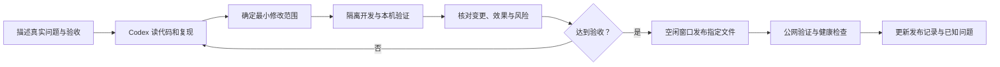

每一步都要留下证据，但不需要为简单文案改动跑整套 GPU 训练。根据变更层选择验证范围。修改模型或判断阈值时，必须保留同一批样本的前后对照。

<a id="section-c-4"></a>

### C.4 接手后可直接复制的任务模板

**本机环境重建：**

```text
请在当前项目目录检查 Python、Node、ffmpeg、CUDA、模型和注册表引用。
区分只运行前端与运行完整 GPU 推理所需条件。
参考 deploy/autodl/README.md 和依赖约束，不盲目升级 NumPy/PyTorch。
已有虚拟环境先检查，缺失时再在独立环境重建。
MiMo 保持关闭，凭据只从本地受限配置读取且不输出。
以首页可打开、API ready、短视频完成、可读报告能导出为验收。
```

**判断“模型问题还是服务问题”：**

```text
任务编号是 <job_id>，问题发生在视频 <秒数>，我期望看到 <结果>。
请依次检查上传校验、任务状态、模型逐帧输出、人物关联、动作规则、
接口响应和前端过滤，找到证据在哪一层丢失。
未找到根因前不要直接下调阈值，也不要把候选改成确认击球。
给我可回放的时间点、问题层、最小修复和回归结果。
```

**改善轨迹但保持真实：**

```text
请对固定的几段真实视频比较轨迹断裂：区分没检测到球、跟错球、
轨迹关联失败、短缺口策略以及前端显示窗口造成的消失。
保留观测/插值来源标记，不跨长缺口强连。
报告轨迹连续性、误连接、静止球误检和耗时变化，不能把覆盖率叫准确率。
先给前后对照，再决定是否发布。
```

**完善接发识别：**

```text
请使用同时包含对手发球、来球和接球者挥拍的有标注样本，
评估现有接发上下文规则。将普通对拉、单人发球和接发作为不同负/正样本。
先验证事件级 precision/recall 和类型混淆，再改模型或规则。
保留证据不足状态，不用步伐分数填充接发结果。
```

**申请发布一次已验证修改：**

```text
请部署本次已通过验证的 <功能>。
先给出文件清单、与服务器当前版本的差异和回滚位置；
检查 queued/running 任务及活动上传，确保不会中断正在处理的视频。
在暂存目录构建和验证，通过后仅重启受影响服务。
保留模型、任务、凭据和其他本地改动，MiMo 仍关闭。
上线后验证公网业务分支及健康状态，再更新 MONITORING.md。
```

**建立朋友自己的持续监控：**

```text
请为这个已选定的本地项目创建持续检查任务，每 15 分钟读取一次云端快照。
先读 deploy/autodl/MONITORING.md，再运行 check_remote.py。
仅使用受限只读监控身份，不输出凭据，不自动发布或改模型。
正常且无变化时保持安静，只报告新故障、恢复、任务验证完成、
域名变化和需要我处理的事项，并按事件去重。
本机或云端离线时如实说明不可连接，不声称已远程修复。
```

该模板需要在朋友自己的 Codex 项目中实际创建调度，并核对执行环境。复制 Markdown 本身不会创建定时任务，也不会迁移原线程的历史状态。

**新对话继续旧任务：**

```text
请先读本交接手册和最新发布记录，并检查真实工作区。
上一任务做到了 <状态>，尚未完成 <事项>；对应文件/验证记录是 <路径>。
保留已有改动，从未完成的步骤继续；不要把旧计划全部重新执行。
```

<a id="section-c-5"></a>

### C.5 如何判断 Codex 的回复是否可靠

要求它分别写“做了什么、怎么证明、哪些还没做”。以下说法需要继续追问证据：

- “已经部署”却没有发布编号、文件清单或公网检查。
- “识别更准了”却只有检测点更多、没有人工真值比较。
- “已经防刷”却只有前端按钮禁用或单进程 Map。
- “已经备份”却只有同一台机器的一份压缩包，没有恢复演练。
- “服务器正常”却只是读了三天前的 JSON。
- “模型支持接发”却仅因为目录里有“接发”选项。

可以要求 Codex 开一个独立的代码审查子任务，但最终仍要核对实际文件和验证结果。并行任务应分清文件所有权；不要让两个任务同时改同一个发布脚本或云端运行配置。

<a id="section-c-6"></a>

### C.6 长期保存给 Codex 的项目规则

本手册是人和 Codex 共同使用的背景资料，不会自动变成新的强制配置。后续可以把稳定的约束提炼进仓库 `AGENTS.md`，例如测试命令、不能伪造证据、保留用户改动、发布记录格式。官方说明支持通过 `AGENTS.md` 提供项目级工作指引；接手者应先阅读已有指引，避免创建冲突规则。[官方 AGENTS.md 说明](https://learn.chatgpt.com/docs/agent-configuration/agents-md)

建议保存的是工程事实和验收规则，不是账号密码、聊天历史或“以后无需检查就全部上线”。本文没有新建或覆盖 `AGENTS.md`。

<a id="part-architecture"></a>
<a id="section-d"></a>

## D. 系统框架与前端设计

<a id="section-d-1"></a>

### D.1 当前实际部署拓扑

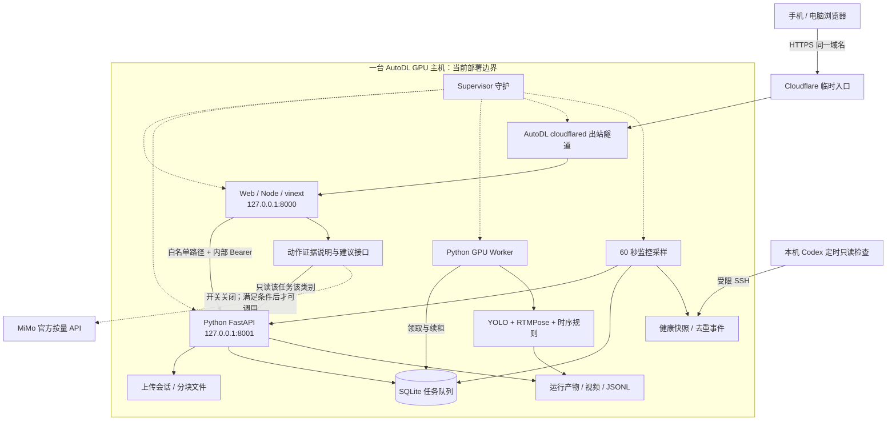

浏览器只需要一个网站地址，不直接拿内部 API key。Cloudflare 把外部 HTTPS 请求转到 AutoDL 上的网页服务；网页既返回界面，也把允许的业务请求送到 Python API。GPU Worker 是独立进程，因此网页标签页关闭不会让它停止。上图整个大框只有一台主机，任一服务器级故障仍可能同时影响全部组件。

**两个 Worker 的歧义：**`scoring-demo-web/worker/index.ts` 是 Web/Cloudflare 风格入口，在 AutoDL 上也可由 Node 生产服务器运行；真正执行 GPU 推理的是 `src/rallymate_service/worker.py`。文件夹叫 `worker` 不等于推理部署在 Cloudflare GPU 上。

<a id="section-d-2"></a>

### D.2 分层设计与职责

| 层 | 主要文件/目录 | 负责 | 不应负责 |
|---|---|---|---|
| 页面编排 | `scoring-demo-web/app/ScoreLab.tsx` | 上传状态、当前任务、选择类别、恢复、各组件组合 | 伪造后端结果、内置服务密钥 |
| 可视化组件 | `LiveResults`、`BallTrajectoryViewer`、`MotionAnalysisPanel` | 把证据按任务和时间呈现 | 将插值改成实测，将候选写成确认 |
| API 客户端 | `app/lib/api-client.ts`、`api-types.ts` | 请求路径、类型、错误解析、同源配置 | 决定收费授权或存放内部 key |
| 上传/观察流程 | `resumable-upload.ts`、`analysis-session.ts` | 分片、重试、恢复、轮询与防旧结果覆盖 | 代替服务器校验和持久化 |
| Web 业务接口 | `app/api/advice/route.ts` | 校验输入、按类别取证、生成安全说明 | 通用模型转发、修改评分 |
| 网关 | `worker/gateway.ts` | 路径/方法白名单、隔离客户端凭据、超时、Range | 任意 URL 转发或开放全部后端接口 |
| API | `src/rallymate_service/api.py` | 接收、验证、排队、查任务、返回产物 | 在上传请求内同步跑完长视频 |
| 队列/存储 | `database.py`、`uploads.py` | 任务状态、租约、幂等、上传落盘 | 已实现跨区域分布式数据库的承诺 |
| 推理 | `rallymate_vision`、`tracking`、`events`、`features` | 逐帧测量与时序证据 | 凭语言模型描述替换视觉结果 |
| 评分/解释适配 | `rallymate_scoring`、`user_demo.py` | 证据门禁、参考分、目录和用户可读输出 | 自动为不可测项目补分 |
| 运维 | `deploy/autodl` | 启停、环境、监控、部署记录 | 未审查即自动发布全部工作区 |

<a id="section-d-3"></a>

### D.3 当前技术栈

当前项目 Python 包最低声明 `>=3.10`；AutoDL 已验证环境记录为 Python 3.12.3、Ubuntu 22.04、PyTorch 2.8.0+cu128。**本机的 `C:\Python314\python.exe` 用来跑受限 SSH 监控，不代表完整视觉依赖已经支持 Python 3.14。**

前端为 TypeScript + React 19.2.6，使用 vinext 1.0.0-beta.2 / Vite 8.0.13 的 App Router 风格结构，Node 要求 `>=22.13.0`。不要因为目录形似 Next.js 就未经验证换成另一套 Next 构建部署。依赖来源是 [Python 项目定义](../pyproject.toml) 与 [前端 package.json](../scoring-demo-web/package.json)，具体安装以锁文件/约束文件为准。

仓库保留 Cloudflare/Sites 模板相关的 D1、R2、Drizzle 配置与辅助代码，但当前 AutoDL 推理任务的实际持久存储是 Python 服务的本地 SQLite 和磁盘产物。不能把“依赖中存在 Drizzle/D1”写成“所有任务已经存到云数据库”。本手册描述当前 AutoDL 部署，不自动切换托管方案。

<a id="section-d-4"></a>

### D.4 一次用户操作的端到端过程

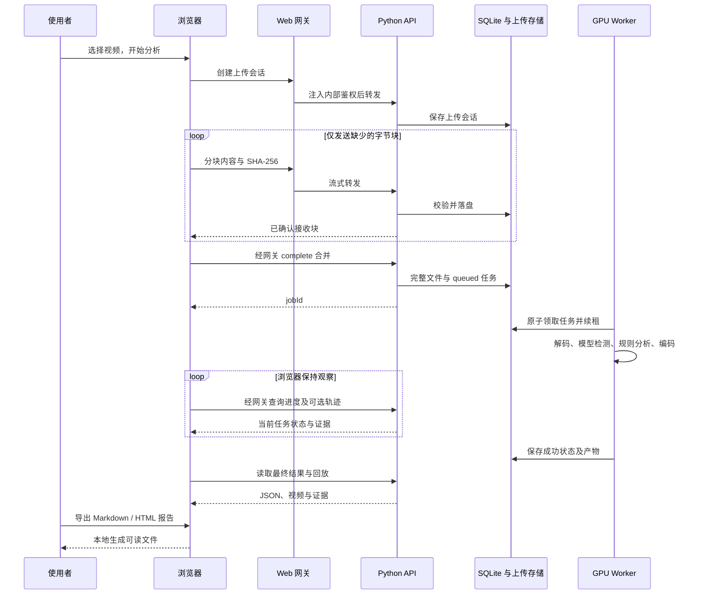

关键点：分块是“按文件字节切片”，不是把视频剪成多个片段分别推理。必须收齐并正确合并后，才把完整视频交给一个任务处理。

<a id="section-d-5"></a>

### D.5 前端状态机

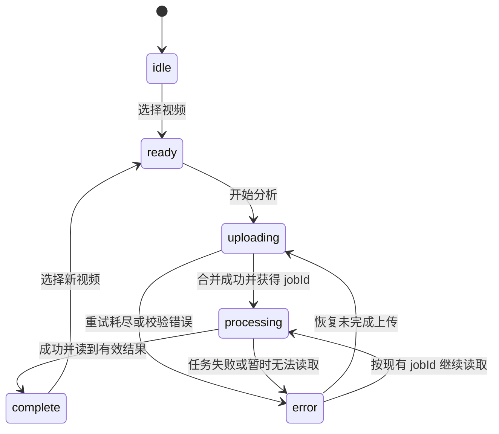

这是页面状态，不等同于数据库状态。页面显示“读取失败”时，服务器任务可能已成功；必须先按 jobId 查询，再决定是否重新提交。前端支持恢复的目的就是避免用户重复上传和重复消耗 GPU。

<a id="section-d-6"></a>

### D.6 页面组成与修改入口

1. **上传区**：文件选择、上传确认字节、速度、合并阶段、推理阶段和错误。先查 `ScoreLab.tsx` 与 `resumable-upload.ts`。
2. **证据预览**：视频、轨迹显示模式、观测/插值样式。查 `BallTrajectoryViewer.tsx` 与 `lib/trajectory-viewer.ts`。
3. **动作与挥拍面板**：类别、当前视频中的片段、二维指标与阶段定位。查 `LiveResults.tsx`、`MotionAnalysisPanel.tsx`、`lib/motion-analysis.ts`。
4. **目录和规则**：当前 24 项技术定义与历史参考指标呈现。不要把离线 Demo 的高分带到真实视频中。
5. **报告**：`ReportExportActions.tsx` 和 `lib/report-export.ts`；报告由浏览器基于已读结果生成。
6. **解释与建议**：`AdviceResult.tsx`、`advice-display.ts`、`advice-evidence.ts` 和 `/api/advice`。结果绑定 jobId + 所选类别，切换后清除错误上下文。

<a id="section-d-7"></a>

### D.7 浏览器恢复与本地存储

- `?job=<编号>` 是恢复现有任务的入口；`localStorage` 中的 `rallymate.activeJob` 保留最近任务。
- `rallymate.upload.v1.<指纹>` 保存上传会话编号；它不是文件内容备份。
- 文件指纹包含元信息与头尾片段，只用来寻找可能匹配的会话。续传时再校验服务器已收到的每一块，避免中间字节不同却被错误复用。
- 浏览器刷新通常不能自动重新拿到用户本地文件句柄。未完成的上传可能需要重新选择同一文件；服务器已有块仍可复用。
- 本地预览使用 Blob/object URL，页面结束后不能把它当成永久分享链接；长期回放使用服务器产物路径。
- 切换随机域名会改变浏览器存储的 origin，原域名下的 localStorage 不会自动出现在新域名。可以通过保存的 jobId 在新地址恢复已创建任务。
- 这些编号和存储机制用于恢复便利，不是完整的所有权认证。公开分享链接应按可访问资料对待。

<a id="section-d-8"></a>

### D.8 轮询和展示节奏

当前 `watchAnalysis()` 默认约每 2 秒查任务；运行中可选轨迹最多约每 15 秒触发一次，有处理帧计数时要求计数变化，计数缺失时仍可定时请求；可选请求有 8 秒超时且最多一个在途。完成后刷新最终轨迹，防止较慢的旧预览覆盖结果。旧 README 中的“约 5 秒”属于旧描述，本手册按当前源码记录为 15 秒。

普通状态轮询与轨迹读取分开：轨迹慢或失败不应该让整个任务被误报为失败。网络连续失败达到 30 次会停止自动观察并提示继续读取，不会取消服务器任务。最终主结果最多做 3 次读取尝试；可选覆盖层失败时尽量保留已取得的动作结果。

<a id="section-d-9"></a>

### D.9 报告设计与导入边界

当前主要导出物为 `.md` 与单文件 `.html`，HTML 可在浏览器独立打开并打印为 PDF；JSON 是高级备份格式。导出会检查任务成功状态、结果是否存在、多个 jobId 是否一致、是否仍在上传/处理，以及是否明确为离线 Demo。

报告包含来源、任务、视频元信息、可用观测、运动阶段、限制和复核提示。缺失可选证据不会凭空补造，但要在报告中披露。HTML 对导入字符串进行转义，不应把用户文本当 HTML 执行。报告不携带服务端文件系统路径、密钥或代理配置。

报告导入是“读取一个已有数据文件供页面查看”，不等于把该文件晋升为可信评分注册表，也不等于服务器重新运行了视觉模型。导入结果和原始服务器任务不一致时应保留限制，不能通过导入 JSON 绕过正式评分的证据规则。

<a id="section-d-10"></a>

### D.10 对产品界面的稳定约束

- 继续免登录；未来匿名任务权限设计不能偷换为强制账号密码流程。
- 默认不显示人体骨架，不恢复“已定位 N 段候选”的长列表。
- 可以展示球轨迹，但观测、插值和无证据缺口要区别明确。
- 未识别不等于没有动作；模型/服务不可用也不等于用户动作有错。
- 不展示没有证据的确认击球数；不能将挥拍次数、检测点数量或一般 GS 事件数代替确认触球。
- 说明“当前视频”“离线 Demo”“旧任务回放”的来源，不能把示例分数当上传结果。
- 不把纯实现细节塞满用户界面；需要排障的信息放到可展开区域、日志和报告中。

<a id="section-d-11"></a>

### D.11 数据设计：数据库、文件和缓存分别保存什么

当前推理服务只有一张核心任务表 `jobs`，并非已经存在完整的用户、权限、账单、训练集管理数据库。前端模板里的 D1/Drizzle 示例不能作为实际推理任务数据库结构来维护。以下来自 [database.py](../src/rallymate_service/database.py)。

| `jobs` 字段 | SQLite 类型及空值 | 用途与维护规则 |
|---|---|---|
| `id` | TEXT，主键 | 任务唯一标识；分块任务等于 upload_id |
| `status` | TEXT，非空，CHECK 四种状态 | 仅 queued/running/succeeded/failed |
| `original_filename` | TEXT，非空 | 服务端原始文件名，公开响应按环境脱敏 |
| `video_path` | TEXT，非空 | 已入队原视频的位置；不是视频内容本身 |
| `request_path` | TEXT，非空 | 任务参数 JSON 的位置 |
| `output_dir` | TEXT，非空 | 运行产物目录；迁移不能只改网页 URL |
| `created_at`、`updated_at` | TEXT，非空 | UTC ISO 时间；updated_at 不是实际推理进度的充分证据 |
| `started_at`、`completed_at` | TEXT，可空 | 首次开始及终态时间；started_at 使用 COALESCE，重领不会简单重置为本次开始 |
| `lease_expires_at` | TEXT，可空 | Worker 租约到期时间；不是用户上传到期时间 |
| `attempts` | INTEGER，非空，默认 0 | 认领次数，包括首次执行 |
| `worker_id` | TEXT，可空 | 当前领取者标识；目前并非防止旧 Worker 回写的完整令牌校验 |
| `progress_json` | TEXT，可空 | 进度对象序列化；API 读取时解析成 progress |
| `summary_json` | TEXT，可空 | 成功摘要；API 读取时解析成 summary |
| `error` | TEXT，可空 | 内部错误记录，公开展示应按边界脱敏 |

索引 `idx_jobs_status_created(status, created_at)` 支持按状态与创建时间找任务。当前连接启用 WAL 和 foreign_keys，连接等待 30 秒；开启外键设置不代表当前存在用户表或已经建立任务所有权外键。认领任务使用事务，具体恢复语义见运维章节。

上传会话目前在文件系统中，见 [uploads.py](../src/rallymate_service/uploads.py)，不是一张 `uploads` SQL 表。每个 manifest 保存 `upload_id/filename/size/chunk_count/options/chunks/job_id/updated_at`；`chunks` 按序号保存 SHA-256 与字节数，`updated_at` 使用 Unix 秒。不要把这种时间表示误当成 jobs 表的 ISO 时间。

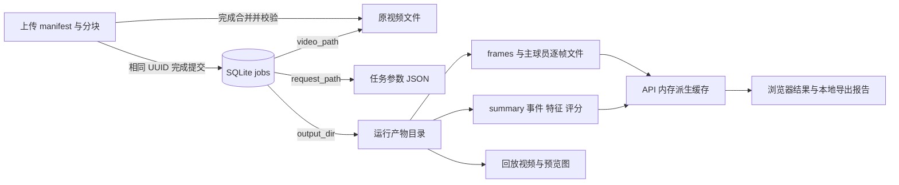

图里的文件节点不是额外数据库表。只有路径、没有文件，数据库记录就不足以恢复任务；只有视频、没有参数与模型版本，也不能保证复现同一结果。已成功任务重新读取时可能产生新版 CPU 派生结果，应同时记录原推理版本与派生版本。

**缓存和持久数据的区别：**

- 浏览器 localStorage 保存任务/上传编号，用于恢复；不是原视频或云端数据库备份。
- API 的轨迹、动作派生缓存用于减少重复计算，重启可丢失；底层 frames 与主球员文件才是重建依据。
- Web 内存建议限流也会随重启丢失，不能作为每日费用账本。
- HTML/Markdown 导出物是当时结果的静态快照，不会随着服务器模型升级自动变新。
- 模型权重可以依据受信来源和哈希重新获取；私人原视频、人工标签和未提交源码未必能重新生成，因此备份优先级更高。

后续设计匿名任务权限或持久预算时，应新增明确的会话、任务授权和预算记录及迁移流程；不能把业务归属塞进 filename，也不能默认“谁知道 jobId 谁就是所有者”。这些表当前尚未实现。

---

<a id="part-api"></a>
<a id="section-e"></a>

## E. 接口设计与数据契约


> 本章按当前源码、契约测试与历史发布记录说明接口；示例任务编号为文档占位。
>
> “源码当前如此”与“服务器此刻如此”必须分开。发布记录显示，轨迹/挥拍版于 `20260924T123453Z` 发布；建议解释与 MiMo 默认关闭版于 `20260924T130527Z` 发布。后者只重启 Web，18 个指定文件哈希核对一致。2026-09-24 的公网验收通过，不等于已在本章编写时重新证明 2026-09-27 的服务健康。最终交接时由主负责人核对新鲜监控快照、当前网址与文件哈希。依据：[发布与监控记录](../deploy/autodl/MONITORING.md)。

<a id="section-e-1"></a>

### E.1 用日常语言理解这套接口

“接口”就是网站与服务端约定的收件地址。浏览器发送一个请求，服务端按约定返回 JSON 数据或视频字节。JSON 是带字段名的数据，类似一张能由程序读取的表单。

当前有两层服务：

1. **对用户开放的网站 Web**：显示页面，提供 `/api/advice` 和 `/api/scorecard`；通过严格名单转发部分 `/v1/...`、`/health/...` 请求。
2. **内部 Python 推理 API**：接收视频、创建任务、读写上传会话、提供推理结果。它不在 HTTP 请求内一直跑完整视频，而是将任务放入 SQLite 队列，GPU Worker 之后领取执行。

浏览器不用登录网站，但这不表示内部 API 没有密钥。Web 在服务器端给获准转发的请求加入 `Authorization: Bearer <内部凭据>`。浏览器自己的 Authorization 和 Cookie 不会被直接转交给推理 API。正式部署必须保持 API 原始监听端口只供服务器内部使用。

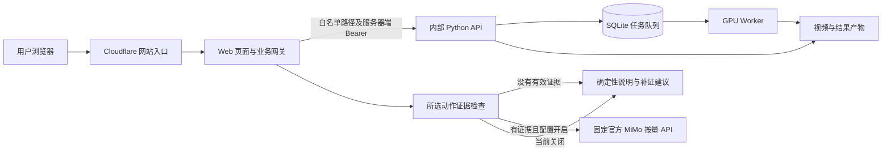

本项目**没有开放通用大模型反向代理**，没有公开的 `/v1/chat/completions`、`/anthropic/*`、任意目标 URL 转发或浏览器自选模型接口。MiMo 建议只接收有限网球业务字段。依据：[网关](../scoring-demo-web/worker/gateway.ts)、[Web 入口](../scoring-demo-web/worker/index.ts)、[建议接口](../scoring-demo-web/app/api/advice/route.ts)。

<a id="section-e-2"></a>

### E.2 请求地址、鉴权和共同约定

<a id="section-e-2-1"></a>

#### E.2.1 给接手朋友的地址规则

日常从浏览器调用相对地址，例如 `/v1/uploads`，让它走当前网站同源网关。不要将内部 IP、内部端口或内部密钥填到浏览器代码中。

`NEXT_PUBLIC_*` 和 `VITE_*` 开头的配置会被当作公开配置，绝不能存密钥。前端 API 客户端默认 `baseUrl=""`，就是同源；允许配置业务 API 地址，但需要同步考虑 CORS、TLS 和鉴权。

服务端结果偶尔可能返回完整绝对 URL。前端客户端会只取该 URL 的 `/v1/...` 路径及查询参数，再经已配置的业务网关请求，不直接跳转到返回的私网域名。非 `/v1/` 的结果绝对地址会被拒绝。依据：[前端 API 客户端](../scoring-demo-web/app/lib/api-client.ts)。

<a id="section-e-2-2"></a>

#### E.2.2 内部 API 的鉴权规则

- 配置了 `RALLYMATE_API_KEY` 时，带 `Depends(authorize)` 的接口要求 `Authorization: Bearer <服务器内部密钥>`，不匹配返回 `401`，附 `WWW-Authenticate: Bearer`。
- `/health/live` 没有鉴权依赖，只返回存活信息；API 自身 `/` 的说明文档也没有鉴权。
- 未配置密钥时，开发环境可以匿名调用；标记为 production 或配置为公共服务时，任务、产物、模型元数据等接口返回 `503`，`detail.code="authentication_not_configured"`，防止误开。
- 未配置密钥的公共环境仍允许 `/health/ready`、`/v1/meta`、`/v1/techniques` 这类引导信息，但 ready 可能报告 `not_ready`。配置了密钥后，这几个接口仍要求 Bearer，只是网站网关会自动代为加入。
- API CORS 允许方法 `GET/POST/PUT/OPTIONS`；允许请求头 `Authorization/Content-Type/X-Request-ID/X-Chunk-SHA256`；不允许凭据 Cookie 跨站模式。公开部署的 CORS 来源必须明确列出，不能用 `*`。

不要把 CORS 或 Origin 校验理解为用户身份认证。原生脚本可以没有 Origin；当前也没有“这个视频属于哪个用户”的服务端所有权体系。拥有公开任务链接的人可以通过允许的地址读取该任务的公开结果。UUID 难猜有帮助，但不是访问授权。依据：[API 的 authorize、CORS、公开脱敏逻辑](../src/rallymate_service/api.py)。

<a id="section-e-2-3"></a>

#### E.2.3 三种不同的错误外形

看到 HTTP 失败时，先分清是谁返回的：

```json
{"detail":"job not found"}
```

这是 Python/FastAPI 业务错误，通常为 `{"detail":...}`。`detail` 也可能是对象，含 `code/message`，或者框架参数校验产生的数组。

```json
{"error":"analysis_service_unavailable"}
```

这是 Web 网关或建议接口的错误，一般为 `{"error":"固定代码"}`。

```json
{"source":"evidence_fallback","providerStatus":"not_requested_insufficient_evidence","evidenceStatus":"insufficient_evidence","advice":{"summary":"当前视频尚未得到可用于评价接发的有效识别。"}}
```

这个精简示例代表**HTTP 200 的正常证据不足结果**，不是服务器崩溃，也不是动作做错。实际响应还含完整 `evidence`、`nextSteps` 等字段。不要只看到 `fallback` 就弹红色报错，更不能给证据不足补一段假评价。

<a id="section-e-2-4"></a>

#### E.2.4 Request ID 不是防重复提交凭据

API 接受 `X-Request-ID`，有效格式是首字符字母或数字，后续允许字母、数字、点、下划线、冒号和连字符，总长最多 128；无效值由服务器换为 UUID。内部 API 响应带该头，便于排查。

但当前 Web 网关**没有把上游响应的 `X-Request-ID` 列入转发名单**，所以公网浏览器不一定能读到回传值。它也不让 `POST /v1/jobs` 幂等。需要可重复提交而不创建新推理任务时，应走分块上传的 `upload_id` 机制。

<a id="section-e-3"></a>

### E.3 外部业务接口完整清单

以下“外部”指通过当前 Web 网关公开的网站，不是直接访问 Python API 端口。`{id}` 在网关必须符合 `[a-zA-Z0-9_-]{8,80}`；正常服务产生的是标准 UUID。路径白名单是精确匹配，尾部多一个 `/` 不保证等价。

<a id="section-e-3-1"></a>

#### E.3.1 发现和健康接口

**`GET /health/live`**

- 正常：`200 {"status":"ok"}`。
- 只说明 API HTTP 进程能回应，不能证明模型已加载、GPU可用、Worker在跑或队列不堵塞。

**`GET /health/ready`**

- 返回 `status: "ready" | "not_ready"`、`reasons: string[]`、`queue` 各状态数量，以及部署环境、姿态后端/预设、注册表来源信息。
- 注意：代码在检查失败时仍正常返回 JSON，**`not_ready` 也可能是 HTTP 200**。监控必须读 `status` 和 `reasons`，不能只看 200。
- 检查配置、目录/数据库、模型文件、注册表和必要校准资源；它不是一次真正的 GPU 推理验收。

**`GET /v1/meta`**

- 当前 `api_version="1.3.0"`，`compatibility_version="1.2.0"`；FastAPI OpenAPI info version 保留 1.2.0 兼容值，不是版本回退。
- 主要字段：`service/environment/public_base_url/authentication/capabilities/technique_registry/client_configuration`。
- `capabilities.resumable_uploads` 声明 `chunk_bytes=4194304`、`parallel_chunks=2`、`expires_after_hours=24`。这里的并发 2 是客户端建议/实现，不是后端硬性并发闸门。
- `client_configuration` 给出 jobs、demo-result、trajectory、technique-assessment、techniques 的地址模板。

**`GET /v1/techniques`**

- 返回正式用于识别证据组织的 24 项技术目录。
- 主要字段：`schema_version/registry_id/registry_version/registry_sha256/source_documents/semantics/default_phase_contracts/techniques`。
- 每项技术含 `id/family/name_zh/aliases/phases/core_visual_features/required_evidence/enhanced_evidence/proxy_limits`，有些含 `reference_constraints`。
- 五类 family：`baseline` 底线、`serve` 发球、`return` 接发、`net_attack` 网前、`footwork` 步伐。
- 注册表不可读返回 `503`。不要在前端自己发明第二套动作编号或阶段含义。

**`GET /api/scorecard`**

- 这个名字保留了旧历史含义，当前返回的是**练习目录**，不是给上传视频评分。
- 返回 `service/apiVersion="2.0.0"/surface="practice_catalog"/registryVersion/techniqueCount/categories/semantics/sourceDocuments/adviceEndpoint`。
- `categories[]` 内有 `id/name/techniques`；技术项含 `id/name/phases/focusPoints/observationLimits`。
- 缓存头 `Cache-Control: public, max-age=3600`，即可缓存 1 小时。

**`POST /api/scorecard`**

- 已退役：`410 {"error":"scorecard_retired","message":"原评分接口已停用，请使用练习建议接口。","adviceEndpoint":"/api/advice"}`。
- 附 `Link: </api/advice>; rel="successor-version"`。
- 不要因为 API 客户端仍有 `scorecard()` 兼容函数，就误认为这个 POST 仍提供评分。

依据：[Python 路由](../src/rallymate_service/api.py)、[练习目录接口](../scoring-demo-web/app/api/scorecard/route.ts)。

<a id="section-e-3-2"></a>

#### E.3.2 两种视频提交方式

当前网页使用**分块上传**。兼容接口 **`POST /v1/jobs`** 仍存在，但它上传整份 multipart 文件，网络失败后可能要重传，重复成功请求会创建不同任务。

`POST /v1/jobs` 请求为 `multipart/form-data`：

- `video`：必填，视频文件。
- `court_mode`：默认 `disabled`，可选 `auto/manual/disabled`。
- `manual_polygon_normalized`：可空的 **JSON 字符串**；手工模式必填，例如 `"[[0.1,0.2],[0.9,0.2],[0.9,0.9],[0.1,0.9]]"`，必须四个 `[x,y]` 点，坐标在 0..1。
- `manual_polygon_role`：默认 `court_outer_doubles_corners`，另可选 `visible_region`。
- `write_annotated_video`：默认 true，是否生成回放文件。当前回放即使叫 annotated.mp4，也不代表必须有骨架或识别点。
- `max_players`：整数，默认 2，范围 1..4。
- `start_ms`：整数毫秒，默认 0，非负。
- `end_ms`：可空，整数毫秒；提供时必须大于 start_ms。
- `max_frames`：可空；提供时必须是至少 1 的整数。

正常返回 `202` 及任务对象。202 意味着“收件与排队成功”，不意味着推理已完成。上传被接受前会检查后缀、大小、是否为空、能否解码、总视频时长，以及所需注册表。

- 支持后缀 `.mp4/.mov/.m4v/.avi/.mkv`，后缀检查不代替真实解码。
- 代码默认单文件最大 **2 GiB = 2,147,483,648 bytes**，总时长最大 **1,800 秒 = 30 分钟**；部署可以通过 `RALLYMATE_MAX_UPLOAD_BYTES`、`RALLYMATE_MAX_VIDEO_DURATION_SECONDS` 改写。本章未读取运行环境，最终值由负责人核实。
- 页面写的“建议 200 MB 以内”是文案建议；当前选文件代码没有按 200 MB 作硬拒绝。
- 413：大小或时长超限；415：不支持后缀；422：空视频、解码失败、选项错误；503：注册表或鉴权等依赖未就绪。
- 即使只分析 start/end 范围，服务仍先检查**原始整份视频的总时长**。
- 服务写入的内部请求里会固定检测、姿态参数及注册表指纹；公共上传者不能通过此业务接口指定任意模型路径、服务器路径或校准文件。

<a id="section-e-3-3"></a>

#### E.3.3 分块上传接口

**`POST /v1/uploads`**，请求 JSON，正常返回 `201`：

```json
{
  "upload_id": "11111111-1111-4111-8111-111111111111",
  "filename": "practice.mov",
  "size": 5000000,
  "options": {
    "court_mode": "disabled",
    "write_annotated_video": true,
    "max_players": 2,
    "start_ms": 0
  }
}
```

示例 UUID 是文档占位，不对应真实任务。`size` 是原文件**字节数**，不是 MB，不接受布尔值或小数。`upload_id` 由客户端产生，后端要求可以解析并原样符合规范的小写 UUID。`options` 可用字段与上节一致；其中手工多边形仍要传 JSON 字符串，不能直接传嵌套数组。选项的未知字段会 422；当前顶层额外字段没有同样的逐字段拒绝，不要把这一点当业务扩展契约。

响应字段：

```json
{
  "upload_id": "11111111-1111-4111-8111-111111111111",
  "size": 5000000,
  "chunk_size": 4194304,
  "chunk_count": 2,
  "received_chunks": [],
  "chunk_sha256": {},
  "received_bytes": 0,
  "job_id": null,
  "expires_in_seconds": 86400
}
```

`expires_in_seconds` 当前总是返回 86,400 这一策略常量，**不是倒数剩余秒数**。失效计算依据是服务端 manifest 的最后更新时间。

**`GET /v1/uploads/{upload_id}`**

- 返回同形会话状态。`received_chunks` 为已保存的从 0 开始的序号，`chunk_sha256` 的键是序号字符串，值为 SHA-256 十六进制摘要。
- 404：会话不存在或 UUID 格式不符；410：尚未入队且超过 24 小时未更新。
- 单纯读取状态不会自动刷新过期时钟。已完成的会话保留 `job_id` 墓碑信息，不按未完成会话 TTL 返回 410。

**`PUT /v1/uploads/{upload_id}/chunks/{index}`**

- 请求体是原始二进制，建议 `Content-Type: application/octet-stream`。
- 必须带 `X-Chunk-SHA256`：该分块真实 SHA-256，64 个十六进制字符。
- 普通块长度必须恰为 4,194,304 字节；最后一块恰为剩余长度。
- 返回 `200` 及更新后的会话状态。无需上传 `Content-Range`；块序号与 manifest 的原文件大小共同决定字节位置。
- 按接收流实时限制每请求最多 4 MiB；即使 Content-Length 缺失或伪造也会检查。
- 413：该块超过 4 MiB；422：哈希不符、序号越界、长度不符；409：相同序号已存在不同内容，或已完成后尝试写入新的分块。
- 同一序号、同一内容摘要再次 PUT，会直接成功返回原状态，不重复累计字节。既有块重传不会刷新 manifest 更新时间。

**`POST /v1/uploads/{upload_id}/complete`**

- 无需业务请求体。正常 `202` 返回任务对象，而不是上传会话对象。
- 服务按序读取每一块，再核对每块长度与摘要，组装临时整视频，核对总长度，探测视频、生成内部请求并入队。
- **job_id 与 upload_id 相同**。如果任务已入队但客户端没收到响应，再 complete 会读取同一个任务返回；不会再次创建 GPU 任务。即使第一次在入队后、manifest 保存前崩溃，也会优先查 SQLite 现有任务来恢复幂等性。
- 块不全：409；已落盘块损坏：清除该块已完成记录后 409，下次续传补齐；合并总长错误：422；视频/注册表等错误沿用整文件提交的状态。
- 成功后删除分片和合并临时文件，保留最终视频、任务请求、运行产物与 manifest。清理任务不等于删除原视频。

依据：[分块 API 路由](../src/rallymate_service/api.py)、[持久分块存储](../src/rallymate_service/uploads.py)、[客户端分块上传](../scoring-demo-web/app/lib/resumable-upload.ts)、[上传测试](../tests/test_resumable_uploads.py)、[前端上传测试](../scoring-demo-web/tests/resumable-upload.test.mjs)。

<a id="section-e-4"></a>

### E.4 上传、断线、合并与推理的真实顺序

**分块是按字节切开的运输包，不是将视频切成独立短片分别推理。** 当前流程只有合并后的完整视频进入一次异步视频任务；前后帧时序连续性依然由原视频保持。

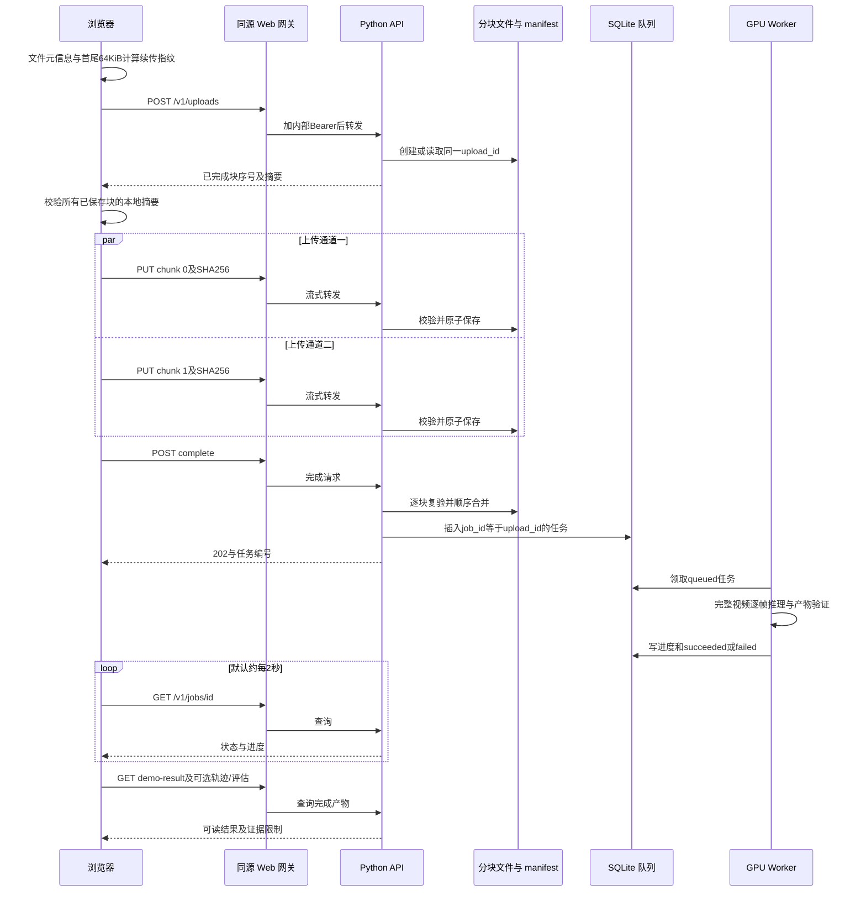

<a id="section-e-4-1"></a>

#### E.4.1 浏览器如何知道能续传

客户端根据 `filename + size + analysisOptions`、文件头 65,536 字节和尾 65,536 字节算 SHA-256，组成 LocalStorage 键 `rallymate.upload.v1.<摘要>`，其值是 upload_id。

这个小指纹只用来找“可能是同一文件的会话”，不是全文件相等证明。因此恢复后，会对**每个服务端已保存块**重新计算本地摘要并对比；任何块不一致就换新 UUID 建立新会话。不能仅因文件名、大小和首尾相同，就复用中间内容不同的旧文件。

不支持 LocalStorage 的隐私模式仍可本页重试，但关页后不保证能找到原会话。清理浏览器存储或换设备后，新网页没有旧 upload_id；服务器并没有匿名“按文件名找回上传”的接口。

<a id="section-e-4-2"></a>

#### E.4.2 前端上传重试的具体参数

- 同时运行两个块上传 worker；服务端每会话用跨进程文件锁保护 manifest，支持块乱序到达。
- 单次 create/PUT/complete 客户端超时：90 秒；网关写请求超时：100 秒。
- 可重试状态：408、425、429、500、502、503、504，或没有业务 HTTP 状态的网络错误。
- 每次逻辑请求最多 5 次发送，即首发加 4 次重试。等待约为 0.7、1.4、2.8、5.6 秒；代码设 8 秒上限，但当前四次退避不到该上限。
- 409、410 等不会被通用重试无限吞掉：创建会话遇 404/410 时允许换新 UUID；块内容冲突等需要明确处置。
- 一条上传通道失败时会等另一条也结束，再把错误交给页面，防止用户重试与旧上传通道重叠。
- 进度按已确认保存块字节数计算，变化通常以一块为单位，不是 TCP 每字节上报。显示速度是本次新增确认字节/本次耗时，续传开始前已经保存的字节不算作刚刚传完的速度。
- 上传 100% 后还要合并、文件校验、探测并入队；“正在合并”与“正在 GPU 推理”不是同一阶段。
- 当前重试实现没有按 `Retry-After` 数值等待；例如上传会话容量满的 429，可能很快耗尽短期重试次数。遇这种情况应让用户稍后继续，而不是刷新反复新建会话。

<a id="section-e-4-3"></a>

#### E.4.3 上传存储边界

- 最多 64 个活跃未完成上传会话，作用域是该 UploadStore 目录，不是每用户 64 个。
- 创建新会话前预留空间校验约为：空闲空间不得小于 `3 × (新文件字节数 + 活跃会话预留总字节数) + 512 MiB`。这是保守容量检查，不是操作系统真正锁定了磁盘空间；其他进程仍可能耗盘。
- 分块 PUT 写临时文件、flush/fsync，再 rename；manifest 同样原子替换。清理与 complete 使用锁。
- 24 小时 TTL 仅针对未完成会话；保存新块等更新会刷新时间，纯读与已有相同块重传不刷新。
- 定期监控清理以及新建会话时的清理会移除过期分块/临时合并文件，保留墓碑。未完成会话失败不会自动删除最终已创建的推理任务。
- 这不是上传防刷全方案：没有每用户持久额度、验证码、全局每日上传额度或已完成任务总数上限；整文件 `/v1/jobs` 不走 64 会话预留检查。不要把客户端“两并发”称为服务器并发限制。

<a id="section-e-5"></a>

### E.5 任务查询、状态机和继续读取

**`GET /v1/jobs/{job_id}`** 正常 `200`；不存在为 404。字段包括：

- `id/status/original_filename/created_at/updated_at/started_at/completed_at/attempts/error/summary/progress`。
- `progress` 当前是对象，常见 `phase/percent/processed_frames/total_frames/message`；前端为了兼容也容纳旧的数值形式。
- 成功后有 `scoring_state/artifact_urls/demo_result_url/trajectory_url/technique_assessment_url`。
- 未成功时 `artifact_urls={}`、完整结果地址为空；运行中可以提前给 `trajectory_url`。
- 在公开/production 模式，文件名改为类似 `video-任务前8位.mov`，摘要中的私有路径等信息被脱敏。开发模式不保证做同样处理。

示例，字段仅示意，不是当前运行状态：

```json
{
  "id": "11111111-1111-4111-8111-111111111111",
  "status": "running",
  "attempts": 1,
  "progress": {
    "phase": "inference",
    "percent": 25,
    "processed_frames": 250,
    "total_frames": 1000,
    "message": "正在处理视频"
  },
  "error": null,
  "artifact_urls": {},
  "demo_result_url": null,
  "trajectory_url": "/v1/jobs/11111111-1111-4111-8111-111111111111/trajectory",
  "technique_assessment_url": null
}
```

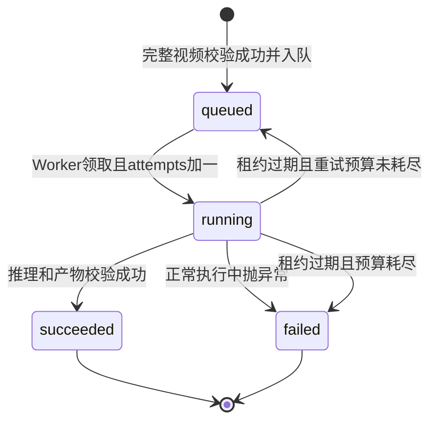

数据库真正的状态只有 `queued/running/succeeded/failed`。前端类型还兼容 `processing/completed/cancelled`，但**不能由此推断后端已有取消任务接口**。当前没有对外 DELETE、cancel 或任意重新入队接口。

Worker 默认空队列每 2 秒看一次；租约代码默认 3,600 秒，最多尝试 2 次，可通过配置覆盖。进度回调续租。这里的自动重试主要是**失联 Worker 的租约过期恢复**：执行中正常捕获到异常会直接标记 failed，不会因为配置 max_attempts=2 就自动重跑所有失败任务。

前端默认约每 2 秒轮询一次。它不再因“已轮询 180 次”而终止长任务。网络错误、408、429、5xx 会按 2/4/8/15 秒退避，最多连续失败 30 次；达到后只停止观察并提示“继续读取结果”，云端任务不会因此取消。

运行中轨迹是可选预览：最多约每 15 秒一次，同时最多一个预览请求；要求处理帧数有变化（缺少帧数字段时按时间触发），使用 `sample_limit=128/prediction_horizon_ms=0`，8 秒预览超时。预览失败不使任务失败。

成功后的主 `demo-result` 最多读 3 次；轨迹与技术评估并行读取，属于可选增强证据，超时 8 秒。主结果必须 job_id 匹配且 status 为 ready；可选轨迹/评估失败只提示部分证据不可用，不应用离线 Demo 的假分数顶替真实任务。

依据：[队列数据库](../src/rallymate_service/database.py)、[Worker](../src/rallymate_service/worker.py)、[前端观察流程](../scoring-demo-web/app/lib/analysis-session.ts)、[状态兼容类型](../scoring-demo-web/app/lib/api-types.ts)。

<a id="section-e-6"></a>

### E.6 完成结果、轨迹、挥拍和技术评估的含义

<a id="section-e-6-1"></a>

#### E.6.1 `GET /v1/jobs/{job_id}/demo-result`

只对 succeeded 任务开放；404 表示任务不存在，409 表示还未成功或注册表指纹冲突，500 表示结果构建失败等。**成功任务没有识别到动作仍可以返回 ready 结果**，其中对应字段为空或不可评价；这不应该变成强制重传或随机得分。

主要返回：

- `schema_version="1.2.0"`、`result_version="rallymate-user-demo-result-v1.2.0"`、`result_kind="real_video_training_feedback_preview"`、`job_id/status="ready"/headline_zh`。
- `training_evaluation`：Beta 练习评价；不要称作正式教练分。
- `technique_assessment`：24 项技术证据评估，含每类别识别状态。
- `actions`：观测到的动作事件与片段，`detected_segments` 是片段数，不是确认击球数。
- `action_recognition`：动作候选和新增二维运动分析。
- `hit_statistics`：当前真实确认触球计数不可用；代码让 `total_count/shot_count/contact_count` 返回 null。即使出现 GS 类动作事件，也不自动提升为真实球拍触球。
- `trajectory_analysis`：说明是否有可用 frames 产物及独立 trajectory 地址需求。
- `final_demo_score`：动作轮廓/幅度信息成型参考；不是教练分或准确率。
- `analysis_quality` 与兼容别名 `display_score`：分析完整程度，不是运动员水平。
- `formal_scoring` 当前 `available=false`、score/grade 为 null、`status="calibration_required"`。
- `model/runtime/safety`：模型来源、运行后端、视频产物兼容性和限制声明。
- `artifact_urls/trajectory_url/technique_assessment_url`：进一步读取地址。

代码中的名字 `demo-result` 是历史接口名称，`result_kind` 明确区分真实视频结果；不能仅因路径有 demo 就认定为模拟，也不能把网页离线 Demo 的数据混进真实任务。依据：[用户结果构建器](../src/rallymate_service/user_demo.py)。

<a id="section-e-6-2"></a>

#### E.6.2 `GET /v1/jobs/{job_id}/trajectory`

查询参数：

- `sample_limit`：整数，默认 240，范围 1..1000；这是选定轨迹的返回点数采样参数，不代表只读这么多源视频帧。重建多片段还有独立总点数预算。
- `prediction_horizon_ms`：整数毫秒，默认 400，范围 0..5000；0 表示不要求未来短时外推。当前前端实际传 0。

可在 running 或 succeeded 时读取。任务没开始/失败时 409；frames 尚未产生时 409 且 `detail.code="trajectory_requires_frames_artifact"`；坏帧产物 422 且 `detail.code="trajectory_artifact_invalid"`；任务不存在 404；越界参数 422。

主要结构：`schema_version/result_kind/job_id/status/source/ball/racket/limitations`。

- `source` 给出宽高、帧数、时间基准 `source_video_timestamp_ms`、是否部分读取；不返回 worker 绝对路径。
- `ball.observed` 是观测点；`ball.predicted` 是可选短时常速度外推；`prediction_status/reason` 必须一起解释。
- `ball.reconstruction.segments[]` 是多个连续球路片段；每段有 `segment_id/track_ids/start_ms/end_ms/observed_count/interpolated_count/points/analysis/interpolation_intervals/sampling`。
- 点的 `timestamp_ms` 是源视频毫秒；归一化 x/y 在 0..1。`source="observed"` 与 `source="interpolated"` 不能混淆。
- 短缺口最多 600 ms 的补全是有两端运动证据支持的显示插值，不增加实际观测覆盖率；长缺口、镜头切换或歧义仍会分段，不能为“完整”画假线。
- reconstruction 的 `coverage_fraction/observed_frame_count` 和置信度描述可观测性；不是准确率、precision、recall 或教练评级。
- `racket` 当前主要是 bbox 可观测性，没有专用拍面关键点；关联与预测字段明确限制，不得据此确认握拍或触球。
- API 对每个进程缓存至多 6 份轨迹预览，键包含帧文件时间/大小、任务状态和查询参数；文件更新或转成功后会失效。响应 `Cache-Control: no-store`。

依据：[轨迹 API](../src/rallymate_service/api.py)、[轨迹重建](../src/rallymate_vision/trajectory.py)、[轨迹 schema](../contracts/trajectory-preview.schema.json)。

<a id="section-e-6-3"></a>

#### E.6.3 `GET /v1/jobs/{job_id}/technique-assessment`

只接受 succeeded。正常返回：`assessment_version/registry_version/registry_snapshot/job_id/overall_evidence_score_0_to_100/formal_score_available/formal_score_message_zh/coverage/coverage_detail/coverage_source/family_summary/techniques/action_recognition/policy/safety/catalog_url/trajectory_url`。

`techniques[]` 的关键字段：

- `technique_id/family/family_name_zh/name_zh`：动作身份。
- `observed`、`status`、`recognition_status`：是否有该项动作证据。`observed=false` 不是零分。
- `evidence_score_0_to_100`：证据就绪度；`score_0_to_100/formal_grade` 不能与前者替换。
- `phase_statuses`：阶段状态；`measured`、`proxy`、`unavailable` 含义不同。只有明确绑定同一技术的阶段记录才应当作 measured；仅事件存在不能证明所有阶段完整。
- `evidence.required_coverage/enhanced_coverage/contact_status/event_codes` 与 `key_field_analysis`：缺哪些证据。
- `limitations_zh/semantics`：必须保留的解释。

`family_summary` 中的 `observed_count` 是识别的技术种类数，不是球员做了多少次。它还可能有 `candidate_count/motion_episode_count/recognition_status/recognition_reason_zh`。已能展示 motion_analyzed 不意味着 observed_count 可以伪造增加。

错误：404 无任务；409 未成功或固定注册表快照不匹配；422 指标记录无效；503 注册表/评估构建不可用。

旧任务读取时，若保存的动作检测/二维分析版本落后，API 会从原始 `frames.jsonl + primary-player.jsonl` 派生新版动作分析并作最多 12 项内存缓存。这是读取时的 CPU 派生，不是重新跑整段 GPU；也不意味着原有 summary.json 文件已被写回新版。原始姿态产物缺失时应如实呈现不可用。

依据：[技术评估](../src/rallymate_scoring/technique_assessment.py)、[动作识别](../src/rallymate_scoring/stroke_candidates.py)、[二维运动分析](../src/rallymate_scoring/stroke_analysis.py)。

<a id="section-e-6-4"></a>

#### E.6.4 二维挥拍分析字段，接手时不能改坏的语义

`action_recognition.motion_analysis` 包含 `schema_version/analysis_version/method/status/contact_confirmed=false/families/limitations_zh`。family 分为 baseline、serve、return；每类有 `status/reason_zh/episodes/summary`。

每个 episode：

- `episode_id/family/person_track_id/start_ms/peak_ms/end_ms`。
- `classification.label/label_zh/status/reason_zh`，status 是 `rule_inferred` 或 `unclassified`；不是训练集验证后的准确率承诺。
- `analysis_status="complete"|"partial"` 是**本次运动阶段证据**完整性，不是整项技术完成得正确。
- `phase_timing_status="estimated_from_2d_motion"`；运动峰值不是触球时间。
- `phases[]`：准备、加速、随挥，含时间及 measured/unavailable；不可用阶段时间可以是 null。
- `metrics`：`peak_wrist_speed_torso_per_s` 单位为躯干长度/秒，`wrist_path_torso` 为躯干长度；`elbow_extension_deg` 是二维肘角变化幅度，`shoulder_line_change_deg` 是画面内肩线变化。都不是实际球速或三维身体旋转。
- `evidence/limitations_zh/metric_notes_zh` 说明来源与空值原因。

接发必须有可连续关联的对手发球、来球轨迹和主球员挥拍上下文。没有这些时，返回“证据不足”是诚实结果，不应仅凭一次挥拍或高步伐分硬填“接发已识别”。

<a id="section-e-7"></a>

### E.7 视频 Range、产物下载和报告导出

<a id="section-e-7-1"></a>

#### E.7.1 公网可以下载哪些产物

外部允许：

- `GET /v1/jobs/{id}/artifacts/summary.json`
- `GET /v1/jobs/{id}/artifacts/frames.jsonl`
- `GET /v1/jobs/{id}/artifacts/indicator-features.jsonl`
- `GET /v1/jobs/{id}/artifacts/annotated.mp4`
- `GET /v1/jobs/{id}/artifacts/preview.jpg`

任务须 succeeded。不存在文件/不在列表/不存在任务为404；尚未成功为409。视频使用 inline Content-Disposition；这些 JSON/JSONL/JPG 以 attachment 形式返回。URL 中 `{artifact_name}` 不是任意文件路径，不能用于访问服务器文件系统。

Python API 还有更大的内部产物白名单，但**返回 artifact_urls 并不保证里面每个地址都能过公网网关**。例如内部 HTML 报告 URL 可能出现在结果里，当前 Web 白名单仍不允许。

<a id="section-e-7-2"></a>

#### E.7.2 播放拖动如何工作

视频 `<video>` 会发带 `Range: bytes=...` 的 GET，例如只请求某段字节。网关会转发 `Range` 与 `If-Range`，并保留上游的 `Content-Type/Content-Length/Content-Range/Accept-Ranges/Content-Disposition/Retry-After`。Python 使用 Starlette `FileResponse` 提供文件传输；合法范围通常返回 206。

当前网关只允许 GET，**没有 HEAD 业务通道**；播放器能播不等于任意下载工具的 HEAD 探测都能用。网关也没有转发 `ETag/Last-Modified`，不能把它当完整缓存验证代理。返回统一 `Cache-Control: private, no-store`，不应要求 CDN 长期缓存私人分析视频。

Range 边界错误、multipart range 的细节由安装版本的 Starlette 处理；本仓库网关测试覆盖了 206 和 Content-Range 保留，没有在本章重新跑完整公网所有 Range 异常矩阵。如修改依赖，需重新验证 Safari/iPhone 播放和拖动，不能只验证文件可下载。

<a id="section-e-7-3"></a>

#### E.7.3 MD/HTML/JSON 报告不是一个新的服务器生成接口

当前可读报告在**浏览器内**根据已经拿到的结果生成 Blob 下载，不另调用 `/report` 服务，不需要 MiMo，也不上传报告到第三方。

- Markdown：`.md`，`text/markdown;charset=utf-8`。
- 独立 HTML：`.html`，`text/html;charset=utf-8`；内嵌样式、无远程脚本/视频/网络依赖，可浏览器打印成 PDF。
- 高级 JSON 备份：`.json`，`application/json;charset=utf-8`，保留经过筛选的分析数据。
- 当前没有 Word `.docx` 导出按钮；不能告诉朋友已经有 Word 生成服务。
- 文件名类似 `rallymate-analysis-<jobId>.md` 或 `rallymate-demo-imported.html`。

导出门禁：上传中、处理中、live-pending、任务失败、结果没读到、任务编号不一致时禁用。已完成但没有有效识别也可导出清楚的证据不足报告，不能因为“没认出来”就输出伪造 pending 完整报告。

独立报告内容包括任务、视频尺寸和耗时、动作片段、技术证据覆盖、底线/发球/接发二维分析、轨迹可观测性、限制等。可读报告 schema 为 `rallymate-readable-report/1`；真实 JSON 备份 schema 为 `rallymate-practice-report/1`。JSON 备份会筛掉 path/url/token/secret/password/authorization/cookie/api-key 等敏感字段，文本也做转义与脱敏。

本地导入 JSON 最大 5 MiB。导入支持本站备份、Stage 1 摘要及模型技术评估等受支持结构；导入文件不等于创建了新的云端任务。建议服务只认它能够从受信任后端重读的 jobId，不把浏览器上传的一份 JSON 直接当已验证动作事实。

依据：[报告按钮](../scoring-demo-web/app/ReportExportActions.tsx)、[报告生成与门禁](../scoring-demo-web/app/lib/report-export.ts)、[导入处理](../scoring-demo-web/app/ScoreLab.tsx)、[Range 网关测试](../scoring-demo-web/tests/analysis-session.test.mjs)。

<a id="section-e-8"></a>

### E.8 `/api/advice` 建议与证据说明契约

<a id="section-e-8-1"></a>

#### E.8.1 请求字段

**`GET /api/advice`** 返回 `200 {"service":"practice-advice","status":"ok"}`。它只说明路由存在，不证明 MiMo 配置有效，不发付费调用。

**`POST /api/advice`** 必须 `Content-Type: application/json`，只接受下面四个必填字段和一个可选字段，未知字段直接拒绝：

```json
{
  "technique": "接发",
  "skillLevel": "业余进阶",
  "sessionGoal": "稳定性",
  "observations": "这段视频是否有足够的接发证据？需要补充什么？",
  "jobId": "11111111-1111-4111-8111-111111111111"
}
```

- technique：`底线击球/发球/接发/网前进攻/步伐`。
- skillLevel：`刚开始练/业余进阶/有固定训练`。
- sessionGoal：`稳定性/节奏感/移动更快/找到击球点`。
- observations：字符串，去首尾空白后最多 600 个 JavaScript 字符单元；可空字符串，但字段不能省略。部分控制字符、提示注入、疑似密钥、邮箱/手机号等被拒绝。
- jobId：可不传；一旦传就必须是非空字符串，格式 `[A-Za-z0-9_-]{8,128}`。注意它比普通网关的 80 字符上限宽，但正常任务都是 UUID。
- 不接受 messages、system prompt、model、base URL、temperature、工具列表或上传的“自定义证据”。因此它不是通用聊天兼容 API。

<a id="section-e-8-2"></a>

#### E.8.2 返回字段

正常业务分支一般 HTTP 200，含：

- `advice`：`summary/strengths/nextSteps/drills/safetyNotes/confidence`。confidence 当前最多 low/medium，不能解释为动作识别概率。新的确定性说明分支通常 drills 与 strengths 为空。
- `source`：`evidence_fallback`、`fallback`、`mimo`、`safety_fallback`。
- `providerStatus`：说明是否调用语言模型及原因。
- `evidenceStatus`：下面五态之一。
- `evidence`：`status/technique/family/reasonCode/explanation/availableFacts/limitations/nextSteps/observedPhases/missingPhases/partialMotion`。
- `contextStatus`：none/unavailable/verified，表示是否读到了可用受信任任务上下文；verified 不保证所选动作已被有效识别。
- `providerConfigured`：仅代表服务器存在非空密钥字符串，不代表已启用、密钥有效、余额足够或符合计费配置。
- 安全兜底 `safety_fallback` 会在读取后端证据之前返回，可能没有 evidence/contextStatus/providerConfigured；前端必须支持这些字段可缺省。

五种 evidenceStatus 的处理：

1. **no_video**：没有 jobId；明确无法评价本次动作，要求先关联完成的视频。用户自述不能当视频证据；不调用 MiMo。
2. **analysis_unavailable**：任务结果读不到、任务不匹配、未就绪或必要产物缺失；说明是当前无法取得分析，不诊断为镜头差或动作差；不调用 MiMo。
3. **insufficient_evidence**：任务完成但所选类别无可评价结果；明确“未识别不代表没有动作，也不代表动作有问题”；其他类别高分不能补足；不调用 MiMo。
4. **motion_only**：只有符合身份、时段与测量条件的二维运动片段；可说明观察到的运动，不能断言真实触球、完整技术质量或失误原因。若任一片段缺阶段，则 partialMotion=true；不能把几个不完整片段合成“一个完整动作”。
5. **observed**：有同一类别、状态 ready/partial 且 observed=true 的专项事件记录。仍不自动等于触球确认、动作正确或技术评分。阶段只采信明确同项的 measured+explicit_phase_record。

<a id="section-e-8-3"></a>

#### E.8.3 服务端如何避免泛泛编造

建议路由自己从 `RALLYMATE_API_ORIGIN` 读取对应 job 的 `demo-result`；最长等 6 秒、正文最多 512,000 bytes，不跟随重定向。它只选择用户请求 family 的证据，不拿整个视频步伐高分当发球/底线结果；也不把全局 training priorities 跨类别塞给模型。

只有 motion_only 或 observed 且存在事实时，才会继续检查 MiMo 配置。模型如果启用，也只能返回：

```json
{"evidenceFactIds":["fact_0"],"nextStepIds":["replay"]}
```

这些编号必须来自服务端给定名单。服务端再组成显示文字；模型不能自行写“你的随挥不够”“已经触球两次”等自由结论。motion_only 只允许回看或补证提示；不会凭未确认动作开出纠正性练习。

当前已部署版本明确关闭 MiMo：`providerStatus="disabled"`。有视频证据时仍可显示确定性说明，但要明示“未生成个性化建议”。配置缺失/错误和模型暂时故障也分别说明，不应伪装为个性化分析成功。

<a id="section-e-8-4"></a>

#### E.8.4 providerStatus 与错误码

常见正常响应中的 providerStatus：

- `not_requested_insufficient_evidence`：证据不足，没有调用模型。
- `not_requested_safety`：问题包含疼痛/胸闷/眩晕等身体异常，返回暂停训练安全提示，不读取或评价动作。
- `disabled`：未显式开启。
- `not_configured`：开启条件下缺少凭据。
- `billing_configuration_required`：订阅 Token Plan 域名或 tp-/ttp- 类型凭据被挡住。
- `invalid_configuration`：非固定官方地址、提供商不符、模型名/凭据格式等无效。
- `ready`：模型返回符合编号约束。
- `provider_http_<状态码>`、`provider_unavailable`、`response_limit`、`empty_output`、`invalid_output`：上游异常或输出不合约，前端收到服务端明确兜底，不展示原始上游错误正文。

HTTP 层错误：

- 415 `content_type_must_be_json`。
- 403 `origin_not_allowed` 或 `cross_site_request_denied`。
- 400 `invalid_practice_input`。
- 413 `request_too_large`。读取请求体超过 10 秒也会走此类受限读取失败结果，不能仅凭此码断言用户确实发了超大内容。
- 429 `rate_limit_exceeded`，Retry-After=600 秒；或 `service_busy`，并发满时 Retry-After=10 秒，来源桶容量满时未必带 Retry-After。

依据：[建议路由](../scoring-demo-web/app/api/advice/route.ts)、[证据门禁](../scoring-demo-web/app/lib/advice-evidence.ts)、[前端状态说明](../scoring-demo-web/app/lib/advice-display.ts)、[显示组件](../scoring-demo-web/app/AdviceResult.tsx)。

<a id="section-e-9"></a>

### E.9 限流、超时与可绕过边界：必须如实交接

<a id="section-e-9-1"></a>

#### E.9.1 建议接口已实现的限制

- 每个来源在 10 分钟窗口最多 5 次 POST。来源键是 `cf-connecting-ip` 请求头，没有该头则所有请求共用 `anonymous`。
- 窗口从该来源第一次计入请求时开始，是固定窗口，不是每次滚动向前数 10 分钟。
- 最多保留 2,000 个尚未过期的来源桶；新来源超出时 429。
- 每个 Web 进程/运行实例最多 2 个正在处理的建议 POST，请求处理全程占槽，不只占 MiMo 网络调用时间。
- 请求体最大 8,000 **字节**；问题最大 600 JavaScript 字符单元；读取体最长 10 秒。
- 有效输入检查之前已经消耗来源次数，所以坏 JSON、超长正文、安全兜底、无视频、模型关闭等请求通常也计入 5 次；Content-Type/Origin 初始拒绝则发生在计数之前。
- MiMo 上游超时 25 秒，响应正文最多 64,000 bytes，单次输出上限 500 tokens。没有代码层自动重试付费请求。

这些计数在**内存 Map/变量**里，重启会清空，多进程之间不共享。它们不是持久账户预算，也不证明每日最大金额。若直接暴露 Web 原始端口，不能信任客户端自己填的 `cf-connecting-ip`；应只接受可信入口注入的真实来源头。Origin 缺失允许通过且非浏览器可伪造，不能当反刷身份校验。

<a id="section-e-9-2"></a>

#### E.9.2 推理和上传没有同等级的请求频率限制

公网网关没有独立按来源 API 请求计数。后端分块会话的 64 活跃数量、文件大小与磁盘检查是容量保护，不等于每来源5次/10分钟。GET 任务/原始帧文件没有此建议接口限额；知道任务 UUID 的人可以取允许的产物。普通 POST /v1/jobs 不经过分块容量闸门。

网关 GET 上游超时 30 秒，POST/PUT 100 秒；浏览器常规 GET 更早在 20 秒超时。各层超时不是严格可相加的 SLA，也不意味着超时会取消服务器中已经入队的任务。

<a id="section-e-9-3"></a>

#### E.9.3 已实现、已关闭和仅规划

已实现并在 2026-09-24 发布记录中验收：固定业务白名单、服务器端密钥、MiMo 默认关闭、官方按量接口地址白名单、拒绝订阅型配置、输入与输出约束、所选类别证据隔离、前端建议绑定任务+类别以避免旧响应串页。

配置入口只支持官方按量 URL：OpenAI 兼容 `/v1/chat/completions`，或 Anthropic 兼容 `/anthropic/v1/messages`，由服务端常量构造；浏览器不能指定。`MIMO_ADVICE_ENABLED` 不为 `1` 就不调用。当前默认模型名是 `mimo-v2.5-pro`，模型字符串来自服务端环境，不是用户输入。

**仍仅规划，不要说已完成**：匿名会话 Cookie、任务归属数据库、绑定会话/jobId 的短期签名权限、nonce 防重放、持久配额账本、按任务和全局每日预算、费用预留和结算、权限后的缓存、Turnstile、固定域名/边缘限流的完整部署。

没有这些后续能力时，不能只填一个按量密钥再开公网付费。所有者之前同意部署“默认关闭的基础防护”，不等于授权任何后续金额预算。完整规划与启用前提见 [MiMo 反代规划](../deploy/autodl/MIMO_PROXY_PLAN.md)，配置解析见 [mimo-config.ts](../scoring-demo-web/app/lib/mimo-config.ts)。

<a id="section-e-10"></a>

### E.10 只供内部 API 使用的接口与产物

当前 Web 网关不会转发以下能力：

- `GET /v1/jobs?limit=20`：内部任务列表；limit 1..100、默认20，返回 `items/count`。不能给公开网站加一个“所有用户任务”页面再直接透出。
- `GET /v1/model-capabilities`：内部模型/评分可行性元数据；包括注册表来源指纹、指标 IDs、可行性与校准配置状态。内部依赖失败可返回500/结构化 code，不在公网网关名单。
- API 自身根路径 `/`：只提供服务说明；公开根路径是 Web 页面，不是这份 JSON。
- FastAPI 默认 `/docs`、`/redoc`、`/openapi.json` 文档路径并未通过业务网关开放；不要为了调试把整个 API 端口直接公开。它们与业务路由鉴权依赖也不是同一套自动保护。
- 内部 artifact 额外白名单：`scoring-readiness.json`、`analysis-report.html`、`primary-player.jsonl`、`primary-player-summary.json`、`events.jsonl`、`features.jsonl`、`scores.jsonl`、`event-feature-errors.json`、`scoring-loop-summary.json`、`scoring-loop-report.html`、`calculation-readiness.json`、`indicator-measurement-portfolio.json`、`scoring-cycle-measurement.json`。
- 内部 `analysis-report.html/scoring-loop-report.html` 可 inline 打开，但与公开前端生成的独立 HTML 报告不是同一路径、同一权限。

Cloudflare/Vinext 还可能有框架静态资源和 `/_vinext/image` 图像优化入口，不属于网球推理业务 API。仓库 `examples/d1/.../api/notes` 是示例目录，不是当前正式应用 `app/api` 的业务路由，不能写进产品现有能力。

<a id="section-e-11"></a>

### E.11 给非程序员和 Codex 的故障排查口径

1. **上传卡住**：先看是在 uploading、merging 还是 processing。记录 upload_id/job_id、时间与错误码，不记录密钥。429 可能是上传会话满，也可能是建议提问限流，两者不要混为一谈。
2. **浏览器 Load failed**：它通常不是模型准确率问题。先看网关502、客户端20/90秒超时、隧道/服务连接和断点续传状态。网络断线后有 job_id 就先继续读取，不要立即再上传一遍。
3. **HTTP 200 但没有识别**：检查 `evidenceStatus`、family_summary、motion_analysis、limitations。ready 表示结果可读取，不保证每个类别有结果。
4. **发球有运动，接发没结果**：查看是否真的有对手发球—来球—接球者挥拍上下文；先显示缺证说明，不能用发球片段或步伐分“补全接发”。
5. **击球次数为 null**：这是当前触球能力边界，不该改成0或候选段数。0表示确认没有，null表示尚不可确认，两者不能混用。
6. **视频能下载不能拖动**：检查Range请求、206/Content-Range、编码兼容性、网关转发名单。不要直接关TLS校验或换未知视频反代。
7. **报告无法导出**：先确认成功状态、结果读取、jobId一致性与门禁，别移除门禁来导出空报告。
8. **智能建议没生成**：先看providerStatus。disabled是有意关闭；它不意味着推理API/GPU坏了，也不意味着视频动作差。

交给 Codex 的建议提问方式：

> 请先只读 `docs/RallyMate项目完整交接手册_零基础Codex接手版.md`、`deploy/autodl/MONITORING.md` 和本章链接的实现，说明这次错误发生在浏览器、业务网关、内部API、任务队列、Worker还是结果解释层。保留任务编号，不打印环境文件与凭据。先复现并增加最小必要的契约回归验证，区分证据不足与服务故障，禁止把候选/插值/二维峰值当确认触球；只有审查过的指定改动通过本地验证后，才按授权窗口选择性部署。

<a id="section-e-12"></a>

### E.12 源码核验与待负责人确认项

本章重点依据：

- [业务网关](../scoring-demo-web/worker/gateway.ts)、[前端 API 类型](../scoring-demo-web/app/lib/api-types.ts)、[客户端](../scoring-demo-web/app/lib/api-client.ts)。
- [Python 路由](../src/rallymate_service/api.py)、[配置默认值](../src/rallymate_service/config.py)、[上传存储](../src/rallymate_service/uploads.py)、[任务数据库](../src/rallymate_service/database.py)。
- [上传与轮询实现](../scoring-demo-web/app/lib/resumable-upload.ts)、[结果观察流程](../scoring-demo-web/app/lib/analysis-session.ts)。
- [建议 API](../scoring-demo-web/app/api/advice/route.ts)、[证据门禁](../scoring-demo-web/app/lib/advice-evidence.ts)、[模型配置](../scoring-demo-web/app/lib/mimo-config.ts)。
- [后端业务边界测试](../tests/test_service_boundaries.py)、[服务测试](../tests/test_service.py)、[轨迹 API 测试](../tests/test_trajectory_api.py)、[动作 API 测试](../tests/test_motion_api.py)。
- [前端建议防护测试](../scoring-demo-web/tests/advice-guardrails.test.mjs)、[证据测试](../scoring-demo-web/tests/advice-evidence.test.mjs)、[轮询/网关测试](../scoring-demo-web/tests/analysis-session.test.mjs)、[报告测试](../scoring-demo-web/tests/report-export.test.mjs)。

最终交接前，请主负责人核对：

1. 2026-09-27 当前 Cloudflare 地址、监控快照新鲜度、实例在线状态；本轮只读 SSH 检查失败，尚不能取得最新云端健康状态。
2. 最新云端源码是否仍匹配 `20260924T130527Z` 与上述基础推理发布，之后有无其它本地/云端变更。
3. 运行时上传大小、时长、租约、最大尝试次数是否覆盖代码默认；只输出必要数值和设置名，不输出完整环境文件。
4. API/Web 端口是否都只监听回环，入口是否确实不可绕过；本章从代码不能证明真实防火墙设置。
5. 对已知UUID的公开视频/原始帧读取是否符合产品预期；后续正式多用户使用需要任务所有权，不应仅靠难猜链接。
6. 是否要让内网完整 artifact_urls 与公网白名单对齐，避免内部报告链接显示后却404；这是现状差异，不是本章已修复。
7. 超长视频 demo-result 是否可能超过建议证据读取512,000字节上限；已有核验样本未触发，但更大结果仍可能导致 analysis_unavailable。必要时设计更精简的服务端证据接口，不应直接取消所有大小限制。
8. Range的206及异常范围/HEAD兼容是否需要补验；公网网关当前没有HEAD。
9. 现有内存建议限流是否被运营误解为持久预算；付费仍关闭，后续预算值和启用授权必须单独明确。


---

<a id="part-inference"></a>
<a id="section-f"></a>

## F. 模型、推理与评分设计


> 本章按 2026-09-27 本地源码和已有发布、验收产物编写；链接按最终文件位于 `docs/` 设计。历史云端发布记录中，`20260924T123453Z` 已包含动作分析 v1.0.1，后续 `20260924T130527Z` 包含建议相关更新。2026-09-27 只读 SSH 检查失败，不能根据这里的历史成功记录认定服务器此刻在线。恢复连接后，以当前服务快照和真实任务为准。

<a id="section-f-1"></a>

### F.1 先理解：这个项目由几种不同的“智能”组成

对初学者来说，可以把程序理解成一条有记录的流水线：先从视频中找到人、球和球拍，再找到人体关节点，再按时间判断动作，最后计算能够被证据支持的测量值。最终网页上的文字不是唯一结果，真正便于排错和重算的结果是保存在服务器上的逐帧数据与版本记录。

- **目标检测模型**负责回答“这一帧的什么位置可能有人、球或球拍”。输出方框与模型置信度，不直接回答“是否击中了球”。
- **人体姿态模型**负责回答“这名球员的肩、肘、腕、髋、膝、踝等点在哪里”。网页隐藏骨架只影响显示，后台仍需要这些点。
- **跟踪与主球员选择规则**负责把相邻帧的人关联起来，并决定主要分析谁。`track_id` 是程序的临时编号，不是经过人工核验的真实身份。
- **事件和动作规则**把一连串点的位置变化转成步伐事件、挥拍片段、发球动作和有限的接发上下文。它们是人工编写的时序规则，并非已经训练好的完整网球动作大模型。
- **测量与评分规则**计算角度、位移、速度和阶段时长，同时检查缺失证据。能算出数值、数值准确、能评价好坏，是三个不同的阶段。
- **文字建议模型**只解释已经核验的结果；它不应创造检测结果、补全不存在的触球、修改分数或绕过评分条件。

务必区分以下概念：

1. **有模型输出**：程序成功返回了检测或关键点。
2. **有观测覆盖**：一部分视频帧具有这些输出。
3. **有可测片段**：相同球员连续运动，满足时间和质量要求，可以测量。
4. **有分类推断**：当前规则认为更像正手、单反、双反或发球，但没有专项准确率验证。
5. **确认触球**：有可靠证据证明球与球拍真实接触。当前没有投入使用的确认触球检测器。
6. **正式质量评分**：利用人工、教练和独立测试验证过的体系评价动作好坏。当前不能把普通参考数值当作这种评分。

例如，“球观测覆盖 47.56%”表示有球观测的帧占比；“模型置信度 0.8”是模型自己的分数；“57 段候选”是规则找到的待分析时间窗。这些都不是“击球识别准确率”。

<a id="section-f-2"></a>

### F.2 完整推理数据流

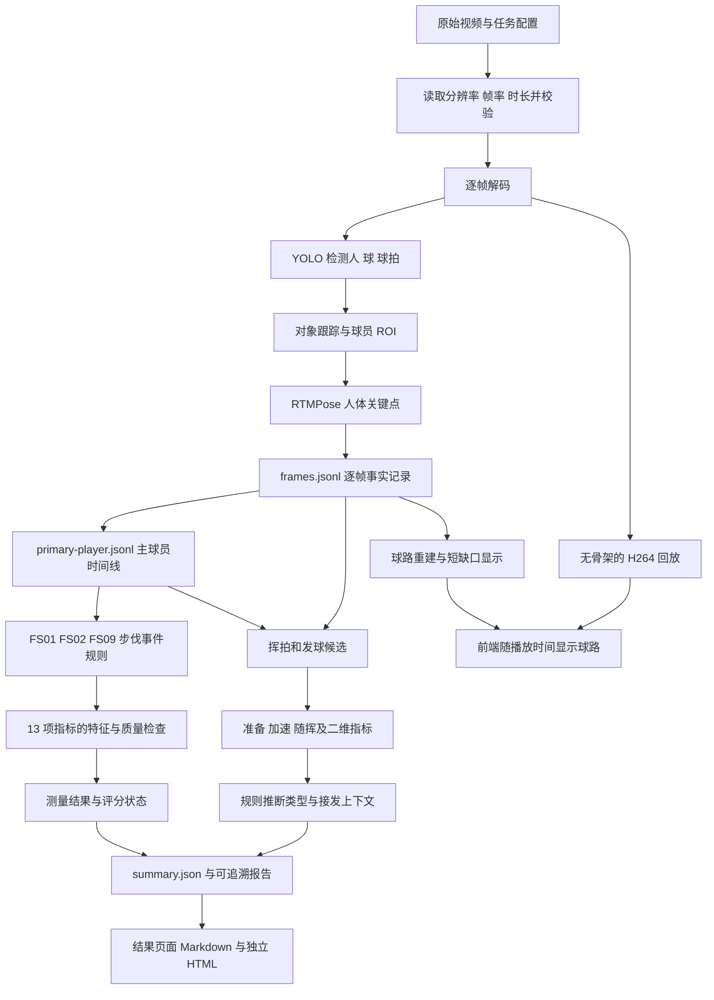

上传完成后，服务器不是把每个上传块各自拿去推理。上传块先按序校验并合并成完整原始视频，再生成一个唯一任务；GPU Worker 领取任务后运行上述流水线。上传协议细节见 [分块上传说明](../deploy/autodl/UPLOADS.md)。

<a id="section-f-2-1"></a>

#### F.2.1 阶段 1：任务与视频输入

入口是 [pipeline.py](../src/rallymate_vision/pipeline.py)，请求结构在 [contracts.py](../src/rallymate_vision/contracts.py)。`PipelineRequest` 至少绑定任务 ID、视频路径、输出目录、模型配置；还可包含截取开始/结束时间、抽帧间隔、最多处理多少帧、最多分析多少名球员、是否生成回放等选项。

时间要统一理解：`timestamp_ms` 单位是毫秒；`frame.index` 是来源视频帧索引；`processed_index` 是此次分析中的帧索引。截取视频或采用 `frame_stride > 1` 后，两种帧索引不再相同。不能用“处理第 100 帧”直接当作“原视频第 100 帧”。

默认处理倾向逐帧分析、最多两名球员。提高 `frame_stride` 可能更快，但短暂触球、抛球与快速挥拍更容易丢失；这种修改必须单独评测，不能用处理帧率提高证明识别没有退化。

<a id="section-f-2-2"></a>

#### F.2.2 阶段 2：目标检测与高清小球增强

[inference.py](../src/rallymate_vision/inference.py) 中 `Yolo26Perception` 把通用 YOLO 的 `person`、`sports ball`、`tennis racket` 统一映射为项目内的 `player`、`ball`、`racket`。

每个观测包含像素方框、归一化方框、中心点、类别、置信度和跟踪编号。归一化坐标通常在 0～1 范围，便于不同分辨率画面统一显示；它不是以米为单位的球场坐标。

当前默认基础检测尺寸为 960。对来源画面长边至少 1600 像素的视频，代码增加只检测球的 1536 尺寸推理，并对小球框形状和大小过滤，再与基础观测合并。策略版本为 `hd-ball-multiscale-v1.0.0`。它增加的是模型对原始画面的观测，不是插值点；代价是高清片检测耗时上升。

当前球与球拍仍来自通用类别检测。球拍方框不等于拍面、甜区、拍柄或三维朝向；小球漏检、广告圆形图案误检、同框多个球都仍可能发生。后续专项模型研发应优先处理这些问题，而不是仅把置信度阈值降低到“每帧都出现一个球”。

<a id="section-f-2-3"></a>

#### F.2.3 阶段 3：人体关键点

项目把 Pose 后端单独封装在 [pose/](../src/rallymate_vision/pose/)：

- `base.py` 定义后端通用输入、输出与模型元数据。
- `rtmpose_backend.py` 加载 MMPose / RTMPose 并对球员区域推理。
- `yolo_backend.py` 保留 YOLO Pose 基线。
- `adapters.py` 负责裁剪区域、原图坐标映射等适配。
- `metadata.py` 和 `data/keypoint_schemas.json` 负责关键点名称、索引和拓扑。
- `presets.py` / `registry.py` 负责预设解析与模型注册信息。

当前默认预设是 `rtmpose-m-halpe26-online`，使用 RTMPose-M Halpe26 256×192。Halpe26 表示 26 个关键点；YOLO 回滚基线是 COCO17；WholeBody133 是另一种包含更多点的候选格式。关键点更多不自动代表网球更准确，不能把不同拓扑同一个数组下标直接相加或比较。

预设还有 M384 分析档、L384 离线 shadow 档和 WholeBody133 分析档。X384 在独立研究清单里，不是默认线上预设。`realtime` 与 `analysis` 的翻转测试、分辨率和延迟口径可能不同，做 A/B 时必须固定这些条件。

<a id="section-f-2-4"></a>

#### F.2.4 阶段 4：跟踪与主球员

有两层跟踪，不要混为一谈：

- [vision/tracking.py](../src/rallymate_vision/tracking.py) 维护人、球、球拍的基础对象轨迹。
- [tracking/primary_player.py](../src/rallymate_tracking/primary_player.py) 从这些逐帧观测建立主球员时间线，版本 `primary-player-v0.3.0`。

主球员时间线保存当帧选择状态、来源 track、是否存在身份歧义及诊断信息。遮挡、远近交换、两人重叠、检测框突然切换可能导致断裂或歧义。动作测量不能为了生成完整结果把两个人的手腕或两次不连续出现拼成同一个挥拍。

当前挥拍链路还使用 `selection_epoch`：主球员选中状态改变时划分新连续段，即使旧 track ID 稍后重新出现，也不能跨越失选区间拼动作。

<a id="section-f-2-5"></a>

#### F.2.5 阶段 5：步伐事件、特征和质量检查

[events/rules.py](../src/rallymate_events/rules.py) 当前正式输出的事件代码仅为：

- `FS01`：分腿垫步；
- `FS02`：第一步启动；
- `FS09`：制动急停与稳定。

范围由 [events/schemas.py](../src/rallymate_events/schemas.py) 的 `EVENT_CODES` 明确限定。事件规则依据 Pose 时序提出区间与阶段代理，保存来源和质量标志；它们也还需要人工事件边界真值验证。

[features/](../src/rallymate_features/) 负责坐标归一化、有效性、平滑、几何、运动学和事件内特征。粗略说：先回答“需要的点是否连续可用”，再计算“膝角、髋部变化或速度是多少”，最后记录“这个数值来自哪些帧、单位是什么、能否被当前评分使用”。

[scoring/loop.py](../src/rallymate_scoring/loop.py) 把注册表、主球员时间线、事件和特征合在一起。测量门槛与评分门槛分开：特征可以已经计算出来，但身份歧义、关键阶段不完整或教练标定缺失仍可阻止评分。不要为了让页面出现一个分数而删除这些阻断。

<a id="section-f-2-6"></a>

#### F.2.6 阶段 6：挥拍、发球与接发分析

这条链路与 FS 步伐评分并行，主要文件是 [stroke_candidates.py](../src/rallymate_scoring/stroke_candidates.py) 和 [stroke_analysis.py](../src/rallymate_scoring/stroke_analysis.py)。它重用 `frames.jsonl` 与主球员时间线，通常无需重新加载 GPU 模型。

第一步定位片段：检测主球员手腕相对躯干的持续运动，并要求球拍与手腕有时序关联；发球还要求另一侧手臂先抬起、持拍臂过顶和后续随挥。单纯举手、无球拍支持、身份跳变或长时间缺失不应直接成为完整动作。

第二步扩展上下文并测量：在连续观测范围内判断准备、加速和随挥区间，估算运动峰值，并计算持续时间、手腕路径、手腕峰值速度、肘角变化和画面肩线变化。不满足连续准备或持续减速要求时，阶段保持不可用，片段可标为 `partial`。

第三步尝试规则分类：

- 先利用双腕明显分开时的独立球拍关联，推断持拍手；不把双手握拍时偶尔更靠近另一只手的球拍框直接当作换手。
- 使用身体左右轴与运动方向推断 `forehand`、`backhand`、`two_handed_backhand`。
- 肩髋方向不一致、侧视投影太短、持拍手证据不足、另一只手覆盖不足时保留 `unclassified`。
- 发球为 `serve_motion`，意味着符合发球式运动时序，不意味着抛球或球拍触球已经确认。
- 接发为 `return_motion`，需要另一名球员的发球动作、同一条连续来球观测和主球员挥拍按顺序关联。不能仅看到一次反手就命名为反手接发。

接发当前使用的是保守二维时空上下文：不同球员、发球后 250～3000 ms 的挥拍、球员有足够空间分离，以及接近接球员的连续球观测等。它没有通过真实接发专项标注集验证；证据不足时明确报告“暂不能判断，不代表没有接发”。

<a id="section-f-2-7"></a>

#### F.2.7 阶段 7：结果、回放与报告

当前 `annotated.mp4` 的文件名沿用历史，但默认内容是干净视频，没有人体骨架、检测框和调试状态栏。后台姿态计算保留。前端在视频上单独画球路，所以“隐藏骨架”和“关闭姿态推理”是两件不同的事情。

OpenCV 输出之后，后端尝试用 FFmpeg 转成 H.264、`yuv420p`、`faststart`，改善 iPhone / Safari 播放与拖动。转码代码当前使用 `-an`，结果回放不保留原音轨；原始视频仍应保留。若转码失败而走 `mp4v` 回退，不能只检查文件存在就认为移动端可播放。

结果 API 将各类产物组合成页面数据；报告导出可得到 Markdown 或无外部脚本依赖的独立 HTML。导出报告应保留方法、缺失证据和限制，并且只针对完成的任务；不能把进行中的空结果包装成最终报告。

<a id="section-f-3"></a>

### F.3 球轨迹为什么仍会断，如何继续优化

[trajectory.py](../src/rallymate_vision/trajectory.py) 是读取已有检测数据的结果重建模块，不是新的球检测模型。它从所有球 track 构造 `ball.reconstruction`；旧 `ball.observed` 字段仅保留兼容用途，通常代表一条选定轨迹，不能当成整段视频唯一球路。

当前重建先去重、处理孤立跳点、按时间与位移分片，然后在两端运动都有支持且关联不歧义时连接短缺口。普通段内连接上限为 250 ms；有两侧运动支持的扩展连接最多 600 ms。这些是当前实现参数，不是经过真实球物理标定的定律。

扩展连接要求两边速度、方向、端点预测误差合理；同一时间存在的不同球 track 不能随意合并；静止误检、孤立点和运动反转不能直接建立连接。长缺口、多个可能对象或明显不合理的跳变继续断开。插值点标为 `source=interpolated`，不能充当真实球观测，也不进入动作评分。

前端默认展示较短球路尾迹，避免整段轨迹堆成杂乱线团。当前默认尾迹约 0.75 秒；人体骨架关闭。识别点、插值显示和服务端重建是不同层次，排错时应分别确认；不要仅凭页面线条是否顺滑判断底层检测改善。

有两个容易误解的指标：

- `observed_count` 是观测点数，同一帧可能不止一个点。
- `observed_frame_count` 才是按帧去重的覆盖数；`coverage_fraction` 应按这个口径理解。插值增加不能提高真实观测覆盖率。

`normalized coordinate / second` 是画面归一化速度；挥拍的 `torso / second` 是躯干长度归一化速度。都不能改名为 km/h、拍头真实速度或球的实际速度。没有场地标定、相机参数或其他尺度依据时，米和公里每小时没有证据来源。

后续改进顺序建议为：先收集漏检/误检与多球样本，再训练或评估网球专用小目标模型，再改善跨帧关联与遮挡处理，最后评估展示策略。为了“连线好看”而连接长缺口，可能把两个不同球甚至广告牌连起来，应作为回归失败。

<a id="section-f-4"></a>

### F.4 当前能力边界：已实现与待研发

<a id="section-f-4-1"></a>

#### F.4.1 已实现并有软件与真实视频验收证据

- 人、球、球拍检测与逐帧存储；高清小球第二尺度观测。
- RTMPose 人体关键点、主球员时间线、身份歧义与连续性检查。
- FS01/FS02/FS09 事件链及 13 项 F2 特征测量。
- 挥拍和发球候选定位；基于连续画面的运动阶段与二维指标。
- 证据足够时规则推断正手、单反、双反；证据不足时保留未分类。
- 满足严格时空条件时给出接发动作上下文。
- 球路按段重建、带来源标记的短缺口插值、视频同步叠加。
- 无骨架回放、可读报告、部分旧任务无 GPU 重建新分析。

这些“已实现”不代表每个真实视频都能可靠识别，也不代表完成专项准确率验证。局部规则成功例子和合成单元测试不能替代独立真实测试集。

<a id="section-f-4-2"></a>

#### F.4.2 尚不能宣称完成的能力

- 真实球拍触球事件、准确击球次数和触球时刻。
- 经专项标注集验证的正反手、单双反、切削、发球与接发识别准确率。
- 可靠的正反手切削、截击、高压等完整分类。当前 24 项技术目录中的名字不是 24 个都已训练上线的识别器。
- 球拍面朝向、甜区接触、握拍类型、三维转体、真实足底压力与支撑力。
- 自动可靠球场标定、真实底线位置、落点、压线、实际球速和战术站位。
- 经教练标定及独立测试支持的正式 A～E 等级或技术质量分。

“底线”目前是技术类别名称与挥拍分析归属；代码中的 `court_location_confirmed=false` 表示并未根据球场坐标确认球员真的位于底线区。当前 pipeline 明确禁用场地定位，不要因项目里存在 `court.py` 就对外说已具备球场测量。

<a id="section-f-5"></a>

### F.5 24 项动作目录与 13 项指标到底是什么

<a id="section-f-5-1"></a>

#### F.5.1 24 项：技术知识与结果展示目录

来源是 [technique_metrics.json](../src/rallymate_scoring/data/technique_metrics.json)，注册表版本 `2026-09-12.1`。目录包括：

1. 底线 5 项：底线正手、底线双手反手、底线单手反手、反手切削、正手切削。
2. 发球 1 项：发球。
3. 接发 5 项：正手接发、双手反手接发、单手反手接发、反手切削接发、正手切削接发。
4. 网前 3 项：正手截击、反手截击、高压。
5. 步伐 10 项：分腿垫步、第一步启动、交叉步、并步移动、小碎步调整、开放式支撑、闭合式支撑、跨步支撑、制动急停与稳定、击球后回位。

每个目录项定义名称、阶段、需要哪些证据、可观察特征、参考约束和限制。目录是“将来要评价什么、现在应该如何表达证据”的结构，不是识别成功率报表。

<a id="section-f-5-2"></a>

#### F.5.2 13 项：当前步伐测量注册表中的具体指标

当前权威文件是根目录 [metric-feasibility-pose-wave-v2.json](../metric-feasibility-pose-wave-v2.json)，版本 `pose-wave-2026-08-22.17`：

- FS01-M02 重心预加载；FS01-M03 双脚轻微离地；FS01-M04 双脚分开落地；FS01-M05 重心重新分配并准备启动。
- FS02-M02 重心向目标方向转换；FS02-M03 支撑脚发力；FS02-M04 启动脚离地；FS02-M05 第一步落地并建立移动方向。
- FS09-M01 判断身体惯性方向；FS09-M02 制动脚落地；FS09-M03 下肢吸收身体惯性；FS09-M04 重心重新稳定；FS09-M05 身体进入稳定控制状态。

这些名称是网球动作需求；当前二维姿态输出通常是代理测量。例如“支撑脚发力”没有力传感器或可靠物理反演，不能把图像运动代理解释成已测得地面反作用力。逐项要看注册表要求与产物的单位、有效性和限制。

仓库还存在更大范围的 298 项颗粒度需求与历史注册表；它们不应被当成已实现的 298 项测量。当前运行权威由 [registry-lifecycle.json](../registry-lifecycle.json) 选择，`metric-feasibility.json` 是历史文件，`metric-measurement-plans.json` 是规划文件。不要因为某个文件名更短就把它切回默认运行来源。

<a id="section-f-5-3"></a>

#### F.5.3 F0～F4 的含义

- **F0**：结构上可以表达这项需求。
- **F1**：能定位相关事件。
- **F2**：能计算相关特征。
- **F3**：特征有区分力，并具备可标定证据。
- **F4**：完成独立测试，可用于正式评分。

当前 13 项仍处于 F2。模型更大、测到的帧更多、前端显示更完整，不会自动把 F2 变成 F3/F4。晋级需要人工真值、误差评估、教练标签、预先确定的接受标准与独立测试。

<a id="section-f-5-4"></a>

#### F.5.4 前端出现的分数如何解释

[user_demo.py](../src/rallymate_service/user_demo.py) 保留多种不同用途的分数字段，必须看完整字段路径：

- 当前新版网页的主分来自 `training_evaluation.score_0_to_100`，即“动作表现参考分（Beta）”；计算在 [training_evaluation.py](../src/rallymate_service/training_evaluation.py)，范围严格限制为这 13 项步伐测量。它服务于当次训练复盘，不是经教练标定的正式技术分或识别准确率。
- 历史兼容字段 `actions[].formation_assessment` / `final_demo_score` 描述可识别动作轮廓和幅度信息的成型程度，不评价动作好坏。
- `technique_assessment` 内的 `evidence_score_0_to_100` 是证据就绪程度。
- `analysis_quality` / 历史兼容 `display_score` 是分析完成程度。
- `technique_assessment.techniques[].score_0_to_100`、`formal_grade` 和正式评分链中的等级，仍须真实标定和独立测试支持，当前不能由上述参考数值替代。

不能只搜索一个 `score_0_to_100` 字段就认定它是正式分：不同层级同名字段有不同语义。报告中应保留 Beta、参考、缺失证据和限制，不能将兼容字段换个标题包装成正式技术质量。

排错必须读状态字段：

- `feature_status=measured`：特征向量算出来了。
- `scoring_status=calibration_required`：测量与相应门槛通过，但缺少获批标定。
- `scoring_status=unavailable`：输入、阶段、身份或质量条件不足。
- `scoring_status=scored`：正式评分确实存在，必须能追溯到被批准的标定与运行配置。

`measured` 与 `unavailable` 可以同时出现，因为二者回答不同问题。`null` 不得改成数字 0；0 分表示一个明确数值，`null` 表示当前没有这个结论。

<a id="section-f-6"></a>

### F.6 模型、依赖和数据文件怎样交给下一个维护者

<a id="section-f-6-1"></a>

#### F.6.1 最小在线模型集合

当前默认 GPU 推理至少需要：

- `models/yolo26n.pt`：人、球、球拍检测。
- `models/rtmpose/rtmpose-m_halpe26_256x192.pth`：默认人体姿态。
- [deployment-presets.json](../models/rtmpose/deployment-presets.json)：预设及配置位置。
- [model-candidates.json](../models/rtmpose/model-candidates.json)：对应官方权重 URL、文件大小、SHA-256 与背景信息。
- 完整关键点拓扑、评分注册表、它们引用的配置文件和当前代码版本。

显式使用 `yolo-baseline` 回滚时还需要 `models/yolo26n-pose.pt`。切换分析或 shadow 预设时，需要对应的额外权重，不应把“文件缺失”处理为悄悄使用另一个模型。

模型大文件被 `.gitignore` 排除，单纯 `git clone` 不会获得它们。交接应选择两种方式之一：

1. 通过授权的私人存储复制现有权重与清单，逐文件核对大小和 SHA-256。
2. 根据已登记清单从原始来源重新下载，核对 SHA-256 后才使用；不是搜索一个同名文件就替换。

例如默认 RTMPose-M 256 权重登记大小为 55,897,557 字节，SHA-256 为 `4D3E73DDD31222B7B0DB36CAEDA396AF1D7630C3B5A60451BDFA99A79E8DBB90`。交接时从清单重新核对，不靠聊天记录作为唯一权威。Windows 可用以下只读命令检查：

```powershell
Get-FileHash -Algorithm SHA256 -LiteralPath 'models/rtmpose/rtmpose-m_halpe26_256x192.pth'
Get-Item -LiteralPath 'models/rtmpose/rtmpose-m_halpe26_256x192.pth' | Select-Object Length
```

RTMPose 配置来自安装好的 MMPose 包 `.mim/configs/`。清单保留历史 Windows 路径和包内相对路径；当前代码有跨平台解析，Linux 不能硬抄 `Lib/site-packages` 的绝对路径。

<a id="section-f-6-2"></a>

#### F.6.2 环境不能只交一个 requirements 文件

[pyproject.toml](../pyproject.toml) 定义基础包与 `service`、`rtmpose`、`training`、`dev` 可选依赖。[AutoDL 约束文件](../deploy/autodl/requirements-constraints.txt) 固定当前主要兼容版本，但不是所有间接依赖的完整锁文件。[AutoDL 指南](../deploy/autodl/README.md) 给出了已经验证的重建次序。

历史 AutoDL 环境为 Ubuntu 22.04、Python 3.12.3、PyTorch 2.8.0+cu128、torchvision 0.23.0+cu128、NumPy 1.26.4、OpenCV 4.11.0.86、系统 FFmpeg 4.4.2。虚拟环境使用 `--system-site-packages` 复用镜像里的 CUDA PyTorch。

不要照搬本机 Python 3.14 到推理环境；本机 3.14 可运行巡检和部分纯 Python 测试，不等于这套旧 OpenMMLab 推理依赖支持同样组合。NumPy 1.x、`xtcocotools` 编译、旧 setuptools 兼容性都是已经遇到的重建问题，按部署文档顺序处理。

模型、数据、校准资产三者的交接要分开：

- **模型权重**能重建推理，不包含用户上传历史。
- **原始视频和任务产物**能复现问题与报告，但不是训练标签。
- **人工标注与校准资产**决定是否可以训练、评测和正式评分，不能用模型自己的输出替代。

`FULL-TEST/`、`data/annotations/`、`data/training/`、`service_data/`、大部分 `reports/` 和 `.codex_tmp/` 通常不在 Git。不要以“代码仓库完整”为由宣称这些证据已交付。交接清单应逐项标记已提供、需私下提供、可重新生成或不存在。

<a id="section-f-7"></a>

### F.7 每个任务的文件是什么，哪些不能丢

服务器任务目录通常为 `service_data/runs/<job_id>/`。本地离线实验可以使用其他输出目录，以请求文件和 `summary.artifacts` 为准。

- `frames.jsonl`：一行一帧，包含帧信息、检测、关键点、跟踪与质量。它是离线重建轨迹、候选与排错最重要的基础数据之一；不是视频。
- `primary-player.jsonl`：逐处理帧的主球员选择；与 frames 必须来自同一运行。
- `primary-player-summary.json`：身份连续性、覆盖等汇总。
- `events.jsonl`：FS 步伐事件、起止时间、阶段、质量、版本来源。
- `features.jsonl`：事件相关的基础特征。
- `indicator-features.jsonl`：每个指标在具体事件上的测量、有效性、单位、证据帧与原因。
- `scores.jsonl`：评分状态、等级或缺失原因；不能只统计有多少行就当作有多少正式分数。
- `scoring-loop-summary.json`：事件和指标评分链的汇总。
- `calculation-readiness.json`：当前视频各指标是否至少有完整可测实例，以及为什么不可算。
- `indicator-measurement-portfolio.json`：各测量来源、准备情况与可测范围。
- `scoring-cycle-measurement.json`：周期和组合测量信息。
- `event-feature-errors.json`：事件与特征误差评估状态；没有真值时应说明待补真值。
- `scoring-readiness.json`：更大范围需求的就绪审计；不是额外完成了全部需求。
- `summary.json`：输入、模型、处理时间、覆盖、候选/动作分析、评分状态、能力限制、运行环境和产物目录。
- `annotated.mp4`、`preview.jpg`：用户回放与预览，当前默认无骨架。
- `analysis-report.html`、`scoring-loop-report.html`：研发侧静态报告，与前端的用户导出报告用途不同。

API 按需返回的 `trajectory`、`technique-assessment`、`demo-result` 可能利用保存文件重建，不一定各自对应任务目录里同名静态 JSON。重建版本可能比任务最初推理版本更新；比较前后结果时必须记录两层版本，不能误认成“GPU 重新推理过”。

`frames.jsonl` 与主球员时间线必须配对。把 A 视频的 frames 与 B 视频的主球员 JSONL 拼起来，即使文件都合法，也不能代表真实结果。原始视频 SHA、任务 ID、帧数、时间轴和版本都要检查。

<a id="section-f-7-1"></a>

#### F.7.1 当前关键版本快照

以下值来自交接时源码；升级后以实际产物为准，不要永久硬编码在前端：

- 请求与基础运行 `schema_version`：`1.0.0`；逐帧 `FRAME_SCHEMA_VERSION`：`1.1.0`。
- Pose 部署注册表：`pose-deployment-presets-2026-09-04.1`。
- 主球员：`primary-player-v0.3.0`。
- 事件检测：`pose-motion-bout-v0.4.1`；事件阶段代理：`pose-event-phase-proxies-v0.3.0`。
- 特征库：`rallymate-features-v0.1.0`；FS01/FS02 特征：`fs01-fs02-pose-proxies-v0.5.0`；FS09 特征：`fs09-pose-proxies-v0.2.0`。
- 最小评分链：`minimum-scoring-loop-v0.7.0`；指标事件质量：`indicator-event-quality-v1.6.0`。
- 挥拍候选：`pose-racket-stroke-candidates-v1.1.0`；动作分析：`stroke-motion-analysis-v1.0.1`。
- 技术评估：`rallymate-technique-assessment-v1.4.0`；用户结果：`rallymate-user-demo-result-v1.2.0`。
- 轨迹 Schema：`1.0.0`；动作分析 Schema：`1.0.0`。

`schema_version` 表示字段结构，`detector_version` / `analysis_version` 表示算法行为，它们可以不同步变化。增加字段、修改语义、调整门槛或更换权重都应记录相应版本与证据。已有 JSON Schema 集中在 [contracts/](../contracts/)；并非每个新增嵌套动作分析字段都有独立 schema 文件，还要维护 Python 验证、前端类型与测试。

<a id="section-f-8"></a>

### F.8 源码目录地图：朋友该让 Codex 去哪里找

- [rallymate_vision](../src/rallymate_vision/)：视频解码、检测、Pose、基础跟踪、干净回放、球轨迹与 pipeline。
- [rallymate_tracking](../src/rallymate_tracking/)：主球员与连续身份。
- [rallymate_events](../src/rallymate_events/)：FS 事件区间和阶段规则、事件比较与评估。
- [rallymate_features](../src/rallymate_features/)：几何/运动学、平滑、关键点有效性、FS 特征。
- [rallymate_scoring](../src/rallymate_scoring/)：指标注册表、测量/评分、候选/动作分析、标定、独立测试和能力解释。
- [rallymate_training](../src/rallymate_training/)：数据准备、YOLO 训练/评估/导出/模型注册，RTMPose 标注就绪检查与微调入口。
- [rallymate_evaluation](../src/rallymate_evaluation/)：事件真值、关键点误差、固定边界 A/B、身份/诊断/模型对比。
- [rallymate_service](../src/rallymate_service/)：上传、数据库、任务 Worker、API 和用户结果适配。
- [scripts/](../scripts/)：可运行的研发工具入口；先看 `--help` 和对应文档，不要根据文件名猜参数。
- [models/rtmpose/](../models/rtmpose/)：模型清单、预设和实验协议；大权重通常不在 Git。
- [calibration/](../calibration/)：标定相关配置与受信绑定；不得为了看到分数填写虚构参数。
- [contracts/](../contracts/)：数据契约；修改输出时同步维护。
- [tests/](../tests/)：可重复的软件回归。`test_stroke_analysis.py`、`test_stroke_candidates.py`、`test_ball_refinement.py`、`test_trajectory.py`、`test_primary_player.py`、`test_technique_assessment.py` 是本轮能力的关键入口。

首次阅读研发文档建议按顺序看：当前源码 → [AutoDL 部署说明](../deploy/autodl/README.md) → [评分链验收账本](MINIMUM_SCORING_LOOP_ACCEPTANCE.md) → [阻断类型](SCORING_BLOCKER_TAXONOMY.md) → [真值采集](SCORING_TRUTH_COLLECTION.md) → [M90 发布合同](M90_SCORING_RELEASE_CONTRACT.md) → [M95 微调准备](RTMPOSE_X_AND_FINETUNE_READINESS_M95.md) → [M97 模型对比](RTMPOSE_X_OPERATIONAL_COMPARISON_M97.md)。旧文档中的“当前”可能指当时里程碑，不能覆盖较新的源码和发布清单。

<a id="section-f-9"></a>

### F.9 历史性能：哪些数字有证据，应该怎样使用

性能至少拆成上传、排队、GPU/CPU 视频流水线、结果生成/转码、浏览器获取五部分。用户等待时间约等于这些阶段之和。模型单次调用的毫秒数不能直接代替用户从上传到结果可用的总时间。

已经保存的典型历史记录如下，均不是当前可用性或所有视频速度保证：

1. **首次 AutoDL 真实链路**：RTX 4090 D，11.72 秒、293 帧、1920×1080、7,105,847 字节输入，pipeline 30.975 秒；任务 `历史验收任务A（编号脱敏）`。出处为 [部署验收记录](../deploy/autodl/README.md)。
2. **9 月 24 日分块上传验收**：`IMG_5712.mov` 为 59,442,657 字节、923 帧、约 30.765 秒、1080p。15 块上传，模拟中断后跳过已收到的 3 块；[历史验收记录](../deploy/autodl/README.md)为约 45.37 秒，端到端有效速度约 1.25 MiB/s。计时包含创建会话、全部 15 块（含最早的 3 块）、模拟恢复、字节校验、合并及重复 complete 幂等验证，不包含读取本地文件的时间，不是纯传输带宽。数值保存在验收 README，测量代码为 `.codex_tmp/autodl/chunk_smoke.py`；当时计时 JSON 仅输出到终端，未另存独立原始测速日志。任务 `历史分块验收任务B（编号脱敏）` 的 pipeline 84.213 秒，有效处理 10.960 帧/秒。这是当时环境的历史记录，不是手机端速度承诺。
3. **高清小球增强和动作分析上线验证**：相同 923 帧输入的新任务 `历史动作验收任务C（编号脱敏）`，pipeline 计时 95.270 秒、9.688 帧/秒。记录中目标检测 21.170 秒、Pose 7.474 秒、主球员 0.379 秒、动作分析 0.443 秒、步伐评分链 4.496 秒。部分阶段没有单独拆分计时，所以这些分项之和小于总耗时，不应把差额全部归咎于 GPU。当前 `processing.elapsed_seconds` 在后续最终产物校验和部分报告生成前取值，并不覆盖所有任务收尾，更不含上传与排队。
4. **本机历史记录**：2026-09-15 的 97 秒、2911 帧视频约 137 秒完成，1280×720 回放验证通过。该记录是本机结果，不能与不同 GPU、不同尺寸、不同版本的云端任务直接声称加速倍率。

第三条对应的球观测帧覆盖为 439/923，即 47.56%；此前该发球样本的旧观测覆盖约 30.34%。这是新增高清尺度后的观测覆盖变化，尚无人工逐球真值，不能写成识别准确率从 30% 提高到 48%。

本地可复核证据包括：`reports/autodl-20260924/IMG_5712-report.md`、`.codex_tmp/autodl/chunk-verification/job.json`、`.codex_tmp/autodl/motion-cloud-report.json`、`.codex_tmp/autodl/motion-release.json`。后几项是忽略提交的本地证据，交接时应提取允许共享的摘要，不要把整个 `.codex_tmp` 打包给朋友。

模型研究中，M97 X384 的单 ROI `analysis + flip-test` P50 约 21.12 ms，M96 的 M/L/X 比较使用另一套 `realtime/no-flip` 条件。这些数字不能跨设置计算速度倍率。M97 也没有证据支持“换成 X 就更准确”；其冻结开发样本中没有完整保留 M71 的恢复集合。

<a id="section-f-10"></a>

### F.10 研发闭环：怎样把“看起来会动”逐步变成可靠识别

<a id="section-f-10-1"></a>

#### F.10.1 第一步：确定要修哪一种失败

不要只写“底线不准，请优化模型”。先固定一小组经授权的视频与时间窗，逐个标明：漏了球、球拍误检、主球员换人、手腕跳点、动作没定位、分类错误、阶段错位、还是网页没有正确显示已有结果。每一种失败对应不同模块，混在一起会导致反复改阈值却不知道修好了什么。

原始视频、运行参数、帧产物、任务 ID、代码版本、模型 SHA 和对照截图要能对应。可以先利用已有 frames 无 GPU 重放规则；只有检测或 Pose 本身改变才需要重新跑对应模型。

<a id="section-f-10-2"></a>

#### F.10.2 第二步：先定义真值和评估协议

需要人工明确记录的内容包括：球和球拍位置、可见/遮挡状态、主球员身份、动作类别、动作起止、关键阶段、真实触球是否可判断及其时间不确定度。模糊帧可以标为不可判断；不能强迫每个视频都有一个答案。

完整视频标注与“只复核模型找到的候选”用途不同。只看候选无法发现系统完全漏掉的动作，因此不能据此计算无偏 recall。训练、验证、测试应按视频、球员和场次分开，不能把同一段视频相邻帧分到 train 与 test 来制造好看的数字。

现有 M89/M90/M93 工作流包含执行包、A/B 独立标注、C 裁决和私有 intake；应阅读其明确要求，使用真实负责人的放行记录与来源绑定。当前历史文档记录的空模板不代表已经有真实标签；不能让 Codex 生成“人工已确认”数据、伪造签字或填补发布记录。

封存的 holdout 只用于受控最终评估；开发时不要打开、重新取帧、调阈值或拿来展示。相关治理清单中存在路径不代表自动授权使用。

<a id="section-f-10-3"></a>

#### F.10.3 第三步：分层验证，不只看一个总分

- 检测层：球/球拍/人的 precision、recall、定位误差，小球与遮挡分组，误检是否来自广告、灯光、多球。
- 姿态层：人工关键点 PCK、MAE、P95 与左右交换/跳点；按视角、分辨率、遮挡和球员大小分组。
- 身份层：主球员选错、身份切换、歧义拒绝与恢复；不能只看 track 数量。
- 事件层：Event precision/recall/F1、Segment IoU、边界 MAE；明确匹配窗口和时间不确定度。
- 动作类型层：正手、单反、双反、发球、接发、切削等混淆矩阵；报告未分类/拒绝率，不能只统计愿意回答的容易样本。
- 触球层：真实触球时刻匹配 precision/recall、时间误差与不可观察比例；不能用“腕速峰值附近”充当人工触球标签。
- 特征层：和人工测量比较 MAE/P95/Bias 与逐视角误差；有效覆盖增加和误差下降分开报告。
- 评分层：多教练一致性、校准误差、独立测试表现及适用范围；没有这些证据继续保持 `calibration_required` 或 `unavailable`。
- 工程层：内存、GPU 显存、P50/P95 延迟、冷/热启动、失败恢复与视频可播放性。

接受阈值需要在查看测试结果前由项目确定，不能看完结果再倒推一个能通过的标准。本交接不虚构某个“95% 准确率”作为现有事实，也不替项目临时创建没有依据的发布阈值。

<a id="section-f-10-4"></a>

#### F.10.4 第四步：选择对应训练或规则优化路径

球/球拍检测可以走 [rallymate_training](../src/rallymate_training/) 的 `prepare → train → evaluate → export → register`。这条 CLI 支持 YOLO detect/pose 数据与训练配置；不是现成的时序击球分类模型训练器。

RTMPose 微调走独立的严格链路：`audit_pose_finetune_readiness.py` 检查人工标注与数据治理 → `export_mmpose_halpe26_dataset.py` 导出 → `run_rtmpose_finetune.py --dry-run` 生成和核验训练计划 → 条件满足后再显式 `--execute`。没有人工 Halpe26 标注时，只能完成工具与流程准备，不能说已经微调。

正式底线/发球/接发和触球识别仍需要专项任务设计。可先把当前规则作为可追踪基线，逐步开发时序分类器或多模态触球检测器；不能把现有通用 YOLO 的 `train` 命令当作按下后自动得到所有网球专项能力的按钮。

<a id="section-f-10-5"></a>

#### F.10.5 第五步：shadow、回归与上线

新模型先 shadow：同样输入同时运行旧版和候选版，用户结果仍来自原默认版本。比较同一帧、同一人、同一 ROI、同一事件边界；如果模型同时改变了事件边界，要分别报告“固定边界测量对比”和“端到端结果对比”，不能混用。

最低回归覆盖应包括：

- 静止、无球拍、单纯举手不会被批量算成挥拍或发球。
- 左右镜像和左手持拍不会被整体丢弃。
- 主球员切换、失选、两人交叉和遮挡不会拼成虚假的完整动作。
- 双手握拍不被偶尔的近手框关联误判为换持拍手。
- 缺失准备或随挥时标为 partial，不补造时间点。
- 两个同时存在的球、多球训练、静态圆形误检不会被拼成同一连续球路。
- 接发必须有对手发球和来球连续证据，普通底线挥拍不自动变成接发。
- 所有 `contact_confirmed` 与击球计数语义保持诚实；规则分类不写入确认触球。
- 候选不污染 GS/FS 阶段证据；其他动作的同名阶段不被借用。
- 旧任务和旧 JSON 可读取；修改版本后缓存会失效并正确重建。
- 对比片段能解码、seek，iPhone / Safari 回放仍兼容，预览不出现骨架和大块候选列表。

上述合成与回归用例能证明代码没有明显违背契约，仍需真实标注集评估才能声称模型更准确。发布应遵循主交接文档的本地验证、云端空闲、定向部署、备份、真实烟测与回滚流程。

<a id="section-f-11"></a>

### F.11 给零基础朋友：可以直接复制给 Codex 的任务

下面是分次执行的任务，不建议一口气把所有优化同时交给 Codex。每次让它先说明证据、实际修改范围和验收方法，再检查结果。

在要求修改前，可以先让 Codex 运行下列只读帮助命令，确认当前环境、入口与参数。这里的 `python` 必须是本章说明的已配置项目环境，不能任意选系统里第一套 Python：

```powershell
$env:PYTHONPATH = 'src'
python -m rallymate_vision --help
python -m rallymate_training.cli --help
python scripts/run_rtmpose_finetune.py --help
```

对应本章的定向软件回归可用：

```powershell
$env:PYTHONPATH = 'src'
python -m unittest discover -s tests -p 'test_stroke_analysis.py'
python -m unittest discover -s tests -p 'test_stroke_candidates.py'
python -m unittest discover -s tests -p 'test_ball_refinement.py'
python -m unittest discover -s tests -p 'test_trajectory.py'
python -m unittest discover -s tests -p 'test_technique_assessment.py'
```

这些命令不是全量验收，也不是精度测试。需要真实 GPU 烟测时，让 Codex 复制并修改 [现有在线档请求样例](../examples/request-rtmpose-online-smoke.json)，绑定实际授权视频，使用新的唯一任务 ID 和未存在的输出目录；不要直接覆盖样例指向的历史 `runs/`。然后运行 `python -m rallymate_vision --request <新请求路径> --max-frames 120`，再检查逐帧产物和真实回放。120 帧可能不足以包含完整发球，所以空动作结果并不自动说明算法失败。

<a id="section-f-11-1"></a>

#### F.11.1 任务 A：先复现一次“没有识别出击球”

```text
请审查当前 RallyMate 项目并复现指定任务的问题。先读取 docs 中交接文档、deploy/autodl/MONITORING.md 和现有源码版本。不要修改源码、部署、下载私人视频或读取/输出任何密钥。
使用我指定的任务 ID 和已经授权的本地视频/产物，检查 summary、frames、主球员时间线、action_recognition.motion_analysis 和 technique-assessment。逐层说明是检测/Pose/身份/片段定位/规则分类/触球能力还是前端展示的问题。
输出可复核的时间窗、输入版本、实际已有证据与缺失证据。不要把候选、腕速峰值、插值轨迹当成确认触球；不声明未经人工真值验证的准确率。把需要我提供的真实样本或标签列清楚。
```

<a id="section-f-11-2"></a>

#### F.11.2 任务 B：优化球轨迹连续性

```text
请先建立旧版基线，审查 inference.py、tracking.py、trajectory.py 与前端 trajectory-viewer。针对已授权样本区分真实球漏检、错误关联和仅显示问题。
优先提高真实球观测和关联正确性；不得用长缺口插值制造观测覆盖率。保留 observed/interpolated 来源，报告按帧去重的覆盖率、误连案例、断裂段、处理耗时。所有门槛改动附版本和回归，包括多球、静止误检、反向运动、遮挡与同帧不同 track。
先完成本地修改、相关测试和同样本前后对比；在明确说明结果与剩余限制后，按已有部署授权和空闲检查执行定向发布。保持人体骨架隐藏。
```

<a id="section-f-11-3"></a>

#### F.11.3 任务 C：提高底线规则分类并建立真实评估

```text
请审查 stroke_candidates.py、stroke_analysis.py 和当前真实样本。先保持确认触球计数为空，不改变正式评分门槛。
对正手、单反、双反与未分类案例建立可复核时间窗，记录持拍手、肩髋轴、双腕关系、主球员连续性和遮挡原因。只修复能被样本与回归证明的代码问题；不要通过降低所有阈值增加表面识别数量。
另外给出需要人工标注的最小协议和按球员/场次隔离的开发、验证、独立测试划分。若没有真实标签，只报告规则覆盖、失败类型和工程验证，不报告分类准确率。保留原模型与回滚配置。
```

<a id="section-f-11-4"></a>

#### F.11.4 任务 D：研发确认触球检测

```text
请先做代码与数据差距分析，不直接把 motion peak 或球拍方框接近球中心定义为确认触球。明确需要的原始帧率、球与球拍定位、可见性、时间不确定度和人工触球标签。
设计一个与现有动作候选并行、输出独立 contact events 的版本化方案，确保不把不可见接触判成 0 次。提出训练/验证/测试隔离、事件匹配容差、precision/recall/时间误差和拒绝率的评估协议。
先实现数据契约、标注与评估工具、合成回归和离线基线；获得真实数据并完成预先约定的验收后才讨论上线。所有现有用户报告仍保持未确认语义，不伪造指标。
```

<a id="section-f-11-5"></a>

#### F.11.5 任务 E：尝试更大的 Pose 或微调

```text
请先阅读 models/rtmpose 的部署注册表与 shadow 清单，以及 M95/M96/M97 文档。确认默认仍为 rtmpose-m-halpe26-online，不能自动替换成 L/X。
在同帧、同 ROI、同主球员、同 profile、同 flip 设置、同边界条件下比较旧模型与候选模型，报告原有可测集合是否丢失、真实关键点误差是否有标签支持、P50/P95 延迟与显存。
若要微调，先运行人工标注与治理就绪审查，默认 dry-run；缺真实标签就停止在差距报告，不创建伪标签或执行训练。任何执行与上线都保留版本、SHA、数据划分和回滚路径。
```

<a id="section-f-11-6"></a>

#### F.11.6 任务 F：维护评分体系

```text
请以 registry-lifecycle.json 选定的当前注册表为真源，审查13项指标的测量、quality gate、calibration_required/unavailable原因和对应人工证据需求。
不要修改历史注册表来绕过现有阻断，不要把缺失值改0分，不要把形成程度/证据就绪度改名为动作质量。先用保存的 frames 和 primary timeline 做无GPU重放，比较事件键、特征值/单位/来源、状态、原因码和版本。
若需要正式评分，先列出缺少的事件真值、关键点真值、教练标签、接受协议、独立测试及受信标定绑定；只使用实际存在且来源可核验的资产。测试通过不等于准确率通过。
```

<a id="section-f-12"></a>

### F.12 常见误区与排错顺序

**“GPU 空闲，是不是没在推理？”** 先看任务是否已完成、排队、读取视频、CPU 后处理或转码。GPU 利用率是瞬时值，完整耗时包含更多阶段；应读取任务状态与阶段进度。

**“模型正常加载，为什么动作仍为空？”** 模型加载只证明依赖和文件可用。依次看人/球拍观测、主球员选择、腕部有效覆盖、动作连续性和规则拒绝原因；接发还需要对手和来球上下文。

**“不是有正手分类了吗，为什么专项表仍不能打分？”** 新 `motion_analysis` 是规则推断与二维测量，正式 GS 专项事件/教练评分链没有因此自动完成。不要直接把分类名称写入 `GS01` 以求表格点亮。

**“把大模型换上就能解决发球和击球吗？”** Pose 变好可能改善身体测量，却不会自动提供球拍甜区、真实触球标签或接发上下文；需要分层证据。

**“回放没有骨架，后台还需要 Pose 吗？”** 需要。骨架只是不显示，动作测量仍使用关键点。关闭 Pose 会破坏步伐与挥拍链路。

**“旧报告为什么看不到新动作分析？”** 已下载报告是当时的静态快照；重新读取任务并导出。API 是否能重建还取决于 frames 和主球员文件是否保留、版本与缓存是否正确。

**“测试全部通过，可以对外说准确率高了吗？”** 不能。软件测试证明约定输入的行为；准确率必须来自明确真实标签、独立样本、固定评估协议和可复核统计。

**“为什么有的历史文档说没有正反手，当前页面又有？”** 9 月 24 日先补了候选，随后上线了规则类型和阶段测量。应按版本和时间理解演进，保留旧验收记录，不把旧说法和新能力混在一起。

---

<a id="part-operations"></a>
<a id="section-g"></a>

## G. 运行维护、限流与冗余设计


本章面向通过 Codex 接手项目、暂时不会写代码的维护者。遇到问题时，先用本章给出的描述让 Codex 收集证据，再根据明确的故障执行对应操作。文中的命令区分 Windows 本机与 AutoDL 终端；不能把 Linux 命令直接粘贴到 Windows PowerShell。

本章依据 2026-09-27 的本地源码、部署文档，以及此前的云端验收记录编写。本轮没有登录 AutoDL 管理服务，没有读取真实 `runtime.env`、`.env`、`.dev.vars` 或私钥，没有修改云端和应用源码。文中数值标为“代码默认值”的，不能据此断言服务器没有覆盖配置。

<a id="section-g-1"></a>

### G.1 交接时必须先知道的现状

最后一次有明确记录的云端发布是 **`20260924T130527Z`**，不是当前 Git HEAD 的全部内容。该发布仅更新经过核对的指定文件并重启 Web；当时首页免登录，建议服务保持 `MIMO_ADVICE_ENABLED=0`，没有发起真实 MiMo 付费调用。历史记录在[监控与发布记录](../deploy/autodl/MONITORING.md)。

**2026-09-27 06:44:56 UTC，即北京时间 14:44:56，本次交接整理执行只读监控检查失败。** 返回 `remote_status=offline`、`ssh_connection_or_host_verification_failed`，连接阶段发生 SSH banner EOF，`health=null`；本地记录的最后成功时间为 **2026-09-24 13:07:43 UTC，即北京时间 21:07:43**。这说明本次无法经受限 SSH 取得新快照，不能据此断言实例已经关机，也不能断言公网网站一定不可用。当前接手的首要待办是恢复可核实的访问和健康检查，不能把三天前的绿色状态当作今天仍然健康。

首次文档核查时，本机 `main` 的 HEAD 为 `0cc46f5d9844f8b6b6cd4f891aa495d499cf9245`，存在大量未提交文件；后续本次 GitHub 交接提交已纳入完整源码与本手册，版本规则见 B.2。模型、视频、数据库、服务器配置和监控密钥仍不随 Git 分发。首次核查中有限范围的 379 个文件指纹较上次没有变化，只表示当时被扫描的文件没有变化；不是云端与本地一致或已经备份的证明。

交接前应让原维护者与接手者共同确认：

1. AutoDL 账户、实例和存储卷归属，实例是否开机，余额和续费责任由谁承担。
2. 最新云端快照、当前公网地址、最近一次完整分析是否通过。
3. 精确的发布文件清单与哈希，而不是只报一个 Git 提交号。
4. 哪些数据已经另存到独立位置；目前没有证据证明已建立并演练异地自动备份。
5. 新维护者使用自己的管理凭据和受限监控密钥，旧维护者的访问何时撤销。

<a id="section-g-2"></a>

### G.2 最近一次验证的部署结构

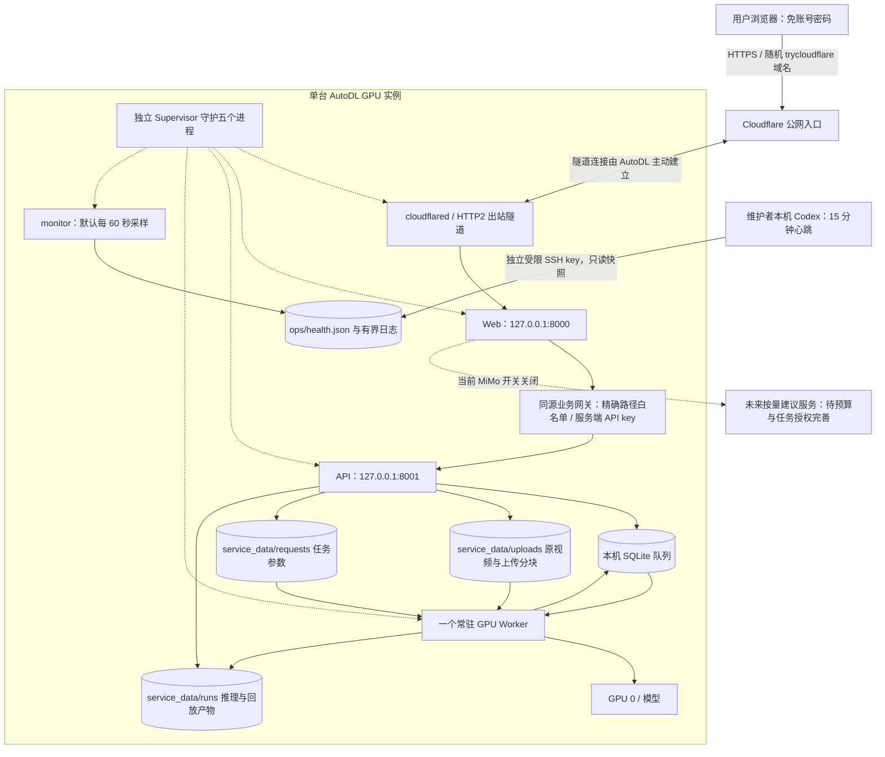

这条链路不经过原维护者的电脑进行视频推理或网站转发。个人电脑关闭，通常不会直接停止已在 AutoDL 上运行的服务；它会影响本机 Codex 的外部心跳。AutoDL 关机、实例释放、GPU/磁盘故障或平台网络故障则可能让整站不可用。

Cloudflare 在这里主要提供公网入口与隧道。视频分析仍由 AutoDL 的 GPU 执行，网页服务也在 AutoDL 上。代码中存在 Cloudflare Worker 模板、D1/R2 类型和构建配置，不代表当前已经把推理、数据库或用户视频部署到了 Cloudflare。

截至本章核查时，[Cloudflare Quick Tunnel 官方说明](https://developers.cloudflare.com/cloudflare-one/networks/connectors/cloudflare-tunnel/do-more-with-tunnels/trycloudflare/)将此类隧道定位为测试开发用途，不提供 SLA；当前最多 200 个在途请求，超过会返回 429，并且不支持 SSE。这里的 200 指同时尚未完成的 HTTP 请求，不是 200 个用户或 200 个 GPU 任务。当前前端通过轮询读取进度，不依赖 SSE；未来若更改通信方式，需重新核对入口能力。

<a id="section-g-2-1"></a>

#### G.2.1 关键目录及其用途

- `/root/autodl-tmp/rallymate`：当前服务器项目根目录。部分数据库字段和任务 JSON 包含绝对路径，因此迁移到另一个目录时不能只搬一个数据库文件。
- `.venv/`：当前 Python 环境；通过 `--system-site-packages` 复用镜像的 CUDA Torch 栈。
- `tools/node/`、`tools/cloudflared`：部署使用的 Node 与隧道二进制。
- `scoring-demo-web/`：完整前端工程。生产部署要构建后运行 Node 服务；`dist/client` 不是可以独立替代全部服务的静态站点。
- `deploy/autodl/runtime.env`：仅服务器保管的配置，可能含密钥。只交接保存方式、负责人和字段用途，不把内容贴进聊天、截图或 Git。
- `service_data/jobs.sqlite3`：任务队列和状态。运行时使用 WAL，可能伴随 `-wal`、`-shm` 文件。
- `service_data/uploads/`：已提交任务的原始视频；其 `.chunks/` 子目录是可续传的临时块与会话 manifest。
- `service_data/requests/`：每个任务的实际输入、模型和处理参数。
- `service_data/runs/`：摘要、逐帧证据、轨迹派生产物、可播放回放等。
- `service_data/ops/`：Supervisor socket/PID、日志、健康快照、监控状态和发布回滚材料。
- 模型权重、`deployment-presets`、注册表与校准文件：重建分析环境需要一起核对，不能仅恢复 Python 代码。

服务器配置默认数据根为 `service_data`。如果由管理员覆盖过 `RALLYMATE_DATA_ROOT` 或 `RALLYMATE_DATABASE_PATH`，应以受控检查得到的有效配置为准；当前运维 socket 和部分监控路径仍固定在项目的 `service_data/ops`。随意改数据根需要额外审查脚本，不能认为只改一个变量所有组件都会跟着迁移。

<a id="section-g-2-2"></a>

#### G.2.2 不要混用另外一套部署示例

[Docker Compose](../deploy/docker-compose.yml)、[Dockerfile](../deploy/Dockerfile) 和 [Nginx 示例](../deploy/nginx-rallymate.conf.example)是其他部署方式的模板，不是当前 AutoDL Supervisor 方案已经启用的组件。

它们使用的端口、Python/Torch 版本和环境约束与当前 AutoDL 不同：Compose 示例 API 容器使用 8000 端口，Nginx 示例 Web 上游为 3000；当前 AutoDL 则是 API 8001、Web 8000。Dockerfile 的 Python 3.10 / Torch 2.11.0 也不等于这次 AutoDL 已验证的 Python 3.12.3 / Torch 2.8.0+cu128。

不要为了排障直接运行 `docker compose up` 或安装并启用 Nginx，这可能产生第二套服务、端口冲突和不同模型环境。若未来选择容器化，要作为单独迁移进行构建、GPU、数据卷、权限、回放及恢复验收。

<a id="section-g-3"></a>

### G.3 目前有哪些恢复能力，分别能救什么

<a id="section-g-3-1"></a>

#### G.3.1 Supervisor 处理“进程退出”

[Supervisor 配置](../deploy/autodl/supervisord.conf)管理 `api`、`worker`、`web`、`cloudflared`、`monitor` 五个进程。所有进程设为 `autostart=true`、`autorestart=true`，启动后至少存活 5 秒才被视为成功，启动阶段失败最多重试 5 次。这个 5 次是启动阶段预算，不是整个服务生命周期总共只能重启 5 次。

Supervisor 在后台运行，SSH 窗口断开不会像直接运行前台 Python 那样终止服务。不过它不能解决主机断电、平台回收实例、磁盘永久丢失，也不能仅凭进程仍在就知道 GPU 调用是否已经卡住。

停止等待时间分别为 API/Web 30 秒、Worker/monitor 60 秒、cloudflared 20 秒；随后可能强制结束进程组。这些是停止上限配置，**不是保证当前视频会在停止前分析完毕**。因此正常升级前要等运行和排队任务清空，并先控制新任务入口。

`manage.sh start` 会检查运行文件与服务器配置，启动全部程序，并最多进行约 60 轮、每轮 1 秒的启动状态检查。模型加载、公网网络和实际推理仍须独立验证，看到 `RUNNING` 不等于所有功能已通过。

<a id="section-g-3-2"></a>

#### G.3.2 SQLite 队列处理“请求已提交，但浏览器或进程断开”

[任务数据库](../src/rallymate_service/database.py)使用本机 SQLite，连接等待默认 30 秒、WAL 日志模式，认领任务通过 `BEGIN IMMEDIATE` 事务完成。任务状态持久化为 `queued`、`running`、`succeeded`、`failed`，同时保存路径、处理参数引用、进度和摘要。

这让已经成功入队的任务不依赖浏览器维持连接。刷新页面、手机切换网络、关闭浏览器，通常不会取消服务器分析。重新打开当前站点并读取对应 jobId，可以继续看原任务，不应立即重复上传。

数据库持久化只表示保存到了这一台机器的存储，不能推导成异地备份、跨主机复制或任何断电不丢数据保证。原视频、任务 JSON、输出目录与数据库必须一起保留；单个任务状态写着 `succeeded` 也不表示输出文件没有被人为删除。

<a id="section-g-3-3"></a>

#### G.3.3 租约与重领处理“Worker 消失”，不是所有失败自动重试

[服务配置](../src/rallymate_service/config.py)中默认：

- `RALLYMATE_JOB_LEASE_SECONDS=3600`：每次有效进度回调将租约续到当时起一小时。
- `RALLYMATE_MAX_ATTEMPTS=2`：包括首次认领在内，过期租约恢复最多认领两次。
- Worker 空闲时默认每 2 秒检查一次队列；当前部署只有一个常驻 Worker，同一时间处理一个任务。

任务认领流程会将已过期且次数未用完的 `running` 任务重新排队；次数用完则标记失败。这段恢复逻辑是在 Worker 下一次执行 `claim_next` 时触发，并不是一个独立定时器。

必须分清以下情况：

1. **普通推理抛出异常**：Worker 捕获异常，直接 `mark_failed`，再继续处理下一个任务。不会自动套用“最多两次”重试。
2. **Worker 进程退出**：Supervisor 尝试重启，但旧任务的租约可能仍未到期，不能承诺重启后立即接管。
3. **Worker 进程仍在、GPU 调用永久等待**：Supervisor 未必知道它已失去进展；卡住的 Worker 也不能主动进入下一次认领。监控会提示，管理员需要核实并处理。
4. **租约恢复成功**：重新执行整份任务，不能从上次已处理帧的精确位置继续。当前没有视频推理的逐帧检查点恢复。

当前数据库更新没有实现面向多机失效接管的完整“旧执行者失效令牌”隔离。不能简单把第二台 Worker 指向一个复制的数据库或共享文件夹，便宣称已实现安全的跨机抢占和精确一次执行。真正多机方案需要共享存储、任务所有权/令牌、幂等产物提交和数据库一致性设计。

<a id="section-g-3-4"></a>

#### G.3.4 分块上传处理“大文件中途断网”

网页使用[续传客户端](../scoring-demo-web/app/lib/resumable-upload.ts)，服务端使用 [UploadStore](../src/rallymate_service/uploads.py)。行为如下：

- 固定每块 **4 MiB**，浏览器最多 **2 块并行**。
- 分块是原视频的字节范围，不是各自独立分析的小视频。服务器拼回完整文件后，Worker 才执行连续视频分析。
- 浏览器保存上传会话 ID。恢复时不仅检查文件名和大小，还会逐块核对已接收分块的 SHA-256，避免误用同名但内容不同的文件。
- 服务端每块校验长度与 SHA-256，使用临时文件和原子替换，manifest 同样原子写入；跨进程文件锁保护同一会话。
- 完成操作再次校验各块与合并长度，用上传会话 ID 作为 jobId。重复点击完成或完成响应丢失，能够返回同一已入队任务，减少重复推理。
- 未完成会话在 manifest 最后更新时间之后 **24 小时**过期。仅查询状态并不持续续期；成功写入新块等保存操作会更新时间。
- 过期清理删除 `.part` 等临时块和拼接文件，保留 manifest，且不删除已入队的原视频、任务记录和结果。

每个请求默认超时 90 秒，初次请求失败后最多重试 4 次，即最多发送 5 次。会重试网络错误及 HTTP `408/425/429/500/502/503/504`，四次退避约为 0.7、1.4、2.8、5.6 秒。`409/413/422/507` 等需要根据原因处理，不是无休止自动重传。

前端通过同源网关连接 API；网关写请求超时为 100 秒，读请求为 30 秒。两层超时属于不同调用环节，不能相加解释为固定业务完成时限。完整上传结束还需要合并、解码检查和入队；较慢实例或很大视频可能在合并响应阶段超时。此时先查同一个 uploadId/jobId，利用幂等完成读取已有任务，避免重新生成任务。

刷新或重新打开浏览器后，需要重新选择同一个本地文件。上传会话记录属于当前网站 Origin 的本地存储；换浏览器、清理站点数据或随机域名变化后，自动查找旧会话可能失效。24 小时续传不等于服务器能替用户重新获得手机文件，也不等于更换域名后自动跨站恢复。

<a id="section-g-3-5"></a>

#### G.3.5 页面读取失败与任务失败是两件事

[结果会话代码](../scoring-demo-web/app/lib/analysis-session.ts)默认每 2 秒轮询任务；[API 客户端](../scoring-demo-web/app/lib/api-client.ts)普通 GET 默认 20 秒超时。可重试读取错误会退避到最多 15 秒间隔，连续失败 30 次后提示用户“继续读取结果”。请求本身也需要时间，因此不能承诺恰好多少分钟触发。

运行中轨迹预览最多约 15 秒请求一次，要求帧进度发生变化且没有同类请求正在运行。可选轨迹和技术评估请求有 8 秒超时；这些失败可以降级为部分证据不可用，而不应将已完成的核心动作结果判为任务失败。最终主结果有独立的有限重试和任务 ID 一致性检查。

不要把“页面没刷新”“回放还在加载”“轨迹暂不可用”都当成 GPU 任务失败。优先保存 jobId，读取原任务状态，再判断是哪一层出问题。

<a id="section-g-4"></a>

### G.4 监控能发现什么，不能承诺什么

<a id="section-g-4-1"></a>

#### G.4.1 云端一分钟采样

[monitor.py](../deploy/autodl/monitor.py)是第五个独立进程，默认每 60 秒采样，允许通过服务器配置调整到 15–3600 秒。它检查：

- 五个 Supervisor 程序状态。
- 本地 API 存活、API 就绪、Web 首页，以及当前隧道域名的公网 HTTPS。
- SQLite 各状态任务数量、运行任务的进度和租约，新失败、新成功事件。
- GPU 利用率、显存、温度；磁盘剩余空间。
- 上传会话数量、部分分块字节数、过期会话及清理结果。

默认 **900 秒实际进度无变化**或租约已过期时，产生 `job_progress_stalled`。它比较阶段、已处理帧数、总帧数、百分比和认领次数的指纹；仅数据库 `updated_at` 被刷新或重复续租，不会把卡住计时清零。该状态会持久化，重启监控也不应清除已有的无进展时长。900 秒是告警阈值，不是自动终止时限，也不是视频最大处理时长。

磁盘空闲低于 **2 GiB 或 5%**时提示低空间。这是观测阈值，不是上传预算的全部逻辑，也不是到此才需要备份。GPU 当前主要是采集指标和探测是否成功，不应假设已有显存高水位、温度和利用率的完整自动故障策略。

HTTP 探测每次 8 秒超时，Supervisor 状态命令 10 秒，GPU 命令 8 秒，SQLite 只读连接等待 3 秒；清理子进程最多 15 秒，超时留给下轮处理。监控不会自动重启其他服务、取消任务、修改租约或调整推理参数。

<a id="section-g-4-2"></a>

#### G.4.2 日志与快照不是无限期审计仓库

- `health.json`：最新快照，原子替换。
- `monitor-state.json`：事件游标及进度指纹，原子保存。
- `health.jsonl`：历史快照，单文件 5 MiB，保留 5 份轮转备份。
- `recent_events`：最近 24 小时，最多 200 条，包含告警出现/解除、完成、失败、域名变化。
- api/worker/web/cloudflared 日志：每个 20 MB，3 份备份；monitor 日志 5 MB、3 份；supervisord 日志 10 MB、3 份。

首次采样分别为历史成功和失败任务建立基线，不会把所有历史任务重新发通知。发生大量事件或监控读取端长时间离线时，有限的 24 小时/200 条窗口可能不保留全部历史，不能把它当成永久事件账本。

健康快照刻意不输出视频文件名、原始错误体、私有产物路径或密钥。API/Worker 普通日志可能含内部路径与错误，分享日志之前仍应脱敏。

<a id="section-g-4-3"></a>

#### G.4.3 本机 15 分钟心跳

[check_remote.py](../deploy/autodl/check_remote.py)用单独的受限 SSH 私钥读取云端快照。它不部署、不重启、不改数据库；同时对约定目录做有限代码指纹比较，只输出数量和路径供 Codex 决定是否审查。

它固定使用 `[connect.cqa1.seetacloud.com]:29196` 的受限入口，加载系统 `known_hosts`，拒绝未知/变更主机密钥，禁用 agent、其他密钥搜索和密码回退。远端公钥使用 forced command 只允许 `monitor.py --snapshot`，并禁止端口转发、PTY、交互 shell 等。管理员凭据与这把监控私钥是不同权限。

监控脚本输出 `notify`、`notify_reasons`、`health`、去重后的 `new_events` 和最后已知地址。第一次健康只建基线；同一故障不每 15 分钟重复刷屏；恢复、新故障、完成或地址变化再提示。离线时保留之前正常快照，但会明确标出它是历史数据。

本机入口示例，仅适用于原维护者这台 Windows 的实际 Python 与项目路径：

```powershell
& 'C:\Python314\python.exe' 'C:\Users\Admin\Documents\网球\deploy\autodl\check_remote.py'
```

朋友换电脑后应重新安装/确认 Python 与 Paramiko、项目路径、独立监控私钥和已核实的主机指纹，不能假设上面的用户目录仍存在。具体设置见[MONITORING.md](../deploy/autodl/MONITORING.md)。

`manage.sh health` / `monitor.py --snapshot`只读已有文件。快照年龄超过 `max(180 秒, 采样周期 × 3)`标为 stale，默认阈值 180 秒；新鲜快照退出 0 也可能 `overall_status=attention`。`check_remote.py`以 JSON 表达离线情况，进程正常退出不等于云端健康。

云端监控依赖 AutoDL 自己仍在运行，本机心跳依赖本机和 Codex 调度可用。两者组合不是独立异地监控服务，也不能承诺故障 60 秒或 15 分钟内一定有人收到通知。

<a id="section-g-5"></a>

### G.5 常用操作：先看，再只处理出问题的组件

以下命令在 **AutoDL Linux 管理终端**执行，需要管理员访问，不能用只读监控 key 执行。可以把这一节交给 Codex，要求它先输出无敏感信息的诊断结果再选择必要操作。

```bash
cd /root/autodl-tmp/rallymate
deploy/autodl/manage.sh status
deploy/autodl/manage.sh health
deploy/autodl/manage.sh url
```

`url` 读取当前 cloudflared 进程的地址；如果隧道未运行，不会把日志里的旧域名冒充当前地址。获取到地址仍要浏览器访问验证。不要把本章或历史记录中的随机域名写成永久配置。

查看单个组件日志：

```bash
deploy/autodl/manage.sh logs worker
```

将 `worker` 换成 `api`、`web`、`cloudflared` 或 `monitor`。这是持续查看，按 Ctrl+C 只退出日志查看，不会停止被查看的服务。发给朋友的日志需要去除密钥、原视频名称、私有路径和用户内容。

已查明原因、完成必要修改后，选择一个组件重启。例如只发布前端：

```bash
.venv/bin/supervisorctl -c deploy/autodl/supervisord.conf restart web
```

只修改监控脚本或参数：

```bash
.venv/bin/supervisorctl -c deploy/autodl/supervisord.conf restart monitor
```

这些操作仍会短暂影响相应组件。`restart web` 会中断正在经过 Web 的上传/查询连接，但不主动停止已入队的 GPU 分析；客户端可能需要继续上传或重新读取。重启 API/Worker 前，先确认没有任务正在运行并处理排队任务。不要把 `manage.sh restart` 当作所有小改动的默认操作，因为它会重启五个组件，包括隧道，并可能改变网站地址。

实例重启后，如果环境和磁盘仍完整，可运行：

```bash
/root/autodl-tmp/rallymate/deploy/autodl/manage.sh start
```

如需随 AutoDL 实例开机启动，可以将这条命令放入平台提供的自定义开机命令。是否已经设置、平台是否成功执行，需要在控制台验证。本项目没有把普通容器环境假定为 systemd，也没有脚本替你配置平台开机动作。

<a id="section-g-5-1"></a>

#### G.5.1 朋友在 Windows 本机启动：先确认用途和环境

本机启动会使用这台电脑的 CPU/GPU、磁盘和本地 `service_data`，不会自动控制 AutoDL。只是查看已部署网站时，直接用浏览器访问最新云端 URL 即可，不需要在电脑再跑一套分析服务。

以下是根据现有脚本整理的操作路线，本轮没有实际启动本机服务。先让 Codex 检查 Node（项目要求至少 22.13）、Python、CUDA Torch、ffmpeg、模型和已有端口；不要把“能运行 python”当成已经装好姿态推理环境。没有 NVIDIA GPU 时的 CPU 性能或兼容性，需要另行实测，不能承诺与 AutoDL 一样。

1. 进入实际交接的完整项目目录。原维护者目录如下，朋友应改为自己的真实路径：

   ```powershell
   Set-Location -LiteralPath 'C:\Users\Admin\Documents\网球'
   node --version
   python --version
   ```

2. 选择已经安装 CUDA Torch 的基础 Python，然后参考 [Windows RTMPose 运行时说明](../runtime/rtmpose/README.md)与[准备脚本](../scripts/prepare_rtmpose_runtime.ps1)建立 `runtime\rtmpose\.venv`。脚本支持 `-BasePython` 指向已核实的解释器；不要在多套 Python 的电脑上盲用 PATH 中第一个 Python。它复用基础环境的系统包，不能替你下载所有模型、安装显卡驱动或保证任意镜像兼容。
3. 在选定的环境安装项目服务依赖，并确认预设权重与 JSON 清单已经交接。本项目的 `.[service]` 并不等于完整 GPU/RTMPose 初始安装。若 `runtime\rtmpose\.venv` 已按文档准备好，可使用：

   ```powershell
   .\runtime\rtmpose\.venv\Scripts\python.exe -m pip install -e '.[service]'
   .\runtime\rtmpose\.venv\Scripts\python.exe -c "import torch,numpy; print(torch.__version__, torch.cuda.is_available(), numpy.__version__)"
   ```

4. 准备仅本机服务端读取的配置，MiMo 保持关闭；有内部 API key 时，要让 API 启动进程和 Web 读取同一个值，不能一个使用环境变量、另一个使用过期 `.dev.vars`。让 Codex 写入受保护配置而不回显值。可参考[前端配置示例](../scoring-demo-web/.env.example)，真实 `.dev.vars` 不进 Git。

**路线 A：开发调试，两个终端。** 终端一在项目根目录启动 API 与同进程 Worker：

```powershell
$env:PYTHONPATH = Join-Path $PWD 'src'
$env:RALLYMATE_POSE_PRESET = 'rtmpose-m-halpe26-online'
.\runtime\rtmpose\.venv\Scripts\python.exe -c "from rallymate_service.cli import dev_main; dev_main()"
```

终端二进入前端目录：

```powershell
Set-Location -LiteralPath 'C:\Users\Admin\Documents\网球\scoring-demo-web'
npm ci
npm run dev
```

默认 API 为 `http://127.0.0.1:8000`，网页通常为 `http://localhost:3000`，以终端实际输出为准。Web 的 `RALLYMATE_API_ORIGIN` 要与 API 一致。这里是开发服务；API/Worker 在同一进程，关闭终端或 Ctrl+C 会影响它，不具备 AutoDL 的独立 Supervisor 守护。不要再同时运行下面路线 B，以免端口与模型重复占用。

**路线 B：本机完整构建预览，端口与 AutoDL 相同。** 先在 `scoring-demo-web` 执行 `npm ci` 与 `npm run build`，确认 `.dev.vars` 存在且配置匹配，然后回到项目根目录执行现有脚本：

```powershell
powershell -File .\scripts\run_full_service.ps1 -FrontendHost 127.0.0.1
```

该脚本启动 API/Worker 到 8001，Web 到 8000，返回对应 PID 和日志位置；它不会自动安装依赖或构建前端。脚本优先使用 `runtime\rtmpose\.venv`，不存在时可能退回旧 conda 环境或 PATH Python，因此首次使用要核对实际解释器。显式选择 `-FrontendHost 127.0.0.1` 将预览限定在本机回环地址；脚本自身默认是 `0.0.0.0`。

在已安装 `cloudflared` 且确实需要临时共享本机时，才添加 `-StartCloudflare`。它会创建另一条依赖这台电脑开机的隧道，与 AutoDL 的现网域名不同；不要把朋友本机测试入口误发成云端正式入口。网站仍不要求账号密码。

查看状态和日志使用已有脚本：

```powershell
powershell -File .\scripts\full_service_status.ps1
powershell -File .\scripts\watch_full_service.ps1
```

状态脚本直接请求 `/health/ready` 时没有注入 Bearer key，所以启用了内部 key 后，401/403 可能只是这次检查没有凭据，不应直接据此判定 API 已停。仍应通过同源网页网关或受控带凭据探测确认，不在终端打印 key。

本机后台启动脚本没有提供已经实现的统一安全停止命令，也不是 Supervisor。停止时让 Codex 根据本次输出的 PID、监听端口和命令行识别本项目进程，先确认没有任务，再停止这些特定进程。不要用“杀掉所有 python/node/cloudflared”来关闭它，以免误杀其他项目。脚本采用后台窗口，关闭原启动窗口不应被当作已停止服务。

<a id="section-g-5-2"></a>

#### G.5.2 新 AutoDL 实例首次重建：逐步验收，不能一键省略

`manage.sh start` 是启动器，不是安装器。完整命令与已核验下载哈希集中在[AutoDL 重建说明](../deploy/autodl/README.md)，以下是接手时的执行顺序。本轮未执行这些重建步骤，也未验证新实例；只有原部署环境有历史验收记录。

**第一步：准备实例和交接文件。** 在 AutoDL 选择/核实适配的 Linux GPU 镜像，记录存储类型、容量、是否关机保留、实例释放后的规则与费用。将经过白名单整理的完整源码、必要未提交补丁、模型和规则文件放到 `/root/autodl-tmp/rallymate`。如果恢复旧任务，还要按备份章节恢复一致的 `service_data`。不要上传 Windows 的 `.venv` 或 `node_modules` 给 Linux 使用。

**第二步：核对镜像 GPU 栈，再创建 Python 环境。** 在 AutoDL 终端执行：

```bash
cd /root/autodl-tmp/rallymate
python --version
python -c 'import torch, torchvision; print(torch.__version__, torchvision.__version__, torch.version.cuda, torch.cuda.is_available())'
python -m venv --system-site-packages .venv
.venv/bin/python -m pip install -c deploy/autodl/requirements-constraints.txt numpy Cython 'setuptools<81' wheel
.venv/bin/python -m pip install --no-build-isolation -c deploy/autodl/requirements-constraints.txt -e '.[service,rtmpose]' scipy xtcocotools
.venv/bin/python -m pip install --ignore-installed --no-deps -c deploy/autodl/requirements-constraints.txt supervisor
```

执行前要确认没有已有服务正在使用将被修改的环境。若镜像和已验证的 Python 3.12.3 / Torch 2.8.0+cu128 不同，先解决兼容性，不机械跳过报错。源码编译 `xtcocotools` 可能需要 C/C++ 编译器和 Python 头文件。

**第三步：核对模型与系统工具。** 至少有 `models/yolo26n.pt`、`models/rtmpose/rtmpose-m_halpe26_256x192.pth`、`models/rtmpose/deployment-presets.json` 及其配套清单、注册表和校准引用。通过已登记来源和 SHA-256 核对权重；不要随手下载同名文件覆盖。

按重建说明中的官方地址与 SHA-256 下载并解包 Linux Node 到 `tools/node`、cloudflared 到 `tools/cloudflared`；确认系统 ffmpeg 可用。说明中的下载版本固定为历史验收版本，若官方链接失效或需升级，要重新验证来源与兼容性，不改成未知镜像站凑出同名文件。

```bash
.venv/bin/python -c 'import numpy, torch; import xtcocotools._mask; print(numpy.__version__, torch.__version__, torch.cuda.is_available())'
.venv/bin/supervisord --version
tools/node/bin/node --version
tools/cloudflared --version
ffmpeg -version
```

**第四步：构建前端。**

```bash
export PATH="/root/autodl-tmp/rallymate/tools/node/bin:$PATH"
cd /root/autodl-tmp/rallymate/scoring-demo-web
npm ci
npm run build
cd /root/autodl-tmp/rallymate
```

**第五步：创建服务器配置。** 新实例且目标配置不存在时，从无敏感信息的示例创建：

```bash
cp -n deploy/autodl/runtime.env.example deploy/autodl/runtime.env
chmod 600 deploy/autodl/runtime.env
chmod +x deploy/autodl/manage.sh deploy/autodl/run-process.sh
```

由管理员/Codex 将随机内部 API key 安全写入该文件，至少 32 字符，不能保留 `REPLACE_` 占位符。不要打印内容。确认 `development`、GPU 0、默认 RTMPose 预设和数据目录与实际一致，`MIMO_ADVICE_ENABLED=0`。该研发环境选择不表示取得生产/商业模型授权。

**第六步：启动和验收。**

```bash
deploy/autodl/manage.sh start
deploy/autodl/manage.sh status
deploy/autodl/manage.sh health
deploy/autodl/manage.sh url
curl --fail http://127.0.0.1:8001/health/live
curl --fail http://127.0.0.1:8000/
```

首次快照生成需要等待一次采样，出现地址也可能需要等待隧道连接。随后从外部网络打开网页，上传一段获准使用的短视频，核对真实字节上传、幂等提交、入队、GPU 完成、报告和 Range 回放；仅首页 200 不算整个推理部署验收。

**第七步：配置日常管理。** 核实平台开机命令，安装新维护者的受限监控公钥，验证 forced command 和禁止转发，再建立/迁移 15 分钟心跳。最后完成独立备份与恢复演练。重建后要记录新的主机指纹和公网地址，不自动相信旧的 `known_hosts` 或随机域名。

<a id="section-g-6"></a>

### G.6 故障处理流程图

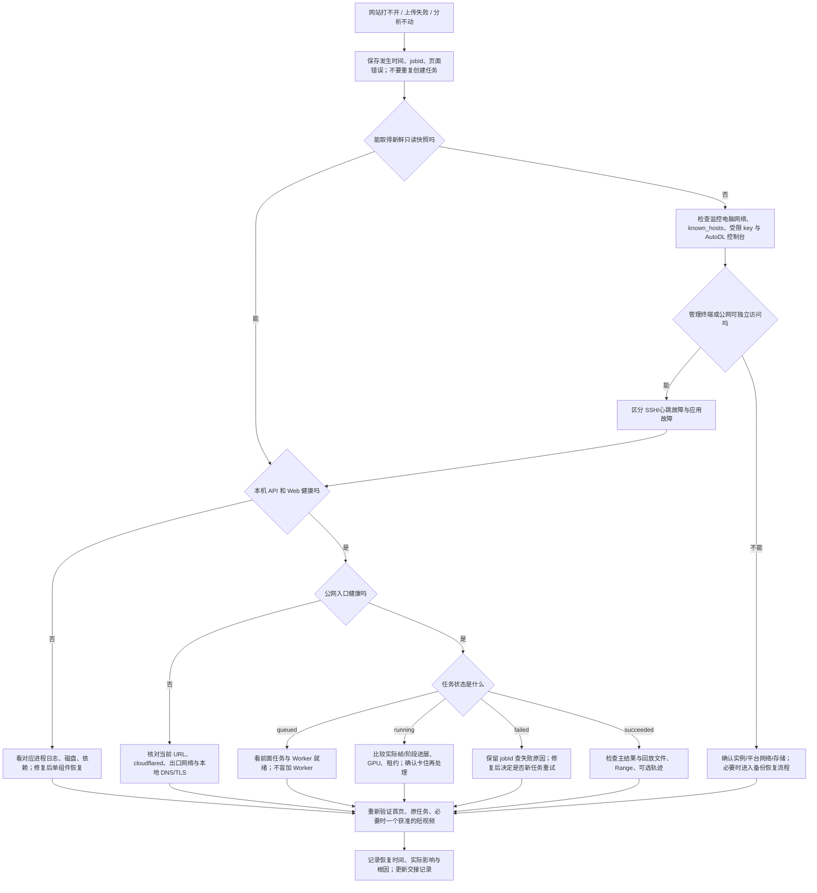

<a id="section-g-7"></a>

### G.7 具体故障 runbook

<a id="section-g-7-1"></a>

#### G.7.1 当前交接阻碍：SSH 监控返回 offline

先把它描述成“监控访问失败”，不要直接写“服务器关机”。由管理员在 AutoDL 控制台核对实例运行状态、连接地址/端口是否变化、平台公告和存储是否仍挂载。再用独立网络访问最后已知公网地址，判断网站是否仍响应；旧地址失效本身也不能证明数据丢失。

让 Codex 在本机检查系统时间、SSH 主机指纹登记、受限 key 的存在与权限、网络/代理连接，但不要输出私钥内容。主机密钥变化必须从平台或管理员可信渠道核实，不能切换为自动接受未知 key 或关闭严格校验来“修好”。SSH banner EOF 可能来自链路、入口、平台或服务端限制，需进一步证据才能定位。

恢复后读取新鲜快照，核对生成时间、五进程、本地健康、公网 URL、任务和磁盘，再解除交接阻碍。保留原来的 `heartbeat-state.json`，不要为了消除告警直接删除历史状态。

<a id="section-g-7-2"></a>

#### G.7.2 公网网站打不开，但本地 API/Web 健康

1. 用 `manage.sh url` 取得当前地址，不沿用聊天里保存的旧随机域名。
2. 查看 cloudflared 状态与最新日志，确认它连接的是 `127.0.0.1:8000`，仍使用预设的 HTTP2 出站连接。
3. 从 AutoDL 或独立网络测试当前公网地址。如果多处都失败，检查平台出口和隧道；只重启 tunnel 会换域名，需记录并通知使用者。
4. 如果只有某台电脑失败，检查该电脑 DNS、代理、Clash/TUN。此前出现过 fake-IP 返回 `198.18.*`、TLS 连接异常，而使用经核实的 Cloudflare 实际地址 `curl --resolve` 后成功的情况。
5. 只有“常规访问失败、同一主机名用已核实 IP 的 `--resolve` 成功”等证据成立时，才优先处理本地 DNS/代理。不要把所有 TLS 失败都归咎于 Clash；不要使用 `-k` 或关闭证书验证。

不要将某个 Cloudflare IP 永久写入 hosts 来代替正确 DNS。诊断用 IP 和随机域名都有时效，需要当时核实。

<a id="section-g-7-3"></a>

#### G.7.3 `RUNNING` 但页面 502/503，或 `FATAL/BACKOFF`

按照出错组件看日志。常见方向包括：前端没有构建产物、Python 依赖损坏、模型/注册表路径缺失、内部 API key 不一致、端口占用、磁盘空间不足。`analysis_service_not_configured` / `invalid_analysis_origin` 是 Web 网关配置问题；`analysis_service_unavailable` 表示 Web 不能完成到 API 的请求，并不直接证明 GPU 故障。

API “存活”与“就绪”不同：HTTP 服务启动不代表模型、注册表和依赖完整。修复后既要看进程，也要看就绪和一次业务读取。不要在运行中的 `.venv` 随意执行 `pip install -U` 或替换系统 Torch；先对照已验证环境和受影响依赖。

内部 API key 仍应存在。免网页登录是用户明确要求，不应通过恢复 Basic Auth、给网页加账号密码来掩盖内部配置错误。服务端 key 不匹配应在受保护环境中核对、同步或轮换，不能把 key 发送到浏览器。

<a id="section-g-7-4"></a>

#### G.7.4 一直排队

先看 `queued`、`running` 数量以及 Worker 是否完成模型加载。当前一个 Worker 串行分析，一个长任务会让后续任务等待；排队不等于丢失。查看前一个任务的实际帧进展和 GPU 利用情况。

如果没有运行任务但队列不被领取，检查 Worker 日志、模型路径、配置、数据库是否一致。不要在旁边手动启动第二个 `rallymate-worker`，这可能争用显存、破坏现有资源假设，并扩大过期租约接管问题。

当前没有已经实现的全局排队长度上限和公开公平排队保证。业务增长后需要新增准入控制，不能仅告诉用户无限等待。

<a id="section-g-7-5"></a>

#### G.7.5 运行很久或 `job_progress_stalled`

记录 jobId、阶段、processed_frames、percent、last_progress_seconds、last_update_seconds、lease_expired、GPU 和磁盘。比较至少两个时间点的进度，而不是只看进程存在或某个“更新时间”变化。

如果帧数/阶段在推进，只是视频长或高清补检耗时，先继续观察；不要因为超过 15 分钟就取消。若确实长期无进展，排查 GPU 调用、视频解码、输出编码、文件系统和内存，再由管理员决定是否结束当前 Worker。

重启 Worker 会影响当前任务，原任务可能要等租约到期再被重新认领。不要直接 SQL 把状态改为 `queued`、删除 lease 或减少 attempts；在旧执行者仍可能工作时，这会造成重复分析和写结果竞争。确需人工修复状态时，应先备份并确认没有旧 Worker、列明受影响任务、制定一次性迁移和验证方案。

<a id="section-g-7-6"></a>

#### G.7.6 任务显示 failed

保留失败任务与日志，先确定是输入不能解码、模型依赖、CUDA OOM、磁盘不足、注册表缺失还是其他原因。不要反复点击上传把同一根因变成许多失败任务。

`max_attempts=2` 不会自动重试普通异常。修复原因后，若确需重新分析，可在用户同意使用其视频的范围内创建一个新任务，记录旧/新 jobId 对应关系。当前没有面向用户的通用“原任务恢复到任意帧”的管理 API。

<a id="section-g-7-7"></a>

#### G.7.7 上传中断或返回 404/410/409/413/422/429/507

- **暂时断网/408/5xx**：先等客户端有限退避；再次选择同一文件并继续上传。页面曾拿到 jobId 时先查任务，不立即重传。
- **404/410**：会话不存在或超过保留时间。客户端会为相应情况建立新会话；确认原文件仍在，必要时重新上传。原任务若已经入队，应该按 jobId 读取。
- **409**：可能是文件/选项与会话不一致、同一块内容冲突、缺块或合并校验发现损坏。核对是否选了同一文件，继续补齐缺块；不能忽略校验强行合并。
- **413**：单文件、视频时长或分块长度超限。默认总文件 2 GiB、时长 30 分钟、单块 4 MiB，具体看有效配置和返回来源。减小视频范围或按明确授权调整上限，不能仅关掉全部限制。
- **415/422**：格式、解码、分析参数或 SHA 校验有问题。先用可播放且支持的视频与合法选项定位，不把未知内容当视频继续执行。
- **429**：上传会话过多，或建议服务/外部入口限流。要看是哪个请求返回；上传默认最多 64 个活跃未完成会话并不是 64 个用户账户。
- **507**：磁盘预留检查失败。先看存储和待完成会话，安全清理临时残留或扩容；不要删数据库、原视频或结果来立即腾空间。

服务器为分块、拼接、持久原视频共存预留逻辑预算：新会话要求空闲空间至少为 `3 × (新文件声明大小 + 活跃会话声明大小之和) + 512 MiB`。这是创建时的检查，不是真正给磁盘预分配不可争用空间；其他进程写文件和推理输出仍可能填满磁盘。旧 multipart `/v1/jobs` 仍存在，没有这套分块会话准入预算，需要在后续限流统一设计中处理。

<a id="section-g-7-8"></a>

#### G.7.8 磁盘告警、manifest 损坏、临时文件越来越多

先看总容量、空闲和增长趋势，区分原视频、推理产物、日志、旧构建、回滚包和上传临时块。日志已经轮转，但原视频和最终结果没有在此方案中配置自动到期删除。

monitor 会按 UploadStore 锁规则处理超过 24 小时的未完成分块及完成后的暂存残留。清理超时或锁等待时延后，不会绕过锁删除。`eligible_sessions_checked` 是符合条件的会话检查数量，不是已删除的文件数量。

损坏 manifest 会触发异常，需要 Codex 在受控环境中核查受影响会话，不能用批量 `rm -rf uploads` 解决。先备份可用状态、确认没有活动上传，然后制定仅针对已确认临时残留的清单。`clean_legacy_replays.py` 是一次性修复旧回放像素的工具，不是磁盘清理脚本；它会保留旧视频备份，反而可能增加占用。

<a id="section-g-7-9"></a>

#### G.7.9 GPU OOM、模型加载失败、NumPy/MMCV 二进制报错

当前部署使用单 Worker 和默认 4 个 CPU 线程池配额，不要通过同时启动多个 Worker 试图“加速”。查看显存是否被本项目之外的进程使用、是否出现更高分辨率/更长任务，再核对模型权重和实际运行环境。

已验证的 AutoDL 基线：Ubuntu 22.04、Python 3.12.3、镜像 Torch 2.8.0+cu128 / torchvision 0.23.0+cu128、NumPy 1.26.4、OpenCV 4.11.0.86、ultralytics 8.4.21、mmengine 0.10.7、mmcv-lite 2.1.0、mmpose 1.3.2、mmdet 3.3.0、scipy 1.17.1、setuptools 69.5.1、xtcocotools 1.14.3；Node 22.23.2、cloudflared 2026.9.1、ffmpeg 4.4.2。完整重建顺序见[部署说明](../deploy/autodl/README.md)和[约束文件](../deploy/autodl/requirements-constraints.txt)。

这些是历史已验证版本，不是永远适配所有 AutoDL 镜像的承诺。约束文件也不是完整传递依赖锁。重建时先确认镜像 CUDA/Torch，再建立隔离环境；按文档先准备 NumPy/Cython/setuptools/wheel，再安装姿态依赖，避免不匹配 NumPy ABI。Supervisor 需按文档安装到 `.venv/bin` 生成入口。不要把 Docker 示例的依赖版本直接覆盖到这套环境。

<a id="section-g-7-10"></a>

#### G.7.10 任务 succeeded，但视频播放或轨迹失败

先查主结果是否完整、jobId 是否一致，再确认回放文件存在、编码可供浏览器播放、网关是否传递 Range/Content-Range。此前已验证 H.264 / yuv420p 回放和 HTTP 206 范围读取，但这只证明当时样本通过，不保证任何新输入都无问题。

部分轨迹/技术评估失败可降级，不要丢弃已完成的动作分析。先重读原任务，保留错误时间与请求路径。旧回放修复脚本默认只输出计划；`--apply` 才修改视频，且会核对来源帧区间、原始证据、帧数和编码并保留 legacy 备份。必须由管理员在维护窗口、明确任务范围下执行，不能将其作为每次播放失败的自动操作。

<a id="section-g-7-11"></a>

#### G.7.11 MiMo 不给个性化建议，或 advice 返回 429

最后验证发布明确关闭 MiMo 付费调用。`providerStatus=disabled` 是该部署的预期边界；已有视频证据说明仍能展示。无视频、结果不可读、当前动作类别证据不足，也会在本地返回解释而不调用模型。

建议接口当前每个来源标识每 10 分钟最多 5 次、每个 Web 进程最多 2 个在处理请求，来源桶最多 2000 个。计数发生在读取/验证业务正文之前，因此无效请求、无视频说明也可能占这层次数；这不是只对“已计费调用”限次。

没有可信 Cloudflare 来源头时，多个请求可能归为同一个 `anonymous` 桶。带着任意伪造 IP 头直接访问则不能被当成有效身份。反向代理或固定域名调整之后，必须重新核对来源头信任链和 Origin，而不是简单取消限流。

不要为恢复建议而将 `MIMO_ADVICE_ENABLED` 改为 1。启用前需要完成任务授权、持久预算、计费凭据类型核实和有限验收，详见[MiMo 实施计划](../deploy/autodl/MIMO_PROXY_PLAN.md)。

<a id="section-g-8"></a>

### G.8 目前的限制和防滥用边界

<a id="section-g-8-1"></a>

#### G.8.1 已有、可查证的限制

1. API 单视频默认 2 GiB、30 分钟；人数参数 1–4，默认 2。此为请求上限，不是用户配额。
2. 续传固定 4 MiB 块，浏览器 2 块并发；服务端最多 64 个活跃未完成会话，24 小时过期，并执行磁盘预算检查。
3. Web 网关仅转发明确的业务读取、上传和指定产物路径；服务端注入内部 API key，禁止上游重定向；读写有超时。
4. 写操作检查 Origin/Sec-Fetch-Site，降低浏览器跨站调用风险；这些检查不能证明脚本调用者身份或任务归属。
5. advice 请求体最多 8000 字节，用户描述最多 600 字符；有来源内存计数与单进程并发限制，模型输出上限参数为 500 token，但当前默认关闭。
6. 模型上游只允许已定义的官方地址与服务端构造消息，不是允许客户端任意指定 URL、密钥、messages 的公开通用反代。

<a id="section-g-8-2"></a>

#### G.8.2 尚未实现、不能向朋友承诺已有的能力

- 用户/匿名会话对具体任务的所有权授权，公开 jobId 与付费权限分离。
- 跨重启、跨实例的持久调用额度、GPU 秒配额和付费预算账本。
- 全局排队上限、按来源/会话公平排队、明确的任务取消和管理员重试接口。
- 上传总流量/日配额和长期存储配额；结果自动保留期与可验证删除策略。
- Turnstile 的完整服务端校验、边缘 WAF/限流的实际配置及验收。
- 真正多机 HA、自动跨实例故障转移、异地备份与灾备演练。

网站免账号密码意味着任何得到入口的人都可能提交任务，并可读取知道任务编号的相关结果。随机 UUID 与随机域名可以降低被随意猜中的机会，但不能替代任务授权。内部 API key 对浏览器隐藏并不代表公开上传已经具备计费级防刷。

<a id="section-g-8-3"></a>

#### G.8.3 Nginx 限流是可参考模板，不是现网事实

Nginx 示例包含按来源地址的 30 次/分钟普通请求、120 次/分钟读取、2 次/分钟 `/v1/jobs` 上传及 burst/连接数配置。这些只存在于模板中，**当前 AutoDL 的 cloudflared → Web → API 路径没有启用该 Nginx**。

此外，示例的 `/v1/jobs` 路径规则不能直接当作新分块上传协议的完整防刷：每个大文件需要多次 `/v1/uploads/.../chunks/...` 请求；简单将每一块按“新 GPU 任务”计费或限到每分钟两次，会损坏正常上传。示例宽泛 `/v1/` 代理也需在真正采用前收窄。未来应分别限制“创建会话/提交新任务”“分块字节流”“状态查询/回放”“付费建议”。

<a id="section-g-9"></a>

### G.9 限流和预算的建议方案（未实施）

以下是接手后可以排期的设计建议，不表示现在已有这些控制，也不是用户批准任何费用。优先保持免账号密码的使用要求，通过匿名会话、任务凭证和全局资源控制实现有限授权；不要擅自恢复网页登录。

<a id="section-g-9-1"></a>

#### G.9.1 先增加可以阻止成本失控的硬边界

1. 在服务器侧设置新任务准入开关、最大排队数、单会话未完成任务数、全局每天允许的视频总分钟数/字节数。具体数值由真实压力测试和 GPU 预算确定，不能凭现有一个短样本推算无限吞吐。
2. 采用统一准入层覆盖分块完成与旧 multipart 上传。否则只限制新协议，旧 `/v1/jobs` 仍可能绕过会话数量和磁盘预算。
3. 创建任务时预留输出所需空间和计算预算；任务完成结算，失败/超时按明确规则处理。不要把“来源 IP 每分钟 N 次”当成每天 GPU 成本的总上限。
4. 写满磁盘前关闭新任务入口并保留查询/下载。当前没有一键只读维护模式，需单独实现，不可宣称已可直接打开某个不存在的开关。
5. 固定域名后，根据业务配置边缘限流/挑战；后台仍要校验，不接受通过伪造 `cf-connecting-ip` 扩大额度。

建议先沿用当前单 Worker 的分析并发，再根据显存峰值、编码 CPU、磁盘吞吐和排队延迟测量决定扩容。不要把分块并发 2、建议并发 2、GPU 并发 1混为同一限制。

<a id="section-g-9-2"></a>

#### G.9.2 MiMo 付费启用的最低条件

按[现有计划](../deploy/autodl/MIMO_PROXY_PLAN.md)，需要服务端匿名会话、会话与任务绑定、短期授权凭证与防重放、按任务/证据版本缓存、事务内原子预留预算、请求幂等、成功后的 usage 结算和未知费用对账。

当前的内存 Map 重启会清空、多个 Web 进程各有一份，不能覆盖分散来源或多实例。每日金额/token 硬上限必须持久保存，并由项目拥有者明确批准；没有配置硬上限就继续关闭。可以同时设置供应商账户预算，但不能替代本项目的共享账本。

上游超时或连接中断，不代表供应商没有处理或没有计费。预算不能在所有超时后立即无条件退款再自动重试；应保守保留预留量并对账。当前“输出最多 500 token”也不是完整金额上限，输入、失败、不确定请求和供应商计费规则都需要核实。

<a id="section-g-9-3"></a>

#### G.9.3 成本表应该记录什么

让维护者按实际账单记录 GPU 实例开机小时、存储容量/快照、网络费用、模型 API、固定域名/监控/备份成本。平台价格会变化，本章不提供未核实的单价，也不承诺某个视频固定花多少钱。

可用以下口径制定预算：

`月成本 = 实例计费小时 × 实际小时单价 + 存储/备份/网络实付费用 + 模型 API 实付费用 + 域名/监控等固定费用`

分析耗时要分清排队、Worker 耗时、核心流水线、上传/合并和下载。不同分辨率、画面密度、模型版本会改变耗时。已有一次 30.765 秒/923 帧样本的 Worker 耗时约 95.95 秒属于历史实测点，不是速度 SLA 或可用来保证批量成本的常数。

告警建议至少覆盖日预算接近上限、排队长度/等待时长、存储增长、持续 GPU 异常、供应商错误率；达到硬上限停止新付费工作，并保留已获得的证据查看。任何新增告警通道和付费监控服务均应明确负责人、触达方式和费用。

<a id="section-g-10"></a>

### G.10 备份：当前缺口与可执行的建立流程

<a id="section-g-10-1"></a>

#### G.10.1 当前不应声称已经具备的保障

原视频、数据库、结果和历史发布包主要保存在同一台 AutoDL 机器的数据目录。Supervisor 重启、SQLite WAL、原子写入和 24 小时分块续传都不是备份。服务器上与应用同盘的 `pre-advice-...tar.gz` 能帮助代码回滚，但同一存储失效时也可能一起丢失。

本轮未发现可以证明“已按计划异地备份、成功校验并恢复演练”的完整记录。因此 **RPO 和 RTO 尚未建立并验证**：

- RPO 表示故障时最多可能丢失多久的数据。只有明确备份周期、实际成功时间和可恢复性，才能给出目标并检查达标。
- RTO 表示从故障发生到业务恢复需要多久。GPU 资源可得性、模型下载、环境重建、数据量、网络和人工响应都会影响它，必须通过演练测量。

不能将 60 秒监控周期当成 RPO，也不能将 Supervisor 的 60 秒启动检查当成 RTO。即使准备每天备份，也只能先称“计划每日备份”，未演练前不能承诺“最多丢一天、几分钟恢复”。

<a id="section-g-10-2"></a>

#### G.10.2 应保存的内容

完整恢复包应覆盖：

1. **运行代码**：精确发布文件及哈希、前后端配置示例、构建锁文件、Python 约束、部署脚本、实际版本清单。记录 Git 提交与额外未提交补丁/未跟踪源码，分别保存。
2. **模型与规则**：检测/姿态权重、preset、配置、注册表、校准及信任文件；保存来源和 SHA-256。是否有分发和商业使用权需另行核实，研发模式不等于已获得商业授权。
3. **业务数据**：一致的 SQLite 数据库、uploads 原视频、requests 参数、runs 结果与必要缓存。只备份报告 Markdown/HTML不能恢复完整推理证据。
4. **运行记录**：重要发布/回滚记录、故障记录、适量监控历史。socket、PID 等瞬态文件不应恢复为正在使用的运行状态。
5. **凭据与平台配置**：与代码/数据包分开加密保存，明确谁能解密；包括必要的环境配置、管理员与受限监控身份、平台开机设置和存储信息。普通分享包不能包含这些内容。

未完成上传分块可以按业务需要决定是否备份：要保留续传能力则需 manifest 与对应块一起、并保持一致；只备份 manifest 没有块不能恢复上传。原视频与最终结果的保留政策也应与用户约定，而不是无限增长后临时删除。

<a id="section-g-10-3"></a>

#### G.10.3 推荐先建立一次停写备份

这是待执行的维护方案，当前没有已经自动运行的备份脚本。让 Codex 准备具体清单并由管理员在维护窗口执行：

1. 告知暂时暂停新上传。当前缺少应用级维护模式，需要临时控制公网入口/写请求或停止相关服务，且记录是否会导致随机域名变化。
2. 等 `queued=0` 且 `running=0`，再确认没有正在上传/合并的请求。先停新写入再等队列，避免检查完又来新任务。
3. 停止 API/Worker 等写业务数据的进程；若一并复制 `.chunks`，也停止 monitor 的清理。不要让备份时一边复制临时块、一边清理它们。
4. 使用 SQLite 官方备份接口生成一致数据库副本，或在所有写者确实停止后采用经校验的离线复制。数据库处于 WAL 模式时，运行中只复制 `jobs.sqlite3` 而忽略一致性会遗漏数据；不应按经验手动删 `-wal`/`-shm`。
5. 保存对应原视频、请求和结果，以及发布文件清单。为每个文件和整个清单计算校验和；将含真实用户视频的备份加密传到独立存储位置，验证上传成功及校验一致。
6. 恢复服务，核对队列、读取一个已完成任务及回放、取得当前 URL，再结束维护。
7. 记录备份 ID、时间、数据范围、大小、哈希、独立存储位置、密钥保管人和恢复验证结果。记录可以说明位置，不能包含解密密钥本身。

后续若需要不中断服务的连续备份，可设计 SQLite 在线备份配合对象清单、不可变产物、任务提交边界和增量同步。这需要实现和演练，不能仅加一个定时压缩命令就宣称得到一致的在线备份。

<a id="section-g-10-4"></a>

#### G.10.4 恢复演练必须证明“能用”

在独立测试实例/目录恢复，不能用尚未核实的旧数据直接覆盖当前生产目录。先确认备份完整和校验正确，再重建匹配环境。数据库与任务参数含绝对路径，优先保持已验证的根路径；若迁移路径，需受控转换数据库、request JSON 和模型/注册表引用，并保留转换日志。

恢复时先禁止公网新增任务、保持 MiMo 关闭。检查 SQLite 完整性、状态数量、抽样 jobId 与文件关联；抽样读取主结果、轨迹和回放。确认原视频存在、逐帧证据与摘要对应，避免“网页可打开但历史文件全丢了”。

对于备份里 `running` 的任务，不能假装它们已经完成；需要确认旧实例不会继续执行，再依照租约/尝试次数恢复或制定明确重试方案。测试通过后才开放新上传，运行一个获准使用的短视频，验证上传、入队、分析、报告和回放闭环。

记录实际花费时间和遇到的缺失，才有依据制定 RTO。至少演练一次“原实例不可用、只有独立备份”的场景，否则只是同机复制验证。

<a id="section-g-11"></a>

### G.11 升级与回滚：保留现有证据和任务

<a id="section-g-11-1"></a>

#### G.11.1 每次发布的最小流程

1. 确认当前远程可访问并有新鲜健康快照。当前 09-27 失联尚未解决时，不能安排盲目热更。
2. 明确需求和变更范围，列出精确文件清单。保留用户未提交改动；不要 `git reset --hard`、`git clean` 或打包整个杂乱工作区来获得“干净环境”。
3. 记录当前版本、配置字段的非敏感摘要、构建产物和回滚包。凭据保持服务器受限权限，不混进发布包。
4. 在暂存目录构建，执行与变更相关的测试、类型检查和 lint。前端生产需要 `npm ci` 与 `npm run build`；`npm run test` 本身会先构建，要避免无意义重复。后端变更运行对应测试（命令见 H.4），上传/队列/监控变更分别覆盖相关恢复场景。
5. 核对上传文件和预期文件 SHA-256。依赖更改、数据库迁移和模型更新需要单独标明，不伪装成普通文案发布。
6. 控制新写入并确认无运行/排队任务，再激活需要更新的组件；仅 Web 改动就只重启 Web，不重启隧道和 Worker。
7. 核对进程、本地 API/Web、当前公网入口、已有任务及回放。必要的真实推理验证使用明确可用的视频，记录任务和实际结果；MiMo 仍保持关闭，除非另行完成启用要求。
8. 记录发布编号、时间、文件清单、测试、重启组件、域名是否变化、回滚材料位置和验收结果。

当前不是具备自动蓝绿切换、流量分批发布和自动回滚的发布平台；这些步骤需要 Codex 和管理员按具体变更执行。不要因服务器目录下有几个历史包就声称具备一键原子发布。

<a id="section-g-11-2"></a>

#### G.11.2 已知最近一次可参考的回滚材料

`20260924T130527Z` 的记录中包含：

- `service_data/ops/releases/pre-advice-20260924T130527Z.tar.gz`。
- 同目录受保护的配置备份，内容不能输出到聊天。
- `scoring-demo-web/dist-before-20260924T130527Z`。

这些材料的今日存在性与完整性需在恢复远程访问后重新检查。不要照着文件名直接解压覆盖：先检查归档清单是否只含预期相对路径，核对哈希、目标目录和当前变更，确认是否需要配套构建产物/依赖。

<a id="section-g-11-3"></a>

#### G.11.3 回滚的边界

普通 Web 代码回滚应尽量只恢复代码与匹配构建，保留数据库和已生成的视频结果。不要为修一个按钮把整份旧 `service_data` 覆盖回来，那会丢失发布后新增任务。

数据库结构或结果 schema 变更时，旧代码未必能读新数据，必须提前有前后版本兼容判断和迁移回退方案。恢复旧数据库属于数据恢复，影响范围与代码回滚不同，需要单独确认恢复时间点和可能丢失的数据。

如果故障仅来自 MiMo 外部调用，关闭开关并重启需要读取配置的 Web 可退回确定性证据解释，视频推理和已完成结果无需删除。未来若建立预算账本，回滚时也不能清空账本。

<a id="section-g-12"></a>

### G.12 凭据与账户交接

交接文档只记录“什么权限、放在哪里、由谁负责、如何轮换与验证”，不收录任何口令、私钥或 API key 原文。

<a id="section-g-12-1"></a>

#### G.12.1 需要分开的权限

- **AutoDL 账户和实例管理**：开关机、充值、存储、SSH 地址、平台开机命令。由接手人通过平台支持的方式取得权限。
- **管理员 SSH**：可以改代码、读数据、安装软件和重启服务；使用接手者自己的管理密钥。原来在聊天中提供过的管理密码，不应继续转发或作为长期共享凭据。
- **只读监控 SSH**：独立 key，仅 forced command 返回脱敏快照。它不能 SFTP、开 shell 或部署；“监控连得上”不等于接手者已取得管理权。
- **内部 `RALLYMATE_API_KEY`**：API 与 Web 网关之间使用，仍然需要。轮换时同时更新相关服务配置并控制重启顺序，避免一边换了另一边没换产生 401/403。
- **Cloudflare**：当前 Quick Tunnel 与将来自有域名/命名隧道是不同管理方式。未来命名隧道 token、域名 DNS 权限不能放进前端；若当前并无命名隧道，不要要求凭空交接不存在的 tunnel token。
- **MiMo 按量账户/凭据**：当前服务默认关闭，是否持有可用于该网站的计费凭据需要单独核实，不能以“本机有一个 key”当成已获许可和预算。
- **备份加密密钥与独立存储权限**：新方案建立后单独交接；能拿到加密包但没有解密权限不等于完成备份交接。

<a id="section-g-12-2"></a>

#### G.12.2 交接顺序

1. 新维护者先获得自己的访问，核实主机身份；只读监控密钥在他自己的电脑生成/保管，管理员安装对应受限公钥。
2. 验证正常 snapshot、执行无关命令仍只返回 snapshot，以及端口转发被拒绝；确认同一公钥没有其他无约束条目。
3. 管理权限按实际需要测试，核对服务目录与备份操作能力，不把私钥/密码复制进报告。
4. 约定迁移监控自动化的时间。旧电脑上的心跳和去重状态不会自动迁移到新电脑；新自动化需明确“仅有意义变化通知、稳定时保持安静”，并避免双份重复通知。
5. 在新维护者已经验证访问、服务健康且有回退通道后，轮换共享密码/内部密钥、撤销旧管理员和监控 key，记录负责人。不要先删唯一可用访问再开始交接。

`runtime.env` 会被 shell `source`，不仅是任意文本数据，因此只应由可信管理员维护。Git 忽略不等于加密，也不意味着压缩整个目录分享时会自动排除秘密。打包交接文件必须使用明确白名单，并检查 `.dev.vars`、`.env*`、私钥和带真实媒体的目录没有混入普通源码包。

<a id="section-g-13"></a>

### G.13 冗余、容灾与真正多机 HA 的后续路线（未实施）

“进程自动重启”是单机恢复；“同一台机器另存一份文件”是本地副本；“异地备份”可以帮助灾后重建；“多机 HA”需要故障期间由另一节点接管服务。四者不能互相替代。

<a id="section-g-13-1"></a>

#### G.13.1 优先顺序建议

第一步建立经过恢复演练的独立备份、明确数据保留、固定域名与独立告警，通常比立即增加复杂多机编排更有助于当前交接。命名隧道和固定域名可以减少入口变化以及浏览器存储失效问题，但单台 AutoDL 故障时仍会中断。

第二步完善准入控制、队列长度限制、任务所有权、预算账本和可观测性。这些控制先在单实例做正确，再复制到多实例。不要把进程内 Map 和本地 SQLite 文件直接复制到多个节点当共享额度。

第三步才设计多机架构：

- 将原视频和产物放到受控共享对象存储，数据库保存可迁移引用，而不是机器绝对路径；制定一致的对象提交/清理和权限策略。
- 使用适合多实例的共享数据库/队列，任务认领有过期租约、所有权令牌与旧执行者隔离；产物提交幂等，避免两个 Worker 同时覆盖同一任务。
- 多个无状态 Web/API 副本通过稳定入口路由；多个 GPU Worker 按资源认领，拥有显存/CPU/存储的准入约束。
- 设计节点不可用时的接管、重试预算、结果去重、恢复后旧节点处理，以及滚动升级的 schema 兼容。
- 将外部健康检查和告警放在不同故障域；定义谁值守、什么时候升级处理。
- 定期进行主机故障、网络分区、存储丢失、数据库恢复、凭据失效和预算并发测试。

<a id="section-g-13-2"></a>

#### G.13.2 规划示意，不能误认为已上线

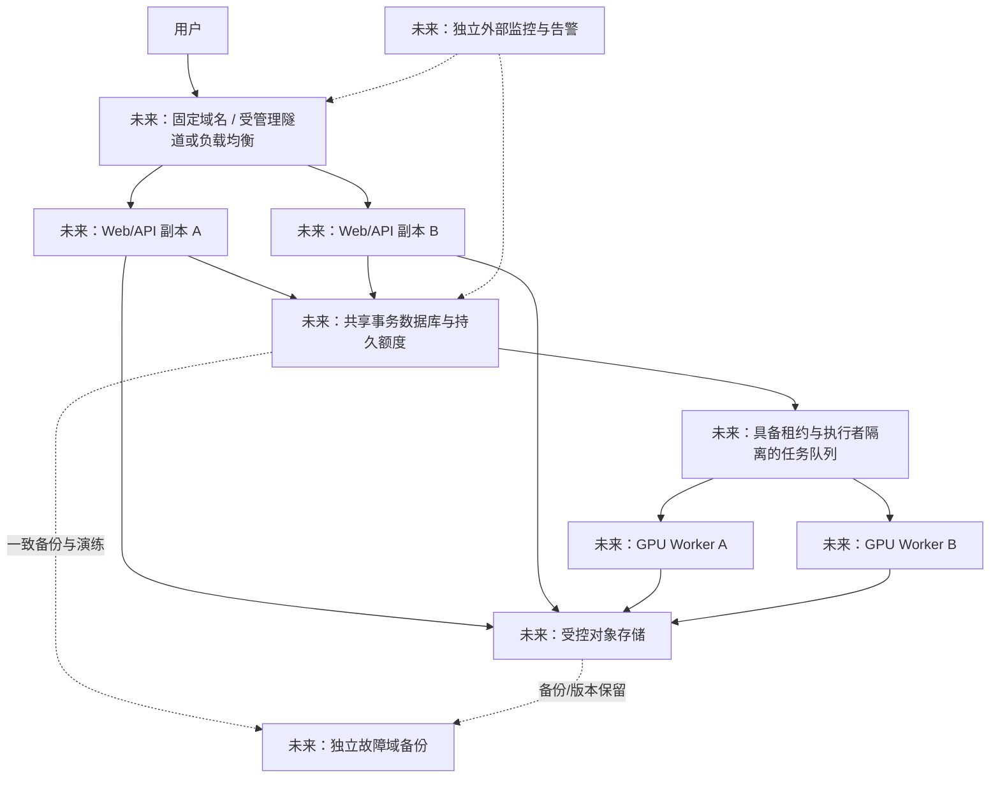

备用节点必须事先验证模型版本、规则文件、GPU 驱动和数据访问兼容性。仅复制源码、买第二台 GPU，或让两个 cloudflared 连接同一入口，都不足以证明整条视频业务具有 HA。

[Cloudflare 隧道可用性文档](https://developers.cloudflare.com/cloudflare-one/networks/connectors/cloudflare-tunnel/configure-tunnels/tunnel-availability/)中的 tunnel replicas 提供更多连接入口，不承担轮询等智能流量调度，也不会替项目复制 SQLite、视频或任务状态。即便将来配置 replicas，后端数据和 Worker 的接管机制仍需单独实现与验证。

未来 RPO/RTO 应由业务能接受的数据损失和恢复等待时间决定，再根据备份频率、复制方式和演练结果填写。不能把“云平台”“Cloudflare”“容器”这些名称本身当作可用性承诺。

<a id="section-g-14"></a>

### G.14 给不会代码的接手者的 Codex 请求模板

<a id="section-g-14-1"></a>

#### G.14.1 先只读确认现场

> 请先阅读交接文档与 deploy/autodl/MONITORING.md。不要输出 .env、runtime.env、私钥或原始凭据，不部署、不重启。检查本机项目的 Git 提交、未提交状态，以及已有只读远程监控入口。分别报告当前能够确认的状态、最后成功时间和无法确认的部分。若 SSH 失败，不要直接断言实例关机。请告诉我下一步最小诊断动作。

<a id="section-g-14-2"></a>

#### G.14.2 排查一个卡住任务

> 请排查任务【填 jobId】。先读取原任务状态和监控快照，比较两次 processed_frames、phase、percent、last_progress_seconds 与租约，不要重复上传、不要改 SQLite 状态、不要自动增加 Worker。请区分页面连接问题、正常排队、持续处理和真实卡住。需要重启时先列明受影响任务、为什么重启以及如何保留数据。

<a id="section-g-14-3"></a>

#### G.14.3 准备一次最小发布

> 我要发布【具体功能】。请保留其他未提交改动，只准备必要文件清单、哈希、对应测试与暂存构建。先确认最新云端健康、任务清空和可用回滚材料。MiMo 保持关闭，不携带本机秘密文件，不上传整个工作区。根据变更只重启必要组件，保留 Cloudflare 隧道；完成后核验首页、既有任务、报告和回放，并记录发布编号。

<a id="section-g-14-4"></a>

#### G.14.4 建立首份可恢复备份

> 请按交接文档准备一份一致备份方案，先列出业务数据、SQLite、模型/规则、精确代码发布、受保护配置分别怎样保存。不要读取或展示密钥，不删除原始数据。考虑 WAL 与上传清理的并发，给出维护窗口和恢复演练步骤。备份目标、保留时间和预算由我提供；未演练前不要承诺 RPO/RTO。

<a id="section-g-14-5"></a>

#### G.14.5 开启付费建议前的实现任务

> 保持 MIMO_ADVICE_ENABLED=0。先审查现有 MiMo 计划，实现免登录前提下的会话/任务授权、持久全局预算、原子预留、幂等和超时对账，并测试重启、多实例、伪造来源、重复请求不能绕过额度。完成后给我明确预算字段、凭据注入位置和一次有限真实调用的验收方案；不要自行启用付费调用。

<a id="section-g-15"></a>

### G.15 运维交接完成的验收清单

- [ ] 09-27 的只读 SSH 失联已有解释或修复，取得新的快照；记录 UTC 与北京时间。
- [ ] 接手者可以通过自己的管理员访问查看服务，通过自己的受限 key 只读监控；主机指纹已核实。
- [ ] 当前公网地址已重新确认，免登录首页、上传/查询、已有结果与回放通过；没有把历史随机域名当固定入口。
- [ ] 精确运行版本与本地未提交内容关系已清楚，代码交接包含必要未跟踪源码，排除秘密和私有视频。
- [ ] 模型、preset、注册表/校准文件、Python/Node/ffmpeg 环境及版本都有清单和校验方式。
- [ ] 当前队列、磁盘、GPU 与告警状态已记录；知道只有一个 Worker，并理解租约恢复与普通失败的区别。
- [ ] MiMo 默认关闭状态已重新核实，持久预算与任务授权仍标记待实施。
- [ ] 自动化迁移到明确的维护者设备或独立监控端，稳定时不刷屏，离线/恢复/新任务事件能够通知。
- [ ] 至少一份独立备份已验证，并在独立环境演练恢复；否则在交接签收中明确保留此缺口。
- [ ] 升级前备份、精确发布、最小重启与回滚流程由接手者实际走读，清楚不会拿旧数据库覆盖新增任务。
- [ ] 原维护者凭据撤销与新维护者费用/存储/数据保留责任已约定，所有明文凭据没有进入文档。

本章的代码依据包括：[启动与管理脚本](../deploy/autodl/manage.sh)、[进程入口](../deploy/autodl/run-process.sh)、[Supervisor 配置](../deploy/autodl/supervisord.conf)、[服务配置](../src/rallymate_service/config.py)、[任务数据库](../src/rallymate_service/database.py)、[Worker](../src/rallymate_service/worker.py)、[上传存储](../src/rallymate_service/uploads.py)、[API](../src/rallymate_service/api.py)、[网页网关](../scoring-demo-web/worker/gateway.ts)、[上传客户端](../scoring-demo-web/app/lib/resumable-upload.ts)、[结果读取会话](../scoring-demo-web/app/lib/analysis-session.ts)、[云端监控](../deploy/autodl/monitor.py)、[本机只读检查](../deploy/autodl/check_remote.py)、[建议接口](../scoring-demo-web/app/api/advice/route.ts)及其对应测试。后续代码调整了数值或语义时，应同步更新本章，不以旧文档覆盖新代码事实。


<a id="section-g-16"></a>

### G.16 下一阶段可落地的控制协议（全部属于未实施方案）

这一节把前述规划进一步写成开发约定，方便接手者让 Codex 拆任务。**以下表名、字段和接口是建议设计，当前程序没有这些能力，也不能通过直接填写这些字段启用它们。** 具体数值要经过容量测试和业务负责人确认；不改变当前免账号密码要求。

<a id="section-g-16-1"></a>

#### G.16.1 入口按业务成本分组，避免一个限流规则误伤所有请求

| 请求组 | 建议计量维度 | 配额不足时的行为 | 不能做的事 |
|---|---|---|---|
| 创建上传会话 | 匿名会话、可信来源、全局活跃数、预留字节 | 429/507，保留既有会话并说明等待原因 | 仅限制创建、却让旧 multipart 无限入队 |
| 传分块 | 每会话在途数、累计有效字节、全局吞吐与磁盘剩余 | 429 + Retry-After；已经确认的块继续有效 | 把每个 4 MiB 块算一次新视频，或每分钟仅允许两块 |
| complete / multipart 入队 | 持久任务配额、队列预计工作量、总计算预算 | 幂等返回既有任务；新任务超额时拒绝 | 重试相同 upload_id 再消耗第二份计算配额 |
| 状态查询 | 每会话/任务读取频率与全局负载 | 建议客户端退避，可返回轻量状态 | 将正常 2 秒轮询简单套进 5 次/10 分钟建议限额 |
| 轨迹/技术派生 | 相同任务与版本合并在途计算、缓存、并发预算 | 优先保留主任务查询，降级可选证据 | 一个页面反复触发同一份大 JSON 重算 |
| 视频回放 | 读取授权、连接数、传输字节、正确 Range | 保留 206 语义；流量超额时明确说明 | 把所有视频都完整读进 Web 内存或破坏拖动播放 |
| 付费建议 | 任务授权、幂等请求、token/金额预留、日总预算 | 保留本地证据解释，停止新的上游调用 | 用可重置 IP/浏览器计数作为全局费用上限 |

建议的配置定义应包括：名称、单位、作用域、默认值、最小/最大值、持久位置、变更生效时机、拒绝代码，以及哪些入口受它约束。不要只写“限流=10”，却不说明是每秒、每分钟、每用户还是每实例。

初期继续以一个 GPU Worker 为基线。队列容量应考虑视频时长和预计计算量，不能只数文件个数：一个 30 分钟视频与一个 30 秒视频的成本相差很大，当前 2 GiB/30 分钟是输入上限，不是吞吐保证。缺少可靠成本预测时，先采用保守的文件/时长与全局预算组合，再通过实测迭代。

<a id="section-g-16-2"></a>

#### G.16.2 建议新增的持久数据结构

| 建议表/对象 | 核心字段 | 必须满足的约束 |
|---|---|---|
| 匿名会话 `sessions` | session_hash、created_at、expires_at、revoked_at | 不保存明文会话凭证；服务端生成，Cookie 仅用于绑定 |
| 任务归属 `job_grants` | job_id、session_hash、权限集合、created_at | 分享读取与付费调用分开；不能“知道 UUID 就抢占所有权” |
| 准入账本 `job_admissions` | submission_id、job_id、reserved_bytes、reserved_compute、state | 同一提交唯一；入队与预算变化有明确事务/补偿边界 |
| 建议请求 `advice_requests` | request_id、nonce_hash、job_id、family、evidence_version、status | nonce/request_id 唯一；参数不一致的重用返回冲突 |
| 预算账本 `budget_ledger` | UTC 日期、作用域、reserved_units、settled_units、version | 原子检查并预留；重启和多进程共享同一权威 |
| 调用结算 `provider_calls` | request_id、provider_request_id、reserved、usage、state、timestamps | 记录 succeeded/failed/unknown；未知计费不直接当免费 |
| 结果缓存 `advice_cache` | 授权范围、job_id、family、证据/提示/模型版本、问题摘要、expires_at | 先授权后查询；摘要使用服务端 HMAC，正文不进普通日志 |

这不是要求马上引入七个独立服务。单机可先在一份私有事务数据库中实现这些职责，再根据确有的扩展需求拆分。表结构确定后补版本化迁移；测试环境用新数据库验证，不直接在生产库手改列。

<a id="section-g-16-3"></a>

#### G.16.3 付费建议的状态机和请求流程

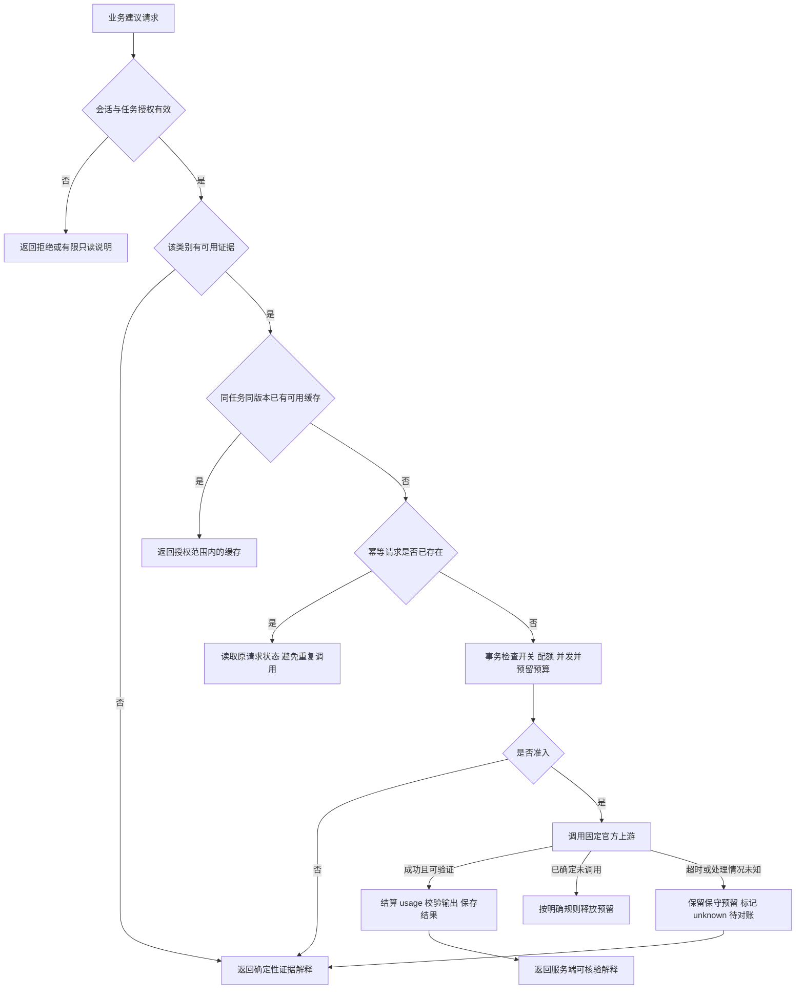

建议状态使用 `accepted/reserved/sending/succeeded/rejected/failed/unknown` 等明确枚举，最终命名需进入正式 schema。页面重试应带同一业务请求 ID，服务端比较规范化参数摘要；不能仅凭浏览器按钮置灰防重复。缓存命中与重放必须先通过同一任务授权。

退款/释放预留条件需要精确定义：本地尚未发出请求而失败，与已发出但未收到上游响应，计费不确定性不同。并发租约过期只释放执行槽位，不自动撤销未知费用。修改模型、提示、证据版本或动作类别会改变缓存键，不能把底线建议返回给接发。

如后续增加“查看建议请求状态”业务接口，应保持在网站自己的业务命名空间，绑定会话授权；**不能为了方便把供应商的通用聊天接口直接映射到公网**。当前不存在此类新增查询路由，编码前要先补契约与测试。

<a id="section-g-16-4"></a>

#### G.16.4 从单机恢复升级为多机冗余的必要条件

1. **先移走单机状态瓶颈。** 上传原件与不可变结果存入受控共享对象存储，API 使用统一队列/数据库，所有实例使用同一授权和配额权威。不能让 A 机数据库显示成功、B 机却没有视频。
2. **租约增加代次。** 每次领取产生递增代次或不可重用的 fencing token；更新进度、完成和发布产物都要求任务 ID 与当前代次匹配。旧 Worker 恢复后不能覆盖新执行者结果。
3. **产物按执行尝试隔离。** 先写 `<job>/<attempt>/`，完成校验后由一次受保护提交公布当前有效结果清单。只对任务状态加锁，却让两个 Worker 写同一 mp4/JSONL 文件，仍会破坏结果。
4. **明确定义至少一次执行。** 故障可能造成同任务重复计算，应让“对用户可见的成功提交”幂等；没有完整证明前不承诺底层计算精确一次。
5. **前端/API可切换，Worker可单独扩容。** 无状态页面服务的负载均衡与 GPU 调度是不同问题；按 GPU 显存、CPU 转码、磁盘和任务成本设置资源槽位。
6. **降级有顺序。** 先降低可选轨迹刷新/派生并发和外部建议调用，再停止新写入，尽量保留已有任务查询与报告下载。不能在过载时统一关闭所有读取，让用户不断重传。
7. **迁移需演练。** 断开一个入口、一台 Worker、数据库连接、对象存储及上游建议，分别验证告警、重试、去重、恢复和预算守恒；故障演练必须在隔离环境或明确维护窗口进行。

<a id="section-g-16-5"></a>

#### G.16.5 这部分方案的完成验收

- [ ] 换 IP、清 Cookie、重启进程、启动第二个实例，都不能扩大已配置的全局预算。
- [ ] 同一 complete、同一建议请求反复重试，不新增第二个任务或不必要的付费请求。
- [ ] 大量分块上传不会饿死任务查询；大量查询不会挤满派生计算槽位。
- [ ] 磁盘、队列或预算不足时，所有创建入口遵守同一准入结果，包括旧 multipart。
- [ ] 旧 Worker 租约失效后，即使恢复执行，也不能发布过期结果。
- [ ] 只拥有分享链接不能获得任务修改或付费权限；旧任务迁移不采用抢占式归属。
- [ ] 超时计费 unknown 有可追踪对账和处置，不会因重启消失。
- [ ] RPO/RTO、实际吞吐和失败恢复时间有演练记录；未验证部分继续写“待验证”。

---

<a id="part-development"></a>
<a id="section-h"></a>

## H. 后续开发、测试与版本演进

<a id="section-h-1"></a>

### H.1 接手后的优先顺序

| 优先级 | 工作 | 原因 | 完成证据 |
|---|---|---|---|
| P0 | 核对 AutoDL 实例与 SSH 映射，恢复只读检查 | 本次监控无法连接，不能建立实时运行基线 | 新鲜快照、真实 API/网页检查，记录检查时间 |
| P0 | 核对源码交付快照与运行资产 | 源码已纳入本次 GitHub 交接提交；云端版本、模型与数据仍需独立核对 | 审查过的文件清单、hash、可重建的版本及运行资产清单 |
| P0 | 单独交接权重、注册表、环境和数据备份 | 只有前端源码无法完整恢复推理 | 新环境加载模型、恢复旧任务和短样本验证 |
| P1 | 建立可恢复备份并演练 | 目前主机/磁盘仍为单点 | 在隔离目录恢复一致的数据库与产物 |
| P1 | 公开上传的配额、排队和资源保护 | 现有匿名站点可触发 GPU 消耗，入口限制不等于总预算 | 多来源/重启/重复提交/磁盘压力测试 |
| P1 | 固定域名与稳定入口 | 随机域名重建后地址和浏览器存储可能变化 | 入口变更、证书、HTTPS、上传和 Range 验证 |
| P1 | 接发与底线的真值样本与误差分析 | 功能缺失可能来自检测、关联、规则或显示，不能盲调阈值 | 带时间点的真值、混淆统计、失败样本复盘 |
| P2 | MiMo 任务授权、持久预算、缓存 | 完成防滥用后才适合开启公开付费调用 | 账本并发、重启、超时、幂等验收 |
| P2 | 持续集成和正式发布脚本 | 当前有些发布工具仍在本机临时目录 | 新机器可执行的受控发布流程 |
| P3 | 多 GPU / 多机扩容与对象存储 | 解决单机吞吐和故障边界，需先有实际容量数据 | 压测、故障注入、恢复与成本评估 |

这些是建议顺序，不代表已经承诺费用、日期或全部开始实施。每次只推进一个可验收的阶段，避免同时改模型、接口、数据库和部署平台后无法定位回归来源。

<a id="section-h-2"></a>

### H.2 变更应落在哪一层

| 用户要求 | 首先检查的代码 | 一般需要的验证 |
|---|---|---|
| 改按钮、文案、排列 | `ScoreLab.tsx`、组件、`globals.css` | 构建、类型、手机/桌面实际布局 |
| 上传断线或很慢 | `resumable-upload.ts`、`gateway.ts`、`uploads.py` | 字节校验、断网恢复、合并幂等、真实传输计时 |
| 推理卡住/状态不更新 | `database.py`、`worker.py`、`monitor.py` | 租约/进度更新、异常恢复、队列状态 |
| 轨迹消失或乱连 | 检测器、`trajectory.py`、`trajectory-viewer.ts` | 同样本轨迹对照、长缺口、静止球、时间同步 |
| 底线/发球/接发没显示 | 原始姿态/球拍/球、`stroke_candidates.py`、`stroke_analysis.py`、assessment、UI | 检测→规则→接口→显示的证据链 |
| 建议夸大/答非所问 | `advice-evidence.ts`、`advice-display.ts`、advice route | 类别隔离、缺证分支、模型非法输出、旧任务切换 |
| 导出的报告错乱 | `report-export.ts`、`ReportExportActions.tsx` | 状态门禁、任务一致、HTML 转义、缺证说明 |
| 公网打不开 | AutoDL、cloudflared、Web、API | 分层健康检查，先判断故障层 |
| 增加正式评分指标 | lifecycle、成熟度、特征资格、校准与独立测试 | 人工真值、版本绑定、门禁和回归 |

<a id="section-h-3"></a>

### H.3 先复现，再修改

建议每个 bug 建一个短记录，内容可以直接交给 Codex：

```text
标题：一句话描述错误
发现时间与时区：
环境：手机型号/浏览器或电脑浏览器，网络类型
入口地址：
jobId / uploadId：
视频时长、大小、分辨率、帧率：
发生阶段：上传 / 合并 / 排队 / 推理 / 编码 / 读取 / 回放 / 报告
希望出现的结果：
实际结果：
最小复现步骤：
截图/视频时间点：
是否能恢复，是否影响旧任务：
不要粘贴：API key、SSH 私钥、含凭据的完整配置
```

同一个“Load failed”可能来自断网、隧道中断、网关超时、上游不可用、响应格式变化。要让 Codex 顺着请求 ID、任务 ID 和时间线追查，不应直接修改用户可见文案就声称根因已修好。

<a id="section-h-4"></a>

### H.4 测试分层及推荐命令

以下命令交给 Codex 在**已安装对应依赖的环境**中执行。`<项目根目录>` 是说明占位符，执行前替换为真实路径。只做文档改动时以文档链接、图和事实核对为主；没有必要重新消耗 GPU 跑所有视频。

**前端/建议接口/网关修改：**

```powershell
Set-Location '<项目根目录>\scoring-demo-web'
npm.cmd run typecheck
npm.cmd run lint
npm.cmd test
```

`npm test` 已包含构建和 Node 测试，不必无理由连续重跑多次完整构建。Linux 对应使用 `npm`。前端测试覆盖上传续传、任务恢复、轨迹展示、证据隔离、报告及网关，而不替代真实 GPU 模型质量验证。

**上传与任务服务修改（在兼容的 Python 环境）：**

```powershell
Set-Location '<项目根目录>'
$env:PYTHONPATH = 'src'
python -m unittest tests.test_service tests.test_service_boundaries tests.test_resumable_uploads
```

**运动与轨迹修改：**

```powershell
Set-Location '<项目根目录>'
$env:PYTHONPATH = 'src'
python -m unittest tests.test_stroke_candidates tests.test_stroke_analysis tests.test_motion_api tests.test_trajectory tests.test_trajectory_api tests.test_ball_refinement
```

**渲染、编码与用户结果修改：**

```powershell
Set-Location '<项目根目录>'
$env:PYTHONPATH = 'src'
python -m unittest tests.test_render tests.test_annotated_video_codec tests.test_user_demo tests.test_technique_assessment
```

**监控修改：**

```powershell
Set-Location '<项目根目录>'
python -m unittest discover -s deploy/autodl -p 'test_*.py'
```

不要把测试用 Python 与监控用 Python 混为一谈；先让 Codex 检查实际解释器和依赖。若测试因为环境缺失而未执行，报告必须写“未执行/环境缺失”，不能写“测试通过”。

<a id="section-h-5"></a>

### H.5 测试矩阵：正常路径之外必须覆盖什么

| 范围 | 正常路径 | 关键异常/反例 |
|---|---|---|
| 上传 | 按块完成，确认字节递增 | 中间块不同、重复块、校验错、同 uploadId 不同文件、断线、过期会话、合并返回丢失 |
| 队列 | 原子领取、运行、成功 | Worker 崩溃、租约过期、过期 Worker 回写、达到重试次数、真实推理异常 |
| 结果 | 当前任务成功且产物完整 | 旧结果混入新任务、required 产物缺失、可选轨迹超时、任务仍未完成 |
| 视频 | 原时长、可拖动、无骨架 | MOV/方向、编码失败、空帧、Range 边界、手机播放失败 |
| 轨迹 | 与视频时间一致，来源标记正确 | 长漏检、跳点、静止球、多球/多人、未来帧、不同片段误连接 |
| 动作 | 真实片段和规则阶段可回放 | 普通挥拍误当发球、发球误当接发、动作只出现一半、未确认触球 |
| 建议 | 所选类别的有限证据解释 | 无视频、读取失败、错误 jobId、别的类别高分、提示注入、非法上游输出 |
| 安全边界 | 只转发允许的业务路径 | 任意 URL、未知路由、重定向、客户端 Authorization/Cookie 透传、跨站写入 |
| 报告 | Markdown/HTML 可读 | 任务未完成、混合编号、含 HTML 字符、无证据、离线 Demo 混淆 |
| 监控 | 新鲜快照、故障出现/恢复去重 | SSH 不可用、快照过期、续租但进度停滞、重复历史事件 |

<a id="section-h-6"></a>

### H.6 性能怎么量才有用

把一次操作分成六段，而不是只看“总共几分钟”：

```text
用户总等待 = 上传 + 合并/校验 + 排队 + 推理/后处理/编码 + 结果读取/展示

有效上传速度 = 本次新确认上传的字节 / 本次上传经过的秒数
模型吞吐 = 处理帧数 / 对应测量阶段的秒数
实时倍数 = 视频时长 / 处理耗时
```

“有效上传速度”是应用确认的进度，不等于运营商承诺的带宽；续传前已存在的字节不能加进本次速度分子。`MB/s` 与 `Mbps` 差约 8 倍，`MiB` 与十进制 MB 也不同。文档与页面应注明口径，不能把 4 MiB 写成 4 Mb。

一段 30.765 秒视频曾记录 Worker 95.95 秒，Worker 处理耗时为视频时长的约 3.12 倍、实时倍数约 0.32；923 帧除以 Worker 耗时约 9.62 帧/秒。这是该样本端到端 Worker 口径，不含上传、排队和浏览器读取，不等于纯模型前向 FPS，也不是所有分辨率的吞吐保证。这次包含高清补检的新版本任务，较旧版一次约 76 秒记录多约 20 秒；这是整体版本比较，不能把全部差额归因于高清补检。另有 pipeline 内部计时约 95.27 秒，其计时终点早于部分最终校验及报告收尾，不能与 Worker 总耗时混用。

上传历史数字若没有包含文件大小、起止点、网络位置与重试情况，不应填一个看似精确的“平均上传速度”。接手后应在同网络、同视频、同云端版本下记录至少正常上传、断网续传、MOV 大文件三类测量。

建议形成测试记录字段：版本、模型 hash、视频 hash、像素大小、fps、帧数、文件字节、GPU 型号、上传时长、合并时长、排队时长、Worker 时长、峰值显存、错误码、输出视频是否可播放、轨迹与动作真值指标。

<a id="section-h-7"></a>

### H.7 并发和容量估算

以下仅用于规划，不是当前服务器压测结论：

- 单 Worker 一次处理一个任务时，稳定接单速率必须低于平均处理速率，才能避免队列长期增长。
- 一个平均耗时 96 秒的任务，在完全连续、无其他开销条件下，理论上限约 37.5 个/小时；混合长视频、编码、磁盘与冷启动会降低实际值，不能用这个数字承诺服务能力。
- 若到达速率为 `λ` 个/秒，平均服务时长 `S` 秒，单 Worker 占用率约 `ρ=λ×S`。接近 1 时等待会明显放大；是否增加 Worker 必须先测显存与模型加载开销。
- 每个浏览器约 2 秒状态轮询，即单用户约 0.5 次/秒的状态请求；100 个页面同时观察约 50 次/秒，仅是请求估算，还未算视频、轨迹和结果。
- 分块 2 并发 × 多用户会增加总在途请求；客户端并发小并不限制攻击脚本或其他客户端。
- 视频回放的 Range 带宽可能高于 JSON API 开销；不要只为推理设置配额而忽略下载/回放流量。

新增并发之前，先考虑任务长度限制、总排队上限、重试退避、重复请求幂等、缓存和清晰的排队提示。多 GPU 扩容还需要正确的设备分配与租约，不是把同一启动命令多开几个窗口。

<a id="section-h-8"></a>

### H.8 接口与产物的兼容性规则

1. 新增可选字段优于直接重命名旧字段；旧读取器应能忽略未知字段。
2. 状态值、坐标单位、时间单位、观测/插值语义改变时，要升级对应 schema/算法版本并更新测试。
3. 服务器历史任务可能由旧模型生成、新代码派生；报告必须保留来源，不能把新派生当成重新推理。
4. JSON Schema 是契约检查工具，不是效果认证。字段合法不代表分类正确。
5. 改 DB schema 要先备份和迁移测试。只回滚代码而不处理不兼容 DB 变化不是真正可用的回滚。
6. 前后端发布应检查兼容窗口，尤其是旧页面缓存尚未刷新、后台旧任务尚在运行的情况。
7. 缓存键至少考虑任务与相关算法/证据版本；不能让新版规则仍读取旧缓存而没有提示。
8. `null`、未观测、不可用与数值 0 的含义不同。没有证据不能变成 0 分或 0 次确认击球。

<a id="section-h-9"></a>

### H.9 建议的正式发布记录模板

```text
发布编号 / 时间 / 操作者：
目标环境与入口：
基线提交与工作区快照：
本次问题及用户可见变化：
文件清单与 SHA-256：
模型/算法/schema 版本是否变化：
数据库/配置是否变化（不记录密钥值）：
本地验证与服务器暂存验证：
发布前 queued/running/活动上传状态：
实际重启的进程：
公网验收与视频样本：
回滚材料位置及兼容性说明：
仍存在的限制：
发布后监控与临时权限撤销：
```

当前部署历史的重要事实是：9 月 24 日轨迹/挥拍发布更新了相关推理与页面；随后建议防护发布只重启 Web。未来别把这两次发布混写成“每次上线都重启整个服务器”。

<a id="section-h-10"></a>

### H.10 建议保留的架构决策记录

- **同源访问**：让浏览器只访问一个 HTTPS 入口，内部 key 由网关注入；以后改跨域必须重新审查鉴权和媒体路径。
- **上传与推理解耦**：上传请求只负责可靠传文件和入队，长任务由 Worker 执行。
- **证据优先**：可测范围和算法版本清晰，不让语言模型填补视觉证据。
- **显示层与测量层分离**：隐藏骨架不删除姿态测量；轨迹视觉插值不参加评分。
- **依赖受控**：保留已验证的 RTMPose/OpenMMLab/NumPy 兼容组合，不“全升级试试”。
- **当前选择单机**：工程简单、便于研发，但要明确磁盘和主机是单点；扩容需要新的设计和演练。
- **先关闭付费生成**：解释仍可用，在任务授权/预算完成之前不开放匿名付费入口。

任何决定改变这些原则的任务，都应写明新的收益、成本、迁移办法和回滚条件。

<a id="part-acceptance"></a>
<a id="section-i"></a>

## I. 正式交接演练与完成标准

<a id="section-i-1"></a>

### I.1 建议安排一次“朋友自己操作”的演练

原负责人只提供资产和权限，朋友用自己的电脑、自己的 Codex 任务和这份文档完成：

1. 找到项目根目录和完整交付快照，说明当前部署版本与 Git HEAD 的区别。
2. 能让 Codex 输出环境盘点，不泄漏凭据。
3. 在不改变云端业务状态的情况下读取健康状态；若连接失败，能定位到平台/SSH/隧道/API 中的一层。
4. 打开一条已有成功任务，确认它不是 Demo，验证视频回放和报告。
5. 在约定的测试环境完成一次短视频上传，记录上传、排队、推理、读取耗时。
6. 模拟断网后恢复读取；若测试上传中断，确认复用已确认分块而不重复创建任务。
7. 选择缺证的动作类别，看到明确限制与补证建议，确认没有虚构动作分数。
8. 做一次小范围界面改动，只在本机预览并通过相关检查。
9. 能描述发布范围与回滚方法；是否真正发布由当前任务范围决定。
10. 能在隔离位置恢复一份备份并读取旧任务，而不覆盖线上数据。

<a id="section-i-2"></a>

### I.2 交接签收记录

| 验收点 | 状态 | 证据位置/日期 | 负责人 |
|---|---|---|---|
| 完整源码快照与新增文件已交付 | 待验证 |  |  |
| 模型、配置清单与注册表引用完整 | 待验证 |  |  |
| 私密数据转交范围明确 | 待验证 |  |  |
| 新负责人可独立访问 AutoDL | 待验证 |  |  |
| 本机前端可以构建并预览 | 待验证 |  |  |
| GPU 短样本链路成功 | 待验证 |  |  |
| 旧任务与报告可恢复 | 待验证 |  |  |
| 断点续传与幂等验证 | 待验证 |  |  |
| 监控在新电脑上实际运行并去重 | 待验证 |  |  |
| 备份恢复演练完成 | 待验证 |  |  |
| 回滚操作与负责人明确 | 待验证 |  |  |
| 费用上限和付费功能开关责任明确 | 待验证 |  |  |

本手册完成不等于上述交接项已完成。需要双方实际填写和保留证据；不要把模板中的“待验证”批量改成“通过”。

<a id="section-i-3"></a>

### I.3 接手后第一周的建议工作安排

这是工作顺序建议，不是时间承诺：先确认资产和实例，恢复只读监控；再重建开发环境和短样本基线；然后完成一致性备份与恢复；再处理最影响用户的一项上传或识别问题；最后进行一次受控发布演练。暂时不要同时迁移云平台、升级所有模型、启用付费 API 和重写前端。

<a id="section-i-4"></a>

### I.4 需要原负责人回答的业务问题

- 这是小范围朋友试用，还是准备公开给大量用户使用？
- 一个月允许的 AutoDL、流量、对象存储和 MiMo 费用分别是多少？
- 用户原视频和结果应该保存多久，谁可以删除，谁负责处理删除请求？
- 哪些样本可以提供给新负责人、标注者或外部模型服务？
- 先优化上传可靠性、推理速度、底线识别、接发识别，还是正式技术评分？
- 当观察效果与推理耗时冲突时，默认更重视哪一项？
- 谁能批准生产发布、修改模型授权声明、开启付费调用和新增公网访问？

这些问题不需要阻止只读接手或本地开发，但会影响公开服务、付费启用和数据保留设计。

<a id="part-reference"></a>
<a id="section-j"></a>

## J. 资料索引、事实核查与文档维护

<a id="section-j-1"></a>

### J.1 接手后优先阅读的仓库资料

| 资料 | 用途 | 阅读提醒 |
|---|---|---|
| [根 README](../README.md) | 项目总体入口 | 含较早表述，以当前代码与本文核对 |
| [前端 README](../scoring-demo-web/README.md) | 页面启动、建议接口与验证 | MiMo 默认关闭与按量端点已更新 |
| [AutoDL 部署指南](../deploy/autodl/README.md) | 环境重建、依赖与进程 | 是已验证环境记录，不代表当前实例在线 |
| [上传说明](../deploy/autodl/UPLOADS.md) | 分块、合并与性能口径 | 结合 uploads.py 和 resumable-upload.ts |
| [监控与发布记录](../deploy/autodl/MONITORING.md) | 最新已验证发布、监控语义 | 先看最新时间，再判断是否过期 |
| [MiMo 反代计划](../deploy/autodl/MIMO_PROXY_PLAN.md) | 已上线防护与待实施预算/权限 | “待实现”不能写成上线能力 |
| [旧技术架构说明书](RallyMate技术架构与实现说明书_当前态_v1.0.md) | 深入了解评分、真值和旧里程碑 | 更新时间早于本次 Web/AutoDL 修改 |
| [旧接口与链路说明](RallyMate接口与端到端链路_当前态_v1.0.md) | 历史服务设计参考 | 当前 API / 网关白名单优先 |
| [注册表生命周期](REGISTRY_LIFECYCLE.md) | 当前评分配置与历史资料隔离 | 防止把旧注册表当生产权威 |
| [技术目录契约](TECHNIQUE_METRICS_CONTRACT.md) | 24 项定义和证据语义 | 目录与有效识别能力不同 |
| [最小评分闭环验收](MINIMUM_SCORING_LOOP_ACCEPTANCE.md) | 正式评分的证据要求 | 不跳过真值和独立测试 |
| [Pose 部署配置](POSE_DEPLOYMENT_PROFILES.md) | 当前/候选 Pose 方案 | 候选不自动替换当前线上预设 |

<a id="section-j-2"></a>

### J.2 机器可读资料与源码优先级

对于“字段是什么、默认限制是多少”，以当前源码、Schema 和配置解析为准；对于“究竟部署了哪个版本”，以真实服务器文件/发布清单和带时间的验证记录为准；对于“准确率是多少”，以相同定义、独立样本和人工真值下的评估为准。三种事实不能互相替代。

历史文档有时仍写“每 5 秒预览”“模型输出自由短摘要”“单文件上传”“只有旧动作分类”。这些并非当前全部事实。当前实现在本文和对应文件中已经单独说明；遇到冲突，要求 Codex 给出具体代码位置与实际响应再更新文档。

<a id="section-j-3"></a>

### J.3 核查范围和没有做的事

首次编写本手册时进行了当前代码、配置示例、契约、测试文件和发布记录审查；使用受限 SSH 监控脚本做了当前状态检查，检查失败已如实列出。未使用管理凭据连接云端、未新部署、未修改生产业务逻辑、未启动付费 MiMo、未运行新的 GPU 准确率评估，也没有替双方移交账号或复制私人数据。

历史验证记录包括：本地前端 103 项测试及构建/类型/lint；云端建议发布 38 项针对检查、18 个文件 hash 核验和公网分支验证；轨迹/挥拍发布的后端及真实视频验证。它们证明当时版本的对应行为，不能替代朋友新机器上的验收，也不能证明所有视频类别的算法准确率。

本手册初次交付时完成了文档检查：13 个 Mermaid 图通过语法解析，8 个 JSON 示例可解析，155 处仓库内链接存在，目录引用的锚点有效且唯一，代码围栏配对，并检查了常见密钥原文特征。文档阶段没有重跑软件测试或 GPU 推理。后续 2026-09-27 GitHub 发布准备重新通过前端构建、typecheck、lint 和 103 项前端测试，以及 150 项后端/监控定向测试；测试假凭据改为等价拼接后另外复测了对应 5 项。此次仍没有新部署云端或进行 GPU 准确率验证。普通 Markdown 阅读器若不支持 Mermaid，会显示图的文本定义；可让 Codex 使用支持 Mermaid 的预览打开，正文仍说明了每个流程。

<a id="section-j-4"></a>

### J.4 以后每次变化怎样更新这份文档

- 接口新增/改字段：更新接口表、请求响应例子、状态码和兼容性说明。
- 限流改值：同步写明单位、作用域、持久性、是否对所有入口生效，以及源码位置。
- 模型/规则变化：记录版本、权重 hash、样本与评估定义、已知退化。
- 部署拓扑变化：更新图、端口、信任边界、回滚步骤和运维身份。
- 新增预算/授权/备份：通过真实验收后才从“规划”改为“已实现”。
- 测试和在线状态：写日期与环境；不要只留下“全部正常”。
- 每轮 Codex 工作结束：留下当前任务状态、变更清单、验证位置和下一步，不依赖原对话记忆。

建议文档变更与源码变更一起提交。仅改文档不应触发服务器重启；发布记录变更可以独立同步，但不得伪造代码已上线。

<a id="section-j-5"></a>

### J.5 对外说明的推荐表述

> RallyMate 当前提供网球视频分析、轨迹回放、部分动作的二维运动测量及证据说明。动作分类和阶段存在规则推断与未识别情况；未确认的触球不计为确认击球。系统会明确显示缺失证据，并给出补充拍摄或回放复核建议。现有参考分不能代替专业教练评价或竞技等级判定。

这段说明可以作为产品介绍的起点。以后有正式验证的新能力，再把经过验证的范围写进去，而不是把研发计划直接当宣传功能。
