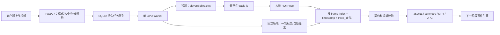

# RallyMate 模型训练、微调与部署实施方案

版本：1.0  
日期：2026-07-31  
范围：流程图第一阶段“关键对象与身体姿态感知”及其生产交付边界

## 1. 结论

当前仓库已经从离线 Demo 扩展为一条可以部署的单 GPU 视觉服务链路：

1. 上传端校验视频后创建异步任务。
2. 持久化队列保证 API 重启后任务仍在，Worker 租约超时后可以重试。
3. GPU Worker 启动时加载一次检测模型和 Pose 模型，任务之间复用。
4. 每个任务逐帧保留目标框、对象 ID、COCO-17 骨架、固定场地标定和时间戳。
5. 结果经契约校验后输出 `frames.jsonl`、`summary.json`、标注视频和预览图。
6. 训练工具覆盖数据治理、标签审计、防泄漏切分、微调、测试集评测、
   ONNX/TensorRT 导出、指标门禁和不可变模型登记。

目前可直接用于内部试点或单场馆部署。要成为面向客户的商业产品，仍必须获得
自有授权训练数据、完成模型许可证选择、补齐监控/备份/隐私运营机制，并用
独立测试集证明精度。代码把这些条件设计成显式门禁，不把“程序能运行”等同于
“模型已达到商业精度”。

## 2. 本项目负责的边界

本阶段负责：

- 视频质量和可处理性检查；
- `player / ball / racket` 检测；
- 人员、球和球拍的基础跨帧 ID；
- 人员 ROI 内姿态估计并映射回原图；
- 固定机位场地四点标定或自动可见区域提示；
- 同一帧、同一时间基准下合并对象、骨架和场地；
- 向下一阶段交付经过校验的逐帧观察结果。

本阶段不负责：

- 击球、引拍、随挥、恢复等动作事件判定；
- 赛制、战术和技术评分；
- 3D 球速、旋转和精确落点；
- 用户、订单、计费、分享页面等完整平台功能。

下一阶段应只依赖本阶段的公开契约，不直接依赖模型内部张量或 Ultralytics
对象。这样检测/Pose 模型可以替换为 ONNX、TensorRT 或其他自研模型，而事件
引擎无需改写。

## 3. 已实现的生产链路



代码位置：

| 能力 | 实现 |
|---|---|
| 视觉主链路 | `src/rallymate_vision/pipeline.py` |
| 检测和 Pose 级联 | `src/rallymate_vision/inference.py` |
| 固定场地处理 | `src/rallymate_vision/court.py` |
| API | `src/rallymate_service/api.py` |
| 持久队列 | `src/rallymate_service/database.py` |
| 常驻 GPU Worker | `src/rallymate_service/worker.py` |
| 数据准备 | `src/rallymate_training/dataset.py` |
| 训练/评测/导出 | `src/rallymate_training/engine.py` |
| 模型登记 | `src/rallymate_training/registry.py` |
| 容器编排 | `deploy/docker-compose.yml` |

### 3.1 为什么检测与 Pose 这样关联

两个模型不是简单并排运行，也不直接合并权重。整帧检测模型先找到人员并分配
`track_id`；Pose 只处理人员 ROI；关键点再从 ROI 坐标映射到原图；最终：

```text
pose.person_track_id == player_detection.track_id
```

优势：

- 远端球员在整帧中的像素更少，裁剪后 Pose 输入更有效；
- 多人场景不会把骨架归属混在一起；
- 下一阶段能按同一个球员 ID 组成时间序列；
- 检测和 Pose 可以独立训练、独立版本化、独立回滚。

### 3.2 如何同时保留骨架和场地

骨架和场地是两个并行特征分支，不互相覆盖。每条 `frames.jsonl` 记录同时包含：

- `detections[]`：对象框、中心、类别、置信度、`track_id`；
- `poses[]`：原图坐标下的 17 个关键点和 `person_track_id`；
- `court`：场地多边形、可用性、标定矩阵和标定年龄；
- `frame.timestamp_ms`：源视频时间基准。

固定场地的推荐方式是首次安装时由运营人员点击双打场地外侧四角，计算图像到
标准网球场的单应矩阵，之后整个机位复用。代码中的
`manual_polygon_role=court_outer_doubles_corners` 会返回
`status=calibrated`；`refresh_policy=once` 表示只初始化一次。

自动场地分支的定位是“无人值守安装提示/兜底”，不是每帧重新猜场地。自动识别
成功后同样冻结。如果摄像机被移动，应创建新的 `camera_calibration_version`，
而不是静默沿用旧矩阵。

## 4. 数据设计

### 4.1 数据目录

Ultralytics 数据采用标准镜像目录，图片和标签路径必须一一对应：

```text
dataset/
  images/
    session-001/frame-000001.jpg
  labels/
    session-001/frame-000001.txt
```

训练清单 CSV 至少包含：

| 字段 | 作用 |
|---|---|
| `image_path` | 原图路径 |
| `label_path` | YOLO 标签路径 |
| `session_id` | 一次连续拍摄/比赛 |
| `subject_id` | 主要球员匿名 ID |
| `camera_id` | 固定机位版本 |
| `consent` | 明确授权状态 |
| `license` | 自有、采购或其他可用权利 |
| `split` | 可选的 train/val/test 固定分配 |

准备工具会检查：

- 图像和标签是否存在；
- 标签列数、类别、有限数值和归一化范围；
- Pose 可见度是否在 `0..2`；
- 是否存在明确授权；
- `images/` 与 `labels/` 路径是否镜像；
- 同一场次或同一球员是否跨训练/验证/测试集合。

这里的防泄漏很重要。把同一视频的相邻帧随机拆到训练集和测试集，会得到看似
很高但没有泛化意义的指标。

### 4.2 标签体系

第一版目标检测固定为三类：

```text
0 player
1 ball
2 racket
```

Pose 第一版沿用 COCO-17，先解决稳定性和遮挡问题。输出时映射到现有 J 系统。
后续若评分确实依赖脚尖、脚跟、骨盆中心、手指或拍面，应新建
`tennis-pose-v2`，不要在 COCO-17 坐标上伪造这些点。

建议的第二版关键点：

- 身体：COCO-17 + 颈部 + 骨盆中心 + 左右脚跟/脚尖；
- 球拍：拍头顶部、拍头左右侧、拍喉、握把底；
- 可选：持拍手掌中心。

球拍关键点最好做独立小模型，因为身体骨架和刚体球拍的标注语义、尺度和遮挡
规律不同。

### 4.3 数据量规划

以下是工程预算区间，不是精度承诺：

| 阶段 | 检测标注帧 | Pose 人员实例 | 机位/环境 | 目标 |
|---|---:|---:|---:|---|
| 可用性验证 | 5,000–8,000 | 3,000–5,000 | 3–5 | 找到主要失败模式 |
| 场馆试点 | 20,000–30,000 | 10,000–15,000 | 10–20 | 覆盖服装、光照、遮挡 |
| 商业泛化 | 50,000–100,000 | 25,000–50,000 | 30+ | 独立场馆和球员测试 |

不应等间隔盲目抽取大量相似帧。训练集优先保留：

- 球靠近球拍、球网、白线和人体的困难帧；
- 运动模糊、逆光、阴影、夜场、不同球场颜色；
- 远端球员、小球、部分遮挡和出画；
- 没有球/球拍的困难负样本；
- 模型高置信误检和低置信漏检。

评测仍使用完整连续片段，不能用训练时的稀疏抽帧代替视频级检验。

## 5. 完整训练与微调路径

### 5.1 阶段 A：基线冻结

目的：保存当前通用模型在固定测试集上的结果，建立可比较基准。

产物：

- 固定的测试视频清单；
- 当前 `yolo26n.pt` 和 `yolo26n-pose.pt` 的摘要；
- 检测 AP、召回率、Pose 指标和视频级覆盖率；
- 球员/球/球拍/场地的失败案例集。

### 5.2 阶段 B：目标检测微调

配置：`training/configs/detect.yaml`

推荐顺序：

1. 用通用检测权重初始化，三类数据重新训练检测头和骨干。
2. 输入尺寸从 1280 开始；小球召回仍不足时测试切片推理或更大尺寸。
3. 将漏球、球拍与肢体混淆、白线误检加入 hard-negative 数据。
4. 在完全独立的球员、场次和机位测试集上评测。
5. 先优化球和球拍召回，再根据事件引擎误报调整 precision。

第一版生产门禁配置为：

- `mAP50-95 >= 0.42`
- `precision >= 0.80`
- `recall >= 0.75`

还必须增加逐类门禁，特别是 `ball recall` 和 `racket recall`。全局平均值不能
掩盖小球类别失败。

### 5.3 阶段 C：Pose 微调

配置：`training/configs/pose.yaml`

Pose 仍在检测到的人员 ROI 上运行。微调数据应包含完整击球动作、远近两端球员
和遮挡；不能只标姿势清晰的宣传素材。

第一版门禁：

- `mAP50-95 >= 0.48`
- `precision >= 0.82`
- `recall >= 0.78`
- 左右腕、肘、肩、髋、膝、踝的 PCK/OKS 单项达标；
- 视频中关键点抖动和左右翻转次数低于阈值。

第二版自定义骨架需要新模型名、新契约版本和映射表，不能用旧版本号覆盖。

### 5.4 阶段 D：时序稳态验证

单帧 AP 达标不代表视频可用。必须在完整连续片段上测：

- `player ID switch / minute`；
- 球轨迹有效覆盖率和最大连续丢失帧数；
- 球拍连续覆盖率；
- 关键点速度/加速度异常尖峰；
- 左右肢体交换次数；
- 场地标定重投影误差；
- 下一阶段击球事件的输入就绪率。

当前 `SimpleMultiClassTracker` 是接口桥接实现。商业版本建议将人员换成
ByteTrack/BoT-SORT 类方案并加入外观特征；球使用运动模型和候选重连，不要与
人员共用同一套门限。

### 5.5 阶段 E：模型登记与晋级

模型从 `candidate` 到 `production` 必须具备：

- 不可变版本号；
- 权重 SHA-256；
- 训练配置；
- 数据集指纹；
- 验证/测试指标；
- 许可证状态；
- 质量门禁明细；
- 已知限制和回滚版本。

`rallymate_training.registry` 已实现这些核心约束。`--promote` 在任一质量门禁
失败时会拒绝执行，同一版本不能覆盖。

### 5.6 阶段 F：导出和一致性检查

先导出 ONNX，随后在部署 GPU 上构建 TensorRT Engine。每次导出都要用同一批
校准样本检查：

- 每类检测数量差异；
- 框 IoU、置信度差异；
- 关键点像素误差；
- 空输入和多人输入；
- FP32/FP16 精度漂移；
- 性能 P50/P95。

现有推理适配器通过模型路径加载权重，可逐步将 `.pt` 替换为 `.onnx` 或
`.engine`，下游 JSON 契约不变。

## 6. 训练命令

目标检测：

```powershell
$Python = ".\.venv\Scripts\python.exe"

& $Python -m rallymate_training.cli prepare `
  --manifest .\training\manifests\detect.csv `
  --output .\training\generated\detect `
  --task detect `
  --classes player,ball,racket

& $Python -m rallymate_training.cli train `
  --config .\training\configs\detect.yaml

& $Python -m rallymate_training.cli evaluate `
  --config .\training\configs\detect.yaml `
  --weights .\runs\training\rallymate-detect-v1\weights\best.pt `
  --split test
```

Pose：

```powershell
& $Python -m rallymate_training.cli prepare `
  --manifest .\training\manifests\pose.csv `
  --output .\training\generated\pose `
  --task pose `
  --classes player `
  --keypoints 17 `
  --keypoint-dims 3

& $Python -m rallymate_training.cli train `
  --config .\training\configs\pose.yaml
```

导出：

```powershell
& $Python -m rallymate_training.cli export `
  --config .\training\configs\detect.yaml `
  --weights <best.pt> `
  --format onnx

& $Python -m rallymate_training.cli export `
  --config .\training\configs\detect.yaml `
  --weights <best.pt> `
  --format engine
```

## 7. 部署设计

### 7.1 当前可部署形态

当前实现适合一台带 NVIDIA GPU 的服务器或固定场馆边缘主机：

```text
公网/内网入口
  -> API 容器（上传、鉴权、状态、结果下载）
  -> 共享 SQLite WAL 队列和数据卷
  -> 1 个 GPU Worker（模型常驻）
  -> 结果数据卷
```

为什么当前只建议一个 Worker：

- SQLite 队列为单节点设计；
- 一张 GPU 同时跑多个进程会争抢显存并放大 P95；
- 一个 Worker 内模型常驻，任务顺序执行更容易预测等待时间。

容器命令：

```powershell
Copy-Item .\deploy\.env.example .\deploy\.env
docker compose --env-file .\deploy\.env `
  -f .\deploy\docker-compose.yml up --build
```

### 7.2 API

| 接口 | 说明 |
|---|---|
| `GET /health/live` | 进程存活 |
| `GET /health/ready` | 模型、数据库、许可证和队列状态 |
| `POST /v1/jobs` | 上传视频并异步排队 |
| `GET /v1/jobs/{id}` | 查询 queued/running/succeeded/failed |
| `GET /v1/jobs/{id}/artifacts/{name}` | 下载结果 |

上传限制包括扩展名、空文件、最大字节数、可解码性和最大时长。API key 为空仅
适合本机开发；部署时必须设置长随机 Bearer token，并由 HTTPS 反向代理终止
TLS。

### 7.3 失败恢复

任务从 `queued` 原子地变为 `running`，记录 Worker、尝试次数和租约截止时间。
Worker 崩溃后，过期任务会回到队列；超过重试次数则标记失败。输出目录按
`job_id` 隔离，公开下载接口只允许白名单文件名。

当前未实现暂停/取消和逐帧进度百分比；试点 UI 应先展示排队、识别、完成、
失败四个状态。正式公网产品应加入心跳式进度、取消和清理策略。

### 7.4 扩展到多机

当并发超过单 GPU 节点容量时，保持 API 契约不变，替换基础设施：

| 单机试点 | 多机生产 |
|---|---|
| SQLite WAL | PostgreSQL |
| 本地数据卷 | S3/MinIO 对象存储 |
| 单 GPU Worker | 按 GPU 型号分组的 Worker 池 |
| 本地模型目录 | 模型仓库/制品库 |
| API key | OAuth/JWT、租户和配额 |
| 本地日志 | 集中日志、指标和追踪 |

数据库任务领取应使用 `SELECT ... FOR UPDATE SKIP LOCKED`；对象存储通过带时限
签名 URL 上传/下载，API 不再中转大文件。

## 8. 性能和真实等待时间

当前 RTX 5070 Ti、1080p/25fps、通用 nano 模型的完整实测：

| 视频 | 帧数 | 等待时间 | 处理速度 |
|---|---:|---:|---:|
| 近景 9 秒 | 225 | 20.42 秒 | 约 11.0 fps |
| 全场 13.44 秒，自动场地 | 336 | 25.90 秒 | 约 13.0 fps |
| 全场 13.44 秒，人工场地 | 336 | 23.83 秒 | 约 14.1 fps |

服务 API → 队列 → GPU → 回写的 12 个连续真实帧热态集成测试，任务内处理
耗时 1.822 秒。模型在 Worker 启动时加载，首次启动约需额外数秒；之后任务
复用同一组模型，不再把权重加载计入每个用户任务。

在当前 `.pt` 基线下，1 分钟 1080p/25fps 视频估计约 1.5–2 分钟，再加排队
等待。估算仅适用于相近分辨率、人数和模型。上线后必须按视频时长、像素数、
球员数和 GPU 建立 P50/P95 回归模型。

性能优化顺序：

1. 模型常驻和预热；
2. 关闭非必要标注视频；
3. 检测与 Pose 采用 FP16 TensorRT；
4. 在精度允许时调整输入尺寸；
5. 对多个 ROI 批量 Pose；
6. 视频解码和 GPU 推理解耦；
7. 多 GPU 按任务排队，而不是同一 GPU 启动多个抢占进程。

不能为了性能默认抽帧：球与球拍的接触可能只持续少量帧，事件检测需要完整
时间轴。只有经过下游事件召回验证，才能把抽帧作为特定套餐或预览模式。

## 9. 验收标准

### 9.1 代码和服务

- 所有单元测试通过；
- 真实视频 API → Worker → 输出链路通过；
- 每个输出通过 `validation.py`；
- 容器编排配置可解析；
- Worker 重启后任务可重试；
- 未授权文件和路径不能下载；
- 生产环境不允许 `development` 模型许可证状态。

### 9.2 模型

- 独立球员、场次、机位测试集；
- 检测/Pose 全局和逐类/逐关键点指标过门禁；
- 视频级 ID、连续丢失、抖动指标过门禁；
- 至少一次部署格式一致性测试；
- 模型卡、数据指纹、许可证和回滚版本齐全。

### 9.3 场地

- 固定机位四点标定保存版本；
- 标定重投影误差达到业务阈值；
- 摄像机移动检测或人工巡检；
- 标定变化不会覆盖历史版本；
- 自动场地失败不会伪装成 metric-ready。

## 10. 商业化仍欠缺什么

### P0：上线前必须完成

- 自有/明确授权的网球训练数据和隐私告知；
- Ultralytics 企业许可、完整 AGPL 合规，或替代推理/训练栈的法律决策；
- 各类别独立测试指标和视频级指标；
- HTTPS、正式鉴权、密钥管理、上传内容隔离；
- 数据保留/删除、备份恢复、审计日志；
- 模型误判提示和人工复核入口；
- 固定机位安装和重新标定 SOP。

### P1：场馆试点

- PostgreSQL、对象存储和集中监控；
- 任务进度、取消、限流、配额和清理；
- 摄像机/场馆/模型版本关联；
- 自动收集低置信和失败样本；
- 标注平台质检、双人复核和一致性统计；
- 灰度发布、A/B、影子测试和一键回滚。

### P2：规模化

- TensorRT/Triton 或等价推理服务；
- 多 GPU 调度与容量规划；
- 数据漂移、精度漂移和成本监控；
- 多租户、计费和服务等级；
- 跨地区数据合规和灾备。

## 11. 建议里程碑

| 周期 | 交付 |
|---|---|
| 第 1–2 周 | 标注规范、授权清单、固定测试集、场地安装 SOP |
| 第 3–5 周 | 首批检测/Pose 数据、基线评测、失败案例库 |
| 第 6–8 周 | 第一轮微调、视频级时序指标、模型登记 |
| 第 9–10 周 | ONNX/TensorRT、一致性与性能测试 |
| 第 11–12 周 | 单场馆试点、监控、回滚和隐私流程 |
| 后续 | 基于真实失败样本迭代，进入多机架构 |

真实周期取决于数据采集权利、标注团队和目标指标。代码链路已经具备启动这些
工作的接口，但没有业务数据时不应宣称已完成模型商业精度验证。

## 12. 本次验证记录

- 单元测试：26 项通过；
- 服务集成：真实网球视频连续 12 帧，上传、排队、GPU 推理、校验和状态回写
  全部成功；
- 集成输出：12 帧、58 个检测、24 组姿态，输出契约校验通过；
- 覆盖率：player 100%、Pose 100%、ball 83.33%、racket 58.33%、
  court region 100%；
- Docker Compose 配置解析通过；
- 原有完整视频回归：225/336 帧逐帧运行记录保留。

这些结果证明链路可运行，不替代业务测试集上的精度验收。
