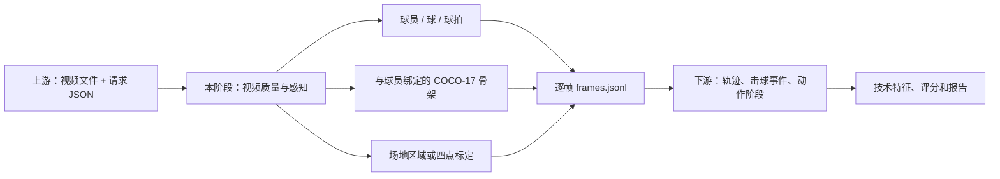
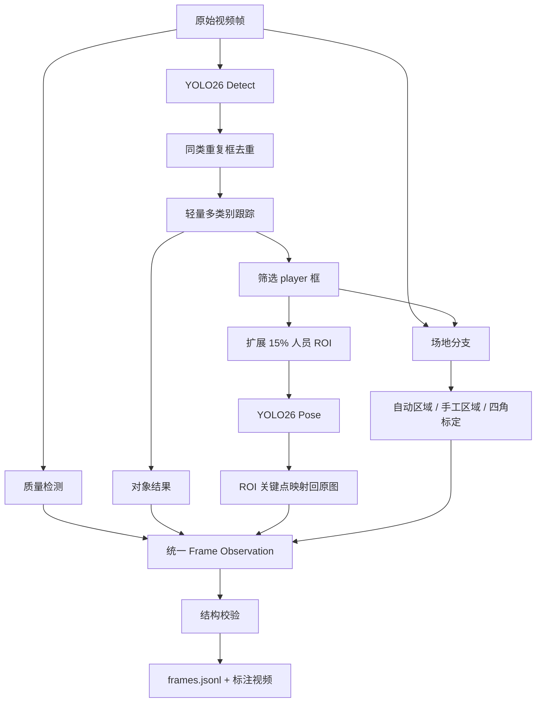
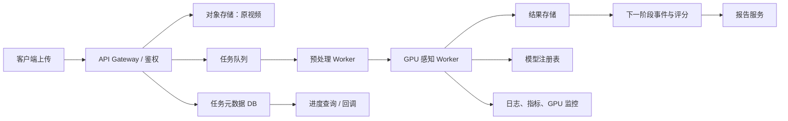

# RallyMate 第一阶段视觉感知

## 技术设计、代码逻辑与商业化路线

文档版本：1.0  
对应代码版本：当前工作区 Demo  
编写日期：2026-07-25  
负责范围：流程图第一阶段——让系统“看见”画面中的关键对象与身体姿态

---

## 1. 结论摘要

当前 Demo 已完成一条可运行、可检查、可交接的第一阶段视觉链路：

1. 读取上游视频与处理配置。
2. 检查视频规格、亮度、对比度和模糊度。
3. 检测球员、网球和球拍。
4. 给检测对象分配跨帧 `track_id`。
5. 对每个球员区域运行人体姿态模型。
6. 将姿态结果与对应球员绑定。
7. 独立检测场地可见区域，或接收人工四点信息。
8. 将对象、骨架和场地结果保存在同一个逐帧记录中。
9. 输出给下一阶段使用的 JSONL、汇总 JSON 和人工检查视频。
10. 对坐标、时间戳、关联外键和结果数量做自动校验。

当前实现已经是“工程 Demo”，但还不是可直接商业化的视觉产品。主要原因不是
链路没有跑通，而是：

- 使用的是通用 COCO 模型，不是网球专项模型。
- 只有少量集成测试视频，没有能够证明准确率的金标准数据集。
- 球、球拍、场地和扩展人体关键点仍缺少专项训练。
- 没有生产级任务服务、队列、存储、安全、监控和模型版本管理。
- Ultralytics 的商业许可和用户视频隐私合规必须在产品化前解决。

---

## 2. 我负责的“任务中的任务”

### 2.1 责任边界

你交给我的部分是原流程图中第一阶段的视觉感知层，不是整个评分系统。

| 环节 | 是否属于本阶段 | 说明 |
|---|---|---|
| 用户上传、账号、支付、报告页面 | 否 | 属于产品平台 |
| 视频解码和基础质量检查 | 是 | 作为视觉入口和拒绝低质量输入的依据 |
| 球员、球、球拍检测 | 是 | 输出逐帧对象位置与置信度 |
| 人体关键点 | 是 | 输出与球员绑定的骨架 |
| 场地区域/球场标定 | 是 | 输出区域提示或标定矩阵 |
| 最小跨帧 ID | 是 | 用于保证人员和 Pose 的稳定关联 |
| 球轨迹、击球时刻、动作阶段 | 否 | 属于下一阶段时序事件引擎 |
| GS/FS/RS/DS/NS/SS/TS 技术评分 | 否 | 属于特征、规则和评分层 |
| 等级映射与报告生成 | 否 | 属于评分与产品输出层 |

需要特别说明：代码中存在一个轻量跟踪器，但它只是本阶段的“身份桥梁”，保证
`pose.person_track_id` 能稳定指向球员；它不是流程图第二阶段完整的球轨迹和
事件识别系统。

### 2.2 上游和下游



本阶段的承诺不是“直接给出技术分”，而是输出稳定、带置信度、有明确坐标系的
视觉事实。

---

## 3. 当前工程目录

```text
网球/
├─ contracts/
│  ├─ request.schema.json
│  ├─ frame-observation.schema.json
│  └─ summary.schema.json
├─ examples/
│  ├─ request.json
│  ├─ request-serve-full.json
│  ├─ request-match-auto.json
│  └─ request-match-manual.json
├─ scripts/
│  ├─ download_assets.py
│  ├─ enable_cuda.ps1
│  ├─ run_demo.ps1
│  ├─ run_tests.ps1
│  ├─ run_integration_tests.ps1
│  └─ validate_run.py
├─ src/rallymate_vision/
│  ├─ cli.py
│  ├─ contracts.py
│  ├─ pipeline.py
│  ├─ quality.py
│  ├─ inference.py
│  ├─ tracking.py
│  ├─ court.py
│  ├─ render.py
│  ├─ validation.py
│  └─ utils.py
└─ tests/
```

核心入口是 `src/rallymate_vision/pipeline.py` 中的 `run_pipeline()`。

---

## 4. 总体架构

### 4.1 单帧数据流



### 4.2 为什么对象和 Pose 使用级联方式

当前不是把 YOLO Detect 和 YOLO Pose 的权重合并成一个网络，而是：

```text
整帧目标检测
  -> 获得球员框和 track_id
  -> 按球员框裁剪 ROI
  -> ROI 批量运行 Pose
  -> 将关键点坐标加回 ROI 偏移量
  -> pose.person_track_id = player.track_id
```

这样设计有四个目的：

1. Pose 只看球员区域，小球、球网、观众等背景对姿态的干扰更少。
2. 多人画面中，每组骨架天然归属于一个球员。
3. 输出可以用 `person_track_id` 直接和检测结果做外键连接。
4. 后续可单独替换检测模型或 Pose 模型，不改变下游 JSON 契约。

Ultralytics 官方 Pose 文档说明默认 YOLO26 Pose 使用 COCO 的 17 个关键点，并
通过 `result.keypoints` 和 `result.boxes` 返回实例级结果：
[Ultralytics Pose 文档](https://docs.ultralytics.com/tasks/pose)。

---

## 5. “同时保留骨架预测和场地预测”是怎么实现的

### 5.1 不是互斥模型

骨架分支和场地分支是两个独立计算分支：

- 骨架分支：依赖 `player` 检测框。
- 场地分支：主要依赖原始图像，只使用人员框做近景遮挡校验。
- 两个分支不会修改对方的输出。
- 最终都写入同一个 `record`：

```json
{
  "frame": {
    "index": 100,
    "timestamp_ms": 4000,
    "width": 1920,
    "height": 1080
  },
  "detections": [],
  "poses": [],
  "court": {}
}
```

其中：

- `poses[]` 保存球员骨架。
- `court` 保存场地区域或标定信息。
- `detections[]` 保存球员、球和球拍。

三者共享：

- 同一个源视频帧编号。
- 同一个 `timestamp_ms`。
- 同一个原图像素坐标系。
- 同一个 `0..1` 归一化坐标系。

因此下游不需要再做时间同步。

### 5.2 为什么场地不必每帧都运行

对于固定机位，场地在时间维度上并不难：它不会随球员动作变化。真正的难点只在
第一次把透视图像中的白线对应到正确的球场语义点；一旦相机和焦距不变，区域或
单应矩阵应该整段复用。

代码现在提供三种刷新策略：

| `court.refresh_policy` | 固定机位行为 |
|---|---|
| `once` | 只初始化一次，适合人工区域或人工四角 |
| `until_usable` | 自动模式按间隔重试，第一次成功后立即冻结 |
| `interval` | 按间隔持续刷新，只适合相机可能变化的兼容模式 |

`processing.court_every_n_frames` 在 `until_usable` 下只是自动识别失败后的重试
间隔，不代表识别成功后还会重复计算：

```text
第一帧
  -> 尝试识别或载入人工场地
识别未成功
  -> 每 N 个处理帧重试
第一次成功
  -> 冻结 latest_court
后续所有帧
  -> 复用同一个 court，并更新 age_frames
```

这样既保留了每一帧都有 `court` 数据的契约，又避免每帧重复运行较重的传统视觉
处理。

本次全场自动 Demo 在第 0 帧识别成功，最后一帧仍复用
`observed_at_frame=0` 的场地结果。人工区域同样只在第 0 帧初始化。

如果相机摇移、变焦、支架被碰动或视频切镜，生产版本必须通过特征点/球场线
重投影监测相机变化，并在变化时强制重新标定。

### 5.3 当前是顺序执行，不是 GPU 并发

Demo 在一个 Python 进程中按顺序执行检测、Pose 和场地分支。这里的“同时保留”
指数据层同步保留，不是三个模型在 GPU 上真正并行。

商业版本可将：

- 视频解码放到独立线程；
- Detect 和 Pose 导出 TensorRT；
- 多个视频任务做动态批处理；
- CPU 场地预处理和 GPU 推理重叠执行。

但在 Demo 阶段，顺序执行更容易调试，也更容易保证帧序不乱。

---

## 6. 各代码模块的实现逻辑

## 6.1 `contracts.py`：上游输入边界

`load_request()` 负责：

- 解析 JSON。
- 检查版本号和 `job_id`。
- 以请求文件目录解析相对路径。
- 检查起止时间、步长、最大人数。
- 检查检测和 Pose 阈值是否在 `0..1`。
- 检查人工四点是否是四个 `0..1` 坐标。
- 检查场地模式是否合法。

场地有三种模式：

| 模式 | 行为 |
|---|---|
| `auto` | 自动寻找场地表面和白线区域 |
| `manual` + `visible_region` | 接收一个人工可见区域，不宣称米制标定 |
| `manual` + `court_outer_doubles_corners` | 四点按远左、远右、近右、近左输入，输出单应矩阵 |
| `disabled` | 不执行场地分支 |

正式输入定义位于 `contracts/request.schema.json`。

## 6.2 `quality.py`：视频可用性

视频级检查：

- 分辨率。
- 帧率。
- 总帧数和时长。

逐帧检查：

- 灰度均值作为亮度。
- 灰度标准差作为对比度。
- Laplacian 方差作为清晰度/模糊度代理。

当前阈值：

- 亮度低于 45：`too_dark`。
- 亮度高于 220：`overexposed`。
- 对比度低于 25：`low_contrast`。
- 模糊分数低于 45：`blurry`。
- 低于 50fps：提示不适合高质量小球追踪。

这些阈值是工程启发式，不是经过数据标定的产品阈值。生产版本应使用真实失败
数据重新标定，并区分“警告”和“拒绝分析”。

## 6.3 `inference.py`：对象检测

检测模型：`yolo26n.pt`。

只保留 COCO 中三类：

| COCO 类别 | 输出别名 |
|---|---|
| `person` | `player` |
| `sports ball` | `ball` |
| `tennis racket` | `racket` |

每个对象输出：

- `bbox_px`
- `bbox_normalized`
- `center_px`
- `center_normalized`
- `confidence`
- `track_id`
- 对应的下游系统标签

所有坐标都会限制在画面边界内。

### 检测框去重

真实测试中，YOLO 曾在同一帧对同一个球员输出两个高度重合的框，并导致人员 ID
切换。代码增加了同类去重：

- `player`：IoU ≥ 0.82，或较小框有 90% 以上被另一框包含。
- `racket`：IoU ≥ 0.85。
- `ball`：IoU ≥ 0.92。

按置信度从高到低保留框，低置信度重复框被删除。

## 6.4 `tracking.py`：最小身份跟踪

跟踪器只在同类别之间匹配。

候选门限：

- 球允许更大的中心移动距离：0.28 个画面对角线。
- 其他类别：0.16 个画面对角线。

匹配代价：

```text
cost = 0.65 × (1 - IoU) + 0.35 × normalized_center_distance
```

代价最小的轨迹获得当前检测。

允许丢失的处理帧数：

| 类别 | 最大丢失帧 |
|---|---:|
| player | 30 |
| racket | 12 |
| ball | 8 |

这是为了让球员短暂漏检时仍保持身份。当前算法没有外观特征、运动模型和全局匹配，
适合 Demo 和人数较少的固定机位，不适合复杂多人遮挡。

## 6.5 `inference.py`：Pose 关联

处理步骤：

1. 按球员框面积从大到小排序。
2. 最多选取 `max_players` 个球员。
3. 人员框四周扩展 15%。
4. 将多个 ROI 作为列表批量传给 Pose 模型。
5. 每个 ROI 内选择置信度最高的人体实例。
6. 将 ROI 内坐标加回裁剪框左上角偏移。
7. 限制坐标在原图边界。
8. 写入 `person_track_id`。

关联不是通过 Pose 框和 Detect 框再次做 IoU 猜测，而是在裁剪时就确定：

```python
pose["person_track_id"] = player["track_id"]
```

因此同一帧的 Pose 外键是确定性的。

## 6.6 COCO-17 与 J 系统映射

| COCO 索引 | COCO 名称 | RallyMate J 编号 |
|---:|---|---|
| 0 | Nose | J004 |
| 1 | Left Eye | J008 |
| 2 | Right Eye | J009 |
| 3 | Left Ear | J006 |
| 4 | Right Ear | J007 |
| 5 | Left Shoulder | J033 |
| 6 | Right Shoulder | J034 |
| 7 | Left Elbow | J101 |
| 8 | Right Elbow | J121 |
| 9 | Left Wrist | J103 |
| 10 | Right Wrist | J123 |
| 11 | Left Hip | J071 |
| 12 | Right Hip | J072 |
| 13 | Left Knee | J141 |
| 14 | Right Knee | J161 |
| 15 | Left Ankle | J143 |
| 16 | Right Ankle | J163 |

当前无法直接覆盖：

- 头顶、下巴、颈根、胸部、脊柱、骨盆中心。
- 手掌和手指。
- 脚跟、前脚掌和脚尖。
- 文档中的完整 J、L 和 K 系统。

L 长度和 K 运动学不应在当前模型输出中伪造；应由更完整的关键点和连续帧在下游
计算。

## 6.7 `court.py`：场地分支

### 自动模式

自动模式不是训练出来的球场关键点模型，而是一个保守的传统视觉基线。

第一步：寻找场地表面

1. 将图像转换为 Lab 颜色空间。
2. 从画面下部中央区域取颜色中位数。
3. 找到颜色距离相近的像素。
4. 做开闭运算去噪和连接区域。
5. 选择面积足够大、位于下半部、连接到前景的最大连通区域。

第二步：寻找候选白线

1. CLAHE 增强局部对比度。
2. Gaussian Blur。
3. Canny 边缘。
4. Probabilistic Hough Lines。
5. 只保留至少 55% 落在场地表面邻域中的线段。
6. 检查线亮度和相对周围区域的局部对比度。

第三步：几何校验

自动结果必须同时满足：

- 至少 5 条有效线段。
- 多边形面积占画面的 3%～85%。
- 至少两组方向。
- 平均局部亮度差达到要求。
- 区域延伸到合理的画面下部。
- 最大球员框面积低于画面的 14%，避免近景人体/围网伪装成球场。
- 综合置信度不低于 0.58。

失败时返回 `uncertain` 或 `absent`，而不是强行输出可用球场。

自动模式输出：

- `region_usable`：是否可作为可见区域提示。
- `calibration_usable=false`：不能直接当作米制球场。
- 线段、多边形和诊断字段。

### 人工可见区域

`manual_polygon_role=visible_region` 时，四点只表示一个人工确认的可见区域：

- `region_usable=true`
- `calibration_usable=false`

### 外侧双打场四角

`manual_polygon_role=court_outer_doubles_corners` 时，四点顺序必须为：

1. 远端左角
2. 远端右角
3. 近端右角
4. 近端左角

代码使用 `cv2.getPerspectiveTransform()` 生成：

```text
homography_image_to_court_normalized
```

它把图像坐标映射到标准化球场矩形 `[0,1] × [0,1]`，并附带标准双打场长度
23.77m、宽度 10.97m。只有这个模式会设置：

```text
calibration_usable=true
```

商业版本还必须校验四点顺序、重投影误差和镜头是否移动。

## 6.8 `pipeline.py`：统一编排

简化伪代码如下：

```python
request = load_request()
metadata = probe_video()
load_detect_and_pose_models()

for frame in selected_video_frames:
    quality = analyze_frame(frame)

    detections = detect(frame)
    detections = deduplicate(detections)
    detections = tracker.update(detections)

    players = select_players(detections)
    poses = estimate_pose_on_player_rois(frame, players)

    if court_refresh_is_due:
        latest_court = detect_court(frame, players)
    court = reuse_latest_court_with_age()

    record = merge(frame, quality, detections, poses, court)
    validate_frame_observation(record)
    write_jsonl(record)
    write_annotated_frame(record)

summary = aggregate_run_metrics()
validate_all_artifacts()
write_summary()
```

## 6.9 `validation.py`：逻辑验收

逐帧校验：

- 版本号正确。
- 帧宽高和时间戳有效。
- `track_id` 是正整数且同帧不重复。
- 检测框不越界、不反向。
- 归一化坐标在 `0..1`。
- 每组 Pose 恰好有 17 个点。
- `person_track_id` 必须指向同帧 `player`。
- 每个 Pose 点都有 J 系统编号。
- 场地归一化坐标不越界。
- 只有 `status=calibrated` 才允许
  `calibration_usable=true`。

整次运行校验：

- `frames.jsonl` 每一行都是合法 JSON。
- 时间戳严格递增。
- 汇总帧数与 JSONL 实际行数一致。
- 至少输出一帧。

校验失败会直接让任务失败，而不是生成一个表面上“completed”的坏结果。

---

## 7. 输入输出契约

### 7.1 输入

```json
{
  "schema_version": "1.0.0",
  "job_id": "job-123",
  "source": {
    "video_path": "../data/video.mp4"
  },
  "output": {
    "directory": "../runs/job-123"
  },
  "models": {
    "detect": "../models/yolo26n.pt",
    "pose": "../models/yolo26n-pose.pt",
    "device": "auto",
    "detect_imgsz": 960,
    "pose_imgsz": 640
  },
  "processing": {
    "frame_stride": 1,
    "max_players": 2,
    "court_every_n_frames": 25
  },
  "court": {
    "mode": "auto"
  }
}
```

### 7.2 输出

每次运行产生：

| 文件 | 用途 |
|---|---|
| `frames.jsonl` | 下一阶段的逐帧结构化输入 |
| `summary.json` | 质量、覆盖率、耗时、能力就绪状态 |
| `annotated.mp4` | 人工检查对象、骨架和场地 |
| `preview.jpg` | 首帧预览 |

逐帧核心结构：

```json
{
  "frame": {
    "index": 0,
    "timestamp_ms": 0,
    "width": 1920,
    "height": 1080
  },
  "detections": [
    {
      "class_name": "player",
      "track_id": 1,
      "bbox_px": [669.1, 192.1, 1253.3, 1078.9]
    }
  ],
  "poses": [
    {
      "person_track_id": 1,
      "keypoint_format": "coco17",
      "keypoints": [
        {
          "name": "nose",
          "downstream_joint_id": "J004",
          "x_px": 1013.4,
          "y_px": 278.9,
          "confidence": 0.998
        }
      ]
    }
  ],
  "court": {
    "status": "uncertain",
    "region_usable": false,
    "calibration_usable": false
  }
}
```

### 7.3 就绪状态

`summary.next_stage` 不使用一个模糊的布尔值代表所有能力：

| 字段 | 含义 |
|---|---|
| `ready_for_hit_event_detection` | 人员、Pose、球和球拍达到最低覆盖 |
| `ready_for_court_region_events` | 还具有可用场地区域 |
| `ready_for_metric_court_metrics` | 还具有可信四点标定 |
| `all_stage1_capabilities_ready` | 本阶段完整能力全部可用 |

下游必须读取能力字段，不能因为任务完成就默认所有指标都能计算。

---

## 8. 已完成的测试与实测结果

### 8.1 自动测试

当前包含 18 项单元测试，覆盖：

- 输入路径和参数校验。
- 人工区域和标定单应性。
- 自动场地近景降级。
- 对象跟踪和跨类别 ID。
- 重复人员框去重。
- Pose 与球员外键。
- 坐标范围。
- 输出时间和数量一致性。

端到端脚本会运行：

1. 近景发球。
2. 全场自动区域。
3. 全场人工可见区域。
4. 每个输出目录的独立复检。

### 8.2 实测数据

机器：

- RTX 5070 Ti
- PyTorch 2.11.0 + CUDA 12.8
- Ultralytics 8.4.21

| 场景 | 处理帧 | 完整等待 | 人员 | Pose | 球 | 球拍 | 场地区域 |
|---|---:|---:|---:|---:|---:|---:|---:|
| 近景快速检查，步长 5 | 45 | 约 9 秒 | 100% | 100% | 68.9% | 64.4% | 0% |
| 近景默认逐帧 | 225 | 20.42 秒 | 100% | 100% | 63.1% | 60.0% | 0% |
| 全场自动逐帧 | 336 | 25.90 秒 | 100% | 97.9% | 95.8% | 45.5% | 100% |
| 全场人工区域逐帧 | 336 | 23.83 秒 | 100% | 97.9% | 95.8% | 45.5% | 100% |

225 帧近景测试中，主球员 `track_id=1` 全程未切换。

这些百分比是“某类在多少处理帧中出现”，不是准确率、召回率或 mAP。它们只能
证明链路可运行，不能证明模型已经达到商业质量。

---

## 9. 当前不足及其根本原因

## 9.1 球

当前问题：

- COCO `sports ball` 不是网球专项小目标模型。
- 远处球只有几个像素。
- 运动模糊和球场线会造成漏检。
- 全场练习视频中，地上的静止球也会被检测。
- 当前跟踪没有速度和抛物线约束，无法确认哪一个是比赛球。

因此当前能输出“球候选”，不能稳定输出唯一活动球轨迹。

## 9.2 球拍

当前只有通用球拍矩形框，无法提供文档中的：

- RK001 拍头顶部。
- RK002/RK003 拍框左右。
- RK005 甜区中心。
- 三角区和拍柄关键点。
- 拍面朝向。

球拍在全场视频中像素很小；逐帧测试覆盖率为 45.5%，仍不足以支撑连续、精确的
挥拍分析。

## 9.3 人体

COCO-17 对肩、肘、腕、髋、膝、踝有帮助，但无法直接支撑：

- 脚步支撑方式和脚尖方向。
- 握拍与手指关系。
- 肩胛、胸椎、腰椎和骨盆精细转动。
- 文档中的完整长度系统和动力链。

单目 2D Pose 还存在遮挡、左右翻转、深度歧义和透视缩短。

## 9.4 球场

当前自动场地只是可见区域启发式：

- 会受地面颜色、阴影、广告、球网、相机角度影响。
- 不能识别每一条底线、单打线、双打线、发球线和中线。
- 不能在相机移动后保持同一单应性。
- 没有自动输出米制坐标。

## 9.5 跟踪

当前跟踪器：

- 没有 Kalman Filter。
- 没有匈牙利全局匹配。
- 没有外观 ReID。
- 没有相机运动补偿。
- 没有处理长时间遮挡后的身份恢复。

Ultralytics 本身提供视频多目标跟踪接口，可作为替换参考：
[Ultralytics Track 文档](https://docs.ultralytics.com/modes/track)。

## 9.6 输入质量

当前测试是 1080p/25fps。25fps 可以做人体和基础动作，但对以下目标不理想：

- 高速球速度。
- 击球接触帧。
- 拍面角度。
- 球旋转。

商业采集规范应至少区分：

- 普通用户模式：1080p、30fps，输出基础技术信息。
- 推荐模式：1080p、60fps，输出更可靠事件和球轨迹。
- 高速模式：120fps 或更高，才讨论接触细节和旋转估计。

---

## 10. 后续技术改进方案

## 10.1 P0：把通用模型变成网球专项感知

### A. 活动球专项模型

建议：

1. 标注连续视频片段，而不是只标独立帧。
2. 训练小目标网球检测器。
3. 保留多个球候选。
4. 使用时序连续性、速度、方向和抛物线筛选活动球。
5. 对短时漏检使用 Kalman/运动模型插值。
6. 输出 `observed` 与 `predicted` 状态，不能把预测点伪装成实测点。

目标输出：

- BALL-010 球中心。
- BALL-014 可见性。
- BALL-015 置信度。
- 为下一阶段准备连续轨迹候选。

### B. 球拍关键点模型

训练一个专用关键点或 OBB 模型，至少输出：

- 拍头顶部、左、右、底部。
- 甜区中心。
- 三角区中心。
- 握把顶部、中心和底部。

然后计算：

- 拍轴方向。
- 拍面近似朝向。
- 球与甜区的最近距离。
- 手腕与握把的关联。

### C. 球场关键点模型

用专门的球场关键点模型替换 Hough 基线，输出：

- 底线角点。
- 单打/双打边线交点。
- 发球线和中线交点。
- 球网平面。

用 RANSAC 求单应性，并输出：

- 重投影误差。
- 标定置信度。
- 每个点的可见性。
- 相机变化后的重标定状态。

### D. 扩展人体关键点

优先补充：

- 脚跟、前脚掌、脚尖。
- 手掌中心。
- 颈根、胸部中心、骨盆中心。
- 必要时的手指关键点。

不是简单把 COCO 点线性插值成 J 系统，而是训练或接入真实可观测的扩展关键点。

## 10.2 P1：提高时序稳定性

1. 球员使用 ByteTrack/BoT-SORT 类跟踪器。
2. 加入相机运动补偿。
3. 对 Pose 做时序平滑，但保留原始点与平滑点两套结果。
4. 建立遮挡状态和置信度衰减。
5. 给每个轨迹增加 `first_seen/last_seen/age/missed_count`。
6. 在镜头切换时结束旧轨迹，不能跨镜头错误续接。
7. 建立球员、球拍和持拍手的图结构关联。

## 10.3 P1：提升推理速度

官方 YOLO26 Pose 支持导出 ONNX、TensorRT、OpenVINO 等格式：
[Ultralytics Pose Export](https://docs.ultralytics.com/tasks/pose#export)。

建议路线：

1. Detect 和 Pose 分别导出 ONNX。
2. 在目标 GPU 上构建 TensorRT FP16 Engine。
3. 固定常用输入尺寸，减少动态 Shape 开销。
4. 一次解码多帧，按帧批处理 Detect。
5. 将多个球员 ROI 组成 Pose Batch。
6. CPU 场地处理与 GPU 推理重叠。
7. 模型常驻内存，避免每个任务重新加载。

NVIDIA 官方说明 TensorRT 用于优化和加速 GPU 推理，并支持混合精度、动态形状
和算子融合：[TensorRT 文档](https://docs.nvidia.com/deeplearning/tensorrt/latest/index.html)。

当前 225 帧任务完整耗时约 20.4 秒，其中 Detect 约 3.4 秒、Pose 约 3.2 秒、
场地重试约 1.1 秒；剩余时间包括模型加载、视频解码、质量计算、渲染、编码和
文件写入。全场固定机位自动模式第 0 帧成功后冻结，336 帧中场地计算只约
0.18 秒。
商业优化不能只盯模型推理，还要优化视频 I/O 和任务冷启动。

## 10.4 P2：3D 和高阶指标

如果产品需要：

- 球 Z 坐标。
- 拍面三维角度。
- 真实关节角度。
- 球速、过网高度和旋转。

则需要增加：

- 相机内参与畸变标定。
- 球场单应性和相机姿态。
- 单目 3D Pose 或双机位三角测量。
- 高帧率视频。
- 球的物理轨迹拟合。
- 每个三维指标的不确定度。

单机位、25fps、普通手机压缩视频不应承诺精确转速。

---

## 11. 专项数据建设方案

## 11.1 数据维度

必须覆盖：

- 室内/室外。
- 硬地、红土、人造草。
- 日照、阴影、夜场、灯光频闪。
- 固定后场、侧场、手持、轻微摇移。
- 近景、半场、全场。
- 单人、双人、多人干扰。
- 不同身高、体型、肤色、服装。
- 左手和右手持拍。
- 正手、反手、发球、截击、防守和高压。
- 球被身体、球拍、球网遮挡。
- 静止球、捡球、广告圆点等困难负样本。

## 11.2 标注层级

| 层级 | 标注内容 |
|---|---|
| 对象 | player、active_ball、inactive_ball、racket |
| 身份 | 球员轨迹 ID、活动球轨迹 ID |
| 人体 | J 系统可观测关键点和可见性 |
| 球拍 | RK 关键点、持拍手、拍轴 |
| 球场 | 固定语义关键点、球网 |
| 质量 | 模糊、过曝、遮挡、尺寸、可分析等级 |

## 11.3 数据切分

不能随机按帧切分。相邻帧高度相似，会造成数据泄漏。

应按以下单位切分训练、验证和测试：

- 球员。
- 拍摄场地。
- 拍摄设备。
- 视频会话。
- 比赛/训练日期。

保留一个从未参与调参的商业验收集。

## 11.4 建议的首轮数据规模

以下只是 MVP 规划起点，最终规模应根据学习曲线调整：

- 球连续轨迹：至少数百个视频片段、数万标注帧。
- 球拍关键点：约一万级清晰实例起步。
- 球场关键点：数千张、覆盖主要视角和场地类型。
- 扩展人体关键点：先复用通用数据，再补充一万级网球动作实例。

数据质量、困难样本比例和切分方式通常比单纯堆帧数更重要。

---

## 12. 正式评测体系

### 12.1 组件指标

| 组件 | 建议指标 |
|---|---|
| 人员/球拍检测 | Precision、Recall、mAP50-95 |
| 活动球 | 可见帧 Recall、小目标 Recall、轨迹连续率 |
| Pose | OKS、PCK、关键关节分组误差 |
| 跟踪 | IDF1、HOTA、ID Switch、轨迹完整率 |
| 球场 | 关键点像素误差、重投影误差 |
| 标定 | 米制位置误差、失败拒绝率 |
| 系统 | p50/p95 等待时间、失败率、GPU 成本 |

### 12.2 建议的产品验收门槛

下面是建议值，需要产品和教练共同确认：

- 目标机位球员 Recall ≥ 99%。
- 可见活动球 Recall ≥ 95%。
- 单回合主球员 ID Switch 接近 0。
- 球场关键点 1080p 中位误差 ≤ 5px，p95 ≤ 12px。
- 标定后落点中位误差 ≤ 0.2m，p95 ≤ 0.5m。
- 任何不可分析输入必须正确拒绝，不能输出伪精确结果。
- 生产任务成功率 ≥ 99.5%。
- 每个模型版本必须在固定回归集上不退化。

这些门槛不是当前 Demo 的实测成绩，而是后续商业化的建议验收线。

---

## 13. 商业化系统还缺什么

## 13.1 当前成熟度

| 能力 | 当前状态 | 商业化要求 |
|---|---|---|
| 单机离线链路 | 已完成 | 保留为研发和回归工具 |
| 网球专项准确率 | 未证明 | 专项数据、训练和独立测试 |
| 实时/批量服务 | 未实现 | API、队列、GPU Worker |
| 多租户 | 未实现 | 租户隔离、配额、计费 |
| 模型管理 | 未实现 | 版本、灰度、回滚、注册表 |
| 可观测性 | 部分耗时统计 | 日志、指标、追踪、告警 |
| 数据安全 | 未产品化 | 加密、鉴权、留存和删除 |
| 用户纠错闭环 | 未实现 | 人工校正、反馈、再训练 |
| 商业许可 | 未解决 | AGPL 开源或企业许可 |
| SLA/成本模型 | 未建立 | p95、容量和单分钟成本 |

## 13.2 推荐生产架构



生产任务至少要支持：

- 幂等 `job_id`。
- 任务排队、重试、取消和超时。
- 上传失败、视频损坏和模型失败的明确错误码。
- 分阶段进度。
- GPU 配额和优先级。
- 结果过期和自动删除。
- 同一模型版本的可重复运行。

## 13.3 推理服务

小规模 MVP 可以先用常驻 Python GPU Worker；并发增加后再采用 TensorRT +
Triton。

NVIDIA Triton 支持多框架、并发模型、动态批处理、HTTP/gRPC、健康检查和吞吐/
延迟指标：[Triton 文档](https://docs.nvidia.com/deeplearning/triton-inference-server/user-guide/docs/index.html)。

对本项目最有价值的是：

- 多个视频帧动态组成 Detect Batch。
- 多个球员 ROI 组成 Pose Batch。
- 模型常驻 GPU。
- 多模型并发。
- Readiness/Liveness。
- GPU 利用率、吞吐和延迟监控。

动态批处理主要提升吞吐，不一定降低单任务等待时间；需要用 p95 延迟预算调参，
不能盲目增大 Batch。

## 13.4 MLOps

必须补充：

- 数据集版本。
- 标注规范版本。
- 训练代码和随机种子。
- 模型权重校验和。
- 模型卡和已知失败场景。
- 自动离线评测。
- Canary/Shadow 灰度。
- 线上漂移和低置信度监控。
- 一键回滚。
- 错误样本进入人工复核和再训练池。

## 13.5 视频产品体验

商业体验不能只返回“处理中”：

1. 上传和转码。
2. 质量预检。
3. 对象和姿态识别。
4. 时序事件分析。
5. 评分和报告生成。

应在预检后尽早告诉用户：

- 是否需要重拍。
- 哪些指标可用。
- 哪些指标因角度、帧率或遮挡不可用。
- 预计剩余时间。

当前机器的参考：

- 9 秒逐帧视频约 20 秒。
- 5fps 抽样约 9 秒。
- 13.44 秒全场逐帧视频约 24～26 秒。
- 1 分钟 1080p/25fps 单人视频，逐帧约 1.5～2 分钟量级。

生产 SLO 必须以固定 GPU 和并发条件重新测量 p50/p95/p99。

---

## 14. 商业许可、隐私与风险

## 14.1 Ultralytics 许可

Ultralytics 官方许可页面说明：

- AGPL-3.0 适合愿意按 AGPL 开源完整相关项目的场景。
- 私有、闭源、SaaS、内部商业工具和商业产品需要评估企业许可。

官方说明：
[Ultralytics License](https://www.ultralytics.com/license)。

在商业决策前必须二选一：

1. 接受 AGPL-3.0 对项目开源的要求。
2. 购买并确认覆盖代码、模型和部署方式的企业许可。

也可以评估替换为许可更适合的推理框架和自有模型，但模型架构、训练代码、权重和
数据都要单独做许可证清单。最终结论应由法律顾问确认。

## 14.2 用户视频和人体关键点

用户视频、身体姿态、可能的面部信息和未成年人信息具有较高隐私风险。

《个人信息保护法》将生物识别信息以及不满十四周岁未成年人的个人信息列为敏感
个人信息，并对单独同意、必要性、严格保护措施和监护人同意提出要求。官方全文：
[国家市场监督管理总局转载的《个人信息保护法》](https://www.samr.gov.cn/zw/zfxxgk/fdzdgknr/bgt/art/2023/art_f374e8245320413181742e6d1baf4366.html)。

产品至少需要：

- 明确处理目的和必要性。
- 单独同意。
- 未满十四周岁用户的监护人同意和专门规则。
- 传输和静态存储加密。
- 最小权限和操作审计。
- 明确留存期限。
- 用户查询、下载和删除渠道。
- 训练数据二次使用的单独授权。
- 人脸匿名化或只保存派生关键点的选项。
- 数据跨境前的专门合规评估。

这不是法律意见，正式上线前应由专业法律顾问和安全团队审核。

## 14.3 训练指导与康复风险

你提供的后续规划包含关节灵活度和运动康复建议。商业产品必须区分：

- 网球技术反馈。
- 一般性训练建议。
- 医疗诊断、疼痛判断和康复处方。

当前单目视觉 Demo 只能作为技术观察工具，不能用于诊断。康复模块需要：

- 专业医疗/康复团队。
- 单独验证数据。
- 风险分级和禁忌。
- 明确免责声明。
- 高风险建议的人审。

---

## 15. 推荐实施路线

## 阶段 A：第一阶段视觉 Beta

目标：把本 Demo 变成可测量的网球视觉组件。

必须完成：

1. 固定首个支持机位和拍摄规范。
2. 建立网球专项金标准测试集。
3. 训练活动球模型。
4. 训练球拍关键点模型。
5. 训练球场关键点模型。
6. 扩展脚和手关键点。
7. 替换轻量跟踪器。
8. 建立组件指标和拒绝策略。
9. 明确 Ultralytics 许可路线。

退出条件：

- 指标达到第 12 节约定门槛。
- 对不可分析视频能够稳定拒绝。
- JSON 契约保持向后兼容。

## 阶段 B：服务化 MVP

目标：让内部或小规模测试用户稳定提交视频。

必须完成：

- 上传、对象存储、任务 DB 和队列。
- 常驻 GPU Worker。
- 重试、超时、取消和进度。
- 模型版本固定。
- 日志、监控和告警。
- 数据删除和同意流程。
- 100～500 个真实用户视频封闭测试。

## 阶段 C：商业 Beta

目标：验证准确率、体验和单位经济性。

必须完成：

- TensorRT/Triton 或同等推理优化。
- 并发和压测。
- 灰度发布和回滚。
- 用户纠错闭环。
- 教练评分一致性验证。
- 价格、GPU 成本和 SLA。
- 安全、隐私和许可证审查。

## 阶段 D：进入评分和报告

只有当第一阶段对对象、骨架和场地的误差可量化后，才应大规模构建：

- 击球事件。
- 动作阶段。
- FS 步伐。
- GS/RS/DS/NS/SS 技术评分。
- TS 战术。
- 等级和报告。

否则评分层会把视觉误差包装成看似精确的分数。

---

## 16. 建议的下一项开发工作

如果继续由我负责当前这一部分，优先级建议是：

1. **建立网球专项标注规范和金标准测试集。**
2. **实现活动球的时序筛选器，区分比赛球和地面静止球。**
3. **定义并训练 RK 球拍关键点。**
4. **实现语义球场关键点与自动单应性。**
5. **扩展脚部和手部关键点。**
6. **将轻量跟踪器替换为生产级多目标跟踪。**
7. **导出 TensorRT 并做批处理性能基线。**
8. **把当前 CLI 封装为异步任务 API。**

其中第 1 项最重要。没有可信数据集，后续模型选择和“准确率提升”都只能凭感觉。

---

## 17. 运行和复现

快速 Demo：

```powershell
Set-Location '<仓库根目录>'
.\scripts\run_demo.ps1
```

单元测试：

```powershell
.\scripts\run_tests.ps1
```

完整端到端回归：

```powershell
.\scripts\run_integration_tests.ps1
```

逐帧性能测试：

```powershell
.\scripts\run_demo.ps1 `
  -Request .\examples\request-serve-full.json
```

复检已生成结果：

```powershell
$env:PYTHONPATH = "$PWD\src"
.\.venv\Scripts\python.exe `
  .\scripts\validate_run.py .\runs\serve-full
```

---

## 18. 最终判断

目前的第一阶段已经解决了“怎么把两个模型和场地结果串起来，并输出给下一阶段”
这个工程问题：

- Detect 负责对象。
- Track ID 负责身份。
- ROI Pose 负责球员骨架。
- `person_track_id` 负责 YOLO 与 Pose 关联。
- 场地分支独立运行。
- 帧号、时间戳和原图坐标负责多分支同步。
- JSON Schema 和运行校验负责下游稳定性。

下一阶段最大的工作不是继续堆通用模型，而是把“通用可运行”升级成“网球专项可
测量”，再把它放入具有数据、安全、监控、许可和 SLA 的生产系统中。
